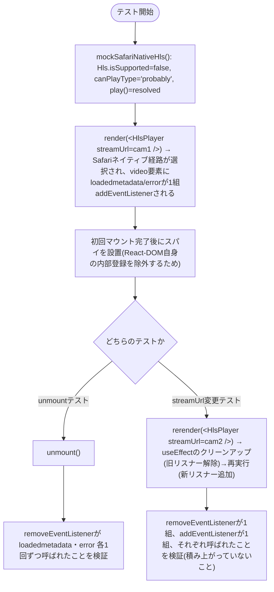
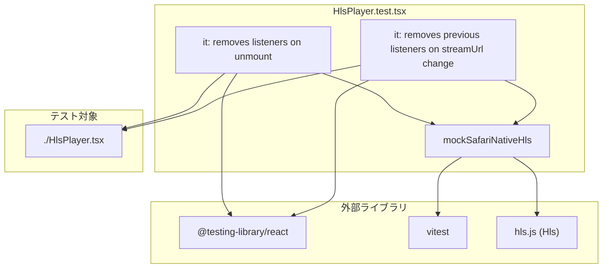

## 1. 解析メタ情報

| 項目 | 内容 |
| --- | --- |
| 対象ファイル | `family-quest/src/components/ui/HlsPlayer.test.tsx` |
| 言語 | React (TypeScript) / Vitest |
| 解析対象 | 提供されたコードのみ |
| 推測・補完 | 一切なし |

## 関連ドキュメント

* [./HlsPlayer.md](./HlsPlayer.md) - テスト対象コンポーネント本体

## 2. ファイルの概要

`HlsPlayer`(`./HlsPlayer.tsx`)のうち、`hls.js`非対応でSafariのネイティブHLS再生にフォールバックする経路(`video.canPlayType('application/vnd.apple.mpegurl')`が真の場合)に限定したVitestテスト。この経路は`video`要素に`loadedmetadata`/`error`リスナーを直接`addEventListener`しており、アンマウント時・`streamUrl`変更時に対になる`removeEventListener`が正しく呼ばれているか(Issue #295で指摘されたリーク懸念)を検証する。`hls.js`自体の再生ロジックはモックせず、`Hls.isSupported()`と`HTMLMediaElement.prototype.canPlayType`/`play`をスタブしてSafariネイティブ経路を強制的に選択させている。

## 3. 外部依存関係

### インポート一覧

| 名称 | 種類 | 用途 | 根拠 |
| --- | --- | --- | --- |
| `render`, `cleanup` | ライブラリ (`@testing-library/react`) | `HlsPlayer`のマウント/アンマウント/再レンダー | 根拠: [インポート宣言] (行番号: 1 / 抜粋: "import { render, cleanup } from '@testing-library/react';") |
| `afterEach`, `describe`, `expect`, `it`, `vi` | ライブラリ (`vitest`) | テストランナーAPI、スパイ/モック | 根拠: [インポート宣言] (行番号: 2 / 抜粋: "import { afterEach, describe, expect, it, vi } from 'vitest';") |
| `Hls` | ライブラリ (`hls.js`) | `Hls.isSupported()`をモックしてSafariネイティブ経路を強制する | 根拠: [インポート宣言] (行番号: 3 / 抜粋: "import Hls from 'hls.js';") |
| `HlsPlayer` | 内部モジュール (`./HlsPlayer`) | テスト対象コンポーネント | 根拠: [インポート宣言] (行番号: 4 / 抜粋: "import HlsPlayer from './HlsPlayer';") |

### ブラックボックスとなる外部要素

| 名称 | 理由 | 根拠 |
| --- | --- | --- |
| jsdomの`HTMLVideoElement`/`HTMLMediaElement`実装 | `addEventListener`/`removeEventListener`/`canPlayType`/`play`の実際の内部挙動はjsdom(テスト環境)依存であり、本ファイルからは実装詳細を読み取れない。 | 根拠: [`vi.spyOn(HTMLVideoElement.prototype, ...)`] (行番号: 35, 46-47 / 抜粋: "vi.spyOn(HTMLVideoElement.prototype, 'removeEventListener')") |
| React-DOM自身のメディアイベント委譲 | React-DOMは`<video>`マウント時に`loadedmetadata`/`error`を含む複数のメディアイベントを合成イベントシステムのため内部的に`addEventListener`する(本コンポーネントのロジックとは無関係)。この登録タイミング・実装はReact-DOM内部に依存し本ファイルからは読み取れない。テスト側はスパイを常に初回マウント完了後に張ることでこれを除外している。 | 根拠: [コメント] (行番号: 26-29 / 抜粋: "React-DOM自身も <video> のマウント時にloadedmetadata/error等の...合成イベントシステムのため...登録する") |

## 4. 主要要素の定義（関数 / エンドポイント / コンポーネント）

### `mockSafariNativeHls`

* **役割**: `Hls.isSupported()`を`false`に、`HTMLMediaElement.prototype.canPlayType('application/vnd.apple.mpegurl')`を`'probably'`(それ以外の型には空文字列)に、`HTMLMediaElement.prototype.play()`を解決済みPromiseにそれぞれモックし、`HlsPlayer`内部で「hls.js非対応・Safariネイティブ再生対応」の条件分岐(`else if (video.canPlayType(...))`)を強制的に選択させるヘルパー関数。
* 根拠: [関数定義] (行番号: 18-24 / 抜粋: "const mockSafariNativeHls = () => { vi.spyOn(Hls, 'isSupported').mockReturnValue(false); ...")

* **引数/リクエスト**: なし
* 根拠: [関数定義] (行番号: 18 / 抜粋: "const mockSafariNativeHls = () => {")

* **戻り値/レスポンス**: なし(`void`)
* 根拠: [関数定義] (行番号: 18-24)

* **副作用**: `Hls.isSupported`、`HTMLMediaElement.prototype.canPlayType`、`HTMLMediaElement.prototype.play`をそれぞれ`vi.spyOn`でモック実装に差し替える(グローバルなプロトタイプの書き換え。`afterEach`の`vi.restoreAllMocks()`で元に戻される)。
* 根拠: [`vi.spyOn`呼び出し] (行番号: 19-23 / 抜粋: "vi.spyOn(Hls, 'isSupported').mockReturnValue(false);")

* **エラーハンドリング**: なし
* 根拠: [関数定義] (行番号: 18-24)

### `it('removes the loadedmetadata/error listeners it added, on unmount')`

* **役割**: `HlsPlayer`をマウントした後(この時点でReact-DOM自身の内部リスナー登録は完了済み)に`removeEventListener`をスパイし、`unmount()`したときに`loadedmetadata`と`error`の2種類がそれぞれちょうど1回ずつ解除されることを検証する。
* 根拠: [テストケース定義] (行番号: 31-40 / 抜粋: "it('removes the loadedmetadata/error listeners it added, on unmount', () => {")

* **引数/リクエスト**: 該当なし(Vitestの`it`コールバック)
* 根拠: [テストケース定義] (行番号: 31)

* **戻り値/レスポンス**: 該当なし。`expect(removedTypes.sort()).toEqual(['error', 'loadedmetadata'])`によるアサーション。
* 根拠: [アサーション] (行番号: 38-39 / 抜粋: "expect(removedTypes.sort()).toEqual(['error', 'loadedmetadata']);")

* **副作用**: `render`によるDOMマウント、`HTMLVideoElement.prototype.removeEventListener`へのスパイ設置、`unmount()`によるDOMアンマウント。
* 根拠: [関数呼び出し] (行番号: 33, 35-36 / 抜粋: "const { unmount } = render(<HlsPlayer streamUrl=\"...\" />);")

* **エラーハンドリング**: なし(アサーション失敗時はVitestが例外としてテスト失敗を報告する、テスト自体に明示的なtry/catchは無い)
* 根拠: [テストケース本体] (行番号: 31-40)

### `it('removes the previous streamUrl listeners before attaching new ones on streamUrl change')`

* **役割**: `HlsPlayer`をマウントした後にスパイを設置し、`streamUrl`プロパティを変更して`rerender`したときに、旧`streamUrl`用のリスナー1組(`loadedmetadata`・`error`)が解除され、新`streamUrl`用のリスナー1組が新規追加されることを検証する(リスナーの積み上がり=リークが起きていないことの確認)。
* 根拠: [テストケース定義] (行番号: 42-57 / 抜粋: "it('removes the previous streamUrl listeners before attaching new ones on streamUrl change', () => {")

* **引数/リクエスト**: 該当なし(Vitestの`it`コールバック)
* 根拠: [テストケース定義] (行番号: 42)

* **戻り値/レスポンス**: 該当なし。`removedTypes`/`addedTypes`それぞれが`['error', 'loadedmetadata']`(各1回ずつ)であることをアサーションする。
* 根拠: [アサーション] (行番号: 55-56 / 抜粋: "expect(removedTypes.sort()).toEqual(['error', 'loadedmetadata']); expect(addedTypes.sort()).toEqual(['error', 'loadedmetadata']);")

* **副作用**: `render`によるDOMマウント、`addEventListener`/`removeEventListener`両方へのスパイ設置、`rerender`による`streamUrl`プロパティの差し替え(`HlsPlayer`内部の`useEffect`のクリーンアップ→再実行を誘発)。
* 根拠: [関数呼び出し] (行番号: 44, 46-47, 49 / 抜粋: "rerender(<HlsPlayer streamUrl=\"/api/cameras/live/cam2/stream.m3u8\" />);")

* **エラーハンドリング**: なし
* 根拠: [テストケース本体] (行番号: 42-57)

## 5. 処理フロー図

## 6. 依存関係図

## 7. 次のステップ（リバースエンジニアリングの提案）

| 優先度 | ファイル名(推測可) | 理由 | 根拠 |
| --- | --- | --- | --- |
| 中 | `HlsPlayer.tsx` | このテストが検証している実装本体そのもの。`hls.js`対応ブラウザ経路(`Hls.isSupported()`が`true`)は本テストではカバーされていないため、その挙動は`HlsPlayer.md`を参照する必要がある。 | 根拠: [HlsPlayer.md参照](./HlsPlayer.md) |
| 低 | `LiveView.tsx` / `RecordView.tsx` | `HlsPlayer`の実際の呼び出し元。特に`RecordView.tsx`は`onVideoRef`をカメラごとに安定した参照として渡す設計になっており、その意図を理解するのに役立つ。 | 根拠: [HlsPlayer.md 関連ドキュメント欄] |

## 8. 保守上の注意点

* このテストファイルは`HlsPlayer`の「Safariネイティブ再生」経路(`Hls.isSupported()`が`false`)のみを対象にしている。`hls.js`対応ブラウザ経路(`new Hls(...)`によるMSEベース再生)のクリーンアップ(`hls.destroy()`の呼び出し)は本テストではカバーされていない。
* React-DOM自身が`<video>`要素に対して`loadedmetadata`/`error`を含む多数のメディアイベントリスナーを内部的に登録する(合成イベントシステムの実装。行番号26-29のコメント参照)ため、スパイを設置するタイミングを常に初回マウント完了後にする必要がある。マウント前からスパイを張ると、React-DOM自身の登録分もカウントに含まれてしまい、アサーションが本来の意図(このコンポーネント自身が追加した分のみの検証)からずれる。
* `afterEach`で`cleanup()`(DOMのアンマウント)と`vi.restoreAllMocks()`(スパイ/モックの復元)の両方を行っており、テスト間の状態漏れを防いでいる。

## 9. 不明事項一覧

| 項目 | 理由 | 必要なファイル |
| --- | --- | --- |
| React-DOMが具体的にどの版・どのタイミングで`<video>`要素にメディアイベントリスナーを内部登録しているかの正確な実装 | React-DOM自体のソースコードは本タスクの解析対象外であり、本ファイルおよび`HlsPlayer.tsx`からは「マウント時に登録される」という観測結果のみが分かる。 | React-DOM (`react-dom`パッケージ)のソースコード |

## 10. 自己検証結果

* [x] 完了: 推測・外部ファイルの仕様を一切含んでいない
* [x] 完了: 全関数・全クラス・全コンポーネントを列挙した
* [x] 完了: 全てのインポート要素を列挙した
* [x] 完了: すべての仕様説明に「根拠（行番号・抜粋）」を明記した
* [x] 完了: 根拠漏れが0件である
* [x] 完了: Mermaid構文にエラーの原因となる記号（エスケープ漏れ）がない
* [x] 完了: 不明事項を漏れなく列挙した
