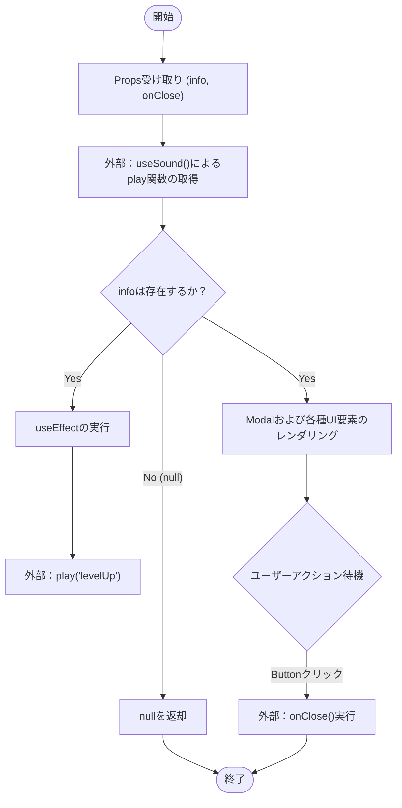
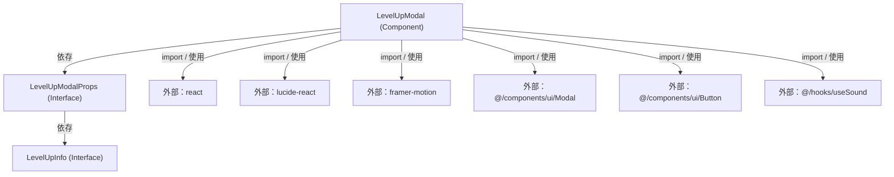

## 1. 解析メタ情報

| 項目 | 内容 |
| --- | --- |
| 対象ファイル | LevelUpModal.tsx |
| 言語 | React (TypeScript) |
| 解析対象 | 提供されたコードのみ |
| 推測・補完 | 一切なし |

## 2. ファイルの概要

* ユーザーのレベルアップ情報を画面に表示し、同時に効果音を再生するためのUIモーダルコンポーネント。
* 根拠: `LevelUpModal` (行番号取得不可 / 抜粋: "const LevelUpModal: React.FC<Le")

## 3. 外部依存関係

### インポート一覧

| 名称 | 種類 | 用途 | 根拠 |
| --- | --- | --- | --- |
| `React` | モジュール | Reactライブラリの基本機能 | 根拠: `import React from 'react';` (行番号取得不可 / 抜粋: "import React from 'react';") |
| `useEffect` | Hooks | 副作用の制御（マウント時の音声再生） | 根拠: `import { useEffect } from 'react';` (行番号取得不可 / 抜粋: "import { useEffect } from 'rea") |
| `Modal` | コンポーネント | モーダルウィンドウのUI枠組み | 根拠: `import { Modal }` (行番号取得不可 / 抜粋: "import { Modal } from '@/compo") |
| `Button` | コンポーネント | 閉じるボタンなどのUI | 根拠: `import { Button }` (行番号取得不可 / 抜粋: "import { Button } from '@/comp") |
| `Zap` | コンポーネント | 雷マークのアイコン表示 | 根拠: `import { Zap }` (行番号取得不可 / 抜粋: "import { Zap } from 'lucide-re") |
| `motion` | モジュール | アニメーションの実装（バネの動きなど） | 根拠: `import { motion }` (行番号取得不可 / 抜粋: "import { motion } from 'framer") |
| `useSound` | Custom Hook | 効果音の再生関数の提供 | 根拠: `import { useSound }` (行番号取得不可 / 抜粋: "import { useSound } from '@/ho") |

### ブラックボックスとなる外部要素

| 名称 | 理由 | 根拠 |
| --- | --- | --- |
| `Modal` | プロパティ（`isOpen`, `onClose`, `maxWidth`）を受け取った後の具体的なDOM構造や状態管理の実装が外部ファイルに依存するため不明。 | 根拠: `<Modal isOpen={true}` (行番号取得不可 / 抜粋: "<Modal isOpen={true} onClose={") |
| `Button` | プロパティ（`variant`, `size`など）に対する具体的なスタイリングや内部挙動が不明。 | 根拠: `<Button onClick={onClose}` (行番号取得不可 / 抜粋: "<Button onClick={onClose} vari") |
| `useSound` (`play`) | 音声を再生する具体的なロジック、リソースのロード状態、並行再生時の挙動が不明。 | 根拠: `const { play } = useSound();` (行番号取得不可 / 抜粋: "const { play } = useSound();") |

## 4. 主要要素の定義（関数 / エンドポイント / コンポーネント）

### `LevelUpInfo`

* **役割**: レベルアップしたユーザーの情報を格納するインターフェース。
* 根拠: `LevelUpInfo` (行番号取得不可 / 抜粋: "interface LevelUpInfo {")

* **引数/リクエスト**: 該当なし（型定義のため）
* 根拠: `LevelUpInfo` (行番号取得不可 / 抜粋: "interface LevelUpInfo {")

* **戻り値/レスポンス**: 該当なし
* 根拠: `LevelUpInfo` (行番号取得不可 / 抜粋: "interface LevelUpInfo {")

* **副作用**: なし
* 根拠: `LevelUpInfo` (行番号取得不可 / 抜粋: "interface LevelUpInfo {")

* **エラーハンドリング**: なし
* 根拠: `LevelUpInfo` (行番号取得不可 / 抜粋: "interface LevelUpInfo {")

### `LevelUpModalProps`

* **役割**: `LevelUpModal` コンポーネントが受け取るプロパティの型定義。
* 根拠: `LevelUpModalProps` (行番号取得不可 / 抜粋: "interface LevelUpModalProps {")

* **引数/リクエスト**: 該当なし（型定義のため）
* 根拠: `LevelUpModalProps` (行番号取得不可 / 抜粋: "interface LevelUpModalProps {")

* **戻り値/レスポンス**: 該当なし
* 根拠: `LevelUpModalProps` (行番号取得不可 / 抜粋: "interface LevelUpModalProps {")

* **副作用**: なし
* 根拠: `LevelUpModalProps` (行番号取得不可 / 抜粋: "interface LevelUpModalProps {")

* **エラーハンドリング**: なし
* 根拠: `LevelUpModalProps` (行番号取得不可 / 抜粋: "interface LevelUpModalProps {")

### `LevelUpModal`

* **役割**: プロパティに基づきレベルアップモーダルを描画し、表示時に効果音を再生するReact関数コンポーネント。
* 根拠: `LevelUpModal` (行番号取得不可 / 抜粋: "const LevelUpModal: React.FC<Le")

* **引数/リクエスト**: `info` (`LevelUpInfo | null`), `onClose` (`() => void`)
* 根拠: `LevelUpModal` 引数部分 (行番号取得不可 / 抜粋: "({ info, onClose }) => {")

* **戻り値/レスポンス**: JSX要素（`Modal`を含むツリー）、または `null`。
* 根拠: 戻り値の分岐 (行番号取得不可 / 抜粋: "if (!info) return null; return")

* **副作用**: `info`がtruthyな値を持つ場合、`useEffect`により外部関数 `play('levelUp')` を実行する。
* 根拠: `useEffect` ブロック (行番号取得不可 / 抜粋: "play('levelUp'); // ★表示時に再生")

* **エラーハンドリング**: なし（明示的な `try-catch` やエラー表示ロジックは存在しない）。
* 根拠: `LevelUpModal` 全体 (行番号取得不可 / 抜粋: "const LevelUpModal: React.FC<Le")

---

## 5. 処理フロー図

## 6. 依存関係図

## 7. 次のステップ（リバースエンジニアリングの提案）

| 優先度 | ファイル名(推測可) | 理由 | 根拠 |
| --- | --- | --- | --- |
| 高 | `@/hooks/useSound.ts` | `play`関数の正確な仕様（例外発生の有無、再生の中断可否）と、第二引数等の依存配列に対する参照の安定性を確認する必要があるため。 | 根拠: `const { play } = useSound();` (行番号取得不可 / 抜粋: "const { play } = useSound();") |
| 高 | 本コンポーネントの呼び出し元ファイル | `info`オブジェクトがどのように生成・初期化され、`onClose`時にどのように破棄（またはnull化）されるのか、状態管理のライフサイクルを確認するため。 | 根拠: `({ info, onClose }) => {` (行番号取得不可 / 抜粋: "({ info, onClose }) => {") |
| 中 | `@/components/ui/Modal.tsx` | `isOpen={true}`固定で渡しているため、アンマウント時のアニメーション制御やポータル(Portal)の有無など、モーダルのマウントライフサイクルを確認するため。 | 根拠: `<Modal isOpen={true}` (行番号取得不可 / 抜粋: "<Modal isOpen={true} onClose={") |

## 8. 保守上の注意点

* `LevelUpInfo` インターフェースにて `job: string;` が定義されているが、現在のコンポーネント内では描画やロジックに一切使用されていない未使用のプロパティである。
* 根拠: `job: string;` (行番号取得不可 / 抜粋: "job: string;")

* `useEffect` の依存配列に `[info, play]` が指定されている。外部フック `useSound` が返す `play` 関数の参照がレンダリングのたびに変化する実装になっていた場合、意図しないタイミングで効果音が複数回再生される可能性がある。
* 根拠: `}, [info, play]);` (行番号取得不可 / 抜粋: "}, [info, play]);")

* `info` が `null` の場合はコンポーネント自体が `null` を返すため、親コンポーネント側で `info` を `null` に更新すると、`framer-motion` の終了アニメーション（`AnimatePresence` などを想定した場合の `exit` アニメーション）を待たずに即座にDOMから消去される挙動となる。
* 根拠: `if (!info) return null;` (行番号取得不可 / 抜粋: "if (!info) return null;")

## 9. 不明事項一覧

| 項目 | 理由 | 必要なファイル |
| --- | --- | --- |
| `play('levelUp')` の実際の音声ファイルと再生ロジック | 音声ファイルのロードエラー時の挙動や、連続呼び出し時の制御が実装上不明。 | `@/hooks/useSound.ts` |
| `Modal` のアクセシビリティおよびオーバーレイ制御 | 背景クリックでの `onClose` 発火や、フォーカストラップの実装有無が不明。 | `@/components/ui/Modal.tsx` |
| `Button` の `variant="primary"` のスタイル詳細 | 具体的な色味やホバー時のアクション制御が不明。 | `@/components/ui/Button.tsx` |

## 10. 自己検証結果

* [x] 推測・外部ファイルの仕様を一切含んでいない（完了）
* [x] 全関数・全クラス・全コンポーネントを列挙した（完了）
* [x] 全てのインポート要素を列挙した（完了）
* [x] すべての仕様説明に「根拠（行番号・抜粋）」を明記した（完了）
* [x] 根拠漏れが0件である（完了）
* [x] Mermaid構文にエラーの原因となる記号（エスケープ漏れ）がない（完了）
* [x] 不明事項を漏れなく列挙した（完了）