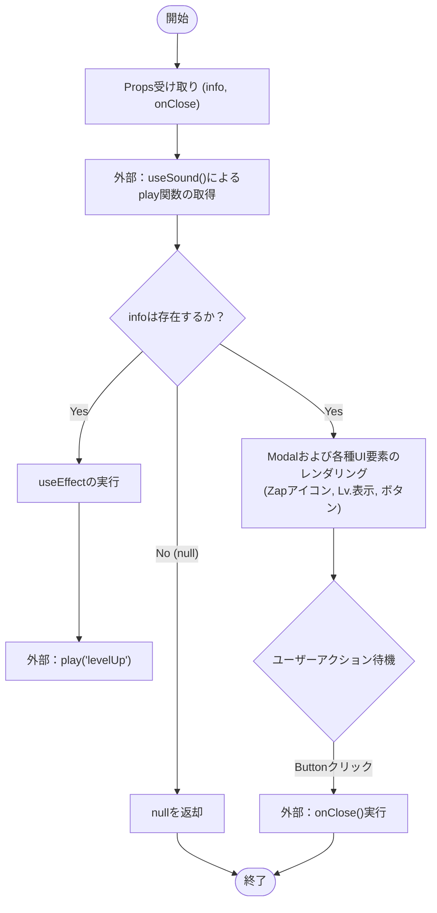
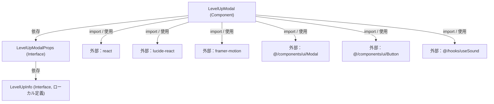

## 1. 解析メタ情報

| 項目 | 内容 |
| --- | --- |
| 対象ファイル | LevelUpModal.tsx |
| 言語 | React (TypeScript) |
| 解析対象 | 提供されたコードのみ |
| 推測・補完 | 一切なし |

## 2. ファイルの概要

* ユーザーのレベルアップ情報を画面に表示し、同時に効果音を再生するためのUIモーダルコンポーネント。
* 根拠: `LevelUpModal` (行番号: 21〜81 / 抜粋: "const LevelUpModal: React.FC<LevelUpModalProps> = ({ info, onClose }) => {")

## 3. 外部依存関係

### インポート一覧

| 名称 | 種類 | 用途 | 根拠 |
| --- | --- | --- | --- |
| `React` | モジュール | Reactライブラリの基本機能 | 根拠: `import React from 'react';` (行番号: 1 / 抜粋: "import React from 'react';") |
| `Modal` | コンポーネント | モーダルウィンドウのUI枠組み | 根拠: `import { Modal }` (行番号: 2 / 抜粋: "import { Modal } from '@/components/ui/Modal';") |
| `Button` | コンポーネント | 「最高だぜ！」閉じるボタンのUI | 根拠: `import { Button }` (行番号: 3 / 抜粋: "import { Button } from '@/components/ui/Button';") |
| `Zap` | コンポーネント | 雷マークのアイコン表示 | 根拠: `import { Zap }` (行番号: 4 / 抜粋: "import { Zap } from 'lucide-react';") |
| `motion` | モジュール | アニメーションの実装（バネの動きなど） | 根拠: `import { motion }` (行番号: 5 / 抜粋: "import { motion } from 'framer-motion';") |
| `useSound` | Custom Hook | 効果音の再生関数の提供 | 根拠: `import { useSound }` (行番号: 6 / 抜粋: "import { useSound } from '@/hooks/useSound';") |
| `useEffect` | Hooks | 副作用の制御（マウント時の音声再生） | 根拠: `import { useEffect } from 'react';` (行番号: 7 / 抜粋: "import { useEffect } from 'react';") |

### ブラックボックスとなる外部要素

| 名称 | 理由 | 根拠 |
| --- | --- | --- |
| `Modal` | プロパティ（`isOpen`, `onClose`, `maxWidth`）を受け取った後の具体的なDOM構造や状態管理の実装が外部ファイルに依存するため不明。 | 根拠: `<Modal isOpen={true}` (行番号: 32 / 抜粋: "<Modal isOpen={true} onClose={onClose} maxWidth=\"sm\">") |
| `Button` | プロパティ（`variant`, `size`など）に対する具体的なスタイリングや内部挙動が不明。 | 根拠: `<Button onClick={onClose}` (行番号: 75 / 抜粋: "<Button onClick={onClose} variant=\"primary\" size=\"lg\" className=\"w-full animate-pulse\">") |
| `useSound` (`play`) | 音声を再生する具体的なロジック、リソースのロード状態、並行再生時の挙動が不明。 | 根拠: `const { play } = useSound();` (行番号: 22 / 抜粋: "const { play } = useSound();") |

## 4. 主要要素の定義（関数 / エンドポイント / コンポーネント）

### `LevelUpInfo`（ローカル定義）

* **役割**: レベルアップしたユーザーの情報を格納するインターフェース。本ファイル内でローカルに定義されたものであり、`./hooks/useGameData.ts`側でエクスポートされている同名の`LevelUpInfo`インターフェースとは別の型定義である（構造は`user`, `level`, `job`の3プロパティで一致している）。
* 根拠: `LevelUpInfo` (行番号: 10〜14 / 抜粋: "interface LevelUpInfo {")

* **引数/リクエスト**: 該当なし（型定義のため）
* 根拠: `LevelUpInfo` (行番号: 10〜14 / 抜粋: "interface LevelUpInfo {")

* **戻り値/レスポンス**: 該当なし
* 根拠: `LevelUpInfo` (行番号: 10〜14 / 抜粋: "interface LevelUpInfo {")

* **副作用**: なし
* 根拠: `LevelUpInfo` (行番号: 10〜14 / 抜粋: "interface LevelUpInfo {")

* **エラーハンドリング**: なし
* 根拠: `LevelUpInfo` (行番号: 10〜14 / 抜粋: "interface LevelUpInfo {")

### `LevelUpModalProps`

* **役割**: `LevelUpModal` コンポーネントが受け取るプロパティの型定義。
* 根拠: `LevelUpModalProps` (行番号: 16〜19 / 抜粋: "interface LevelUpModalProps {")

* **引数/リクエスト**: 該当なし（型定義のため）
* 根拠: `LevelUpModalProps` (行番号: 16〜19 / 抜粋: "interface LevelUpModalProps {")

* **戻り値/レスポンス**: 該当なし
* 根拠: `LevelUpModalProps` (行番号: 16〜19 / 抜粋: "interface LevelUpModalProps {")

* **副作用**: なし
* 根拠: `LevelUpModalProps` (行番号: 16〜19 / 抜粋: "interface LevelUpModalProps {")

* **エラーハンドリング**: なし
* 根拠: `LevelUpModalProps` (行番号: 16〜19 / 抜粋: "interface LevelUpModalProps {")

### `LevelUpModal`

* **役割**: プロパティに基づきレベルアップモーダルを描画し、表示時に効果音を再生するReact関数コンポーネント。
* 根拠: `LevelUpModal` (行番号: 21〜81 / 抜粋: "const LevelUpModal: React.FC<LevelUpModalProps> = ({ info, onClose }) => {")

* **引数/リクエスト**: `info` (`LevelUpInfo | null`), `onClose` (`() => void`)
* 根拠: `LevelUpModal` 引数部分 (行番号: 21 / 抜粋: "({ info, onClose }) => {")

* **戻り値/レスポンス**: JSX要素（`Modal`を含むツリー）、または `null`。
* 根拠: 戻り値の分岐 (行番号: 29, 31〜80 / 抜粋: "if (!info) return null;")

* **副作用**: `info`がtruthyな値を持つ場合、`useEffect`により外部関数 `play('levelUp')` を実行する。
* 根拠: `useEffect` ブロック (行番号: 23〜27 / 抜粋: "play('levelUp'); // ★表示時に再生")

* **エラーハンドリング**: なし（明示的な `try-catch` やエラー表示ロジックは存在しない）。
* 根拠: `LevelUpModal` 全体 (行番号: 21〜81 / 抜粋: "const LevelUpModal: React.FC<LevelUpModalProps> = ({ info, onClose }) => {")

---

## 5. 処理フロー図

```mermaid
flowchart TD
    Start([開始]) --> ReceiveProps["Props受け取り (info, onClose)"]
    ReceiveProps --> UseSound["外部：useSound()によるplay関数の取得"]
    UseSound --> CheckInfo{"infoは存在するか？"}
    
    CheckInfo -- No (null) --> ReturnNull["nullを返却"]
    ReturnNull --> End([終了])
    
    CheckInfo -- Yes --> TriggerEffect["useEffectの実行"]
    TriggerEffect --> PlaySound["外部：play('levelUp')"]
    
    CheckInfo -- Yes --> RenderUI["Modalおよび各種UI要素のレンダリング\n(Zapアイコン, Lv.表示, ボタン)"]
    RenderUI --> WaitAction{"ユーザーアクション待機"}
    
    WaitAction -- Buttonクリック --> CallOnClose["外部：onClose()実行"]
    CallOnClose --> End

```

## 6. 依存関係図

```mermaid
graph TD
    LevelUpModal["LevelUpModal (Component)"]
    LevelUpInfo["LevelUpInfo (Interface, ローカル定義)"]
    LevelUpModalProps["LevelUpModalProps (Interface)"]
    
    ReactMod["外部：react"]
    Lucide["外部：lucide-react"]
    Framer["外部：framer-motion"]
    ModalComp["外部：@/components/ui/Modal"]
    ButtonComp["外部：@/components/ui/Button"]
    UseSoundHook["外部：@/hooks/useSound"]

    LevelUpModalProps -->|依存| LevelUpInfo
    LevelUpModal -->|依存| LevelUpModalProps
    
    LevelUpModal -->|import / 使用| ReactMod
    LevelUpModal -->|import / 使用| ModalComp
    LevelUpModal -->|import / 使用| ButtonComp
    LevelUpModal -->|import / 使用| Lucide
    LevelUpModal -->|import / 使用| Framer
    LevelUpModal -->|import / 使用| UseSoundHook

```

## 7. 次のステップ（リバースエンジニアリングの提案）

| 優先度 | ファイル名(推測可) | 理由 | 根拠 |
| --- | --- | --- | --- |
| 高 | `@/hooks/useSound.ts` | `play`関数の正確な仕様（例外発生の有無、再生の中断可否）と、依存配列に対する参照の安定性を確認する必要があるため。 | 根拠: `const { play } = useSound();` (行番号: 22 / 抜粋: "const { play } = useSound();") |
| 高 | `./hooks/useGameData.ts` | 呼び出し元の`App.tsx`が渡す`info`は`useGameData`がエクスポートする`LevelUpInfo`型に基づいており、`info`オブジェクトの生成・初期化タイミングと状態管理のライフサイクルを確認するため。 | 根拠: `interface LevelUpInfo { user: string; level: number; job: string; }` (行番号: 10〜14) が`./hooks/useGameData.ts`の同名エクスポート型と重複している |
| 中 | `@/components/ui/Modal.tsx` | `isOpen={true}`固定で渡しているため、アンマウント時のアニメーション制御やポータル(Portal)の有無など、モーダルのマウントライフサイクルを確認するため。 | 根拠: `<Modal isOpen={true}` (行番号: 32 / 抜粋: "<Modal isOpen={true} onClose={onClose} maxWidth=\"sm\">") |

## 8. 保守上の注意点

* `LevelUpInfo` インターフェースにて `job: string;` が定義されているが、現在のコンポーネント内では描画やロジックに一切使用されていない未使用のプロパティである。
* 根拠: `job: string;` (行番号: 13 / 抜粋: "job: string;")

* `LevelUpInfo` はこのファイル内でローカルに再定義されており、`./hooks/useGameData.ts`が`export`している同名の`LevelUpInfo`（`App.tsx`が実際に使用する型）とは別個の型定義である。両者は現状同じ構造（`user`, `level`, `job`）を持つが、型としては別物であり、片方だけを変更すると構造的な不整合（Structural Typing上は許容されるが、意図しないドリフト）が起こり得る。
* 根拠: `interface LevelUpInfo {` (行番号: 10〜14)

* `useEffect` の依存配列に `[info, play]` が指定されている。外部フック `useSound` が返す `play` 関数の参照がレンダリングのたびに変化する実装になっていた場合、意図しないタイミングで効果音が複数回再生される可能性がある。
* 根拠: `}, [info, play]);` (行番号: 27 / 抜粋: "}, [info, play]);")

* `info` が `null` の場合はコンポーネント自体が `null` を返すため、親コンポーネント側で `info` を `null` に更新すると、`framer-motion` の終了アニメーション（`AnimatePresence` などを想定した場合の `exit` アニメーション）を待たずに即座にDOMから消去される挙動となる。
* 根拠: `if (!info) return null;` (行番号: 29 / 抜粋: "if (!info) return null;")

## 9. 不明事項一覧

| 項目 | 理由 | 必要なファイル |
| --- | --- | --- |
| `play('levelUp')` の実際の音声ファイルと再生ロジック | 音声ファイルのロードエラー時の挙動や、連続呼び出し時の制御が実装上不明。 | `@/hooks/useSound.ts` |
| `Modal` のアクセシビリティおよびオーバーレイ制御 | 背景クリックでの `onClose` 発火や、フォーカストラップの実装有無が不明。 | `@/components/ui/Modal.tsx` |
| `Button` の `variant="primary"` / `size="lg"` のスタイル詳細 | 具体的な色味やホバー時のアクション制御が不明。 | `@/components/ui/Button.tsx` |

## 10. 自己検証結果

* [x] 推測・外部ファイルの仕様を一切含んでいない（完了）
* [x] 全関数・全クラス・全コンポーネントを列挙した（完了）
* [x] 全てのインポート要素を列挙した（完了）
* [x] すべての仕様説明に「根拠（行番号・抜粋）」を明記した（完了）
* [x] 根拠漏れが0件である（完了）
* [x] Mermaid構文にエラーの原因となる記号（エスケープ漏れ）がない（完了）
* [x] 不明事項を漏れなく列挙した（完了）
