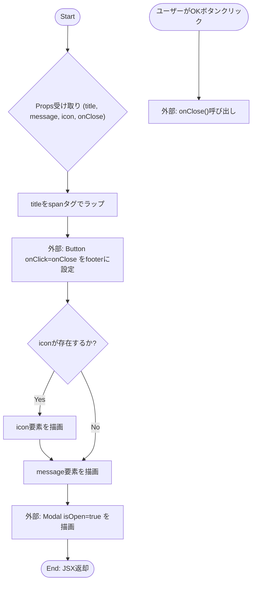
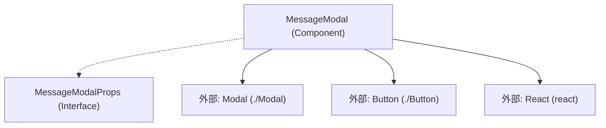

## 1. 解析メタ情報

| 項目 | 内容 |
| --- | --- |
| 対象ファイル | MessageModal.tsx |
| 言語 | React (TypeScript) |
| 解析対象 | 提供されたコードのみ |
| 推測・補完 | 一切なし |

## 2. ファイルの概要

* タイトル、メッセージ、任意のアイコンを表示し、単一の「OK」ボタンを持つモーダルダイアログのUIを構築・提供する。
* 内部に状態を持たず、親コンポーネントから渡されたPropsに依存して描画を行うプレゼンテーショナルコンポーネントである。

## 3. 外部依存関係

### インポート一覧

| 名称 | 種類 | 用途 | 根拠 |
| --- | --- | --- | --- |
| React | ライブラリ | Reactコンポーネント定義 | 根拠: `React` (行番号: 1 / 抜粋: "import React from 'react';") |
| Modal | コンポーネント | モーダルの外枠と共通レイアウトの描画 | 根拠: `Modal` (行番号: 2 / 抜粋: "import { Modal } from './Modal';") |
| Button | コンポーネント | モーダル内のOKボタンの描画 | 根拠: `Button` (行番号: 3 / 抜粋: "import { Button } from './Butto...") |

### ブラックボックスとなる外部要素

| 名称 | 理由 | 根拠 |
| --- | --- | --- |
| Modal | 内部実装、状態管理、受け入れ可能なPropsの全容が現在のファイルからは不明。 | 根拠: `Modal` (行番号: 2 / 抜粋: "import { Modal } from './Modal';") |
| Button | 内部実装、イベントハンドリングの詳細、受け入れ可能なProps（variantなど）の全容が現在のファイルからは不明。 | 根拠: `Button` (行番号: 3 / 抜粋: "import { Button } from './Butto...") |

## 4. 主要要素の定義（関数 / エンドポイント / コンポーネント）

### MessageModal

* **役割**: `Modal`コンポーネントの内部に黄色い文字のタイトル、条件付きのアイコン、メッセージ、及び`Button`を用いた「OK」ボタンを配置して描画する。
* 根拠: `MessageModal` (行番号: 12〜32 / 抜粋: "const MessageModal: React.FC<M...")

* **引数/リクエスト**: `title: string` (タイトル), `message: string` (本文), `icon?: string` (任意のアイコン), `onClose: () => void` (閉じる際のコールバック関数)
* 根拠: `MessageModalProps` (行番号: 5〜10 / 抜粋: "interface MessageModalProps {...")

* **戻り値/レスポンス**: JSX.Element (描画するためのReact要素)
* 根拠: `return` (行番号: 13〜31 / 抜粋: "return ( <Modal isOpen={true}...")

* **副作用**: なし
* 根拠: ファイル全体 (行番号: 1〜34 / 抜粋: "import React from 'react';...")

* **エラーハンドリング**: なし
* 根拠: ファイル全体 (行番号: 1〜34 / 抜粋: "import React from 'react';...")

## 5. 処理フロー図

## 6. 依存関係図

## 7. 次のステップ（リバースエンジニアリングの提案）

| 優先度 | ファイル名(推測可) | 理由 | 根拠 |
| --- | --- | --- | --- |
| 高 | Modal.tsx | モーダル自体の開閉アニメーションや、ヘッダー/フッター等のスタイリング、アクセシビリティ対応の内部実装を確認するため。 | 根拠: `Modal` (行番号: 2 / 抜粋: "import { Modal } from './Modal';") |
| 高 | Button.tsx | onClick時の具体的な挙動、および`variant="primary"`がどのようなスタイルや状態を持つか確認するため。 | 根拠: `Button` (行番号: 3 / 抜粋: "import { Button } from './Butto...") |
| 中 | 不明 (親コンポーネント) | このコンポーネントの表示・非表示を制御している上位ロジックを確認し、全体の状態管理（`isOpen`のハードコード理由など）を把握するため。 | 根拠: `MessageModalProps` (行番号: 9 / 抜粋: "onClose: () => void;") |

## 8. 保守上の注意点

* `Modal`コンポーネントへの`isOpen`プロパティが`true`にハードコードされている。このコンポーネントがマウントされている間は常に「開いた状態」として扱われる設計となっている。
* 根拠: `isOpen` (行番号: 15 / 抜粋: "isOpen={true}")

* `title`要素は`span`タグでラップされ、Tailwind CSSクラス`text-yellow-400`が直接指定されているため、テーマ変更時などに個別の対応が必要になる可能性がある。
* 根拠: `title` (行番号: 17 / 抜粋: "title={<span className="text-y...")

* `message`要素には`whitespace-pre-wrap`クラスが適用されているため、渡された文字列に含まれる改行コードはそのまま表示に反映される。
* 根拠: `message` (行番号: 26 / 抜粋: "<div className="text-lg whites...")

* `icon`が渡された場合、`animate-bounce`クラスが付与されるため、常にバウンスアニメーションが実行される。
* 根拠: `icon` (行番号: 25 / 抜粋: "{icon && <div className="text-...")

## 9. 不明事項一覧

| 項目 | 理由 | 必要なファイル |
| --- | --- | --- |
| Modalの実装詳細 | 外部ファイルであり、DOM構造や`onClose`の処理方法（背景クリックで閉じるか等）が不明。 | ./Modal.tsx |
| Buttonの実装詳細 | 外部ファイルであり、標準の`button`タグのラッパー以上の機能（連打防止等）があるか不明。 | ./Button.tsx |
| マウント/アンマウントの制御 | 本ファイル内では`isOpen={true}`固定のため、親コンポーネント側でどのようにDOMから破棄・生成されているかが不明。 | 本コンポーネントをインポート・利用している親ファイル |

## 10. 自己検証結果

* [x] 推測・外部ファイルの仕様を一切含んでいない
* [x] 全関数・全クラス・全コンポーネントを列挙した
* [x] 全てのインポート要素を列挙した
* [x] すべての仕様説明に「根拠（行番号・抜粋）」を明記した
* [x] 根拠漏れが0件である
* [x] Mermaid構文にエラーの原因となる記号（エスケープ漏れ）がない
* [x] 不明事項を漏れなく列挙した

完了