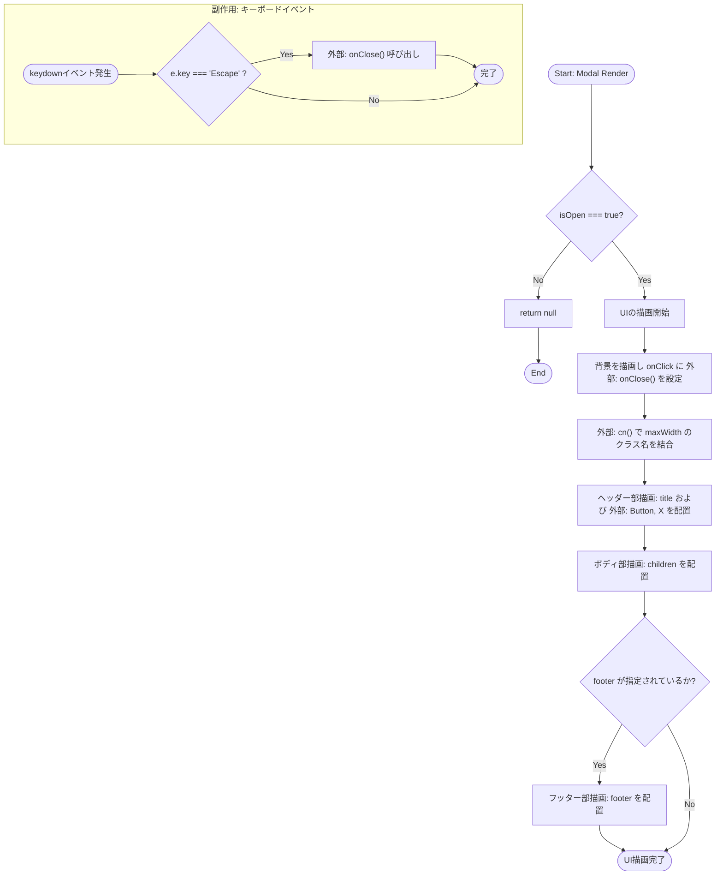
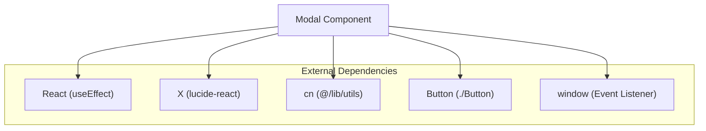

## 1. 解析メタ情報

| 項目 | 内容 |
| --- | --- |
| 対象ファイル | Modal.tsx |
| 言語 | React (TypeScript) |
| 解析対象 | 提供されたコードのみ |
| 推測・補完 | 一切なし |

## 2. ファイルの概要

* 画面上にモーダルウィンドウ（ダイアログ）を表示し、ユーザーのアクション（ESCキー押下、背景クリック、閉じるボタンクリック）に応じて非表示（閉じる）処理を呼び出す責務を持つ。
* 根拠: [Modalコンポーネント] (行番号: 15〜77 / 抜粋: "export const Modal: React.FC<M")

## 3. 外部依存関係

### インポート一覧

| 名称 | 種類 | 用途 | 根拠 |
| --- | --- | --- | --- |
| `React`, `useEffect` | ライブラリ | コンポーネント定義と副作用フックとしての利用 | 根拠: [import文] (行番号: 1〜1 / 抜粋: "import React, { useEffect } fr") |
| `X` | アイコンコンポーネント | 閉じるボタンのアイコンとして表示 | 根拠: [import文] (行番号: 2〜2 / 抜粋: "import { X } from "lucide-reac") |
| `cn` | ユーティリティ関数 | 動的なクラス名の結合処理として利用 | 根拠: [import文] (行番号: 3〜3 / 抜粋: "import { cn } from "@/lib/util") |
| `Button` | UIコンポーネント | ヘッダー部の閉じるボタンとして利用 | 根拠: [import文] (行番号: 4〜4 / 抜粋: "import { Button } from "./Butt") |

### ブラックボックスとなる外部要素

| 名称 | 理由 | 根拠 |
| --- | --- | --- |
| `cn` | `@/lib/utils`の実装が提供されていないため、内部ロジックや競合解決の仕様は不明 | 根拠: [import文] (行番号: 3〜3 / 抜粋: "import { cn } from "@/lib/util") |
| `Button` | `./Button`の実装が提供されていないため、受け付けるPropsの詳細挙動は不明 | 根拠: [import文] (行番号: 4〜4 / 抜粋: "import { Button } from "./Butt") |

## 4. 主要要素の定義（関数 / エンドポイント / コンポーネント）

### `Modal`

* **役割**: プロパティに基づきモーダルのUI（背景、ヘッダー、ボディ、フッター）を描画し、状態に応じた表示制御とイベントハンドリングを行う。
* 根拠: [Modalコンポーネント] (行番号: 15〜77 / 抜粋: "export const Modal: React.FC<M")

* **引数/リクエスト**: `ModalProps`型 (`isOpen`: boolean, `onClose`: () => void, `title`?: ReactNode, `children`: ReactNode, `footer`?: ReactNode, `maxWidth`?: "sm" | "md" | "lg" | "xl")
* 根拠: [ModalPropsインターフェース] (行番号: 6〜13 / 抜粋: "interface ModalProps {")

* **戻り値/レスポンス**: `React.FC<ModalProps>` (`isOpen`がfalseの場合は`null`、trueの場合はJSX要素を返却)
* 根拠: [戻り値] (行番号: 32〜76 / 抜粋: "if (!isOpen) return null;")

* **副作用**: `isOpen`がtrueの際、グローバルな`window`オブジェクトに対して`keydown`イベントリスナー（ESCキー検知時の`onClose`呼び出し）を登録し、クリーンアップ時に解除する。
* 根拠: [useEffectフック内のロジック] (行番号: 24〜30 / 抜粋: "window.addEventListener("keydo")

* **エラーハンドリング**: なし
* 根拠: [Modalコンポーネント] (行番号: 15〜77 / 抜粋: "該当コードなし")

## 5. 処理フロー図

## 6. 依存関係図

## 7. 次のステップ（リバースエンジニアリングの提案）

| 優先度 | ファイル名(推測可) | 理由 | 根拠 |
| --- | --- | --- | --- |
| 高 | `./Button.tsx` | Modalのヘッダー部で使用されており、レイアウト崩れや意図しない表示の原因になる可能性があるため | 根拠: [import文] (行番号: 4〜4 / 抜粋: "import { Button } from "./Butt") |
| 中 | `@/lib/utils.ts` | クラス名合成処理の実体であり、CSSの適用順序やスタイル上書きの仕様を正確に把握するため | 根拠: [import文] (行番号: 3〜3 / 抜粋: "import { cn } from "@/lib/util") |

## 8. 保守上の注意点

* `useEffect`内で`window`に対する`keydown`イベントの登録と解除を行っている。依存配列に`onClose`が含まれているため、呼び出し元で`onClose`関数の参照が頻繁に変わる場合、イベントリスナーの再登録が繰り返される。
* 根拠: [useEffect] (行番号: 24〜30 / 抜粋: "}, [isOpen, onClose]);")

* `isOpen`が`false`の際は早期リターンされ、DOMツリーから完全に削除される。フェードアウトなどのアニメーションを持たせたい場合は別のアプローチが必要な実装となっている。
* 根拠: [早期リターン] (行番号: 32〜32 / 抜粋: "if (!isOpen) return null;")

## 9. 不明事項一覧

| 項目 | 理由 | 必要なファイル |
| --- | --- | --- |
| `cn`関数の詳細な挙動 | 外部インポートであり、引数に渡したクラス名の競合時等における結合仕様が不明 | `@/lib/utils.ts` |
| `Button`コンポーネントの仕様 | 外部インポートであり、`variant="ghost"`, `size="icon"`時の具体的なDOM構造やスタイルが不明 | `./Button.tsx` |

## 10. 自己検証結果

* [x] 推測・外部ファイルの仕様を一切含んでいない
* [x] 全関数・全クラス・全コンポーネントを列挙した
* [x] 全てのインポート要素を列挙した
* [x] すべての仕様説明に「根拠（行番号・抜粋）」を明記した
* [x] 根拠漏れが0件である
* [x] Mermaid構文にエラーの原因となる記号（エスケープ漏れ）がない
* [x] 不明事項を漏れなく列挙した