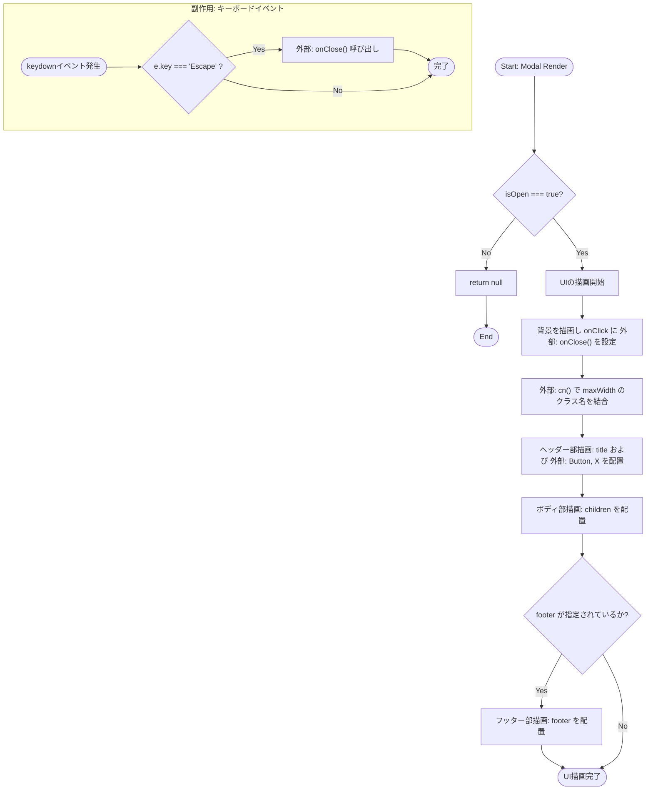
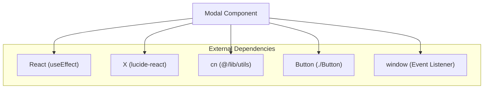

## 1. 解析メタ情報

| 項目 | 内容 |
| --- | --- |
| 対象ファイル | Modal.tsx |
| 言語 | React (TypeScript) |
| 解析対象 | 提供されたコードのみ |
| 推測・補完 | 一切なし |

## 関連ドキュメント

* [../../lib/utils.md](../../lib/utils.md) - `cn`関数の実装元
* [./Button.md](./Button.md) - ヘッダー部の閉じるボタンとして利用するコンポーネント
* [./MessageModal.md](./MessageModal.md) - 本コンポーネントの利用例（結果/エラーメッセージモーダル）
* `LevelUpModal.tsx`(廃止済み。`1818d5a`で削除、仕様書も Issue #402 で削除) - かつての利用例（レベルアップ演出モーダル）
* [../../../App.md](../../../App.md) - 呼び出し元の一例（`ConfirmModal`が内部で汎用モーダルとして利用）

## 2. ファイルの概要

* 画面上にモーダルウィンドウ（ダイアログ）を表示し、ユーザーのアクション（ESCキー押下、背景クリック、閉じるボタンクリック）に応じて非表示（閉じる）処理を呼び出す責務を持つ。
* 根拠: [Modalコンポーネント] (行番号: 15〜77 / 抜粋: "export const Modal: React.FC<M")

## 3. 外部依存関係

### インポート一覧

| 名称 | 種類 | 用途 | 根拠 |
| --- | --- | --- | --- |
| `React`, `useEffect` | ライブラリ | コンポーネント定義と副作用フックとしての利用 | 根拠: [import文] (行番号: 1〜1 / 抜粋: "import React, { useEffect } fr") |
| `X` | アイコンコンポーネント | 閉じるボタンのアイコンとして表示 | 根拠: [import文] (行番号: 2〜2 / 抜粋: "import { X } from "lucide-reac") |
| `cn` | ユーティリティ関数 | 動的なクラス名の結合処理として利用 | 根拠: [import文] (行番号: 3〜3 / 抜粋: "import { cn } from "@/lib/util") |
| `Button` | UIコンポーネント | ヘッダー部の閉じるボタンとして利用 | 根拠: [import文] (行番号: 4〜4 / 抜粋: "import { Button } from "./Butt") |

### ブラックボックスとなる外部要素

| 名称 | 理由 | 根拠 |
| --- | --- | --- |
| `cn` | `@/lib/utils`の実装が提供されていないため、内部ロジックや競合解決の仕様は不明 | 根拠: [import文] (行番号: 3〜3 / 抜粋: "import { cn } from "@/lib/util") |
| `Button` | `./Button`の実装が提供されていないため、受け付けるPropsの詳細挙動は不明 | 根拠: [import文] (行番号: 4〜4 / 抜粋: "import { Button } from "./Butt") |

## 4. 主要要素の定義（関数 / エンドポイント / コンポーネント）

### `Modal`

* **役割**: プロパティに基づきモーダルのUI（背景、ヘッダー、ボディ、フッター）を描画し、状態に応じた表示制御とイベントハンドリングを行う。
* 根拠: [Modalコンポーネント] (行番号: 15〜77 / 抜粋: "export const Modal: React.FC<M")

* **引数/リクエスト**: `ModalProps`型 (`isOpen`: boolean, `onClose`: () => void, `title`?: ReactNode, `children`: ReactNode, `footer`?: ReactNode, `maxWidth`?: "sm" | "md" | "lg" | "xl")
* 根拠: [ModalPropsインターフェース] (行番号: 6〜13 / 抜粋: "interface ModalProps {")

* **戻り値/レスポンス**: `React.FC<ModalProps>` (`isOpen`がfalseの場合は`null`、trueの場合はJSX要素を返却)
* 根拠: [戻り値] (行番号: 32〜76 / 抜粋: "if (!isOpen) return null;")

* **副作用**: `isOpen`がtrueの際、グローバルな`window`オブジェクトに対して`keydown`イベントリスナー（ESCキー検知時の`onClose`呼び出し）を登録し、クリーンアップ時に解除する。
* 根拠: [useEffectフック内のロジック] (行番号: 24〜30 / 抜粋: "window.addEventListener("keydo")

* **エラーハンドリング**: なし
* 根拠: [Modalコンポーネント] (行番号: 15〜77 / 抜粋: "該当コードなし")

## 5. 処理フロー図

```mermaid
flowchart TD
    Start([Start: Modal Render]) --> CheckOpen{"isOpen === true?"}
    CheckOpen -- No --> ReturnNull["return null"] --> End([End])
    CheckOpen -- Yes --> RenderUI["UIの描画開始"]

    RenderUI --> RenderBackdrop["背景を描画し onClick に 外部: onClose() を設定"]
    RenderBackdrop --> CalcClass["外部: cn() で maxWidth のクラス名を結合"]
    CalcClass --> RenderHeader["ヘッダー部描画: title および 外部: Button, X を配置"]
    RenderHeader --> RenderBody["ボディ部描画: children を配置"]
    RenderBody --> CheckFooter{"footer が指定されているか?"}

    CheckFooter -- Yes --> RenderFooter["フッター部描画: footer を配置"] --> EndRender([UI描画完了])
    CheckFooter -- No --> EndRender

    subgraph Event [副作用: キーボードイベント]
        KeyStart([keydownイベント発生]) --> CheckEsc{"e.key === 'Escape' ?"}
        CheckEsc -- Yes --> FireClose["外部: onClose() 呼び出し"] --> KeyEnd([完了])
        CheckEsc -- No --> KeyEnd
    end

```

## 6. 依存関係図

```mermaid
graph TD
    Modal["Modal Component"] --> React["React (useEffect)"]
    Modal --> Lucide["X (lucide-react)"]
    Modal --> Utils["cn (@/lib/utils)"]
    Modal --> ButtonComp["Button (./Button)"]
    Modal --> WindowDOM["window (Event Listener)"]

    subgraph External Dependencies
        React
        Lucide
        Utils
        ButtonComp
        WindowDOM
    end

```

## 7. 次のステップ（リバースエンジニアリングの提案）

| 優先度 | ファイル名(推測可) | 理由 | 根拠 |
| --- | --- | --- | --- |
| 高 | `./Button.tsx` | Modalのヘッダー部で使用されており、レイアウト崩れや意図しない表示の原因になる可能性があるため | 根拠: [import文] (行番号: 4〜4 / 抜粋: "import { Button } from "./Butt") |
| 中 | `@/lib/utils.ts` | クラス名合成処理の実体であり、CSSの適用順序やスタイル上書きの仕様を正確に把握するため | 根拠: [import文] (行番号: 3〜3 / 抜粋: "import { cn } from "@/lib/util") |

## 8. 保守上の注意点

* `useEffect`内で`window`に対する`keydown`イベントの登録と解除を行っている。依存配列に`onClose`が含まれているため、呼び出し元で`onClose`関数の参照が頻繁に変わる場合、イベントリスナーの再登録が繰り返される。
* 根拠: [useEffect] (行番号: 24〜30 / 抜粋: "}, [isOpen, onClose]);")

* `isOpen`が`false`の際は早期リターンされ、DOMツリーから完全に削除される。フェードアウトなどのアニメーションを持たせたい場合は別のアプローチが必要な実装となっている。
* 根拠: [早期リターン] (行番号: 32〜32 / 抜粋: "if (!isOpen) return null;")

## 9. 不明事項一覧

| 項目 | 理由 | 必要なファイル |
| --- | --- | --- |
| `cn`関数の詳細な挙動 | 外部インポートであり、引数に渡したクラス名の競合時等における結合仕様が不明 | `@/lib/utils.ts` |
| `Button`コンポーネントの仕様 | 外部インポートであり、`variant="ghost"`, `size="icon"`時の具体的なDOM構造やスタイルが不明 | `./Button.tsx` |

## 相互参照による補足情報

| 元の不明事項 | 判明した内容 | 参照元ドキュメント |
| --- | --- | --- |
| `cn`関数の詳細な挙動 | `utils.md`の解析によれば、`cn`は`export function cn(...inputs: ClassValue[])`として定義され、`return twMerge(clsx(inputs));`という実装、すなわち`clsx`でクラス名を結合した結果を`tailwind-merge`の`twMerge`に渡してTailwindクラスの競合を解決する関数であるとされている。ただしこれは`utils.md`側の解析結果からの補足であり、`utils.ts`のソースコード自体は本ファイルの解析時点では確認していない。 | ../../lib/utils.md |
| `Button`コンポーネントの仕様 | `Button.md`の解析によれば、`Button`は`framer-motion`の`motion.button`をベースに`variant`・`size`・`isLoading`等をPropsとして受け取る実装であるとされているが、`variant="ghost"`や`size="icon"`が実際にどのクラス名・DOM構造に対応するかまでは`Button.md`の解析結果からも特定できていない。ただしこれは`Button.md`側の解析結果からの補足であり、`Button.tsx`のソースコード自体は本ファイルの解析時点では確認していない。 | ./Button.md |
| `cn`関数の詳細な挙動（直接ソース確認） | `family-quest/src/lib/utils.ts`（全10行）を直接確認した。`export function cn(...inputs: ClassValue[])`（8〜10行目）は`clsx`（`clsx`パッケージ、1行目でインポート）でクラス名を結合した結果を`tailwind-merge`パッケージの`twMerge`（2行目でインポート）に渡し`return twMerge(clsx(inputs));`とする実装であり、コード上のコメント（4〜7行目）にも「Tailwindのクラスをマージするユーティリティ」「例: `cn(\"bg-red-500\", isTrue && \"p-4\", \"p-2\") -> \"bg-red-500 p-4\"`（後勝ちで`p-2`は消える）」と明記されている。すなわち後方の引数のクラスが同一Tailwindプロパティで衝突した場合、`twMerge`が後勝ちで解決する。 | 直接ソース確認: `family-quest/src/lib/utils.ts:1-10` |
| `Button`コンポーネントの仕様（直接ソース確認） | `family-quest/src/components/ui/Button.tsx`を直接確認した。`variant="ghost"`は`variants`オブジェクト（25〜33行目）の`ghost: "bg-transparent text-slate-300 hover:text-white hover:bg-slate-800"`（31行目）に対応し、`size="icon"`は`sizes`オブジェクト（36〜41行目）の`icon: "h-10 w-10"`（40行目）に対応する。DOM構造は`motion.button`（`framer-motion`、54〜69行目）1要素のみで、`className={cn(baseStyles, variants[variant], sizes[size], className)}`（57行目）によりベーススタイル・バリアント・サイズ・呼び出し元指定クラスが結合される。`Modal.tsx`58行目の`<Button variant="ghost" size="icon" onClick={onClose} className="h-8 w-8 -mr-2">`では、`cn`による後勝ちマージのため`className`で指定された`h-8 w-8`が`sizes.icon`の`h-10 w-10`より優先され、実際のボタンサイズは8×8(2rem)になる。 | 直接ソース確認: `family-quest/src/components/ui/Button.tsx:25-41, 54-69`（参考: `family-quest/src/components/ui/Modal.tsx:58`） |

## 10. 自己検証結果

* [x] 推測・外部ファイルの仕様を一切含んでいない
* [x] 全関数・全クラス・全コンポーネントを列挙した
* [x] 全てのインポート要素を列挙した
* [x] すべての仕様説明に「根拠（行番号・抜粋）」を明記した
* [x] 根拠漏れが0件である
* [x] Mermaid構文にエラーの原因となる記号（エスケープ漏れ）がない
* [x] 不明事項を漏れなく列挙した