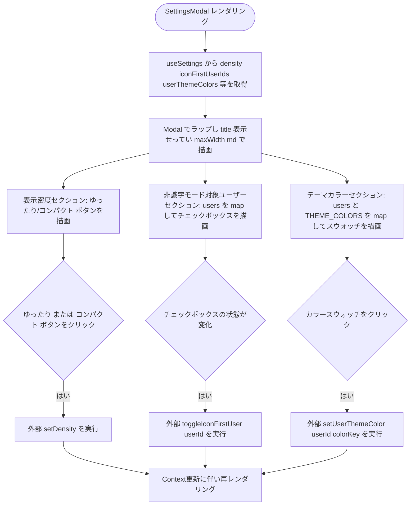
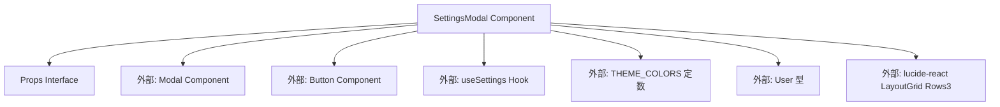

## 1. 解析メタ情報

| 項目 | 内容 |
| --- | --- |
| 対象ファイル | SettingsModal.tsx |
| 言語 | React (TypeScript) |
| 解析対象 | 提供されたコードのみ |
| 推測・補完 | 一切なし |

## 関連ドキュメント

* [./Modal.md](./Modal.md) - 本コンポーネントがラップして使用する汎用モーダルコンポーネント
* [./Button.md](./Button.md) - 表示密度切り替えボタンとして利用するコンポーネント
* [../../context/useSettings.md](../../context/useSettings.md) - `useSettings`フックの実装元（設定値・更新関数の取得元）
* [../../context/settingsShared.md](../../context/settingsShared.md) - `THEME_COLORS`定数の実装元
* [../../context/SettingsContext.md](../../context/SettingsContext.md) - `useSettings`が参照するContextのProvider本体
* [../../types/index.md](../../types/index.md) - `User`型定義の提供元
* [../../../App.md](../../../App.md) - 本コンポーネントを`lazy`で読み込み呼び出している側

## 2. ファイルの概要

表示密度（ゆったり/コンパクト）、非識字モード（アイコン主体表示）の対象ユーザー、ユーザーごとのパネルアクセントカラーをまとめて設定するモーダル画面である。`useSettings`フックから取得した設定値と更新関数を用い、ローカルなReact状態は持たずにContext経由の状態のみを操作する。ファイル冒頭のコメントによれば、以前は「アイコン主体表示」がコード上に固定されており画面から変更できなかった機能を、本コンポーネントの追加によって設定可能にしたという経緯がある。

* 根拠: `// 表示密度・非識字モード対象ユーザー・ユーザーごとのテーマカラーをまとめて設定する画面。\n// 以前は「アイコン主体表示」がコード上に固定されているだけで、誰も画面から変更できなかった。` (行番号: 15〜16)
* 根拠: `const { density, setDensity, iconFirstUserIds, toggleIconFirstUser, userThemeColors, setUserThemeColor } = useSettings();` (行番号: 18)
* 根拠: ローカルの`useState`宣言が本ファイル中に存在しない (行番号: 1〜101)

## 3. 外部依存関係

### インポート一覧

| 名称 | 種類 | 用途 | 根拠 |
| --- | --- | --- | --- |
| React | モジュール | Reactコンポーネント定義 | 根拠: `import React from 'react';` (行番号: 1) |
| Modal | コンポーネント | モーダルウィンドウの外枠として使用 | 根拠: `import { Modal } from './Modal';` (行番号: 2) |
| Button | コンポーネント | 表示密度切り替えの2つのボタンとして使用 | 根拠: `import { Button } from './Button';` (行番号: 3) |
| useSettings | フック | 設定値（`density`, `iconFirstUserIds`, `userThemeColors`）および更新関数（`setDensity`, `toggleIconFirstUser`, `setUserThemeColor`）の取得 | 根拠: `import { useSettings } from '@/context/useSettings';` (行番号: 4) |
| THEME_COLORS | 定数 | 選択可能なテーマカラー一覧（キー・ラベル・クラス名）の取得元、色スウォッチの描画に使用 | 根拠: `import { THEME_COLORS } from '@/context/settingsShared';` (行番号: 5) |
| User | 型 | `Props`の`users`配列の要素型 | 根拠: `import { User } from '@/types';` (行番号: 6) |
| LayoutGrid, Rows3 | アイコンコンポーネント | 表示密度ボタン（コンパクト/ゆったり）のアイコン表示 | 根拠: `import { LayoutGrid, Rows3 } from 'lucide-react';` (行番号: 7) |

### ブラックボックスとなる外部要素

| 名称 | 理由 | 根拠 |
| --- | --- | --- |
| Modal | `./Modal`の内部実装が本ファイルには存在せず、`isOpen`/`onClose`/`title`/`maxWidth`以外のprops仕様やESCキー・背景クリック時の挙動が不明 | 根拠: `<Modal isOpen={isOpen} onClose={onClose} title="表示せってい" maxWidth="md">` (行番号: 21) |
| Button | `./Button`の内部実装が本ファイルには存在せず、`variant`/`size`propsによる具体的なスタイル変化や音声再生等の副作用が不明 | 根拠: `<Button variant={density === 'comfortable' ? 'primary' : 'outline'} size="sm"` (行番号: 27〜28) |
| useSettings | `setDensity`/`toggleIconFirstUser`/`setUserThemeColor`の内部実装（永続化タイミング・副作用）が本ファイルからは不明 | 根拠: `import { useSettings } from '@/context/useSettings';` (行番号: 4) |
| THEME_COLORS | 定数の完全な内容（何色分あるか、`key`/`label`/`className`の全パターン）が本ファイルからは不明。`.map`で反復利用しているのみ | 根拠: `{THEME_COLORS.map(color => (` (行番号: 80) |
| User | `@/types`で定義された`User`型の全プロパティが本ファイルからは不明。`user_id`, `name`, `icon`のみが実際に参照されている | 根拠: `import { User } from '@/types';` (行番号: 6), `user.user_id`, `user.name`, `user.icon` (行番号: 52, 55, 60〜65, 77〜78, 83〜85) |
| lucide-react | `LayoutGrid`/`Rows3`アイコンの具体的な描画仕様は外部ライブラリの実装に依存し不明 | 根拠: `import { LayoutGrid, Rows3 } from 'lucide-react';` (行番号: 7) |

## 4. 主要要素の定義（関数 / エンドポイント / コンポーネント）

### `Props`

* **役割**: `SettingsModal`が受け取るプロパティの型定義。モーダルの開閉状態(`isOpen`)、閉じる際のコールバック(`onClose`)、設定対象となるユーザー一覧(`users`)を受け取る。
* 根拠: `interface Props {\n    isOpen: boolean;\n    onClose: () => void;\n    users: User[];\n}` (行番号: 9〜13)

* **引数/リクエスト**: 該当なし（型定義のため）
* 根拠: `interface Props {` (行番号: 9)

* **戻り値/レスポンス**: 該当なし（型定義のため）
* 根拠: `interface Props {` (行番号: 9)

* **副作用**: なし
* 根拠: `interface Props {` (行番号: 9〜13)

* **エラーハンドリング**: なし
* 根拠: `interface Props {` (行番号: 9〜13)

### `SettingsModal`

* **役割**: `useSettings`から取得した設定値をもとに、`Modal`内に「表示密度」「非識字モード対象ユーザー」「ユーザーごとのテーマカラー」の3セクションを描画し、各UI操作（ボタン/チェックボックス/カラースウォッチのクリック）を対応する`useSettings`の更新関数に橋渡しする。
* 根拠: `const SettingsModal: React.FC<Props> = ({ isOpen, onClose, users }) => {` (行番号: 17〜99)

* **引数/リクエスト**: `Props`型（`{ isOpen: boolean; onClose: () => void; users: User[] }`）
* 根拠: `({ isOpen, onClose, users })` (行番号: 17)

* **戻り値/レスポンス**: `JSX.Element`（`<Modal>`でラップされた3セクションのUI）
* 根拠: `return (\n        <Modal isOpen={isOpen} onClose={onClose} title="表示せってい" maxWidth="md">` (行番号: 20〜21)

* **副作用**:
  - 「ゆったり」/「コンパクト」ボタンのクリック時に`setDensity('comfortable')`/`setDensity('compact')`を呼び出す
  - 根拠: `onClick={() => setDensity('comfortable')}` (行番号: 31), `onClick={() => setDensity('compact')}` (行番号: 39)

  - 各ユーザーのチェックボックス変更時に`toggleIconFirstUser(user.user_id)`を呼び出す
  - 根拠: `onChange={() => toggleIconFirstUser(user.user_id)}` (行番号: 61)

  - 各ユーザー・各色のスウォッチクリック時に`setUserThemeColor(user.user_id, color.key)`を呼び出す
  - 根拠: `onClick={() => setUserThemeColor(user.user_id, color.key)}` (行番号: 84)

* **エラーハンドリング**: なし
* 根拠: ファイル内に`try-catch`やエラー制御の記述なし (行番号: 17〜99)

## 5. 処理フロー図

## 6. 依存関係図

## 7. 次のステップ（リバースエンジニアリングの提案）

| 優先度 | ファイル名(推測可) | 理由 | 根拠 |
| --- | --- | --- | --- |
| 高 | `@/context/useSettings.ts` および `@/context/SettingsContext.tsx` | `setDensity`/`toggleIconFirstUser`/`setUserThemeColor`の実装（永続化の有無・タイミング）を確認するため。 | 根拠: `import { useSettings } from '@/context/useSettings';` (行番号: 4) |
| 中 | `@/context/settingsShared.ts` | `THEME_COLORS`の全内容（選択可能な色の総数・キー一覧）を確認するため。 | 根拠: `import { THEME_COLORS } from '@/context/settingsShared';` (行番号: 5) |
| 中 | `../../../App.tsx` | 本コンポーネントを`isOpen`/`onClose`/`users`にどのような実データを渡して呼び出しているか（呼び出し実態）を確認するため。 | 根拠: 本ファイル単体では呼び出し元は不明 |
| 低 | `./Modal.tsx`, `./Button.tsx` | `title`/`maxWidth`/`variant`/`size`等のpropsが実際にどう描画・スタイリングされるかを確認するため。 | 根拠: `<Modal isOpen={isOpen} onClose={onClose} title="表示せってい" maxWidth="md">` (行番号: 21) |

## 8. 保守上の注意点

* ユーザーの表示順は呼び出し元から渡される`users`配列の順序にそのまま依存しており、本ファイル内でのソート処理は行っていない。
* 根拠: `{users.map(user => {` (行番号: 51), `{users.map(user => (` (行番号: 76)
* 「非識字モード対象ユーザー」の選択状態は`iconFirstUserIds.includes(user.user_id)`という配列総当たり判定であり、`users`の数が多い場合は毎レンダリングでO(n)の走査がユーザーごとに繰り返される。
* 根拠: `const checked = iconFirstUserIds.includes(user.user_id);` (行番号: 52)
* テーマカラーの選択状態は`userThemeColors[user.user_id] === color.key`という厳密等価比較のみで判定しており、`userThemeColors`に該当ユーザーのキーが存在しない場合は常に「未選択」（`border-transparent opacity-70`）として扱われる。
* 根拠: `userThemeColors[user.user_id] === color.key\n                                                ? 'border-white scale-110'\n                                                : 'border-transparent opacity-70 hover:opacity-100'` (行番号: 85〜88)
* `user.icon`が未設定の場合は絵文字`🙂`をフォールバック表示する。
* 根拠: `{user.icon || '🙂'}` (行番号: 64)

## 9. 不明事項一覧

| 項目 | 理由 | 必要なファイル |
| --- | --- | --- |
| `setDensity`/`toggleIconFirstUser`/`setUserThemeColor`の実装（永続化タイミング・副作用） | 外部フックであり本ファイルからは呼び出しのみで実装不明のため | `@/context/useSettings.ts`, `@/context/SettingsContext.tsx` |
| `THEME_COLORS`の全定義内容（色の総数・`key`/`label`/`className`一覧） | 外部定数であり本ファイルでは`.map`で利用するのみで内容不明のため | `@/context/settingsShared.ts` |
| `Modal`/`Button`コンポーネントの内部実装・スタイル仕様 | 外部コンポーネントでありprops経由の利用のみのため | `./Modal.tsx`, `./Button.tsx` |
| `User`型の完全なプロパティ一覧 | `@/types`からimportしているのみで、本ファイルで参照する`user_id`/`name`/`icon`以外のフィールドは不明のため | `@/types` |
| 呼び出し元（`App.tsx`）で`isOpen`/`onClose`/`users`に実際どのような値が渡されるか | 本ファイルはpropsの受け取り側のみであり、呼び出しコンテキストは含まれていないため | `../../../App.tsx` |

## 相互参照による補足情報

| 元の不明事項 | 判明した内容 | 参照元ドキュメント |
| --- | --- | --- |
| `Modal`コンポーネントの内部実装・スタイル仕様 | `Modal.md`の解析によれば、`Modal`は`ModalProps`型として`isOpen`（boolean）、`onClose`（() => void）、`title`（ReactNode、任意）、`children`（ReactNode）、`footer`（ReactNode、任意）、`maxWidth`（"sm" | "md" | "lg" | "xl"、任意）を受け取り、`isOpen`が`false`の場合は`null`を返し、`isOpen`中は`window`への`keydown`イベントリスナー登録（ESCキーで`onClose`実行）を行うとされている。本ファイルが渡す`title="表示せってい"`・`maxWidth="md"`はこのProps定義と型が一致する。ただしこれは`Modal.md`側の解析結果からの補足であり、`Modal.tsx`のソースコード自体は本ファイルの解析時点では確認していない。 | `./Modal.md` |
| `setDensity`/`toggleIconFirstUser`/`setUserThemeColor`の実装（永続化タイミング・副作用） | `family-quest/src/context/SettingsContext.tsx`と`useSettings.ts`を直接確認した。`useSettings()`（`useSettings.ts`4〜8行目）は`useContext(SettingsContext)`が`null`なら`SettingsProvider`外での使用として例外を送出する。`SettingsProvider`（`SettingsContext.tsx`28〜59行目）は初回マウント時に`loadSettings()`（12〜26行目）で`window.localStorage.getItem('familyQuest.settings.v1')`（`settingsShared.ts`56行目の`SETTINGS_STORAGE_KEY`）から状態を復元し、以後`settings`が変化するたび（`useEffect`31〜37行目）に`window.localStorage.setItem`で即時永続化する（`localStorage`が使えない環境ではcatchして永続化のみ諦める）。`setDensity`/`toggleIconFirstUser`/`setUserThemeColor`（41〜51行目）はいずれも`setSettings`によるイミュータブルな状態更新のみで、他の副作用（サーバー通信等）は行わない。 | 直接ソース確認: `family-quest/src/context/SettingsContext.tsx:12-59`, `family-quest/src/context/useSettings.ts:4-8`, `family-quest/src/context/settingsShared.ts:56` |
| `THEME_COLORS`の全定義内容（色の総数・`key`/`label`/`className`一覧） | `family-quest/src/context/settingsShared.ts:10-17`を直接確認した。`THEME_COLORS`は`blue`（ブルー, `bg-blue-500`）, `red`（レッド, `bg-red-500`）, `green`（グリーン, `bg-green-500`）, `purple`（パープル, `bg-purple-500`）, `pink`（ピンク, `bg-pink-500`）, `orange`（オレンジ, `bg-orange-500`）の計6色から成る`as const`配列である。対応する枠線色クラス`THEME_BORDER_CLASSES`（23〜30行目）とリング色クラス`THEME_RING_CLASSES`（32〜39行目）も同じ6キーで定義されている。 | 直接ソース確認: `family-quest/src/context/settingsShared.ts:10-39` |
| `Modal`/`Button`コンポーネントの内部実装・スタイル仕様（直接ソース確認） | `family-quest/src/components/ui/Modal.tsx`と`Button.tsx`を直接確認した。`Modal`は`isOpen`が`false`なら`null`を返し（32行目）、`isOpen`中はESCキー（24〜30行目の`useEffect`）・背景クリック（44〜47行目）・ヘッダー右上の閉じるボタン（58〜60行目、`Button variant="ghost" size="icon"`）のいずれでも`onClose`を呼ぶ。`Button`は`variant`ごとの色クラス（`variants`、25〜33行目）と`size`ごとの寸法クラス（`sizes`、36〜41行目）を`cn()`で結合し、クリック時は`useSound`の`play('tap')`（19行目, 47行目）を実行してから渡された`onClick`を呼び出す（`handleClick`、44〜52行目）。 | 直接ソース確認: `family-quest/src/components/ui/Modal.tsx:24-60`, `family-quest/src/components/ui/Button.tsx:19-52` |
| `User`型の完全なプロパティ一覧 | `family-quest/src/types/index.ts:9-26`を直接確認した。`User`インターフェースは`user_id: string`, `name: string`, `level: number`, `exp: number`, `avatar?: string`, `icon?: string`, `medal_count?: number`, `job_class?: string`, `gold: number`, `role?: string`, `hp?: number`, `maxHp?: number`の12プロパティを持つ。本ファイル（`SettingsModal.tsx`）が参照する`user_id`/`name`/`icon`以外に、レベル・経験値・ゴールド・役職・HP関連のフィールドが存在する。なお`hp`/`maxHp`についてはコード中コメント（20〜23行目）で「`maxHp`は`calculate_max_hp(level) = level * 20 + 5`というバックエンド側の計算式によるものであり、フロント側で独自に再計算してはいけない」という注記がある。 | 直接ソース確認: `family-quest/src/types/index.ts:9-26` |
| 呼び出し元（`App.tsx`）で`isOpen`/`onClose`/`users`に実際どのような値が渡されるか | `family-quest/src/App.tsx`を直接確認した。`SettingsModal`は44行目で`lazy(() => import('./components/ui/SettingsModal'))`により遅延読み込みされ、516〜518行目で`{settingsOpen && (<SettingsModal isOpen={settingsOpen} onClose={() => setSettingsOpen(false)} users={users} />)}`という条件付きレンダリングで呼び出される。`settingsOpen`は162行目の`useState(false)`によるローカル状態、`users`は171〜178行目の`useGameData(handleLevelUp)`フックの戻り値から分割代入された配列である。 | 直接ソース確認: `family-quest/src/App.tsx:44, 162, 171-178, 516-518` |

## 10. 自己検証結果

* [x] 推測・外部ファイルの仕様を一切含んでいない
* [x] 全関数・全クラス・全コンポーネントを列挙した
* [x] 全てのインポート要素を列挙した
* [x] すべての仕様説明に「根拠（行番号・抜粋）」を明記した
* [x] 根拠漏れが0件である
* [x] Mermaid構文にエラーの原因となる記号（エスケープ漏れ）がない
* [x] 不明事項を漏れなく列挙した
