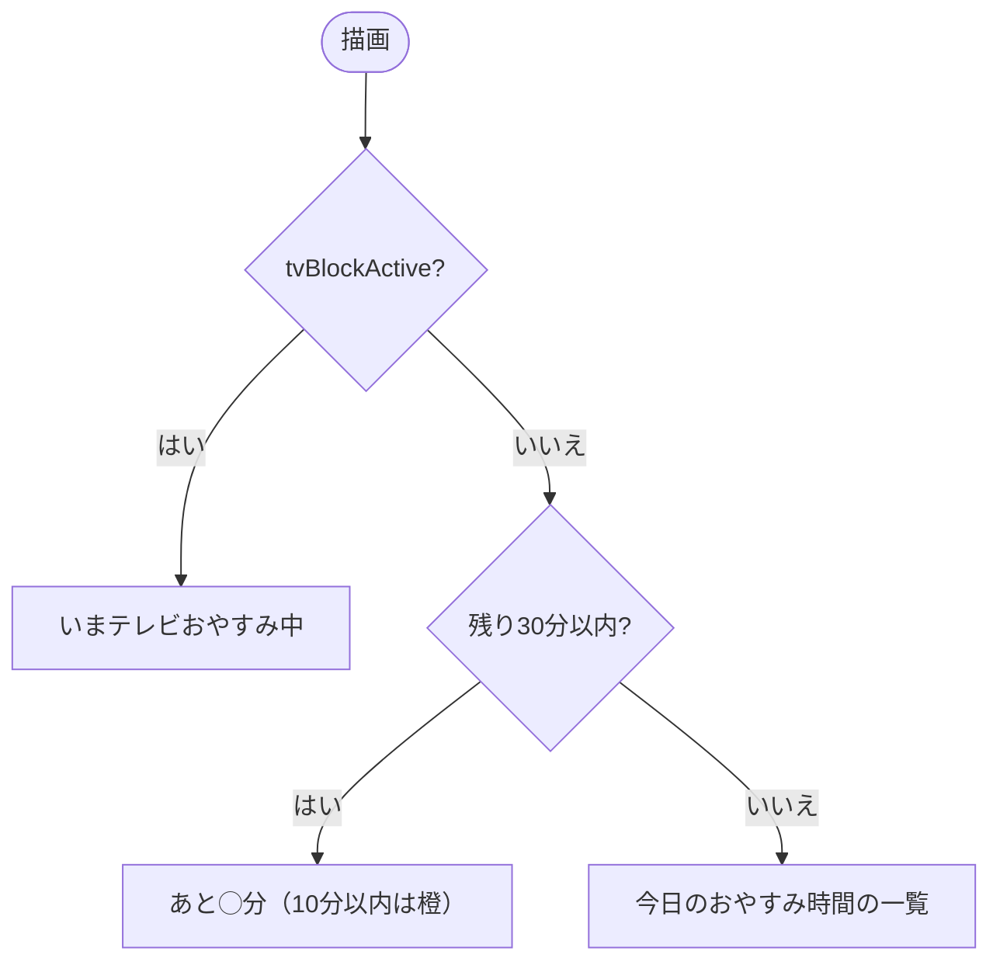
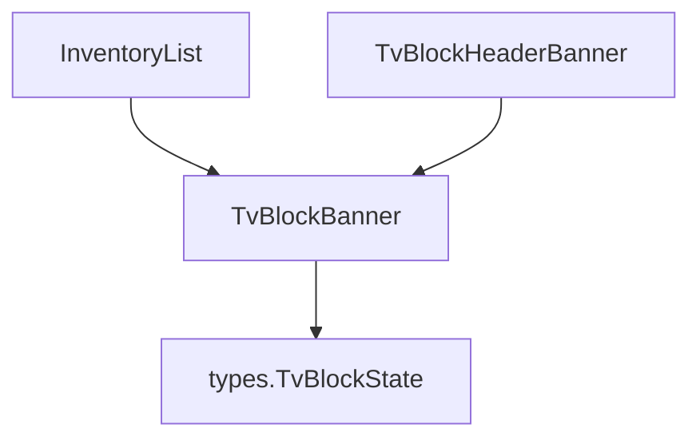

## 1. 解析メタ情報

| 項目 | 内容 |
| --- | --- |
| 対象ファイル | TvBlockBanner.tsx |
| 言語 | React (TypeScript) |
| 解析対象 | 提供されたコードのみ |
| 推測・補完 | 一切なし |

## 関連ドキュメント

* [../../../hooks/useTvBlock.md](../../../hooks/useTvBlock.md) - おやすみ状態と残り秒数を供給する側
* [../layout/TvBlockHeaderBanner.md](../layout/TvBlockHeaderBanner.md) - 画面上部での利用
* [../../features/shop/components/InventoryList.md](../../features/shop/components/InventoryList.md) - ごほうび画面での利用

## 2. ファイルの概要

* 休日のテレビおやすみの予告・表示バナー（`TvBlockBanner`）。おやすみ中は「いまテレビおやすみ中（HH:MM まで／あしたまで）」、それ以外は今日のおやすみ時間の一覧、禁止開始の30分前から「あと◯分」を出し、10分前以内は橙・30分前以内は琥珀・それ以前は藍の配色にする。
* 根拠: `const TvBlockBanner: React.FC<Props> = ({ tvBlock, tvSecondsLeft, tvBlockActive, large = false }) => {` (行番号: 17 / 抜粋: "const TvBlockBanner: React.FC<Props> = ({ tvBlock, tvSecondsLeft, tvBlockActive, large = false }) => {")
* ごほうび画面（InventoryList）と画面上部（TvBlockHeaderBanner）の両方が使い、判定・文言を1か所に保つ。
* 根拠: `// ごほうび画面(InventoryList)と画面上部(TvBlockHeaderBanner)の両方がこれを使い、` (行番号: 15 / 抜粋: "// ごほうび画面(InventoryList)と画面上部(TvBlockHeaderBanner)の両方がこれを使い、")

## 3. 外部依存関係

### インポート一覧

| 名称 | 種類 | 用途 | 根拠 |
| --- | --- | --- | --- |
| `TvBlockState` | 型 | 表示する状態の型 | 根拠: `import { TvBlockState } from '../../types';` (行番号: 2 / 抜粋: "import { TvBlockState } from '../../types';") |
| `React` | ライブラリ | JSX | 根拠: `import React from 'react';` (行番号: 1 / 抜粋: "import React from 'react';") |

### ブラックボックスとなる外部要素

| 名称 | 理由 | 根拠 |
| --- | --- | --- |
| 各importの実装 | 本ファイル外のため | 根拠: import文 (行番号: 1 / 抜粋: 判断不可) |

## 4. 主要要素の定義（関数 / エンドポイント / コンポーネント）

### TvBlockBanner

* **役割**: おやすみ状態から3種類（おやすみ中／通常予告／30分前以内）の帯を描画する表示専用コンポーネント。`large` で画面上部用の大きめ表示にする。
* 根拠: `const TvBlockBanner: React.FC<Props> = ({ tvBlock, tvSecondsLeft, tvBlockActive, large = false }) => {` (行番号: 17 / 抜粋: "const TvBlockBanner: React.FC<Props> = ({ tvBlock, tvSecondsLeft, tvBlockActive, large = false }) => {")
* **引数/リクエスト**: `tvBlock`, `tvSecondsLeft`（禁止開始までの残り秒数・null可）, `tvBlockActive`, `large`（既定 false）
* **戻り値/レスポンス**: JSX（`role="status"` の帯）
* **副作用**: なし（表示のみ）
* **エラーハンドリング**: なし

## 5. 処理フロー図

## 6. 依存関係図

## 7. 次のステップ（リバースエンジニアリングの提案）

| 優先度 | ファイル名(推測可) | 理由 |
| --- | --- | --- |
| 低 | `family-quest/src/hooks/useTvBlock.ts` | 残り秒数の算出元 |

## 8. 保守上の注意点

* 配色の閾値（30分・10分）は、ごほうび画面の券ロック判定ではなく表示のみのもの。券の使用可否は InventoryList 側で判定する。

## 9. 不明事項一覧

| 項目 | 理由 | 必要なファイル |
| --- | --- | --- |
| サーバー側のおやすみ時間帯の決め方 | 本ファイルは表示のみで、時間帯の定義はこのファイルにないため | MY_HOME_SYSTEM/services/switchbot_service.py |

## 10. 自己検証結果

* [x] 推測・外部ファイルの仕様を一切含んでいない
* [x] 全関数・全クラス・全コンポーネントを列挙した
* [x] 全てのインポート要素を列挙した
* [x] すべての仕様説明に「根拠（行番号・抜粋）」を明記した
* [x] 根拠漏れが0件である
* [x] Mermaid構文にエラーの原因となる記号（エスケープ漏れ）がない
* [x] 不明事項を漏れなく列挙した
