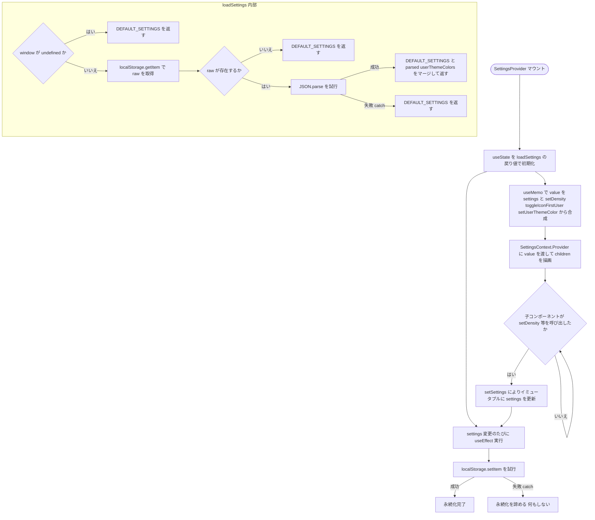
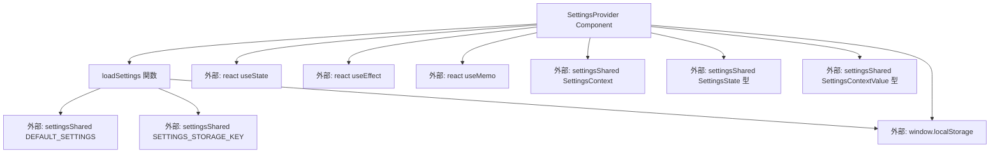

## 1. 解析メタ情報

| 項目 | 内容 |
| --- | --- |
| 対象ファイル | SettingsContext.tsx |
| 言語 | React (TypeScript) |
| 解析対象 | 提供されたコードのみ |
| 推測・補完 | 一切なし |

## 関連ドキュメント

* [./settingsShared.md](./settingsShared.md) - `SettingsContext`（Context object）、`SettingsState`/`SettingsContextValue`型、`DEFAULT_SETTINGS`、`SETTINGS_STORAGE_KEY`の実装元（本ファイルが分離元として直接importしている）
* [./useSettings.md](./useSettings.md) - 本ファイルが提供する`SettingsContext`を`useContext`で読み出す、対となる消費側フック
* [../components/ui/SettingsModal.md](../components/ui/SettingsModal.md) - `useSettings`経由で本Providerの値を利用する画面の一例
* [../../main.md](../../main.md) - `SettingsProvider`を実際にマウントしてアプリ全体をラップしている呼び出し元

## 2. ファイルの概要

アプリ全体の表示設定（表示密度、非識字モード対象ユーザー、ユーザーごとのテーマカラー）を管理する`SettingsProvider`コンポーネントを提供するファイルである。設定値は`localStorage`に永続化され、次回起動時にも引き継がれる。ファイル冒頭のコメントによれば、バックエンドに保存する必要のない「この端末でのUI好み」のみを扱う設計であり、型・定数・`useSettings`フックは`react-refresh`の「1ファイルはコンポーネントのみexportする」制約により`settingsShared.ts`/`useSettings.ts`に分離されているとされている。

* 根拠: `// アプリ全体の表示設定。localStorage に永続化し、次回起動時も引き継ぐ。\n// バックエンドに保存する必要のない「この端末でのUI好み」のみを扱う。\n// 型・定数・useSettings フックは settingsShared.ts / useSettings.ts に分離している\n// (react-refresh の「1ファイルはコンポーネントのみexportする」制約のため)。` (行番号: 7〜10)
* 根拠: `window.localStorage.setItem(SETTINGS_STORAGE_KEY, JSON.stringify(settings));` (行番号: 33)

## 3. 外部依存関係

### インポート一覧

| 名称 | 種類 | 用途 | 根拠 |
| --- | --- | --- | --- |
| React | モジュール | Reactコンポーネント定義 | 根拠: `import React, { useEffect, useMemo, useState } from 'react';` (行番号: 1) |
| useEffect | フック | `settings`変更時に`localStorage`へ永続化するための副作用処理 | 根拠: `import React, { useEffect, useMemo, useState } from 'react';` (行番号: 1) |
| useMemo | フック | Context経由で提供する`value`オブジェクト（設定値＋更新関数群）のメモ化 | 根拠: `import React, { useEffect, useMemo, useState } from 'react';` (行番号: 1) |
| useState | フック | 設定状態(`settings`)のローカル管理、初期値は`loadSettings`関数の戻り値 | 根拠: `import React, { useEffect, useMemo, useState } from 'react';` (行番号: 1) |
| SettingsContext | Context object | `SettingsProvider`がラップする対象のContext | 根拠: `import {\n    SettingsContext, SettingsState, SettingsContextValue,\n    DEFAULT_SETTINGS, SETTINGS_STORAGE_KEY,\n} from './settingsShared';` (行番号: 2〜5) |
| SettingsState | 型 | `loadSettings`関数および`useState`の型注釈 | 根拠: `import {\n    SettingsContext, SettingsState, SettingsContextValue,\n    DEFAULT_SETTINGS, SETTINGS_STORAGE_KEY,\n} from './settingsShared';` (行番号: 2〜5) |
| SettingsContextValue | 型 | Context経由で提供する`value`オブジェクトの型注釈 | 根拠: `import {\n    SettingsContext, SettingsState, SettingsContextValue,\n    DEFAULT_SETTINGS, SETTINGS_STORAGE_KEY,\n} from './settingsShared';` (行番号: 2〜5) |
| DEFAULT_SETTINGS | 定数 | `localStorage`が存在しない・パース失敗時のフォールバック値、および読み込んだ値とのマージ元 | 根拠: `import {\n    SettingsContext, SettingsState, SettingsContextValue,\n    DEFAULT_SETTINGS, SETTINGS_STORAGE_KEY,\n} from './settingsShared';` (行番号: 2〜5) |
| SETTINGS_STORAGE_KEY | 定数 | `localStorage`への読み書きに使うキー文字列 | 根拠: `import {\n    SettingsContext, SettingsState, SettingsContextValue,\n    DEFAULT_SETTINGS, SETTINGS_STORAGE_KEY,\n} from './settingsShared';` (行番号: 2〜5) |

### ブラックボックスとなる外部要素

| 名称 | 理由 | 根拠 |
| --- | --- | --- |
| `SettingsContext`, `SettingsState`, `SettingsContextValue`, `DEFAULT_SETTINGS`, `SETTINGS_STORAGE_KEY` | いずれも`./settingsShared`からのimportであり、本ファイルには実装が存在しないため、`DEFAULT_SETTINGS`の具体的な値の中身や`SettingsContextValue`の完全な形状は不明 | 根拠: `import {\n    SettingsContext, SettingsState, SettingsContextValue,\n    DEFAULT_SETTINGS, SETTINGS_STORAGE_KEY,\n} from './settingsShared';` (行番号: 2〜5) |
| `window.localStorage` | ブラウザ実行環境のAPIであり、プライベートモードや容量制限時の具体的な失敗挙動はコード単体からは判定不可（本ファイルは`try-catch`で失敗時を静かに無視するのみ） | 根拠: `const raw = window.localStorage.getItem(SETTINGS_STORAGE_KEY);` (行番号: 15), `window.localStorage.setItem(SETTINGS_STORAGE_KEY, JSON.stringify(settings));` (行番号: 33) |

## 4. 主要要素の定義（関数 / エンドポイント / コンポーネント）

### `loadSettings` (モジュールレベル関数)

* **役割**: `localStorage`から保存済みの設定を読み込み、`DEFAULT_SETTINGS`とマージして返す。`window`が存在しない（SSR等）場合、保存データがない場合、JSONパースに失敗した場合は`DEFAULT_SETTINGS`にフォールバックする。`userThemeColors`のみ、保存値と`DEFAULT_SETTINGS`のプロパティをさらにネストしてマージする。
* 根拠: `function loadSettings(): SettingsState {` (行番号: 12〜26)

* **引数/リクエスト**: なし
* 根拠: `function loadSettings(): SettingsState {` (行番号: 12)

* **戻り値/レスポンス**: `SettingsState`
* 根拠: `function loadSettings(): SettingsState {` (行番号: 12), `return {\n            ...DEFAULT_SETTINGS,\n            ...parsed,\n            userThemeColors: { ...DEFAULT_SETTINGS.userThemeColors, ...(parsed.userThemeColors || {}) },\n        };` (行番号: 18〜22)

* **副作用**: `window.localStorage.getItem`の呼び出し（読み取りのみ、書き込みなし）
* 根拠: `const raw = window.localStorage.getItem(SETTINGS_STORAGE_KEY);` (行番号: 15)

* **エラーハンドリング**: `typeof window === 'undefined'`の場合は`DEFAULT_SETTINGS`を即座に返す。`try-catch`により、`JSON.parse`失敗時（不正なJSON等）も`DEFAULT_SETTINGS`にフォールバックする。
* 根拠: `if (typeof window === 'undefined') return DEFAULT_SETTINGS;` (行番号: 13), `} catch {\n        return DEFAULT_SETTINGS;\n    }` (行番号: 23〜25)

### `SettingsProvider`

* **役割**: `loadSettings`を初期値として`settings`ステートを保持し、`settings`が変化するたびに`localStorage`へ永続化する。`useMemo`で`settings`（展開）と3つの更新関数（`setDensity`, `toggleIconFirstUser`, `setUserThemeColor`）を合成した`value`オブジェクトを生成し、`SettingsContext.Provider`として子要素に提供する。
* 根拠: `export const SettingsProvider: React.FC<{ children: React.ReactNode }> = ({ children }) => {` (行番号: 28〜59)

* **引数/リクエスト**: `{ children: React.ReactNode }`
* 根拠: `({ children })` (行番号: 28)

* **戻り値/レスポンス**: `JSX.Element`（`<SettingsContext.Provider value={value}>{children}</SettingsContext.Provider>`）
* 根拠: `return (\n        <SettingsContext.Provider value={value}>\n            {children}\n        </SettingsContext.Provider>\n    );` (行番号: 54〜58)

* **副作用**:
  - `settings`ステートの変更を検知する`useEffect`内で`window.localStorage.setItem`を呼び出し、設定をJSON文字列として永続化する
  - 根拠: `useEffect(() => {\n        try {\n            window.localStorage.setItem(SETTINGS_STORAGE_KEY, JSON.stringify(settings));` (行番号: 31〜33)

  - `setDensity`/`toggleIconFirstUser`/`setUserThemeColor`のいずれかが呼び出されると、`setSettings`により`settings`ステートを不変更新（イミュータブルなスプレッド）する
  - 根拠: `setDensity: (density) => setSettings(s => ({ ...s, density })),` (行番号: 41), `toggleIconFirstUser: (userId) => setSettings(s => ({` (行番号: 42), `setUserThemeColor: (userId, color) => setSettings(s => ({` (行番号: 48)

* **エラーハンドリング**: `localStorage`への書き込み(`setItem`)を`try-catch`で囲み、失敗時（プライベートモード等で`localStorage`が使用不可の場合）はコメントの通り永続化を諦め、例外を再送出しない。
* 根拠: `} catch {\n            // localStorageが使えない環境(プライベートモード等)では単に永続化を諦める\n        }` (行番号: 34〜36)

## 5. 処理フロー図

## 6. 依存関係図

## 7. 次のステップ（リバースエンジニアリングの提案）

| 優先度 | ファイル名(推測可) | 理由 | 根拠 |
| --- | --- | --- | --- |
| 高 | `./settingsShared.ts` | `DEFAULT_SETTINGS`の具体的な値、`SettingsState`/`SettingsContextValue`の完全な形状、`SETTINGS_STORAGE_KEY`の実際の文字列を確認するため。 | 根拠: `import {\n    SettingsContext, SettingsState, SettingsContextValue,\n    DEFAULT_SETTINGS, SETTINGS_STORAGE_KEY,\n} from './settingsShared';` (行番号: 2〜5) |
| 中 | `./useSettings.ts` | `SettingsContext`を実際に消費する側のフックの実装（Providerの外で呼び出された場合の挙動等）を確認するため。 | 根拠: コメント「useSettings フックは settingsShared.ts / useSettings.ts に分離している」(行番号: 9) |
| 中 | `../../main.tsx` | `SettingsProvider`がアプリのどの階層でマウントされているか（`ToastProvider`との入れ子順序等）を確認するため。 | 根拠: 本ファイル単体では呼び出し元は不明 |

## 8. 保守上の注意点

* `useState`の初期値には`loadSettings`という関数そのものを渡している（遅延初期化）ため、`loadSettings`は初回レンダリング時に一度だけ実行される。
* 根拠: `const [settings, setSettings] = useState<SettingsState>(loadSettings);` (行番号: 29)
* `localStorage`への読み込み・書き込みの両方が`try-catch`で保護されており、失敗時は例外を投げずに黙って`DEFAULT_SETTINGS`へフォールバック（読み込み時）または永続化をスキップ（書き込み時）する。呼び出し元からはこれらの失敗を検知する手段がない。
* 根拠: `} catch {\n        return DEFAULT_SETTINGS;\n    }` (行番号: 23〜25), `} catch {\n            // localStorageが使えない環境(プライベートモード等)では単に永続化を諦める\n        }` (行番号: 34〜36)
* `userThemeColors`のみ、`loadSettings`内で`DEFAULT_SETTINGS.userThemeColors`と`parsed.userThemeColors`をネストしてマージしている。`density`や`iconFirstUserIds`等の他のフィールドは`parsed`側の値でそのまま上書きされるため、保存データの形式が古い場合にフィールドごとに異なるマージ挙動になる点に注意が必要。
* 根拠: `return {\n            ...DEFAULT_SETTINGS,\n            ...parsed,\n            userThemeColors: { ...DEFAULT_SETTINGS.userThemeColors, ...(parsed.userThemeColors || {}) },\n        };` (行番号: 18〜22)
* `value`は`useMemo`により`settings`が変わるたびにのみ再生成されるため、`setDensity`等の関数自体は`settings`変更のたびに新しい参照になる（`useCallback`ではなく`useMemo`内のインライン関数定義のため）。これに依存するメモ化されたコンポーネント（`React.memo`等）がある場合、意図しない再レンダリングが発生する可能性がある。
* 根拠: `const value = useMemo<SettingsContextValue>(() => ({\n        ...settings,\n        setDensity: (density) => setSettings(s => ({ ...s, density })),` (行番号: 39〜41)

## 9. 不明事項一覧

| 項目 | 理由 | 必要なファイル |
| --- | --- | --- |
| `DEFAULT_SETTINGS`の具体的な値 | 外部ファイルに実装が存在するため | `./settingsShared.ts` |
| `SettingsState`/`SettingsContextValue`の完全な型形状 | 外部ファイルに実装が存在するため | `./settingsShared.ts` |
| `SETTINGS_STORAGE_KEY`の実際の文字列値 | 外部ファイルに実装が存在するため | `./settingsShared.ts` |
| `useSettings`フック側でProviderの外から呼び出された場合の挙動 | 本ファイルには`useSettings`の実装が存在しないため | `./useSettings.ts` |
| `SettingsProvider`がアプリ内でどの階層・順序でマウントされているか | 本ファイルはコンポーネント定義のみで呼び出し元の情報を含まないため | `../../main.tsx` |

## 10. 自己検証結果

* [x] 推測・外部ファイルの仕様を一切含んでいない
* [x] 全関数・全クラス・全コンポーネントを列挙した
* [x] 全てのインポート要素を列挙した
* [x] すべての仕様説明に「根拠（行番号・抜粋）」を明記した
* [x] 根拠漏れが0件である
* [x] Mermaid構文にエラーの原因となる記号（エスケープ漏れ）がない
* [x] 不明事項を漏れなく列挙した
