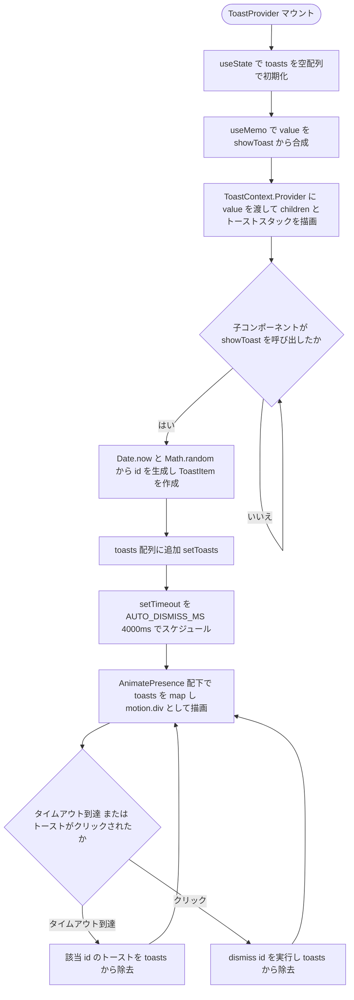
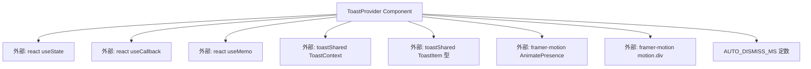

## 1. 解析メタ情報

| 項目 | 内容 |
| --- | --- |
| 対象ファイル | ToastContext.tsx |
| 言語 | React (TypeScript) |
| 解析対象 | 提供されたコードのみ |
| 推測・補完 | 一切なし |

## 関連ドキュメント

* [./toastShared.md](./toastShared.md) - `ToastContext`（Context object）、`ToastItem`型の実装元（本ファイルが分離元として直接importしている）
* [./useToast.md](./useToast.md) - 本ファイルが提供する`ToastContext`を`useContext`で読み出す、対となる消費側フック
* [../../main.md](../../main.md) - `ToastProvider`を実際にマウントしてアプリ全体をラップしている呼び出し元

## 2. ファイルの概要

レベルアップやメダル獲得などの「成功の演出」を、作業を止めるブロッキングモーダルではなく、自動で消える軽量トーストとして表示するための`ToastProvider`コンポーネントを提供するファイルである。`showToast`関数で追加されたトーストは4秒後に自動的に消え、複数のトーストが連続して追加された場合は積み上げて表示される。ファイル冒頭のコメントによれば、型・Context object・`useToast`フックは`react-refresh`の「1ファイルはコンポーネントのみexportする」制約により`toastShared.ts`/`useToast.ts`に分離されているとされている。

* 根拠: `// レベルアップ/メダル獲得などの「成功の演出」を、作業を止めるブロッキングモーダルではなく\n// 自動で消える軽量トーストとして表示するための仕組み。\n// 型・Context object・useToast フックは toastShared.ts / useToast.ts に分離している。` (行番号: 5〜7)
* 根拠: `const AUTO_DISMISS_MS = 4000;` (行番号: 9)
* 根拠: `{/* トーストスタック: 複数連続完了でも作業を止めずに積み上げて表示する */}` (行番号: 33)

## 3. 外部依存関係

### インポート一覧

| 名称 | 種類 | 用途 | 根拠 |
| --- | --- | --- | --- |
| React | モジュール | Reactコンポーネント定義 | 根拠: `import React, { useCallback, useMemo, useState } from 'react';` (行番号: 1) |
| useCallback | フック | `showToast`/`dismiss`関数の参照を安定化するために使用 | 根拠: `import React, { useCallback, useMemo, useState } from 'react';` (行番号: 1) |
| useMemo | フック | Context経由で提供する`value`オブジェクト（`{ showToast }`）のメモ化 | 根拠: `import React, { useCallback, useMemo, useState } from 'react';` (行番号: 1) |
| useState | フック | 表示中のトースト一覧(`toasts`)のローカル状態管理 | 根拠: `import React, { useCallback, useMemo, useState } from 'react';` (行番号: 1) |
| AnimatePresence | コンポーネント | トーストの追加・削除時のマウント/アンマウントアニメーション制御 | 根拠: `import { AnimatePresence, motion } from 'framer-motion';` (行番号: 2) |
| motion | オブジェクト | アニメーション付きのトースト要素（`motion.div`）の描画 | 根拠: `import { AnimatePresence, motion } from 'framer-motion';` (行番号: 2) |
| ToastContext | Context object | `ToastProvider`がラップする対象のContext | 根拠: `import { ToastContext, ToastItem } from './toastShared';` (行番号: 3) |
| ToastItem | 型 | トースト1件分のデータ構造（`toasts`ステートおよび`showToast`引数の型） | 根拠: `import { ToastContext, ToastItem } from './toastShared';` (行番号: 3) |

### ブラックボックスとなる外部要素

| 名称 | 理由 | 根拠 |
| --- | --- | --- |
| `ToastContext`, `ToastItem` | いずれも`./toastShared`からのimportであり、本ファイルには実装が存在しないため、`ToastItem`の完全なプロパティ一覧や`ToastContext`のデフォルト値は不明 | 根拠: `import { ToastContext, ToastItem } from './toastShared';` (行番号: 3) |
| framer-motion (`AnimatePresence`, `motion`) | 外部ライブラリであり、アニメーションの具体的なレンダリング・タイミング制御の内部実装は不明 | 根拠: `import { AnimatePresence, motion } from 'framer-motion';` (行番号: 2) |

## 4. 主要要素の定義（関数 / エンドポイント / コンポーネント）

### `AUTO_DISMISS_MS` (モジュールレベル定数)

* **役割**: トーストが自動的に消えるまでの時間（ミリ秒）。値は`4000`（4秒）。
* 根拠: `const AUTO_DISMISS_MS = 4000;` (行番号: 9)

### `ToastProvider`

* **役割**: 表示中トースト一覧(`toasts`)をステートとして保持し、`showToast`（トースト追加）と`dismiss`（トースト削除）の2つの操作関数を`useMemo`で`{ showToast }`としてまとめ、`ToastContext.Provider`として子要素に提供する。加えて、`children`の後段に固定配置(`fixed top-4`)のトーストスタックを`AnimatePresence`と`motion.div`で描画する。
* 根拠: `export const ToastProvider: React.FC<{ children: React.ReactNode }> = ({ children }) => {` (行番号: 11〜58)

* **引数/リクエスト**: `{ children: React.ReactNode }`
* 根拠: `({ children })` (行番号: 11)

* **戻り値/レスポンス**: `JSX.Element`（`<ToastContext.Provider value={value}>`内に`children`とトーストスタック`
`を含む）
* 根拠: `return (\n        <ToastContext.Provider value={value}>\n            {children}` (行番号: 29〜31)

* **副作用**:
  - `showToast`呼び出し時、`Date.now() + Math.random()`をidとする新規`ToastItem`を`toasts`配列に追加し、さらに`AUTO_DISMISS_MS`（4000ms）後に同idのトーストを`toasts`配列から除去する`setTimeout`をスケジュールする
  - 根拠: `const showToast = useCallback((toast: Omit<ToastItem, 'id' | 'createdAt'>) => {\n        const item: ToastItem = { ...toast, id: Date.now() + Math.random(), createdAt: Date.now() };\n        setToasts(prev => [...prev, item]);\n\n        setTimeout(() => {\n            setToasts(prev => prev.filter(t => t.id !== item.id));\n        }, AUTO_DISMISS_MS);` (行番号: 14〜20)

  - トースト要素のクリック時、`dismiss(t.id)`により該当トーストを`toasts`配列から即座に除去する
  - 根拠: `onClick={() => dismiss(t.id)}` (行番号: 44), `const dismiss = useCallback((id: number) => {\n        setToasts(prev => prev.filter(t => t.id !== id));\n    }, []);` (行番号: 23〜25)

* **エラーハンドリング**: なし
* 根拠: ファイル内に`try-catch`やエラー制御の記述なし (行番号: 11〜58)

## 5. 処理フロー図

## 6. 依存関係図

## 7. 次のステップ（リバースエンジニアリングの提案）

| 優先度 | ファイル名(推測可) | 理由 | 根拠 |
| --- | --- | --- | --- |
| 高 | `./toastShared.ts` | `ToastItem`の完全なプロパティ一覧（`title`/`text`/`icon`以外に必須項目があるか）と`ToastContext`の初期値を確認するため。 | 根拠: `import { ToastContext, ToastItem } from './toastShared';` (行番号: 3) |
| 中 | `./useToast.ts` | `ToastContext`を実際に消費する側のフックの実装（Providerの外で呼び出された場合の挙動等）を確認するため。 | 根拠: コメント「useToast フックは toastShared.ts / useToast.ts に分離している」(行番号: 7) |
| 中 | `../../main.tsx` | `ToastProvider`がアプリのどの階層でマウントされているか（`SettingsProvider`との入れ子順序等）を確認するため。 | 根拠: 本ファイル単体では呼び出し元は不明 |
| 低 | `showToast`を実際に呼び出している各画面ファイル群 | `title`/`text`/`icon`にどのような実データ（レベルアップ・メダル獲得等）が渡されているかを確認するため。 | 根拠: 本ファイルは`showToast`の定義のみで呼び出し元は含まない |

## 8. 保守上の注意点

* トーストの`id`は`Date.now() + Math.random()`で生成されており、数値の衝突可能性は理論上ゼロではないが極めて低い。`id`が重複した場合、`dismiss`や自動削除の`filter`処理が意図せず複数件を同時に除去する可能性がある。
* 根拠: `const item: ToastItem = { ...toast, id: Date.now() + Math.random(), createdAt: Date.now() };` (行番号: 15)
* `showToast`で追加した各トースト用の`setTimeout`は、`AUTO_DISMISS_MS`（4000ms）経過後に発火するタイマーIDを保持・クリアする仕組みがない。トーストが手動で`dismiss`された後もタイマー自体は生き続け、`AUTO_DISMISS_MS`経過時に同idを対象とした`filter`処理が実行される（既に存在しないため実質的な影響はないが、不要なタイマーコールバックは実行される）。
* 根拠: `setTimeout(() => {\n            setToasts(prev => prev.filter(t => t.id !== item.id));\n        }, AUTO_DISMISS_MS);` (行番号: 18〜20)
* トーストスタックは`div`要素に`onClick`が設定されているため、トースト全体のどこをクリックしても`dismiss`される。誤タップで意図せず消えてしまう可能性がある。
* 根拠: `onClick={() => dismiss(t.id)}` (行番号: 44)
* トーストスタックの外枠`div`には`pointer-events-none`、各トースト要素には`pointer-events-auto`が指定されており、トーストが存在しない領域ではクリックイベントが背面の要素に透過する設計になっている。
* 根拠: `className="fixed top-4 left-1/2 -translate-x-1/2 z-[100] flex flex-col items-center gap-2 pointer-events-none w-full max-w-sm px-4"` (行番号: 34), `className="pointer-events-auto w-full bg-slate-800` (行番号: 45)

## 9. 不明事項一覧

| 項目 | 理由 | 必要なファイル |
| --- | --- | --- |
| `ToastItem`の完全なプロパティ一覧 | 外部ファイルに実装が存在するため | `./toastShared.ts` |
| `useToast`フック側でProviderの外から呼び出された場合の挙動 | 本ファイルには`useToast`の実装が存在しないため | `./useToast.ts` |
| `ToastProvider`がアプリ内でどの階層・順序でマウントされているか | 本ファイルはコンポーネント定義のみで呼び出し元の情報を含まないため | `../../main.tsx` |
| `showToast`に実際に渡される`title`/`text`/`icon`の実データ | 呼び出し元のコンテキストが本ファイルには含まれないため | `showToast`を呼び出している各画面ファイル |

## 10. 自己検証結果

* [x] 推測・外部ファイルの仕様を一切含んでいない
* [x] 全関数・全クラス・全コンポーネントを列挙した
* [x] 全てのインポート要素を列挙した
* [x] すべての仕様説明に「根拠（行番号・抜粋）」を明記した
* [x] 根拠漏れが0件である
* [x] Mermaid構文にエラーの原因となる記号（エスケープ漏れ）がない
* [x] 不明事項を漏れなく列挙した
