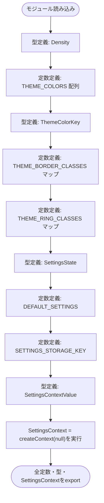
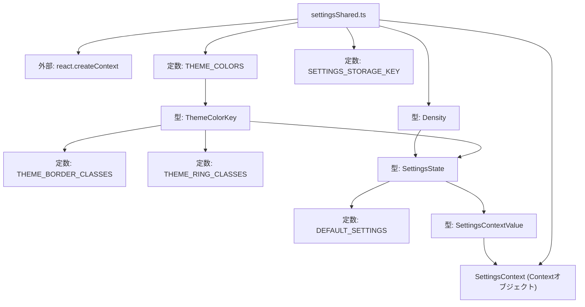

## 1. 解析メタ情報

| 項目 | 内容 |
| --- | --- |
| 対象ファイル | settingsShared.ts |
| 言語 | React (TypeScript) |
| 解析対象 | 提供されたコードのみ |
| 推測・補完 | 一切なし |

## 関連ドキュメント

- [./useSettings.md](./useSettings.md) — 本ファイルの`SettingsContext`を`useContext`で参照するフック。
- [./SettingsContext.md](./SettingsContext.md) — 本ファイルの型・定数・`SettingsContext`を用いてProviderを実装する側（react-refresh制約によりコンポーネント本体はこちらに分離されている）。
- [../../App.md](../../App.md) — `useSettings`経由で本ファイルの型・定数を間接的に利用する側。
- [../features/family/components/FamilyDashboard.md](../features/family/components/FamilyDashboard.md) — `useSettings`経由で本ファイルの型・定数を間接的に利用する側。コメントによれば`iconFirstUserIds`の`'daughter'`ハードコードが以前存在した箇所。

## 2. ファイルの概要

* 表示設定（density、アイコン主体表示対象ユーザー、ユーザー別テーマカラー）に関する型・定数・React Contextオブジェクトを集約して提供するモジュールである。
* 根拠: `export type Density = 'comfortable' | 'compact';` (行番号: 8 / 抜粋: "export type Density = 'comfortable' | 'compact';"), `export interface SettingsState {` (行番号: 41〜48 / 抜粋: "export interface SettingsState {"), `export const SettingsContext = createContext<SettingsContextValue | null>(null);` (行番号: 64 / 抜粋: "export const SettingsContext = createContext<SettingsContextValue | null>(null);")
* ファイル冒頭のコメントによれば、Provider本体（`SettingsContext.tsx`）とフック（`useSettings.ts`）の双方から参照される型・定数・Context objectをここに集約しており、これはreact-refreshの「1ファイルはコンポーネントのみexportする」制約によるコンポーネント分離のためであるとされている。
* 根拠: `// SettingsContext.tsx(Provider本体)と useSettings.ts(フック)の両方から参照する\n// 型・定数・Context object をここに集約する。\n// (react-refresh の "1ファイルはコンポーネントのみexportする" 制約により、\n//  コンポーネントを export する SettingsContext.tsx と分離している)` (行番号: 3〜6 / 抜粋: "SettingsContext.tsx(Provider本体)と useSettings.ts(フック)の両方から参照する")
* テーマカラーのキー一覧（`THEME_COLORS`）と、それに対応する枠線色・リング色のTailwindクラス名マップ（`THEME_BORDER_CLASSES`、`THEME_RING_CLASSES`）を保持しており、コメントによればTailwindがクラス名を動的生成できないため、あらかじめ全パターンを列挙しているとされている。
* 根拠: `// Tailwindはクラス名を動的生成できないため、あらかじめ全パターンを列挙しておく。` (行番号: 22 / 抜粋: "Tailwindはクラス名を動的生成できないため、あらかじめ全パターンを列挙しておく。")

## 3. 外部依存関係

### インポート一覧

| 名称 | 種類 | 用途 | 根拠 |
| --- | --- | --- | --- |
| `createContext` | 関数 | `SettingsContext`というReact Contextオブジェクトを生成するため | 根拠: `import { createContext } from 'react';` (行番号: 1 / 抜粋: "import { createContext } from 'react';") |

### ブラックボックスとなる外部要素

該当なし

## 4. 主要要素の定義（関数 / エンドポイント / コンポーネント）

### Density

* **役割**: 表示密度の設定値（`'comfortable'`または`'compact'`）を表す型。
* 根拠: `export type Density = 'comfortable' | 'compact';` (行番号: 8 / 抜粋: "export type Density = 'comfortable' | 'compact';")

* **引数/リクエスト**: 該当なし（型定義のため関数ではない）
* 根拠: `export type Density = 'comfortable' | 'compact';` (行番号: 8 / 抜粋: "export type Density = 'comfortable' | 'compact';")

* **戻り値/レスポンス**: 該当なし（型定義のため関数ではない）
* 根拠: `export type Density = 'comfortable' | 'compact';` (行番号: 8 / 抜粋: "export type Density = 'comfortable' | 'compact';")

* **副作用**: なし
* 根拠: 型定義のみで実行文を含まない (行番号: 8)

* **エラーハンドリング**: なし
* 根拠: 型定義のみで実行文を含まない (行番号: 8)

### THEME_COLORS

* **役割**: 選択可能なテーマカラーのキー（`key`）、日本語ラベル（`label`）、Tailwindの背景色クラス名（`className`）の組を6件保持する定数配列。`as const`により各要素がリテラル型として扱われる。
* 根拠: `export const THEME_COLORS = [\n    { key: 'blue', label: 'ブルー', className: 'bg-blue-500' },\n    ...\n] as const;` (行番号: 10〜17 / 抜粋: "export const THEME_COLORS = [")

* **引数/リクエスト**: 該当なし（定数のため関数ではない）
* 根拠: `export const THEME_COLORS = [` (行番号: 10 / 抜粋: "export const THEME_COLORS = [")

* **戻り値/レスポンス**: 該当なし（`{key, label, className}`の読み取り専用配列を保持する変数）
* 根拠: `] as const;` (行番号: 17 / 抜粋: "] as const;")

* **副作用**: なし
* 根拠: 定数定義のみで実行文を含まない (行番号: 10〜17)

* **エラーハンドリング**: なし
* 根拠: 定数定義のみで実行文を含まない (行番号: 10〜17)

### ThemeColorKey

* **役割**: `THEME_COLORS`の各要素が持つ`key`プロパティの値（`'blue' | 'red' | 'green' | 'purple' | 'pink' | 'orange'`）を導出したユニオン型。
* 根拠: `export type ThemeColorKey = typeof THEME_COLORS[number]['key'];` (行番号: 19 / 抜粋: "export type ThemeColorKey = typeof THEME_COLORS[number]['key'];")

* **引数/リクエスト**: 該当なし（型定義のため関数ではない）
* 根拠: `export type ThemeColorKey = typeof THEME_COLORS[number]['key'];` (行番号: 19 / 抜粋: "export type ThemeColorKey = typeof THEME_COLORS[number]['key'];")

* **戻り値/レスポンス**: 該当なし（型定義のため関数ではない）
* 根拠: `export type ThemeColorKey = typeof THEME_COLORS[number]['key'];` (行番号: 19 / 抜粋: "export type ThemeColorKey = typeof THEME_COLORS[number]['key'];")

* **副作用**: なし
* 根拠: 型定義のみで実行文を含まない (行番号: 19)

* **エラーハンドリング**: なし
* 根拠: 型定義のみで実行文を含まない (行番号: 19)

### THEME_BORDER_CLASSES

* **役割**: `ThemeColorKey`ごとに、パネル等の枠線色を表すTailwindクラス名（例: `border-blue-400`）を対応付けるマップ。コメントによれば、ユーザーのテーマカラーをパネルの枠線・リング色に変換するために用いる。
* 根拠: `export const THEME_BORDER_CLASSES: Record<ThemeColorKey, string> = {\n    blue: 'border-blue-400',\n    ...\n};` (行番号: 23〜30 / 抜粋: "export const THEME_BORDER_CLASSES: Record<ThemeColorKey, string> = {"), `// ユーザーのテーマカラーをパネルの枠線/リング色に変換するためのマップ。` (行番号: 21 / 抜粋: "ユーザーのテーマカラーをパネルの枠線/リング色に変換するためのマップ。")

* **引数/リクエスト**: 該当なし（定数のため関数ではない）
* 根拠: `export const THEME_BORDER_CLASSES: Record<ThemeColorKey, string> = {` (行番号: 23 / 抜粋: "export const THEME_BORDER_CLASSES: Record<ThemeColorKey, string> = {")

* **戻り値/レスポンス**: 該当なし（`Record<ThemeColorKey, string>`型の変数）
* 根拠: `export const THEME_BORDER_CLASSES: Record<ThemeColorKey, string> = {` (行番号: 23 / 抜粋: "Record<ThemeColorKey, string>")

* **副作用**: なし
* 根拠: 定数定義のみで実行文を含まない (行番号: 23〜30)

* **エラーハンドリング**: なし
* 根拠: 定数定義のみで実行文を含まない (行番号: 23〜30)

### THEME_RING_CLASSES

* **役割**: `ThemeColorKey`ごとに、フォーカスリング等の色を表すTailwindクラス名（例: `ring-blue-400/50`）を対応付けるマップ。
* 根拠: `export const THEME_RING_CLASSES: Record<ThemeColorKey, string> = {\n    blue: 'ring-blue-400/50',\n    ...\n};` (行番号: 32〜39 / 抜粋: "export const THEME_RING_CLASSES: Record<ThemeColorKey, string> = {")

* **引数/リクエスト**: 該当なし（定数のため関数ではない）
* 根拠: `export const THEME_RING_CLASSES: Record<ThemeColorKey, string> = {` (行番号: 32 / 抜粋: "export const THEME_RING_CLASSES: Record<ThemeColorKey, string> = {")

* **戻り値/レスポンス**: 該当なし（`Record<ThemeColorKey, string>`型の変数）
* 根拠: `export const THEME_RING_CLASSES: Record<ThemeColorKey, string> = {` (行番号: 32 / 抜粋: "Record<ThemeColorKey, string>")

* **副作用**: なし
* 根拠: 定数定義のみで実行文を含まない (行番号: 32〜39)

* **エラーハンドリング**: なし
* 根拠: 定数定義のみで実行文を含まない (行番号: 32〜39)

### SettingsState

* **役割**: 永続化対象となる設定状態の型。表示密度（`density`）、アイコン主体表示を適用するユーザーIDの集合（`iconFirstUserIds`）、ユーザーごとのテーマカラー（`userThemeColors`）を持つ。コメントによれば、以前は`FamilyDashboard.tsx`に`'daughter'`がハードコードされていたとされる。
* 根拠: `export interface SettingsState {\n    density: Density;\n    // 非識字年齢の子ども向け「アイコン主体」表示を適用するユーザーIDの集合。\n    // 以前は FamilyDashboard.tsx に 'daughter' がハードコードされていた。\n    iconFirstUserIds: string[];\n    // ユーザーごとのパネル/カードのアクセントカラー\n    userThemeColors: Record<string, ThemeColorKey>;\n}` (行番号: 41〜48 / 抜粋: "export interface SettingsState {")

* **引数/リクエスト**: 該当なし（型定義のため関数ではない）
* 根拠: `export interface SettingsState {` (行番号: 41 / 抜粋: "export interface SettingsState {")

* **戻り値/レスポンス**: 該当なし（型定義のため関数ではない）
* 根拠: `export interface SettingsState {` (行番号: 41 / 抜粋: "export interface SettingsState {")

* **副作用**: なし
* 根拠: 型定義のみで実行文を含まない (行番号: 41〜48)

* **エラーハンドリング**: なし
* 根拠: 型定義のみで実行文を含まない (行番号: 41〜48)

### DEFAULT_SETTINGS

* **役割**: `SettingsState`のデフォルト値。`density`は`'comfortable'`、`iconFirstUserIds`は空配列、`userThemeColors`は空オブジェクトで初期化される。
* 根拠: `export const DEFAULT_SETTINGS: SettingsState = {\n    density: 'comfortable',\n    iconFirstUserIds: [],\n    userThemeColors: {},\n};` (行番号: 50〜54 / 抜粋: "export const DEFAULT_SETTINGS: SettingsState = {")

* **引数/リクエスト**: 該当なし（定数のため関数ではない）
* 根拠: `export const DEFAULT_SETTINGS: SettingsState = {` (行番号: 50 / 抜粋: "export const DEFAULT_SETTINGS: SettingsState = {")

* **戻り値/レスポンス**: 該当なし（`SettingsState`型の変数）
* 根拠: `export const DEFAULT_SETTINGS: SettingsState = {` (行番号: 50 / 抜粋: "SettingsState = {")

* **副作用**: なし
* 根拠: 定数定義のみで実行文を含まない (行番号: 50〜54)

* **エラーハンドリング**: なし
* 根拠: 定数定義のみで実行文を含まない (行番号: 50〜54)

### SETTINGS_STORAGE_KEY

* **役割**: 設定の永続化（想定: localStorage等）に用いるキー文字列`'familyQuest.settings.v1'`を保持する定数。
* 根拠: `export const SETTINGS_STORAGE_KEY = 'familyQuest.settings.v1';` (行番号: 56 / 抜粋: "export const SETTINGS_STORAGE_KEY = 'familyQuest.settings.v1';")

* **引数/リクエスト**: 該当なし（定数のため関数ではない）
* 根拠: `export const SETTINGS_STORAGE_KEY = 'familyQuest.settings.v1';` (行番号: 56 / 抜粋: "export const SETTINGS_STORAGE_KEY = 'familyQuest.settings.v1';")

* **戻り値/レスポンス**: 該当なし（`string`型の変数）
* 根拠: `export const SETTINGS_STORAGE_KEY = 'familyQuest.settings.v1';` (行番号: 56 / 抜粋: "export const SETTINGS_STORAGE_KEY = 'familyQuest.settings.v1';")

* **副作用**: なし
* 根拠: 定数定義のみで実行文を含まない (行番号: 56)

* **エラーハンドリング**: なし
* 根拠: 定数定義のみで実行文を含まない (行番号: 56)

### SettingsContextValue

* **役割**: `SettingsContext`が保持する値の型。`SettingsState`を継承した上で、密度変更（`setDensity`）、アイコン主体表示対象ユーザーの切り替え（`toggleIconFirstUser`）、ユーザー別テーマカラー設定（`setUserThemeColor`）の各操作関数を追加したインターフェース。
* 根拠: `export interface SettingsContextValue extends SettingsState {\n    setDensity: (density: Density) => void;\n    toggleIconFirstUser: (userId: string) => void;\n    setUserThemeColor: (userId: string, color: ThemeColorKey) => void;\n}` (行番号: 58〜62 / 抜粋: "export interface SettingsContextValue extends SettingsState {")

* **引数/リクエスト**: 該当なし（型定義のため関数ではない）。内包する各関数は、`setDensity(density: Density)`、`toggleIconFirstUser(userId: string)`、`setUserThemeColor(userId: string, color: ThemeColorKey)`という引数を取るとして定義されている。
* 根拠: `setDensity: (density: Density) => void;\n    toggleIconFirstUser: (userId: string) => void;\n    setUserThemeColor: (userId: string, color: ThemeColorKey) => void;` (行番号: 59〜61 / 抜粋: "setDensity: (density: Density) => void;")

* **戻り値/レスポンス**: 該当なし（型定義のため関数ではない）。内包する各関数の戻り値型はいずれも`void`と定義されている。
* 根拠: `setDensity: (density: Density) => void;` (行番号: 59 / 抜粋: "=> void;")

* **副作用**: なし
* 根拠: 型定義のみで実行文を含まない (行番号: 58〜62)

* **エラーハンドリング**: なし
* 根拠: 型定義のみで実行文を含まない (行番号: 58〜62)

### SettingsContext

* **役割**: `SettingsContextValue`型（または未初期化時は`null`）を保持するReact Contextオブジェクト。Providerと消費側フック（`useSettings`）の間で値を橋渡しする。
* 根拠: `export const SettingsContext = createContext<SettingsContextValue | null>(null);` (行番号: 64 / 抜粋: "export const SettingsContext = createContext<SettingsContextValue | null>(null);")

* **引数/リクエスト**: 該当なし（`createContext`への初期値として`null`を渡している）
* 根拠: `createContext<SettingsContextValue | null>(null)` (行番号: 64 / 抜粋: "createContext<SettingsContextValue | null>(null);")

* **戻り値/レスポンス**: 該当なし（変数として`Context<SettingsContextValue | null>`型のオブジェクトを保持）
* 根拠: `export const SettingsContext = createContext<SettingsContextValue | null>(null);` (行番号: 64 / 抜粋: "export const SettingsContext = createContext<SettingsContextValue | null>(null);")

* **副作用**: モジュール読み込み時に`createContext`が呼び出され、Contextオブジェクトが1つ生成される。
* 根拠: `createContext<SettingsContextValue | null>(null)` (行番号: 64 / 抜粋: "createContext<SettingsContextValue | null>(null);")

* **エラーハンドリング**: なし
* 根拠: try-catch等の記述なし (行番号: 64)

## 5. 処理フロー図

## 6. 依存関係図

## 7. 次のステップ（リバースエンジニアリングの提案）

| 優先度 | ファイル名(推測可) | 理由 | 根拠 |
| --- | --- | --- | --- |
| 高 | `family-quest/src/context/SettingsContext.tsx` | `SettingsContext.Provider`が`value`としてどのような`setDensity`/`toggleIconFirstUser`/`setUserThemeColor`実装（永続化方法を含む）を渡しているかを確認するため。 | 根拠: コメントで言及されるProvider本体が本ファイルには存在しないため (行番号: 3〜6 / 抜粋: "SettingsContext.tsx(Provider本体)と useSettings.ts(フック)の両方から参照する") |
| 高 | `family-quest/src/context/useSettings.ts` | `SettingsContext`を`useContext`で取得する側のフックの具体的な実装を確認するため。 | 根拠: コメントで言及されるフックが本ファイルには存在しないため (行番号: 3〜6 / 抜粋: "SettingsContext.tsx(Provider本体)と useSettings.ts(フック)の両方から参照する") |
| 中 | `family-quest/src/features/family/components/FamilyDashboard.tsx` | コメントで言及されている「以前ハードコードされていた`'daughter'`」の経緯と、`iconFirstUserIds`を用いた現在のアイコン主体表示のUI実装を確認するため。 | 根拠: `// 以前は FamilyDashboard.tsx に 'daughter' がハードコードされていた。` (行番号: 44 / 抜粋: "以前は FamilyDashboard.tsx に 'daughter' がハードコードされていた。") |

## 8. 保守上の注意点

* `SettingsContext`の初期値は`null`であるため、Providerの外側で`useContext(SettingsContext)`を呼び出した消費側は`null`を受け取ることになり、呼び出し側でのnullチェックが必要になる設計である。
* 根拠: `createContext<SettingsContextValue | null>(null)` (行番号: 64 / 抜粋: "createContext<SettingsContextValue | null>(null);")

* `THEME_BORDER_CLASSES`と`THEME_RING_CLASSES`は、コメントの通りTailwindの動的クラス名生成の制約を回避するために全パターンを手動で列挙しているため、`THEME_COLORS`にテーマカラーを追加・変更する際は両マップも同時に更新する必要がある。
* 根拠: `// Tailwindはクラス名を動的生成できないため、あらかじめ全パターンを列挙しておく。` (行番号: 22 / 抜粋: "Tailwindはクラス名を動的生成できないため、あらかじめ全パターンを列挙しておく。")

* ファイル冒頭のコメントの通り、本ファイルは意図的に「コンポーネントを含まないファイル」として型・定数・Context定義のみに限定されている。新たなコンポーネントをこのファイルに追加すると、react-refresh（Fast Refresh）が正しく機能しなくなる可能性がある。
* 根拠: `// (react-refresh の "1ファイルはコンポーネントのみexportする" 制約により、\n//  コンポーネントを export する SettingsContext.tsx と分離している)` (行番号: 5〜6 / 抜粋: "コンポーネントを export する SettingsContext.tsx と分離している")

## 9. 不明事項一覧

| 項目 | 理由 | 必要なファイル |
| --- | --- | --- |
| `setDensity`/`toggleIconFirstUser`/`setUserThemeColor`の実際の実装内容（永続化の有無・方法を含む） | 本ファイルは型とContextオブジェクトの定義のみであり、Providerの実装は別ファイルにあるため。 | `family-quest/src/context/SettingsContext.tsx` |
| `useSettings`フックの具体的な実装（`useContext`の呼び出し方、null時の挙動等） | 本ファイルにはフックの実装が存在しないため。 | `family-quest/src/context/useSettings.ts` |
| `FamilyDashboard.tsx`における以前の`'daughter'`ハードコードの詳細と、現在の`iconFirstUserIds`利用方法 | コメントで言及があるのみで、当該コンポーネントのコード自体は本ファイルには含まれないため。 | `family-quest/src/features/family/components/FamilyDashboard.tsx` |

## 10. 自己検証結果

* [x] 推測・外部ファイルの仕様を一切含んでいない
* [x] 全関数・全クラス・全コンポーネントを列挙した
* [x] 全てのインポート要素を列挙した
* [x] すべての仕様説明に「根拠（行番号・抜粋）」を明記した
* [x] 根拠漏れが0件である
* [x] Mermaid構文にエラーの原因となる記号（エスケープ漏れ）がない
* [x] 不明事項を漏れなく列挙した
