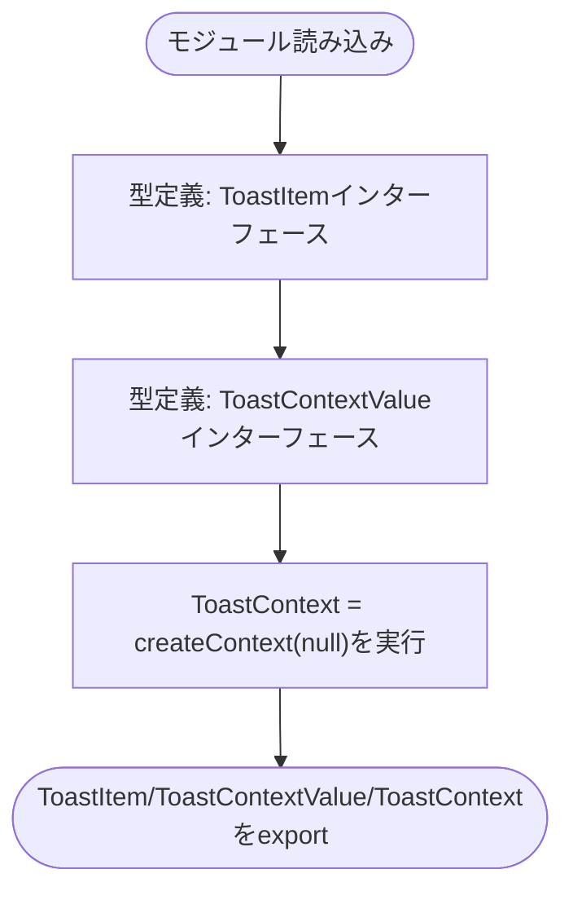
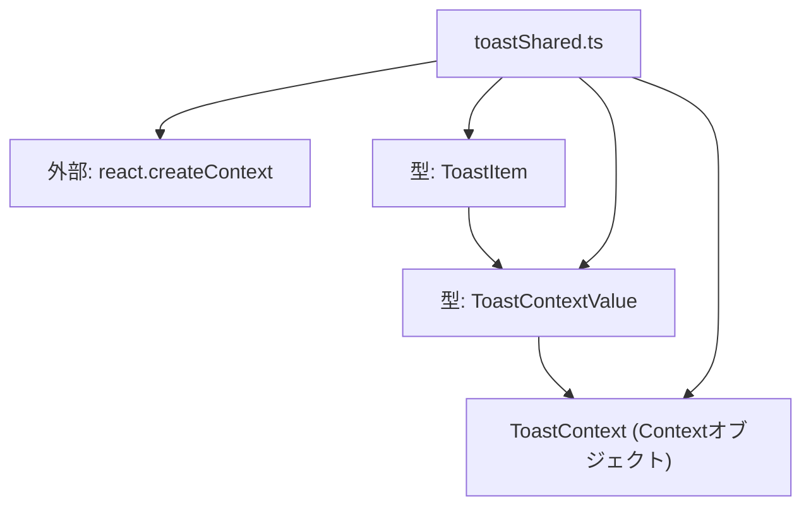

## 1. 解析メタ情報

| 項目 | 内容 |
| --- | --- |
| 対象ファイル | toastShared.ts |
| 言語 | React (TypeScript) |
| 解析対象 | 提供されたコードのみ |
| 推測・補完 | 一切なし |

## 関連ドキュメント

- [./useToast.md](./useToast.md) — 本ファイルの`ToastContext`を`useContext`で参照するフック。
- [./ToastContext.md](./ToastContext.md) — 本ファイルの`ToastContext`/`ToastItem`を用いてProviderを実装する側（react-refresh制約によりコンポーネント本体はこちらに分離されている）。
- [../../App.md](../../App.md) — `useToast`経由で本ファイルの型・Context定義を間接的に利用する側。

## 2. ファイルの概要

* トースト通知機能に関する型定義（`ToastItem`、`ToastContextValue`）と、React Contextオブジェクト（`ToastContext`）を集約して提供するモジュールである。
* 根拠: `export interface ToastItem {` (行番号: 7〜13 / 抜粋: "export interface ToastItem {"), `export interface ToastContextValue {` (行番号: 15〜17 / 抜粋: "export interface ToastContextValue {"), `export const ToastContext = createContext<ToastContextValue | null>(null);` (行番号: 19 / 抜粋: "export const ToastContext = createContext<ToastContextValue | null>(null);")
* ファイル冒頭のコメントによれば、Provider本体（`ToastContext.tsx`）とフック（`useToast.ts`）の双方から参照される型・Context objectをここに集約しており、これはreact-refreshの「1ファイルはコンポーネントのみexportする」という制約に対応するための分離であるとされている。
* 根拠: `// ToastContext.tsx(Provider本体)と useToast.ts(フック)の両方から参照する\n// 型・Context object をここに集約する。\n// (react-refresh の「1ファイルはコンポーネントのみexportする」制約により分離している)` (行番号: 3〜5 / 抜粋: "ToastContext.tsx(Provider本体)と useToast.ts(フック)の両方から参照する")

## 3. 外部依存関係

### インポート一覧

| 名称 | 種類 | 用途 | 根拠 |
| --- | --- | --- | --- |
| `createContext` | 関数 | `ToastContext`というReact Contextオブジェクトを生成するため | 根拠: `import { createContext } from 'react';` (行番号: 1 / 抜粋: "import { createContext } from 'react';") |

### ブラックボックスとなる外部要素

該当なし

## 4. 主要要素の定義（関数 / エンドポイント / コンポーネント）

### ToastItem

* **役割**: 1件のトースト通知が持つデータ構造（識別子、タイトル、本文、アイコン、作成日時）を定義するインターフェース。
* 根拠: `export interface ToastItem {\n    id: number;\n    title: string;\n    text?: string;\n    icon?: string;\n    createdAt: number;\n}` (行番号: 7〜13 / 抜粋: "export interface ToastItem {")

* **引数/リクエスト**: 該当なし（型定義のため関数ではない）
* 根拠: `export interface ToastItem {` (行番号: 7 / 抜粋: "export interface ToastItem {")

* **戻り値/レスポンス**: 該当なし（型定義のため関数ではない）
* 根拠: `export interface ToastItem {` (行番号: 7 / 抜粋: "export interface ToastItem {")

* **副作用**: なし
* 根拠: 型定義のみで実行文を含まない (行番号: 7〜13)

* **エラーハンドリング**: なし
* 根拠: 型定義のみで実行文を含まない (行番号: 7〜13)

### ToastContextValue

* **役割**: `ToastContext`が保持する値の型を定義するインターフェース。トーストを表示するための関数`showToast`のシグネチャを持つ。
* 根拠: `export interface ToastContextValue {\n    showToast: (toast: Omit<ToastItem, 'id' | 'createdAt'>) => void;\n}` (行番号: 15〜17 / 抜粋: "export interface ToastContextValue {")

* **引数/リクエスト**: 該当なし（型定義のため関数ではない）。ただし内包する`showToast`は`Omit<ToastItem, 'id' | 'createdAt'>`型の引数（`id`と`createdAt`を除いた`ToastItem`）を取るとして定義されている。
* 根拠: `showToast: (toast: Omit<ToastItem, 'id' | 'createdAt'>) => void;` (行番号: 16 / 抜粋: "showToast: (toast: Omit<ToastItem, 'id' | 'createdAt'>) => void;")

* **戻り値/レスポンス**: 該当なし（型定義のため関数ではない）。内包する`showToast`の戻り値型は`void`と定義されている。
* 根拠: `showToast: (toast: Omit<ToastItem, 'id' | 'createdAt'>) => void;` (行番号: 16 / 抜粋: "=> void;")

* **副作用**: なし
* 根拠: 型定義のみで実行文を含まない (行番号: 15〜17)

* **エラーハンドリング**: なし
* 根拠: 型定義のみで実行文を含まない (行番号: 15〜17)

### ToastContext

* **役割**: `ToastContextValue`型（または未初期化時は`null`）を保持するReact Contextオブジェクト。Providerと消費側フック（`useToast`）の間で値を橋渡しする。
* 根拠: `export const ToastContext = createContext<ToastContextValue | null>(null);` (行番号: 19 / 抜粋: "export const ToastContext = createContext<ToastContextValue | null>(null);")

* **引数/リクエスト**: 該当なし（`createContext`への初期値として`null`を渡している）
* 根拠: `createContext<ToastContextValue | null>(null)` (行番号: 19 / 抜粋: "createContext<ToastContextValue | null>(null);")

* **戻り値/レスポンス**: 該当なし（変数として`Context<ToastContextValue | null>`型のオブジェクトを保持）
* 根拠: `export const ToastContext = createContext<ToastContextValue | null>(null);` (行番号: 19 / 抜粋: "export const ToastContext = createContext<ToastContextValue | null>(null);")

* **副作用**: モジュール読み込み時に`createContext`が呼び出され、Contextオブジェクトが1つ生成される。
* 根拠: `createContext<ToastContextValue | null>(null)` (行番号: 19 / 抜粋: "createContext<ToastContextValue | null>(null);")

* **エラーハンドリング**: なし
* 根拠: try-catch等の記述なし (行番号: 19)

## 5. 処理フロー図

## 6. 依存関係図

## 7. 次のステップ（リバースエンジニアリングの提案）

| 優先度 | ファイル名(推測可) | 理由 | 根拠 |
| --- | --- | --- | --- |
| 高 | `family-quest/src/context/ToastContext.tsx` | `ToastContext.Provider`が`value`としてどのような`showToast`実装を渡しているか（実際のトースト表示・自動消去ロジック）を確認するため。 | 根拠: コメントで言及されるProvider本体が本ファイルには存在しないため (行番号: 3〜5 / 抜粋: "ToastContext.tsx(Provider本体)と useToast.ts(フック)の両方から参照する") |
| 高 | `family-quest/src/context/useToast.ts` | `ToastContext`を`useContext`で取得する側のフックの具体的な実装（Provider外で呼び出した場合の挙動等）を確認するため。 | 根拠: コメントで言及されるフックが本ファイルには存在しないため (行番号: 3〜5 / 抜粋: "ToastContext.tsx(Provider本体)と useToast.ts(フック)の両方から参照する") |

## 8. 保守上の注意点

* `ToastContext`の初期値は`null`であるため、Providerの外側で`useContext(ToastContext)`を呼び出した消費側は`null`を受け取ることになり、呼び出し側でのnullチェックが必要になる設計である。
* 根拠: `createContext<ToastContextValue | null>(null)` (行番号: 19 / 抜粋: "createContext<ToastContextValue | null>(null);")

* ファイル冒頭のコメントの通り、本ファイルは意図的に「コンポーネントを含まないファイル」として型・Context定義のみに限定されている。新たなコンポーネントをこのファイルに追加すると、react-refresh（Fast Refresh）が正しく機能しなくなる可能性がある。
* 根拠: `// (react-refresh の「1ファイルはコンポーネントのみexportする」制約により分離している)` (行番号: 5 / 抜粋: "react-refresh の「1ファイルはコンポーネントのみexportする」制約により分離している")

## 9. 不明事項一覧

| 項目 | 理由 | 必要なファイル |
| --- | --- | --- |
| `showToast`の実際の実装内容（トーストの表示方法、自動消去の有無・タイミング等） | 本ファイルは型とContextオブジェクトの定義のみであり、Providerの実装は別ファイルにあるため。 | `family-quest/src/context/ToastContext.tsx` |
| `useToast`フックの具体的な実装（`useContext`の呼び出し方、null時の挙動等） | 本ファイルにはフックの実装が存在しないため。 | `family-quest/src/context/useToast.ts` |

## 相互参照による補足情報

| 元の不明事項 | 判明した内容 | 参照元ドキュメント |
| --- | --- | --- |
| `showToast`の実際の実装内容（トーストの表示方法、自動消去の有無・タイミング等） | `family-quest/src/context/ToastContext.tsx`を直接確認した。`AUTO_DISMISS_MS`（9行目）は`4000`（4秒）。`showToast`（14〜20行目）は`Date.now() + Math.random()`をidとする新規`ToastItem`を`toasts`配列に追加し、`AUTO_DISMISS_MS`後に同idのトーストを`setTimeout`で自動除去する。表示はトーストスタック（29〜31行目付近、`AnimatePresence`+`motion.div`で`toasts`を描画）としてマウントされ、要素クリック時は`dismiss(t.id)`（23〜25行目）で即座に除去される。除去用の`setTimeout`のタイマーIDはクリアされず、手動`dismiss`後もタイマー自体は生存し続ける。 | 直接ソース確認: `family-quest/src/context/ToastContext.tsx:9, 14-25` |
| `useToast`フックの具体的な実装（`useContext`の呼び出し方、null時の挙動等） | `family-quest/src/context/useToast.ts:4-8`（全9行）を直接確認した。`export function useToast(): ToastContextValue`は`useContext(ToastContext)`を呼び出し、結果が`null`（本ファイルの`ToastContext`初期値、19行目）の場合は`throw new Error('useToast は ToastProvider の内側で使ってください');`という日本語メッセージの例外を送出する。`null`でなければそのまま`ctx`（`ToastContextValue`）を返す。 | 直接ソース確認: `family-quest/src/context/useToast.ts:4-8` |

## 10. 自己検証結果

* [x] 推測・外部ファイルの仕様を一切含んでいない
* [x] 全関数・全クラス・全コンポーネントを列挙した
* [x] 全てのインポート要素を列挙した
* [x] すべての仕様説明に「根拠（行番号・抜粋）」を明記した
* [x] 根拠漏れが0件である
* [x] Mermaid構文にエラーの原因となる記号（エスケープ漏れ）がない
* [x] 不明事項を漏れなく列挙した
