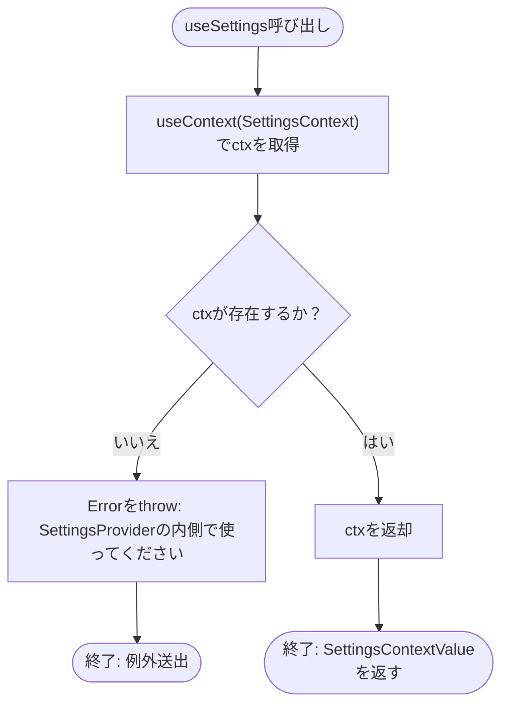
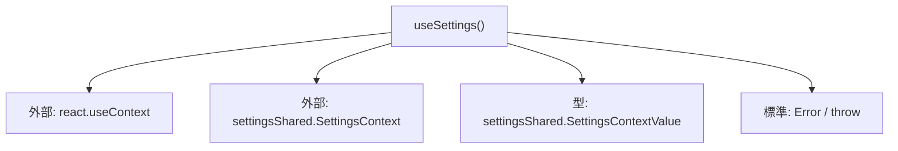

## 1. 解析メタ情報

| 項目 | 内容 |
| --- | --- |
| 対象ファイル | useSettings.ts |
| 言語 | React (TypeScript) |
| 解析対象 | 提供されたコードのみ |
| 推測・補完 | 一切なし |

## 関連ドキュメント

- [./settingsShared.md](./settingsShared.md) — `SettingsContext`と`SettingsContextValue`型の実装元。
- [./SettingsContext.md](./SettingsContext.md) — 本フックが値を取得する`SettingsContext.Provider`の実装元。
- [../../App.md](../../App.md) — 本フックを呼び出し、戻り値を利用する側。
- [../features/family/components/FamilyDashboard.md](../features/family/components/FamilyDashboard.md) — 本フックを呼び出し、戻り値を利用する側。

## 2. ファイルの概要

* `SettingsContext`から値を取得するカスタムフック`useSettings`を提供する。`SettingsProvider`の内側で呼び出されなかった場合（Contextの値が`null`の場合）は例外を投げる。
* 根拠: `export function useSettings(): SettingsContextValue {\n    const ctx = useContext(SettingsContext);\n    if (!ctx) throw new Error('useSettings は SettingsProvider の内側で使ってください');\n    return ctx;\n}` (行番号: 4〜8 / 抜粋: "export function useSettings(): SettingsContextValue {")

## 3. 外部依存関係

### インポート一覧

| 名称 | 種類 | 用途 | 根拠 |
| --- | --- | --- | --- |
| `useContext` | 関数 | `SettingsContext`が保持する値を取得するため | 根拠: `import { useContext } from 'react';` (行番号: 1 / 抜粋: "import { useContext } from 'react';") |
| `SettingsContext` | オブジェクト | `useContext`に渡すContextオブジェクト | 根拠: `import { SettingsContext, SettingsContextValue } from './settingsShared';` (行番号: 2 / 抜粋: "import { SettingsContext, SettingsContextValue } from './settingsShared';") |
| `SettingsContextValue` | 型 | `useSettings`の戻り値型として使用 | 根拠: `import { SettingsContext, SettingsContextValue } from './settingsShared';` (行番号: 2 / 抜粋: "import { SettingsContext, SettingsContextValue } from './settingsShared';") |

### ブラックボックスとなる外部要素

| 名称 | 理由 | 根拠 |
| --- | --- | --- |
| `SettingsContext`が実際に保持する値（Provider側の`setDensity`等の実装、永続化方法） | `SettingsContext`自体の定義（`createContext`呼び出し）は`settingsShared.ts`にあり、実際に`Provider`が`value`として渡す内容はさらに別ファイル（Provider本体）にあるため、本ファイルからは確認できない | 根拠: `import { SettingsContext, SettingsContextValue } from './settingsShared';` (行番号: 2 / 抜粋: "import { SettingsContext, SettingsContextValue } from './settingsShared';") |

## 4. 主要要素の定義（関数 / エンドポイント / コンポーネント）

### useSettings

* **役割**: `SettingsContext`から値を取得して返すカスタムフック。値が存在しない（`SettingsProvider`の外側で呼び出された）場合はエラーを投げることで、誤った使用方法を早期に検知する。
* 根拠: `export function useSettings(): SettingsContextValue {` (行番号: 4〜8 / 抜粋: "export function useSettings(): SettingsContextValue {")

* **引数/リクエスト**: なし
* 根拠: `export function useSettings(): SettingsContextValue {` (行番号: 4 / 抜粋: "export function useSettings(): SettingsContextValue {")

* **戻り値/レスポンス**: `SettingsContextValue`（`density`、`iconFirstUserIds`、`userThemeColors`、`setDensity`、`toggleIconFirstUser`、`setUserThemeColor`を持つオブジェクト）
* 根拠: `return ctx;` (行番号: 7 / 抜粋: "return ctx;")

* **副作用**: なし（`useContext`によるContext値の参照のみ）
* 根拠: `const ctx = useContext(SettingsContext);` (行番号: 5 / 抜粋: "const ctx = useContext(SettingsContext);")

* **エラーハンドリング**: `useContext(SettingsContext)`の戻り値が偽値（`null`）の場合、`'useSettings は SettingsProvider の内側で使ってください'`というメッセージを持つ`Error`を`throw`する。
* 根拠: `if (!ctx) throw new Error('useSettings は SettingsProvider の内側で使ってください');` (行番号: 6 / 抜粋: "if (!ctx) throw new Error('useSettings は SettingsProvider の内側で使ってください');")

## 5. 処理フロー図

## 6. 依存関係図

## 7. 次のステップ（リバースエンジニアリングの提案）

| 優先度 | ファイル名(推測可) | 理由 | 根拠 |
| --- | --- | --- | --- |
| 高 | `family-quest/src/context/SettingsContext.tsx` | `SettingsContext.Provider`が実際にどのような`setDensity`/`toggleIconFirstUser`/`setUserThemeColor`実装（永続化方法を含む）を`value`として渡しているか（本フックの戻り値の実体）を確認するため。 | 根拠: `import { SettingsContext, SettingsContextValue } from './settingsShared';` (行番号: 2 / 抜粋: "import { SettingsContext, SettingsContextValue } from './settingsShared';") |
| 中 | `family-quest/src/App.tsx` および `family-quest/src/features/family/components/FamilyDashboard.tsx` | 本フックが呼び出され、戻り値（`density`、`iconFirstUserIds`等）がどのようにUIへ反映されているかを確認するため。 | 根拠: フック単体では呼び出し元・利用方法が不明 (行番号: 4〜8) |

## 8. 保守上の注意点

* `SettingsProvider`の外側で本フックを呼び出すと`Error`が`throw`されるため、呼び出し側コンポーネントは必ず`SettingsProvider`配下に配置されている必要がある。エラーをキャッチしない場合、Reactのエラーバウンダリが存在しない限りレンダリングが中断する可能性がある。
* 根拠: `if (!ctx) throw new Error('useSettings は SettingsProvider の内側で使ってください');` (行番号: 6 / 抜粋: "if (!ctx) throw new Error('useSettings は SettingsProvider の内側で使ってください');")

## 9. 不明事項一覧

| 項目 | 理由 | 必要なファイル |
| --- | --- | --- |
| `SettingsContext`に実際に設定される値（`setDensity`等の実装、永続化方法） | 本ファイルは`useContext`による値の取得のみを行っており、値を`Provider`する側の実装は含まれないため。 | `family-quest/src/context/SettingsContext.tsx` |
| 本フックの呼び出し元・呼び出しタイミング、戻り値の具体的な利用方法 | 本ファイルはフックの定義のみであり、実際にどのコンポーネントで使用されるかはコードから確認できないため。 | `useSettings`をインポート・使用しているコンポーネントファイル |

## 相互参照による補足情報

| 元の不明事項 | 判明した内容 | 参照元ドキュメント |
| --- | --- | --- |
| `SettingsContext`に実際に設定される値（`setDensity`等の実装、永続化方法） | `family-quest/src/context/SettingsContext.tsx`を直接確認した。`SettingsProvider`（28〜59行目）は初回マウント時に`loadSettings()`（12〜26行目）で`window.localStorage.getItem(SETTINGS_STORAGE_KEY)`（キーは`settingsShared.ts:56`の`'familyQuest.settings.v1'`）から状態を復元し、`settings`が変化するたび（`useEffect`31〜37行目）に`window.localStorage.setItem`で即時永続化する。`setDensity`/`toggleIconFirstUser`/`setUserThemeColor`（41〜51行目）はいずれも`setSettings`によるイミュータブルな状態更新のみを行う。 | 直接ソース確認: `family-quest/src/context/SettingsContext.tsx:12-59` |
| 本フックの呼び出し元・呼び出しタイミング、戻り値の具体的な利用方法 | `family-quest/src`配下を`useSettings()`で検索し、呼び出し箇所3件を直接確認した。(1) `App.tsx`142行目`const { density, iconFirstUserIds } = useSettings();` — `density`は363行目`densityWrapperClass = density === 'compact' ? 'p-2 space-y-2' : 'p-4 space-y-4'`としてレイアウトの余白クラス切り替えに、`iconFirstUserIds`は450行目`iconFirst={iconFirstUserIds.includes(currentUser.user_id)}`として利用される。(2) `FamilyDashboard.tsx`52行目`const { iconFirstUserIds, userThemeColors } = useSettings();` — 101行目`iconFirst={iconFirstUserIds.includes(user.user_id)}`、103行目`themeColorKey={userThemeColors[user.user_id]}`として各`FamilyPanel`へ渡される。(3) `SettingsModal.tsx`18行目`const { density, setDensity, iconFirstUserIds, toggleIconFirstUser, userThemeColors, setUserThemeColor } = useSettings();` — 設定変更UIの操作元（更新関数群）として6項目すべてを取得・利用する。 | 直接ソース確認: `family-quest/src/App.tsx:142, 363, 450`, `family-quest/src/features/family/components/FamilyDashboard.tsx:52, 101, 103`, `family-quest/src/components/ui/SettingsModal.tsx:18` |

## 10. 自己検証結果

* [x] 推測・外部ファイルの仕様を一切含んでいない
* [x] 全関数・全クラス・全コンポーネントを列挙した
* [x] 全てのインポート要素を列挙した
* [x] すべての仕様説明に「根拠（行番号・抜粋）」を明記した
* [x] 根拠漏れが0件である
* [x] Mermaid構文にエラーの原因となる記号（エスケープ漏れ）がない
* [x] 不明事項を漏れなく列挙した
