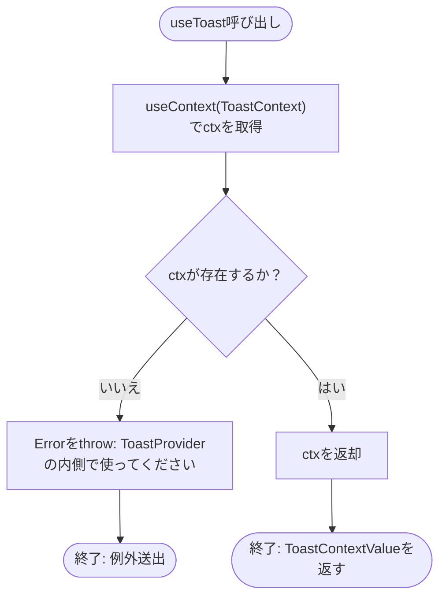
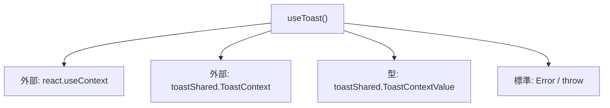

## 1. 解析メタ情報

| 項目 | 内容 |
| --- | --- |
| 対象ファイル | useToast.ts |
| 言語 | React (TypeScript) |
| 解析対象 | 提供されたコードのみ |
| 推測・補完 | 一切なし |

## 関連ドキュメント

- [./toastShared.md](./toastShared.md) — `ToastContext`と`ToastContextValue`型の実装元。
- [./ToastContext.md](./ToastContext.md) — 本フックが値を取得する`ToastContext.Provider`の実装元。
- [../../App.md](../../App.md) — 本フックを呼び出し、戻り値の`showToast`を利用する側。

## 2. ファイルの概要

* `ToastContext`から値を取得するカスタムフック`useToast`を提供する。`ToastProvider`の内側で呼び出されなかった場合（Contextの値が`null`の場合）は例外を投げる。
* 根拠: `export function useToast(): ToastContextValue {\n    const ctx = useContext(ToastContext);\n    if (!ctx) throw new Error('useToast は ToastProvider の内側で使ってください');\n    return ctx;\n}` (行番号: 4〜8 / 抜粋: "export function useToast(): ToastContextValue {")

## 3. 外部依存関係

### インポート一覧

| 名称 | 種類 | 用途 | 根拠 |
| --- | --- | --- | --- |
| `useContext` | 関数 | `ToastContext`が保持する値を取得するため | 根拠: `import { useContext } from 'react';` (行番号: 1 / 抜粋: "import { useContext } from 'react';") |
| `ToastContext` | オブジェクト | `useContext`に渡すContextオブジェクト | 根拠: `import { ToastContext, ToastContextValue } from './toastShared';` (行番号: 2 / 抜粋: "import { ToastContext, ToastContextValue } from './toastShared';") |
| `ToastContextValue` | 型 | `useToast`の戻り値型として使用 | 根拠: `import { ToastContext, ToastContextValue } from './toastShared';` (行番号: 2 / 抜粋: "import { ToastContext, ToastContextValue } from './toastShared';") |

### ブラックボックスとなる外部要素

| 名称 | 理由 | 根拠 |
| --- | --- | --- |
| `ToastContext`が実際に保持する値（Provider側の`showToast`実装） | `ToastContext`自体の定義（`createContext`呼び出し）は`toastShared.ts`にあり、実際に`Provider`が`value`として渡す内容はさらに別ファイル（Provider本体）にあるため、本ファイルからは確認できない | 根拠: `import { ToastContext, ToastContextValue } from './toastShared';` (行番号: 2 / 抜粋: "import { ToastContext, ToastContextValue } from './toastShared';") |

## 4. 主要要素の定義（関数 / エンドポイント / コンポーネント）

### useToast

* **役割**: `ToastContext`から値を取得して返すカスタムフック。値が存在しない（`ToastProvider`の外側で呼び出された）場合はエラーを投げることで、誤った使用方法を早期に検知する。
* 根拠: `export function useToast(): ToastContextValue {` (行番号: 4〜8 / 抜粋: "export function useToast(): ToastContextValue {")

* **引数/リクエスト**: なし
* 根拠: `export function useToast(): ToastContextValue {` (行番号: 4 / 抜粋: "export function useToast(): ToastContextValue {")

* **戻り値/レスポンス**: `ToastContextValue`（`{ showToast: (toast) => void }`を持つオブジェクト）
* 根拠: `return ctx;` (行番号: 7 / 抜粋: "return ctx;")

* **副作用**: なし（`useContext`によるContext値の参照のみ）
* 根拠: `const ctx = useContext(ToastContext);` (行番号: 5 / 抜粋: "const ctx = useContext(ToastContext);")

* **エラーハンドリング**: `useContext(ToastContext)`の戻り値が偽値（`null`）の場合、`'useToast は ToastProvider の内側で使ってください'`というメッセージを持つ`Error`を`throw`する。
* 根拠: `if (!ctx) throw new Error('useToast は ToastProvider の内側で使ってください');` (行番号: 6 / 抜粋: "if (!ctx) throw new Error('useToast は ToastProvider の内側で使ってください');")

## 5. 処理フロー図

## 6. 依存関係図

## 7. 次のステップ（リバースエンジニアリングの提案）

| 優先度 | ファイル名(推測可) | 理由 | 根拠 |
| --- | --- | --- | --- |
| 高 | `family-quest/src/context/ToastContext.tsx` | `ToastContext.Provider`が実際にどのような`showToast`実装を`value`として渡しているか（本フックの戻り値の実体）を確認するため。 | 根拠: `import { ToastContext, ToastContextValue } from './toastShared';` (行番号: 2 / 抜粋: "import { ToastContext, ToastContextValue } from './toastShared';") |
| 中 | `family-quest/src/App.tsx` | 本フックが呼び出され、`showToast`がどのようなタイミング・引数で実行されているかを確認するため。 | 根拠: フック単体では呼び出し元・呼び出しタイミングが不明 (行番号: 4〜8) |

## 8. 保守上の注意点

* `ToastProvider`の外側で本フックを呼び出すと`Error`が`throw`されるため、呼び出し側コンポーネントは必ず`ToastProvider`配下に配置されている必要がある。エラーをキャッチしない場合、Reactのエラーバウンダリが存在しない限りレンダリングが中断する可能性がある。
* 根拠: `if (!ctx) throw new Error('useToast は ToastProvider の内側で使ってください');` (行番号: 6 / 抜粋: "if (!ctx) throw new Error('useToast は ToastProvider の内側で使ってください');")

## 9. 不明事項一覧

| 項目 | 理由 | 必要なファイル |
| --- | --- | --- |
| `ToastContext`に実際に設定される値（`showToast`の実装） | 本ファイルは`useContext`による値の取得のみを行っており、値を`Provider`する側の実装は含まれないため。 | `family-quest/src/context/ToastContext.tsx` |
| 本フックの呼び出し元・呼び出しタイミング | 本ファイルはフックの定義のみであり、実際にどのコンポーネントで使用されるかはコードから確認できないため。 | `useToast`をインポート・使用しているコンポーネントファイル |

## 相互参照による補足情報

| 元の不明事項 | 判明した内容 | 参照元ドキュメント |
| --- | --- | --- |
| `ToastContext`に実際に設定される値（`showToast`の実装） | `family-quest/src/context/ToastContext.tsx`を直接確認した。`ToastProvider`(11〜58行目)は`useState<ToastItem[]>([])`(12行目)でトースト配列`toasts`を保持し、`showToast`(14〜21行目)は引数`toast: Omit<ToastItem, 'id' \| 'createdAt'>`を受け取って`id: Date.now() + Math.random(), createdAt: Date.now()`を付与した`ToastItem`を`toasts`配列に追加、さらに`setTimeout`で`AUTO_DISMISS_MS`(9行目、`4000`ミリ秒)後に同じ`id`の項目を配列から除去する自動消去処理を仕込む。`dismiss`(23〜25行目)は指定`id`のトーストを即座に除去する関数。`value = useMemo(() => ({ showToast }), [showToast])`(27行目)がメモ化され、`ToastContext.Provider value={value}`(30行目)として実際に`Context`へ渡される値は`{ showToast }`のみであり、`dismiss`自体は`Context`値には含まれず`Provider`内部（トーストのクリック時ハンドラ、44行目）でのみ使用される。 | 直接ソース確認: `family-quest/src/context/ToastContext.tsx:9-30` |
| 本フックの呼び出し元・呼び出しタイミング | `family-quest/src/App.tsx`を直接確認した。10行目で`import { useToast } from './context/useToast';`、143行目で`const { showToast } = useToast();`として呼び出している。以降、`showToast`は複数箇所で呼び出されている: 168行目`handleLevelUp`内でレベルアップ時に`{ title: 'LEVEL UP!', text: ... , icon: '⚡' }`、200行目でクエスト完了申請が承認待ちになった際に`{ title: "申請完了", ... , icon: '📨' }`、205行目でメダル獲得時に`{ title: "ちいさなメダル獲得！", ... , icon: "🏅" }`、271行目で報酬購入完了時に`{ title: "購入完了", text: "アイテムを「もちもの」に入れました！", icon: '🛍️' }`、327行目で一括承認が全件成功した際に`{ title: "一括承認", text: ... , icon: '✅' }`、511行目でアバター変更完了時に`{ title: "変更完了", text: "アバターを変更しました！", icon: '🖼️' }`をそれぞれ呼び出している。 | 直接ソース確認: `family-quest/src/App.tsx:10, 143, 168, 200, 205, 271, 327, 511` |

## 10. 自己検証結果

* [x] 推測・外部ファイルの仕様を一切含んでいない
* [x] 全関数・全クラス・全コンポーネントを列挙した
* [x] 全てのインポート要素を列挙した
* [x] すべての仕様説明に「根拠（行番号・抜粋）」を明記した
* [x] 根拠漏れが0件である
* [x] Mermaid構文にエラーの原因となる記号（エスケープ漏れ）がない
* [x] 不明事項を漏れなく列挙した
