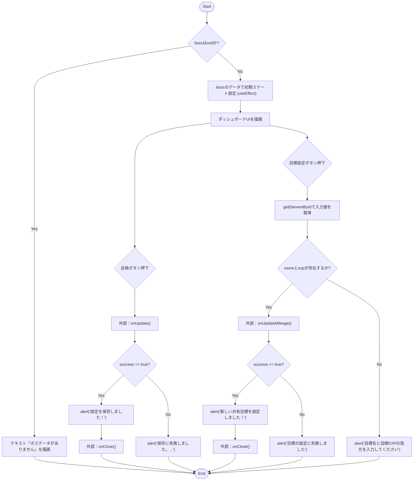
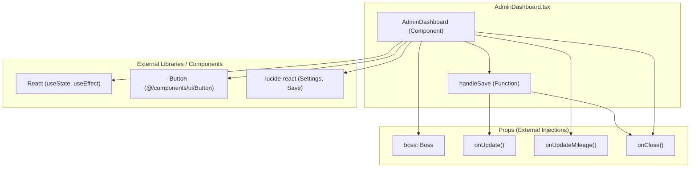

## 1. 解析メタ情報

| 項目 | 内容 |
| --- | --- |
| 対象ファイル | AdminDashboard.tsx |
| 言語 | React (TypeScript) |
| 解析対象 | 提供されたコードのみ |
| 推測・補完 | 一切なし |

## 2. ファイルの概要

* 管理者向けのボスステータス（最大HP、現在HP、撃破フラグ）調整、および共有目標（ファミリーマイレージ）の設定を行うためのUIコンポーネントを提供する。
* 根拠: [AdminDashboard] (行番号: 13〜133 / 抜粋: "const AdminDashboard: React.FC<AdminDashboard...")

## 3. 外部依存関係

### インポート一覧

| 名称 | 種類 | 用途 | 根拠 |
| --- | --- | --- | --- |
| React, { useState, useEffect } | ライブラリ | コンポーネント定義と状態管理、副作用フックの利用 | 根拠: [import文] (行番号: 1 / 抜粋: "import React, { useState, useE") |
| Settings, Save | ライブラリ | UI上のアイコン表示 | 根拠: [import文] (行番号: 2 / 抜粋: "import { Settings, Save, } fro") |
| Boss | 型定義 | コンポーネントのプロパティ(`boss`)の型指定 | 根拠: [import文] (行番号: 3 / 抜粋: "import { Boss } from '@/types';") |
| Button | コンポーネント | 各種ボタンUIの描画 | 根拠: [import文] (行番号: 4 / 抜粋: "import { Button } from '@/comp") |

### ブラックボックスとなる外部要素

| 名称 | 理由 | 根拠 |
| --- | --- | --- |
| Boss | オブジェクトの構造について、`maxHp`, `currentHp`, `isDefeated`を含むこと以外は不明 | 根拠: [AdminDashboardProps] (行番号: 7 / 抜粋: "boss: Boss |
| Button | 詳細な実装、`variant`プロパティの具体的なスタイルや挙動の詳細は不明 | 根拠: [import文] (行番号: 4 / 抜粋: "import { Button } from '@/comp") |
| onUpdate | 親から渡される非同期関数のため、具体的な更新ロジックや保存先は不明 | 根拠: [AdminDashboardProps] (行番号: 8 / 抜粋: "onUpdate: (data: { maxHp?: num") |
| onUpdateMileage | 親から渡される非同期関数のため、具体的な更新ロジックや保存先は不明 | 根拠: [AdminDashboardProps] (行番号: 9 / 抜粋: "onUpdateMileage: (targetName: ") |

## 4. 主要要素の定義（関数 / エンドポイント / コンポーネント）

### `AdminDashboard`

* **役割**: ボスのステータス調整、プリセット操作（一撃で倒す/全回復）、共有目標の設定を行う管理者用UIを描画し、操作に応じた更新処理を外部関数へ委譲する。
* 根拠: [AdminDashboard] (行番号: 13〜133 / 抜粋: "const AdminDashboard: React.FC")

* **引数/リクエスト**: `AdminDashboardProps` (`boss: Boss | null`, `onUpdate: Function`, `onUpdateMileage: Function`, `onClose: Function`)
* 根拠: [AdminDashboard] (行番号: 13 / 抜粋: "({ boss, onUpdate, onUpdateMil")

* **戻り値/レスポンス**: JSX.Element (`boss`がnullの場合はテキストのみ、存在する場合はダッシュボードのUI要素)
* 根拠: [AdminDashboard] (行番号: 44, 46 / 抜粋: "return 
 { if (boss) {")

* 目標設定ボタンクリック時、DOMから直接値を取得し`onUpdateMileage`を呼び出し、結果に応じて`alert`および`onClose`を呼び出す。
* 根拠: [Button onClick] (行番号: 98〜117 / 抜粋: "onClick={async () => { const n")

* **エラーハンドリング**:
* 目標設定時に入力値が不足している場合、`alert`で警告を表示する。
* 根拠: [Button onClick] (行番号: 114〜116 / 抜粋: "} else { alert("目標名と目標EXPの両方を入力")

* `onUpdateMileage`の処理に失敗した場合、`alert`でエラーメッセージを表示する。
* 根拠: [Button onClick] (行番号: 111〜113 / 抜粋: "} else { alert("目標の設定に失敗しました");")

### `handleSave` (AdminDashboard内部の関数)

* **役割**: コンポーネントの内部ステート(`maxHp`, `currentHp`, `isDefeated`)を用いて`onUpdate`関数を実行し、保存処理を試みる。
* 根拠: [handleSave] (行番号: 27〜42 / 抜粋: "const handleSave = async () =>")

* **引数/リクエスト**: なし
* 根拠: [handleSave] (行番号: 27 / 抜粋: "const handleSave = async () =>")

* **戻り値/レスポンス**: `Promise<void>`
* 根拠: [handleSave] (行番号: 27 / 抜粋: "const handleSave = async () =>")

* **副作用**:
* `onUpdate`を呼び出す。
* 返り値に基づき、成功時は`alert`を表示し`onClose`を呼び出す。失敗時は`alert`でエラーメッセージを表示する。
* 根拠: [handleSave] (行番号: 29〜41 / 抜粋: "const result = await onUpdate(")

* **エラーハンドリング**:
* `onUpdate`の返り値オブジェクトが持つ`success`プロパティがfalsyな場合、エラーアラートを表示する。
* 根拠: [handleSave] (行番号: 39〜41 / 抜粋: "} else { alert("保存に失敗しました。\n・バック")

## 5. 処理フロー図

## 6. 依存関係図

## 7. 次のステップ（リバースエンジニアリングの提案）

| 優先度 | ファイル名(推測可) | 理由 | 根拠 |
| --- | --- | --- | --- |
| 高 | `useGameData` が定義されているファイル または 親コンポーネント | `onUpdate` の返り値についてコード内コメントで言及されており、実際のAPIやDB処理の詳細を把握するため。 | 根拠: [コメント] (行番号: 35 / 抜粋: "useGameData側で { success: true/") |
| 中 | `@/types` | `Boss` 型の完全な構造を把握するため。 | 根拠: [import文] (行番号: 3 / 抜粋: "import { Boss } from '@/types';") |

## 8. 保守上の注意点

* 共有目標（マイレージ）操作エリアにおいて、Reactの状態管理（State）を使用せず、`document.getElementById` を用いて直接DOMから値を取得する処理が存在する。
* 状態値 `maxHp` と `currentHp` はそれぞれ独立して更新されるため、UI操作によって `currentHp` が `maxHp` を超過する可能性を排除するバリデーションがない。
* `onUpdate` および `onUpdateMileage` の返り値の型が `Promise<any>` と定義されており、`result.success` などの型安全性が保証されていない。

## 9. 不明事項一覧

| 項目 | 理由 | 必要なファイル |
| --- | --- | --- |
| `onUpdate` の実装詳細 | Propsとして外部から注入されており、このファイルでは返り値の `success` プロパティの有無のみで処理を分岐しているため。 | 親コンポーネント または カスタムフックが定義されたファイル |
| `onUpdateMileage` の実装詳細 | Propsとして外部から注入されているため。 | 親コンポーネント または カスタムフックが定義されたファイル |
| `Boss` 型の全容 | `maxHp`, `currentHp`, `isDefeated` プロパティの存在は推測できるが、それ以外のプロパティは不明。 | `@/types`（型定義ファイル） |

## 10. 自己検証結果

* [x] 完了: 推測・外部ファイルの仕様を一切含んでいない
* [x] 完了: 全関数・全クラス・全コンポーネントを列挙した
* [x] 完了: 全てのインポート要素を列挙した
* [x] 完了: すべての仕様説明に「根拠（行番号・抜粋）」を明記した
* [x] 完了: 根拠漏れが0件である
* [x] 完了: Mermaid構文にエラーの原因となる記号（エスケープ漏れ）がない
* [x] 完了: 不明事項を漏れなく列挙した