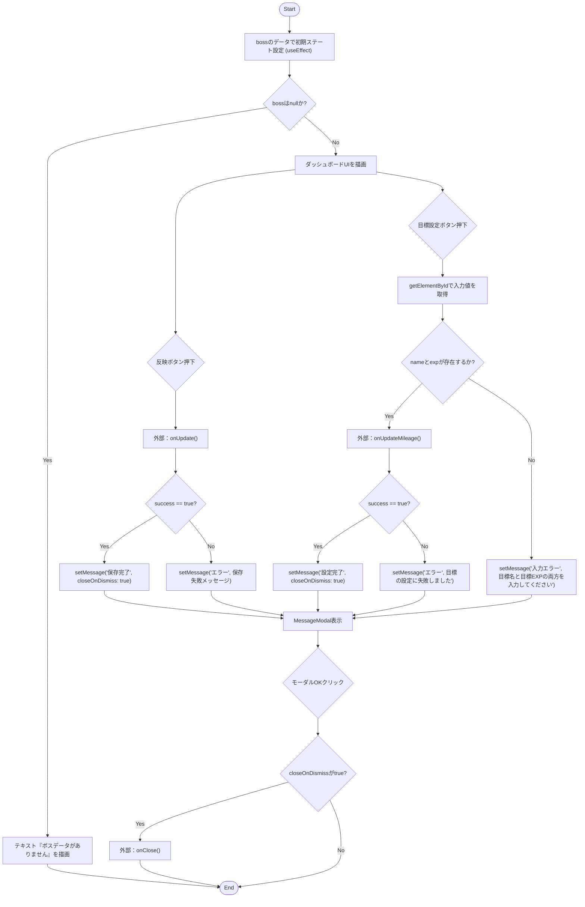
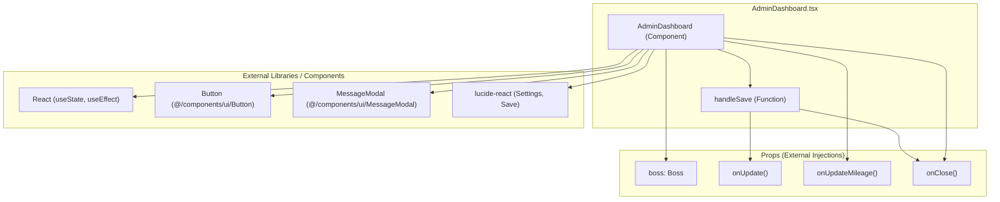

## 1. 解析メタ情報

| 項目 | 内容 |
| --- | --- |
| 対象ファイル | AdminDashboard.tsx |
| 言語 | React (TypeScript) |
| 解析対象 | 提供されたコードのみ |
| 推測・補完 | 一切なし |

## 2. ファイルの概要

* 管理者向けのボスステータス（最大HP、現在HP、撃破フラグ）調整、および共有目標（ファミリーマイレージ）の設定を行うためのUIコンポーネントを提供する。
* 処理結果（成功・失敗）はブラウザ標準の `alert()` ではなく、アプリ共通の `MessageModal` コンポーネントで表示する。
* 根拠: [AdminDashboard] (行番号: 21〜182 / 抜粋: "const AdminDashboard: React.FC<AdminDashboard...")

## 3. 外部依存関係

### インポート一覧

| 名称 | 種類 | 用途 | 根拠 |
| --- | --- | --- | --- |
| React, { useState, useEffect } | ライブラリ | コンポーネント定義と状態管理、副作用フックの利用 | 根拠: [import文] (行番号: 1 / 抜粋: "import React, { useState, useE") |
| Settings, Save | ライブラリ | UI上のアイコン表示 | 根拠: [import文] (行番号: 2 / 抜粋: "import { Settings, Save, } fro") |
| Boss | 型定義 | コンポーネントのプロパティ(`boss`)の型指定 | 根拠: [import文] (行番号: 3 / 抜粋: "import { Boss } from '@/types';") |
| Button | コンポーネント | 各種ボタンUIの描画 | 根拠: [import文] (行番号: 4 / 抜粋: "import { Button } from '@/comp") |
| MessageModal | コンポーネント | 保存・エラー結果メッセージのモーダル表示 | 根拠: [import文] (行番号: 5 / 抜粋: "import MessageModal from '@/co") |

### ブラックボックスとなる外部要素

| 名称 | 理由 | 根拠 |
| --- | --- | --- |
| Boss | オブジェクトの構造について、`maxHp`, `currentHp`, `isDefeated`を含むこと以外は不明 | 根拠: [AdminDashboardProps] (行番号: 15 / 抜粋: "boss: Boss | null;") |
| Button | 詳細な実装、`variant`プロパティの具体的なスタイルや挙動の詳細は不明 | 根拠: [import文] (行番号: 4 / 抜粋: "import { Button } from '@/comp") |
| MessageModal | 詳細な実装（Propsの全容やスタイル）が本ファイルに含まれていないため不明 | 根拠: [import文] (行番号: 5 / 抜粋: "import MessageModal from '@/co") |
| onUpdate | 親から渡される非同期関数のため、具体的な更新ロジックや保存先は不明。コメントによれば `useGameData.ts` の `adminUpdateBoss` に対応する。 | 根拠: [AdminDashboardProps] (行番号: 16 / 抜粋: "onUpdate: (data: { maxHp?: num") |
| onUpdateMileage | 親から渡される非同期関数のため、具体的な更新ロジックや保存先は不明。コメントによれば `useGameData.ts` の `adminUpdateFamilyMileage` に対応する。 | 根拠: [AdminDashboardProps] (行番号: 17 / 抜粋: "onUpdateMileage: (targetName: ") |

## 4. 主要要素の定義（関数 / エンドポイント / コンポーネント）

### `AdminActionResult`

* **役割**: `onUpdate` / `onUpdateMileage` の戻り値の形を定義するインターフェース。コメントによれば `useGameData.ts` の `adminUpdateBoss`/`adminUpdateFamilyMileage` の戻り値の形（`{success:true}` または `{success:false, detail?:string}`）に対応する。
* 根拠: [AdminActionResult] (行番号: 9〜12 / 抜粋: "interface AdminActionResult {")

### `AdminDashboard`

* **役割**: ボスのステータス調整、プリセット操作（一撃で倒す/全回復）、共有目標の設定を行う管理者用UIを描画し、操作に応じた更新処理を外部関数へ委譲する。処理結果は`MessageModal`で表示する。
* 根拠: [AdminDashboard] (行番号: 21〜182 / 抜粋: "const AdminDashboard: React.FC")

* **引数/リクエスト**: `AdminDashboardProps` (`boss: Boss | null`, `onUpdate: (data) => Promise<AdminActionResult>`, `onUpdateMileage: (targetName, targetExp) => Promise<AdminActionResult>`, `onClose: () => void`)
* 根拠: [AdminDashboard] (行番号: 21 / 抜粋: "({ boss, onUpdate, onUpdateMil")

* **戻り値/レスポンス**: JSX.Element (`boss`がnullの場合はテキストのみ、存在する場合はダッシュボードのUI要素)
* 根拠: [AdminDashboard] (行番号: 57 / 抜粋: "if (!boss) return 
 { if (boss) {")

* 目標設定ボタンクリック時、DOMから直接値を取得し`onUpdateMileage`を呼び出し、結果に応じて`setMessage`でモーダル用メッセージを設定する（成功時は`closeOnDismiss: true`を付与し、モーダルを閉じた際に`onClose`を呼ぶ）。
* 根拠: [Button onClick] (行番号: 146〜161 / 抜粋: "onClick={async () => { // ★非")

* **エラーハンドリング**:
* 目標設定時に入力値（`name`または`exp`）が不足している場合、`setMessage`で入力エラーメッセージを設定する。
* 根拠: [Button onClick] (行番号: 158〜160 / 抜粋: "} else { setMessage({ title: ")

* `onUpdateMileage`の処理に失敗した場合、`setMessage`でエラーメッセージを設定する。
* 根拠: [Button onClick] (行番号: 155〜157 / 抜粋: "} else { setMessage({ title: ")

### `handleSave` (AdminDashboard内部の関数)

* **役割**: コンポーネントの内部ステート(`maxHp`, `currentHp`, `isDefeated`)を用いて`onUpdate`関数を実行し、保存処理を試みる。
* 根拠: [handleSave] (行番号: 41〜55 / 抜粋: "const handleSave = async () =>")

* **引数/リクエスト**: なし
* 根拠: [handleSave] (行番号: 41 / 抜粋: "const handleSave = async () =>")

* **戻り値/レスポンス**: `Promise<void>`
* 根拠: [handleSave] (行番号: 41 / 抜粋: "const handleSave = async () =>")

* **副作用**:
* `onUpdate`を呼び出す。
* 返り値に基づき、成功時は`setMessage`で完了メッセージ（`closeOnDismiss: true`）を設定し、失敗時はエラーメッセージを設定する。
* 根拠: [handleSave] (行番号: 43〜54 / 抜粋: "const result = await onUpdate(")

* **エラーハンドリング**:
* `onUpdate`の返り値オブジェクトが持つ`success`プロパティがfalsyな場合、`setMessage`でエラーメッセージを設定する。
* 根拠: [handleSave] (行番号: 52〜53 / 抜粋: "} else { setMessage({ title: ")

## 5. 処理フロー図

```mermaid
flowchart TD
    Start([Start]) --> InitState["bossのデータで初期ステート設定 (useEffect)"]
    InitState --> CheckBoss{bossはnullか?}
    CheckBoss -- Yes --> ReturnText["テキスト『ボスデータがありません』を描画"] --> End([End])
    CheckBoss -- No --> DrawUI["ダッシュボードUIを描画"]

    DrawUI --> ActionSave{反映ボタン押下}
    ActionSave --> CallOnUpdate["外部：onUpdate()"]
    CallOnUpdate --> CheckResult1{success == true?}
    CheckResult1 -- Yes --> SetMsgSuccess1["setMessage('保存完了', closeOnDismiss: true)"]
    CheckResult1 -- No --> SetMsgFail1["setMessage('エラー', 保存失敗メッセージ)"]

    DrawUI --> ActionMileage{目標設定ボタン押下}
    ActionMileage --> GetDOMValues["getElementByIdで入力値を取得"]
    GetDOMValues --> CheckValues{nameとexpが存在するか?}
    CheckValues -- No --> SetMsgEmpty["setMessage('入力エラー', 目標名と目標EXPの両方を入力してください')"]
    CheckValues -- Yes --> CallOnUpdateMileage["外部：onUpdateMileage()"]
    CallOnUpdateMileage --> CheckResult2{success == true?}
    CheckResult2 -- Yes --> SetMsgSuccess2["setMessage('設定完了', closeOnDismiss: true)"]
    CheckResult2 -- No --> SetMsgFail2["setMessage('エラー', 目標の設定に失敗しました')"]

    SetMsgSuccess1 --> ShowModal["MessageModal表示"]
    SetMsgFail1 --> ShowModal
    SetMsgSuccess2 --> ShowModal
    SetMsgFail2 --> ShowModal
    SetMsgEmpty --> ShowModal

    ShowModal --> ModalClose{"モーダルOKクリック"}
    ModalClose --> CheckCloseOnDismiss{"closeOnDismissがtrue?"}
    CheckCloseOnDismiss -- Yes --> CallOnClose["外部：onClose()"] --> End
    CheckCloseOnDismiss -- No --> End

```

## 6. 依存関係図

```mermaid
graph TD
    subgraph "AdminDashboard.tsx"
        AdminDashboard["AdminDashboard (Component)"]
        handleSave["handleSave (Function)"]
    end

    subgraph "Props (External Injections)"
        boss["boss: Boss"]
        onUpdate["onUpdate()"]
        onUpdateMileage["onUpdateMileage()"]
        onClose["onClose()"]
    end

    subgraph "External Libraries / Components"
        React["React (useState, useEffect)"]
        Button["Button (@/components/ui/Button)"]
        MessageModal["MessageModal (@/components/ui/MessageModal)"]
        Icons["lucide-react (Settings, Save)"]
    end

    AdminDashboard --> React
    AdminDashboard --> Button
    AdminDashboard --> MessageModal
    AdminDashboard --> Icons
    AdminDashboard --> boss
    AdminDashboard --> handleSave
    
    handleSave --> onUpdate
    handleSave --> onClose
    
    AdminDashboard --> onUpdateMileage
    AdminDashboard --> onClose

```

## 7. 次のステップ（リバースエンジニアリングの提案）

| 優先度 | ファイル名(推測可) | 理由 | 根拠 |
| --- | --- | --- | --- |
| 高 | `useGameData` が定義されているファイル または 親コンポーネント | `onUpdate`/`onUpdateMileage` の返り値についてコード内コメントで言及されており、実際のAPIやDB処理の詳細を把握するため。 | 根拠: [コメント] (行番号: 7〜8, 49 / 抜粋: "// onUpdate/onUpdateMileage は useGameData.ts の") |
| 中 | `@/types` | `Boss` 型の完全な構造を把握するため。 | 根拠: [import文] (行番号: 3 / 抜粋: "import { Boss } from '@/types';") |
| 中 | `@/components/ui/MessageModal` | `MessageModal` の実際のProps（`title`, `message`, `onClose`以外の有無）やスタイリング仕様を確認するため。 | 根拠: [import文] (行番号: 5 / 抜粋: "import MessageModal from '@/co") |

## 8. 保守上の注意点

* 共有目標（マイレージ）操作エリアにおいて、Reactの状態管理（State）を使用せず、`document.getElementById` を用いて直接DOMから値を取得する処理が存在する。
* 状態値 `maxHp` と `currentHp` はそれぞれ独立して更新されるため、UI操作によって `currentHp` が `maxHp` を超過する可能性を排除するバリデーションがない。
* `onUpdate` および `onUpdateMileage` の返り値の型は `Promise<AdminActionResult>`（`{ success: boolean; detail?: string }`）として型付けされているが、`detail`プロパティはコード内で参照されておらず未使用である。
* 素の `alert()` を廃止し `MessageModal` に統一した経緯がコメントに記載されている。`alert()` は呼び出しをブロックする同期処理だったため「OKを押す→画面が閉じる」の順序が保証されていたが、`MessageModal` は非同期でアンマウントされる可能性があるため、`onClose()` の呼び出しは即座に行わず、モーダルの`onClose`コールバック内で`closeOnDismiss`フラグを見て遅延実行している。この設計を崩すとモーダル表示前に管理画面が閉じてしまう不具合が再発する可能性がある。
* 根拠: [コメント] (行番号: 25〜29 / 抜粋: "★変更: 素の alert() を廃止し、アプリ標準の MessageModal")

## 9. 不明事項一覧

| 項目 | 理由 | 必要なファイル |
| --- | --- | --- |
| `onUpdate` の実装詳細 | Propsとして外部から注入されており、このファイルでは返り値の `success` プロパティの有無のみで処理を分岐しているため。 | 親コンポーネント または `useGameData.ts`（`adminUpdateBoss`） |
| `onUpdateMileage` の実装詳細 | Propsとして外部から注入されているため。 | 親コンポーネント または `useGameData.ts`（`adminUpdateFamilyMileage`） |
| `Boss` 型の全容 | `maxHp`, `currentHp`, `isDefeated` プロパティの存在は推測できるが、それ以外のプロパティは不明。 | `@/types`（型定義ファイル） |
| `MessageModal` の実装詳細 | 本ファイルには実装がなく、Propsの全容やモーダルの表示仕様が不明。 | `@/components/ui/MessageModal`（実体ファイル） |

## 10. 自己検証結果

* [x] 完了: 推測・外部ファイルの仕様を一切含んでいない
* [x] 完了: 全関数・全クラス・全コンポーネントを列挙した
* [x] 完了: 全てのインポート要素を列挙した
* [x] 完了: すべての仕様説明に「根拠（行番号・抜粋）」を明記した
* [x] 完了: 根拠漏れが0件である
* [x] 完了: Mermaid構文にエラーの原因となる記号（エスケープ漏れ）がない
* [x] 完了: 不明事項を漏れなく列挙した