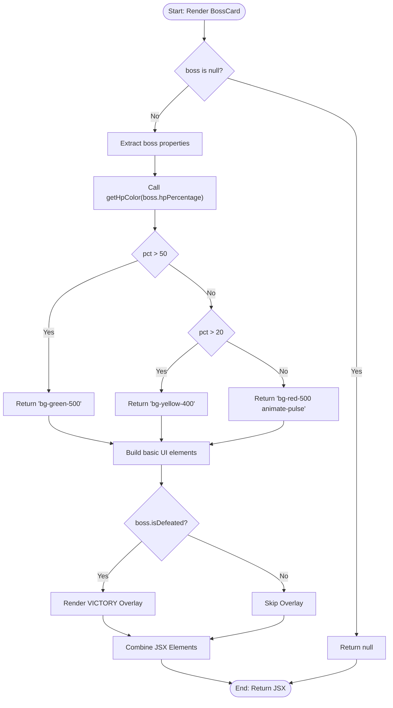
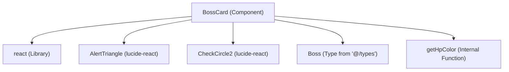

## 1. 解析メタ情報

| 項目 | 内容 |
| --- | --- |
| 対象ファイル | BossCard.tsx |
| 言語 | React (TypeScript) |
| 解析対象 | 提供されたコードのみ |
| 推測・補完 | 一切なし |

## 2. ファイルの概要

* 渡されたボスのデータ（名前、アイコン、説明、HP、撃破状態、ターゲット期間）を受け取り、画面に表示するためのUIコンポーネント（カード要素）を提供する。
* ボスの現在HP割合（パーセンテージ）に応じて、HPバーの色を動的に変化させるロジックを含んでいる。
* ボス情報が未提供（`null`）の場合は何も描画しない。

## 3. 外部依存関係

### インポート一覧

| 名称 | 種類 | 用途 | 根拠 |
| --- | --- | --- | --- |
| `React` | ライブラリ | Reactの基本機能およびコンポーネント定義 | 根拠: `import React from 'react';` (行番号: 1 / 抜粋: "import React from 'react';") |
| `AlertTriangle` | ライブラリ | UI表示用の警告アイコン | 根拠: `import { AlertTriangle, Chec...` (行番号: 2 / 抜粋: "import { AlertTriangle, CheckC...") |
| `CheckCircle2` | ライブラリ | UI表示用の撃破済みチェックアイコン | 根拠: `import { AlertTriangle, Chec...` (行番号: 2 / 抜粋: "import { AlertTriangle, CheckC...") |
| `Boss` | 型定義 | コンポーネントのPropsである`boss`プロパティの型指定 | 根拠: `import { Boss } from '@/types';` (行番号: 3 / 抜粋: "import { Boss } from '@/types'...") |

### ブラックボックスとなる外部要素

| 名称 | 理由 | 根拠 |
| --- | --- | --- |
| `Boss` | このファイル内には型定義の実体がなく、プロパティの完全な構造や他のフィールドが存在するかは外部ファイルに依存するため不明。 | 根拠: `import { Boss } from '@/types';` (行番号: 3 / 抜粋: "import { Boss } from '@/types'...") |

## 4. 主要要素の定義（関数 / エンドポイント / コンポーネント）

### `BossCard`

* **役割**: `boss`オブジェクトを受け取り、ボスのアイコン、名前、説明、HPバー、撃破状態のオーバーレイ、週間ターゲット期間を描画するReactコンポーネント。
* 根拠: [BossCard] (行番号: 9〜71 / 抜粋: "const BossCard: React.FC<BossC...")

* **引数/リクエスト**: `{ boss }`: `Boss | null` 型。ボスの詳細情報を含むオブジェクト、またはnull。
* 根拠: [BossCardProps] (行番号: 5〜7 / 抜粋: "interface BossCardProps { boss...")

* **戻り値/レスポンス**: `JSX.Element` または `null`（`boss`がfalsyな場合）。
* 根拠: [BossCard早期リターン] (行番号: 10 / 抜粋: "if (!boss) return null;") および [JSX返却] (行番号: 19 / 抜粋: "return ( 
 50) return 'bg-green...")

* **副作用**: なし
* 根拠: [getHpColor] (行番号: 13〜17 / 抜粋: "const getHpColor = (pct: numbe...")

* **エラーハンドリング**: なし
* 根拠: [getHpColor] (行番号: 13〜17 / 抜粋: "const getHpColor = (pct: numbe...")

## 5. 処理フロー図

## 6. 依存関係図

## 7. 次のステップ（リバースエンジニアリングの提案）

| 優先度 | ファイル名(推測可) | 理由 | 根拠 |
| --- | --- | --- | --- |
| 高 | `@/types` (または `@/types/index.ts`) | `Boss`オブジェクトの完全なスキーマや、他のコンポーネントと共有されている型定義の内容を確認するため。 | 根拠: `import { Boss } from '@/types';` (行番号: 3 / 抜粋: "import { Boss } from '@/types'...") |
| 中 | 本コンポーネントをインポートしている親ファイル | `boss`データがどこで生成・取得され、どのようなタイミングで`null`が渡されるかを把握し、システム全体のデータフローを追跡するため。 | 根拠: `interface BossCardProps { boss...` (行番号: 5〜7 / 抜粋: "interface BossCardProps { boss...") |

## 8. 保守上の注意点

* **null安全性**: `if (!boss) return null;` によりプロパティへのアクセス前にnullチェックが行われており、実行時エラーを防ぐ構造になっている。
* **データ型の前提**: `boss.hpPercentage` が数値であること、`boss.isDefeated` が真偽値として評価されることなど、`Boss`オブジェクトの特定のプロパティ群が存在し、適切な型で渡されることに依存している。

## 9. 不明事項一覧

| 項目 | 理由 | 必要なファイル |
| --- | --- | --- |
| `Boss`型の完全なプロパティ定義 | 外部ファイルからインポートされており、このコンポーネント内で使用されていないプロパティが存在するかどうかは判断不可であるため。 | `@/types` に該当する実体ファイル |
| データの供給元と`null`が渡される条件 | 親コンポーネントが提供されていないため、初期ロード時やデータ取得失敗時など、どのケースで`boss`に`null`が入るのか判断不可であるため。 | 本コンポーネントを呼び出しているファイル |

## 10. 自己検証結果

* [x] 推測・外部ファイルの仕様を一切含んでいない
* [x] 全関数・全クラス・全コンポーネントを列挙した
* [x] 全てのインポート要素を列挙した
* [x] すべての仕様説明に「根拠（行番号・抜粋）」を明記した
* [x] 根拠漏れが0件である
* [x] Mermaid構文にエラーの原因となる記号（エスケープ漏れ）がない
* [x] 不明事項を漏れなく列挙した
完了