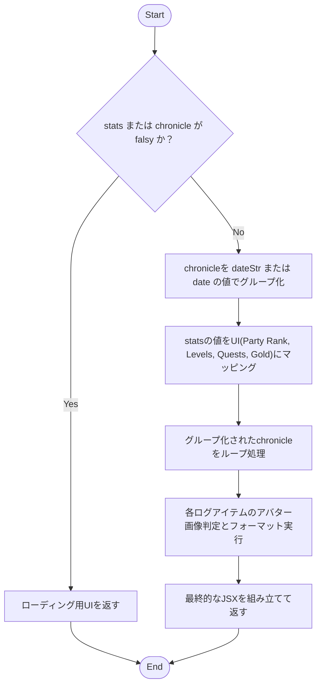
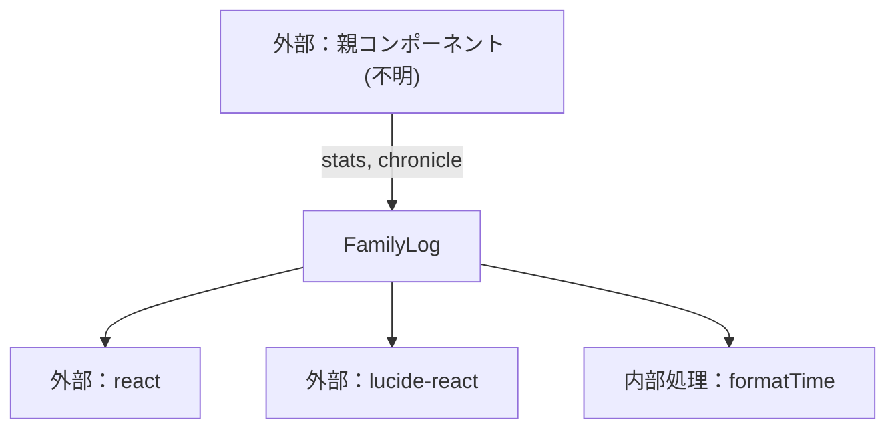

## 1. 解析メタ情報

| 項目 | 内容 |
| --- | --- |
| 対象ファイル | FamilyLog.tsx |
| 言語 | React (TypeScript) |
| 解析対象 | 提供されたコードのみ |
| 推測・補完 | 一切なし |

## 2. ファイルの概要

* 家族のステータス情報（ランク、レベル、クエスト数、所持金）および冒険の記録（タイムライン形式のログ）を描画・表示するためのReactコンポーネントである。
* 親コンポーネントから渡されたログデータを日付ごとにグループ化し、日本時間でフォーマットした上でUIとして出力する。

## 3. 外部依存関係

### インポート一覧

| 名称 | 種類 | 用途 | 根拠 |
| --- | --- | --- | --- |
| `React` | ライブラリ | Reactコンポーネントの定義のため | 根拠: [インポート宣言] (行番号: 1 / 抜粋: "import React from 'react';") |
| `Trophy`, `Coins`, `History`, `Clock` | ライブラリ (`lucide-react`) | UI上のアイコン描画のため | 根拠: [インポート宣言] (行番号: 2 / 抜粋: "import { Trophy, Coins, Histo...") |

### ブラックボックスとなる外部要素

| 名称 | 理由 | 根拠 |
| --- | --- | --- |
| 親コンポーネント | このコンポーネントを呼び出し、`stats` および `chronicle` のPropsを提供する要素の実装が不明。 | 根拠: [引数定義] (行番号: 9 / 抜粋: "const FamilyLog: React.FC<Fami...") |
| 画像ホスティング環境 | アバター画像のURLが `/uploads` または `http` で始まることを前提とした判定があるが、実際の配信元環境や構成は不明。 | 根拠: [isImage判定] (行番号: 56 / 抜粋: "const isImage = avatarSrc && (...") |

## 4. 主要要素の定義（関数 / エンドポイント / コンポーネント）

### `FamilyLog`

* **役割**: 家族の統計情報と日付ごとのログをタイムラインとして描画する。
* 根拠: [FamilyLog] (行番号: 9〜94 / 抜粋: "const FamilyLog: React.FC<Fami...")

* **引数/リクエスト**: `FamilyLogProps` (`stats`: any, `chronicle`: any[])
* 根拠: [FamilyLogProps] (行番号: 4〜7 / 抜粋: "interface FamilyLogProps {...")

* **戻り値/レスポンス**: JSX.Element
* 根拠: [FamilyLog] (行番号: 27〜93 / 抜粋: "return ( <div className="space...")

* **副作用**: なし
* 根拠: [FamilyLog] (行番号: 9〜94 / 抜粋: "const FamilyLog: React.FC<Fami...")

* **エラーハンドリング**: `stats` または `chronicle` が falsy な場合、読み込み中のメッセージを返す。
* 根拠: [FamilyLog] (行番号: 10 / 抜粋: "if (!stats || !chronicle) retu...")

### `formatTime`

* **役割**: 渡されたタイムスタンプを日本時間の `HH:mm` 形式の文字列に変換する。
* 根拠: [formatTime] (行番号: 21〜25 / 抜粋: "const formatTime = (ts: string...")

* **引数/リクエスト**: `ts` (string | number)
* 根拠: [formatTime] (行番号: 21 / 抜粋: "const formatTime = (ts: string...")

* **戻り値/レスポンス**: string
* 根拠: [formatTime] (行番号: 24 / 抜粋: "return date.toLocaleTimeString...")

* **副作用**: なし
* 根拠: [formatTime] (行番号: 21〜25 / 抜粋: "const formatTime = (ts: string...")

* **エラーハンドリング**: 引数 `ts` が falsy な場合は空文字列を返す。
* 根拠: [formatTime] (行番号: 22 / 抜粋: "if (!ts) return '';")

## 5. 処理フロー図

## 6. 依存関係図

## 7. 次のステップ（リバースエンジニアリングの提案）

| 優先度 | ファイル名(推測可) | 理由 | 根拠 |
| --- | --- | --- | --- |
| 高 | 親コンポーネント (例: `App.tsx` またはページコンポーネント) | `stats`と`chronicle`の具体的なデータ構造や取得元（API通信など）を把握するため。 | 根拠: [Props定義] (行番号: 4〜7 / 抜粋: "interface FamilyLogProps {...") |
| 中 | APIクライアント / サービス層のファイル | `chronicle`配列内のオブジェクトが持つ一貫性のないプロパティ（`dateStr`と`date`、`text`と`message`など）の生成元を特定するため。 | 根拠: [プロパティ参照] (行番号: 14, 70 / 抜粋: "const date = item.dateStr |

## 8. 保守上の注意点

* `stats` および `chronicle` が `any` 型として定義されているため、コンパイル時に型の安全性が保証されていない。
* 根拠: [Props定義] (行番号: 4〜7 / 抜粋: "stats: any; // 必要であれば...")

* `chronicle` の各要素において、プロパティ名に複数のパターン（例: `dateStr` と `date`、`userAvatar` と `avatar_url`、`text` と `message`、`exp` と `reward_exp`）が混在しており、フォールバック（`||`）による評価が行われている。
* 根拠: [プロパティ評価] (行番号: 14, 55, 70, 77 / 抜粋: "const date = item.dateStr || i...")

* アバター画像かどうかの判定に、文字列の先頭一致（`startsWith('/uploads')` または `startsWith('http')`）を用いているため、ホスティング先やURLの仕様が変更された場合に表示が崩れる可能性がある。
* 根拠: [isImage判定] (行番号: 56 / 抜粋: "const isImage = avatarSrc && (...")

## 9. 不明事項一覧

| 項目 | 理由 | 必要なファイル |
| --- | --- | --- |
| `stats`の厳密なスキーマ | 型が `any` であり、コード内でのプロパティ参照（`partyRank`, `totalLevel`, `totalQuests`, `totalGold`）以外に含まれるデータが不明なため。 | 親コンポーネント、または型定義ファイル |
| `chronicle`の厳密なスキーマ | 型が `any[]` であり、オブジェクトに混在する複数パターンのプロパティの正規の仕様が不明なため。 | 親コンポーネント、または型定義ファイル |

## 10. 自己検証結果

* [x] 推測・外部ファイルの仕様を一切含んでいない
* [x] 全関数・全クラス・全コンポーネントを列挙した
* [x] 全てのインポート要素を列挙した
* [x] すべての仕様説明に「根拠（行番号・抜粋）」を明記した
* [x] 根拠漏れが0件である
* [x] Mermaid構文にエラーの原因となる記号（エスケープ漏れ）がない
* [x] 不明事項を漏れなく列挙した

完了