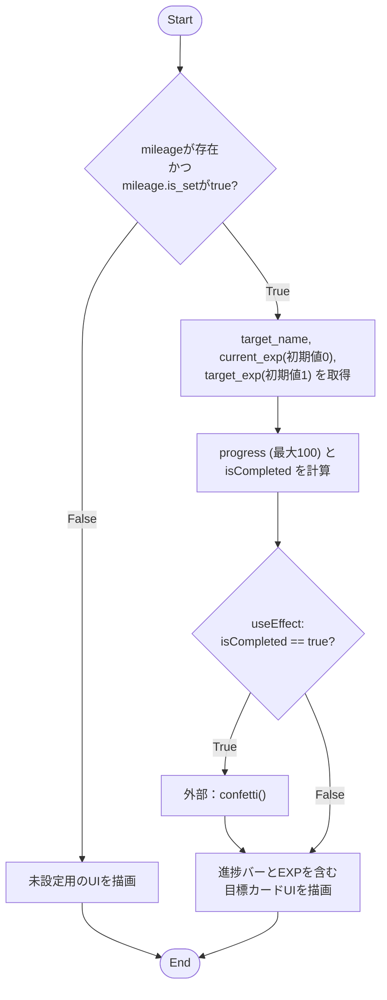
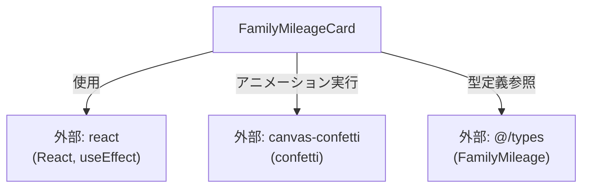

## 1. 解析メタ情報

| 項目 | 内容 |
| --- | --- |
| 対象ファイル | FamilyMileageCard.tsx |
| 言語 | React (TypeScript) |
| 解析対象 | 提供されたコードのみ |
| 推測・補完 | 一切なし |

## 2. ファイルの概要

提供されたファイルは、家族の目標（マイレージ）の進捗状況をUIとして表示するカードコンポーネントです。目標が未設定の場合は専用の案内UIを表示し、設定済みの場合は目標名、経験値（EXP）の現在値と目標値、および進捗バーを描画します。現在値が目標値に達した場合は、外部ライブラリを利用して紙吹雪（confetti）のアニメーションを実行します。

## 3. 外部依存関係

### インポート一覧

| 名称 | 種類 | 用途 | 根拠 |
| --- | --- | --- | --- |
| `React`, `useEffect` | モジュール | コンポーネント定義および副作用処理 | 根拠: [import文] (行番号: 1〜1 / 抜粋: "import React, { useEffect } fro") |
| `confetti` | モジュール | 目標達成時の紙吹雪アニメーションの描画 | 根拠: [import文] (行番号: 2〜2 / 抜粋: "import confetti from 'canvas-c") |
| `FamilyMileage` | 型定義 | コンポーネントのPropsである`mileage`の型として使用 | 根拠: [import文] (行番号: 3〜3 / 抜粋: "import { FamilyMileage } from ") |

### ブラックボックスとなる外部要素

| 名称 | 理由 | 根拠 |
| --- | --- | --- |
| `@/types` (FamilyMileage) | `FamilyMileage`の完全な構造や他のプロパティが提供されたコード内では定義されていないため | 根拠: [import文] (行番号: 3〜3 / 抜粋: "import { FamilyMileage } from ") |
| `canvas-confetti` (confetti) | 外部ライブラリであり、引数に渡した設定値が内部でどのように処理され描画されるか詳細不明なため | 根拠: [import文] (行番号: 2〜2 / 抜粋: "import confetti from 'canvas-c") |

## 4. 主要要素の定義（関数 / エンドポイント / コンポーネント）

### `FamilyMileageCard`

* **役割**: `mileage`の状態を評価し、未設定（`null`または`is_set`がfalsy）の場合は案内文を、設定済みの場合は進捗バーを含む目標カードのUIを描画する。また、目標達成時には紙吹雪アニメーションをトリガーする。
* 根拠: [FamilyMileageCardコンポーネント] (行番号: 9〜55 / 抜粋: "export const FamilyMileageCard")

* **引数/リクエスト**: `{ mileage }` (型: `FamilyMileage | null`)
* 根拠: [FamilyMileageCardProps] (行番号: 5〜7 / 抜粋: "mileage: FamilyMileage | null;")

* **戻り値/レスポンス**: JSX要素 (Reactノード)
* 根拠: [return文] (行番号: 11〜16 / 抜粋: "return ( 
 { if (isComple")

* **エラーハンドリング**: 明示的なtry-catch等はなし。ただし、`mileage`が未定義や`is_set`がfalsyな場合は早期リターンにより、後続のプロパティ参照エラーを回避している。
* 根拠: [if文] (行番号: 10〜17 / 抜粋: "if (!mileage || !mileage.is_se")

## 5. 処理フロー図

## 6. 依存関係図

## 7. 次のステップ（リバースエンジニアリングの提案）

| 優先度 | ファイル名(推測可) | 理由 | 根拠 |
| --- | --- | --- | --- |
| 高 | `@/types`の実装ファイル (`types.ts`等) | `FamilyMileage`の完全なプロパティ構造とそれぞれの型を確認し、データモデルの全体像を把握するため。 | 根拠: [import文] (行番号: 3〜3 / 抜粋: "import { FamilyMileage } from ") |
| 中 | 管理画面のコンポーネント | UI上で「管理画面から新しい目標を設定してください」と表示しているため、データの生成元・更新元となる設定画面の実装を確認し、整合性を担保するため。 | 根拠: [pタグのテキスト] (行番号: 14〜14 / 抜粋: "管理画面から新しい目標を設定してください。") |
| 低 | 本コンポーネントの親コンポーネント | `mileage`のデータをどこからフェッチ・管理してPropsとして渡しているかを特定するため。 | 根拠: [コンポーネント引数] (行番号: 9〜9 / 抜粋: "= ({ mileage }) => {") |

## 8. 保守上の注意点

* **副作用のトリガー条件**: `useEffect`の依存配列に`[isCompleted, current_exp]`が指定されています。`isCompleted`が`true`の状態で、`current_exp`のみが更新された場合（例：すでに達成している状態でさらに経験値が加算された場合）、その都度`confetti`が再実行される挙動となります。
* 根拠: [useEffect依存配列] (行番号: 33〜33 / 抜粋: "}, [isCompleted, current_exp]);")

* **ゼロ除算の可能性**: `target_exp`のデフォルト値は1に設定されていますが、渡された`mileage`オブジェクトで意図せず`target_exp = 0`が設定されていた場合、`current_exp / target_exp`の計算結果が`Infinity`等になり、`progress`の値（UIのゲージ幅）に影響する可能性があります。
* 根拠: [progress計算] (行番号: 21〜21 / 抜粋: "Math.min((current_exp / target")

## 9. 不明事項一覧

| 項目 | 理由 | 必要なファイル |
| --- | --- | --- |
| `FamilyMileage`の他のプロパティと厳密な型 | 本ファイルでは一部のプロパティの分割代入しか行われていないため | `@/types`がエクスポートされているファイル |
| `mileage`データの取得・更新ロジック | 本ファイルは表示責務しか持たず、データの取得や変更ロジックが含まれていないため | 本コンポーネントを呼び出している親ファイルまたはState管理ファイル |
| 「管理画面」への遷移方法 | 案内文のみで、リンク(`<a>`や`Link`)が実装されていないため | ルーティング設定ファイル、または親コンポーネント |

## 10. 自己検証結果

* [x] 推測・外部ファイルの仕様を一切含んでいない
* [x] 全関数・全クラス・全コンポーネントを列挙した
* [x] 全てのインポート要素を列挙した
* [x] すべての仕様説明に「根拠（行番号・抜粋）」を明記した
* [x] 根拠漏れが0件である
* [x] Mermaid構文にエラーの原因となる記号（エスケープ漏れ）がない
* [x] 不明事項を漏れなく列挙した

完了