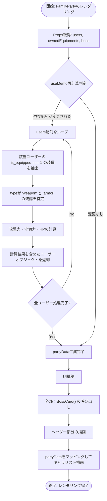
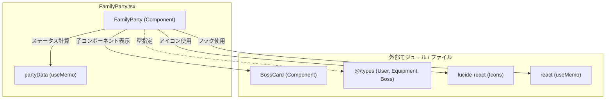

## 1. 解析メタ情報

| 項目 | 内容 |
| --- | --- |
| 対象ファイル | `FamilyParty.tsx` |
| 言語 | React (TypeScript) |
| 解析対象 | 提供されたコードのみ |
| 推測・補完 | 一切なし |

## 2. ファイルの概要

このファイルは、ユーザー（キャラクター）のリストと所持装備データを受け取り、各キャラクターの装備適用後のステータス（HP、攻撃力、守備力など）を算出の上、パーティ全体とボスの情報を表示するUI（Reactコンポーネント）を提供する責務を持っている。

## 3. 外部依存関係

### インポート一覧

| 名称 | 種類 | 用途 | 根拠 |
| --- | --- | --- | --- |
| `React`, `useMemo` | ライブラリ | コンポーネント定義およびステータス計算のメモ化 | 根拠: import文 (行番号: 1 / 抜粋: "`import React, { useMemo } ...`") |
| `Crown`, `Sword`, `Shield` | アイコンコンポーネント | UIの装飾表示 | 根拠: import文 (行番号: 2 / 抜粋: "`import { Crown, Sword, ...`") |
| `User`, `Equipment`, `Boss` | 型定義 | Propsおよび内部データの型指定 | 根拠: import文 (行番号: 3 / 抜粋: "`import { User, Equipment...`") |
| `BossCard` | コンポーネント | ボス情報のUI表示 | 根拠: import文 (行番号: 4 / 抜粋: "`import BossCard from './...`") |

### ブラックボックスとなる外部要素

| 名称 | 理由 | 根拠 |
| --- | --- | --- |
| `@/types`の各型 (`User`, `Equipment`, `Boss`) | ファイル内に型定義の具体的な実装が提供されていないため、詳細なプロパティ構造は不明。 | 根拠: import文 (行番号: 3 / 抜粋: "`import { User, Equipment...`") |
| `BossCard` コンポーネント | 実装ファイルが提供されておらず、内部でどのような処理やレンダリングが行われているか不明。 | 根拠: import文 (行番号: 4 / 抜粋: "`import BossCard from './...`") |

## 4. 主要要素の定義（関数 / エンドポイント / コンポーネント）

### `FamilyParty`

* **役割**: 渡されたユーザーと装備の情報から各メンバーの実ステータスを計算し、ボス情報を含むパーティのUI一覧をレンダリングする。
* 根拠: コンポーネント定義 (行番号: 12〜142 / 抜粋: "`const FamilyParty: React...`")

* **引数/リクエスト**: `FamilyPartyProps` (`users`: `User[]`, `ownedEquipments`: `any[]`, `boss`: `Boss | null`)
* 根拠: Props型定義 (行番号: 6〜10 / 抜粋: "`interface FamilyPartyProps...`")

* **戻り値/レスポンス**: JSX.Element (UI要素)
* 根拠: return文 (行番号: 39〜140 / 抜粋: "`return ( <div className=...`")

* **副作用**: なし
* 根拠: 該当箇所なし (行番号: 取得不可 / 抜粋: "副作用を行う記述が存在しない")

* **エラーハンドリング**: なし
* 根拠: 該当箇所なし (行番号: 取得不可 / 抜粋: "例外処理を行う記述が存在しない")

### `partyData` (内部処理 / useMemo)

* **役割**: `users`の各要素に対し、`ownedEquipments`から装備中の武器と防具を特定し、補正値を加算した新しいステータス情報を持つユーザーオブジェクトの配列を生成・キャッシュする。
* 根拠: useMemoブロック (行番号: 14〜38 / 抜粋: "`const partyData = useMem...`")

* **引数/リクエスト**: `users`, `ownedEquipments` (依存配列)
* 根拠: 依存配列の定義 (行番号: 38 / 抜粋: "`}, [users, ownedEquipments...`")

* **戻り値/レスポンス**: 拡張されたユーザー情報の配列 (`hp`, `weapon`, `armor`, `stats` プロパティが追加されている)
* 根拠: return文 (行番号: 30〜36 / 抜粋: "`return { ...user, hp: ma...`")

* **副作用**: なし
* 根拠: 該当箇所なし (行番号: 取得不可 / 抜粋: "副作用を行う記述が存在しない")

* **エラーハンドリング**: なし
* 根拠: 該当箇所なし (行番号: 取得不可 / 抜粋: "例外処理を行う記述が存在しない")

## 5. 処理フロー図

## 6. 依存関係図

## 7. 次のステップ（リバースエンジニアリングの提案）

| 優先度 | ファイル名(推測可) | 理由 | 根拠 |
| --- | --- | --- | --- |
| 高 | `@/types` に該当するファイル | コンポーネント内のデータ処理の正確な型安全性を確認し、`User`や`Equipment`の全プロパティ構造を把握するため。 | 根拠: import文 (行番号: 3 / 抜粋: "`import { User, Equipment...`") |
| 中 | `./BossCard.tsx` | ボスの情報がどのように表示されるか、内部で必要なデータ要件などシステム全体のUI仕様を把握するため。 | 根拠: import文 (行番号: 4 / 抜粋: "`import BossCard from './...`") |
| 中 | 本コンポーネントを呼び出す親ファイル | `ownedEquipments`の実際のデータ構造（現在`any[]`）の全貌を明確にするため。 | 根拠: Props定義 (行番号: 8 / 抜粋: "`ownedEquipments: any[];`") |

## 8. 保守上の注意点

* `ownedEquipments` が `any[]` として型定義されており、内部処理で `e: any` としてアクセスされている。渡されるデータ構造が変更された場合、TypeScriptのコンパイルエラーでは検知できず、実行時エラーや計算ミスにつながる可能性が高い。
* HPの計算式が `(user.level * 10) + 50` とハードコードされている。ゲームバランスの調整等で仕様変更が発生した場合、直接このコンポーネントを修正する必要がある。
* アバター画像がない場合のフォールバックとして `member.icon || '🙂'` が使用されているが、これらのプロパティの存在保証（null安全性）は外部の型定義（`@/types`）に完全に依存している。

## 9. 不明事項一覧

| 項目 | 理由 | 必要なファイル |
| --- | --- | --- |
| `User`, `Equipment`, `Boss`の正確なプロパティ定義 | インポート元の実装が提供されていないため | `@/types`の型定義ファイル |
| `BossCard` コンポーネントの挙動と表示内容 | インポート元の実装が提供されていないため | `./BossCard.tsx` |
| `ownedEquipments` の実際のデータ構造 | 現在 `any[]` で代用されており、親からの供給仕様が不明なため | 本コンポーネントを呼び出している親ファイル |

## 10. 自己検証結果

* [x] 推測・外部ファイルの仕様を一切含んでいない
* [x] 全関数・全クラス・全コンポーネントを列挙した
* [x] 全てのインポート要素を列挙した
* [x] すべての仕様説明に「根拠（行番号・抜粋）」を明記した
* [x] 根拠漏れが0件である
* [x] Mermaid構文にエラーの原因となる記号（エスケープ漏れ）がない
* [x] 不明事項を漏れなく列挙した

完了