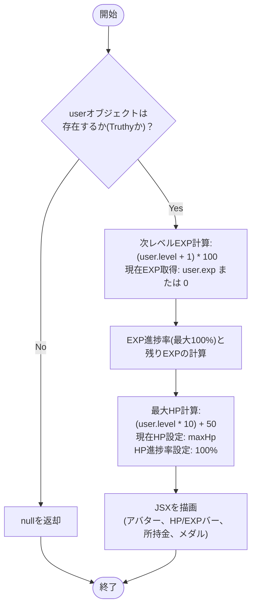
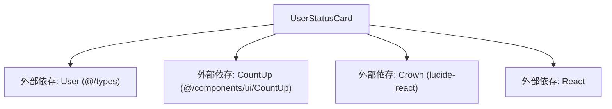

## 1. 解析メタ情報

| 項目 | 内容 |
| --- | --- |
| 対象ファイル | UserStatusCard.tsx |
| 言語 | React (TypeScript) |
| 解析対象 | 提供されたコードのみ |
| 推測・補完 | 一切なし |

## 2. ファイルの概要

* ユーザー（冒険者）のレベル、HP、EXP（経験値）、所持ゴールド、獲得メダルなどのステータス情報を可視化し、RPGのステータスカードのようなUIとして描画するコンポーネント。
* ユーザーのアバター画像（またはアイコン）をクリックした際に、コールバック関数を発火させるインタラクションを提供する。

## 3. 外部依存関係

### インポート一覧

| 名称 | 種類 | 用途 | 根拠 |
| --- | --- | --- | --- |
| `React` | ライブラリ | Reactコンポーネントの定義 | 根拠: [インポート宣言] (行番号: 1 / 抜粋: "import React from 'react';") |
| `Crown` | 外部アイコン | 装飾用アイコンの描画 | 根拠: [インポート宣言] (行番号: 2 / 抜粋: "import { Crown } from 'lucide-react';") |
| `User` | 型定義 | コンポーネントのPropsである`user`オブジェクトの型定義 | 根拠: [インポート宣言] (行番号: 3 / 抜粋: "import { User } from '@/types';") |
| `CountUp` | 外部コンポーネント | HP、ゴールド、メダルなどの数値をアニメーション表示する | 根拠: [インポート宣言] (行番号: 4 / 抜粋: "import { CountUp } from '@/components/...") |

### ブラックボックスとなる外部要素

| 名称 | 理由 | 根拠 |
| --- | --- | --- |
| `User` 型の詳細 | `@/types` に定義されているため、本ファイルからは全てのプロパティ（必須・任意）や型定義の全容が把握不可。 | 根拠: [インポート宣言] (行番号: 3 / 抜粋: "import { User } from '@/types';") |
| `CountUp` コンポーネント | `@/components/ui/CountUp` に定義されているため、内部の具体的なアニメーション実装や、受け付可能な全てのPropsが不明。 | 根拠: [インポート宣言] (行番号: 4 / 抜粋: "import { CountUp } from '@/components/...") |
| 親コンポーネントの実装 | `onAvatarClick` で渡される関数の具体的な処理内容（状態更新や画面遷移など）が不明。 | 根拠: [Props定義] (行番号: 8 / 抜粋: "onAvatarClick: (user: User) => void;") |

## 4. 主要要素の定義（関数 / エンドポイント / コンポーネント）

### `UserStatusCardProps`

* **役割**: `UserStatusCard` コンポーネントが親から受け取るプロパティ（Props）の型を定義する。
* 根拠: [インターフェース定義] (行番号: 6〜9 / 抜粋: "interface UserStatusCardProps {")

* **引数/リクエスト**: 該当なし（型定義のため）
* **戻り値/レスポンス**: 該当なし
* **副作用**: なし
* **エラーハンドリング**: なし

### `UserStatusCard`

* **役割**: 渡された `user` 情報をもとに、次レベルまでのEXP、現在/最大HP、各プログレスバーの進捗率を計算し、ステータスカードUIをレンダリングする。
* 根拠: [コンポーネント定義] (行番号: 11〜86 / 抜粋: "const UserStatusCard: React.FC<...")

* **引数/リクエスト**: `{ user, onAvatarClick }` (`UserStatusCardProps` 型)
* 根拠: [引数定義] (行番号: 11 / 抜粋: "({ user, onAvatarClick }) => {")

* **戻り値/レスポンス**: JSX.Element（`div`要素） または `null`
* 根拠: [戻り値] (行番号: 12, 28〜85 / 抜粋: "return ( 
 onAvatarClick(user)}")

* **エラーハンドリング**: `user` オブジェクトが未定義（falsy）の場合、描画処理を行わず `null` を返却して早期リターン（クラッシュ回避）。
* 根拠: [条件分岐] (行番号: 12 / 抜粋: "if (!user) return null;")

## 5. 処理フロー図

## 6. 依存関係図

## 7. 次のステップ（リバースエンジニアリングの提案）

| 優先度 | ファイル名(推測可) | 理由 | 根拠 |
| --- | --- | --- | --- |
| 高 | `@/types` (または `types.ts` 等) | `User`オブジェクトが持つプロパティ（特に将来的に連携予定と思われる `hp`, `max_hp` 等のフィールドの有無）を正確に把握するため。 | 根拠: [インポート宣言] (行番号: 3 / 抜粋: "import { User } from '@/types';") |
| 中 | `@/components/ui/CountUp` (または `CountUp.tsx` 等) | 描画時のアニメーション挙動の把握や、渡しているProps（`value`, `suffix`）の処理が正しく実装されているか確認するため。 | 根拠: [インポート宣言] (行番号: 4 / 抜粋: "import { CountUp } from '@/components/...") |
| 中 | `UserStatusCard`を呼び出している親コンポーネント | `onAvatarClick` 時にどのようなデータフローが発生しているか、および実際の `user` データをどのように取得・渡与しているか確認するため。 | 根拠: [Props使用箇所] (行番号: 36 / 抜粋: "onClick={() => onAvatarClick(user)}") |

## 8. 保守上の注意点

* **ハードコードされた計算ロジック**: 次のレベルまでの経験値計算（`(user.level + 1) * 100`）および最大HP計算（`(user.level * 10) + 50`）がコンポーネント内に直接記述されている。将来バックエンド側から値が提供されるようになった場合、二重管理による不整合が生じるリスクがある。
* 根拠: [変数定義] (行番号: 15, 24 / 抜粋: "const maxHp = (user.level * 10) + 50;")

* **ダミーデータの固定値**: 現在HP（`currentHp`）が常に `maxHp` と同値に設定され、HP進捗率（`hpPercentage`）も常に `100` に固定されているため、ダメージを受けた状態などの動的なUI表現が現状機能していない。
* 根拠: [変数定義] (行番号: 25〜26 / 抜粋: "const currentHp = maxHp; // とりあえず...")

* **フォールバック処理**: `user.exp`, `user.gold`, `user.medal_count` が存在しない（falsyな）場合、`0` にフォールバックされる仕様となっている。
* 根拠: [変数定義・属性] (行番号: 16, 75, 81 / 抜粋: "const currentExp = user.exp || 0;")

* **プロパティの欠損による表示不備リスク**: `user.job_class` が無い場合は `'冒険者'` にフォールバックするが、`user.avatar` と `user.icon` が両方未定義の場合はハードコードされた絵文字 `'🙂'` が表示される。
* 根拠: [三項演算子] (行番号: 42〜44 / 抜粋: "user.icon || '🙂'")

## 9. 不明事項一覧

| 項目 | 理由 | 必要なファイル |
| --- | --- | --- |
| `User` 型の正確なスキーマ定義 | 外部ファイルにて定義されているため、存在しうる全プロパティが不明。 | `@/types` |
| APIによるHP/EXPデータの提供予定 | コメントに「APIデータがあればそれを使う」とあるが、実際の実装状況やデータ構造が不明。 | API仕様書 または 親コンポーネント/型定義 |
| `CountUp` コンポーネントの仕様 | 外部コンポーネントであり、内部ロジックやサポートしているPropsが不明。 | `@/components/ui/CountUp` |
| `onAvatarClick` の実行内容 | 親コンポーネント側で制御されているため、クリック時の副作用（画面遷移、モーダル表示など）が不明。 | 本コンポーネントを呼び出す親ファイル |

## 10. 自己検証結果

* [x] 推測・外部ファイルの仕様を一切含んでいない
* [x] 全関数・全クラス・全コンポーネントを列挙した
* [x] 全てのインポート要素を列挙した
* [x] すべての仕様説明に「根拠（行番号・抜粋）」を明記した
* [x] 根拠漏れが0件である
* [x] Mermaid構文にエラーの原因となる記号（エスケープ漏れ）がない
* [x] 不明事項を漏れなく列挙した

完了