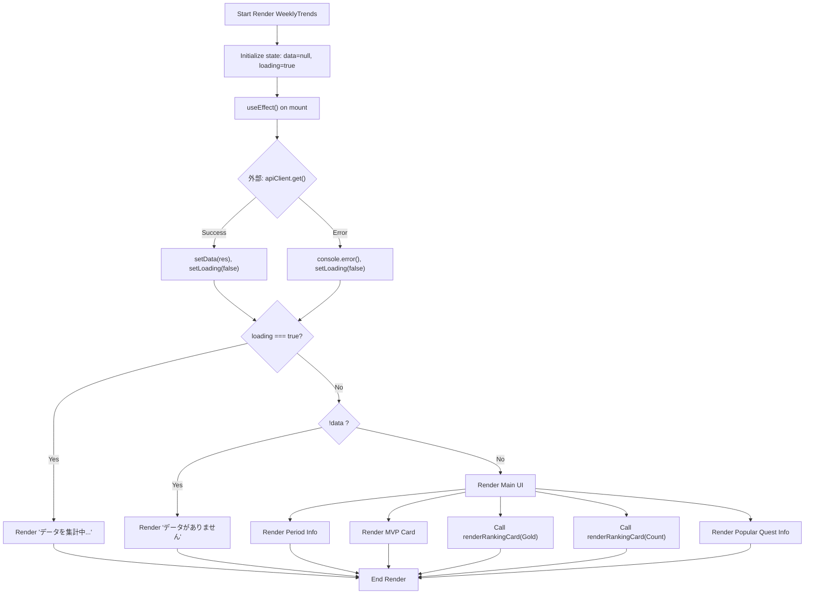
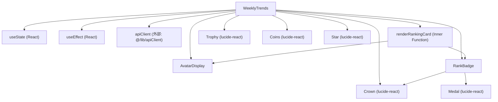

## 1. 解析メタ情報

| 項目 | 内容 |
| --- | --- |
| 対象ファイル | `WeeklyTrends.tsx` |
| 言語 | React / TypeScript |
| 解析対象 | 提供されたコードのみ |
| 推測・補完 | 一切なし |

## 2. ファイルの概要

週間トレンドデータ（MVP、お金持ちランキング、頑張りランキング、人気クエスト等）を外部APIから取得し、画面上にランキングカードやバッジを用いて視覚的に表示するUIコンポーネント。

## 3. 外部依存関係

### インポート一覧

| 名称 | 種類 | 用途 | 根拠 |
| --- | --- | --- | --- |
| `useEffect`, `useState` | モジュール | コンポーネントの状態管理およびマウント時の副作用（API呼び出し）の制御 | `import { useEffect, useState } from 'react';` (行番号: 1) |
| `Trophy`, `Coins`, `Star`, `Crown`, `Medal` | コンポーネント | UIの装飾用アイコンの表示 | `import { Trophy, Coins, Star, Crown, Medal } from 'lucide-react';` (行番号: 2) |
| `apiClient` | モジュール | 外部APIから週間トレンドデータを取得するためのHTTPクライアント | `import { apiClient } from '@/lib/apiClient';` (行番号: 3) |

### ブラックボックスとなる外部要素

| 名称 | 理由 | 根拠 |
| --- | --- | --- |
| `apiClient` | 提供されたファイル内に実装がなく、ベースURL、ヘッダー付与、エラーハンドリングなどの内部仕様が不明なため | `import { apiClient } from '@/lib/apiClient';` (行番号: 3) |

## 4. 主要要素の定義（関数 / エンドポイント / コンポーネント）

### `TrendData`

* **役割**: APIから取得するトレンドデータの構造を定義するインターフェース
* 根拠: `interface TrendData` (行番号: 6-21 / 抜粋: "interface TrendData {")

### `AvatarDisplay`

* **役割**: アバター画像または代替テキストを表示する。渡された値が画像パス（`/`から始まる文字列）の場合は``要素を、それ以外の場合は``要素をレンダリングする。
* 根拠: `const AvatarDisplay` (行番号: 24-49 / 抜粋: "const isImagePath = avatar && ...")

* **引数/リクエスト**: `{ avatar: string, sizeClass: string, borderClass?: string }`
* 根拠: 引数定義 (行番号: 24 / 抜粋: "({ avatar, sizeClass, borderClass")

* **戻り値/レスポンス**: JSX要素 (`` または ``)
* 根拠: return文 (行番号: 39-45, 48 / 抜粋: "return ( `, `<Medal>`, または ``)
* 根拠: return文 (行番号: 53-56 / 抜粋: "return <Crown size={24}...")

* **副作用**: なし
* 根拠: 関数内に外部状態を変更する処理が存在しない (行番号: 52-57)

* **エラーハンドリング**: なし
* 根拠: エラー捕捉のロジックが存在しない (行番号: 52-57)

### `WeeklyTrends`

* **役割**: 週間トレンドの全体UI（MVP表示、ランキング、人気クエスト）を構築するメインコンポーネント。APIからデータを取得し、ローディング・データなし・正常表示を切り替える。
* 根拠: `export const WeeklyTrends` (行番号: 59-224 / 抜粋: "export const WeeklyTrends = () =>")

* **引数/リクエスト**: なし
* 根拠: 引数定義 (行番号: 59 / 抜粋: "() => {")

* **戻り値/レスポンス**: JSX要素 (`
`)
* 根拠: return文 (行番号: 70, 71, 153 / 抜粋: "return 
 { apiClient...")

* **エラーハンドリング**: APIリクエスト失敗時にコンソールへエラーを出力し、ローディング状態を解除する。
* 根拠: Promiseチェーン (行番号: 66 / 抜粋: ".catch(console.error)")

### `renderRankingCard` (WeeklyTrends内ローカル関数)

* **役割**: タイトル、アイコン、ランキングデータの配列等を受け取り、1位を強調し、2位以下をリスト表示するランキングカードのJSXを生成する。
* 根拠: `const renderRankingCard` (行番号: 74-150 / 抜粋: "const renderRankingCard = (")

* **引数/リクエスト**: `title: string, icon: React.ReactNode, rankData: any[], unit: string, colorTheme: 'amber' | 'blue'`
* 根拠: 引数定義 (行番号: 75-79 / 抜粋: "title: string, icon: React.ReactNode...")

* **戻り値/レスポンス**: JSX要素 (`
`)
* 根拠: return文 (行番号: 88-149 / 抜粋: "return ( <div className={`...")

* **副作用**: なし
* 根拠: 純粋にJSXを組み立てる処理のみ (行番号: 74-150)

* **エラーハンドリング**: なし
* 根拠: 該当記述なし (行番号: 74-150)

## 5. 処理フロー図

## 6. 依存関係図

## 7. 次のステップ（リバースエンジニアリングの提案）

| 優先度 | ファイル名(推測可) | 理由 | 根拠 |
| --- | --- | --- | --- |
| 高 | `@/lib/apiClient.ts` | API通信の認証方式やベースURL、共通のエラー処理などの実装仕様を確認するため。 | `import { apiClient } from '@/lib/apiClient';` |
| 中 | バックエンドのルーティング/コントローラー群 | `/api/quest/analytics/weekly` の実処理と、型定義で `any` となっているデータ（`mvp` や `rankings` 内の要素）の正確な構造を特定するため。 | `apiClient.get('/api/quest/analytics/weekly')` および `interface TrendData`内の `any` 定義 |

## 8. 保守上の注意点

* `TrendData` インターフェースにおいて、`rankings.exp`、`rankings.gold`、`rankings.count` の配列要素型、および `mvp` の型が `any` として定義されている。
* ローカル関数 `renderRankingCard` や MVP描画部において、APIレスポンスのオブジェクトに対し `topUser.user_name`、`topUser.value`、`data.mvp.user_name` などのプロパティアクセスを直接行っているが、型が `any` であるため、API側のレスポンス構造が変更された際に実行時エラーとなるリスクがある。
* `data.startDate` および `data.endDate` に対して `slice(5).replace('-', '/')` という文字列操作を固定インデックスで行っているため、APIから返却される日付文字列のフォーマットが変わると表示が崩壊する可能性がある。
* `AvatarDisplay` コンポーネントにおいて、画像かどうかの判定を `typeof avatar === 'string' && avatar.startsWith('/')` で行っているため、`http`等から始まる外部URLが渡された場合は文字列として描画されてしまう。

## 9. 不明事項一覧

| 項目 | 理由 | 必要なファイル |
| --- | --- | --- |
| `apiClient`の内部実装 | インターセプターの有無やベースURL、リトライロジックなどが当ファイルから判断不可のため | `@/lib/apiClient.ts` |
| ランキングおよびMVPデータの厳密なプロパティ構造 | `TrendData`内で `any` 型が用いられており、実態が判断不可のため | API側のスキーマ定義ファイル または バックエンドの実装ファイル |
| `lucide-react`アイコンの詳細仕様 | コンポーネントのバージョンや内包するSVGの詳細が不明なため | `package.json` およびライブラリの実装 |

## 10. 自己検証結果

* [x] 推測・外部ファイルの仕様を一切含んでいない
* [x] 全関数・全クラス・全コンポーネントを列挙した
* [x] 全てのインポート要素を列挙した
* [x] すべての仕様説明に「根拠（行番号・抜粋）」を明記した
* [x] 根拠漏れが0件である
* [x] Mermaid構文にエラーの原因となる記号（エスケープ漏れ）がない
* [x] 不明事項を漏れなく列挙した

完了