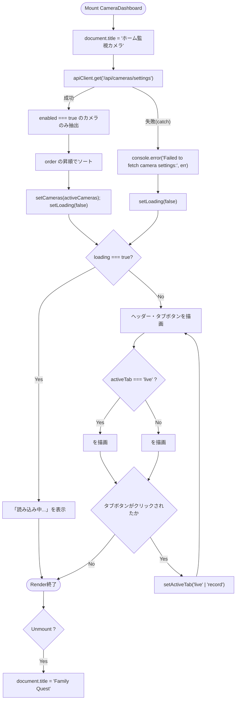
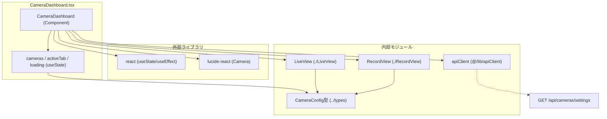

## 1. 解析メタ情報

| 項目 | 内容 |
| --- | --- |
| 対象ファイル | `family-quest/src/features/camera/components/CameraDashboard.tsx` |
| 言語 | React (TypeScript) |
| 解析対象 | 提供されたコードのみ |
| 推測・補完 | 一切なし |

## 2. ファイルの概要

* 監視カメラ機能全体のエントリーポイントとなる、独立した全画面レイアウトのダッシュボードコンポーネント。
* マウント時にカメラ設定一覧をAPIから取得し、有効なカメラのみを表示順にソートして保持する。
* 「ライブ映像」タブと「録画再生」タブを切り替え、それぞれ`LiveView`・`RecordView`コンポーネントへ描画を委譲する。
* マウント中はページタイトル（`document.title`）を「ホーム監視カメラ」に変更し、アンマウント時に「Family Quest」へ戻す。

## 3. 外部依存関係

### インポート一覧

| 名称 | 種類 | 用途 | 根拠 |
| --- | --- | --- | --- |
| `React`, `useState`, `useEffect` | ライブラリ (`react`) | コンポーネント定義、状態管理、マウント時副作用の実行 | 根拠: [`import React, { useState, useEffect } from 'react';`] (行番号: 1 / 抜粋: "import React, { useState, useEffect } from 'react';") |
| `LiveView` | 内部コンポーネント (`./LiveView`) | 「ライブ映像」タブ選択時に表示するコンポーネント | 根拠: [`import LiveView from './LiveView';`] (行番号: 2 / 抜粋: "import LiveView from './LiveView';") |
| `RecordView` | 内部コンポーネント (`./RecordView`) | 「録画再生」タブ選択時に表示するコンポーネント | 根拠: [`import RecordView from './RecordView';`] (行番号: 3 / 抜粋: "import RecordView from './RecordView';") |
| `CameraConfig` | 型定義 (`../types`) | カメラ設定情報（id, name, order, enabled）の型アノテーション | 根拠: [`import { CameraConfig } from '../types';`] (行番号: 4 / 抜粋: "import { CameraConfig } from '../types';") |
| `Camera` | コンポーネント (`lucide-react`) | ヘッダー部の見出しアイコン表示 | 根拠: [`import { Camera } from 'lucide-react';`] (行番号: 5 / 抜粋: "import { Camera } from 'lucide-react';") |
| `apiClient` | 内部モジュール (`@/lib/apiClient`) | カメラ設定一覧取得のためのHTTP通信 | 根拠: [`import { apiClient } from '@/lib/apiClient';`] (行番号: 6 / 抜粋: "import { apiClient } from '@/lib/apiClient';") |

### ブラックボックスとなる外部要素

| 名称 | 理由 | 根拠 |
| --- | --- | --- |
| `apiClient`の内部実装 | ベースURL、認証、共通エラー処理などの詳細仕様が本ファイルからは読み取れないため。 | 根拠: [`apiClient.get`] (行番号: 15 / 抜粋: "apiClient.get<CameraConfig[]>('/api/cameras/settings')") |
| `/api/cameras/settings` エンドポイント | カメラ設定一覧を返すバックエンドの実装・レスポンス仕様の詳細が本ファイルには含まれないため。 | 根拠: [`apiClient.get<CameraConfig[]>('/api/cameras/settings')`] (行番号: 15 / 抜粋: "apiClient.get<CameraConfig[]>('/api/cameras/settings')") |
| `Camera`アイコン（`lucide-react`）の内部実装 | アイコンのSVG実体やライブラリのバージョンが本ファイルからは確認できないため。 | 根拠: [`<Camera size={28} className="text-blue-500" />`] (行番号: 38 / 抜粋: "<Camera size={28} className=\"text-blue-500\" />") |
| `LiveView`・`RecordView`の内部実装 | 本ファイルからは`cameras`プロパティを渡して呼び出している箇所のみが確認でき、それぞれの内部ロジックは別ファイルにあるため。 | 根拠: [`<LiveView cameras={cameras} />`, `<RecordView cameras={cameras} />`] (行番号: 59, 61 / 抜粋: "<LiveView cameras={cameras} />") |

## 4. 主要要素の定義（関数 / エンドポイント / コンポーネント）

### `CameraDashboard`

* **役割**: カメラ監視機能の全体レイアウト（ヘッダー、タブ切り替え、コンテンツ表示）を構築し、マウント時にカメラ設定を取得するメインコンポーネント。
* 根拠: [`CameraDashboard`] (行番号: 8〜66 / 抜粋: "const CameraDashboard: React.FC = () => {")

* **引数/リクエスト（Props）**: なし
* 根拠: [コンポーネント定義] (行番号: 8 / 抜粋: "const CameraDashboard: React.FC = () => {")

* **戻り値/レスポンス**: JSX要素。`loading`が`true`の間は「読み込み中...」のみを表示する`
`を返し、それ以外はヘッダー・タブ切り替えボタン・（`activeTab`に応じた）`LiveView`または`RecordView`を含む全画面レイアウトの`
`を返す。
* 根拠: [早期return] (行番号: 29 / 抜粋: "if (loading) return 
読み込み中...
;")、[通常return] (行番号: 31〜65 / 抜粋: "return (\n        // 独立した全画面レイアウト\n        
")

* **副作用**: マウント時（`useEffect`の依存配列が空）に、`document.title`を「ホーム監視カメラ」へ変更し、`apiClient.get<CameraConfig[]>('/api/cameras/settings')`でカメラ設定一覧を取得する。取得成功時は`enabled`が`true`のカメラのみを`order`昇順でソートして`cameras`にセットし、`loading`を`false`にする。クリーンアップ関数として、アンマウント時に`document.title`を「Family Quest」へ戻す。
* 根拠: [`useEffect`] (行番号: 13〜27 / 抜粋: "useEffect(() => {\n        document.title = \"ホーム監視カメラ\";")、[cleanup] (行番号: 26 / 抜粋: "return () => { document.title = \"Family Quest\"; };")

* **エラーハンドリング**: `apiClient.get`が失敗した場合、`.catch`ブロックで`console.error("Failed to fetch camera settings:", err)`を出力し、`setLoading(false)`のみを行う（`cameras`は初期値の空配列`[]`のまま）。ユーザー向けのエラーメッセージ表示は実装されていない。
* 根拠: [`.catch`] (行番号: 22〜25 / 抜粋: "})\n            .catch(err => {\n                console.error(\"Failed to fetch camera settings:\", err);\n                setLoading(false);\n            });")

## 5. 処理フロー図

## 6. 依存関係図

## 7. 次のステップ（リバースエンジニアリングの提案）

| 優先度 | ファイル名(推測可) | 理由 | 根拠 |
| --- | --- | --- | --- |
| 高 | `family-quest/src/features/camera/components/LiveView.tsx` | 「ライブ映像」タブ選択時に描画される内容の詳細仕様を確認するため。 | 根拠: [`<LiveView cameras={cameras} />`] (行番号: 59 / 抜粋: "<LiveView cameras={cameras} />") |
| 高 | `family-quest/src/features/camera/components/RecordView.tsx` | 「録画再生」タブ選択時に描画される内容の詳細仕様を確認するため。 | 根拠: [`<RecordView cameras={cameras} />`] (行番号: 61 / 抜粋: "<RecordView cameras={cameras} />") |
| 中 | `family-quest/src/lib/apiClient.ts` | `/api/cameras/settings`呼び出しの認証・共通エラー処理仕様を確認するため。 | 根拠: [`apiClient.get`] (行番号: 15 / 抜粋: "apiClient.get<CameraConfig[]>('/api/cameras/settings')") |
| 中 | バックエンドの`/api/cameras/settings`エンドポイント実装 | カメラ設定（`enabled`, `order`等）がどのように永続化・管理されているかを確認するため。 | 根拠: [`apiClient.get<CameraConfig[]>('/api/cameras/settings')`] (行番号: 15) |
| 低 | 本コンポーネントのルーティング／マウント元ファイル | `CameraDashboard`が「独立した全画面レイアウト」とコメントされており、アプリ全体のどのルートからマウントされるかを確認するため。 | 根拠: [コメント] (行番号: 32 / 抜粋: "// 独立した全画面レイアウト") |

## 8. 保守上の注意点

* `apiClient.get`失敗時、`console.error`でログ出力されるのみで、ユーザーへのエラー表示（例:「カメラ設定の取得に失敗しました」等のメッセージ）は実装されていない。`loading`が`false`になった後、`cameras`が空配列のままとなり、`LiveView`/`RecordView`にはカメラが1台も表示されない状態になるが、その理由（通信失敗か、単に有効なカメラが0台か）をユーザーは区別できない。
* 根拠: [`.catch`] (行番号: 22〜25 / 抜粋: "console.error(\"Failed to fetch camera settings:\", err);")
* `useEffect`の依存配列が空（`[]`）であるため、カメラ設定の取得はマウント時の1回のみ行われる。他画面でカメラ設定が変更された場合でも、本コンポーネントが再マウントされない限り最新の設定は反映されない（再取得用のリフレッシュ操作も実装されていない）。
* 根拠: [`useEffect(() => {...}, [])`] (行番号: 13〜27)
* `document.title`をマウント時に変更し、アンマウント時に固定文字列`"Family Quest"`へ戻す実装になっているが、この値がアプリ全体のデフォルトタイトルと一致しているかどうかは本ファイルのみからは検証できない（他画面がマウントされた際に独自のタイトルへ再度変更する場合は問題ないが、想定外の順序でアンマウントされると不整合が生じる可能性がある）。
* 根拠: [`return () => { document.title = "Family Quest"; };`] (行番号: 26)
* カメラ一覧の並び替え・フィルタリング（`sort`/`filter`）はコンポーネント内にインラインで実装されており、`CameraConfig`の`order`が同値の場合の挙動（ソート安定性）は`Array.prototype.sort`のJavaScriptエンジンの実装依存となる。
* 根拠: [`.sort`] (行番号: 18 / 抜粋: "activeCameras.sort((a: CameraConfig, b: CameraConfig) => a.order - b.order);")

## 9. 不明事項一覧

| 項目 | 理由 | 必要なファイル |
| --- | --- | --- |
| `apiClient`の内部実装（認証・共通エラー処理） | 本ファイルからはメソッド呼び出しのみが確認でき、内部仕様は不明なため | `family-quest/src/lib/apiClient.ts` |
| `/api/cameras/settings`の実際のレスポンス仕様・カメラ設定の永続化方法 | バックエンド実装が本ファイルに含まれないため | バックエンドのカメラ設定API実装ファイル |
| 本コンポーネントがアプリ全体のどのルート／導線からマウントされるか | ルーティング定義ファイルが本ファイルに含まれないため | ルーティング設定ファイル（例: `App.tsx`, ルーター定義ファイル） |
| `document.title`のデフォルト値`"Family Quest"`が他画面と一致しているか | 他画面のタイトル設定ロジックが本ファイルに含まれないため | アプリ全体のエントリーポイント（例: `App.tsx`, `index.html`） |

## 10. 自己検証結果

* [x] 推測・外部ファイルの仕様を一切含んでいない
* [x] 全関数・全クラス・全コンポーネントを列挙した
* [x] 全てのインポート要素を列挙した
* [x] すべての仕様説明に「根拠（行番号・抜粋）」を明記した
* [x] 根拠漏れが0件である
* [x] Mermaid構文にエラーの原因となる記号（エスケープ漏れ）がない
* [x] 不明事項を漏れなく列挙した

完了
