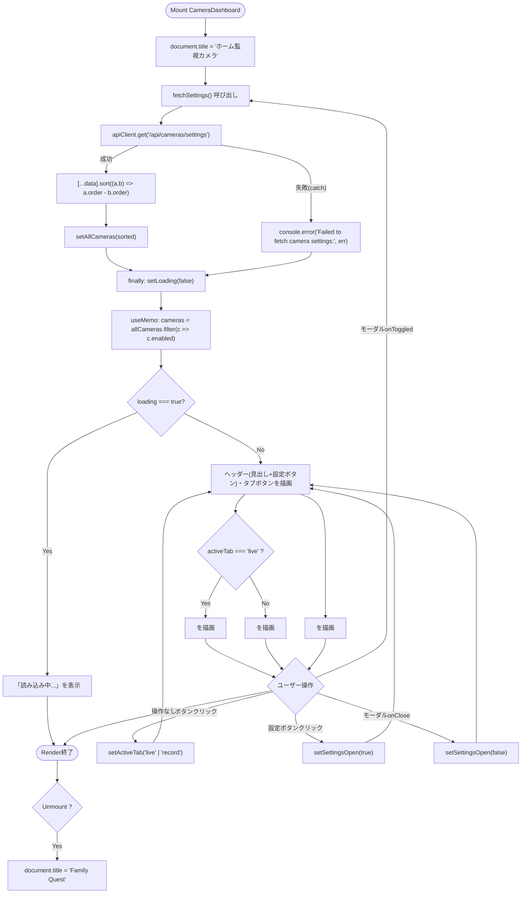
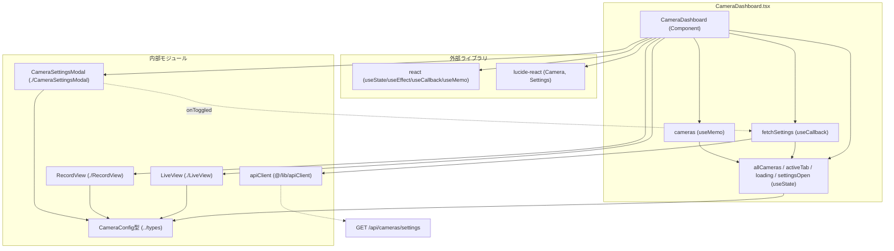

## 1. 解析メタ情報

| 項目 | 内容 |
| --- | --- |
| 対象ファイル | `family-quest/src/features/camera/components/CameraDashboard.tsx` |
| 言語 | React (TypeScript) |
| 解析対象 | 提供されたコードのみ |
| 推測・補完 | 一切なし |

## 関連ドキュメント

* [./LiveView.md](./LiveView.md) - 「ライブ映像」タブの実体コンポーネント
* [./RecordView.md](./RecordView.md) - 「録画再生」タブの実体コンポーネント
* [./CameraSettingsModal.md](./CameraSettingsModal.md) - ヘッダーの設定ボタンから開くカメラ有効/無効切り替えモーダルの実体コンポーネント
* [../types/index.md](../types/index.md) - `CameraConfig`型の定義元
* [../../../lib/apiClient.md](../../../lib/apiClient.md) - `/api/cameras/settings`呼び出しに使うAPIクライアントの実装元
* [../../../../main.md](../../../../main.md) - 本コンポーネントを`/camera`パスでルートとしてマウントする呼び出し元
* [../../../../../MY_HOME_SYSTEM/camera_router.md](../../../../../MY_HOME_SYSTEM/camera_router.md) - `/api/cameras/settings`エンドポイントのバックエンド実装

## 2. ファイルの概要

* 監視カメラ機能全体のエントリーポイントとなる、独立した全画面レイアウトのダッシュボードコンポーネント。
* マウント時にカメラ設定一覧をAPIから取得し、`order`昇順でソートして`allCameras`として保持する。表示に使う`cameras`は`allCameras`から`enabled`が`true`のものだけを`useMemo`で抽出した派生値である。
* 根拠: `fetchSettings`と`cameras`の定義 (行番号: 15〜23, 31 / 抜粋: "const fetchSettings = useCallback(() => {\n        return apiClient.get<CameraConfig[]>('/api/cameras/settings')", "const cameras = useMemo(() => allCameras.filter(c => c.enabled), [allCameras]);")
* 「ライブ映像」タブと「録画再生」タブを切り替え、それぞれ`LiveView`・`RecordView`コンポーネントへ描画を委譲する。
* マウント中はページタイトル（`document.title`）を「ホーム監視カメラ」に変更し、アンマウント時に「Family Quest」へ戻す。
* ヘッダーの歯車アイコンボタンから`CameraSettingsModal`を開き、`allCameras`（無効化されたカメラも含む全件）と、カメラの有効/無効切り替え成功時に呼ばれる`onToggled`コールバックとして`fetchSettings`自身を渡すことで、モーダル側の操作後に一覧を再取得する。
* 根拠: `CameraSettingsModal`の呼び出し (行番号: 76〜81 / 抜粋: "<CameraSettingsModal\n                isOpen={settingsOpen}\n                onClose={() => setSettingsOpen(false)}\n                cameras={allCameras}\n                onToggled={fetchSettings}\n            />")

## 3. 外部依存関係

### インポート一覧

| 名称 | 種類 | 用途 | 根拠 |
| --- | --- | --- | --- |
| `React`, `useState`, `useEffect`, `useCallback`, `useMemo` | ライブラリ (`react`) | コンポーネント定義、状態管理、マウント時副作用の実行、`fetchSettings`のメモ化、`cameras`派生値のメモ化 | 根拠: [`import React, { useState, useEffect, useCallback, useMemo } from 'react';`] (行番号: 1 / 抜粋: "import React, { useState, useEffect, useCallback, useMemo } from 'react';") |
| `LiveView` | 内部コンポーネント (`./LiveView`) | 「ライブ映像」タブ選択時に表示するコンポーネント | 根拠: [`import LiveView from './LiveView';`] (行番号: 2 / 抜粋: "import LiveView from './LiveView';") |
| `RecordView` | 内部コンポーネント (`./RecordView`) | 「録画再生」タブ選択時に表示するコンポーネント | 根拠: [`import RecordView from './RecordView';`] (行番号: 3 / 抜粋: "import RecordView from './RecordView';") |
| `CameraSettingsModal` | 内部コンポーネント (`./CameraSettingsModal`) | ヘッダーの設定ボタンから開くカメラ有効/無効切り替えモーダル | 根拠: [`import CameraSettingsModal from './CameraSettingsModal';`] (行番号: 4 / 抜粋: "import CameraSettingsModal from './CameraSettingsModal';") |
| `CameraConfig` | 型定義 (`../types`) | カメラ設定情報（id, name, order, enabled）の型アノテーション | 根拠: [`import { CameraConfig } from '../types';`] (行番号: 5 / 抜粋: "import { CameraConfig } from '../types';") |
| `Camera`, `Settings` | コンポーネント (`lucide-react`) | ヘッダー部の見出しアイコンおよび設定ボタンのアイコン表示 | 根拠: [`import { Camera, Settings } from 'lucide-react';`] (行番号: 6 / 抜粋: "import { Camera, Settings } from 'lucide-react';") |
| `apiClient` | 内部モジュール (`@/lib/apiClient`) | カメラ設定一覧取得のためのHTTP通信 | 根拠: [`import { apiClient } from '@/lib/apiClient';`] (行番号: 7 / 抜粋: "import { apiClient } from '@/lib/apiClient';") |

### ブラックボックスとなる外部要素

| 名称 | 理由 | 根拠 |
| --- | --- | --- |
| `apiClient`の内部実装 | ベースURL、認証、共通エラー処理などの詳細仕様が本ファイルからは読み取れないため。 | 根拠: [`apiClient.get`] (行番号: 16 / 抜粋: "return apiClient.get<CameraConfig[]>('/api/cameras/settings')") |
| `/api/cameras/settings` エンドポイント | カメラ設定一覧を返すバックエンドの実装・レスポンス仕様の詳細が本ファイルには含まれないため。 | 根拠: [`apiClient.get<CameraConfig[]>('/api/cameras/settings')`] (行番号: 16 / 抜粋: "return apiClient.get<CameraConfig[]>('/api/cameras/settings')") |
| `Camera`・`Settings`アイコン（`lucide-react`）の内部実装 | アイコンのSVG実体やライブラリのバージョンが本ファイルからは確認できないため。 | 根拠: [`<Camera size={28} className="text-blue-500" />`, `<Settings size={22} />`] (行番号: 42, 50 / 抜粋: "<Camera size={28} className=\"text-blue-500\" />") |
| `LiveView`・`RecordView`・`CameraSettingsModal`の内部実装 | 本ファイルからは`cameras`（または`allCameras`）とコールバックのプロパティを渡して呼び出している箇所のみが確認でき、それぞれの内部ロジックは別ファイルにあるため。 | 根拠: [`<LiveView cameras={cameras} />`, `<RecordView cameras={cameras} />`, `<CameraSettingsModal .../>`] (行番号: 70, 72, 76〜81 / 抜粋: "<LiveView cameras={cameras} />") |

## 4. 主要要素の定義（関数 / エンドポイント / コンポーネント）

### `CameraDashboard`

* **役割**: カメラ監視機能の全体レイアウト（ヘッダー、設定ボタン、タブ切り替え、コンテンツ表示、設定モーダル）を構築し、マウント時にカメラ設定を取得するメインコンポーネント。
* 根拠: [`CameraDashboard`] (行番号: 9〜84 / 抜粋: "const CameraDashboard: React.FC = () => {")

* **引数/リクエスト（Props）**: なし
* 根拠: [コンポーネント定義] (行番号: 9 / 抜粋: "const CameraDashboard: React.FC = () => {")

* **戻り値/レスポンス**: JSX要素。`loading`が`true`の間は「読み込み中...」のみを表示する`
`を返し、それ以外はヘッダー（見出しと設定ボタン）・タブ切り替えボタン・（`activeTab`に応じた）`LiveView`または`RecordView`・`CameraSettingsModal`を含む全画面レイアウトの`
`を返す。
* 根拠: [早期return] (行番号: 33 / 抜粋: "if (loading) return 
読み込み中...
;")、[通常return] (行番号: 35〜83 / 抜粋: "return (\n        // 独立した全画面レイアウト\n        
")

* **副作用**: マウント時（`useEffect`の依存配列が`[fetchSettings]`）に、`document.title`を「ホーム監視カメラ」へ変更し、`fetchSettings()`を呼び出してカメラ設定一覧を取得したのち、`.finally`で`loading`を`false`にする。クリーンアップ関数として、アンマウント時に`document.title`を「Family Quest」へ戻す。設定ボタン（`aria-label="カメラ設定"`）のクリックで`setSettingsOpen(true)`し、`CameraSettingsModal`をマウント（`isOpen`で表示制御）する。
* 根拠: [`useEffect`] (行番号: 25〜29 / 抜粋: "useEffect(() => {\n        document.title = \"ホーム監視カメラ\";\n        fetchSettings().finally(() => setLoading(false));")、[cleanup] (行番号: 28 / 抜粋: "return () => { document.title = \"Family Quest\"; };")、[設定ボタン] (行番号: 45〜51 / 抜粋: "<button\n                        aria-label=\"カメラ設定\"\n                        className=\"p-2 rounded-full text-gray-300 hover:bg-gray-800 hover:text-white transition-colors\"\n                        onClick={() => setSettingsOpen(true)}\n                    >")

* **エラーハンドリング**: `fetchSettings`内部の`apiClient.get`が失敗した場合の処理は`fetchSettings`自体に委譲されており（後述）、本コンポーネントの`useEffect`側では`.finally(() => setLoading(false))`により失敗時も含め必ず`loading`が`false`になるのみで、追加のエラーハンドリングは行っていない。
* 根拠: [`.finally`] (行番号: 27 / 抜粋: "fetchSettings().finally(() => setLoading(false));")

### `fetchSettings` (`useCallback`)

* **役割**: `/api/cameras/settings`からカメラ設定一覧を取得し、`order`昇順でソートして`allCameras`にセットする。マウント時の初回取得と、`CameraSettingsModal`での有効/無効切り替え成功後の再取得（`onToggled`経由）の両方から呼ばれる、`useCallback`でメモ化された関数。
* 根拠: (行番号: 15〜23 / 抜粋: "const fetchSettings = useCallback(() => {\n        return apiClient.get<CameraConfig[]>('/api/cameras/settings')\n            .then(data => {\n                setAllCameras([...data].sort((a, b) => a.order - b.order));\n            })")

* **引数/リクエスト**: なし
* 根拠: (行番号: 15 / 抜粋: "const fetchSettings = useCallback(() => {")

* **戻り値/レスポンス**: `Promise<void>`（`apiClient.get`が返す`Promise`をそのまま`return`しており、呼び出し元（`useEffect`や`onToggled`）は`.finally`等でチェーン可能）
* 根拠: (行番号: 16 / 抜粋: "return apiClient.get<CameraConfig[]>('/api/cameras/settings')")

* **副作用**: `apiClient.get<CameraConfig[]>('/api/cameras/settings')`によるHTTP GETリクエスト。成功時は取得データを`[...data]`でコピーしたうえで`(a, b) => a.order - b.order`によりソートし、`setAllCameras`で状態を更新する。
* 根拠: (行番号: 16〜19 / 抜粋: "return apiClient.get<CameraConfig[]>('/api/cameras/settings')\n            .then(data => {\n                setAllCameras([...data].sort((a, b) => a.order - b.order));\n            })")

* **エラーハンドリング**: `.catch`ブロックで`console.error("Failed to fetch camera settings:", err)`を出力するのみで、`setAllCameras`は呼ばれない（失敗時は直前の`allCameras`の状態が維持される）。ユーザー向けのエラーメッセージ表示は実装されていない。
* 根拠: (行番号: 20〜22 / 抜粋: "})\n            .catch(err => {\n                console.error(\"Failed to fetch camera settings:\", err);\n            });")

### `cameras` (`useMemo`)

* **役割**: `allCameras`のうち`enabled`が`true`のものだけを抽出した、`LiveView`/`RecordView`へ渡す表示用カメラ一覧。`allCameras`が変化したときのみ再計算される。
* 根拠: (行番号: 31 / 抜粋: "const cameras = useMemo(() => allCameras.filter(c => c.enabled), [allCameras]);")

* **引数/リクエスト**: `allCameras`（クロージャ経由、`useMemo`の依存配列）
* **戻り値/レスポンス**: `CameraConfig[]`（`enabled === true`の要素のみ、順序は`allCameras`のソート順を維持）
* **副作用**: なし
* **エラーハンドリング**: なし
* 根拠: (行番号: 31 / 抜粋: "const cameras = useMemo(() => allCameras.filter(c => c.enabled), [allCameras]);")

## 5. 処理フロー図

## 6. 依存関係図

## 7. 次のステップ（リバースエンジニアリングの提案）

| 優先度 | ファイル名(推測可) | 理由 | 根拠 |
| --- | --- | --- | --- |
| 高 | `family-quest/src/features/camera/components/CameraSettingsModal.tsx` | 新規追加された設定モーダルが`allCameras`をどう表示し、有効/無効切り替えをどのAPIで永続化しているかを確認するため。 | 根拠: [`<CameraSettingsModal .../>`] (行番号: 76〜81 / 抜粋: "<CameraSettingsModal\n                isOpen={settingsOpen}") |
| 高 | `family-quest/src/features/camera/components/LiveView.tsx` | 「ライブ映像」タブ選択時に描画される内容の詳細仕様を確認するため。 | 根拠: [`<LiveView cameras={cameras} />`] (行番号: 70 / 抜粋: "<LiveView cameras={cameras} />") |
| 高 | `family-quest/src/features/camera/components/RecordView.tsx` | 「録画再生」タブ選択時に描画される内容の詳細仕様を確認するため。 | 根拠: [`<RecordView cameras={cameras} />`] (行番号: 72 / 抜粋: "<RecordView cameras={cameras} />") |
| 中 | `family-quest/src/lib/apiClient.ts` | `/api/cameras/settings`呼び出しの認証・共通エラー処理仕様を確認するため。 | 根拠: [`apiClient.get`] (行番号: 16 / 抜粋: "return apiClient.get<CameraConfig[]>('/api/cameras/settings')") |
| 中 | バックエンドの`/api/cameras/settings`エンドポイント実装 | カメラ設定（`enabled`, `order`等）がどのように永続化・管理されているかを確認するため。 | 根拠: [`apiClient.get<CameraConfig[]>('/api/cameras/settings')`] (行番号: 16) |
| 低 | 本コンポーネントのルーティング／マウント元ファイル | `CameraDashboard`が「独立した全画面レイアウト」とコメントされており、アプリ全体のどのルートからマウントされるかを確認するため。 | 根拠: [コメント] (行番号: 36 / 抜粋: "// 独立した全画面レイアウト") |

## 8. 保守上の注意点

* `apiClient.get`失敗時、`console.error`でログ出力されるのみで、ユーザーへのエラー表示（例:「カメラ設定の取得に失敗しました」等のメッセージ）は実装されていない。初回マウント時に失敗した場合は`allCameras`が初期値の空配列`[]`のままとなり、`cameras`も空配列となるため`LiveView`/`RecordView`にはカメラが1台も表示されない状態になるが、その理由（通信失敗か、単に有効なカメラが0台か）をユーザーは区別できない。
* 根拠: [`.catch`] (行番号: 20〜22 / 抜粋: "console.error(\"Failed to fetch camera settings:\", err);")
* `fetchSettings`は`useCallback(..., [])`で依存配列が空のためマウント時に一度だけ生成され、それを依存配列に持つ`useEffect(() => {...}, [fetchSettings])`も実質マウント時の1回のみ実行される。ただし本バージョンでは`CameraSettingsModal`の`onToggled`にも同じ`fetchSettings`が渡されており、モーダルでの有効/無効切り替え成功時には`allCameras`が再取得される（以前バージョンには存在しなかった再取得経路）。
* 根拠: [`useEffect`] (行番号: 25〜29 / 抜粋: "useEffect(() => {\n        document.title = \"ホーム監視カメラ\";\n        fetchSettings().finally(() => setLoading(false));\n    }, [fetchSettings]);")、[`onToggled`] (行番号: 80 / 抜粋: "onToggled={fetchSettings}")
* `document.title`をマウント時に変更し、アンマウント時に固定文字列`"Family Quest"`へ戻す実装になっているが、この値がアプリ全体のデフォルトタイトルと一致しているかどうかは本ファイルのみからは検証できない（他画面がマウントされた際に独自のタイトルへ再度変更する場合は問題ないが、想定外の順序でアンマウントされると不整合が生じる可能性がある）。
* 根拠: [`return () => { document.title = "Family Quest"; };`] (行番号: 28)
* カメラ一覧のソートは`fetchSettings`内で`allCameras`に対して行われ（`[...data].sort((a, b) => a.order - b.order)`）、表示用の`cameras`は`useMemo`で`allCameras.filter(c => c.enabled)`するのみでソートし直さない。`CameraConfig`の`order`が同値の場合の挙動（ソート安定性）は`Array.prototype.sort`のJavaScriptエンジンの実装依存となる。
* 根拠: [`.sort`] (行番号: 18 / 抜粋: "setAllCameras([...data].sort((a, b) => a.order - b.order));")、[`.filter`] (行番号: 31 / 抜粋: "const cameras = useMemo(() => allCameras.filter(c => c.enabled), [allCameras]);")
* 有効/無効の切り替えUI自体は本ファイルには存在せず、`CameraSettingsModal`に`allCameras`（無効化されたカメラも含む全件）と`onToggled`（切り替え成功時に呼ばれ`fetchSettings`を再実行する）を渡すのみである。切り替えが実際にどのAPIを叩いて永続化されるかは`CameraSettingsModal`側の実装に依存し、本ファイルからは確認できない。
* 根拠: [`CameraSettingsModal`への props 渡し] (行番号: 76〜81 / 抜粋: "<CameraSettingsModal\n                isOpen={settingsOpen}\n                onClose={() => setSettingsOpen(false)}\n                cameras={allCameras}\n                onToggled={fetchSettings}\n            />")

## 9. 不明事項一覧

| 項目 | 理由 | 必要なファイル |
| --- | --- | --- |
| `apiClient`の内部実装（認証・共通エラー処理） | 本ファイルからはメソッド呼び出しのみが確認でき、内部仕様は不明なため | `family-quest/src/lib/apiClient.ts` |
| `/api/cameras/settings`の実際のレスポンス仕様・カメラ設定の永続化方法 | バックエンド実装が本ファイルに含まれないため | バックエンドのカメラ設定API実装ファイル |
| 本コンポーネントがアプリ全体のどのルート／導線からマウントされるか | ルーティング定義ファイルが本ファイルに含まれないため | ルーティング設定ファイル（例: `App.tsx`, ルーター定義ファイル） |
| `document.title`のデフォルト値`"Family Quest"`が他画面と一致しているか | 他画面のタイトル設定ロジックが本ファイルに含まれないため | アプリ全体のエントリーポイント（例: `App.tsx`, `index.html`） |
| `CameraSettingsModal`が有効/無効切り替えをどのAPIエンドポイントで永続化しているか | 本ファイルは`allCameras`と`onToggled={fetchSettings}`を渡すのみで、モーダル内部の通信処理は本ファイルには含まれないため | `family-quest/src/features/camera/components/CameraSettingsModal.tsx` |

## 相互参照による補足情報

| 元の不明事項 | 判明した内容 | 参照元ドキュメント |
| --- | --- | --- |
| `apiClient`の内部実装（認証・共通エラー処理） | `family-quest/src/lib/apiClient.ts`を直接確認した。`ApiClient`クラス(32〜118行目)はコンストラクタで`baseUrl`(`getBaseUrl()`が`import.meta.env.VITE_API_URL`優先、なければ`window.location.origin`を使用、6〜13行目)を保持するのみで、認証トークン付与等の処理は行っていない。`get<T>(endpoint)`(39〜41行目)は内部の`_request<T>(endpoint, options)`(77〜95行目)を呼び出す。`_request`は`fetch(url, options)`(82行目)を実行し、`response.ok`が偽の場合(83〜89行目)は`errorData.detail`(文字列の場合)またはフォールバックとして`` `API Error: ${response.status}` ``をメッセージとする`Error`を`throw`する。`fetch`自体が失敗した場合も含め`catch`節(91〜94行目)で`console.error`によるログ出力後に`error`を再`throw`する。共通ヘッダーへの認証トークン付与処理は本ファイル中には存在しない。 | 直接ソース確認: `family-quest/src/lib/apiClient.ts:6-13, 32-95` |
| `/api/cameras/settings`の実際のレスポンス仕様・カメラ設定の永続化方法 | `MY_HOME_SYSTEM/routers/camera_router.py`を直接確認した。`GET /settings`(28〜40行目、関数`get_camera_settings`)は`config.CAMERAS`（`devices.json`からロードされる）を`enumerate`でループし(33行目)、各カメラについて`id`・`name`・`order`(配列インデックス+1、37行目コメント「配列の順序を表示順とする」)・`enabled`(38行目、常に`True`固定値)を含む辞書のリストを構築して返す(40行目)。カメラの有効/無効を切り替える処理やこのエンドポイント自体への書き込み系操作は本ファイル中に存在せず、設定の永続化は`config.CAMERAS`の元データである`devices.json`側（本エンドポイントの外）で行われる構造であることを確認した。 | 直接ソース確認: `MY_HOME_SYSTEM/routers/camera_router.py:28-40` |
| 本コンポーネントがアプリ全体のどのルート／導線からマウントされるか | `family-quest/src/main.tsx`を直接確認した。12行目で`const CameraDashboard = lazy(() => import('./features/camera/components/CameraDashboard'))`として動的インポートし、10〜11行目のコメントで「CameraDashboard(hls.js含む)は`/camera`専用でFamily Quest本体とは同時に使われないため、動的importで別チャンクに分離」する意図が明記されている。22行目`const isCameraView = window.location.pathname.includes('/camera');`でURLパスを判定し、28〜31行目で`isCameraView`が真の場合は`<Suspense fallback={null}><CameraDashboard /></Suspense>`のみをレンダリングする（32〜38行目の`else`節にある`SettingsProvider`/`ToastProvider`/`App`は経由しない）。両分岐とも共通の`QueryClientProvider`(26〜39行目)配下ではある。 | 直接ソース確認: `family-quest/src/main.tsx:10-38` |

## 10. 自己検証結果

* [x] 推測・外部ファイルの仕様を一切含んでいない
* [x] 全関数・全クラス・全コンポーネントを列挙した
* [x] 全てのインポート要素を列挙した
* [x] すべての仕様説明に「根拠（行番号・抜粋）」を明記した
* [x] 根拠漏れが0件である
* [x] Mermaid構文にエラーの原因となる記号（エスケープ漏れ）がない
* [x] 不明事項を漏れなく列挙した

完了
