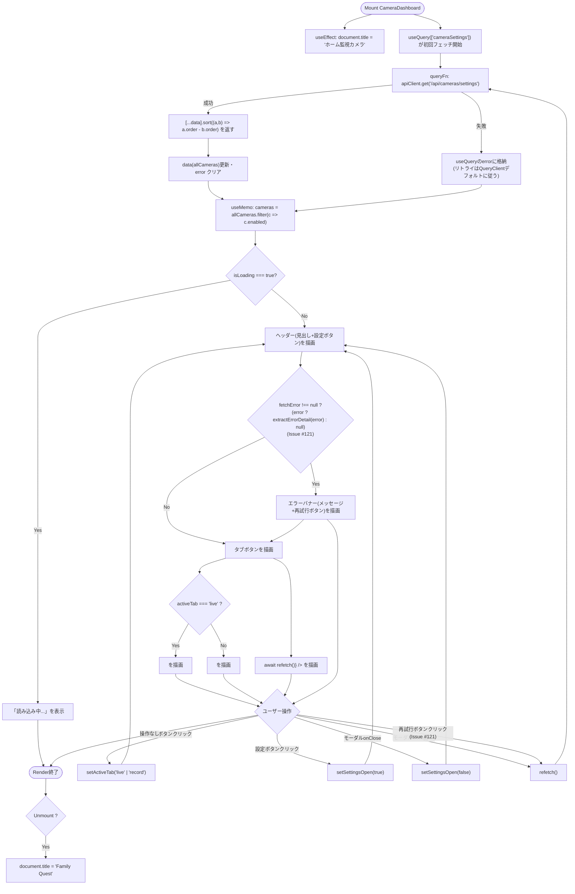
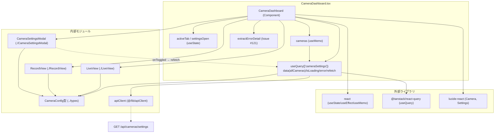

## 1. 解析メタ情報

| 項目 | 内容 |
| --- | --- |
| 対象ファイル | `family-quest/src/features/camera/components/CameraDashboard.tsx` |
| 言語 | React (TypeScript) |
| 解析対象 | 提供されたコードのみ |
| 推測・補完 | 一切なし |
| 解析基準コミット | `6007292` |

## 関連ドキュメント

* [./LiveView.md](./LiveView.md) - 「ライブ映像」タブの実体コンポーネント
* [./RecordView.md](./RecordView.md) - 「録画再生」タブの実体コンポーネント
* [./CameraSettingsModal.md](./CameraSettingsModal.md) - ヘッダーの設定ボタンから開くカメラ有効/無効切り替えモーダルの実体コンポーネント
* [../types/index.md](../types/index.md) - `CameraConfig`型の定義元
* [../../../lib/apiClient.md](../../../lib/apiClient.md) - `/api/cameras/settings`呼び出しに使うAPIクライアントの実装元
* [../../../lib/queryClient.md](../../../lib/queryClient.md) - `useQuery`が従うキャッシュ方針(staleTime 60秒・retry 1)のデフォルト定義元
* [../../../hooks/useGameData.md](../../../hooks/useGameData.md) - 本コンポーネントが従うReact Queryデータ取得規約の代表例
* [../../../../main.md](../../../../main.md) - 本コンポーネントを`/camera`パスでルートとしてマウントする呼び出し元
* [../../../../../MY_HOME_SYSTEM/camera_router.md](../../../../../MY_HOME_SYSTEM/camera_router.md) - `/api/cameras/settings`エンドポイントのバックエンド実装

## 2. ファイルの概要

* 監視カメラ機能全体のエントリーポイントとなる、独立した全画面レイアウトのダッシュボードコンポーネント。
* **Issue #326 (M12) でReact Query化**: 以前は生の`useEffect`+ローカルステート(`allCameras`/`loading`/`fetchError`)でデータ取得しており、他画面が従っているReact Query規約(`useGameData.ts`方式)から外れた最後の1箇所だった。現在は`useQuery`(queryKey: `['cameraSettings']`)でカメラ設定一覧を取得し、`order`昇順でのソートは`queryFn`内で行う。表示に使う`cameras`は取得結果`allCameras`から`enabled`が`true`のものだけを`useMemo`で抽出した派生値である。
* 根拠: `useQuery`と`cameras`の定義 (行番号: 30〜41, 48 / 抜粋: "} = useQuery<CameraConfig[]>({\n        queryKey: ['cameraSettings'],", "const cameras = useMemo(() => allCameras.filter(c => c.enabled), [allCameras]);")
* 「ライブ映像」タブと「録画再生」タブを切り替え、それぞれ`LiveView`・`RecordView`コンポーネントへ描画を委譲する。
* マウント中はページタイトル（`document.title`）を「ホーム監視カメラ」に変更し、アンマウント時に「Family Quest」へ戻す。
* ヘッダーの歯車アイコンボタンから`CameraSettingsModal`を開き、`allCameras`（無効化されたカメラも含む全件）と、カメラの有効/無効切り替え成功時に呼ばれる`onToggled`コールバックとして`refetch`をawaitするラッパー関数を渡すことで、モーダル側の操作後に一覧を再取得する。
* 根拠: `CameraSettingsModal`の呼び出し (行番号: 106〜111 / 抜粋: "<CameraSettingsModal\n                isOpen={settingsOpen}\n                onClose={() => setSettingsOpen(false)}\n                cameras={allCameras}\n                onToggled={async () => { await refetch(); }}\n            />")
* **Issue #121で修正**: 設定取得が失敗した場合、以前は`console.error`のみでユーザーへの通知が一切なく、ライブタブが「無言で」空のグリッドを表示していた。`CameraDashboard`は`main.tsx`で`ToastProvider`配下ではなく独立してマウントされる（`/camera`はFamily Quest本体と同時に使われない専用ビューア）ため、他画面のような`useToast()`は使えない。代わりに取得失敗時は画面上部に再試行ボタン付きのエラーバナーを表示する。React Query化後は、エラー源が`useQuery`の`error`戻り値になった（`fetchError`は`error ? extractErrorDetail(error) : null`の派生値）。
* 根拠: `fetchError`派生値と表示バナー (行番号: 49, 72〜82 / 抜粋: "const fetchError = error ? extractErrorDetail(error) : null;", "{fetchError && (\n                    
")

## 3. 外部依存関係

### インポート一覧

| 名称 | 種類 | 用途 | 根拠 |
| --- | --- | --- | --- |
| `React`, `useState`, `useEffect`, `useMemo` | ライブラリ (`react`) | コンポーネント定義、UI状態管理(`activeTab`/`settingsOpen`)、ページタイトルの副作用、`cameras`派生値のメモ化 | 根拠: [`import React, { useState, useEffect, useMemo } from 'react';`] (行番号: 1 / 抜粋: "import React, { useState, useEffect, useMemo } from 'react';") |
| `useQuery` | ライブラリ (`@tanstack/react-query`) | カメラ設定一覧のフェッチ・キャッシュ・エラー・ローディング状態の管理(Issue #326で導入) | 根拠: [`import { useQuery } from '@tanstack/react-query';`] (行番号: 2 / 抜粋: "import { useQuery } from '@tanstack/react-query';") |
| `LiveView` | 内部コンポーネント (`./LiveView`) | 「ライブ映像」タブ選択時に表示するコンポーネント | 根拠: [`import LiveView from './LiveView';`] (行番号: 3 / 抜粋: "import LiveView from './LiveView';") |
| `RecordView` | 内部コンポーネント (`./RecordView`) | 「録画再生」タブ選択時に表示するコンポーネント | 根拠: [`import RecordView from './RecordView';`] (行番号: 4 / 抜粋: "import RecordView from './RecordView';") |
| `CameraSettingsModal` | 内部コンポーネント (`./CameraSettingsModal`) | ヘッダーの設定ボタンから開くカメラ有効/無効切り替えモーダル | 根拠: [`import CameraSettingsModal from './CameraSettingsModal';`] (行番号: 5 / 抜粋: "import CameraSettingsModal from './CameraSettingsModal';") |
| `CameraConfig` | 型定義 (`../types`) | カメラ設定情報（id, name, order, enabled）の型アノテーション | 根拠: [`import { CameraConfig } from '../types';`] (行番号: 6 / 抜粋: "import { CameraConfig } from '../types';") |
| `Camera`, `Settings` | コンポーネント (`lucide-react`) | ヘッダー部の見出しアイコンおよび設定ボタンのアイコン表示 | 根拠: [`import { Camera, Settings } from 'lucide-react';`] (行番号: 7 / 抜粋: "import { Camera, Settings } from 'lucide-react';") |
| `apiClient` | 内部モジュール (`@/lib/apiClient`) | カメラ設定一覧取得のためのHTTP通信(`queryFn`内から使用) | 根拠: [`import { apiClient } from '@/lib/apiClient';`] (行番号: 8 / 抜粋: "import { apiClient } from '@/lib/apiClient';") |

### ブラックボックスとなる外部要素

| 名称 | 理由 | 根拠 |
| --- | --- | --- |
| `apiClient`の内部実装 | ベースURL、認証、共通エラー処理などの詳細仕様が本ファイルからは読み取れないため。 | 根拠: [`apiClient.get`] (行番号: 38 / 抜粋: "const data = await apiClient.get<CameraConfig[]>('/api/cameras/settings');") |
| `useQuery`のキャッシュ・リトライ挙動 | `staleTime`/`retry`等のオプションを本ファイルでは指定しておらず、`QueryClient`のデフォルト設定(コメント上は「staleTime 60秒・retry 1」)に従うが、その実体は`queryClient.ts`側にあり本ファイルからは確認できないため。 | 根拠: [`useQuery`呼び出しとコメント] (行番号: 26〜27, 35〜41 / 抜粋: "// キャッシュ方針はqueryClient.tsのデフォルト(staleTime 60秒・retry 1)に従う。") |
| `/api/cameras/settings` エンドポイント | カメラ設定一覧を返すバックエンドの実装・レスポンス仕様の詳細が本ファイルには含まれないため。 | 根拠: [`apiClient.get<CameraConfig[]>('/api/cameras/settings')`] (行番号: 38 / 抜粋: "const data = await apiClient.get<CameraConfig[]>('/api/cameras/settings');") |
| `Camera`・`Settings`アイコン（`lucide-react`）の内部実装 | アイコンのSVG実体やライブラリのバージョンが本ファイルからは確認できないため。 | 根拠: [`<Camera size={28} className="text-blue-500" />`, `<Settings size={22} />`] (行番号: 60, 68 / 抜粋: "<Camera size={28} className=\"text-blue-500\" />") |
| `LiveView`・`RecordView`・`CameraSettingsModal`の内部実装 | 本ファイルからは`cameras`（または`allCameras`）とコールバックのプロパティを渡して呼び出している箇所のみが確認でき、それぞれの内部ロジックは別ファイルにあるため。 | 根拠: [`<LiveView cameras={cameras} />`, `<RecordView cameras={cameras} />`, `<CameraSettingsModal .../>`] (行番号: 100, 102, 106〜111 / 抜粋: "<LiveView cameras={cameras} />") |

## 4. 主要要素の定義（関数 / エンドポイント / コンポーネント）

### `CameraDashboard`

* **役割**: カメラ監視機能の全体レイアウト（ヘッダー、設定ボタン、エラーバナー、タブ切り替え、コンテンツ表示、設定モーダル）を構築し、`useQuery`でカメラ設定を取得するメインコンポーネント。
* 根拠: [`CameraDashboard`] (行番号: 19〜114 / 抜粋: "const CameraDashboard: React.FC = () => {")

* **引数/リクエスト（Props）**: なし
* 根拠: [コンポーネント定義] (行番号: 19 / 抜粋: "const CameraDashboard: React.FC = () => {")

* **戻り値/レスポンス**: JSX要素。`isLoading`（`useQuery`の初回ロード中フラグ）が`true`の間は「読み込み中...」のみを表示する`
`を返し、それ以外はヘッダー（見出しと設定ボタン）・（`fetchError`が真の場合のみ）エラーバナー・タブ切り替えボタン・（`activeTab`に応じた）`LiveView`または`RecordView`・`CameraSettingsModal`を含む全画面レイアウトの`
`を返す。
* 根拠: [早期return] (行番号: 51 / 抜粋: "if (isLoading) return 
読み込み中...
;")、[通常return] (行番号: 53〜113 / 抜粋: "return (\n        // 独立した全画面レイアウト\n        
")

* **副作用**: データ取得は`useQuery`が管理する（マウント時の初回フェッチ、キャッシュ、`refetch`）。`useEffect`（依存配列`[]`、マウント時1回）では`document.title`を「ホーム監視カメラ」へ変更し、クリーンアップ関数でアンマウント時に「Family Quest」へ戻すのみとなった（データ取得の副作用は`useEffect`から分離された）。設定ボタン（`aria-label="カメラ設定"`）のクリックで`setSettingsOpen(true)`し、`CameraSettingsModal`をマウント（`isOpen`で表示制御）する。エラーバナー内の「再試行」ボタンのクリックで`refetch()`を実行する（**Issue #121で追加、Issue #326で`refetch`に置換**）。
* 根拠: [`useQuery`] (行番号: 30〜41 / 抜粋: "} = useQuery<CameraConfig[]>({\n        queryKey: ['cameraSettings'],")、[`useEffect`] (行番号: 43〜46 / 抜粋: "useEffect(() => {\n        document.title = \"ホーム監視カメラ\";\n        return () => { document.title = \"Family Quest\"; };\n    }, []);")、[設定ボタン] (行番号: 63〜69 / 抜粋: "aria-label=\"カメラ設定\"")、[再試行ボタン] (行番号: 75〜80 / 抜粋: "onClick={() => refetch()}")

* **エラーハンドリング**: `queryFn`内の`apiClient.get`が失敗した場合のリトライ・エラー保持は`useQuery`（`QueryClient`のデフォルト設定）に委譲されている。`error`が真の場合、派生値`fetchError`（`extractErrorDetail(error)`）が`{fetchError && (...)}`の条件付きレンダリングでヘッダー直下にエラーバナー（メッセージ＋再試行ボタン）として表示される（**Issue #121で追加**）。初回フェッチ失敗後は`isLoading`が偽になるため（React Queryはエラー確定でローディングを終える）、エラーバナー付きの通常レイアウトが表示される。キャッシュ済みデータがある状態での再フェッチ失敗時は、`data`（`allCameras`）が保持されたままエラーバナーが併記される。
* 根拠: [`fetchError`派生値] (行番号: 49 / 抜粋: "const fetchError = error ? extractErrorDetail(error) : null;")、[エラーバナー] (行番号: 72〜82 / 抜粋: "{fetchError && (")、[キャッシュ保持コメント] (行番号: 28〜29 / 抜粋: "// 取得失敗時もキャッシュ済みデータは保持されるため、Issue #121のエラーバナー\n    // (再試行つき)と既存表示の共存という従来挙動は変わらない。")

### `useQuery(['cameraSettings'])` (カメラ設定クエリ、**Issue #326で導入**)

* **役割**: `/api/cameras/settings`からカメラ設定一覧を取得し、`order`昇順でソートして返すクエリ。以前の`fetchSettings`(`useCallback`)+`allCameras`/`loading`/`fetchError`ローカルステートを置き換えたもので、取得結果は`data`（デフォルト`[]`で`allCameras`に分割代入）、初回ロード中は`isLoading`、失敗時は`error`として参照する。`CameraSettingsModal`の`onToggled`とエラーバナーの「再試行」ボタンからは`refetch`で再取得する。
* 根拠: (行番号: 30〜41 / 抜粋: "const {\n        data: allCameras = [],\n        isLoading,\n        error,\n        refetch,\n    } = useQuery<CameraConfig[]>({\n        queryKey: ['cameraSettings'],")

* **引数/リクエスト**: `queryKey: ['cameraSettings']`、`queryFn`（引数なしのasync関数）。`staleTime`/`refetchInterval`等は指定せず、`QueryClient`のデフォルトに従う（カメラ設定は設定モーダル経由でしか変わらないためポーリング不要、というコメントが付されている）。
* 根拠: (行番号: 26〜27, 36〜40 / 抜粋: "// カメラ設定は設定モーダル経由でしか変わらないためポーリングは不要で、", "queryKey: ['cameraSettings'],\n        queryFn: async () => {")

* **戻り値/レスポンス**: `queryFn`は`CameraConfig[]`（`[...data]`でコピーし`(a, b) => a.order - b.order`でソート済み）を返す。`useQuery`の戻り値からは`data`(`allCameras`)・`isLoading`・`error`・`refetch`の4つを分割代入で使用する。
* 根拠: (行番号: 31〜34, 38〜39 / 抜粋: "const data = await apiClient.get<CameraConfig[]>('/api/cameras/settings');\n            return [...data].sort((a, b) => a.order - b.order);")

* **副作用**: `apiClient.get<CameraConfig[]>('/api/cameras/settings')`によるHTTP GETリクエスト（実行タイミング・キャッシュはReact Queryが管理）。
* 根拠: (行番号: 38 / 抜粋: "const data = await apiClient.get<CameraConfig[]>('/api/cameras/settings');")

* **エラーハンドリング**: `queryFn`自身はtry/catchを持たず、例外はそのまま`useQuery`の`error`に格納される。エラー表示への変換は`CameraDashboard`本体の`fetchError`派生値（`extractErrorDetail`）が担う。
* 根拠: (行番号: 37〜40, 49 / 抜粋: "queryFn: async () => {\n            const data = await apiClient.get<CameraConfig[]>('/api/cameras/settings');", "const fetchError = error ? extractErrorDetail(error) : null;")

### `extractErrorDetail` (`@/lib/errorDetail`からのインポート、Issue #121で追加、Issue #412 品質で`InventoryList.tsx`と重複していたため`lib/errorDetail.ts`へ移動)

* **役割**: `apiClient`側でスローされた`Error`から、バックエンドが返す`{"detail": "..."}`のメッセージ内容（`Error.message`）を取り出す。`error`が`Error`インスタンスかつ`message`が真値の場合のみそれを使い、それ以外は固定文言`'カメラ設定の取得に失敗しました'`にフォールバックする。React Query化後は`useQuery`の`error`戻り値から`fetchError`派生値を作る際に呼ばれる。`InventoryList.tsx`等の同名ヘルパーと同じパターン。
* 根拠: (行番号: 10〜17, 49 / 抜粋: "// ★バグ修正(Issue #121): apiClient側でスローされるErrorのmessageには、バックエンドが\n// 返す{\"detail\": \"...\"}の内容が入っている(apiClient.ts参照)。", "const extractErrorDetail = (error: unknown): string => {\n    return error instanceof Error && error.message ? error.message : 'カメラ設定の取得に失敗しました';\n};")

* **引数/リクエスト**: `error: unknown`
* **戻り値/レスポンス**: `string`
* **副作用**: なし
* **エラーハンドリング**: なし（自身がエラー内容を安全な文字列に変換するためのヘルパー）
* 根拠: (行番号: 15〜17 / 抜粋: "const extractErrorDetail = (error: unknown): string => {\n    return error instanceof Error && error.message ? error.message : 'カメラ設定の取得に失敗しました';\n};")

### `cameras` (`useMemo`)

* **役割**: `allCameras`（`useQuery`の`data`、デフォルト`[]`）のうち`enabled`が`true`のものだけを抽出した、`LiveView`/`RecordView`へ渡す表示用カメラ一覧。`allCameras`が変化したときのみ再計算される。
* 根拠: (行番号: 48 / 抜粋: "const cameras = useMemo(() => allCameras.filter(c => c.enabled), [allCameras]);")

* **引数/リクエスト**: `allCameras`（クロージャ経由、`useMemo`の依存配列）
* **戻り値/レスポンス**: `CameraConfig[]`（`enabled === true`の要素のみ、順序は`queryFn`でのソート順を維持）
* **副作用**: なし
* **エラーハンドリング**: なし
* 根拠: (行番号: 48 / 抜粋: "const cameras = useMemo(() => allCameras.filter(c => c.enabled), [allCameras]);")

## 5. 処理フロー図

## 6. 依存関係図

## 7. 次のステップ（リバースエンジニアリングの提案）

| 優先度 | ファイル名(推測可) | 理由 | 根拠 |
| --- | --- | --- | --- |
| 高 | `family-quest/src/lib/queryClient.ts` | 本ファイルの`useQuery`が`staleTime`等を指定していないため、実際のキャッシュ・リトライ挙動を決めるデフォルト設定を確認するため。 | 根拠: [コメント] (行番号: 27 / 抜粋: "// キャッシュ方針はqueryClient.tsのデフォルト(staleTime 60秒・retry 1)に従う。") |
| 高 | `family-quest/src/features/camera/components/CameraSettingsModal.tsx` | 設定モーダルが`allCameras`をどう表示し、有効/無効切り替えをどのAPIで永続化しているかを確認するため。 | 根拠: [`<CameraSettingsModal .../>`] (行番号: 106〜111 / 抜粋: "<CameraSettingsModal\n                isOpen={settingsOpen}") |
| 高 | `family-quest/src/features/camera/components/LiveView.tsx` | 「ライブ映像」タブ選択時に描画される内容の詳細仕様を確認するため。 | 根拠: [`<LiveView cameras={cameras} />`] (行番号: 100 / 抜粋: "<LiveView cameras={cameras} />") |
| 高 | `family-quest/src/features/camera/components/RecordView.tsx` | 「録画再生」タブ選択時に描画される内容の詳細仕様を確認するため。 | 根拠: [`<RecordView cameras={cameras} />`] (行番号: 102 / 抜粋: "<RecordView cameras={cameras} />") |
| 中 | `family-quest/src/lib/apiClient.ts` | `/api/cameras/settings`呼び出しの認証・共通エラー処理仕様を確認するため。 | 根拠: [`apiClient.get`] (行番号: 38 / 抜粋: "const data = await apiClient.get<CameraConfig[]>('/api/cameras/settings');") |
| 中 | バックエンドの`/api/cameras/settings`エンドポイント実装 | カメラ設定（`enabled`, `order`等）がどのように永続化・管理されているかを確認するため。 | 根拠: [`apiClient.get<CameraConfig[]>('/api/cameras/settings')`] (行番号: 38) |
| 低 | 本コンポーネントのルーティング／マウント元ファイル | `CameraDashboard`が「独立した全画面レイアウト」とコメントされており、アプリ全体のどのルートからマウントされるかを確認するため。 | 根拠: [コメント] (行番号: 54 / 抜粋: "// 独立した全画面レイアウト") |

## 8. 保守上の注意点

* **Issue #326 (M12) でReact Query化**: 以前の`fetchSettings`(`useCallback`)+`allCameras`/`loading`/`fetchError`ローカルステート方式は、データ取得層をReact Queryに統一する規約（`useGameData.ts`方式）から外れた最後の1箇所だった。現在はフェッチ・ローディング・エラー・再取得のすべてを`useQuery`が管理する。`staleTime`等を明示指定していないため、挙動を変える場合は`queryClient.ts`のデフォルト設定との関係を確認すること。カメラ設定は設定モーダル経由でしか変わらないため`refetchInterval`（ポーリング）は意図的に設定していない。
* 根拠: [リファクタコメント] (行番号: 23〜29 / 抜粋: "// ★リファクタ(Issue #326/M12): 以前は生のuseEffect+ローカルステート\n    // (allCameras/loading/fetchError)でデータ取得しており、")
* **Issue #121で修正**: 以前は取得失敗時、`console.error`でログ出力されるのみで、ユーザーへのエラー表示は実装されていなかった。現在は`useQuery`の`error`から派生する`fetchError`が真の場合、ヘッダー直下に再試行ボタン付きのエラーバナーを表示する。`CameraDashboard`は`main.tsx`で`ToastProvider`配下ではなく独立してマウントされるため、`useToast()`によるトースト表示は使えず、画面内表示を選んでいる。再フェッチ失敗時はキャッシュ済みの`data`が保持されるため、「エラーバナー＋直前の一覧表示」という従来（ローカルステート時代）と同等の共存挙動になる。
* 根拠: [ヘルパーコメント] (行番号: 10〜14 / 抜粋: "// ★バグ修正(Issue #121): ...")、[エラーバナー] (行番号: 72〜82 / 抜粋: "{fetchError && (")
* データ取得の`useEffect`からの分離に伴い、`useEffect`（依存配列`[]`）は`document.title`の変更・復元のみを担う。マウント時に変更し、アンマウント時に固定文字列`"Family Quest"`へ戻す実装だが、この値がアプリ全体のデフォルトタイトルと一致しているかどうかは本ファイルのみからは検証できない。
* 根拠: [`useEffect`] (行番号: 43〜46 / 抜粋: "useEffect(() => {\n        document.title = \"ホーム監視カメラ\";\n        return () => { document.title = \"Family Quest\"; };\n    }, []);")
* カメラ一覧のソートは`queryFn`内で行われ（`[...data].sort((a, b) => a.order - b.order)`）、表示用の`cameras`は`useMemo`で`allCameras.filter(c => c.enabled)`するのみでソートし直さない。`CameraConfig`の`order`が同値の場合の挙動（ソート安定性）は`Array.prototype.sort`のJavaScriptエンジンの実装依存となる。
* 根拠: [`.sort`] (行番号: 39 / 抜粋: "return [...data].sort((a, b) => a.order - b.order);")、[`.filter`] (行番号: 48 / 抜粋: "const cameras = useMemo(() => allCameras.filter(c => c.enabled), [allCameras]);")
* 有効/無効の切り替えUI自体は本ファイルには存在せず、`CameraSettingsModal`に`allCameras`（無効化されたカメラも含む全件）と`onToggled`（切り替え成功時に呼ばれ`refetch`をawaitするラッパー）を渡すのみである。`CameraSettingsModal`の`onToggled`プロパティ型は`() => Promise<void> | void`であり、`refetch`（`Promise<QueryObserverResult>`を返す）をそのまま渡さずasyncラッパーで包むことで戻り値型を`Promise<void>`に合わせている。切り替えが実際にどのAPIを叩いて永続化されるかは`CameraSettingsModal`側の実装に依存し、本ファイルからは確認できない。
* 根拠: [`CameraSettingsModal`への props 渡し] (行番号: 106〜111 / 抜粋: "<CameraSettingsModal\n                isOpen={settingsOpen}\n                onClose={() => setSettingsOpen(false)}\n                cameras={allCameras}\n                onToggled={async () => { await refetch(); }}\n            />")

## 9. 不明事項一覧

| 項目 | 理由 | 必要なファイル |
| --- | --- | --- |
| `apiClient`の内部実装（認証・共通エラー処理） | 本ファイルからはメソッド呼び出しのみが確認でき、内部仕様は不明なため | `family-quest/src/lib/apiClient.ts` |
| `QueryClient`のデフォルト設定の実体 | 本ファイルの`useQuery`はオプション未指定で、コメント上の「staleTime 60秒・retry 1」が実際の設定と一致しているかは本ファイルからは確認できないため | `family-quest/src/lib/queryClient.ts` |
| `/api/cameras/settings`の実際のレスポンス仕様・カメラ設定の永続化方法 | バックエンド実装が本ファイルに含まれないため | バックエンドのカメラ設定API実装ファイル |
| 本コンポーネントがアプリ全体のどのルート／導線からマウントされるか | ルーティング定義ファイルが本ファイルに含まれないため | ルーティング設定ファイル（例: `App.tsx`, ルーター定義ファイル） |
| `document.title`のデフォルト値`"Family Quest"`が他画面と一致しているか | 他画面のタイトル設定ロジックが本ファイルに含まれないため | アプリ全体のエントリーポイント（例: `App.tsx`, `index.html`） |
| `CameraSettingsModal`が有効/無効切り替えをどのAPIエンドポイントで永続化しているか | 本ファイルは`allCameras`と`onToggled`を渡すのみで、モーダル内部の通信処理は本ファイルには含まれないため | `family-quest/src/features/camera/components/CameraSettingsModal.tsx` |

## 相互参照による補足情報

| 元の不明事項 | 判明した内容 | 参照元ドキュメント |
| --- | --- | --- |
| `apiClient`の内部実装（認証・共通エラー処理） | `family-quest/src/lib/apiClient.ts`を直接確認した。`ApiClient`クラス(32〜118行目)はコンストラクタで`baseUrl`(`getBaseUrl()`が`import.meta.env.VITE_API_URL`優先、なければ`window.location.origin`を使用、6〜13行目)を保持するのみで、認証トークン付与等の処理は行っていない。`get<T>(endpoint)`(39〜41行目)は内部の`_request<T>(endpoint, options)`(77〜95行目)を呼び出す。`_request`は`fetch(url, options)`(82行目)を実行し、`response.ok`が偽の場合(83〜89行目)は`errorData.detail`(文字列の場合)またはフォールバックとして`` `API Error: ${response.status}` ``をメッセージとする`Error`を`throw`する。`fetch`自体が失敗した場合も含め`catch`節(91〜94行目)で`console.error`によるログ出力後に`error`を再`throw`する。共通ヘッダーへの認証トークン付与処理は本ファイル中には存在しない。 | 直接ソース確認: `family-quest/src/lib/apiClient.ts:6-13, 32-95` |
| `QueryClient`のデフォルト設定の実体 | `family-quest/src/lib/queryClient.ts`を直接確認した。`new QueryClient({ defaultOptions: { queries: { retry: 1, staleTime: 1000 * 60, refetchOnWindowFocus: false } } })`(3〜10行目)であり、本ファイルのコメント「staleTime 60秒・retry 1」と一致する。加えて`refetchOnWindowFocus: false`もデフォルトとして適用される。 | 直接ソース確認: `family-quest/src/lib/queryClient.ts:3-10` |
| `/api/cameras/settings`の実際のレスポンス仕様・カメラ設定の永続化方法 | `MY_HOME_SYSTEM/routers/camera_router.py`を直接確認した。`GET /settings`(28〜40行目、関数`get_camera_settings`)は`config.CAMERAS`（`devices.json`からロードされる）を`enumerate`でループし(33行目)、各カメラについて`id`・`name`・`order`(配列インデックス+1、37行目コメント「配列の順序を表示順とする」)・`enabled`(38行目、常に`True`固定値)を含む辞書のリストを構築して返す(40行目)。カメラの有効/無効を切り替える処理やこのエンドポイント自体への書き込み系操作は本ファイル中に存在せず、設定の永続化は`config.CAMERAS`の元データである`devices.json`側（本エンドポイントの外）で行われる構造であることを確認した。 | 直接ソース確認: `MY_HOME_SYSTEM/routers/camera_router.py:28-40` |
| 本コンポーネントがアプリ全体のどのルート／導線からマウントされるか | `family-quest/src/main.tsx`を直接確認した。12行目で`const CameraDashboard = lazy(() => import('./features/camera/components/CameraDashboard'))`として動的インポートし、10〜11行目のコメントで「CameraDashboard(hls.js含む)は`/camera`専用でFamily Quest本体とは同時に使われないため、動的importで別チャンクに分離」する意図が明記されている。22行目`const isCameraView = window.location.pathname.includes('/camera');`でURLパスを判定し、28〜31行目で`isCameraView`が真の場合は`<Suspense fallback={null}><CameraDashboard /></Suspense>`のみをレンダリングする（32〜38行目の`else`節にある`SettingsProvider`/`ToastProvider`/`App`は経由しない）。両分岐とも共通の`QueryClientProvider`(26〜39行目)配下ではあるため、本コンポーネントの`useQuery`は`ToastProvider`なしでも動作する。 | 直接ソース確認: `family-quest/src/main.tsx:10-38` |

## 10. 自己検証結果

* [x] 推測・外部ファイルの仕様を一切含んでいない
* [x] 全関数・全クラス・全コンポーネントを列挙した
* [x] 全てのインポート要素を列挙した
* [x] すべての仕様説明に「根拠（行番号・抜粋）」を明記した
* [x] 根拠漏れが0件である
* [x] Mermaid構文にエラーの原因となる記号（エスケープ漏れ）がない
* [x] 不明事項を漏れなく列挙した

完了
