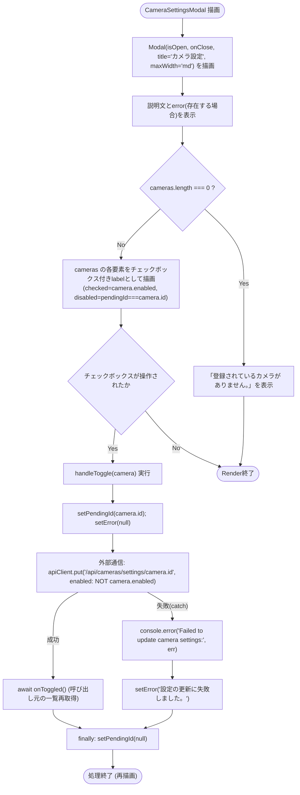
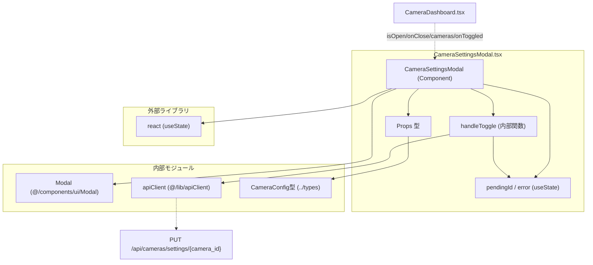

## 1. 解析メタ情報

| 項目 | 内容 |
| --- | --- |
| 対象ファイル | `family-quest/src/features/camera/components/CameraSettingsModal.tsx` |
| 言語 | React (TypeScript) |
| 解析対象 | 提供されたコードのみ |
| 推測・補完 | 一切なし |

## 関連ドキュメント

- [./CameraDashboard.md](./CameraDashboard.md) — 本コンポーネントを`<CameraSettingsModal isOpen={settingsOpen} onClose={...} cameras={allCameras} onToggled={fetchSettings} />`として描画する唯一の呼び出し元。
- [../types/index.md](../types/index.md) — `CameraConfig`型の定義元。
- [../../../components/ui/Modal.md](../../../components/ui/Modal.md) — 本コンポーネントが内部で使用する汎用モーダルコンポーネント`Modal`の実装元。
- [../../../lib/apiClient.md](../../../lib/apiClient.md) — `PUT /api/cameras/settings/{camera_id}`呼び出しに使う`apiClient`の実装元。
- [../../../../../MY_HOME_SYSTEM/camera_router.md](../../../../../MY_HOME_SYSTEM/camera_router.md) — `PUT /api/cameras/settings/{camera_id}`エンドポイントのバックエンド実装元。

## 2. ファイルの概要

* カメラごとの表示/非表示（有効/無効）をユーザーが切り替えるための設定モーダルコンポーネント。カメラ監視機能の有効/無効永続化機能（E-3）で新規追加された。
* 根拠: コメント (行番号: 13〜14 / 抜粋: "// カメラごとの表示/非表示を切り替える設定パネル。\n// 無効化したカメラは devices.json に永続化され、ライブ/録画タブの一覧から除外される。")
* 呼び出し元（`CameraDashboard`）から渡された`cameras`（無効化されたカメラも含む全件）をチェックボックス付きのリストとして表示し、チェックの変更（`onChange`）で`handleToggle`を呼び出す。`handleToggle`は`PUT /api/cameras/settings/{camera_id}`に`{ enabled: !camera.enabled }`を送信し、成功時は呼び出し元から渡された`onToggled`コールバックを実行して一覧の再取得を促す。
* 根拠: `handleToggle`の実装 (行番号: 19〜31 / 抜粋: "const handleToggle = async (camera: CameraConfig) => {\n        setPendingId(camera.id);\n        setError(null);\n        try {\n            await apiClient.put(`/api/cameras/settings/${camera.id}`, { enabled: !camera.enabled });\n            await onToggled();")
* 表示自体は汎用モーダルコンポーネント`Modal`（タイトル「カメラ設定」、`maxWidth="md"`）に委譲している。
* 根拠: (行番号: 34 / 抜粋: "<Modal isOpen={isOpen} onClose={onClose} title=\"カメラ設定\" maxWidth=\"md\">")

## 3. 外部依存関係

### インポート一覧

| 名称 | 種類 | 用途 | 根拠 |
| --- | --- | --- | --- |
| `React`, `useState` | ライブラリ (`react`) | コンポーネント定義、`pendingId`/`error`のローカル状態管理 | 根拠: (行番号: 1 / 抜粋: "import React, { useState } from 'react';") |
| `Modal` | 内部コンポーネント (`@/components/ui/Modal`) | モーダルの外枠（オーバーレイ、閉じるボタン、タイトル、幅）の描画を委譲する汎用コンポーネント | 根拠: (行番号: 2 / 抜粋: "import { Modal } from '@/components/ui/Modal';") |
| `apiClient` | 内部モジュール (`@/lib/apiClient`) | カメラ有効/無効切り替えのためのHTTP通信 | 根拠: (行番号: 3 / 抜粋: "import { apiClient } from '@/lib/apiClient';") |
| `CameraConfig` | 型定義 (`../types`) | カメラ設定情報（id, name, order, enabled）の型アノテーション | 根拠: (行番号: 4 / 抜粋: "import { CameraConfig } from '../types';") |

### ブラックボックスとなる外部要素

| 名称 | 理由 | 根拠 |
| --- | --- | --- |
| `Modal`の内部実装 | オーバーレイ・閉じるボタン・`maxWidth`ごとのスタイリング等の詳細仕様が本ファイルからは読み取れないため。 | 根拠: (行番号: 34 / 抜粋: "<Modal isOpen={isOpen} onClose={onClose} title=\"カメラ設定\" maxWidth=\"md\">") |
| `apiClient`の内部実装 | ベースURL、ヘッダ付与、認証トークン処理などの具体的な通信仕様が本ファイルからは読み取れないため。 | 根拠: (行番号: 23 / 抜粋: "await apiClient.put(`/api/cameras/settings/${camera.id}`, { enabled: !camera.enabled });") |
| `PUT /api/cameras/settings/{camera_id}` エンドポイントの仕様 | リクエスト後のDBの挙動（`devices.json`への永続化方法）、レスポンス形状、バリデーション仕様が本ファイルには含まれないため。 | 根拠: (行番号: 23 / 抜粋: "await apiClient.put(`/api/cameras/settings/${camera.id}`, { enabled: !camera.enabled });") |

## 4. 主要要素の定義（関数 / エンドポイント / コンポーネント）

### `Props` (型定義)

* **役割**: `CameraSettingsModal`が受け取るプロパティの型定義。モーダルの開閉状態(`isOpen`)、閉じる際のコールバック(`onClose`)、表示対象の全カメラ一覧(`cameras`)、切り替え成功時に呼ばれるコールバック(`onToggled`)を持つ。
* 根拠: (行番号: 6〜11 / 抜粋: "interface Props {\n    isOpen: boolean;\n    onClose: () => void;\n    cameras: CameraConfig[];\n    onToggled: () => Promise<void> | void;\n}")

### `CameraSettingsModal`

* **役割**: カメラごとの有効/無効切り替えUI（チェックボックスリスト）を`Modal`内に描画するメインコンポーネント。
* 根拠: (行番号: 15〜63 / 抜粋: "const CameraSettingsModal: React.FC<Props> = ({ isOpen, onClose, cameras, onToggled }) => {")

* **引数/リクエスト（Props）**: `Props`型（`isOpen: boolean`, `onClose: () => void`, `cameras: CameraConfig[]`, `onToggled: () => Promise<void> | void`）
* 根拠: (行番号: 15 / 抜粋: "const CameraSettingsModal: React.FC<Props> = ({ isOpen, onClose, cameras, onToggled }) => {")

* **戻り値/レスポンス**: JSX要素。`Modal`（`isOpen`/`onClose`/`title="カメラ設定"`/`maxWidth="md"`）の中に、説明文、エラーメッセージ（存在する場合）、および`cameras`の各要素に対応するチェックボックス付き`label`のリストを描画する。`cameras`が空配列の場合は「登録されているカメラがありません。」を表示する。
* 根拠: (行番号: 33〜62 / 抜粋: "return (\n        <Modal isOpen={isOpen} onClose={onClose} title=\"カメラ設定\" maxWidth=\"md\">")、(行番号: 56〜58 / 抜粋: "{cameras.length === 0 && (\n                        
登録されているカメラがありません。
\n                    )}")

* **副作用**: 各チェックボックスの`onChange`で`handleToggle(camera)`を呼び出す（副作用は`handleToggle`側、後述）。それ以外に本コンポーネント自体がマウント時/アンマウント時に実行する副作用（`useEffect`等）はない。
* 根拠: (行番号: 50 / 抜粋: "onChange={() => handleToggle(camera)}")

* **エラーハンドリング**: `error`状態が非`null`の場合、`
{error}
`としてエラーメッセージを表示する（エラー内容自体は`handleToggle`内で設定される、後述）。
* 根拠: (行番号: 39 / 抜粋: "{error && 
{error}
}")

### `pendingId` / `error` (状態, `useState`)

* **役割**: `pendingId`は現在トグル処理中のカメラの`id`（処理中でなければ`null`）を保持し、対象カメラのチェックボックスのみを`disabled`にするために使う。`error`は直近の切り替え失敗時のエラーメッセージ（成功時や初期状態は`null`）を保持する。
* 根拠: (行番号: 16〜17 / 抜粋: "const [pendingId, setPendingId] = useState<string | null>(null);\n    const [error, setError] = useState<string | null>(null);")

* **引数/リクエスト**: なし（初期値`null`の`useState`）
* **戻り値/レスポンス**: `pendingId: string | null`, `error: string | null`（およびそれぞれのセッター`setPendingId`/`setError`）
* **副作用**: `disabled={pendingId === camera.id}`によりチェックボックスの活性/非活性を制御する。
* 根拠: (行番号: 49 / 抜粋: "disabled={pendingId === camera.id}")
* **エラーハンドリング**: なし（値の保持のみ）

### `handleToggle` (内部関数)

* **役割**: 特定のカメラの`enabled`フラグを反転させてバックエンドに送信し、成功時は呼び出し元に一覧の再取得を促す。
* 根拠: (行番号: 19〜31 / 抜粋: "const handleToggle = async (camera: CameraConfig) => {")

* **引数/リクエスト**: `camera: CameraConfig`
* 根拠: (行番号: 19 / 抜粋: "const handleToggle = async (camera: CameraConfig) => {")

* **戻り値/レスポンス**: `Promise<void>`（`async`関数だが明示的な`return`値はない）
* 根拠: (行番号: 19〜31 / 抜粋: "const handleToggle = async (camera: CameraConfig) => {")

* **副作用**: 実行開始時に`setPendingId(camera.id)`と`setError(null)`を行い、`apiClient.put('/api/cameras/settings/${camera.id}', { enabled: !camera.enabled })`でHTTP PUTリクエストを送信する。成功時は`onToggled()`を`await`で実行し（呼び出し元の一覧再取得を待つ）、`finally`ブロックで（成功・失敗いずれの場合も）`setPendingId(null)`を実行して対象カメラのチェックボックスを再度活性化する。
* 根拠: (行番号: 20〜24 / 抜粋: "setPendingId(camera.id);\n        setError(null);\n        try {\n            await apiClient.put(`/api/cameras/settings/${camera.id}`, { enabled: !camera.enabled });\n            await onToggled();")、(行番号: 28〜30 / 抜粋: "} finally {\n            setPendingId(null);\n        }")

* **エラーハンドリング**: `apiClient.put`または`onToggled`が例外を投げた場合、`catch`ブロックで`console.error('Failed to update camera settings:', err)`によりコンソールへログ出力し、`setError('設定の更新に失敗しました。')`によりユーザー向けの固定エラーメッセージを設定する（バックエンドが返す詳細なエラー内容は表示されない）。
* 根拠: (行番号: 25〜27 / 抜粋: "} catch (err) {\n            console.error('Failed to update camera settings:', err);\n            setError('設定の更新に失敗しました。');\n        }")

## 5. 処理フロー図

## 6. 依存関係図

## 7. 次のステップ（リバースエンジニアリングの提案）

| 優先度 | ファイル名(推測可) | 理由 | 根拠 |
| --- | --- | --- | --- |
| 高 | バックエンドの`PUT /api/cameras/settings/{camera_id}`エンドポイント実装 | `devices.json`への永続化方法、バリデーション、レスポンス形状（エラー時の詳細メッセージの有無）を確認するため。 | 根拠: (行番号: 23 / 抜粋: "await apiClient.put(`/api/cameras/settings/${camera.id}`, { enabled: !camera.enabled });") |
| 中 | `family-quest/src/components/ui/Modal.tsx` | `title`/`maxWidth`以外にモーダルが受け付ける動作（背景クリックでの閉じる挙動、フォーカストラップ等）を確認するため。 | 根拠: (行番号: 34 / 抜粋: "<Modal isOpen={isOpen} onClose={onClose} title=\"カメラ設定\" maxWidth=\"md\">") |
| 低 | `family-quest/src/features/camera/components/CameraDashboard.tsx` | 本コンポーネントの唯一の呼び出し元として、`allCameras`/`fetchSettings`の受け渡し方を確認するため（本ドキュメント作成時点で確認済み）。 | 根拠: `CameraDashboard.md`（関連ドキュメント）参照 |

## 8. 保守上の注意点

* チェックボックスの`checked`は`camera.enabled`（親から渡された`cameras`配列の値）を直接参照しており、本コンポーネント自身は切り替え後の状態を楽観的（optimistic）に更新しない。そのため、`handleToggle`実行後にチェックの見た目が変わるのは、`onToggled()`経由で親（`CameraDashboard`）が`fetchSettings`を実行し、更新された`allCameras`が新しい`cameras` propsとして渡された後になる。
* 根拠: (行番号: 48 / 抜粋: "checked={camera.enabled}")、(行番号: 24 / 抜粋: "await onToggled();")
* `pendingId`は一度に1つのカメラIDしか保持できない（`useState<string | null>`）。同時に複数のカメラを連続してトグルしようとした場合の直列化・排他制御は本ファイル内には実装されておらず、`pendingId`は最後に`handleToggle`が呼ばれたカメラのIDで上書きされる。
* 根拠: (行番号: 16 / 抜粋: "const [pendingId, setPendingId] = useState<string | null>(null);")
* `handleToggle`の`catch`節は`apiClient.put`と`onToggled`の両方の例外をまとめて捕捉しており、どちらの呼び出しが失敗したのかをエラーメッセージからは区別できない（メッセージは常に固定文言「設定の更新に失敗しました。」）。
* 根拠: (行番号: 22〜27 / 抜粋: "try {\n            await apiClient.put(`/api/cameras/settings/${camera.id}`, { enabled: !camera.enabled });\n            await onToggled();\n        } catch (err) {\n            console.error('Failed to update camera settings:', err);\n            setError('設定の更新に失敗しました。');\n        }")
* `error`状態はモーダルを開いたまま次に成功するトグル操作を行うまでクリアされない仕組みになっている（`handleToggle`実行開始時に`setError(null)`するため、次の操作を行わない限り、失敗メッセージは`Modal`を閉じても状態としては保持されたままになる）。`onClose`時に`error`を明示的にリセットする処理は存在しない。
* 根拠: (行番号: 21 / 抜粋: "setError(null);")、コンポーネント全体（`onClose`時の`error`クリア処理が存在しないこと） (行番号: 15〜63)

## 9. 不明事項一覧

| 項目 | 理由 | 必要なファイル |
| --- | --- | --- |
| `PUT /api/cameras/settings/{camera_id}`の実際のリクエスト/レスポンス仕様、`devices.json`への永続化方法 | バックエンド実装が本ファイルに含まれないため | `MY_HOME_SYSTEM/routers/camera_router.py`等のカメラ設定APIバックエンド実装ファイル |
| `Modal`コンポーネントの内部実装（背景クリックでの閉じる挙動、`maxWidth="md"`の実際のピクセル幅等） | 本ファイルからは`Modal`の呼び出し（props渡し）のみが確認でき、内部実装は別ファイルにあるため | `family-quest/src/components/ui/Modal.tsx` |
| `cameras`配列の並び順がどこで決定されるか（本ファイル自体はソートを行わず渡された順に描画するのみ） | `cameras`は呼び出し元から渡される`allCameras`をそのまま参照しており、ソート処理自体は呼び出し元（`CameraDashboard.tsx`）にあるため | `family-quest/src/features/camera/components/CameraDashboard.tsx` |

## 10. 自己検証結果

* [x] 完了: 推測・外部ファイルの仕様を一切含んでいない
* [x] 完了: 全関数・全クラス・全コンポーネントを列挙した
* [x] 完了: 全てのインポート要素を列挙した
* [x] 完了: すべての仕様説明に「根拠（行番号・抜粋）」を明記した
* [x] 完了: 根拠漏れが0件である
* [x] 完了: Mermaid構文にエラーの原因となる記号（エスケープ漏れ）がない
* [x] 完了: 不明事項を漏れなく列挙した
