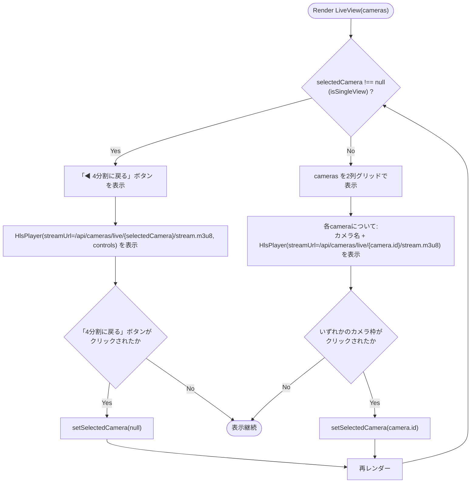
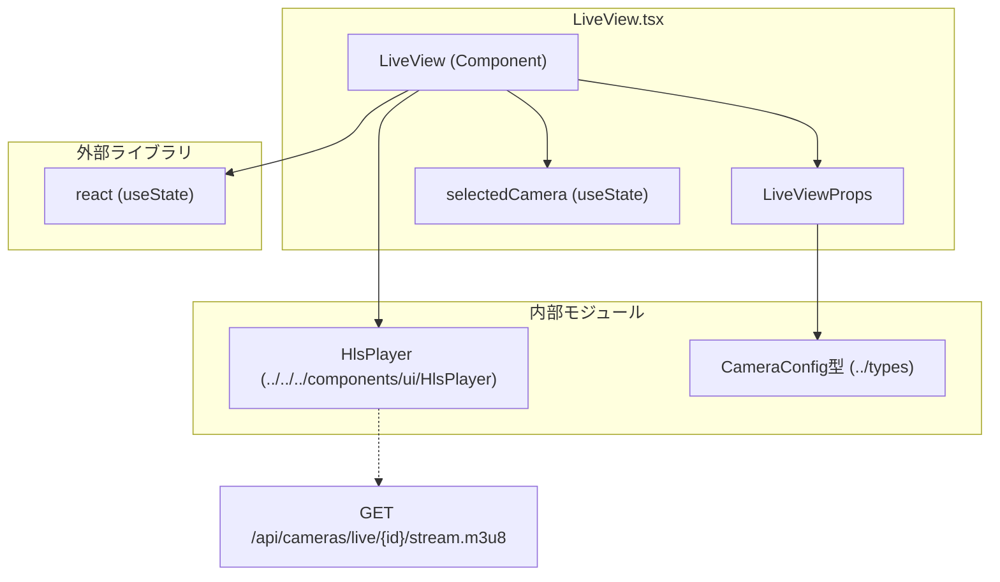

## 1. 解析メタ情報

| 項目 | 内容 |
| --- | --- |
| 対象ファイル | `family-quest/src/features/camera/components/LiveView.tsx` |
| 言語 | React (TypeScript) |
| 解析対象 | 提供されたコードのみ |
| 推測・補完 | 一切なし |

## 関連ドキュメント

* [../../../components/ui/HlsPlayer.md](../../../components/ui/HlsPlayer.md) - ライブ映像再生の実体コンポーネント
* [./CameraDashboard.md](./CameraDashboard.md) - 呼び出し元（`cameras` propの供給元）
* [../types/index.md](../types/index.md) - `CameraConfig`型の定義元
* [../../../../../MY_HOME_SYSTEM/camera_router.md](../../../../../MY_HOME_SYSTEM/camera_router.md) - `/api/cameras/live/{camera_id}/stream.m3u8`エンドポイントのバックエンド実装

## 2. ファイルの概要

* 複数の監視カメラのライブ映像を一覧表示するコンポーネント。
* 初期状態では全カメラをグリッド状（最大2列）に並べたサムネイル一覧を表示し、いずれかのカメラをクリックすると、そのカメラ1台分を大きく単独表示する「シングルビュー」に切り替わる。
* シングルビュー表示中は「4分割に戻る」ボタンで一覧表示に戻すことができる。
* 各映像の実体は`HlsPlayer`コンポーネントに委譲し、`/api/cameras/live/{カメラID}/stream.m3u8`のURLを渡す。

## 3. 外部依存関係

### インポート一覧

| 名称 | 種類 | 用途 | 根拠 |
| --- | --- | --- | --- |
| `React`, `useState` | ライブラリ (`react`) | コンポーネント定義、選択中カメラの状態管理 | 根拠: [`import React, { useState } from 'react';`] (行番号: 1 / 抜粋: "import React, { useState } from 'react';") |
| `HlsPlayer` | 内部コンポーネント (`../../../components/ui/HlsPlayer`) | HLSストリームの実際の再生を担当するコンポーネント | 根拠: [`import HlsPlayer from '../../../components/ui/HlsPlayer';`] (行番号: 2 / 抜粋: "import HlsPlayer from '../../../components/ui/HlsPlayer';") |
| `CameraConfig` | 型定義 (`../types`) | カメラ設定情報（id, name, order, enabled）の型アノテーション | 根拠: [`import { CameraConfig } from '../types';`] (行番号: 3 / 抜粋: "import { CameraConfig } from '../types';") |

### ブラックボックスとなる外部要素

| 名称 | 理由 | 根拠 |
| --- | --- | --- |
| `HlsPlayer`の内部実装 | 本ファイルからは`streamUrl`と`controls`プロパティを渡して呼び出している箇所のみが確認でき、HLS再生・エラー処理などの内部仕様は別ファイルにあるため。 | 根拠: [`<HlsPlayer streamUrl={...} controls />`] (行番号: 24 / 抜粋: "<HlsPlayer streamUrl={`/api/cameras/live/${selectedCamera}/stream.m3u8`} controls />") |
| `/api/cameras/live/{id}/stream.m3u8` エンドポイント | ライブ配信用HLSマニフェストを返すバックエンドの実装が本ファイルには含まれないため。 | 根拠: [URL組み立て] (行番号: 41 / 抜粋: "<HlsPlayer streamUrl={`/api/cameras/live/${camera.id}/stream.m3u8`} />") |

## 4. 主要要素の定義（関数 / エンドポイント / コンポーネント）

### `LiveView`

* **役割**: 監視カメラのライブ映像を一覧グリッド表示、またはクリックされたカメラのみを単独で大きく表示するコンポーネント。
* 根拠: [`LiveView`] (行番号: 9〜49 / 抜粋: "const LiveView: React.FC<LiveViewProps> = ({ cameras }) => {")

* **引数/リクエスト（Props）**: `LiveViewProps`
  * `cameras: CameraConfig[]` （必須）表示対象のカメラ設定一覧
* 根拠: [`LiveViewProps`] (行番号: 5〜7 / 抜粋: "interface LiveViewProps {\n    cameras: CameraConfig[];\n}")

* **戻り値/レスポンス**: JSX要素。`selectedCamera`が`null`でない場合は単独表示用の`
`、`null`の場合は一覧グリッド表示用の`
`を条件付きレンダリングする（両方とも同一の`
`内に共存し、`isSingleView`の真偽で表示が切り替わる）。
* 根拠: [return文] (行番号: 13〜48 / 抜粋: "return (\n        
")

* **副作用**: なし（外部通信やDOM操作、`useEffect`等は使用していない）。
* 根拠: インポート・本文中に`useEffect`や副作用を伴うAPI呼び出しが存在しない (行番号: 1〜51)

* **エラーハンドリング**: なし。`cameras`プロパティが空配列の場合でも、単にグリッドが空表示になるのみでエラー処理は行われない。
* 根拠: `cameras.map`のみで存在チェックやフォールバック表示が実装されていない (行番号: 31 / 抜粋: "{cameras.map(camera => (")

## 5. 処理フロー図

## 6. 依存関係図

## 7. 次のステップ（リバースエンジニアリングの提案）

| 優先度 | ファイル名(推測可) | 理由 | 根拠 |
| --- | --- | --- | --- |
| 高 | `family-quest/src/components/ui/HlsPlayer.tsx` | ライブ映像の実際の再生ロジック（HLS再生、エラー処理、自動再生制御）がここに実装されているため。 | 根拠: [`HlsPlayer`呼び出し] (行番号: 2, 24, 41 / 抜粋: "import HlsPlayer from '../../../components/ui/HlsPlayer';") |
| 中 | `family-quest/src/features/camera/components/CameraDashboard.tsx` | `LiveView`の呼び出し元であり、`cameras`プロパティ（`CameraConfig[]`）がどのように取得・フィルタされて渡されるかを確認するため。 | 根拠: [`LiveViewProps`] (行番号: 5〜7 / 抜粋: "interface LiveViewProps {") |
| 低 | バックエンドの`/api/cameras/live/{id}/stream.m3u8`エンドポイント実装 | ライブHLSストリームがどのように生成・配信されているかを確認するため。 | 根拠: [URL組み立て] (行番号: 24, 41 / 抜粋: "streamUrl={`/api/cameras/live/${camera.id}/stream.m3u8`}") |

## 8. 保守上の注意点

* 単独表示・グリッド表示のいずれの場合も`HlsPlayer`は`key`属性を持たない（グリッド側の`<HlsPlayer>`自体ではなく、親の`
`にのみ`key`が付与されている）。React上は問題にならないが、`selectedCamera`が変化してグリッド表示⇔単独表示が切り替わる際、`streamUrl`が変わっても同一の`HlsPlayer`インスタンスとして扱われず、常にアンマウント/再マウントが発生する構造になっている（`isSingleView`の条件分岐により表示している`<HlsPlayer>`要素自体が入れ替わるため）。
* 根拠: [条件分岐] (行番号: 15, 29 / 抜粋: "{isSingleView && (" と "{!isSingleView && (")
* `cameras`プロパティが空配列の場合の表示（空のグリッド）や、`selectedCamera`に存在しないカメラIDが設定された場合の挙動について、明示的なガード処理は実装されていない。
* 根拠: [`cameras.map`] (行番号: 31 / 抜粋: "{cameras.map(camera => (")
* グリッド表示は`md:grid-cols-2`により最大2列固定であり、カメラ台数が多い場合の列数調整（3列以上へのブレークポイント）は実装されていない。
* 根拠: [グリッドクラス] (行番号: 30 / 抜粋: "
")

## 9. 不明事項一覧

| 項目 | 理由 | 必要なファイル |
| --- | --- | --- |
| `cameras`プロパティの生成元・取得タイミング | `LiveView`自体はプロパティとして受け取るのみで、取得ロジックを持たないため | `CameraDashboard.tsx` |
| `/api/cameras/live/{id}/stream.m3u8`の実際のレスポンス仕様 | バックエンド実装が本ファイルに含まれないため | バックエンドのカメラAPI実装ファイル |
| `HlsPlayer`未指定Props（`muted`, `autoPlay`, `startPosition`, `onVideoRef`）が省略された場合のデフォルト挙動 | 本ファイルの呼び出し側では明示的に指定していないため、`HlsPlayer`側のデフォルト値定義を確認する必要がある | `family-quest/src/components/ui/HlsPlayer.tsx` |

## 相互参照による補足情報

| 元の不明事項 | 判明した内容 | 参照元ドキュメント |
| --- | --- | --- |
| `cameras`プロパティの生成元・取得タイミング | `family-quest/src/features/camera/components/CameraDashboard.tsx`を直接確認した。`useEffect`(13〜27行目、依存配列`[]`)内で`apiClient.get<CameraConfig[]>('/api/cameras/settings')`(15行目)を呼び出し、成功時は`data.filter((c: CameraConfig) => c.enabled)`(17行目)で`enabled`が`true`のカメラのみへ絞り込み、`activeCameras.sort((a, b) => a.order - b.order)`(18行目)で`order`昇順にソートした配列を`setCameras`(19行目)へセットする。この`cameras`ステートが58〜62行目の分岐で`activeTab === 'live'`の場合に`<LiveView cameras={cameras} />`(59行目)としてそのまま`props`に渡される。 | 直接ソース確認: `family-quest/src/features/camera/components/CameraDashboard.tsx:13-19, 58-59` |
| `/api/cameras/live/{id}/stream.m3u8`の実際のレスポンス仕様 | `MY_HOME_SYSTEM/routers/camera_router.py`を直接確認した。`GET /live/{camera_id}/stream.m3u8`(42〜60行目、関数`get_live_stream`)は`config.CAMERAS`から`camera_id`一致のカメラ設定を検索し(45行目)、見つからない場合は`HTTPException(status_code=404, detail="Camera not found")`(46〜47行目)。次に`camera_service.start_hls_stream(cam_conf)`(49行目)でストリーム生成を依頼し、`playlist_path`が偽値の場合は`HTTPException(status_code=500, detail="Failed to initialize stream")`(51〜52行目)。その後`for _ in range(10):`のループ(55〜58行目、コメント「ffmpegの初期セグメント生成を最大5秒待機」54行目)で`os.path.exists(playlist_path)`を`0.5`秒間隔で最大10回確認し、存在すれば`FileResponse(playlist_path, media_type="application/vnd.apple.mpegurl")`(57行目)を返す。10回確認しても生成されない場合は`HTTPException(status_code=503, detail="Stream generation timeout")`(60行目)を送出する。 | 直接ソース確認: `MY_HOME_SYSTEM/routers/camera_router.py:42-60` |
| `HlsPlayer`未指定Props（`muted`, `autoPlay`, `startPosition`, `onVideoRef`）が省略された場合のデフォルト挙動 | `family-quest/src/components/ui/HlsPlayer.tsx`を直接確認した。`HlsPlayerProps`の分割代入デフォルト値(13〜20行目)は`muted = true`, `autoPlay = true`, `controls = false`であり、`startPosition`と`onVideoRef`にはデフォルト値がなく未指定時は`undefined`のままとなる。`onVideoRef`未指定時は29行目の`if (onVideoRef) onVideoRef(video);`ガードにより単にコールバック呼び出しがスキップされる。`startPosition`未指定時は、hls.js経路では53行目`startPosition: startPosition !== undefined ? startPosition : -1`により`Hls`コンストラクタへ`-1`（hls.js側の既定動作）が渡され、Safariネイティブ再生経路では47行目`if (startPosition) video.currentTime = startPosition;`のガードにより`currentTime`の設定自体がスキップされる。 | 直接ソース確認: `family-quest/src/components/ui/HlsPlayer.tsx:13-20, 29, 47, 53` |

## 10. 自己検証結果

* [x] 推測・外部ファイルの仕様を一切含んでいない
* [x] 全関数・全クラス・全コンポーネントを列挙した
* [x] 全てのインポート要素を列挙した
* [x] すべての仕様説明に「根拠（行番号・抜粋）」を明記した
* [x] 根拠漏れが0件である
* [x] Mermaid構文にエラーの原因となる記号（エスケープ漏れ）がない
* [x] 不明事項を漏れなく列挙した

完了
