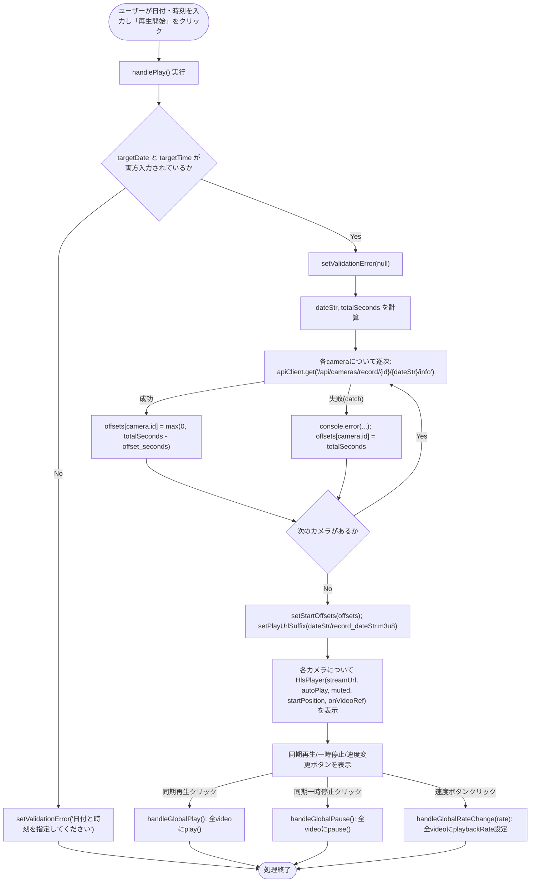
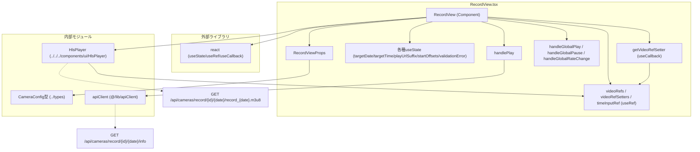

## 1. 解析メタ情報

| 項目 | 内容 |
| --- | --- |
| 対象ファイル | `family-quest/src/features/camera/components/RecordView.tsx` |
| 言語 | React (TypeScript) |
| 解析対象 | 提供されたコードのみ |
| 推測・補完 | 一切なし |

## 関連ドキュメント

* [../../../components/ui/HlsPlayer.md](../../../components/ui/HlsPlayer.md) - 録画映像再生の実体コンポーネント
* [./CameraDashboard.md](./CameraDashboard.md) - 呼び出し元（`cameras` propの供給元）
* [../types/index.md](../types/index.md) - `CameraConfig`型の定義元
* [../../../lib/apiClient.md](../../../lib/apiClient.md) - `/api/cameras/record/{id}/{date}/info`呼び出しに使うAPIクライアントの実装元
* [../../../../../MY_HOME_SYSTEM/camera_router.md](../../../../../MY_HOME_SYSTEM/camera_router.md) - 録画情報取得・録画ファイル配信エンドポイントのバックエンド実装

## 2. ファイルの概要

* 指定した日付・時刻の録画映像を、複数カメラ分同期して再生する画面のコンポーネント。
* 日付・時刻を入力させ、「再生開始」でカメラごとにオフセット秒（その日の録画ファイル先頭からのズレ）をAPIから取得し、算出したシーク位置で各カメラの録画を同時再生する。
* 全カメラ映像に対する同期再生・同期一時停止・再生速度（1x/2x/4x）の一括変更ボタンを提供する。
* 日付・時刻が未入力の場合はアラートの代わりに入力欄付近へインラインのエラーメッセージを表示する。

## 3. 外部依存関係

### インポート一覧

| 名称 | 種類 | 用途 | 根拠 |
| --- | --- | --- | --- |
| `React`, `useState`, `useRef`, `useCallback` | ライブラリ (`react`) | コンポーネント定義、状態管理、DOM/コールバック参照の保持 | 根拠: [`import React, { useState, useRef, useCallback } from 'react';`] (行番号: 1 / 抜粋: "import React, { useState, useRef, useCallback } from 'react';") |
| `HlsPlayer` | 内部コンポーネント (`../../../components/ui/HlsPlayer`) | 録画映像（HLSストリーム）の実際の再生を担当するコンポーネント | 根拠: [`import HlsPlayer from '../../../components/ui/HlsPlayer';`] (行番号: 2 / 抜粋: "import HlsPlayer from '../../../components/ui/HlsPlayer';") |
| `CameraConfig` | 型定義 (`../types`) | カメラ設定情報（id, name, order, enabled）の型アノテーション | 根拠: [`import { CameraConfig } from '../types';`] (行番号: 3 / 抜粋: "import { CameraConfig } from '../types';") |
| `apiClient` | 内部モジュール (`@/lib/apiClient`) | カメラごとの録画オフセット情報取得のためのHTTP通信 | 根拠: [`import { apiClient } from '@/lib/apiClient';`] (行番号: 4 / 抜粋: "import { apiClient } from '@/lib/apiClient';") |

### ブラックボックスとなる外部要素

| 名称 | 理由 | 根拠 |
| --- | --- | --- |
| `apiClient`の内部実装 | ベースURL、認証、共通エラー処理などの詳細仕様が本ファイルからは読み取れないため。 | 根拠: [`apiClient.get`] (行番号: 48 / 抜粋: "const data = await apiClient.get<{ offset_seconds: number }>(`/api/cameras/record/${camera.id}/${dateStr}/info`);") |
| `/api/cameras/record/{id}/{date}/info` エンドポイント | 指定日のカメラ録画ファイルの開始オフセット秒（`offset_seconds`）を返す仕様の詳細（ファイル分割ルール等）が本ファイルからは不明なため。 | 根拠: [`offset_seconds`] (行番号: 48, 50 / 抜粋: "offsets[camera.id] = Math.max(0, totalSeconds - data.offset_seconds);") |
| `HlsPlayer`の内部実装 | 本ファイルからは`streamUrl`, `autoPlay`, `muted`, `startPosition`, `onVideoRef`プロパティを渡して呼び出している箇所のみが確認でき、内部の再生・エラー処理仕様は別ファイルにあるため。 | 根拠: [`<HlsPlayer ... />`] (行番号: 123〜129 / 抜粋: "<HlsPlayer\n                                    streamUrl={`/api/cameras/record/${camera.id}/${playUrlSuffix}`}") |
| `/api/cameras/record/{id}/{date}/record_{date}.m3u8` エンドポイント | 録画再生用HLSマニフェストを返すバックエンドの実装が本ファイルには含まれないため。 | 根拠: [URL組み立て] (行番号: 59, 124 / 抜粋: "setPlayUrlSuffix(`${dateStr}/record_${dateStr}.m3u8`);") |

## 4. 主要要素の定義（関数 / エンドポイント / コンポーネント）

### `RecordView`

* **役割**: 日付・時刻指定による複数カメラの録画同期再生画面全体を構築するメインコンポーネント。
* 根拠: [`RecordView`] (行番号: 10〜139 / 抜粋: "const RecordView: React.FC<RecordViewProps> = ({ cameras }) => {")

* **引数/リクエスト（Props）**: `RecordViewProps`
  * `cameras: CameraConfig[]` （必須）表示対象のカメラ設定一覧
* 根拠: [`RecordViewProps`] (行番号: 6〜8 / 抜粋: "interface RecordViewProps {\n    cameras: CameraConfig[];\n}")

* **戻り値/レスポンス**: JSX要素。日付/時刻入力フォーム、バリデーションエラー表示、（再生開始後のみ）同期操作ボタン群、カメラごとの録画映像グリッドを含む`
`。
* 根拠: [return文] (行番号: 70〜138 / 抜粋: "return (\n        
")

* **副作用**: `handlePlay`実行時にカメラ台数分の`apiClient.get`呼び出し（逐次`for`ループ、`await`直列実行）を行う。`handleGlobalPlay`/`handleGlobalPause`/`handleGlobalRateChange`は`videoRefs.current`に保持された各`<video>`要素へ直接`play()`/`pause()`/`playbackRate`設定を行うDOM操作。
* 根拠: [`for (const camera of cameras)`] (行番号: 46〜55 / 抜粋: "for (const camera of cameras) {")、[`handleGlobalPlay`等] (行番号: 62〜68 / 抜粋: "const handleGlobalPlay = () => Object.values(videoRefs.current).forEach(v => v?.play());")

* **エラーハンドリング**: `handlePlay`内で`targetDate`または`targetTime`が未入力の場合、`setValidationError("日付と時刻を指定してください")`でインラインエラーを表示し処理を中断する。カメラごとのオフセット取得（`apiClient.get`）が失敗した場合は`catch`ブロックで`console.error("Failed to fetch offset", err)`を出力し、当該カメラのオフセットを`totalSeconds`（時刻指定の総秒数そのもの）にフォールバックする。
* 根拠: [必須入力チェック] (行番号: 33〜37 / 抜粋: "if (!targetDate || !targetTime) {")、[`catch`] (行番号: 51〜54 / 抜粋: "} catch (err) {\n                console.error(\"Failed to fetch offset\", err);\n                offsets[camera.id] = totalSeconds;\n            }")

### `handlePlay` (RecordView内ローカル関数)

* **役割**: 入力された日付・時刻をもとに、各カメラの録画オフセットをAPIから取得してシーク秒数を算出し、再生用のURLサフィックスとオフセット一覧をstateにセットする。
* 根拠: [`handlePlay`] (行番号: 32〜60 / 抜粋: "const handlePlay = async () => {")

* **引数/リクエスト**: なし（クロージャ経由で`targetDate`, `targetTime`, `cameras`を参照）
* 根拠: [関数シグネチャ] (行番号: 32 / 抜粋: "const handlePlay = async () => {")

* **戻り値/レスポンス**: `Promise<void>`（`setStartOffsets`と`setPlayUrlSuffix`によるstate更新のみ）
* 根拠: [state更新] (行番号: 57〜59 / 抜粋: "setStartOffsets(offsets);\n        // バックエンドが生成するファイル名 (record_YYYYMMDD.m3u8) と一致させる\n        setPlayUrlSuffix(`${dateStr}/record_${dateStr}.m3u8`);")

* **副作用**: カメラ台数分の`apiClient.get<{ offset_seconds: number }>('/api/cameras/record/{id}/{dateStr}/info')`呼び出し（逐次実行）。
* 根拠: [`apiClient.get`] (行番号: 48 / 抜粋: "const data = await apiClient.get<{ offset_seconds: number }>(`/api/cameras/record/${camera.id}/${dateStr}/info`);")

* **エラーハンドリング**: 未入力時は`setValidationError`でエラー表示し中断。個々のAPI呼び出し失敗時は`console.error`でログ出力し、当該カメラのオフセットを`totalSeconds`にフォールバックして処理を継続する（全体は中断しない）。
* 根拠: [`catch (err)`] (行番号: 51〜54 / 抜粋: "} catch (err) {\n                console.error(\"Failed to fetch offset\", err);\n                offsets[camera.id] = totalSeconds;\n            }")

### `getVideoRefSetter` (RecordView内ローカル関数)

* **役割**: カメラIDごとに安定した（レンダー間で同一参照を保つ）`onVideoRef`コールバック関数を返す。`videoRefSetters.current`にキャッシュがあればそれを返し、なければ新規生成してキャッシュする。
* 根拠: [`getVideoRefSetter`] (行番号: 23〜30 / 抜粋: "const getVideoRefSetter = useCallback((cameraId: string) => {")

* **引数/リクエスト**: `cameraId: string`
* 根拠: [引数定義] (行番号: 23 / 抜粋: "const getVideoRefSetter = useCallback((cameraId: string) => {")

* **戻り値/レスポンス**: `(el: HTMLVideoElement | null) => void` （`videoRefs.current[cameraId]`に要素を格納する関数）
* 根拠: [return文] (行番号: 29 / 抜粋: "return videoRefSetters.current[cameraId];")

* **副作用**: 初回呼び出し時に`videoRefSetters.current[cameraId]`へ新規関数をセットする（キャッシュ生成）。返された関数自体が呼ばれると`videoRefs.current[cameraId]`へDOM要素を格納する副作用を持つ。
* 根拠: [キャッシュ生成] (行番号: 24〜28 / 抜粋: "if (!videoRefSetters.current[cameraId]) {\n            videoRefSetters.current[cameraId] = (el: HTMLVideoElement | null) => {\n                videoRefs.current[cameraId] = el;\n            };\n        }")

* **エラーハンドリング**: なし
* 根拠: 該当するtry-catchや条件分岐によるエラー処理が存在しない (行番号: 23〜30)

### `handleGlobalPlay` (RecordView内ローカル関数)

* **役割**: `videoRefs.current`に保持されている全カメラの`<video>`要素に対して`play()`を一括実行する。
* 根拠: [`handleGlobalPlay`] (行番号: 62 / 抜粋: "const handleGlobalPlay = () => Object.values(videoRefs.current).forEach(v => v?.play());")

* **引数/リクエスト**: なし
* **戻り値/レスポンス**: `void`
* **副作用**: 各`<video>`要素の`play()`メソッド呼び出し（DOM操作）。
* 根拠: [`v?.play()`] (行番号: 62 / 抜粋: "Object.values(videoRefs.current).forEach(v => v?.play());")

* **エラーハンドリング**: なし（`play()`のPromise rejectに対する`.catch`等は実装されていない）
* 根拠: 該当箇所に`catch`やエラー処理が存在しない (行番号: 62)

### `handleGlobalPause` (RecordView内ローカル関数)

* **役割**: `videoRefs.current`に保持されている全カメラの`<video>`要素に対して`pause()`を一括実行する。
* 根拠: [`handleGlobalPause`] (行番号: 63 / 抜粋: "const handleGlobalPause = () => Object.values(videoRefs.current).forEach(v => v?.pause());")

* **引数/リクエスト**: なし
* **戻り値/レスポンス**: `void`
* **副作用**: 各`<video>`要素の`pause()`メソッド呼び出し（DOM操作）。
* 根拠: [`v?.pause()`] (行番号: 63 / 抜粋: "Object.values(videoRefs.current).forEach(v => v?.pause());")

* **エラーハンドリング**: なし
* 根拠: 該当箇所に`catch`やエラー処理が存在しない (行番号: 63)

### `handleGlobalRateChange` (RecordView内ローカル関数)

* **役割**: 引数で指定された再生速度（`rate`）を、`videoRefs.current`に保持されている全カメラの`<video>`要素の`playbackRate`へ一括設定する。
* 根拠: [`handleGlobalRateChange`] (行番号: 64〜68 / 抜粋: "const handleGlobalRateChange = (rate: number) => {")

* **引数/リクエスト**: `rate: number`
* 根拠: [引数定義] (行番号: 64 / 抜粋: "const handleGlobalRateChange = (rate: number) => {")

* **戻り値/レスポンス**: `void`
* **副作用**: 各`<video>`要素の`playbackRate`プロパティへの代入（DOM操作）。
* 根拠: [`v.playbackRate = rate`] (行番号: 65〜67 / 抜粋: "Object.values(videoRefs.current).forEach(v => {\n            if (v) v.playbackRate = rate;\n        });")

* **エラーハンドリング**: なし
* 根拠: 該当箇所に`catch`やエラー処理が存在しない (行番号: 64〜68)

## 5. 処理フロー図

## 6. 依存関係図

## 7. 次のステップ（リバースエンジニアリングの提案）

| 優先度 | ファイル名(推測可) | 理由 | 根拠 |
| --- | --- | --- | --- |
| 高 | `family-quest/src/lib/apiClient.ts` | `/api/cameras/record/{id}/{date}/info`呼び出しの認証・エラー処理仕様を確認するため（本ファイルの`catch`は`apiClient`が投げる例外を前提としている）。 | 根拠: [`apiClient.get`] (行番号: 48 / 抜粋: "const data = await apiClient.get<{ offset_seconds: number }>(...)") |
| 高 | `family-quest/src/components/ui/HlsPlayer.tsx` | 録画映像の実際の再生・シーク（`startPosition`の適用方法）・エラー処理ロジックを確認するため。 | 根拠: [`<HlsPlayer ... startPosition={startOffsets[camera.id] || 0} .../>`] (行番号: 123〜129) |
| 中 | バックエンドの`/api/cameras/record/{id}/{date}/info`エンドポイント実装 | `offset_seconds`の算出根拠（録画ファイルの分割規則、タイムゾーン処理等）を確認するため。 | 根拠: [`offset_seconds`] (行番号: 48 / 抜粋: "const data = await apiClient.get<{ offset_seconds: number }>(...)") |
| 中 | バックエンドの録画ファイル生成処理（`record_{date}.m3u8`命名規則） | コメントに「バックエンドが生成するファイル名」との記載があり、命名規則の実装元を確認するため。 | 根拠: [コメント] (行番号: 58 / 抜粋: "// バックエンドが生成するファイル名 (record_YYYYMMDD.m3u8) と一致させる") |

## 8. 保守上の注意点

* `handlePlay`内のカメラごとのオフセット取得は`for...of`ループ内で`await`しており、カメラ台数分のAPIリクエストが並列ではなく逐次（直列）実行される。カメラ台数が多い場合、再生開始までの待機時間がカメラ数に比例して増大する可能性がある。
* 根拠: [`for (const camera of cameras) { ... await apiClient.get ... }`] (行番号: 46〜55)
* 個別カメラのオフセット取得に失敗した場合、そのカメラのみ`totalSeconds`（オフセット未考慮の総秒数）にフォールバックされるが、ユーザーへ「一部のカメラでオフセット取得に失敗した」旨の通知は行われない（`console.error`のみ）。
* 根拠: [`catch (err)`] (行番号: 51〜54 / 抜粋: "} catch (err) {\n                console.error(\"Failed to fetch offset\", err);")
* `handleGlobalPlay`は各`<video>`要素の`play()`のPromise reject（自動再生ポリシー等によるエラー）を捕捉していない。ブラウザ環境によっては未処理のPromise rejectionが発生し得る。
* 根拠: [`v?.play()`] (行番号: 62 / 抜粋: "Object.values(videoRefs.current).forEach(v => v?.play());")
* `getVideoRefSetter`によるコールバックキャッシュは`cameras`配列が変化（カメラの追加・削除）した場合も`videoRefSetters.current`および`videoRefs.current`から古いエントリが除去されない設計であり、コンポーネントのライフサイクル全体でメモリ上に残り続ける。
* 根拠: [`videoRefSetters.current[cameraId] = ...`] (行番号: 24〜28)
* 時刻入力（`<input type="time">`）に値が入力されると`blur()`でフォーカスを強制的に外す実装になっており、キーボード操作でのシーケンシャルな入力（Tabキー移動等）のユーザビリティに影響する可能性がある。
* 根拠: [`timeInputRef.current?.blur();`] (行番号: 88〜91 / 抜粋: "if (e.target.value) {\n                                timeInputRef.current?.blur();\n                            }")

## 9. 不明事項一覧

| 項目 | 理由 | 必要なファイル |
| --- | --- | --- |
| `apiClient`の内部実装（認証・共通エラー処理） | 本ファイルからはメソッド呼び出しのみが確認でき、内部仕様は不明なため | `family-quest/src/lib/apiClient.ts` |
| `/api/cameras/record/{id}/{date}/info`の`offset_seconds`の算出方法 | バックエンド実装が本ファイルに含まれないため | バックエンドのカメラ録画API実装ファイル |
| `cameras`プロパティの生成元・取得タイミング | `RecordView`自体はプロパティとして受け取るのみで取得ロジックを持たないため | `CameraDashboard.tsx` |
| 録画ファイルが日をまたぐ場合や複数ファイルに分割される場合の挙動 | `record_{dateStr}.m3u8`という単一ファイル名のみを組み立てており、分割時の扱いが本ファイルからは不明なため | バックエンドの録画ファイル管理・生成処理 |

## 相互参照による補足情報

| 元の不明事項 | 判明した内容 | 参照元ドキュメント |
| --- | --- | --- |
| `apiClient`の内部実装（認証・共通エラー処理） | `apiClient.md`の解析によれば、`apiClient.get`は内部の`_request`（`fetch`ベース）を呼び出し、`response.ok`が偽の場合は`errorData.detail`またはステータスコードを用いたメッセージで`Error`をスローする実装であるとされている。ただしこれは`apiClient.md`側の解析結果からの補足であり、`apiClient.ts`のソースコード自体は本ファイルの解析時点では確認していない。 | ../../../lib/apiClient.md |
| `/api/cameras/record/{id}/{date}/info`の`offset_seconds`の算出方法 | `camera_router.md`の解析によれば、`GET /record/{camera_id}/{target_date}/info`は`camera_service.get_record_start_offset`を呼び出して`offset_seconds`を算出しているとされ、`camera_router.md`側の相互参照情報ではこの関数は「指定日最初の録画ファイル名から算出した0時からの経過秒数（失敗時は0）」を返すと推測される、と記載されている。ただしこれは`camera_router.md`側の解析結果（さらにその先の`camera_service.md`からの推測）を経由した補足であり、`camera_service.py`のソースコード自体は本ファイルの解析時点では確認していない。 | ../../../../../MY_HOME_SYSTEM/camera_router.md |
| `cameras`プロパティの生成元・取得タイミング | `CameraDashboard.md`の解析によれば、`cameras`は`CameraDashboard`のマウント時（`useEffect`、依存配列は空）に`apiClient.get('/api/cameras/settings')`で取得し、`enabled`が`true`のカメラのみを`order`昇順でソートした配列であるとされている。ただしこれは`CameraDashboard.md`側の解析結果からの補足であり、`CameraDashboard.tsx`のソースコード自体は本ファイルの解析時点では確認していない。 | ./CameraDashboard.md |
| 録画ファイルが日をまたぐ場合や複数ファイルに分割される場合の挙動 | `camera_router.md`の相互参照情報によれば、録画プレイリストの生成（`generate_record_playlist`）は「10分単位に分割されたmp4群を`ffconcat`で結合したVOD用HLSプレイリスト」を生成すると推測されているが、日をまたぐ場合の具体的な扱い（前日分との連結有無等）については`camera_router.md`側の解析結果からも確認できていない。ただしこれは`camera_router.md`側の解析結果（さらにその先の`camera_service.md`からの推測）を経由した補足であり、`camera_service.py`のソースコード自体は本ファイルの解析時点では確認していない。 | ../../../../../MY_HOME_SYSTEM/camera_router.md |

## 10. 自己検証結果

* [x] 推測・外部ファイルの仕様を一切含んでいない
* [x] 全関数・全クラス・全コンポーネントを列挙した
* [x] 全てのインポート要素を列挙した
* [x] すべての仕様説明に「根拠（行番号・抜粋）」を明記した
* [x] 根拠漏れが0件である
* [x] Mermaid構文にエラーの原因となる記号（エスケープ漏れ）がない
* [x] 不明事項を漏れなく列挙した

完了
