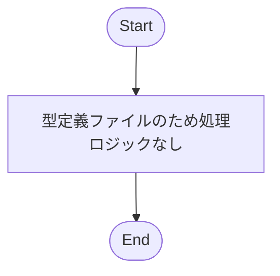
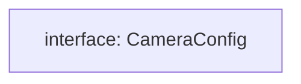

## 1. 解析メタ情報

| 項目 | 内容 |
| --- | --- |
| 対象ファイル | `family-quest/src/features/camera/types/index.ts` |
| 言語 | TypeScript |
| 解析対象 | 提供されたコードのみ |
| 推測・補完 | 一切なし |

## 関連ドキュメント

* [../components/CameraDashboard.md](../components/CameraDashboard.md) - `CameraConfig[]`を取得・フィルタ（`enabled`）・ソート（`order`昇順）して利用するコンポーネント
* [../components/LiveView.md](../components/LiveView.md) - `CameraConfig[]`を`cameras` propとして受け取るコンポーネント
* [../components/RecordView.md](../components/RecordView.md) - `CameraConfig[]`を`cameras` propとして受け取るコンポーネント
* [../../../../../MY_HOME_SYSTEM/camera_router.md](../../../../../MY_HOME_SYSTEM/camera_router.md) - `CameraConfig`に対応するレスポンス（`id`/`name`/`order`/`enabled`）を生成する`GET /settings`エンドポイントの実装元

## 2. ファイルの概要

* カメラ機能（`features/camera`）配下で共有される、カメラ設定情報のデータ構造 `CameraConfig` を定義する型定義ファイル。
* 監視カメラの識別子、表示名、表示順、有効/無効フラグを保持する。

## 3. 外部依存関係

### インポート一覧

| 名称 | 種類 | 用途 | 根拠 |
| --- | --- | --- | --- |
| 該当なし | - | - | - |

### ブラックボックスとなる外部要素

| 名称 | 理由 | 根拠 |
| --- | --- | --- |
| 該当なし | 外部モジュールのインポートが存在しないため | - |

## 4. 主要要素の定義（関数 / エンドポイント / コンポーネント）

※本ファイルは型定義（Interface）のみで構成されているため、当該型定義を主要要素として列挙します。

### `CameraConfig`

* **役割**: 監視カメラ1台分の設定情報を表すデータ構造の定義。`id`（識別子）、`name`（表示名）、`order`（表示順）、`enabled`（有効/無効フラグ）の4プロパティを持つ。
* 根拠: [`CameraConfig`] (行番号: 1〜6 / 抜粋: "export interface CameraConfig {")

* **引数/リクエスト**: 該当なし
* **戻り値/レスポンス**: 該当なし
* **副作用**: なし
* **エラーハンドリング**: なし

## 5. 処理フロー図

※本ファイルは型定義のみであり、実行されるロジック（関数等）が存在しないため、処理フロー図は該当なし。

## 6. 依存関係図

型定義間の参照関係を示します（本ファイル内には他の型への参照は存在しない）。

## 7. 次のステップ（リバースエンジニアリングの提案）

| 優先度 | ファイル名(推測可) | 理由 | 根拠 |
| --- | --- | --- | --- |
| 高 | `family-quest/src/features/camera/components/CameraDashboard.tsx` | `CameraConfig[]`を取得・フィルタ・ソートして`LiveView`/`RecordView`に渡している利用元であり、`order`/`enabled`の実際の使われ方を確認する必要がある。 | [`CameraConfig`利用箇所] 型定義のみでは利用実態が不明なため |
| 中 | バックエンドの `/api/cameras/settings` エンドポイント実装 | `CameraConfig`のプロパティがサーバー側でどのように生成・永続化されているかを確認するため。 | [`CameraConfig`] (行番号: 1〜6 / 抜粋: "export interface CameraConfig {") |

## 8. 保守上の注意点

* `id`の型が`string`と定義されているが、命名や値の生成規則（数値文字列かスラッグ文字列か等）は本ファイルからは判断できない。
* `order`が`number`型であるのみで、一意性や昇順・降順の規約についての制約は型定義上表現されていない。

## 9. 不明事項一覧

| 項目 | 理由 | 必要なファイル |
| --- | --- | --- |
| `CameraConfig`の各フィールドの実際の値の生成元・制約 | 本ファイルには型定義のみが存在し、生成・利用ロジックが含まれないため | `CameraDashboard.tsx`、バックエンドの`/api/cameras/settings`実装 |

## 相互参照による補足情報

| 元の不明事項 | 判明した内容 | 参照元ドキュメント |
| --- | --- | --- |
| `CameraConfig`の各フィールドの実際の値の生成元・制約 | `MY_HOME_SYSTEM/routers/camera_router.py`と`family-quest/src/features/camera/components/CameraDashboard.tsx`を直接確認した。バックエンドの`GET /settings`(`camera_router.py`28〜40行目、関数`get_camera_settings`)は`config.CAMERAS`（`devices.json`由来）を`enumerate`でループし(33行目)、`id`(35行目、`cam["id"]`をそのまま)・`name`(36行目、`cam["name"]`をそのまま)・`order`(37行目、配列インデックス+1)・`enabled`(38行目、常に`True`固定値)を含む辞書のリストを返す。フロントエンド側は`CameraDashboard.tsx`の`useEffect`(13〜19行目)で`apiClient.get<CameraConfig[]>('/api/cameras/settings')`を呼び出し、`data.filter((c) => c.enabled)`(17行目)で`enabled`が`true`のカメラのみへ絞り込んだうえで`activeCameras.sort((a, b) => a.order - b.order)`(18行目)により`order`昇順にソートしてから`cameras`ステートへ格納する。 | 直接ソース確認: `MY_HOME_SYSTEM/routers/camera_router.py:28-40`, `family-quest/src/features/camera/components/CameraDashboard.tsx:13-19` |

## 10. 自己検証結果

* [x] 推測・外部ファイルの仕様を一切含んでいない
* [x] 全関数・全クラス・全コンポーネントを列挙した（今回は型定義を網羅）
* [x] 全てのインポート要素を列挙した（該当なし）
* [x] すべての仕様説明に「根拠（行番号・抜粋）」を明記した
* [x] 根拠漏れが0件である
* [x] Mermaid構文にエラーの原因となる記号（エスケープ漏れ）がない
* [x] 不明事項を漏れなく列挙した

完了
