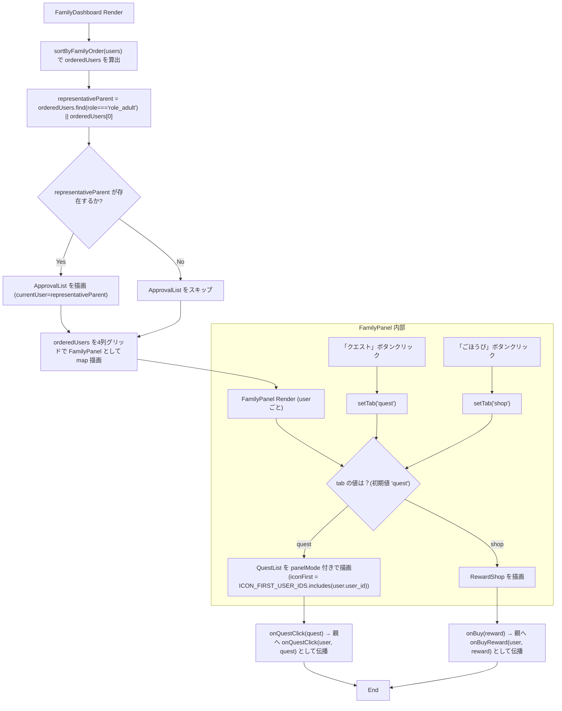

## 1. 解析メタ情報

| 項目 | 内容 |
| --- | --- |
| 対象ファイル | FamilyDashboard.tsx |
| 言語 | React (TypeScript) |
| 解析対象 | 提供されたコードのみ |
| 推測・補完 | 一切なし |

## 関連ドキュメント

* [./UserStatusCard.md](./UserStatusCard.md) - 各パネル上部のユーザーステータス表示コンポーネント
* [../../quest/components/QuestList.md](../../quest/components/QuestList.md) - パネル内クエスト一覧表示コンポーネント（`panelMode`/`iconFirst`付き）
* [../../quest/components/ApprovalList.md](../../quest/components/ApprovalList.md) - メイン画面上部の承認待ち一覧表示コンポーネント
* [../../shop/components/RewardShop.md](../../shop/components/RewardShop.md) - パネル内「ごほうび」表示コンポーネント
* [../../../types/index.md](../../../types/index.md) - `User`/`Quest`/`QuestHistory`/`Reward`/`PendingInventory`型の定義元
* [../../../../App.md](../../../../App.md) - 呼び出し元（横画面レイアウト時のメイン表示コンポーネントとして使用）

## 2. ファイルの概要

横画面（Echo Show 15等の常設デバイス）用のメインレイアウトコンポーネント`FamilyDashboard`と、その内部で使われるユーザー単位のパネルコンポーネント`FamilyPanel`を定義する。パパ・ママ・兄・妹（`FAMILY_ORDER`で固定された順序）を1行4列のグリッドで常時表示し、各パネル内でそのユーザーのステータスと、その日のクエスト一覧またはごほうび画面が完結する（別画面への誘導をしない）。親向けの承認機能は独立画面を持たず、メイン画面上部に常時統合表示される。

* 根拠: コンポーネント直前のコメント (行番号: 42〜45 / 抜粋: "// 横画面(Echo Show 15等の常設デバイス)用メインレイアウト。\n// パパ・ママ・兄・妹を1行4列で常時表示し、各パネル内でその人のステータスと\n// その日のクエスト一覧が完結する(別画面への誘導をしない)。親向けの承認機能は\n// 独立画面を持たず、このメイン画面上部に常時統合表示する。")
* 根拠: `FamilyDashboard`関数定義 (行番号: 46 / 抜粋: "const FamilyDashboard: React.FC<FamilyDashboardProps> = ({")
* 根拠: `FamilyPanel`関数定義 (行番号: 100 / 抜粋: "const FamilyPanel: React.FC<FamilyPanelProps> = ({")

## 3. 外部依存関係

### インポート一覧

| 名称 | 種類 | 用途 | 根拠 |
| --- | --- | --- | --- |
| `React`, `useState` | ライブラリ | コンポーネント定義とパネルごとのタブ状態管理 | `import React, { useState } from 'react';` (行番号: 1) |
| `Sword`, `ShoppingBag` | アイコンコンポーネント | パネル内タブ（クエスト/ごほうび）ボタンのアイコン表示 | `import { Sword, ShoppingBag } from 'lucide-react';` (行番号: 2) |
| `User`, `Quest`, `QuestHistory`, `Reward`, `PendingInventory` | 型定義 | Propsおよび内部変数の型指定 | `import { User, Quest, QuestHistory, Reward, PendingInventory } from '@/types';` (行番号: 3) |
| `UserStatusCard` | コンポーネント | 各パネル上部のユーザーステータス表示 | `import UserStatusCard from './UserStatusCard';` (行番号: 4) |
| `QuestList` | コンポーネント | パネル内のクエスト一覧表示（`panelMode`/`iconFirst`付き） | `import QuestList from '../../quest/components/QuestList';` (行番号: 5) |
| `ApprovalList` | コンポーネント | メイン画面上部の承認待ち一覧表示 | `import ApprovalList from '../../quest/components/ApprovalList';` (行番号: 6) |
| `RewardShop` | コンポーネント | パネル内の「ごほうび」表示 | `import RewardShop from '../../shop/components/RewardShop';` (行番号: 7) |

### ブラックボックスとなる外部要素

| 名称 | 理由 | 根拠 |
| --- | --- | --- |
| `UserStatusCard`, `QuestList`, `ApprovalList`, `RewardShop` | 実装ファイルが提供されておらず、内部のレンダリング内容や副作用が不明 | インポート文 (行番号: 4〜7) |
| `@/types` の各型 (`User`, `Quest`, `QuestHistory`, `Reward`, `PendingInventory`) | プロパティの完全な構造が本ファイル内では定義されていないため | `import { User, Quest, QuestHistory, Reward, PendingInventory } from '@/types';` (行番号: 3) |

## 4. 主要要素の定義（関数 / エンドポイント / コンポーネント）

### `FAMILY_ORDER` / `ICON_FIRST_USER_IDS` (モジュールレベル定数)

* **役割**: `FAMILY_ORDER`はパパ・ママ・兄・妹の表示順を固定するための`user_id`配列。権限判定(`quest_users.role`)とは別の「画面上の並び順」の関心事のため、ここでのみ`user_id`を直接使う旨がコメントで明記されている。`ICON_FIRST_USER_IDS`は、まだ文字を十分読めない年齢の子ども向けにアイコン主体・文字量を絞った表示にする対象ユーザーIDの配列（`daughter`のみ）。
* 根拠: (行番号: 9〜15 / 抜粋: "// 表示順(パパ・ママ・兄・妹)を固定するための並び替えキー(要件5)。\n// 権限判定(quest_users.role)とは別の「画面上の並び順」の関心事のため、ここでのみ\n// user_id を直接使う(Family Questの家族構成は固定のため妥当と判断)。\nconst FAMILY_ORDER = ['dad', 'mom', 'son', 'daughter'];", "// まだ文字を十分読めない年齢の子ども向けに、アイコン主体・文字量を絞った表示にする対象(要件10)。\nconst ICON_FIRST_USER_IDS = ['daughter'];")


### `sortByFamilyOrder` (モジュールレベル関数)

* **役割**: `users`配列を`FAMILY_ORDER`のインデックス順に並び替える。`FAMILY_ORDER`に含まれないユーザーは末尾（インデックス-1同士は順序維持、片方のみ-1なら-1側が後ろ）に配置される。
* 根拠: (行番号: 17〜26 / 抜粋: "function sortByFamilyOrder(users: User[]): User[] {\n    return [...users].sort((a, b) => {\n        const ia = FAMILY_ORDER.indexOf(a.user_id);\n        const ib = FAMILY_ORDER.indexOf(b.user_id);\n        if (ia === -1 && ib === -1) return 0;\n        if (ia === -1) return 1;\n        if (ib === -1) return -1;\n        return ia - ib;\n    });\n}")


* **引数/リクエスト**: `users: User[]`
* **戻り値/レスポンス**: `User[]`（元配列を破壊せず`[...users]`のコピーをソート）
* **副作用**: なし
* **エラーハンドリング**: なし


### `FamilyDashboardProps` (型定義)

* **役割**: `FamilyDashboard`コンポーネントが受け取るPropsの型定義。
* 根拠: (行番号: 28〜40 / 抜粋: "interface FamilyDashboardProps {\n    users: User[];\n    quests: Quest[];\n    completedQuests: QuestHistory[];\n    pendingQuests: QuestHistory[];\n    rewards: Reward[];\n    pendingInventory: PendingInventory[];\n    onQuestClick: (user: User, quest: Quest) => void;\n    onBuyReward: (user: User, reward: Reward) => void;\n    onApprove: (history: QuestHistory) => void;\n    onReject: (history: QuestHistory) => void;\n    onAvatarClick: (user: User) => void;\n}")


### `FamilyDashboard`

* **役割**: `users`を`sortByFamilyOrder`で並び替え、代表の親（`role === 'role_adult'`、無ければ先頭）を`ApprovalList`の`currentUser`として渡して承認バーを表示したのち、並び替え済みユーザーごとに`FamilyPanel`をグリッド表示する。承認バーの記録名義は「親」で固定し、実際にどちらの親が画面をタップしたかは区別しない（要件5）。
* 根拠: (行番号: 46〜86 / 抜粋: "const FamilyDashboard: React.FC<FamilyDashboardProps> = ({")
* 根拠: 代表の親のコメント (行番号: 51〜53 / 抜粋: "// 承認バーの記録名義は「親」で固定し、実際に画面をタップしたのがどちらの親かは\n    // 区別しない(要件5: 現状も厳密なセキュリティ境界ではないための最もシンプルな方式)。\n    const representativeParent = orderedUsers.find(u => u.role === 'role_adult') || orderedUsers[0];")


* **引数/リクエスト**: `FamilyDashboardProps`
* 根拠: (行番号: 46〜49 / 抜粋: "const FamilyDashboard: React.FC<FamilyDashboardProps> = ({\n    users, quests, completedQuests, pendingQuests, rewards, pendingInventory,\n    onQuestClick, onBuyReward, onApprove, onReject, onAvatarClick,\n}) => {")


* **戻り値/レスポンス**: JSX.Element
* 根拠: (行番号: 55〜85 / 抜粋: "return (\n        <div className=\"flex flex-col gap-4 animate-in fade-in duration-300\">")


* **副作用**: なし（描画のみ。実際の副作用は`onQuestClick`/`onBuyReward`/`onApprove`/`onReject`/`onAvatarClick`のコールバック経由で親コンポーネントに委譲）
* 根拠: `useEffect`等の記述なし (行番号: 46〜86)


* **エラーハンドリング**: `representativeParent`が存在する場合のみ`ApprovalList`を描画する（`orderedUsers`が空配列で`representativeParent`が`undefined`になった場合は`ApprovalList`を描画しない）。
* 根拠: (行番号: 57 / 抜粋: "{representativeParent && (")


### `FamilyPanelProps` (型定義)

* **役割**: `FamilyPanel`コンポーネントが受け取るPropsの型定義。
* 根拠: (行番号: 88〜98 / 抜粋: "interface FamilyPanelProps {\n    user: User;\n    quests: Quest[];\n    completedQuests: QuestHistory[];\n    pendingQuests: QuestHistory[];\n    rewards: Reward[];\n    iconFirst: boolean;\n    onQuestClick: (quest: Quest) => void;\n    onBuyReward: (reward: Reward) => void;\n    onAvatarClick: () => void;\n}")


### `FamilyPanel`

* **役割**: 1ユーザー分のパネルを描画する。パネル上部に`UserStatusCard`、その下にタブ切替（`quest`/`shop`、Echo Show 15でのタッチ操作を想定し44px以上のタップ領域を確保）、下部に選択中タブに応じて`QuestList`（`panelMode`固定、`iconFirst`はProps経由）または`RewardShop`を表示する。コンテンツ領域はパネルごとに独立スクロール（`max-h-[60vh] overflow-y-auto`）を持つ。
* 根拠: (行番号: 100〜152 / 抜粋: "const FamilyPanel: React.FC<FamilyPanelProps> = ({")
* 根拠: 独立スクロールのコメント (行番号: 130〜131 / 抜粋: "{/* パネルごとに独立スクロール(要件5) */}\n            <div className=\"p-2 overflow-y-auto max-h-[60vh]\">")
* 根拠: タップ領域確保のコメント (行番号: 112 / 抜粋: "{/* タブ切替: Echo Show 15でのタッチ操作を想定し、タップ領域を大きめに確保 */}")


* **引数/リクエスト**: `FamilyPanelProps`
* 根拠: (行番号: 100〜103 / 抜粋: "const FamilyPanel: React.FC<FamilyPanelProps> = ({\n    user, quests, completedQuests, pendingQuests, rewards, iconFirst,\n    onQuestClick, onBuyReward, onAvatarClick,\n}) => {")


* **戻り値/レスポンス**: JSX.Element
* 根拠: (行番号: 106〜151 / 抜粋: "return (\n        <div className=\"flex flex-col bg-black/30 border-2 border-gray-700 rounded-xl overflow-hidden min-w-0\">")


* **副作用**: `tab`ローカルステート（`'quest' | 'shop'`、初期値`'quest'`）の更新
* 根拠: (行番号: 104 / 抜粋: "const [tab, setTab] = useState<'quest' | 'shop'>('quest');")


* **エラーハンドリング**: なし


## 5. 処理フロー図



## 6. 依存関係図

```mermaid
graph TD
    FamilyDashboard["FamilyDashboard (Component)"]
    FamilyPanel["FamilyPanel (Component, 同一ファイル内)"]
    sortByFamilyOrder["sortByFamilyOrder (関数)"]

    UI_UserStatusCard["UserStatusCard (ブラックボックス)"]
    UI_QuestList["QuestList (../../quest/components/QuestList)"]
    UI_ApprovalList["ApprovalList (../../quest/components/ApprovalList)"]
    UI_RewardShop["RewardShop (../../shop/components/RewardShop)"]

    Types["@/types (User, Quest, QuestHistory, Reward, PendingInventory)"]

    FamilyDashboard -->|import| Types
    FamilyDashboard --> sortByFamilyOrder
    FamilyDashboard --> UI_ApprovalList
    FamilyDashboard -->|Render (userごと)| FamilyPanel

    FamilyPanel --> UI_UserStatusCard
    FamilyPanel -->|tab==='quest'| UI_QuestList
    FamilyPanel -->|tab==='shop'| UI_RewardShop
    FamilyPanel -->|import| Types

```

## 7. 次のステップ（リバースエンジニアリングの提案）

| 優先度 | ファイル名(推測可) | 理由 | 根拠 |
| --- | --- | --- | --- |
| 高 | `./UserStatusCard.tsx` | 各パネル上部のユーザーステータス表示の内部実装（`onAvatarClick`の扱い方等）を把握するため。 | `import UserStatusCard from './UserStatusCard';` (行番号: 4) |
| 高 | `../../shop/components/RewardShop.tsx` | パネル内「ごほうび」タブの実体であり、購入・所持品表示の内部実装を把握する必要があるため。 | `import RewardShop from '../../shop/components/RewardShop';` (行番号: 7) |
| 中 | `../../quest/components/ApprovalList.tsx` | メイン画面上部に常時統合表示される承認機能の内部実装（`pendingQuests`/`pendingItems`の描画方法）を把握するため。 | `import ApprovalList from '../../quest/components/ApprovalList';` (行番号: 6) |
| 中 | `@/types` | `User`の`role`/`user_id`や`Quest`/`Reward`の詳細なスキーマを把握するため。 | `import { User, Quest, QuestHistory, Reward, PendingInventory } from '@/types';` (行番号: 3) |

## 8. 保守上の注意点

* **`FAMILY_ORDER`のハードコード**: 表示順序を固定するために`user_id`（`'dad'`, `'mom'`, `'son'`, `'daughter'`）を直接使用している。コメントにより「Family Questの家族構成は固定のため妥当」と明記されているが、家族構成が変わった場合はこの配列を変更する必要がある。
* 根拠: (行番号: 9〜12 / 抜粋: "// 表示順(パパ・ママ・兄・妹)を固定するための並び替えキー(要件5)。")
* **`ICON_FIRST_USER_IDS`のハードコード**: 非識字年齢向けのアイコン主体表示対象も`user_id`（`'daughter'`）で固定されている。年齢に応じた動的な判定は行われていない。
* 根拠: (行番号: 14〜15 / 抜粋: "// まだ文字を十分読めない年齢の子ども向けに、アイコン主体・文字量を絞った表示にする対象(要件10)。\nconst ICON_FIRST_USER_IDS = ['daughter'];")
* **パネルごとに独立したタブ状態**: 各`FamilyPanel`は`tab`ステートを個別に持つため、あるユーザーのパネルで「ごほうび」タブを開いていても他ユーザーのパネルには影響しない。
* 根拠: (行番号: 104 / 抜粋: "const [tab, setTab] = useState<'quest' | 'shop'>('quest');")
* **承認バーの代表親固定**: `ApprovalList`に渡す`currentUser`は常に`representativeParent`（`role_adult`の先頭、無ければ配列先頭）であり、実際にどちらの親が操作したかはUIレベルでは区別されない。
* 根拠: (行番号: 51〜53)

## 9. 不明事項一覧

| 項目 | 理由 | 必要なファイル |
| --- | --- | --- |
| `UserStatusCard`の内部実装 | Propsとして`user`と`onAvatarClick`を渡していることのみが本ファイルから読み取れ、内部の描画内容が不明なため。 | `./UserStatusCard.tsx` |
| `ApprovalList`の内部実装 | `pendingQuests`/`pendingItems`/`users`/`currentUser`をどう描画し、`onApprove`/`onReject`をどう発火させるかが不明なため。 | `../../quest/components/ApprovalList.tsx` |
| `RewardShop`の内部実装 | パネル内「ごほうび」タブの描画内容・購入フローの詳細が不明なため。 | `../../shop/components/RewardShop.tsx` |
| `User.role`の取りうる値の全容 | `'role_adult'`以外の値（子ども側の`role`文字列）が本ファイルからは特定できないため。 | `@/types` |

## 相互参照による補足情報

| 元の不明事項 | 判明した内容 | 参照元ドキュメント |
| --- | --- | --- |
| `UserStatusCard`の内部実装 | `UserStatusCard.md`の解析によれば、`UserStatusCard`は`user`が渡されない場合`null`を返し、次レベルまでのEXP・EXP進捗率をフロント側で計算する一方、HP（`user.hp`/`user.maxHp`）はバックエンド計算値をそのまま用い、`CountUp`でHP・ゴールド・メダル数をアニメーション表示し、アバタークリックで`onAvatarClick(user)`を呼び出すとされている。ただしこれは`UserStatusCard.md`側の解析結果からの補足であり、`UserStatusCard.tsx`のソースコード自体は本ファイルの解析時点では確認していない。 | ./UserStatusCard.md |
| `ApprovalList`の内部実装 | `ApprovalList.md`の解析によれば、`ApprovalList`はクエストの承認・拒否ボタン押下時に親から渡された`onApprove`/`onReject`をそのまま実行し（API通信は行わない）、アイテム使用承認のみ内部で`consumeItem`のAPI呼び出しとアプリ標準`Modal`による確認ダイアログを持つとされている。`pendingQuests`/`pendingItems`が共に空の場合は`null`を返すとされている。ただしこれは`ApprovalList.md`側の解析結果からの補足であり、`ApprovalList.tsx`のソースコード自体は本ファイルの解析時点では確認していない。 | ../../quest/components/ApprovalList.md |
| `RewardShop`の内部実装 | `RewardShop.md`の解析によれば、`RewardShop`は所持ゴールド表示（`CountUp`）→購入可能な報酬一覧（`RewardList`）→所持品一覧（`InventoryList`）の順に画面を構成する「ごほうび」画面全体のコンテナであり、購入処理自体は`onBuy`経由で呼び出し元へ委譲されるとされている。ただしこれは`RewardShop.md`側の解析結果からの補足であり、`RewardShop.tsx`のソースコード自体は本ファイルの解析時点では確認していない。 | ../../shop/components/RewardShop.md |
| `User.role`の取りうる値の全容 | `types/index.md`の解析でも`role`フィールドが取りうる全ての文字列値までは明記されていないが、`App.md`の解析によれば`isParentUser`関数が`user.role === 'role_adult'`で保護者判定を行っているとされており、少なくとも`'role_adult'`が実在の値であることは複数ドキュメントの記載から確認できる。子ども側の具体的な値（`'role_child'`等）は依然として特定できていない。 | ../../../types/index.md, ../../../../App.md |

## 10. 自己検証結果

* [x] 完了: 推測・外部ファイルの仕様を一切含んでいない
* [x] 完了: 全関数・全クラス・全コンポーネントを列挙した
* [x] 完了: 全てのインポート要素を列挙した
* [x] 完了: すべての仕様説明に「根拠（行番号・抜粋）」を明記した
* [x] 完了: 根拠漏れが0件である
* [x] 完了: Mermaid構文にエラーの原因となる記号（エスケープ漏れ）がない
* [x] 完了: 不明事項を漏れなく列挙した
