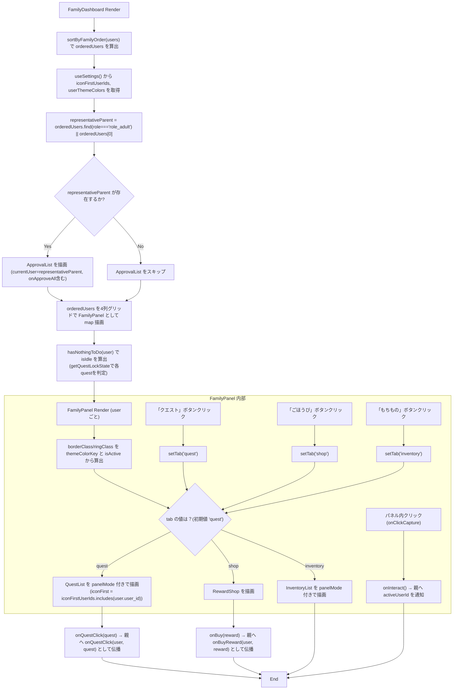

## 1. 解析メタ情報

| 項目 | 内容 |
| --- | --- |
| 対象ファイル | FamilyDashboard.tsx |
| 言語 | React (TypeScript) |
| 解析対象 | 提供されたコードのみ |
| 推測・補完 | 一切なし |

## 関連ドキュメント

* [./UserStatusCard.md](./UserStatusCard.md) - 各パネル上部のユーザーステータス表示コンポーネント
* [../../quest/components/QuestList.md](../../quest/components/QuestList.md) - パネル内クエスト一覧表示コンポーネント（`panelMode`/`iconFirst`付き）
* [../../quest/components/ApprovalList.md](../../quest/components/ApprovalList.md) - メイン画面上部の承認待ち一覧表示コンポーネント（`onApproveAll`含む）
* [../../quest/hooks/useQuestStatus.md](../../quest/hooks/useQuestStatus.md) - `getQuestLockState`の実装元。「今日やることがあるか」の判定に使用
* [../../shop/components/RewardShop.md](../../shop/components/RewardShop.md) - パネル内「ごほうび」タブの表示コンポーネント
* [../../shop/components/InventoryList.md](../../shop/components/InventoryList.md) - パネル内「もちもの」タブの表示コンポーネント（`panelMode`付き）
* [../../../types/index.md](../../../types/index.md) - `User`/`Quest`/`QuestHistory`/`Reward`/`PendingInventory`型の定義元
* [../../../../App.md](../../../../App.md) - 呼び出し元（横画面レイアウト時のメイン表示コンポーネントとして使用）

## 2. ファイルの概要

横画面（Echo Show 15等の常設デバイス）用のメインレイアウトコンポーネント`FamilyDashboard`と、その内部で使われるユーザー単位のパネルコンポーネント`FamilyPanel`を定義する。パパ・ママ・兄・妹（`FAMILY_ORDER`で固定された順序）を1行4列のグリッドで常時表示し、各パネル内でそのユーザーのステータスと、クエスト/ごほうび/もちものの3タブの内容が完結する（別画面への誘導をしない）。親向けの承認機能は独立画面を持たず、メイン画面上部に常時統合表示される。テーマカラーは`useSettings`から取得し、直前に操作したパネルのみリング（強調枠）でハイライトする。

* 根拠: コンポーネント直前のコメント (行番号: 44〜47 / 抜粋: "// 横画面(Echo Show 15等の常設デバイス)用メインレイアウト。\n// パパ・ママ・兄・妹を1行4列で常時表示し、各パネル内でその人のステータスと\n// その日のクエスト一覧が完結する(別画面への誘導をしない)。親向けの承認機能は\n// 独立画面を持たず、このメイン画面上部に常時統合表示する。")
* 根拠: `FamilyDashboard`関数定義 (行番号: 48 / 抜粋: "const FamilyDashboard: React.FC<FamilyDashboardProps> = ({")
* 根拠: `FamilyPanel`関数定義およびタブ状態 (行番号: 132, 136 / 抜粋: "const FamilyPanel: React.FC<FamilyPanelProps> = ({", "const [tab, setTab] = useState<'quest' | 'shop' | 'inventory'>('quest');")
* 根拠: バグ修正コメント（テーマカラーとリングの分離） (行番号: 138〜141 / 抜粋: "// ★バグ修正: 以前はテーマカラーを isActive(直前に操作したパネル)の時だけ適用していたため、\n    // 設定画面で色を選んでも、操作するまでメイン画面(横画面)に何も反映されなかった。\n    // パネルの縁取りは常にそのユーザーのテーマカラーを表示し、リング(強調枠)だけを\n    // 「直前に操作した」ことの一時的なハイライトとして使う。")

## 3. 外部依存関係

### インポート一覧

| 名称 | 種類 | 用途 | 根拠 |
| --- | --- | --- | --- |
| `React`, `useState` | ライブラリ | コンポーネント定義とパネルごとのタブ状態・直前操作パネルの状態管理 | `import React, { useState } from 'react';` (行番号: 1) |
| `Sword`, `ShoppingBag`, `Package` | アイコンコンポーネント | パネル内タブ（クエスト/ごほうび/もちもの）ボタンのアイコン表示 | `import { Sword, ShoppingBag, Package } from 'lucide-react';` (行番号: 2) |
| `User`, `Quest`, `QuestHistory`, `Reward`, `PendingInventory` | 型定義 | Propsおよび内部変数の型指定 | `import { User, Quest, QuestHistory, Reward, PendingInventory } from '@/types';` (行番号: 3) |
| `UserStatusCard` | コンポーネント | 各パネル上部のユーザーステータス表示 | `import UserStatusCard from './UserStatusCard';` (行番号: 4) |
| `QuestList` | コンポーネント | パネル内のクエスト一覧表示（`panelMode`/`iconFirst`付き） | `import QuestList from '../../quest/components/QuestList';` (行番号: 5) |
| `ApprovalList` | コンポーネント | メイン画面上部の承認待ち一覧表示 | `import ApprovalList from '../../quest/components/ApprovalList';` (行番号: 6) |
| `RewardShop` | コンポーネント | パネル内「ごほうび」タブの表示 | `import RewardShop from '../../shop/components/RewardShop';` (行番号: 7) |
| `InventoryList` | コンポーネント | パネル内「もちもの」タブの表示（`panelMode`固定） | `import { InventoryList } from '../../shop/components/InventoryList';` (行番号: 8) |
| `useSettings` | フック | テーマ設定（アイコン優先ユーザー、ユーザーごとのテーマカラー）の取得 | `import { useSettings } from '@/context/useSettings';` (行番号: 9) |
| `THEME_BORDER_CLASSES`, `THEME_RING_CLASSES` | 定数オブジェクト | テーマカラーキーに対応するボーダー/リングのTailwindクラス名解決 | `import { THEME_BORDER_CLASSES, THEME_RING_CLASSES } from '@/context/settingsShared';` (行番号: 10) |
| `getQuestLockState` | 関数 | クエストのロック状態・完了状態を判定し、パネルの「今日やることがない」判定に使用 | `import { getQuestLockState } from '../../quest/hooks/useQuestStatus';` (行番号: 11) |

### ブラックボックスとなる外部要素

| 名称 | 理由 | 根拠 |
| --- | --- | --- |
| `UserStatusCard`, `QuestList`, `ApprovalList`, `RewardShop`, `InventoryList` | 実装ファイルが本タスクでは提供されておらず（`InventoryList`のみ別ファイルとして解析済みだが、本ファイル側では利用箇所の観測のみ）、内部のレンダリング内容や副作用の全容は本ファイル単体からは不明 | インポート文 (行番号: 4〜8) |
| `useSettings` | `@/context/useSettings`に実装があり、`iconFirstUserIds`/`userThemeColors`をどのように算出・永続化しているかが本ファイルからは不明 | `import { useSettings } from '@/context/useSettings';` (行番号: 9) |
| `THEME_BORDER_CLASSES`, `THEME_RING_CLASSES` | `@/context/settingsShared`に定義された定数オブジェクトであり、取りうるキーの全容が本ファイルからは不明 | `import { THEME_BORDER_CLASSES, THEME_RING_CLASSES } from '@/context/settingsShared';` (行番号: 10) |
| `getQuestLockState` | `../../quest/hooks/useQuestStatus`に実装があり、ロック判定・完了判定の詳細ロジックは本ファイルからは呼び出し結果の型（`isLocked`/`isDone`）のみ確認可能 | `import { getQuestLockState } from '../../quest/hooks/useQuestStatus';` (行番号: 11) |
| `@/types` の各型 (`User`, `Quest`, `QuestHistory`, `Reward`, `PendingInventory`) | プロパティの完全な構造が本ファイル内では定義されていないため | `import { User, Quest, QuestHistory, Reward, PendingInventory } from '@/types';` (行番号: 3) |

## 4. 主要要素の定義（関数 / エンドポイント / コンポーネント）

### `FAMILY_ORDER` (モジュールレベル定数)

* **役割**: パパ・ママ・兄・妹の表示順を固定するための`user_id`配列。権限判定(`quest_users.role`)とは別の「画面上の並び順」の関心事のため、ここでのみ`user_id`を直接使う旨がコメントで明記されている。
* 根拠: (行番号: 13〜16 / 抜粋: "// 表示順(パパ・ママ・兄・妹)を固定するための並び替えキー(要件5)。\n// 権限判定(quest_users.role)とは別の「画面上の並び順」の関心事のため、ここでのみ\n// user_id を直接使う(Family Questの家族構成は固定のため妥当と判断)。\nconst FAMILY_ORDER = ['dad', 'mom', 'son', 'daughter'];")


### `sortByFamilyOrder` (モジュールレベル関数)

* **役割**: `users`配列を`FAMILY_ORDER`のインデックス順に並び替える。`FAMILY_ORDER`に含まれないユーザーは末尾（インデックス-1同士は順序維持、片方のみ-1なら-1側が後ろ）に配置される。
* 根拠: (行番号: 18〜27 / 抜粋: "function sortByFamilyOrder(users: User[]): User[] {\n    return [...users].sort((a, b) => {\n        const ia = FAMILY_ORDER.indexOf(a.user_id);\n        const ib = FAMILY_ORDER.indexOf(b.user_id);\n        if (ia === -1 && ib === -1) return 0;\n        if (ia === -1) return 1;\n        if (ib === -1) return -1;\n        return ia - ib;\n    });\n}")
* **引数/リクエスト**: `users: User[]`
* **戻り値/レスポンス**: `User[]`（元配列を破壊せず`[...users]`のコピーをソート）
* **副作用**: なし
* **エラーハンドリング**: なし


### `FamilyDashboardProps` (型定義)

* **役割**: `FamilyDashboard`コンポーネントが受け取るPropsの型定義。
* 根拠: (行番号: 29〜42 / 抜粋: "interface FamilyDashboardProps {\n    users: User[];\n    quests: Quest[];\n    completedQuests: QuestHistory[];\n    pendingQuests: QuestHistory[];\n    rewards: Reward[];\n    pendingInventory: PendingInventory[];\n    onQuestClick: (user: User, quest: Quest) => void;\n    onBuyReward: (user: User, reward: Reward) => void;\n    onApprove: (history: QuestHistory) => void;\n    onReject: (history: QuestHistory) => void;\n    onApproveAll: () => void;\n    onAvatarClick: (user: User) => void;\n}")


### `FamilyDashboard`

* **役割**: `users`を`sortByFamilyOrder`で並び替え、代表の親（`role === 'role_adult'`、無ければ先頭）を`ApprovalList`の`currentUser`として渡して承認バーを表示したのち、並び替え済みユーザーごとに`FamilyPanel`をグリッド表示する。承認バーの記録名義は「親」で固定し、実際にどちらの親が画面をタップしたかは区別しない（要件5）。直前に操作したパネルのIDを`activeUserId`として保持し、各`FamilyPanel`へ渡す。各ユーザーについて`hasNothingToDo`で「今日やることが1件もないか」を判定し`isIdle`として渡す。
* 根拠: (行番号: 48〜114 / 抜粋: "const FamilyDashboard: React.FC<FamilyDashboardProps> = ({")
* 根拠: 代表の親のコメント (行番号: 54〜56 / 抜粋: "// 承認バーの記録名義は「親」で固定し、実際に画面をタップしたのがどちらの親かは\n    // 区別しない(要件5: 現状も厳密なセキュリティ境界ではないための最もシンプルな方式)。\n    const representativeParent = orderedUsers.find(u => u.role === 'role_adult') || orderedUsers[0];")
* 根拠: `activeUserId`のコメント (行番号: 58〜60 / 抜粋: "// 角度⑥: 直前に操作したパネルを枠でハイライトし、常時4人表示でも\n    // 「今どこを触っているか」が一目でわかるようにする。\n    const [activeUserId, setActiveUserId] = useState<string | null>(null);")


* **引数/リクエスト**: `FamilyDashboardProps`
* 根拠: (行番号: 48〜51 / 抜粋: "const FamilyDashboard: React.FC<FamilyDashboardProps> = ({\n    users, quests, completedQuests, pendingQuests, rewards, pendingInventory,\n    onQuestClick, onBuyReward, onApprove, onReject, onApproveAll, onAvatarClick,\n}) => {")


* **戻り値/レスポンス**: JSX.Element
* 根拠: (行番号: 78〜113 / 抜粋: "return (\n        <div className=\"flex flex-col gap-4 animate-in fade-in duration-300\">")


* **副作用**: `activeUserId`ローカルステートの更新（`onInteract`経由）。それ以外は描画のみで、実際の副作用は`onQuestClick`/`onBuyReward`/`onApprove`/`onReject`/`onApproveAll`/`onAvatarClick`のコールバック経由で親コンポーネントに委譲される。
* 根拠: (行番号: 60, 105 / 抜粋: "const [activeUserId, setActiveUserId] = useState<string | null>(null);", "onInteract={() => setActiveUserId(user.user_id)}")


* **エラーハンドリング**: `representativeParent`が存在する場合のみ`ApprovalList`を描画する（`orderedUsers`が空配列で`representativeParent`が`undefined`になった場合は`ApprovalList`を描画しない）。
* 根拠: (行番号: 80 / 抜粋: "{representativeParent && (")


### `hasNothingToDo` (FamilyDashboardコンポーネント内部関数)

* **役割**: 指定した`user`について、対象（`target`が`all`/未指定、`role_`プレフィックス一致、または`user_id`一致）となる`quests`のうち、`getQuestLockState`で`isLocked`かつ`isDone`のいずれでもない（＝「今やれる状態のクエスト」が）1件でも存在するかを判定し、存在しない場合に`true`（今日やることがない）を返す。
* 根拠: (行番号: 62〜76 / 抜粋: "const hasNothingToDo = (user: User) => {\n        return !quests.some(q => {\n            if (q.target && q.target !== 'all') {\n                if (q.target.startsWith('role_')) {\n                    if (user.role !== q.target) return false;\n                } else if (q.target !== user.user_id) {\n                    return false;\n                }\n            }\n            const { isLocked, isDone } = getQuestLockState(q, user, completedQuests, pendingQuests);\n            return !isLocked && !isDone;\n        });\n    };")


* **引数/リクエスト**: `user: User`
* **戻り値/レスポンス**: `boolean`
* **副作用**: なし（外部関数`getQuestLockState`の呼び出しのみ）
* **エラーハンドリング**: なし


### `FamilyPanelProps` (型定義)

* **役割**: `FamilyPanel`コンポーネントが受け取るPropsの型定義。
* 根拠: (行番号: 116〜130 / 抜粋: "interface FamilyPanelProps {\n    user: User;\n    quests: Quest[];\n    completedQuests: QuestHistory[];\n    pendingQuests: QuestHistory[];\n    rewards: Reward[];\n    iconFirst: boolean;\n    isActive: boolean;\n    themeColorKey?: keyof typeof THEME_BORDER_CLASSES;\n    isIdle: boolean;\n    onInteract: () => void;\n    onQuestClick: (quest: Quest) => void;\n    onBuyReward: (reward: Reward) => void;\n    onAvatarClick: () => void;\n}")


### `FamilyPanel`

* **役割**: 1ユーザー分のパネルを描画する。パネルのボーダー色は常に`themeColorKey`（あれば`THEME_BORDER_CLASSES`、無ければ`isActive`時`border-yellow-400`／それ以外`border-gray-700`）を反映し、リング（強調枠）は`isActive`の時のみ付与する。`isIdle`の場合はパネル全体に`opacity-70`を適用する。パネル上部に`UserStatusCard`、その下にタブ切替（`quest`/`shop`/`inventory`、Echo Show 15でのタッチ操作を想定し44px以上のタップ領域を確保、アイコンのみ表示）、下部に選択中タブに応じて`QuestList`（`panelMode`固定、`iconFirst`はProps経由）、`RewardShop`、または`InventoryList`（`panelMode`固定）を表示する。コンテンツ領域はパネルごとに独立スクロール（`max-h-[60vh] overflow-y-auto`）を持つ。パネル内のどこかをクリックすると`onInteract`（`onClickCapture`）が発火する。
* 根拠: (行番号: 132〜214 / 抜粋: "const FamilyPanel: React.FC<FamilyPanelProps> = ({")
* 根拠: ボーダー/リングのバグ修正コメント (行番号: 138〜141)
* 根拠: 独立スクロールのコメント (行番号: 188 / 抜粋: "{/* パネルごとに独立スクロール(要件5) */}")
* 根拠: タブ切替コメント (行番号: 158〜160 / 抜粋: "{/* タブ切替: Echo Show 15でのタッチ操作を想定し、タップ領域を大きめに確保。\n                ★バグ修正: ごほうび画面へのもちもの統合をやめ、クエスト/ごほうび/もちものの3タブに戻す。\n                テキストは不要のためアイコンのみ表示する(aria-labelで読み上げは維持) */}")
* 根拠: `onClickCapture={onInteract}` (行番号: 151)


* **引数/リクエスト**: `FamilyPanelProps`
* 根拠: (行番号: 132〜135 / 抜粋: "const FamilyPanel: React.FC<FamilyPanelProps> = ({\n    user, quests, completedQuests, pendingQuests, rewards, iconFirst, isActive, themeColorKey, isIdle,\n    onInteract, onQuestClick, onBuyReward, onAvatarClick,\n}) => {")


* **戻り値/レスポンス**: JSX.Element
* 根拠: (行番号: 149〜213 / 抜粋: "return (\n        <div\n            onClickCapture={onInteract}")


* **副作用**: `tab`ローカルステート（`'quest' | 'shop' | 'inventory'`、初期値`'quest'`）の更新。`onInteract`の呼び出しによる親（`FamilyDashboard`）側の`activeUserId`更新。
* 根拠: (行番号: 136 / 抜粋: "const [tab, setTab] = useState<'quest' | 'shop' | 'inventory'>('quest');")


* **エラーハンドリング**: なし


## 5. 処理フロー図



## 6. 依存関係図

```mermaid
graph TD
    FamilyDashboard["FamilyDashboard (Component)"]
    FamilyPanel["FamilyPanel (Component, 同一ファイル内)"]
    sortByFamilyOrder["sortByFamilyOrder (関数)"]
    hasNothingToDo["hasNothingToDo (関数, 内部)"]

    UI_UserStatusCard["UserStatusCard (ブラックボックス)"]
    UI_QuestList["QuestList (../../quest/components/QuestList)"]
    UI_ApprovalList["ApprovalList (../../quest/components/ApprovalList)"]
    UI_RewardShop["RewardShop (../../shop/components/RewardShop)"]
    UI_InventoryList["InventoryList (../../shop/components/InventoryList)"]

    Hook_useSettings["useSettings (@/context/useSettings)"]
    Const_settingsShared["THEME_BORDER_CLASSES/THEME_RING_CLASSES (@/context/settingsShared)"]
    Hook_useQuestStatus["getQuestLockState (../../quest/hooks/useQuestStatus)"]

    Types["@/types (User, Quest, QuestHistory, Reward, PendingInventory)"]

    FamilyDashboard -->|import| Types
    FamilyDashboard --> sortByFamilyOrder
    FamilyDashboard --> hasNothingToDo
    FamilyDashboard --> Hook_useSettings
    FamilyDashboard --> UI_ApprovalList
    hasNothingToDo --> Hook_useQuestStatus
    FamilyDashboard -->|Render (userごと)| FamilyPanel

    FamilyPanel --> UI_UserStatusCard
    FamilyPanel --> Const_settingsShared
    FamilyPanel -->|tab==='quest'| UI_QuestList
    FamilyPanel -->|tab==='shop'| UI_RewardShop
    FamilyPanel -->|tab==='inventory'| UI_InventoryList
    FamilyPanel -->|import| Types

```

## 7. 次のステップ（リバースエンジニアリングの提案）

| 優先度 | ファイル名(推測可) | 理由 | 根拠 |
| --- | --- | --- | --- |
| 高 | `./UserStatusCard.tsx` | 各パネル上部のユーザーステータス表示の内部実装（`onAvatarClick`の扱い方等）を把握するため。 | `import UserStatusCard from './UserStatusCard';` (行番号: 4) |
| 高 | `@/context/useSettings` および `@/context/settingsShared` | `iconFirstUserIds`/`userThemeColors`の算出方法と、`THEME_BORDER_CLASSES`/`THEME_RING_CLASSES`が取りうる全キーを把握するため。 | `import { useSettings } from '@/context/useSettings';` (行番号: 9), `import { THEME_BORDER_CLASSES, THEME_RING_CLASSES } from '@/context/settingsShared';` (行番号: 10) |
| 中 | `../../quest/hooks/useQuestStatus.ts` | `getQuestLockState`の判定ロジック（`isLocked`/`isDone`の算出条件）を把握し、`hasNothingToDo`の正確な意味を確認するため。 | `import { getQuestLockState } from '../../quest/hooks/useQuestStatus';` (行番号: 11) |
| 中 | `../../quest/components/ApprovalList.tsx` | メイン画面上部に常時統合表示される承認機能（`onApproveAll`含む）の内部実装を把握するため。 | `import ApprovalList from '../../quest/components/ApprovalList';` (行番号: 6) |
| 低 | `@/types` | `User`の`role`/`user_id`や`Quest`/`Reward`の詳細なスキーマを把握するため。 | `import { User, Quest, QuestHistory, Reward, PendingInventory } from '@/types';` (行番号: 3) |

## 8. 保守上の注意点

* **`FAMILY_ORDER`のハードコード**: 表示順序を固定するために`user_id`（`'dad'`, `'mom'`, `'son'`, `'daughter'`）を直接使用している。コメントにより「Family Questの家族構成は固定のため妥当」と明記されているが、家族構成が変わった場合はこの配列を変更する必要がある。
* 根拠: (行番号: 13〜16 / 抜粋: "// 表示順(パパ・ママ・兄・妹)を固定するための並び替えキー(要件5)。")
* **アイコン優先表示の外部化**: 以前はモジュール定数`ICON_FIRST_USER_IDS`でハードコードされていたが、現在は`useSettings()`から取得する`iconFirstUserIds`に置き換えられ、設定画面側で管理される構成になっている。
* 根拠: (行番号: 52, 101 / 抜粋: "const { iconFirstUserIds, userThemeColors } = useSettings();", "iconFirst={iconFirstUserIds.includes(user.user_id)}")
* **テーマカラーとハイライトリングの分離（バグ修正済み）**: パネルのボーダー色は常にそのユーザーのテーマカラー（`themeColorKey`）を反映し、リング（強調枠）だけを「直前に操作した」ことの一時的なハイライトとして使う設計に変更された。以前はテーマカラーが`isActive`時のみ適用されていたため、設定画面で色を選んでも操作するまで反映されないという不具合があった。
* 根拠: (行番号: 138〜147)
* **タブ構成の再変更（バグ修正済み）**: 一時的にごほうび画面へ「もちもの」を統合していたが、クエスト/ごほうび/もちものの3タブ構成に戻された。
* 根拠: (行番号: 159 / 抜粋: "★バグ修正: ごほうび画面へのもちもの統合をやめ、クエスト/ごほうび/もちものの3タブに戻す。")
* **パネルごとに独立したタブ状態**: 各`FamilyPanel`は`tab`ステートを個別に持つため、あるユーザーのパネルで「ごほうび」タブを開いていても他ユーザーのパネルには影響しない。
* 根拠: (行番号: 136 / 抜粋: "const [tab, setTab] = useState<'quest' | 'shop' | 'inventory'>('quest');")
* **承認バーの代表親固定**: `ApprovalList`に渡す`currentUser`は常に`representativeParent`（`role_adult`の先頭、無ければ配列先頭）であり、実際にどちらの親が操作したかはUIレベルでは区別されない。
* 根拠: (行番号: 54〜56)
* **アイドル表示の視覚的優先度低下**: `hasNothingToDo`が`true`のユーザーのパネルには`opacity-70`が適用され、パネル自体は表示され続けるが視線誘導の優先度が下がる。
* 根拠: (行番号: 62〜63, 152 / 抜粋: "// 今日やることが1件もない人は、パネル自体は残しつつ視覚的な優先度を下げる", "${isIdle ? 'opacity-70' : ''}")

## 9. 不明事項一覧

| 項目 | 理由 | 必要なファイル |
| --- | --- | --- |
| `UserStatusCard`の内部実装 | Propsとして`user`と`onAvatarClick`を渡していることのみが本ファイルから読み取れ、内部の描画内容が不明なため。 | `./UserStatusCard.tsx` |
| `useSettings`/`settingsShared`の内部実装 | `iconFirstUserIds`/`userThemeColors`/`THEME_BORDER_CLASSES`/`THEME_RING_CLASSES`の算出方法・取りうる全キーが本ファイルからは不明なため。 | `@/context/useSettings`, `@/context/settingsShared` |
| `getQuestLockState`の判定ロジック | `isLocked`/`isDone`の具体的な算出条件が本ファイルからは呼び出し結果の利用箇所しか分からないため。 | `../../quest/hooks/useQuestStatus.ts` |
| `ApprovalList`の内部実装 | `pendingQuests`/`pendingItems`/`users`/`currentUser`/`onApproveAll`をどう描画し、`onApprove`/`onReject`をどう発火させるかが不明なため。 | `../../quest/components/ApprovalList.tsx` |
| `RewardShop`/`InventoryList`の内部実装 | パネル内「ごほうび」「もちもの」タブの描画内容・操作フローの詳細が不明なため。 | `../../shop/components/RewardShop.tsx`, `../../shop/components/InventoryList.tsx` |
| `User.role`の取りうる値の全容 | `'role_adult'`以外の値（子ども側の`role`文字列）が本ファイルからは特定できないため。 | `@/types` |

## 相互参照による補足情報

| 元の不明事項 | 判明した内容 | 参照元ドキュメント |
| --- | --- | --- |
| `UserStatusCard`の内部実装 | `UserStatusCard.md`の解析によれば、`UserStatusCard`は`user`が渡されない場合`null`を返し、次レベルまでのEXP・EXP進捗率をフロント側で計算する一方、HP・ゴールド・メダル数を`CountUp`でアニメーション表示し、アバタークリックで`onAvatarClick(user)`を呼び出すとされている。ただしこれは`UserStatusCard.md`側の解析結果からの補足であり、`UserStatusCard.tsx`のソースコード自体は本ファイルの解析時点では確認していない。 | ./UserStatusCard.md |
| `InventoryList`の内部実装 | 本タスクで`InventoryList.tsx`自体を解析した結果によれば、`InventoryList`は`userId`と`panelMode`をPropsとして受け取り、`panelMode`時はグリッドを1カラムに固定してアイコンサイズを縮小する。所持アイテムを一覧表示し、`isOwned`なアイテムはカード自体のクリックで「つかう」確認モーダルを開き、`isPending`なアイテムには「やめる」ボタンを表示する。これは`InventoryList.tsx`の直接解析結果であり、確定情報である。 | ./InventoryList.md（本セッションで同時解析） |
| `User.role`の取りうる値の全容 | `types/index.md`の解析でも`role`フィールドが取りうる全ての文字列値までは明記されていないが、`App.md`の解析によれば`isParentUser`関数が`user.role === 'role_adult'`で保護者判定を行っているとされており、少なくとも`'role_adult'`が実在の値であることは複数ドキュメントの記載から確認できる。子ども側の具体的な値（`'role_child'`等）は依然として特定できていない。 | ../../../types/index.md, ../../../../App.md |

## 10. 自己検証結果

* [x] 完了: 推測・外部ファイルの仕様を一切含んでいない
* [x] 完了: 全関数・全クラス・全コンポーネントを列挙した
* [x] 完了: 全てのインポート要素を列挙した
* [x] 完了: すべての仕様説明に「根拠（行番号・抜粋）」を明記した
* [x] 完了: 根拠漏れが0件である
* [x] 完了: Mermaid構文にエラーの原因となる記号（エスケープ漏れ）がない
* [x] 完了: 不明事項を漏れなく列挙した
