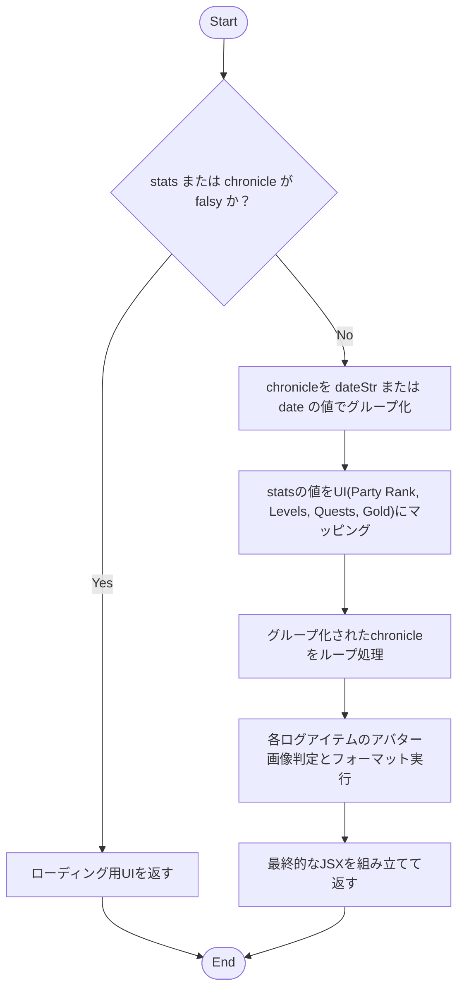
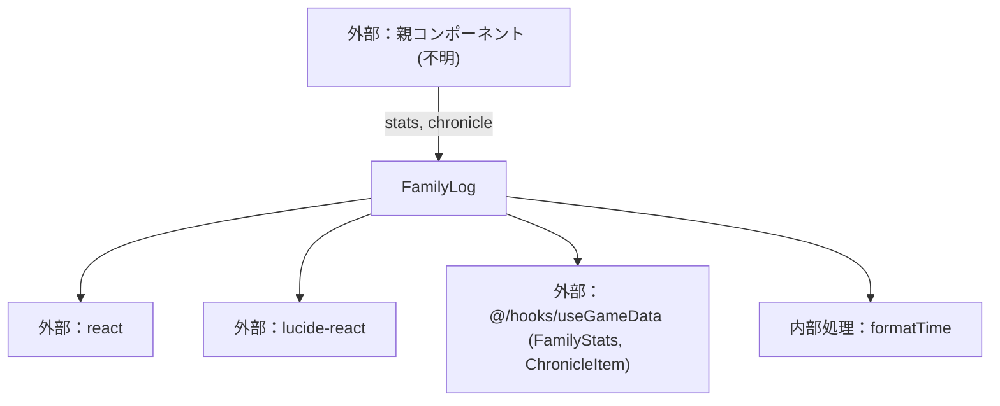

## 1. 解析メタ情報

| 項目 | 内容 |
| --- | --- |
| 対象ファイル | FamilyLog.tsx |
| 言語 | React (TypeScript) |
| 解析対象 | 提供されたコードのみ |
| 推測・補完 | 一切なし |

## 関連ドキュメント

* [../../../hooks/useGameData.md](../../../hooks/useGameData.md) - `FamilyStats`/`ChronicleItem`型のインポート元、`stats`/`chronicle`データの取得元
* [../../../../App.md](../../../../App.md) - 呼び出し元（`viewMode === 'familyLog'`時に本コンポーネントを描画）

## 2. ファイルの概要

* 家族のステータス情報（ランク、レベル、クエスト数、所持金）および冒険の記録（タイムライン形式のログ）を描画・表示するためのReactコンポーネントである。
* 親コンポーネントから渡されたログデータを日付ごとにグループ化し、日本時間でフォーマットした上でUIとして出力する。

## 3. 外部依存関係

### インポート一覧

| 名称 | 種類 | 用途 | 根拠 |
| --- | --- | --- | --- |
| `React` | ライブラリ | Reactコンポーネントの定義のため | 根拠: [インポート宣言] (行番号: 1 / 抜粋: "import React from 'react';") |
| `Trophy`, `Coins`, `History`, `Clock` | ライブラリ (`lucide-react`) | UI上のアイコン描画のため | 根拠: [インポート宣言] (行番号: 2 / 抜粋: "import { Trophy, Coins, Histo...") |
| `FamilyStats`, `ChronicleItem` | 型定義 (`@/hooks/useGameData`) | コンポーネントのProps（`stats`, `chronicle`）の型指定 | 根拠: [インポート宣言] (行番号: 3 / 抜粋: "import { FamilyStats, Chronic...") |

### ブラックボックスとなる外部要素

| 名称 | 理由 | 根拠 |
| --- | --- | --- |
| `FamilyStats`, `ChronicleItem` | `@/hooks/useGameData` に定義されているため、本ファイルからは全プロパティ（必須・任意）や型定義の全容が把握不可。 | 根拠: [インポート宣言] (行番号: 3 / 抜粋: "import { FamilyStats, Chronic...") |
| 親コンポーネント | このコンポーネントを呼び出し、`stats` および `chronicle` のPropsを提供する要素の実装が不明。 | 根拠: [引数定義] (行番号: 10 / 抜粋: "const FamilyLog: React.FC<Fami...") |
| 画像ホスティング環境 | アバター画像のURLが `/uploads` または `http` で始まることを前提とした判定があるが、実際の配信元環境や構成は不明。 | 根拠: [isImage判定] (行番号: 69 / 抜粋: "const isImage = avatarSrc && (...") |

## 4. 主要要素の定義（関数 / エンドポイント / コンポーネント）

### `FamilyLog`

* **役割**: 家族の統計情報と日付ごとのログをタイムラインとして描画する。
* 根拠: [FamilyLog] (行番号: 10〜113 / 抜粋: "const FamilyLog: React.FC<Fami...")

* **引数/リクエスト**: `FamilyLogProps` (`stats`: `FamilyStats | null`, `chronicle`: `ChronicleItem[]`)
* 根拠: [FamilyLogProps] (行番号: 5〜8 / 抜粋: "interface FamilyLogProps {...")

* **戻り値/レスポンス**: JSX.Element
* 根拠: [FamilyLog] (行番号: 28〜112 / 抜粋: "return ( <div className="space...")

* **副作用**: なし
* 根拠: [FamilyLog] (行番号: 10〜113 / 抜粋: "const FamilyLog: React.FC<Fami...")

* **エラーハンドリング**: `stats` または `chronicle` が falsy な場合、読み込み中のメッセージを返す。
* 根拠: [FamilyLog] (行番号: 11 / 抜粋: "if (!stats || !chronicle) retu...")

### `formatTime`

* **役割**: 渡されたタイムスタンプを日本時間の `HH:mm` 形式の文字列に変換する。
* 根拠: [formatTime] (行番号: 22〜26 / 抜粋: "const formatTime = (ts: string...")

* **引数/リクエスト**: `ts` (string | number | undefined)
* 根拠: [formatTime] (行番号: 22 / 抜粋: "const formatTime = (ts: string...")

* **戻り値/レスポンス**: string
* 根拠: [formatTime] (行番号: 25 / 抜粋: "return date.toLocaleTimeString...")

* **副作用**: なし
* 根拠: [formatTime] (行番号: 22〜26 / 抜粋: "const formatTime = (ts: string...")

* **エラーハンドリング**: 引数 `ts` が falsy な場合は空文字列を返す。
* 根拠: [formatTime] (行番号: 23 / 抜粋: "if (!ts) return '';")

## 5. 処理フロー図

## 6. 依存関係図

## 7. 次のステップ（リバースエンジニアリングの提案）

| 優先度 | ファイル名(推測可) | 理由 | 根拠 |
| --- | --- | --- | --- |
| 高 | `@/hooks/useGameData` | `FamilyStats`, `ChronicleItem` の完全なスキーマを把握し、`stats`と`chronicle`の具体的なデータ構造を確認するため。 | 根拠: [インポート宣言] (行番号: 3 / 抜粋: "import { FamilyStats, Chronic...") |
| 中 | 親コンポーネント (例: `App.tsx` またはページコンポーネント) | `stats`と`chronicle`の取得元（API通信など）を把握するため。 | 根拠: [Props定義] (行番号: 5〜8 / 抜粋: "interface FamilyLogProps {...") |
| 中 | APIクライアント / サービス層のファイル | `chronicle`配列内のオブジェクトが持つ一貫性のないプロパティ（`dateStr`と`date`、`text`と`message`など）の生成元を特定するため。 | 根拠: [プロパティ参照] (行番号: 15, 89 / 抜粋: "const date = item.dateStr |

## 8. 保守上の注意点

* `stats` は `FamilyStats | null`、`chronicle` は `ChronicleItem[]`（いずれも `@/hooks/useGameData` からインポート）として型付けされているが、これらの型定義の実体は本ファイルにはなく、`@/hooks/useGameData` に依存する。
* 根拠: [Props定義] (行番号: 3, 5〜8 / 抜粋: "import { FamilyStats, Chronic...")

* `chronicle` の各要素において、プロパティ名に複数のパターン（例: `dateStr` と `date`、`userAvatar` と `avatar_url`、`text` と `message`、`exp` と `reward_exp`）が混在しており、フォールバック（`||`）による評価が行われている。型定義上は両方のプロパティが許容されていると推測されるが、これは移行期間中の仕様が混在している兆候である可能性がある。
* 根拠: [プロパティ評価] (行番号: 15, 68, 89, 97 / 抜粋: "const date = item.dateStr || i...")

* アバター画像かどうかの判定に、文字列の先頭一致（`startsWith('/uploads')` または `startsWith('http')`）を用いているため、ホスティング先やURLの仕様が変更された場合に表示が崩れる可能性がある。
* 根拠: [isImage判定] (行番号: 69 / 抜粋: "const isImage = avatarSrc && (...")

## 9. 不明事項一覧

| 項目 | 理由 | 必要なファイル |
| --- | --- | --- |
| `FamilyStats`の厳密なスキーマ | `@/hooks/useGameData` からインポートされた型であり、コード内でのプロパティ参照（`partyRank`, `totalLevel`, `totalQuests`, `totalGold`）以外に含まれるデータが不明なため。 | `@/hooks/useGameData` |
| `ChronicleItem`の厳密なスキーマ | `@/hooks/useGameData` からインポートされた型であり、オブジェクトに混在する複数パターンのプロパティの正規の仕様が不明なため。 | `@/hooks/useGameData` |

## 相互参照による補足情報

| 元の不明事項 | 判明した内容 | 参照元ドキュメント |
| --- | --- | --- |
| `FamilyStats`/`ChronicleItem`の厳密なスキーマ | `useGameData.md`の解析によれば、`useGameData`フックは`familyStats`と`chronicle`を含むデータ群を返すオブジェクトを提供するとされているが、`useGameData.md`本文中に`FamilyStats`/`ChronicleItem`インターフェース自体の詳細なプロパティ一覧は記載されておらず、フィールドの存在自体は裏付けられるものの、厳密なスキーマ（各プロパティの型・必須/任意）は`useGameData.md`側の解析結果からも判明していない。ただしこれは`useGameData.md`側の解析結果からの補足であり、`useGameData.ts`のソースコード自体は本ファイルの解析時点では確認していない。 | ../../../hooks/useGameData.md |

## 10. 自己検証結果

* [x] 推測・外部ファイルの仕様を一切含んでいない
* [x] 全関数・全クラス・全コンポーネントを列挙した
* [x] 全てのインポート要素を列挙した
* [x] すべての仕様説明に「根拠（行番号・抜粋）」を明記した
* [x] 根拠漏れが0件である
* [x] Mermaid構文にエラーの原因となる記号（エスケープ漏れ）がない
* [x] 不明事項を漏れなく列挙した

完了