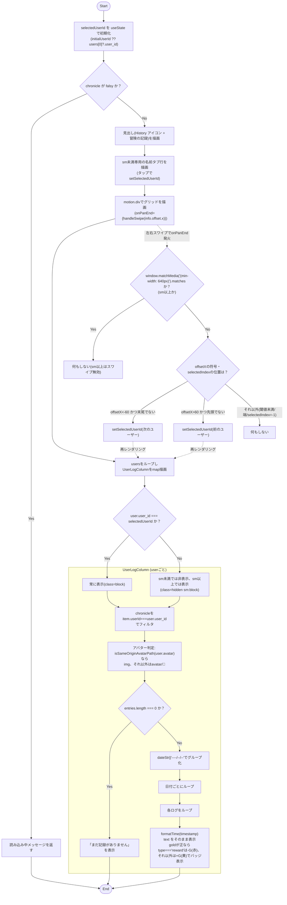
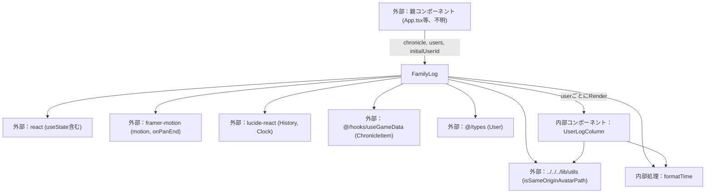

## 1. 解析メタ情報

| 項目 | 内容 |
| --- | --- |
| 対象ファイル | FamilyLog.tsx |
| 言語 | React (TypeScript) |
| 解析対象 | 提供されたコードのみ |
| 推測・補完 | 一切なし |
| 解析基準コミット | `12dc2f1` |

## 関連ドキュメント

* [../../../hooks/useGameData.md](../../../hooks/useGameData.md) - `ChronicleItem`型のインポート元、`chronicle`データの取得元
* [../../../types/index.md](../../../types/index.md) - `User`型のインポート元
* [../../../lib/utils.md](../../../lib/utils.md) - `isSameOriginAvatarPath`（アバターURLの自ドメイン判定ヘルパー）の実装元
* [../../../../App.md](../../../../App.md) - 呼び出し元（`viewMode === 'familyLog'`時に本コンポーネントを描画）

## 2. ファイルの概要

冒険の記録（タイムライン形式のログ）を、ユーザーごとの列（カラム）に分けて並べて表示するReactコンポーネントである。以前はタブで1人ずつ切り替える形式だったが、ホーム画面（横画面の4人並びパネル）と同様に最初から全員分を並べて表示する構成に変更されており、家族の総力（パーティランク・総レベルなど）の集計表示は廃止されている。親コンポーネントから渡された`chronicle`配列を各ユーザーの`user_id`でフィルタリングしたうえで、日付ごとにグループ化して日本時間でフォーマットし、UIとして出力する。

**（改善）** スマホ幅（Tailwindの`sm`未満、640px未満）では上記の全員並列表示が1カラムに潰れ、目的の人の記録を見るのに大量スクロールが必要になるという操作性の問題があったため、スマホ幅限定で「名前タブ（`selectedUserId`という`useState`で管理）で1人だけを表示する」挙動が追加された。`sm`以上（タブレット/PC幅）は従来通り全員並列表示のままで、タブ自体も`sm:hidden`で非表示になる。初期選択ユーザーは、Propsで渡された`initialUserId`（省略時は`users`の先頭要素の`user_id`）を`useState`の初期値としてのみ使用し、以降は`initialUserId`の変更を追従しない（マウント時点の一度きりの初期値）。

**（改善で追加）** 名前タブのタップに加えて、`framer-motion`の`motion.div`/`onPanEnd`を使った左右スワイプでも選択中のユーザーを切り替えられるようになった。これはメイン画面（`App.tsx`のユーザー切替・クエスト/ごほうび/もちものタブ切替）と同じ実装パターン（`info.offset.x`の符号と閾値`60`での判定）であり、`users`配列の先頭/末尾では折り返さない。**（レビュー指摘を受けて修正）** `motion.div`自体はブレークポイントに関わらず常時レンダリングされる（`hidden sm:block`が適用されるのは中の各ユーザー用`
`のみ）ため、当初は`sm`以上（全員並列表示）でもグリッド上のマウスドラッグ（ログ本文のテキスト選択等）で`onPanEnd`が発火し、無意味な`setSelectedUserId`が呼ばれてしまっていた。これを避けるため、`handleSwipe`の先頭で`window.matchMedia('(min-width: 640px)').matches`を判定し、`sm`以上（640px以上）では即座に返して何もしないよう修正された。

* 根拠: コンポーネント直前のコメント (行番号: 94〜100 / 抜粋: "// ★改善: スマホ幅(sm未満)では上記の並列表示が1カラムに潰れ、目的の人の記録を見るのに\n// 大量スクロールが必要という指摘を受け、スマホ幅限定で「名前タブで1人だけ表示」に変更した\n// (sm以上のタブレット/PC幅は従来通り全員並列表示のまま)。")
* 根拠: スワイプ機能追加のコメント (行番号: 102〜104 / 抜粋: "// ★改善: 名前タブのタップに加え、メイン画面(App.tsx)のユーザー切替・タブ切替と同様の\n// 左右スワイプでも1人表示を切り替えられるようにした。末尾/先頭では折り返さない(他画面の\n// スワイプ切替と同じ挙動に揃える)。")
* 根拠: `FamilyLog`関数定義およびフィルタリング (行番号: 105, 160 / 抜粋: "const FamilyLog: React.FC<FamilyLogProps> = ({ chronicle, users, initialUserId }) => {", "entries={chronicle.filter(item => item.userId === user.user_id)}")
* 根拠: `selectedUserId`の初期化 (行番号: 106〜108 / 抜粋: "const [selectedUserId, setSelectedUserId] = useState(\n        () => initialUserId ?? users[0]?.user_id\n    );")
* 根拠: `selectedIndex`/`handleSwipe`によるスワイプ判定とスマホ幅限定のガード (行番号: 112〜124 / 抜粋: "const selectedIndex = users.findIndex(user => user.user_id === selectedUserId);\n    const handleSwipe = (offsetX: number) => {\n        // sm以上(640px、Tailwindのsmブレークポイントと同じ)では全員並列表示に戻るため、\n        // グリッド上のマウスドラッグ(ログ本文のテキスト選択等)でユーザーが誤って切り替わらないよう、\n        // スマホ幅でのみスワイプ判定を行う(App.tsxのlayoutMode==='portrait'限定のスワイプと同じ考え方)。\n        if (typeof window !== 'undefined' && window.matchMedia('(min-width: 640px)').matches) return;\n        if (selectedIndex === -1) return;")
* 根拠: スマホ幅専用タブ (行番号: 133〜147 / 抜粋: "{/* スマホ幅専用の名前タブ。sm以上は全員並列表示になるため不要で隠す。 */}\n            
")
* 根拠: `motion.div`によるスワイプ検知と1カラムごとの表示/非表示切り替え (行番号: 149〜164 / 抜粋: "<motion.div\n                className=\"grid grid-cols-1 sm:grid-cols-2 xl:grid-cols-4 gap-3\"\n                onPanEnd={(_e, info) => handleSwipe(info.offset.x)}\n            >")
* 根拠: `UserLogColumn`のグループ化処理 (行番号: 28〜33 / 抜粋: "const groupedChronicle = entries.reduce((groups: Record<string, ChronicleItem[]>, item: ChronicleItem) => {")

## 3. 外部依存関係

### インポート一覧

| 名称 | 種類 | 用途 | 根拠 |
| --- | --- | --- | --- |
| `React`, `useState` | ライブラリ | Reactコンポーネントの定義、および選択中ユーザー(`selectedUserId`)の状態管理のため | `import React, { useState } from 'react';` (行番号: 1) |
| `motion` | ライブラリ (`framer-motion`) | スマホ幅の1人表示を左右スワイプで切り替えるための`motion.div`/`onPanEnd`（メイン画面の`App.tsx`と同じライブラリ・同じ実装パターン） | `import { motion } from 'framer-motion';` (行番号: 2) |
| `History`, `Clock` | アイコンコンポーネント (`lucide-react`) | 見出しの「冒険の記録」アイコン、および各ログの時刻表示アイコン | `import { History, Clock } from 'lucide-react';` (行番号: 3) |
| `ChronicleItem` | 型定義 (`@/hooks/useGameData`) | `chronicle`Props・`entries`引数・ログ項目の型指定 | `import { ChronicleItem } from '@/hooks/useGameData';` (行番号: 4) |
| `User` | 型定義 (`@/types`) | `users`Props・`user`引数の型指定 | `import { User } from '@/types';` (行番号: 5) |
| `isSameOriginAvatarPath` | 関数 (`../../../lib/utils`) | アバターURLが自サーバーの相対パスか（プロトコル相対URLを除外）を判定するための共通ヘルパー | `import { isSameOriginAvatarPath } from '../../../lib/utils';` (行番号: 6) |

### ブラックボックスとなる外部要素

| 名称 | 理由 | 根拠 |
| --- | --- | --- |
| `ChronicleItem` | `@/hooks/useGameData` に定義されているため、本ファイルからは全プロパティ（必須・任意）や型定義の全容が把握不可。 | `import { ChronicleItem } from '@/hooks/useGameData';` (行番号: 4) |
| `User` | `@/types` に定義されているため、本ファイルからは全プロパティの全容が把握不可。 | `import { User } from '@/types';` (行番号: 5) |
| 親コンポーネント | このコンポーネントを呼び出し、`chronicle`・`users`・`initialUserId`のPropsを提供する要素の実装が不明。 | `const FamilyLog: React.FC<FamilyLogProps> = ({ chronicle, users, initialUserId }) => {` (行番号: 105) |
| `isSameOriginAvatarPath`の内部実装 | `../../../lib/utils`に実装があり、判定ロジックの詳細（`//`始まりのプロトコル相対URL除外など）は本ファイルからは呼び出し結果の利用箇所しか分からない。 | `import { isSameOriginAvatarPath } from '../../../lib/utils';` (行番号: 6), `{isSameOriginAvatarPath(user.avatar) ? (` (行番号: 39) |
| `framer-motion`の`onPanEnd`/`PanInfo`の内部実装 | `framer-motion`パッケージに実装があり、`info.offset.x`がどのようなイベント（タッチ/マウスドラッグ双方か等）から算出されるかの詳細は本ファイルからは呼び出し結果の利用箇所（`handleSwipe(info.offset.x)`）しか分からない。`App.tsx`側の既存スワイプ実装（`onPanEnd={(_e, info) => { ... info.offset.x ... }}`）と同じAPIを踏襲している。 | `import { motion } from 'framer-motion';` (行番号: 2), `onPanEnd={(_e, info) => handleSwipe(info.offset.x)}` (行番号: 151) |

## 4. 主要要素の定義（関数 / エンドポイント / コンポーネント）

### `formatTime`

* **役割**: 渡されたタイムスタンプを日本時間の `HH:mm` 形式の文字列に変換する。
* 根拠: (行番号: 12〜16 / 抜粋: "const formatTime = (ts: string | number | undefined) => {\n    if (!ts) return '';\n    const date = new Date(ts);\n    return date.toLocaleTimeString('ja-JP', { hour: '2-digit', minute: '2-digit' });\n};")

* **引数/リクエスト**: `ts: string | number | undefined`
* **戻り値/レスポンス**: `string`
* **副作用**: なし
* **エラーハンドリング**: 引数 `ts` が falsy な場合は空文字列を返す。
* 根拠: (行番号: 13 / 抜粋: "if (!ts) return '';")

### `UserLogColumn`

* **役割**: 1ユーザー分のタイムラインカラムを描画する。アバター画像（`isSameOriginAvatarPath(user.avatar)`が真の場合は``、それ以外はアバター文字列/アイコン/デフォルト絵文字`🙂`）とユーザー名を上部に表示し、`entries`を日付（`dateStr`、無ければ`'----/--/--'`）でグループ化して、日付ごとにタイムライン風のリストとして表示する。`entries`が空の場合は「まだ記録がありません」を表示する。各ログ項目では時刻（`timestamp`）、本文（`text`）、獲得/消費ゴールド（`gold`が正の場合のみバッジ表示）を描画する。**（#291で修正）** `ChronicleItem`から`date`/`id`/`message`/`quest_title`/`reward_gold`/`created_at`という、バックエンドから一度も送られてこない幽霊フィールドが削除されたことに伴い、これらへの防御的フォールバック（`item.date`、`log.id`、`log.message`、`` `${log.quest_title} を達成！` ``、`log.created_at`、`log.reward_gold`）はすべて廃止され、`dateStr`/`timestamp`/`text`/`gold`のみを参照する。各ログ項目の`key`も`log.timestamp || log.id`から`log.timestamp`のみに変更された。**バグ修正(M-6-4)**: `log.type === 'reward'`（報酬購入）の場合は消費として赤色で`-N G`、それ以外（クエスト達成等）は獲得として黄色で`+N G`と表示するようになった。以前は購入によるゴールド消費も一律`+N G`（獲得）として表示されていた。
* 根拠: (行番号: 19〜87 / 抜粋: "// 冒険の記録(タイムライン)1人分のカラム。ホーム画面(横画面の4人並びパネル)と同様に、\n// タブで選ばせるのではなく最初から全員分を並べて表示する。\nconst UserLogColumn: React.FC<{ user: User; entries: ChronicleItem[] }> = ({ user, entries }) => {")
* 根拠: アバター判定 (行番号: 35〜39 / 抜粋: "{isSameOriginAvatarPath(user.avatar) ? (\n                        \n                    ) : (\n                        user.avatar || '🙂'\n                    )}")。**（Issue #390）** `user.avatar`が`string | null`になったことに伴い、型ガード`isSameOriginAvatarPath`をJSX内で直接呼んで``に渡す型を`string`に絞る形に変更し、幽霊フィールド`user.icon`（常に`undefined`）へのフォールバックを削除した。
* **[修正済み] `key`の衝突を解消（Issue #412 F-L2）**: 以前は`key={log.timestamp}`のみだったため、同秒に複数のイベント（クエスト達成連打・アイテム使用等）が記録されると`key`が衝突しうる。表示専用の読み取りリストで並び順はサーバー側（`ts`降順）で確定済みのため、リスト内のインデックス`i`も組み合わせて一意にした（`key={`${log.timestamp}-${i}`}`、57行目）。
* **未対応（バックエンド変更が必要）: `use_item`の記録行が「クエスト達成」として混入する**: `chronicle`（本コンポーネントが描画するデータ）は`GameSystem._fetch_full_adventure_logs`（`quest_service.py`）が`quest_history WHERE status='approved'`から`'quest' as type`で一律に生成しており、`use_item()`が記録する行（`quest_id=0`、`quest_title = "アイテム使用: {商品名}"`）もこのSQLの対象から除外されず`type: 'quest'`として届く。`_fetch_full_adventure_logs`は`quest_id`自体をSELECTしていないため、フロントエンド側には`quest_id=0`かどうかを判定する手段がなく、`text`は「{name}は {quest_title} を達成した！」に組み立てられ、実際には「アイテム使用: アイス を達成した！」のような不自然な表示になる。是正するにはバックエンド側で`_fetch_full_adventure_logs`のクエリから`quest_id=0`の行を除外する、または`type`をSELECTに含めて`'item_use'`等で区別できるようにする変更が必要。
* 根拠: グループ化 (行番号: 25〜30 / 抜粋: "const groupedChronicle = entries.reduce((groups: Record<string, ChronicleItem[]>, item: ChronicleItem) => {\n        const date = item.dateStr || '----/--/--';\n        if (!groups[date]) groups[date] = [];\n        groups[date].push(item);\n        return groups;\n    }, {});")
* 根拠: 空表示 (行番号: 45〜47 / 抜粋: "{entries.length === 0 && (\n                
まだ記録がありません
\n            )}")
* 根拠: `key`・ログ本文と獲得/消費ゴールド (行番号: 56, 59, 63, 66, 76 / 抜粋: "
", "{formatTime(log.timestamp)}", "{log.text}", "{(log.gold || 0) > 0 && (", "{log.type === 'reward' ? '-' : '+'}{log.gold} G")

* **引数/リクエスト**: `{ user: User; entries: ChronicleItem[] }`
* 根拠: (行番号: 21 / 抜粋: "const UserLogColumn: React.FC<{ user: User; entries: ChronicleItem[] }> = ({ user, entries }) => {")

* **戻り値/レスポンス**: JSX.Element
* 根拠: (行番号: 32〜86 / 抜粋: "return (\n        
")

* **副作用**: なし
* **エラーハンドリング**: なし（`entries`が空の場合は専用メッセージを表示するのみで例外処理はない）

### `FamilyLogProps` (型定義)

* **役割**: `FamilyLog`コンポーネントが受け取るPropsの型定義。**（改善で追加）** スマホ幅で最初に選択するユーザーを親から指定できる、任意の`initialUserId: string`フィールドが追加された。
* 根拠: (行番号: 7〜13 / 抜粋: "interface FamilyLogProps {\n    chronicle: ChronicleItem[];\n    users: User[];\n    // スマホ幅(1カラム表示)で最初に選ぶユーザー。他画面で選択中のユーザーを想定し、\n    // 省略時はusersの先頭を使う。\n    initialUserId?: string;\n}")

### `FamilyLog`

* **役割**: `chronicle`が未取得（falsy）の間はローディングメッセージを返す。取得済みの場合は見出し（`History`アイコン＋「冒険の記録」）に続けて、スマホ幅（`sm`未満）専用の名前タブ行を描画し、`users`を`map`してグリッド内に各`UserLogColumn`を並べる。各`UserLogColumn`は`chronicle`を`item.userId === user.user_id`でフィルタリングした結果を受け取る。**（改善で追加）** コンポーネント内に`selectedUserId`という`useState`（初期値は`initialUserId ?? users[0]?.user_id`、以後はマウント時点の値で固定でPropsの変化には追従しない）を持ち、グリッド内の各ユーザー用`
`は`user.user_id === selectedUserId`なら`block`、そうでなければ`hidden sm:block`のクラスを付与される。これにより`sm`未満の画面幅では選択中の1人の`UserLogColumn`だけが表示され、`sm`以上では常に全員が表示される（`hidden`が`sm:block`で上書きされるため）。名前タブの各ボタンは`onClick`で`setSelectedUserId(user.user_id)`を呼び、選択中のボタンには`bg-purple-600 text-white`、非選択のボタンには`bg-gray-800 text-gray-400`のクラスが付く。この名前タブ自体は`sm:hidden`で、`sm`以上の画面幅では表示されない。**（改善で追加）** グリッドを描画する`
`は`motion.div`に置き換えられ、`onPanEnd={(_e, info) => handleSwipe(info.offset.x)}`が付与されている。`handleSwipe`は先頭で`window.matchMedia('(min-width: 640px)').matches`を判定し、`sm`以上（640px以上）なら即座に返して何もしない（**修正**: `motion.div`自体は`sm`以上でも常時レンダリングされるため、この判定がないとマウスドラッグで意図せず`setSelectedUserId`が呼ばれてしまう）。`sm`未満の場合のみ、`users`配列内の`selectedUserId`の位置(`selectedIndex`、`findIndex`で算出)を基準に、`offsetX < -60`かつ末尾でなければ次のユーザーへ、`offsetX > 60`かつ先頭でなければ前のユーザーへ`setSelectedUserId`する（`selectedIndex === -1`の場合は何もしない）。これにより名前タブのタップに加え、`sm`未満でのみグリッド領域を左右にスワイプして選択中のユーザーを切り替えられる。
* 根拠: (行番号: 105〜167 / 抜粋: "const FamilyLog: React.FC<FamilyLogProps> = ({ chronicle, users, initialUserId }) => {")
* 根拠: ローディング分岐 (行番号: 110 / 抜粋: "if (!chronicle) return 
冒険の記録を読み込んでいます...
;")
* 根拠: `selectedUserId`の状態管理 (行番号: 106〜108 / 抜粋: "const [selectedUserId, setSelectedUserId] = useState(\n        () => initialUserId ?? users[0]?.user_id\n    );")
* 根拠: `selectedIndex`/`handleSwipe`(スマホ幅限定のガードとスワイプ判定) (行番号: 112〜124 / 抜粋: "const selectedIndex = users.findIndex(user => user.user_id === selectedUserId);\n    const handleSwipe = (offsetX: number) => {\n        // sm以上(640px、Tailwindのsmブレークポイントと同じ)では全員並列表示に戻るため、\n        // グリッド上のマウスドラッグ(ログ本文のテキスト選択等)でユーザーが誤って切り替わらないよう、\n        // スマホ幅でのみスワイプ判定を行う(App.tsxのlayoutMode==='portrait'限定のスワイプと同じ考え方)。\n        if (typeof window !== 'undefined' && window.matchMedia('(min-width: 640px)').matches) return;\n        if (selectedIndex === -1) return;\n        if (offsetX < -60 && selectedIndex < users.length - 1) {\n            setSelectedUserId(users[selectedIndex + 1].user_id);\n        } else if (offsetX > 60 && selectedIndex > 0) {\n            setSelectedUserId(users[selectedIndex - 1].user_id);\n        }\n    };")
* 根拠: 名前タブの描画とクリックハンドラ (行番号: 133〜147 / 抜粋: "
\n                {users.map(user => (\n                    <button\n                        key={user.user_id}\n                        onClick={() => setSelectedUserId(user.user_id)}\n                        className={`flex-1 min-h-[36px] px-1 rounded-lg text-xs font-bold truncate transition-colors ${user.user_id === selectedUserId\n                            ? 'bg-purple-600 text-white shadow-md'\n                            : 'bg-gray-800 text-gray-400'\n                            }`}\n                    >\n                        {user.name}\n                    </button>\n                ))}\n            
")
* 根拠: `motion.div`によるスワイプ検知、ユーザーごとのフィルタリングと表示/非表示切り替え (行番号: 149〜164 / 抜粋: "<motion.div\n                className=\"grid grid-cols-1 sm:grid-cols-2 xl:grid-cols-4 gap-3\"\n                onPanEnd={(_e, info) => handleSwipe(info.offset.x)}\n            >\n                {users.map(user => (\n                    <div\n                        key={user.user_id}\n                        className={user.user_id === selectedUserId ? 'block' : 'hidden sm:block'}\n                    >\n                        <UserLogColumn\n                            user={user}\n                            entries={chronicle.filter(item => item.userId === user.user_id)}\n                        />\n                    
\n                ))}\n            </motion.div>")

* **引数/リクエスト**: `FamilyLogProps` (`chronicle`: `ChronicleItem[]`, `users`: `User[]`, `initialUserId?`: `string`)
* 根拠: (行番号: 105 / 抜粋: "const FamilyLog: React.FC<FamilyLogProps> = ({ chronicle, users, initialUserId }) => {")

* **戻り値/レスポンス**: JSX.Element
* 根拠: (行番号: 110, 126〜166 / 抜粋: "if (!chronicle) return <div", "return (\n        
")

* **副作用**: なし（`selectedUserId`の更新は`useState`のセッターによるローカル状態変更のみで、`useEffect`等の外部作用はない。スワイプの`onPanEnd`ハンドラも同じく`setSelectedUserId`を呼ぶだけで、外部への副作用はない）
* 根拠: `useEffect`等の記述なし (行番号: 105〜167)

* **エラーハンドリング**: `chronicle`が falsy な場合、読み込み中のメッセージを返して早期リターンする。`users`が空配列の場合は`initialUserId`未指定時に`selectedUserId`が`undefined`になりうるが、その場合`selectedIndex`は`-1`になり`handleSwipe`は（`sm`未満であれば）早期リターンして何もしない（スワイプによるクラッシュはしないが、専用のエラー表示等は本ファイルにはない）。
* 根拠: (行番号: 110 / 抜粋: "if (!chronicle) return 
冒険の記録を読み込んでいます...
;"), (行番号: 106〜108 / 抜粋: "() => initialUserId ?? users[0]?.user_id")

## 5. 処理フロー図

## 6. 依存関係図

## 7. 次のステップ（リバースエンジニアリングの提案）

| 優先度 | ファイル名(推測可) | 理由 | 根拠 |
| --- | --- | --- | --- |
| 高 | `@/hooks/useGameData` | `ChronicleItem`の完全なスキーマを把握し、`chronicle`の具体的なデータ構造（`dateStr`/`date`、`text`/`message`等の混在フィールド）を確認するため。 | `import { ChronicleItem } from '@/hooks/useGameData';` (行番号: 4) |
| 中 | `../../../../App.tsx` (親コンポーネント) | `chronicle`・`users`・`initialUserId`の取得元（API通信など）、および`viewMode`に応じた本コンポーネントの表示制御を把握するため。 | `const FamilyLog: React.FC<FamilyLogProps> = ({ chronicle, users, initialUserId }) => {` (行番号: 105) |
| 低 | `@/types` | `User`の`avatar`/`icon`/`user_id`の正確な型・必須任意を確認するため。 | `import { User } from '@/types';` (行番号: 5) |
| 低 | `../../../lib/utils.ts` | `isSameOriginAvatarPath`の判定ロジックの詳細を確認するため。 | `import { isSameOriginAvatarPath } from '../../../lib/utils';` (行番号: 6) |
| 低 | `framer-motion`パッケージ | `onPanEnd`の`PanInfo`（`offset.x`）が発火するタイミング・条件（タッチ/マウス双方でのpanジェスチャー判定基準）の詳細を確認するため。 | `import { motion } from 'framer-motion';` (行番号: 2) |

## 8. 保守上の注意点

* `chronicle` は `ChronicleItem[]`（`@/hooks/useGameData` からインポート）、`users` は `User[]`（`@/types` からインポート）として型付けされているが、これらの型定義の実体は本ファイルにはなく外部ファイルに依存する。
* 根拠: (行番号: 4〜5, 8〜14)

* **（#291で修正・旧注意点は解消済み）** `ChronicleItem`の各要素はかつてプロパティ名に複数のパターン（例: `dateStr` と `date`、`timestamp` と `created_at`、`text` と `message`、`gold` と `reward_gold`、`id`）が混在しており、フォールバック（`||`）による評価が行われていた。`date`/`id`/`message`/`quest_title`/`reward_gold`/`created_at`/`avatar_url`/`reward_exp`は、バックエンド(`GameSystem._fetch_full_adventure_logs`)から一度も送られてこない幽霊フィールドであったことが判明したため`ChronicleItem`の型定義から削除され、本ファイル側のフォールバックもすべて廃止された。現在は`dateStr`/`timestamp`/`text`/`gold`のみを参照する。
* 根拠: (行番号: 29, 64, 68, 71 / 抜粋: "const date = item.dateStr || '----/--/--';")

* アバター画像かどうかの判定は共通ヘルパー`isSameOriginAvatarPath`（`../../../lib/utils`）に委譲されている。**バグ修正**: 以前は本ファイル内で`user.avatar && user.avatar.startsWith('/')`という文字列の先頭一致のみを直接判定していたため、プロトコル相対URL（`"//evil.example/x"`）も`startsWith('/')`がtrueになり素通りしてしまう脆弱性があった。共通ヘルパーへの置き換えにより`"//"`始まりが明示的に除外されるようになったが、ヘルパー自体の実装は本ファイルからは不明（`../../../lib/utils`に依存）。
* 根拠: (行番号: 6, 39 / 抜粋: "import { isSameOriginAvatarPath } from '../../../lib/utils';", "{isSameOriginAvatarPath(user.avatar) ? (")

* 以前存在した「家族の総力（パーティランク・総レベルなど）」の集計表示（`FamilyStats`関連のUI）は、コメントにより意図的に廃止されたことが明記されている。復活させる場合は`stats`相当のPropsを再度受け取る必要がある。
* 根拠: (行番号: 94〜96 / 抜粋: "// 家族の総力(パーティランク・\n// 総レベルなど)の集計表示は不要とのことなので廃止した。")

* **（改善）スマホ幅の名前タブ・1人表示の設計**: `selectedUserId`は`useState`の初期値としてのみ`initialUserId`（省略時は`users[0]?.user_id`）を評価するため、コンポーネントのマウント後に親から渡される`initialUserId`や`users`の中身（並び順・要素）が変わっても`selectedUserId`は自動的には追従しない。呼び出し元（`App.tsx`）は`viewMode === 'familyLog'`のときだけ本コンポーネントを描画しているため、画面遷移のたびにマウントし直され実質的に最新の`initialUserId`が反映される、という前提に依存した設計になっている。この前提が崩れる呼び出し方（本コンポーネントを常時マウントしたまま`initialUserId`だけを変更するような使い方）をする場合は、`selectedUserId`を`initialUserId`の変化に追従させる`useEffect`が別途必要になる。
* 根拠: (行番号: 106〜108 / 抜粋: "const [selectedUserId, setSelectedUserId] = useState(\n        () => initialUserId ?? users[0]?.user_id\n    );")

* **（改善）スワイプ切替の閾値・端の挙動**: `handleSwipe`の左右判定閾値`60`(px)は、`App.tsx`のメイン画面（ユーザー切替・クエスト/ごほうび/もちものタブ切替）のスワイプ実装にあるのと同じマジックナンバーであり、本ファイルはその値の妥当性の根拠（実機での調整結果か等）を持たない。`users`配列の先頭/末尾では折り返さない点も`App.tsx`の既存スワイプと挙動を揃えたものだが、これは`users`の並び順（サーバー側で確定済み）がそのままスワイプの左右順序になることを意味し、`users`の並び順が変わればスワイプの体感順序も変わる。
* 根拠: (行番号: 112〜124 / 抜粋: "const selectedIndex = users.findIndex(user => user.user_id === selectedUserId);\n    const handleSwipe = (offsetX: number) => {\n        // sm以上(640px、Tailwindのsmブレークポイントと同じ)では全員並列表示に戻るため、\n        if (typeof window !== 'undefined' && window.matchMedia('(min-width: 640px)').matches) return;\n        if (selectedIndex === -1) return;\n        if (offsetX < -60 && selectedIndex < users.length - 1) {")

* **（レビュー指摘を受けて修正）`motion.div`のスコープと`sm`幅ガードの整合性**: `motion.div`（グリッド全体を包むラッパー）自体は`sm`以上でも常時レンダリング・マウント（`onPanEnd`も常に有効）されており、`hidden sm:block`は内側の各ユーザー用`
`にのみ適用される。当初この非対称性に気づかず、`sm`以上でもグリッド上のマウスドラッグ（テキスト選択等）で`onPanEnd`が発火し無意味な`setSelectedUserId`が呼ばれる問題があった（レビューで指摘）。`handleSwipe`冒頭の`window.matchMedia('(min-width: 640px)')`判定で対処したが、これはTailwindの`sm`ブレークポイント(640px)をJS側にハードコードした値であり、Tailwindの設定（`tailwind.config`等、本ファイルからは不明）でこの値自体が変更された場合は追従できず食い違う。また`matchMedia`はSSR等`window`が存在しない環境を`typeof window !== 'undefined'`で回避しているが、Viteによるクライアントサイドのみのビルドである本プロジェクトの前提では通常到達しない分岐である。
* 根拠: (行番号: 149〜156 / 抜粋: "<motion.div\n                className=\"grid grid-cols-1 sm:grid-cols-2 xl:grid-cols-4 gap-3\"\n                onPanEnd={(_e, info) => handleSwipe(info.offset.x)}\n            >\n                {users.map(user => (\n                    <div\n                        key={user.user_id}\n                        className={user.user_id === selectedUserId ? 'block' : 'hidden sm:block'}\n                    >"), (行番号: 117 / 抜粋: "if (typeof window !== 'undefined' && window.matchMedia('(min-width: 640px)').matches) return;")

* **[修正済み] ゴールドバッジの符号・色分け（M-6-4）**: `log.type === 'reward'`（報酬購入によるゴールド消費）の場合は赤色で`-N G`、それ以外（クエスト達成等によるゴールド獲得）は黄色で`+N G`と表示するようになった。以前は`type`を見ずに一律`+N G`（獲得）表示していたため、報酬購入によるゴールド減少が誤って「獲得」のように見えていた。
* 根拠: (行番号: 72〜74, 76〜81 / 抜粋: "// M-6-4バグ修正: 報酬購入(type='reward')はゴールドを消費した記録のため\n                                        // \"-N G\"、クエスト達成(type='quest')は獲得のため\"+N G\"と表示する。\n                                        // 以前は購入も一律\"+N G\"(獲得)表示になっていた。", "{log.type === 'reward' ? '-' : '+'}{log.gold} G")

## 9. 不明事項一覧

| 項目 | 理由 | 必要なファイル |
| --- | --- | --- |
| `ChronicleItem`の厳密なスキーマ | `@/hooks/useGameData` からインポートされた型であり、`dateStr`/`timestamp`/`text`/`gold`等の各プロパティが実際にどのような値・タイミングで送られてくるか（バックエンド側の生成ロジック）は本ファイルからは不明なため。 | `@/hooks/useGameData` |
| `User`型の`avatar`/`icon`フィールドの正確な仕様 | `@/types` からインポートされた型であり、両者の使い分けルールが本ファイルからは不明なため。 | `@/types` |
| 呼び出し元における`chronicle`/`users`/`initialUserId`の取得方法 | 親コンポーネントの実装が不明であり、APIから取得しているのか、キャッシュ経由かなどが分からないため。 | 親コンポーネント（`App.tsx`等） |
| `users`が空配列かつ`initialUserId`未指定の場合の`selectedUserId` | `initialUserId ?? users[0]?.user_id`の評価結果は`undefined`になるが、その後の名前タブ・グリッド描画（`user.user_id === selectedUserId`の比較）がどう振る舞うかは本ファイルの記述からは動作上問題ない（該当ユーザーなしのため単に何も選択状態にならない）ことしか読み取れず、意図した挙動か明記されていない。 | 親コンポーネント（`App.tsx`等、`users`が空になりうるタイミングの把握） |
| `onPanEnd`の`info.offset.x`が縦スクロールと誤判定されないか | `handleSwipe`は`info.offset.x`の絶対値が60を超えるかだけで判定しており、縦方向のログ一覧スクロール（`overflow-y-auto`等）中に横方向の意図しない動きが紛れた場合にユーザー切替が誤発火しないかは、`framer-motion`の`onPanEnd`自体の判定基準（縦横どちらが優勢かの判定有無）に依存するため本ファイルからは不明。 | `framer-motion`パッケージ（`onPanEnd`/`PanInfo`の実装） |

## 相互参照による補足情報

| 元の不明事項 | 判明した内容 | 参照元ドキュメント |
| --- | --- | --- |
| `ChronicleItem`の厳密なスキーマ | `family-quest/src/hooks/useGameData.ts`を直接確認した。**（#291で修正）** `ChronicleItem`インターフェース(33〜44行目)のコメント(29〜32行目、「年代記の1エントリ(`GameSystem._fetch_full_adventure_logs`のレスポンスに対応。`date`/`id`/`avatar_url`/`message`/`quest_title`/`reward_gold`/`reward_exp`/`created_at`はバックエンドから一度も送られてこない幽霊フィールドだったため削除した。`FamilyLog.tsx`側の「複数の代替フィールド名への防御的フォールバック」もあわせて廃止した」)の通り、全プロパティが任意(`?`)の`type, timestamp, dateStr, userId, userName, userAvatar, title, text, gold, exp`のみに整理された（以前存在した`date, id, avatar_url, message, quest_title, reward_gold, reward_exp, created_at`は削除済み）。`ChronicleResponse`は`{ stats: FamilyStats; chronicle: ChronicleItem[] }`で、`useGameData`フック内では`useQuery<ChronicleResponse>({ queryKey: ['chronicle'], queryFn: () => apiClient.get('/api/quest/family/chronicle'), staleTime: 1000 * 60 * 5 })`で取得され、`chronicle: chronicleData?.chronicle \|\| []`としてフックの戻り値に含まれる。 | 直接ソース確認: `family-quest/src/hooks/useGameData.ts:29-44` |
| `User`型の`avatar`/`icon`フィールドの正確な仕様 | `family-quest/src/types/index.ts`の`User`インターフェースでは`avatar?: string; icon?: string;`(14〜15行目)とのみ定義されており、型定義自体に使い分けの説明コメントはない。実際の使い分けルールは利用側のコードから直接確認した。`family-quest/src/components/layout/Header.tsx`111行目、`family-quest/src/features/family/components/UserStatusCard.tsx`25行目、および本ファイル(FamilyLog.tsx)22行目のいずれも同一パターンで、共通ヘルパー`isSameOriginAvatarPath`（`family-quest/src/lib/utils.ts`21〜23行目、`"//"`始まりのプロトコル相対URLを除外したうえで`/`始まりの自サーバー相対パスかを判定）が真であれば``として画像表示し、それ以外の場合は`user.avatar \|\| user.icon \|\| '🙂'`という優先順位でテキスト（絵文字等）として表示する。`UserStatusCard.tsx`22〜24行目のコメントに「`user.avatar`はアップロード画像のパス('/uploads/...')の場合と、未設定時の絵文字デフォルト値の場合がある。パス以外を``に渡すと壊れた画像アイコンになるため、`Header.tsx`と同様にパス形式かどうかを判定する」と明記されている（**バグ修正**: 以前は3ファイルとも`user.avatar.startsWith('/')`のみで判定しており、プロトコル相対URLが素通りする脆弱性があったため、共通ヘルパーへ置き換えられた）。 | 直接ソース確認: `family-quest/src/types/index.ts:14-15`, `family-quest/src/components/layout/Header.tsx:111`, `family-quest/src/features/family/components/UserStatusCard.tsx:22-25`, `family-quest/src/lib/utils.ts:12-21` |
| 呼び出し元における`chronicle`/`users`/`initialUserId`の取得方法 | `family-quest/src/App.tsx`と`family-quest/src/hooks/useGameData.ts`を直接確認した。`App.tsx`37行目で`import FamilyLog from './features/family/components/FamilyLog';`、104〜111行目で`const { users, quests, rewards, completedQuests, pendingQuests, chronicle, isLoading, gameDataError, refetchGameData, completeQuest, approveQuest, rejectQuest, cancelQuest, buyReward, refreshData } = useGameData(currentUserIdx, handleLevelUp);`として`useGameData`フックから`users`と`chronicle`を取得し、113行目`const currentUser = users[currentUserIdx] || INITIAL_USERS[0];`で算出した`currentUser`を使って、586行目`<FamilyLog chronicle={chronicle} users={users} initialUserId={currentUser.user_id} />`として`props`に渡している（**改善で追加**: `initialUserId`はメイン画面(クエスト/ごほうび/もちものタブ)で選択中のユーザーと同じ`currentUser.user_id`を渡すことで、記録画面をスマホ幅で開いたときの初期選択タブを他画面の選択と揃えている）。`useGameData.ts`内部では、`users`は`useQuery<GameDataResponse>`（`/api/quest/data`をAPI経由でポーリング取得）由来、`chronicle`は`useQuery<ChronicleResponse>`（`/api/quest/family/chronicle`をAPI経由でキャッシュ取得）由来であることを確認した（正確な行番号は`useGameData.ts`の版により変動するため、フック自体の仕様書を参照のこと）。 | 直接ソース確認: `family-quest/src/App.tsx:37, 104-113, 586` |

## 10. 自己検証結果

* [x] 完了: 推測・外部ファイルの仕様を一切含んでいない
* [x] 完了: 全関数・全クラス・全コンポーネントを列挙した
* [x] 完了: 全てのインポート要素を列挙した
* [x] 完了: すべての仕様説明に「根拠（行番号・抜粋）」を明記した
* [x] 完了: 根拠漏れが0件である
* [x] 完了: Mermaid構文にエラーの原因となる記号（エスケープ漏れ）がない
* [x] 完了: 不明事項を漏れなく列挙した
