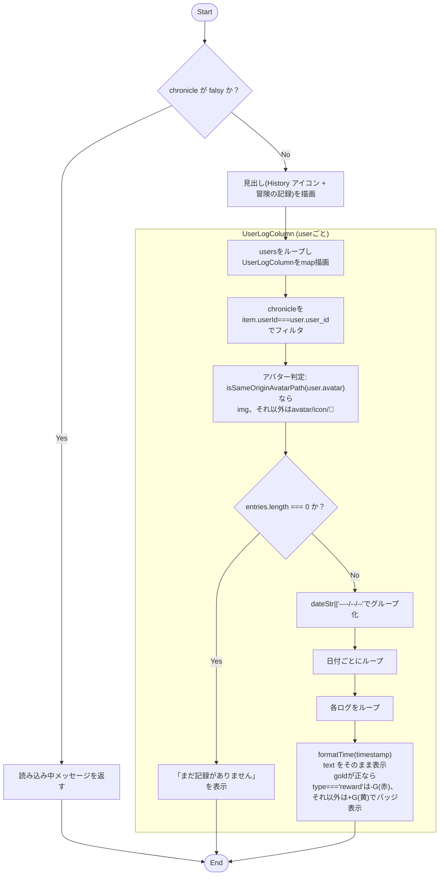
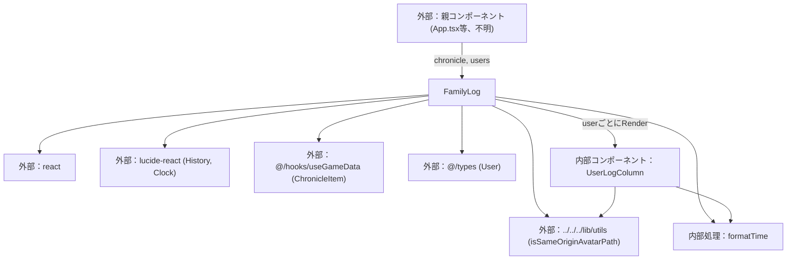

## 1. 解析メタ情報

| 項目 | 内容 |
| --- | --- |
| 対象ファイル | FamilyLog.tsx |
| 言語 | React (TypeScript) |
| 解析対象 | 提供されたコードのみ |
| 推測・補完 | 一切なし |
| 解析基準コミット | `a4fb40f` |

## 関連ドキュメント

* [../../../hooks/useGameData.md](../../../hooks/useGameData.md) - `ChronicleItem`型のインポート元、`chronicle`データの取得元
* [../../../types/index.md](../../../types/index.md) - `User`型のインポート元
* [../../../lib/utils.md](../../../lib/utils.md) - `isSameOriginAvatarPath`（アバターURLの自ドメイン判定ヘルパー）の実装元
* [../../../../App.md](../../../../App.md) - 呼び出し元（`viewMode === 'familyLog'`時に本コンポーネントを描画）

## 2. ファイルの概要

冒険の記録（タイムライン形式のログ）を、ユーザーごとの列（カラム）に分けて並べて表示するReactコンポーネントである。以前はタブで1人ずつ切り替える形式だったが、ホーム画面（横画面の4人並びパネル）と同様に最初から全員分を並べて表示する構成に変更されており、家族の総力（パーティランク・総レベルなど）の集計表示は廃止されている。親コンポーネントから渡された`chronicle`配列を各ユーザーの`user_id`でフィルタリングしたうえで、日付ごとにグループ化して日本時間でフォーマットし、UIとして出力する。

* 根拠: コンポーネント直前のコメント (行番号: 89〜91 / 抜粋: "// ★バグ修正: 冒険の記録は以前タブで1人ずつ切り替える形式だったが、ホーム画面(横画面の\n// 4人並びパネル)と同様に、最初から全員分を並べて表示する。家族の総力(パーティランク・\n// 総レベルなど)の集計表示は不要とのことなので廃止した。")
* 根拠: `FamilyLog`関数定義およびフィルタリング (行番号: 92, 107 / 抜粋: "const FamilyLog: React.FC<FamilyLogProps> = ({ chronicle, users }) => {", "entries={chronicle.filter(item => item.userId === user.user_id)}")
* 根拠: `UserLogColumn`のグループ化処理 (行番号: 25〜30 / 抜粋: "const groupedChronicle = entries.reduce((groups: Record<string, ChronicleItem[]>, item: ChronicleItem) => {")

## 3. 外部依存関係

### インポート一覧

| 名称 | 種類 | 用途 | 根拠 |
| --- | --- | --- | --- |
| `React` | ライブラリ | Reactコンポーネントの定義のため | `import React from 'react';` (行番号: 1) |
| `History`, `Clock` | アイコンコンポーネント (`lucide-react`) | 見出しの「冒険の記録」アイコン、および各ログの時刻表示アイコン | `import { History, Clock } from 'lucide-react';` (行番号: 2) |
| `ChronicleItem` | 型定義 (`@/hooks/useGameData`) | `chronicle`Props・`entries`引数・ログ項目の型指定 | `import { ChronicleItem } from '@/hooks/useGameData';` (行番号: 3) |
| `User` | 型定義 (`@/types`) | `users`Props・`user`引数の型指定 | `import { User } from '@/types';` (行番号: 4) |
| `isSameOriginAvatarPath` | 関数 (`../../../lib/utils`) | アバターURLが自サーバーの相対パスか（プロトコル相対URLを除外）を判定するための共通ヘルパー | `import { isSameOriginAvatarPath } from '../../../lib/utils';` (行番号: 5) |

### ブラックボックスとなる外部要素

| 名称 | 理由 | 根拠 |
| --- | --- | --- |
| `ChronicleItem` | `@/hooks/useGameData` に定義されているため、本ファイルからは全プロパティ（必須・任意）や型定義の全容が把握不可。 | `import { ChronicleItem } from '@/hooks/useGameData';` (行番号: 3) |
| `User` | `@/types` に定義されているため、本ファイルからは全プロパティの全容が把握不可。 | `import { User } from '@/types';` (行番号: 4) |
| 親コンポーネント | このコンポーネントを呼び出し、`chronicle` および `users` のPropsを提供する要素の実装が不明。 | `const FamilyLog: React.FC<FamilyLogProps> = ({ chronicle, users }) => {` (行番号: 92) |
| `isSameOriginAvatarPath`の内部実装 | `../../../lib/utils`に実装があり、判定ロジックの詳細（`//`始まりのプロトコル相対URL除外など）は本ファイルからは呼び出し結果の利用箇所しか分からない。 | `import { isSameOriginAvatarPath } from '../../../lib/utils';` (行番号: 5), `const hasAvatarImage = isSameOriginAvatarPath(user.avatar);` (行番号: 22) |

## 4. 主要要素の定義（関数 / エンドポイント / コンポーネント）

### `formatTime`

* **役割**: 渡されたタイムスタンプを日本時間の `HH:mm` 形式の文字列に変換する。
* 根拠: (行番号: 12〜16 / 抜粋: "const formatTime = (ts: string | number | undefined) => {\n    if (!ts) return '';\n    const date = new Date(ts);\n    return date.toLocaleTimeString('ja-JP', { hour: '2-digit', minute: '2-digit' });\n};")

* **引数/リクエスト**: `ts: string | number | undefined`
* **戻り値/レスポンス**: `string`
* **副作用**: なし
* **エラーハンドリング**: 引数 `ts` が falsy な場合は空文字列を返す。
* 根拠: (行番号: 13 / 抜粋: "if (!ts) return '';")

### `UserLogColumn`

* **役割**: 1ユーザー分のタイムラインカラムを描画する。アバター画像（`isSameOriginAvatarPath(user.avatar)`が真の場合は``、それ以外はアバター文字列/アイコン/デフォルト絵文字`🙂`）とユーザー名を上部に表示し、`entries`を日付（`dateStr`、無ければ`'----/--/--'`）でグループ化して、日付ごとにタイムライン風のリストとして表示する。`entries`が空の場合は「まだ記録がありません」を表示する。各ログ項目では時刻（`timestamp`）、本文（`text`）、獲得/消費ゴールド（`gold`が正の場合のみバッジ表示）を描画する。**（#291で修正）** `ChronicleItem`から`date`/`id`/`message`/`quest_title`/`reward_gold`/`created_at`という、バックエンドから一度も送られてこない幽霊フィールドが削除されたことに伴い、これらへの防御的フォールバック（`item.date`、`log.id`、`log.message`、`` `${log.quest_title} を達成！` ``、`log.created_at`、`log.reward_gold`）はすべて廃止され、`dateStr`/`timestamp`/`text`/`gold`のみを参照する。各ログ項目の`key`も`log.timestamp || log.id`から`log.timestamp`のみに変更された。**バグ修正(M-6-4)**: `log.type === 'reward'`（報酬購入）の場合は消費として赤色で`-N G`、それ以外（クエスト達成等）は獲得として黄色で`+N G`と表示するようになった。以前は購入によるゴールド消費も一律`+N G`（獲得）として表示されていた。
* 根拠: (行番号: 19〜87 / 抜粋: "// 冒険の記録(タイムライン)1人分のカラム。ホーム画面(横画面の4人並びパネル)と同様に、\n// タブで選ばせるのではなく最初から全員分を並べて表示する。\nconst UserLogColumn: React.FC<{ user: User; entries: ChronicleItem[] }> = ({ user, entries }) => {")
* 根拠: アバター判定 (行番号: 22, 36〜40 / 抜粋: "const hasAvatarImage = isSameOriginAvatarPath(user.avatar);", "{hasAvatarImage ? (\n                        \n                    ) : (\n                        user.avatar || user.icon || '🙂'\n                    )}")
* 根拠: グループ化 (行番号: 25〜30 / 抜粋: "const groupedChronicle = entries.reduce((groups: Record<string, ChronicleItem[]>, item: ChronicleItem) => {\n        const date = item.dateStr || '----/--/--';\n        if (!groups[date]) groups[date] = [];\n        groups[date].push(item);\n        return groups;\n    }, {});")
* 根拠: 空表示 (行番号: 45〜47 / 抜粋: "{entries.length === 0 && (\n                
まだ記録がありません
\n            )}")
* 根拠: `key`・ログ本文と獲得/消費ゴールド (行番号: 56, 59, 63, 66, 76 / 抜粋: "
", "{formatTime(log.timestamp)}", "{log.text}", "{(log.gold || 0) > 0 && (", "{log.type === 'reward' ? '-' : '+'}{log.gold} G")

* **引数/リクエスト**: `{ user: User; entries: ChronicleItem[] }`
* 根拠: (行番号: 21 / 抜粋: "const UserLogColumn: React.FC<{ user: User; entries: ChronicleItem[] }> = ({ user, entries }) => {")

* **戻り値/レスポンス**: JSX.Element
* 根拠: (行番号: 32〜86 / 抜粋: "return (\n        
")

* **副作用**: なし
* **エラーハンドリング**: なし（`entries`が空の場合は専用メッセージを表示するのみで例外処理はない）

### `FamilyLogProps` (型定義)

* **役割**: `FamilyLog`コンポーネントが受け取るPropsの型定義。
* 根拠: (行番号: 7〜10 / 抜粋: "interface FamilyLogProps {\n    chronicle: ChronicleItem[];\n    users: User[];\n}")

### `FamilyLog`

* **役割**: `chronicle`が未取得（falsy）の間はローディングメッセージを返す。取得済みの場合は見出し（`History`アイコン＋「冒険の記録」）を表示したのち、`users`を`map`し、各ユーザーについて`chronicle`を`item.userId === user.user_id`でフィルタリングした結果を`UserLogColumn`に渡してグリッド表示する。
* 根拠: (行番号: 92〜113 / 抜粋: "const FamilyLog: React.FC<FamilyLogProps> = ({ chronicle, users }) => {")
* 根拠: ローディング分岐 (行番号: 93 / 抜粋: "if (!chronicle) return 
冒険の記録を読み込んでいます...
;")
* 根拠: ユーザーごとのフィルタリングと描画 (行番号: 102〜110 / 抜粋: "{users.map(user => (\n                    <UserLogColumn\n                        key={user.user_id}\n                        user={user}\n                        entries={chronicle.filter(item => item.userId === user.user_id)}\n                    />\n                ))}")

* **引数/リクエスト**: `FamilyLogProps` (`chronicle`: `ChronicleItem[]`, `users`: `User[]`)
* 根拠: (行番号: 92 / 抜粋: "const FamilyLog: React.FC<FamilyLogProps> = ({ chronicle, users }) => {")

* **戻り値/レスポンス**: JSX.Element
* 根拠: (行番号: 93, 95〜112 / 抜粋: "if (!chronicle) return <div", "return (\n        
")

* **副作用**: なし
* 根拠: `useEffect`等の記述なし (行番号: 92〜113)

* **エラーハンドリング**: `chronicle`が falsy な場合、読み込み中のメッセージを返して早期リターンする。
* 根拠: (行番号: 93 / 抜粋: "if (!chronicle) return 
冒険の記録を読み込んでいます...
;")

## 5. 処理フロー図

## 6. 依存関係図

## 7. 次のステップ（リバースエンジニアリングの提案）

| 優先度 | ファイル名(推測可) | 理由 | 根拠 |
| --- | --- | --- | --- |
| 高 | `@/hooks/useGameData` | `ChronicleItem`の完全なスキーマを把握し、`chronicle`の具体的なデータ構造（`dateStr`/`date`、`text`/`message`等の混在フィールド）を確認するため。 | `import { ChronicleItem } from '@/hooks/useGameData';` (行番号: 3) |
| 中 | `../../../../App.tsx` (親コンポーネント) | `chronicle`と`users`の取得元（API通信など）、および`viewMode`に応じた本コンポーネントの表示制御を把握するため。 | `const FamilyLog: React.FC<FamilyLogProps> = ({ chronicle, users }) => {` (行番号: 92) |
| 低 | `@/types` | `User`の`avatar`/`icon`/`user_id`の正確な型・必須任意を確認するため。 | `import { User } from '@/types';` (行番号: 4) |
| 低 | `../../../lib/utils.ts` | `isSameOriginAvatarPath`の判定ロジックの詳細を確認するため。 | `import { isSameOriginAvatarPath } from '../../../lib/utils';` (行番号: 5) |

## 8. 保守上の注意点

* `chronicle` は `ChronicleItem[]`（`@/hooks/useGameData` からインポート）、`users` は `User[]`（`@/types` からインポート）として型付けされているが、これらの型定義の実体は本ファイルにはなく外部ファイルに依存する。
* 根拠: (行番号: 3〜4, 7〜10)

* **（#291で修正・旧注意点は解消済み）** `ChronicleItem`の各要素はかつてプロパティ名に複数のパターン（例: `dateStr` と `date`、`timestamp` と `created_at`、`text` と `message`、`gold` と `reward_gold`、`id`）が混在しており、フォールバック（`||`）による評価が行われていた。`date`/`id`/`message`/`quest_title`/`reward_gold`/`created_at`/`avatar_url`/`reward_exp`は、バックエンド(`GameSystem._fetch_full_adventure_logs`)から一度も送られてこない幽霊フィールドであったことが判明したため`ChronicleItem`の型定義から削除され、本ファイル側のフォールバックもすべて廃止された。現在は`dateStr`/`timestamp`/`text`/`gold`のみを参照する。
* 根拠: (行番号: 26, 56, 59, 63 / 抜粋: "const date = item.dateStr || '----/--/--';")

* アバター画像かどうかの判定は共通ヘルパー`isSameOriginAvatarPath`（`../../../lib/utils`）に委譲されている。**バグ修正**: 以前は本ファイル内で`user.avatar && user.avatar.startsWith('/')`という文字列の先頭一致のみを直接判定していたため、プロトコル相対URL（`"//evil.example/x"`）も`startsWith('/')`がtrueになり素通りしてしまう脆弱性があった。共通ヘルパーへの置き換えにより`"//"`始まりが明示的に除外されるようになったが、ヘルパー自体の実装は本ファイルからは不明（`../../../lib/utils`に依存）。
* 根拠: (行番号: 5, 22 / 抜粋: "import { isSameOriginAvatarPath } from '../../../lib/utils';", "const hasAvatarImage = isSameOriginAvatarPath(user.avatar);")

* 以前存在した「家族の総力（パーティランク・総レベルなど）」の集計表示（`FamilyStats`関連のUI）は、コメントにより意図的に廃止されたことが明記されている。復活させる場合は`stats`相当のPropsを再度受け取る必要がある。
* 根拠: (行番号: 89〜91 / 抜粋: "// 家族の総力(パーティランク・\n// 総レベルなど)の集計表示は不要とのことなので廃止した。")

* **[修正済み] ゴールドバッジの符号・色分け（M-6-4）**: `log.type === 'reward'`（報酬購入によるゴールド消費）の場合は赤色で`-N G`、それ以外（クエスト達成等によるゴールド獲得）は黄色で`+N G`と表示するようになった。以前は`type`を見ずに一律`+N G`（獲得）表示していたため、報酬購入によるゴールド減少が誤って「獲得」のように見えていた。
* 根拠: (行番号: 67〜69, 71〜76 / 抜粋: "// M-6-4バグ修正: 報酬購入(type='reward')はゴールドを消費した記録のため\n                                        // \"-N G\"、クエスト達成(type='quest')は獲得のため\"+N G\"と表示する。\n                                        // 以前は購入も一律\"+N G\"(獲得)表示になっていた。", "{log.type === 'reward' ? '-' : '+'}{log.gold || log.reward_gold} G")

## 9. 不明事項一覧

| 項目 | 理由 | 必要なファイル |
| --- | --- | --- |
| `ChronicleItem`の厳密なスキーマ | `@/hooks/useGameData` からインポートされた型であり、`dateStr`/`timestamp`/`text`/`gold`等の各プロパティが実際にどのような値・タイミングで送られてくるか（バックエンド側の生成ロジック）は本ファイルからは不明なため。 | `@/hooks/useGameData` |
| `User`型の`avatar`/`icon`フィールドの正確な仕様 | `@/types` からインポートされた型であり、両者の使い分けルールが本ファイルからは不明なため。 | `@/types` |
| 呼び出し元における`chronicle`/`users`の取得方法 | 親コンポーネントの実装が不明であり、APIから取得しているのか、キャッシュ経由かなどが分からないため。 | 親コンポーネント（`App.tsx`等） |

## 相互参照による補足情報

| 元の不明事項 | 判明した内容 | 参照元ドキュメント |
| --- | --- | --- |
| `ChronicleItem`の厳密なスキーマ | `family-quest/src/hooks/useGameData.ts`を直接確認した。**（#291で修正）** `ChronicleItem`インターフェース(33〜44行目)のコメント(29〜32行目、「年代記の1エントリ(`GameSystem._fetch_full_adventure_logs`のレスポンスに対応。`date`/`id`/`avatar_url`/`message`/`quest_title`/`reward_gold`/`reward_exp`/`created_at`はバックエンドから一度も送られてこない幽霊フィールドだったため削除した。`FamilyLog.tsx`側の「複数の代替フィールド名への防御的フォールバック」もあわせて廃止した」)の通り、全プロパティが任意(`?`)の`type, timestamp, dateStr, userId, userName, userAvatar, title, text, gold, exp`のみに整理された（以前存在した`date, id, avatar_url, message, quest_title, reward_gold, reward_exp, created_at`は削除済み）。`ChronicleResponse`は`{ stats: FamilyStats; chronicle: ChronicleItem[] }`で、`useGameData`フック内では`useQuery<ChronicleResponse>({ queryKey: ['chronicle'], queryFn: () => apiClient.get('/api/quest/family/chronicle'), staleTime: 1000 * 60 * 5 })`で取得され、`chronicle: chronicleData?.chronicle \|\| []`としてフックの戻り値に含まれる。 | 直接ソース確認: `family-quest/src/hooks/useGameData.ts:29-44` |
| `User`型の`avatar`/`icon`フィールドの正確な仕様 | `family-quest/src/types/index.ts`の`User`インターフェースでは`avatar?: string; icon?: string;`(14〜15行目)とのみ定義されており、型定義自体に使い分けの説明コメントはない。実際の使い分けルールは利用側のコードから直接確認した。`family-quest/src/components/layout/Header.tsx`111行目、`family-quest/src/features/family/components/UserStatusCard.tsx`25行目、および本ファイル(FamilyLog.tsx)22行目のいずれも同一パターンで、共通ヘルパー`isSameOriginAvatarPath`（`family-quest/src/lib/utils.ts`21〜23行目、`"//"`始まりのプロトコル相対URLを除外したうえで`/`始まりの自サーバー相対パスかを判定）が真であれば``として画像表示し、それ以外の場合は`user.avatar \|\| user.icon \|\| '🙂'`という優先順位でテキスト（絵文字等）として表示する。`UserStatusCard.tsx`22〜24行目のコメントに「`user.avatar`はアップロード画像のパス('/uploads/...')の場合と、未設定時の絵文字デフォルト値の場合がある。パス以外を``に渡すと壊れた画像アイコンになるため、`Header.tsx`と同様にパス形式かどうかを判定する」と明記されている（**バグ修正**: 以前は3ファイルとも`user.avatar.startsWith('/')`のみで判定しており、プロトコル相対URLが素通りする脆弱性があったため、共通ヘルパーへ置き換えられた）。 | 直接ソース確認: `family-quest/src/types/index.ts:14-15`, `family-quest/src/components/layout/Header.tsx:111`, `family-quest/src/features/family/components/UserStatusCard.tsx:22-25`, `family-quest/src/lib/utils.ts:12-21` |
| 呼び出し元における`chronicle`/`users`の取得方法 | `family-quest/src/App.tsx`と`family-quest/src/hooks/useGameData.ts`を直接確認した。`App.tsx`49行目で`import FamilyLog from './features/family/components/FamilyLog';`、177〜184行目で`const { users, quests, rewards, completedQuests, pendingQuests, chronicle, pendingInventory, isLoading, ... } = useGameData(handleLevelUp);`として`useGameData`フックから`users`と`chronicle`を取得し、521行目`<FamilyLog chronicle={chronicle} users={users} />`としてそのまま`props`に渡している。`useGameData.ts`内部では、`users`は87〜92行目の`useQuery<GameDataResponse>({ queryKey: ['gameData'], queryFn: () => apiClient.get('/api/quest/data'), staleTime: 1000 * 30, refetchInterval: 1000 * 10 })`（`/api/quest/data`をAPI経由で10秒間隔ポーリング取得）由来、`chronicle`は95〜99行目の`useQuery<ChronicleResponse>({ queryKey: ['chronicle'], queryFn: () => apiClient.get('/api/quest/family/chronicle'), staleTime: 1000 * 60 * 5 })`（`/api/quest/family/chronicle`をAPI経由で5分キャッシュで取得）由来であることを確認した。 | 直接ソース確認: `family-quest/src/App.tsx:49, 177-184, 521`, `family-quest/src/hooks/useGameData.ts:86-99` |

## 10. 自己検証結果

* [x] 完了: 推測・外部ファイルの仕様を一切含んでいない
* [x] 完了: 全関数・全クラス・全コンポーネントを列挙した
* [x] 完了: 全てのインポート要素を列挙した
* [x] 完了: すべての仕様説明に「根拠（行番号・抜粋）」を明記した
* [x] 完了: 根拠漏れが0件である
* [x] 完了: Mermaid構文にエラーの原因となる記号（エスケープ漏れ）がない
* [x] 完了: 不明事項を漏れなく列挙した
