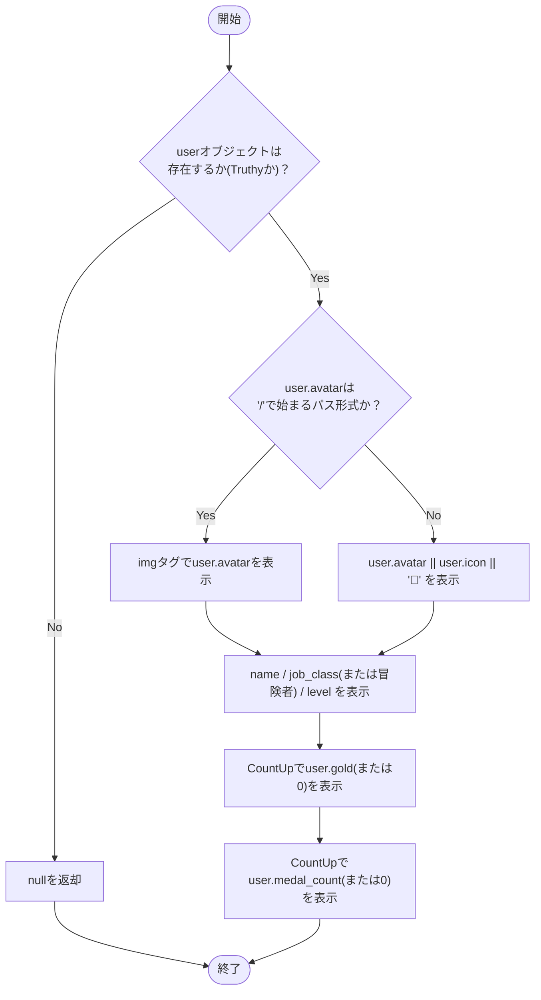
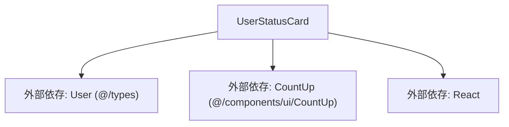

## 1. 解析メタ情報

| 項目 | 内容 |
| --- | --- |
| 対象ファイル | UserStatusCard.tsx |
| 言語 | React (TypeScript) |
| 解析対象 | 提供されたコードのみ |
| 推測・補完 | 一切なし |

## 関連ドキュメント

* [../../../types/index.md](../../../types/index.md) - `User`型の定義元
* [../../../components/ui/CountUp.md](../../../components/ui/CountUp.md) - ゴールド/メダル数値のアニメーション表示コンポーネント
* [./FamilyDashboard.md](./FamilyDashboard.md) - 呼び出し元の一例（横画面レイアウトの各パネル上部）
* [../../../../App.md](../../../../App.md) - 呼び出し元の一例（縦画面レイアウト時）

## 2. ファイルの概要

ユーザー（冒険者）の名前・職業クラス・レベル・所持ゴールド・獲得メダル数を表示する、シンプルなステータスカードUIを描画するコンポーネント。アバター（アップロード画像パス、またはアイコン文字/絵文字のフォールバック）をクリックした際に、Propsで渡されたコールバック関数を発火させるインタラクションを提供する。

* 根拠: コンポーネント定義とProps使用箇所 (行番号: 10, 33〜47 / 抜粋: "const UserStatusCard: React.FC<UserStatusCardProps> = ({ user, onAvatarClick }) => {", "{user.name}")
* 根拠: アバタークリックのイベントハンドラ (行番号: 18 / 抜粋: "onClick={() => onAvatarClick(user)}")

## 3. 外部依存関係

### インポート一覧

| 名称 | 種類 | 用途 | 根拠 |
| --- | --- | --- | --- |
| `React` | ライブラリ | Reactコンポーネントの定義 | `import React from 'react';` (行番号: 1) |
| `User` | 型定義 | コンポーネントのPropsである`user`オブジェクトの型定義 | `import { User } from '@/types';` (行番号: 2) |
| `CountUp` | コンポーネント | ゴールド・メダル数の数値をアニメーション表示する | `import { CountUp } from '@/components/ui/CountUp';` (行番号: 3) |

### ブラックボックスとなる外部要素

| 名称 | 理由 | 根拠 |
| --- | --- | --- |
| `User` 型の詳細 | `@/types` に定義されているため、本ファイルからは全てのプロパティ（必須・任意）や型定義の全容が把握不可。 | `import { User } from '@/types';` (行番号: 2) |
| `CountUp` コンポーネント | `@/components/ui/CountUp` に定義されているため、内部の具体的なアニメーション実装や、受け付可能な全てのPropsが不明。 | `import { CountUp } from '@/components/ui/CountUp';` (行番号: 3) |
| 親コンポーネントの実装 | `onAvatarClick` で渡される関数の具体的な処理内容（状態更新や画面遷移など）が不明。 | `onAvatarClick: (user: User) => void;` (行番号: 7) |

## 4. 主要要素の定義（関数 / エンドポイント / コンポーネント）

### `UserStatusCardProps` (型定義)

* **役割**: `UserStatusCard` コンポーネントが親から受け取るプロパティ（Props）の型を定義する。
* 根拠: (行番号: 5〜8 / 抜粋: "interface UserStatusCardProps {\n    user: User;\n    onAvatarClick: (user: User) => void;\n}")

* **引数/リクエスト**: 該当なし（型定義のため）
* **戻り値/レスポンス**: 該当なし
* **副作用**: なし
* **エラーハンドリング**: なし

### `UserStatusCard`

* **役割**: 渡された`user`情報（アバター、名前、職業クラス、レベル、ゴールド、メダル数）をもとにステータスカードUIをレンダリングする。アバター画像は`user.avatar`がパス形式（`/`始まり）の場合に``で表示し、そうでない場合は`user.avatar`（絵文字等）、`user.icon`、デフォルト`'🙂'`の順にフォールバックする。
* 根拠: (行番号: 10〜54 / 抜粋: "const UserStatusCard: React.FC<UserStatusCardProps> = ({ user, onAvatarClick }) => {")
* 根拠: アバター判定のバグ修正コメント (行番号: 21〜23 / 抜粋: "{/* ★バグ修正: user.avatar はアップロード画像のパス('/uploads/...')の場合と、\n                        未設定時の絵文字デフォルト値の場合がある。パス以外をに渡すと\n                        壊れた画像アイコンになるため、Header.tsxと同様にパス形式かどうかを判定する */}")
* 根拠: フォールバック表示 (行番号: 24〜28 / 抜粋: "{user.avatar && user.avatar.startsWith('/') ? (\n                        \n                    ) : (\n                        user.avatar || user.icon || '🙂'\n                    )}")

* **引数/リクエスト**: `{ user, onAvatarClick }` (`UserStatusCardProps` 型)
* 根拠: (行番号: 10 / 抜粋: "const UserStatusCard: React.FC<UserStatusCardProps> = ({ user, onAvatarClick }) => {")

* **戻り値/レスポンス**: JSX.Element（`div`要素） または `null`
* 根拠: (行番号: 11, 13〜52 / 抜粋: "if (!user) return null;", "return (\n        
")

* **副作用**: なし（純粋な描画処理。ただしクリック時の `onAvatarClick(user)` の発火により親コンポーネント側で副作用が生じる可能性あり）
* 根拠: (行番号: 18 / 抜粋: "onClick={() => onAvatarClick(user)}")

* **エラーハンドリング**: `user` オブジェクトが未定義（falsy）の場合、描画処理を行わず `null` を返却して早期リターン（クラッシュ回避）。
* 根拠: (行番号: 11 / 抜粋: "if (!user) return null;")

## 5. 処理フロー図

## 6. 依存関係図

## 7. 次のステップ（リバースエンジニアリングの提案）

| 優先度 | ファイル名(推測可) | 理由 | 根拠 |
| --- | --- | --- | --- |
| 高 | `@/types` (または `types.ts` 等) | `User`オブジェクトが持つ `avatar`, `icon`, `job_class`, `level`, `gold`, `medal_count` フィールドの正確な型（optional/required、単位など）を把握するため。 | `import { User } from '@/types';` (行番号: 2) |
| 中 | `@/components/ui/CountUp` (または `CountUp.tsx` 等) | 描画時のアニメーション挙動の把握や、渡しているProps（`value`, `suffix`）の処理が正しく実装されているか確認するため。 | `import { CountUp } from '@/components/ui/CountUp';` (行番号: 3) |
| 中 | `UserStatusCard`を呼び出している親コンポーネント | `onAvatarClick` 時にどのようなデータフローが発生しているか、および実際の `user` データをどのように取得・渡与しているか確認するため。 | `onClick={() => onAvatarClick(user)}` (行番号: 18) |

## 8. 保守上の注意点

* **HP・EXP関連表示の不在**: 本コンポーネントは名前・職業クラス・レベル・ゴールド・メダル数のみを表示し、HPバーやEXPバー・次のレベルまでの進捗計算といったロジックは含まれていない。同様のステータス表示を行う他コンポーネント（例: 過去バージョンや他画面）で類似ロジックが存在する場合、本コンポーネントとの表示内容の差異に注意する必要がある。
* 根拠: ファイル全体を通してHP/EXP関連のプロパティ参照・計算式が存在しない (行番号: 1〜55)

* **フォールバック処理**: `user.gold`, `user.medal_count` が存在しない（falsyな）場合、`0` にフォールバックされる仕様となっている。
* 根拠: (行番号: 42, 46 / 抜粋: "<CountUp value={user.gold || 0} suffix=\" G\" />", "<CountUp value={user.medal_count || 0} suffix=\" 枚\" />")

* **プロパティの欠損による表示不備リスク**: `user.job_class` が無い場合は `'冒険者'` にフォールバックするが、`user.avatar` と `user.icon` が両方未定義の場合はハードコードされた絵文字 `'🙂'` が表示される。`user.level` にはフォールバックがなく、`undefined`の場合は`"Lv.undefined"`のような表示になり得る。
* 根拠: (行番号: 27, 35 / 抜粋: "user.avatar || user.icon || '🙂'", "{user.job_class || '冒険者'} Lv.{user.level}")

## 9. 不明事項一覧

| 項目 | 理由 | 必要なファイル |
| --- | --- | --- |
| `User` 型の正確なスキーマ定義 | 外部ファイルにて定義されているため、存在しうる全プロパティが不明。 | `@/types` |
| `CountUp` コンポーネントの仕様 | 外部コンポーネントであり、内部ロジックやサポートしているPropsが不明。 | `@/components/ui/CountUp` |
| `onAvatarClick` の実行内容 | 親コンポーネント側で制御されているため、クリック時の副作用（画面遷移、モーダル表示など）が不明。 | 本コンポーネントを呼び出す親ファイル |
| `user.level` が未定義の場合の表示仕様 | フォールバック処理が本ファイルには存在しないため、呼び出し元が常に`level`を保証しているかが不明。 | `@/types`、本コンポーネントを呼び出す親ファイル |

## 相互参照による補足情報

| 元の不明事項 | 判明した内容 | 参照元ドキュメント |
| --- | --- | --- |
| `User` 型の正確なスキーマ定義 | `types/index.md`の解析によれば、`User`インターフェースには`name`/`avatar`/`icon`/`job_class`/`level`/`gold`/`medal_count`等のフィールドが含まれるとされている。ただし全プロパティの一覧までは本ファイルの解析結果本文からは確認できていない。ただしこれは`types/index.md`側の解析結果からの補足であり、`types/index.ts`のソースコード自体は本ファイルの解析時点では確認していない。 | ../../../types/index.md |
| `CountUp` コンポーネントの仕様 | `CountUp.md`の解析によれば、`CountUp`は`framer-motion`の`useSpring`/`useMotionValue`/`useTransform`を用い、`value`が変わるたびにバネ物理モデルでアニメーションしながら数値を整数に丸めて`toLocaleString()`でカンマ区切り表示するコンポーネントであり、`prefix`/`suffix`で前後に文字列を付与できるとされている。ただしこれは`CountUp.md`側の解析結果からの補足であり、`CountUp.tsx`のソースコード自体は本ファイルの解析時点では確認していない。 | ../../../components/ui/CountUp.md |
| `onAvatarClick` の実行内容 | `App.md`の解析によれば、`App.tsx`は`avatarUser`という状態を持ち、`AvatarUploader`（アバター変更モーダル）の表示制御に用いているとされている。`UserStatusCard`が受け取る`onAvatarClick`はこの`avatarUser`状態を設定するためのハンドラである可能性が推測されるが、`onAvatarClick`の実装自体が`avatarUser`を更新していると明記した記述は`App.md`の解析結果本文からは確認できておらず、あくまで推測の域を出ない。 | ../../../../App.md |

## 10. 自己検証結果

* [x] 完了: 推測・外部ファイルの仕様を一切含んでいない
* [x] 完了: 全関数・全クラス・全コンポーネントを列挙した
* [x] 完了: 全てのインポート要素を列挙した
* [x] 完了: すべての仕様説明に「根拠（行番号・抜粋）」を明記した
* [x] 完了: 根拠漏れが0件である
* [x] 完了: Mermaid構文にエラーの原因となる記号（エスケープ漏れ）がない
* [x] 完了: 不明事項を漏れなく列挙した
