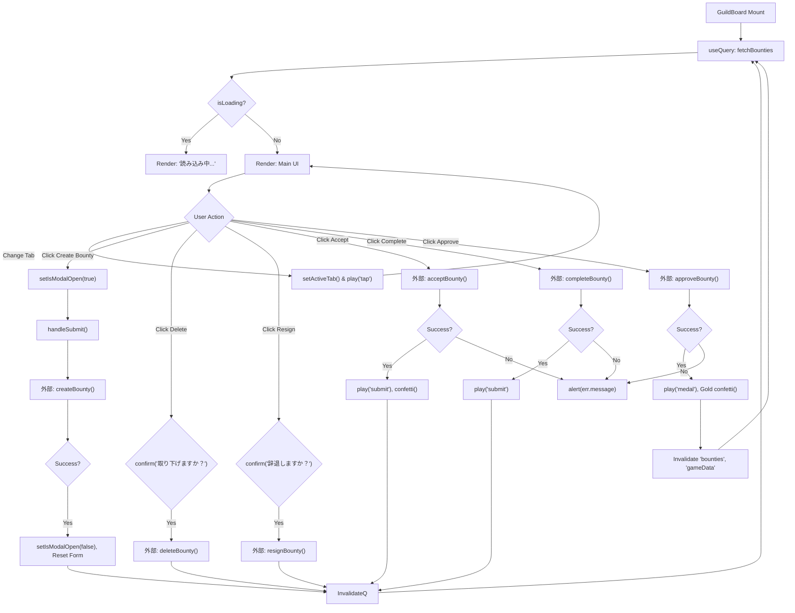

## 1. 解析メタ情報

| 項目 | 内容 |
| --- | --- |
| 対象ファイル | `GuildBoard.tsx` |
| 言語 | React (TypeScript) |
| 解析対象 | 提供されたコードのみ |
| 推測・補完 | 一切なし |

## 2. ファイルの概要

このファイルは、ギルド依頼板（バウンティボード）のUIを提供するReactコンポーネントである。ユーザーが依頼（Bounty）の一覧閲覧、新規作成、受注、完了報告、承認、取り下げ、および辞退を行うための各種アクション機能と、それに伴う状態管理、外部API呼び出し、UIのレンダリング（リスト表示、モーダル、視覚・音声演出）を担っている。

* 根拠: [GuildBoardコンポーネント] (行番号: 30〜360 / 抜粋: "export const GuildBoard: React...")

## 3. 外部依存関係

### インポート一覧

| 名称 | 種類 | 用途 | 根拠 |
| --- | --- | --- | --- |
| `React`, `useState` | ライブラリ (`react`) | コンポーネント定義とローカル状態管理に使用 | 根拠: [import文] (行番号: 2 / 抜粋: "import React, { useState } fro") |
| `useQuery`, `useMutation`, `useQueryClient` | ライブラリ (`@tanstack/react-query`) | データの取得、更新処理、キャッシュの無効化に使用 | 根拠: [import文] (行番号: 3 / 抜粋: "import { useQuery, useMutation") |
| `confetti` | ライブラリ (`canvas-confetti`) | 依頼の受注・承認成功時の紙吹雪アニメーション演出に使用 | 根拠: [import文] (行番号: 4 / 抜粋: "import confetti from 'canvas-c") |
| `Trash2`, `XCircle`, `ShieldAlert` | ライブラリ (`lucide-react`) | UI上のアイコン表示に使用 | 根拠: [import文] (行番号: 5 / 抜粋: "import { Trash2, XCircle, Shie") |
| `fetchBounties`, `createBounty`, `acceptBounty`, `completeBounty`, `approveBounty`, `deleteBounty`, `resignBounty` | 外部関数 (`../../../lib/apiClient`) | バックエンドとの通信（取得・作成・各種状態更新）に使用 | 根拠: [import文] (行番号: 7〜10 / 抜粋: "import { fetchBounties, create") |
| `Bounty` | 型定義 (`../../../types`) | 依頼データの型定義に使用 | 根拠: [import文] (行番号: 11 / 抜粋: "import { Bounty } from '../../") |
| `Card` | コンポーネント (`../../../components/ui/Card`) | 各依頼情報のカードレイアウトに使用 | 根拠: [import文] (行番号: 13 / 抜粋: "import { Card } from '../../..") |
| `Button` | コンポーネント (`../../../components/ui/Button`) | 各種操作ボタンに使用 | 根拠: [import文] (行番号: 14 / 抜粋: "import { Button } from '../../") |
| `Modal` | コンポーネント (`../../../components/ui/Modal`) | 新規依頼作成フォームのオーバーレイ表示に使用 | 根拠: [import文] (行番号: 15 / 抜粋: "import { Modal } from '../../") |
| `useSound` | カスタムフック (`../../../hooks/useSound`) | ボタン操作や処理成功時の音声再生に使用 | 根拠: [import文] (行番号: 16 / 抜粋: "import { useSound } from '../'") |

### ブラックボックスとなる外部要素

| 名称 | 理由 | 根拠 |
| --- | --- | --- |
| `apiClient` の各関数 | 関数の内部実装やエンドポイント、通信エラー時の挙動が本ファイルに含まれていないため | 根拠: [import文] (行番号: 7〜10 / 抜粋: "} from '../../../lib/apiClient") |
| `Bounty` 型の詳細 | 本ファイル内で型定義が提供されておらず、すべてのプロパティが網羅的に判明していないため | 根拠: [import文] (行番号: 11 / 抜粋: "import { Bounty } from '../../") |
| `Card`, `Button`, `Modal` | 内部でどのようなPropsを受け付けるか、スタイルがどう適用されるかの実装がないため | 根拠: [import文] (行番号: 13〜15 / 抜粋: "import { Card } from '../../..") |
| `useSound` フック | `play` 以外の戻り値や、引数（'submit', 'medal', 'cancel', 'tap'）に対する実際の音声ファイルのマッピングが不明なため | 根拠: [import文] (行番号: 16 / 抜粋: "import { useSound } from '../'") |

## 4. 主要要素の定義（関数 / エンドポイント / コンポーネント）

### `CreateBountyForm`

* **役割**: 新規依頼作成時のフォームデータ構造を定義するインターフェース
* 根拠: [インターフェース定義] (行番号: 19〜24 / 抜粋: "interface CreateBountyForm {")

* **プロパティ**:
* `title` (string): 依頼のタイトル
* `description` (string): 依頼の詳細
* `reward_gold` (number): 報酬金額
* `target_type` ('ALL' | 'ADULTS' | 'CHILDREN'): 対象者タイプ

### `GuildBoardProps`

* **役割**: `GuildBoard` コンポーネントが受け取るPropsの型定義
* 根拠: [インターフェース定義] (行番号: 26〜28 / 抜粋: "interface GuildBoardProps {")

* **プロパティ**:
* `userId` (string): 現在のユーザーのID

### `GuildBoard`

* **役割**: ギルド依頼板の画面全体をレンダリングし、データの取得や各種ユーザーアクション（作成、受注、承認、削除など）を処理するReactコンポーネント。
* 根拠: [コンポーネント定義] (行番号: 30〜360 / 抜粋: "export const GuildBoard: React")

* **引数/リクエスト**: `GuildBoardProps` (`{ userId }`)
* 根拠: [引数] (行番号: 30 / 抜粋: "GuildBoardProps> = ({ userId }")

* **戻り値/レスポンス**: JSX.Element（画面UI）
* 根拠: [return文] (行番号: 161〜359 / 抜粋: "return ( 
 fetchBounties(u")
* `useMutation` 経由でのAPIリクエスト送信 (`acceptBounty`, `completeBounty`, `approveBounty`, `createBounty`, `deleteBounty`, `resignBounty`)
* 根拠: [useMutation] (行番号: 54〜126 / 抜粋: "mutationFn: (bountyId: number)")
* キャッシュの無効化（`queryClient.invalidateQueries`）
* 根拠: [onSuccessハンドラ] (行番号: 57, 66, 75, 107, 117, 126 / 抜粋: "queryClient.invalidateQueries(")
* 音声の再生 (`play()`)
* 根拠: [onSuccessハンドラ等] (行番号: 56, 65, 74, 105, 116, 125, 169, 173 / 抜粋: "play('submit');")
* キャンバスへの描画（`confetti` によるアニメーション）
* 根拠: [onSuccessハンドラ] (行番号: 59, 81〜97 / 抜粋: "confetti({ particleCount: 50, ")

* **エラーハンドリング**: ミューテーション（`acceptMutation`, `completeMutation`, `approveMutation`）のエラー発生時に `alert(err.message)` でブラウザの警告ダイアログを表示する。
* 根拠: [onErrorハンドラ] (行番号: 61, 70, 101 / 抜粋: "onError: (err: Error) => alert")

#### 内部関数: `handleDelete`

* **役割**: ブラウザの確認ダイアログを表示し、承諾された場合に `deleteMutation` を実行する。
* 根拠: [関数定義] (行番号: 132〜136 / 抜粋: "const handleDelete = (bountyId")

#### 内部関数: `handleResign`

* **役割**: ブラウザの確認ダイアログを表示し、承諾された場合に `resignMutation` を実行する。
* 根拠: [関数定義] (行番号: 138〜142 / 抜粋: "const handleResign = (bountyId")

#### 内部関数: `handleSubmit`

* **役割**: フォームのデフォルト送信イベントをキャンセルし、現在の `form` ステートを用いて `createMutation` を実行する。
* 根拠: [関数定義] (行番号: 144〜147 / 抜粋: "const handleSubmit = (e: React")

## 5. 処理フロー図

## 6. 依存関係図

```mermaid
graph TD
    subgraph "GuildBoard.tsx"
        GB["GuildBoard Component"]
        FormState["State: form"]
        TabState["State: activeTab"]
        ModalState["State: isModalOpen"]
    end

    subgraph "React Query"
        UQ["useQuery (bounties)"]
        UM_A["useMutation (accept)"]
        UM_C["useMutation (complete)"]
        UM_App["useMutation (approve)"]
        UM_Cr["useMutation (create)"]
        UM_D["useMutation (delete)"]
        UM_R["useMutation (resign)"]
        UQC["useQueryClient"]
    end

    subgraph "UI Components (../../../components/ui/)"
        Card["Card"]
        Button["Button"]
        Modal["Modal"]
    end

    subgraph "API Client (../../../lib/apiClient)"
        API_Fetch["fetchBounties"]
        API_Create["createBounty"]
        API_Accept["acceptBounty"]
        API_Complete["completeBounty"]
        API_Approve["approveBounty"]
        API_Delete["deleteBounty"]
        API_Resign["resignBounty"]
    end

    subgraph "External Libraries / Hooks"
        Confetti["canvas-confetti"]
        Icons["lucide-react"]
        Sound["useSound (../../../hooks/useSound)"]
    end

    GB --> UQ
    GB --> UM_A & UM_C & UM_App & UM_Cr & UM_D & UM_R
    GB --> UQC
    GB --> FormState & TabState & ModalState

    GB --> Card & Button & Modal
    GB --> Confetti & Icons & Sound

    UQ --> API_Fetch
    UM_Cr --> API_Create
    UM_A --> API_Accept
    UM_C --> API_Complete
    UM_App --> API_Approve
    UM_D --> API_Delete
    UM_R --> API_Resign

```

## 7. 次のステップ（リバースエンジニアリングの提案）

| 優先度 | ファイル名(推測可) | 理由 | 根拠 |
| --- | --- | --- | --- |
| 高 | `../../../lib/apiClient.ts` | 各種ミューテーションとデータフェッチの実際の通信処理、エンドポイント、ペイロードの形式を把握するため。 | 根拠: [import文] (行番号: 7〜10 / 抜粋: "} from '../../../lib/apiClient") |
| 高 | `../../../types.ts` | `Bounty` オブジェクトの全体スキーマ（`status`, `is_mine`, `can_accept` などの厳密な型や他の未参照プロパティ）を特定するため。 | 根拠: [import文] (行番号: 11 / 抜粋: "import { Bounty } from '../../") |
| 中 | `../../../hooks/useSound.ts` | 音声ファイルの読み込み仕様や `play` 関数に渡す識別子（'submit', 'medal', 'cancel', 'tap'）が正しく定義されているか確認するため。 | 根拠: [import文] (行番号: 16 / 抜粋: "import { useSound } from '../'") |
| 低 | `../../../components/ui/*` | `Card`, `Button`, `Modal` のPropsインターフェースおよびスタイリングの仕組みを把握するため。 | 根拠: [import文] (行番号: 13〜15 / 抜粋: "import { Card } from '../../..") |

## 8. 保守上の注意点

* `useQuery` で設定されている `refetchInterval: 5000` により、5秒ごとに `fetchBounties` APIが呼び出される。
* `deleteMutation` と `resignMutation` においては、ミューテーションのエラーハンドリング（`onError`）が実装されていない。
* 依頼削除時と辞退時に、ブラウザ標準の同期ブロッキング処理である `confirm()` を使用している。
* ミューテーションの `onError` 処理で、ブラウザ標準の同期ブロッキング処理である `alert()` を使用している。
* `approveMutation` の成功時にのみ `['gameData']` クエリもキャッシュ無効化対象としている（他のアクションでは `['bounties']` のみ）。
* フォームの `target_type` セレクトボックスの `onChange` イベントにおいて、`e.target.value as any` という型アサーションが使用されており、型安全性が破棄されている箇所がある。

## 9. 不明事項一覧

| 項目 | 理由 | 必要なファイル |
| --- | --- | --- |
| バックエンドAPIの通信詳細 | HTTPメソッド、エンドポイントURL、リクエスト/レスポンスの厳密なJSON構造が不明。 | `../../../lib/apiClient.ts` |
| `Bounty` の完全なプロパティ | 本ファイルで参照されているプロパティ以外にデータが存在するか不明。 | `../../../types.ts` |
| `gameData` クエリの内容 | `approveMutation` 成功時にInvalidateされる `['gameData']` が、どこでどのように定義・使用されているか本ファイル内からは不明。 | 他の機能やコンポーネントのファイル |
| UIコンポーネントの仕様 | `Button` の `variant` (primary, secondary, success, warning) の網羅的な種類とデザイン定義が不明。 | `../../../components/ui/Button.tsx` |
| 音声アセットの紐付け | `play` の引数に指定している文字列が実際のどの音声ファイルにマッピングされているか不明。 | `../../../hooks/useSound.ts` |

## 10. 自己検証結果

* [x] 推測・外部ファイルの仕様を一切含んでいない
* [x] 全関数・全クラス・全コンポーネントを列挙した
* [x] 全てのインポート要素を列挙した
* [x] すべての仕様説明に「根拠（行番号・抜粋）」を明記した
* [x] 根拠漏れが0件である
* [x] Mermaid構文にエラーの原因となる記号（エスケープ漏れ）がない
* [x] 不明事項を漏れなく列挙した

完了