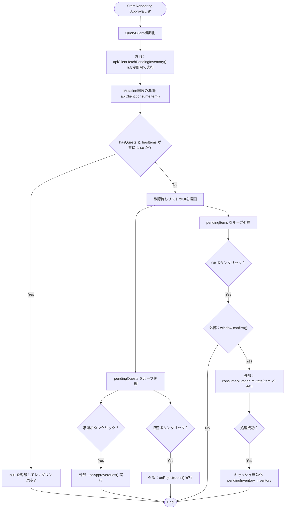
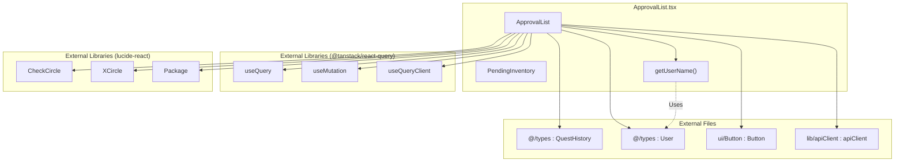

## 1. 解析メタ情報

| 項目 | 内容 |
| --- | --- |
| 対象ファイル | `ApprovalList.tsx` |
| 言語 | React (TypeScript) |
| 解析対象 | 提供されたコードのみ |
| 推測・補完 | 一切なし |

## 2. ファイルの概要

* 承認待ちのクエストおよびアイテムのリストを表示し、ユーザーがそれぞれの承認または拒否（アイテムは現状承認のみ）のアクションを実行するためのUIコンポーネントを提供するファイル。
* 根拠: [ApprovalList] (行番号: 25〜108 / 抜粋: "const ApprovalList: React.FC<Pr")

## 3. 外部依存関係

### インポート一覧

| 名称 | 種類 | 用途 | 根拠 |
| --- | --- | --- | --- |
| `React` | モジュール | Reactコンポーネントの定義 | 根拠: [React] (行番号: 1〜1 / 抜粋: "import React from 'react';") |
| `useQuery`, `useMutation`, `useQueryClient` | カスタムフック | 非同期データフェッチ、更新、キャッシュ管理 | 根拠: [useQuery等] (行番号: 2〜2 / 抜粋: "import { useQuery, useMutation") |
| `CheckCircle`, `XCircle`, `Package` | アイコン | UI上のアイコン表示 | 根拠: [アイコン群] (行番号: 3〜3 / 抜粋: "import { CheckCircle, XCircle,") |
| `QuestHistory`, `User` | 型定義 | Propsおよび変数の型定義 | 根拠: [型定義] (行番号: 4〜4 / 抜粋: "import { QuestHistory, User } ") |
| `Button` | UIコンポーネント | 承認・拒否ボタンのUI構築 | 根拠: [Button] (行番号: 5〜5 / 抜粋: "import { Button } from '../../") |
| `apiClient` | APIクライアント | バックエンドAPIとの通信 | 根拠: [apiClient] (行番号: 6〜6 / 抜粋: "import { apiClient } from '../") |

### ブラックボックスとなる外部要素

| 名称 | 理由 | 根拠 |
| --- | --- | --- |
| `QuestHistory`, `User`の全スキーマ | 現在のファイルで一部のプロパティ（`id`, `quest_title`, `user_id`, `gold_earned`, `name`など）しか使用されておらず、全体像が不明なため。 | 根拠: [インポート] (行番号: 4〜4 / 抜粋: "import { QuestHistory, User } ") |
| `Button` | デザインや振る舞い（`variant`, `size`などのPropsの処理）の実装詳細が不明なため。 | 根拠: [Buttonコンポーネント] (行番号: 5〜5 / 抜粋: "import { Button } from '../../") |
| `apiClient` | `fetchPendingInventory`, `consumeItem` の具体的なエンドポイント、リクエスト/レスポンス構造、エラーハンドリングが不明なため。 | 根拠: [apiClientメソッド] (行番号: 31〜37 / 抜粋: "queryFn: () => apiClient.fetch") |

## 4. 主要要素の定義（関数 / エンドポイント / コンポーネント）

### `PendingInventory`

* **役割**: 承認待ちアイテムのデータ構造を定義する型。
* 根拠: [PendingInventory] (行番号: 16〜23 / 抜粋: "type PendingInventory = {")

* **引数/リクエスト**: なし
* 根拠: [PendingInventory] (行番号: 16〜23 / 抜粋: "type PendingInventory = {")

* **戻り値/レスポンス**: なし
* 根拠: [PendingInventory] (行番号: 16〜23 / 抜粋: "type PendingInventory = {")

* **副作用**: なし
* 根拠: [PendingInventory] (行番号: 16〜23 / 抜粋: "type PendingInventory = {")

* **エラーハンドリング**: なし
* 根拠: [PendingInventory] (行番号: 16〜23 / 抜粋: "type PendingInventory = {")

### `ApprovalList`

* **役割**: 承認待ちクエストとアイテムのリストを表示し、親から渡されたハンドラやAPIを通して承認・拒否処理を実行するReactコンポーネント。
* 根拠: [ApprovalList] (行番号: 25〜108 / 抜粋: "const ApprovalList: React.FC<Pr")

* **引数/リクエスト**: `Props` (`pendingQuests: QuestHistory[]`, `users: User[]`, `onApprove: (history: QuestHistory) => void`, `onReject: (history: QuestHistory) => void`)
* 根拠: [引数] (行番号: 8〜13 / 抜粋: "type Props = {")

* **戻り値/レスポンス**: JSX.Element（クエスト/アイテムがある場合）または `null`（両方空の場合）
* 根拠: [戻り値] (行番号: 52〜54 / 抜粋: "if (!hasQuests && !hasItems) r")

* **副作用**:
* `useQuery`による5秒間隔でのAPIポーリング（`pendingInventory`の取得）。
* `useMutation`実行成功時のクエリキャッシュ無効化（`pendingInventory`, `inventory`の再フェッチ）。
* `window.confirm`によるブラウザのネイティブダイアログ表示。
* 根拠: [副作用実装] (行番号: 32〜41 / 抜粋: "refetchInterval: 5000 // ポーリン")

* **エラーハンドリング**: なし（通信エラー時や例外発生時の処理は明記されていない）
* 根拠: [ApprovalList全体] (行番号: 25〜108 / 抜粋: "const ApprovalList: React.FC<Pr")

### `getUserName`

* **役割**: `userId`を元に`users`配列からユーザー名を検索して返す関数。ユーザーが見つからない場合は`userId`をそのまま返す。
* 根拠: [getUserName] (行番号: 45〜47 / 抜粋: "const getUserName = (userId: s")

* **引数/リクエスト**: `userId: string`
* 根拠: [引数] (行番号: 45〜45 / 抜粋: "const getUserName = (userId: s")

* **戻り値/レスポンス**: `string` (ユーザー名、または userId)
* 根拠: [戻り値] (行番号: 46〜46 / 抜粋: "return users.find(u => u.user_")

* **副作用**: なし
* 根拠: [getUserName] (行番号: 45〜47 / 抜粋: "const getUserName = (userId: s")

* **エラーハンドリング**: ユーザーが見つからない場合にオプショナルチェーンと論理和を用いてフォールバック（`userId`を返す）処理を行う。
* 根拠: [フォールバック] (行番号: 46〜46 / 抜粋: "return users.find(u => u.user_")

## 5. 処理フロー図

## 6. 依存関係図

## 7. 次のステップ（リバースエンジニアリングの提案）

| 優先度 | ファイル名(推測可) | 理由 | 根拠 |
| --- | --- | --- | --- |
| 高 | `../../../lib/apiClient.ts` | API通信の具体的なエンドポイントや、通信失敗時のエラーハンドリング実装を確認するため。 | 根拠: [インポート] (行番号: 6〜6 / 抜粋: "import { apiClient } from '../") |
| 高 | `App.tsx` または親コンポーネント | `consumeItem('dad', inventoryId)` の第一引数 `'dad'` を動的な親IDに置き換える実装の全体像を把握するため。 | 根拠: [ハードコード箇所] (行番号: 37〜37 / 抜粋: "mutationFn: (inventoryId: numb") |
| 中 | `@/types.ts` | `QuestHistory` と `User` の全体スキーマを把握し、他に必要な情報がコンポーネント内で活用できるか確認するため。 | 根拠: [インポート] (行番号: 4〜4 / 抜粋: "import { QuestHistory, User } ") |

## 8. 保守上の注意点

* `useMutation`の`mutationFn`で、`apiClient.consumeItem('dad', inventoryId)`として第一引数が `'dad'` という文字列でハードコードされている（「'dad'は仮。App.tsxから親IDを渡すのがベストですが一旦これで動作します」とコメント記載あり）。
* `pendingInventory` の取得に `refetchInterval: 5000` を設定しており、5秒間隔のポーリングが発生するため、通信量やサーバー負荷に影響を与える。
* アイテム使用の承認時、非同期処理の実行前に同期的なブラウザAPIである `window.confirm` が使用されている。
* アイテム使用の拒否（キャンセル）処理について、UI上にボタンはあるが「現状APIがないため、一旦承認のみ実装」とコメントされており、拒否機能は実装されていない。
* `useQuery`および`useMutation`に対してエラーハンドリング（`onError`等）が明記されていない。

## 9. 不明事項一覧

| 項目 | 理由 | 必要なファイル |
| --- | --- | --- |
| APIの詳細仕様（エンドポイント・ペイロード） | `apiClient`の実装が別ファイルに依存しているため。 | `../../../lib/apiClient.ts` |
| `pendingInventory`, `inventory` キャッシュの初期設定 | QueryClientのキャッシュ管理ポリシーなどがルート等で設定されている可能性があるため。 | `App.tsx` またはプロバイダー設定ファイル |
| Propsとして渡される `onApprove`, `onReject` の具体的な処理 | 親コンポーネントで定義された関数を受け取って実行しているだけのため。 | `ApprovalList`を呼び出している親コンポーネントファイル |

## 10. 自己検証結果

* [x] 推測・外部ファイルの仕様を一切含んでいない
* [x] 全関数・全クラス・全コンポーネントを列挙した
* [x] 全てのインポート要素を列挙した
* [x] すべての仕様説明に「根拠（行番号・抜粋）」を明記した
* [x] 根拠漏れが0件である
* [x] Mermaid構文にエラーの原因となる記号（エスケープ漏れ）がない
* [x] 不明事項を漏れなく列挙した

完了