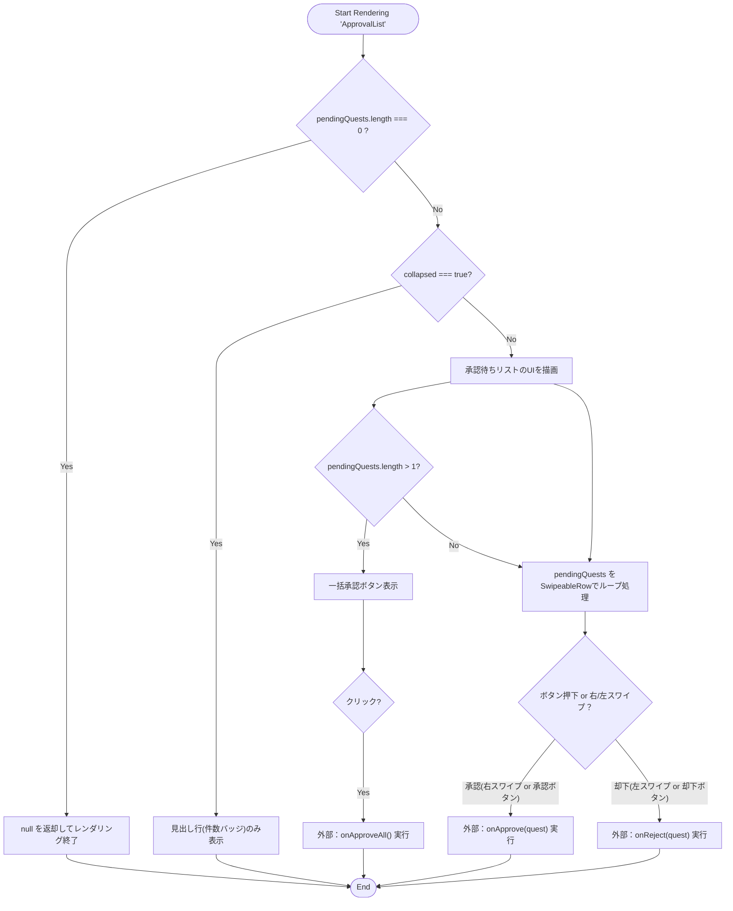
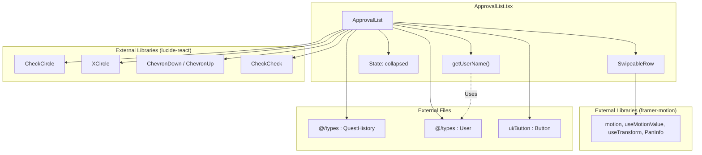

## 1. 解析メタ情報

| 項目 | 内容 |
| --- | --- |
| 対象ファイル | `ApprovalList.tsx` |
| 言語 | React (TypeScript) |
| 解析対象 | 提供されたコードのみ |
| 推測・補完 | 一切なし |
| 解析基準コミット | `c29d467` |

## 関連ドキュメント

- [../../../types/index.md](../../../types/index.md) — `QuestHistory`, `User`の型定義を提供する元ファイル。
- [../../../components/ui/Button.md](../../../components/ui/Button.md) — 承認・却下・一括承認ボタンとして利用するUIコンポーネント。
- [../../family/components/FamilyDashboard.md](../../family/components/FamilyDashboard.md) — 横画面レイアウトにおける利用元コンポーネント。
- [../../../../App.md](../../../../App.md) — 縦画面レイアウトにおける利用元コンポーネント（`onApprove`/`onReject`/`onApproveAll`を供給する）。

## 2. ファイルの概要

* 承認待ちクエストの一覧を表示し、ユーザーが各クエストの承認・却下、または複数件をまとめて承認するためのUIコンポーネントを提供するファイル。データ（`pendingQuests`, `users`）と承認・却下・一括承認の実行関数（`onApprove`/`onReject`/`onApproveAll`）はすべて親コンポーネントからPropsとして渡され、本ファイル内でAPI通信やReact Queryの利用は一切行わない。
* 根拠: `Props`型定義およびコンポーネント定義 (行番号: 7〜13, 52 / 抜粋: "type Props = {\n    pendingQuests: QuestHistory[];\n    users: User[];\n    onApprove: (history: QuestHistory) => void;\n    onReject: (history: QuestHistory) => void;\n    onApproveAll: () => void;\n};", "const ApprovalList: React.FC<Props> = ({ pendingQuests, users, onApprove, onReject, onApproveAll }) => {")
* 承認待ちが多いときのために全体を折りたたみ可能にする`collapsed`ステート（既定は展開状態）を持ち、`pendingQuests`が複数件あるときは`onApproveAll`を呼ぶ一括承認ボタンを表示する。各行は`SwipeableRow`でラップされ、右スワイプ=承認、左スワイプ=却下のジェスチャーに対応する一方、スワイプに気づかない人のために既存の個別ボタンも廃止せず併存させている。
* 根拠: `collapsed`ステートと一括承認ボタン (行番号: 53〜54, 79〜85 / 抜粋: "// 承認待ちが多いときに折りたためるように(デフォルトは開いた状態)\n    const [collapsed, setCollapsed] = useState(false);", "{pendingQuests.length > 1 && (\n                        
\n                            <Button variant=\"success\" size=\"sm\" onClick={onApproveAll}>")
* 根拠: `SwipeableRow`とスワイプ操作のコメント (行番号: 17〜18, 87 / 抜粋: "// スワイプで承認/却下できる行ラッパー。右スワイプ=承認、左スワイプ=却下。\n// ボタンは廃止せず併存させ、スワイプに気づかない人でも従来通り操作できるようにする。", "
→ スワイプで承認 / ← スワイプで却下
")
* コード中に「`{/* --- クエスト承認リスト (既存) --- */}`」というコメントが残っており、かつてクエスト一覧と並んで別の承認待ちリスト（アイテム使用承認リストと見られる。`pendingItems`/`currentUser`/`Modal`/`consumeMutation`等を伴う設計）が本コンポーネント内に存在していたことを示唆する。しかし現在のPropsやimportにその痕跡は無く、クエスト承認機能のみが本ファイルの現行スコープである（詳細は「8. 保守上の注意点」参照）。
* 根拠: (行番号: 90 / 抜粋: "{/* --- クエスト承認リスト (既存) --- */}")

## 3. 外部依存関係

### インポート一覧

| 名称 | 種類 | 用途 | 根拠 |
| --- | --- | --- | --- |
| `React`, `useState` | ライブラリ (`react`) | コンポーネント定義とローカル状態管理（`collapsed`） | 根拠: [import文] (行番号: 1 / 抜粋: "import React, { useState } from 'react';") |
| `CheckCircle`, `XCircle`, `ChevronDown`, `ChevronUp`, `CheckCheck` | ライブラリ (`lucide-react`) | UI上のアイコン表示（承認、却下、折りたたみ開閉、一括承認） | 根拠: [import文] (行番号: 2 / 抜粋: "import { CheckCircle, XCircle, ChevronDown, ChevronUp, CheckCheck } from 'lucide-react';") |
| `motion`, `useMotionValue`, `useTransform`, `PanInfo` | ライブラリ (`framer-motion`) | `SwipeableRow`のドラッグ（スワイプ）操作、ドラッグ量に応じた背景色のアニメーション | 根拠: [import文] (行番号: 3 / 抜粋: "import { motion, useMotionValue, useTransform, PanInfo } from 'framer-motion';") |
| `QuestHistory`, `User` | 型定義 (`@/types`) | Propsの型定義 | 根拠: [import文] (行番号: 4 / 抜粋: "import { QuestHistory, User } from '@/types';") |
| `Button` | コンポーネント (`../../../components/ui/Button`) | 承認・却下・一括承認ボタンのUI構築 | 根拠: [import文] (行番号: 5 / 抜粋: "import { Button } from '../../../components/ui/Button';") |

### ブラックボックスとなる外部要素

| 名称 | 理由 | 根拠 |
| --- | --- | --- |
| `QuestHistory`, `User` の全スキーマ | 本ファイルには型定義の実体がなく、`@/types`からインポートしているため一部のプロパティ（`id`, `quest_title`, `user_id`, `gold_earned`, `name`）以外の全体像が不明。 | 根拠: [import文] (行番号: 4 / 抜粋: "import { QuestHistory, User } from '@/types';") |
| `Button` | デザインや振る舞い（`variant`, `size`などのPropsの処理）の実装詳細が不明なため。 | 根拠: [import文] (行番号: 5 / 抜粋: "import { Button } from '../../../components/ui/Button';") |
| `framer-motion`の`useMotionValue`/`useTransform`/`drag`の内部実装 | ドラッグ量から背景色を補間する仕組みや、タッチ/マウスイベントの扱いの詳細が本ファイルからは不明なため。 | 根拠: [SwipeableRow] (行番号: 19〜36 / 抜粋: "const x = useMotionValue(0);") |

## 4. 主要要素の定義（関数 / エンドポイント / コンポーネント）

### `Props` (型定義)

* **役割**: `ApprovalList`が受け取るプロパティの型定義。承認待ちクエスト一覧・ユーザー一覧に加え、承認・却下・一括承認をそれぞれ親に委譲するコールバック（`onApprove`/`onReject`/`onApproveAll`）を持つ。**（Issue #391 / F-L8で追加）** 任意の`busyHistoryIds?: ID[]`（承認APIが送信中の履歴id。`App.tsx`の`approvingHistoryIdsRef`の写し）と`isApprovingAll?: boolean`（一括承認の実行中）を受け取り、該当行のボタン・スワイプと「すべて承認」ボタンの表示制御に使う。
* 根拠: (行番号: 7〜18 / 抜粋: "type Props = {\n    pendingQuests: QuestHistory[];\n    users: User[];\n    onApprove: (history: QuestHistory) => void;\n    onReject: (history: QuestHistory) => void;\n    onApproveAll: () => void;\n    // #391(F-L8): 承認APIが送信中の履歴id(App側の approvingHistoryIdsRef の写し)。\n    // 該当行の承認/却下ボタンをローディング表示にし、スワイプも無効化する。\n    busyHistoryIds?: ID[];\n    // 一括承認の実行中。「すべて承認」ボタンをローディング表示にする。\n    isApprovingAll?: boolean;\n};")

### `SWIPE_THRESHOLD` (モジュールレベル定数)

* **役割**: `SwipeableRow`のドラッグ量（px）がこの値を超えたときにスワイプ承認/却下とみなす閾値。
* 根拠: (行番号: 15 / 抜粋: "const SWIPE_THRESHOLD = 90;")

### `SwipeableRow`

* **役割**: スワイプで承認/却下できる行ラッパーコンポーネント。右スワイプ（`info.offset.x > SWIPE_THRESHOLD`）で`onSwipeApprove`、左スワイプ（`info.offset.x < -SWIPE_THRESHOLD`）で`onSwipeReject`を呼ぶ。ドラッグ量に応じて`useTransform`で背景色を赤（却下方向）〜透明〜緑（承認方向）に補間する。既存のボタンは廃止せず併存させ、スワイプに気づかない人でも従来通り操作できるようにする設計であることがコメントに明記されている。
* 根拠: (行番号: 17〜50 / 抜粋: "// スワイプで承認/却下できる行ラッパー。右スワイプ=承認、左スワイプ=却下。\n// ボタンは廃止せず併存させ、スワイプに気づかない人でも従来通り操作できるようにする。\nconst SwipeableRow: React.FC<{")

* **引数/リクエスト**: `{ onSwipeApprove?: () => void, onSwipeReject?: () => void, children: React.ReactNode }`
* 根拠: (行番号: 19〜23)

* **戻り値/レスポンス**: JSX要素（ドラッグ可能な`motion.div`）
* 根拠: (行番号: 38〜48 / 抜粋: "return (\n        <motion.div\n            style={{ x, background }}\n            drag={draggable ? 'x' : false}")

* **副作用**: なし（`onSwipeApprove`/`onSwipeReject`は親から渡されたコールバックを呼ぶのみ）
* **エラーハンドリング**: `onSwipeApprove`/`onSwipeReject`のいずれも渡されていない場合、`draggable`が偽になり`drag`は無効化される。
* 根拠: (行番号: 36 / 抜粋: "const draggable = !!(onSwipeApprove || onSwipeReject);")

### `getUserName`

* **役割**: `userId`を元に`users`配列からユーザー名を検索して返す関数。ユーザーが見つからない場合は`userId`をそのまま返す。
* 根拠: (行番号: 56〜58 / 抜粋: "const getUserName = (userId: string) => {\n        return users.find(u => u.user_id === userId)?.name || userId;\n    };")

* **引数/リクエスト**: `userId: string`
* **戻り値/レスポンス**: `string` (ユーザー名、または userId)
* **副作用**: なし
* **エラーハンドリング**: ユーザーが見つからない場合にオプショナルチェーンと論理和を用いてフォールバック（`userId`を返す）処理を行う。
* 根拠: (行番号: 57 / 抜粋: "return users.find(u => u.user_id === userId)?.name || userId;")

### `ApprovalList`

* **役割**: 承認待ちクエストの一覧を表示し、各クエストについて親から渡されたハンドラ（`onApprove`/`onReject`）を、複数件あれば一括承認ハンドラ（`onApproveAll`）を、ボタン押下またはスワイプ操作から呼び出すReactコンポーネント。`pendingQuests`が空の場合は何も描画しない。`collapsed`が真の間は見出し行のみを表示し、詳細リストを畳む。
* 根拠: (行番号: 57〜133 / 抜粋: "const ApprovalList: React.FC<Props> = ({ pendingQuests, users, onApprove, onReject, onApproveAll, busyHistoryIds = [], isApprovingAll = false }) => {")
* **（Issue #391 / F-L8）** 各行は`busy = quest.id != null && busyHistoryIds.includes(quest.id)`を判定し、`busy`なら`SwipeableRow`にスワイプハンドラを渡さず（ドラッグ無効）、却下ボタンは`disabled`、承認ボタンは`isLoading`（`Button`のスピナー表示＋disabled）にする。「クエストをすべて承認」ボタンは`isApprovingAll`の間`isLoading`になる。以前は一括承認中に個別の「承認」をタップすると、サーバー側で既に承認済みのため400「承認待ちではありません」のエラーモーダルが出ていた。
* 根拠: (行番号: 86, 96〜104, 118〜123 / 抜粋: "<Button variant=\"success\" size=\"sm\" onClick={onApproveAll} isLoading={isApprovingAll}>", "const busy = quest.id != null && busyHistoryIds.includes(quest.id);", "onSwipeApprove={busy ? undefined : () => onApprove(quest)}\n                                onSwipeReject={busy ? undefined : () => onReject(quest)}", "onClick={() => onReject(quest)} disabled={busy}", "onClick={() => onApprove(quest)} isLoading={busy}")

* **引数/リクエスト**: `Props` (`pendingQuests: QuestHistory[]`, `users: User[]`, `onApprove: (history: QuestHistory) => void`, `onReject: (history: QuestHistory) => void`, `onApproveAll: () => void`, `busyHistoryIds?: ID[]`, `isApprovingAll?: boolean`)
* 根拠: (行番号: 7〜18, 57)

* **戻り値/レスポンス**: JSX.Element（`pendingQuests`が1件以上ある場合）または `null`（0件の場合）
* 根拠: (行番号: 60 / 抜粋: "if (pendingQuests.length === 0) return null;")

* **副作用**:
  * クエスト行のボタン押下、またはスワイプ（`SwipeableRow`）で、親から渡された`onApprove`/`onReject`をそのまま呼び出す（本コンポーネント自体はAPI通信を一切行わない）。
  * 根拠: (行番号: 94〜95, 110, 113 / 抜粋: "onSwipeApprove={() => onApprove(quest)}\n                                onSwipeReject={() => onReject(quest)}", "<Button variant=\"danger\" size=\"sm\" className=\"min-h-[44px] min-w-[44px]\" onClick={() => onReject(quest)}>")
  * `pendingQuests`が複数件（`pendingQuests.length > 1`）のとき表示される一括承認ボタン押下で、親から渡された`onApproveAll`をそのまま呼び出す。
  * 根拠: (行番号: 79〜84 / 抜粋: "{pendingQuests.length > 1 && (\n                        
\n                            <Button variant=\"success\" size=\"sm\" onClick={onApproveAll}>")
  * `collapsed`ボタン押下で折りたたみ状態をトグルする。
  * 根拠: (行番号: 66〜69 / 抜粋: "<button\n                onClick={() => setCollapsed(c => !c)}")

* **エラーハンドリング**: 本コンポーネント内でのエラーハンドリングは存在せず、承認・却下・一括承認の処理はすべて`onApprove`/`onReject`/`onApproveAll`という親から渡された関数に委譲されている。
* 根拠: (行番号: 94〜95, 110, 113 / 抜粋: "onSwipeApprove={() => onApprove(quest)}\n                                onSwipeReject={() => onReject(quest)}")

## 5. 処理フロー図

```mermaid
flowchart TD
    Start(["Start Rendering 'ApprovalList'"]) --> CheckEmpty{"pendingQuests.length === 0 ?"}

    CheckEmpty -->|"Yes"| ReturnNull["null を返却してレンダリング終了"] --> End(["End"])
    CheckEmpty -->|"No"| ToggleCheck{"collapsed === true?"}
    ToggleCheck -->|"Yes"| HeaderOnly["見出し行(件数バッジ)のみ表示"] --> End
    ToggleCheck -->|"No"| RenderUI["承認待ちリストのUIを描画"]

    RenderUI --> CheckMulti{"pendingQuests.length > 1?"}
    CheckMulti -- Yes --> ApproveAllBtn["一括承認ボタン表示"]
    ApproveAllBtn --> ApproveAllClick{"クリック?"}
    ApproveAllClick -- Yes --> CallOnApproveAll["外部：onApproveAll() 実行"] --> End
    CheckMulti -- No --> QuestList

    RenderUI --> QuestList["pendingQuests をSwipeableRowでループ処理"]
    QuestList --> QuestGesture{"ボタン押下 or 右/左スワイプ？"}
    QuestGesture -- 承認(右スワイプ or 承認ボタン) --> CallOnApprove["外部：onApprove(quest) 実行"] --> End
    QuestGesture -- 却下(左スワイプ or 却下ボタン) --> CallOnReject["外部：onReject(quest) 実行"] --> End
```

## 6. 依存関係図

```mermaid
graph TD
    subgraph "ApprovalList.tsx"
        Component_ApprovalList["ApprovalList"]
        Component_SwipeableRow["SwipeableRow"]
        State_Collapsed["State: collapsed"]
        Func_getUserName["getUserName()"]
    end

    subgraph "External Libraries (framer-motion)"
        FramerMotion["motion, useMotionValue, useTransform, PanInfo"]
    end

    subgraph "External Libraries (lucide-react)"
        Icon_CheckCircle["CheckCircle"]
        Icon_XCircle["XCircle"]
        Icon_Chevrons["ChevronDown / ChevronUp"]
        Icon_CheckCheck["CheckCheck"]
    end

    subgraph "External Files"
        Type_QuestHistory["@/types : QuestHistory"]
        Type_User["@/types : User"]
        UI_Button["ui/Button : Button"]
    end

    Component_ApprovalList --> State_Collapsed
    Component_ApprovalList --> Component_SwipeableRow
    Component_SwipeableRow --> FramerMotion

    Component_ApprovalList --> Icon_CheckCircle
    Component_ApprovalList --> Icon_XCircle
    Component_ApprovalList --> Icon_Chevrons
    Component_ApprovalList --> Icon_CheckCheck

    Component_ApprovalList --> UI_Button
    Component_ApprovalList --> Type_QuestHistory
    Component_ApprovalList --> Type_User
    Component_ApprovalList --> Func_getUserName

    Func_getUserName -. Uses .-> Type_User
```

## 7. 次のステップ（リバースエンジニアリングの提案）

| 優先度 | ファイル名(推測可) | 理由 | 根拠 |
| --- | --- | --- | --- |
| 高 | 本コンポーネントを呼び出す親コンポーネント (`App.tsx`, `FamilyDashboard.tsx`) | `pendingQuests`, `users`がどこで取得・ポーリングされてPropsとして渡されるか、`onApprove`/`onReject`/`onApproveAll`の実装（承認・却下記録名義、一括承認時のメダル演出等）を把握するため。 | 根拠: [Props型定義] (行番号: 7〜13 / 抜粋: "type Props = {") |
| 中 | `@/types.ts` | `QuestHistory`, `User` の全体スキーマを把握し、他に必要な情報がコンポーネント内で活用できるか確認するため。 | 根拠: [インポート] (行番号: 4 / 抜粋: "import { QuestHistory, User } from '@/types';") |
| 低 | `family-quest/src/features/shop/components/InventoryList.tsx` | 「8. 保守上の注意点」で触れる、かつて本コンポーネントに存在したと見られるアイテム使用承認UIが、廃止後の現行の即時使用フローでどのように実装されているかを確認するため。 | 根拠: [コメント] (行番号: 90 / 抜粋: "{/* --- クエスト承認リスト (既存) --- */}") |

## 8. 保守上の注意点

* `SwipeableRow`によるスワイプ操作と個別ボタンは機能的に重複しており（同じ`onApprove`/`onReject`を呼ぶ）、意図的な冗長設計である（コメントにより「スワイプに気づかない人でも従来通り操作できるように」と明記）。UIを変更する際はスワイプ・ボタン両方の導線を維持する必要がある。
* 根拠: (行番号: 17〜18 / 抜粋: "// スワイプで承認/却下できる行ラッパー。右スワイプ=承認、左スワイプ=却下。\n// ボタンは廃止せず併存させ、スワイプに気づかない人でも従来通り操作できるようにする。")
* `pendingQuests`のデータ取得・ポーリングは本コンポーネントの外側（親コンポーネント、`useGameData`）の責務であり、本ファイル単体からは取得間隔や更新タイミングは判断できない。
* コード中の`{/* --- クエスト承認リスト (既存) --- */}`というコメント（対比すべき別リストへの言及を伴わない、孤立した状態のコメント）は、かつて本コンポーネントにクエスト以外の承認待ちリスト（アイテム使用承認。旧`pendingItems`/`Modal`/`consumeMutation`等を伴う設計だったと見られる）が併存していた名残と考えられる。2026-08-29のコミット`9d5edec`（アイテム使用時の親承認フロー廃止、`family-quest/CLAUDE.md`の改訂メモに記載）以降、本ファイルはクエスト承認のみを扱うスコープに縮小されており、Props(`Props`型)にもアイテム関連のフィールド（`pendingItems`/`currentUser`等）は一切存在しない。新規に承認対象を追加する際は、このコメントを削除するか実態に合わせて更新することが望ましい。
* 根拠: (行番号: 7〜13, 90 / 抜粋: "type Props = {\n    pendingQuests: QuestHistory[];\n    users: User[];\n    onApprove: (history: QuestHistory) => void;\n    onReject: (history: QuestHistory) => void;\n    onApproveAll: () => void;\n};", "{/* --- クエスト承認リスト (既存) --- */}")

## 9. 不明事項一覧

| 項目 | 理由 | 必要なファイル |
| --- | --- | --- |
| Propsとして渡される `onApprove`, `onReject`, `onApproveAll` の具体的な処理 | 親コンポーネントで定義された関数を受け取って実行しているだけのため。 | `ApprovalList`を呼び出している親コンポーネントファイル (`App.tsx`, `FamilyDashboard.tsx`) |
| `pendingQuests`, `users` の取得元・ポーリング間隔 | QueryClientのキャッシュ管理ポリシーが本ファイルからは判断不可のため。 | 本コンポーネントを呼び出している親コンポーネント (`useGameData.ts`等) |
| かつて存在したと見られるアイテム使用承認UIの現行の実装場所 | 「8. 保守上の注意点」で触れた`{/* --- クエスト承認リスト (既存) --- */}`コメントから存在が推測されるのみで、廃止後にアイテム使用がどこでどのように行われるかは本ファイルからは不明なため。 | `family-quest/src/features/shop/components/InventoryList.tsx`、`family-quest/CLAUDE.md`（改訂メモ） |

## 相互参照による補足情報

本ファイルの改版にあたり、上記の不明事項について他ドキュメントとの直接照合による追加解明は行っていない（親コンポーネント側の行番号は変動が大きく、本ファイル単体の解析範囲を超えるため）。

## 10. 自己検証結果

* [x] 推測・外部ファイルの仕様を一切含んでいない
* [x] 全関数・全クラス・全コンポーネントを列挙した
* [x] 全てのインポート要素を列挙した
* [x] すべての仕様説明に「根拠（行番号・抜粋）」を明記した
* [x] 根拠漏れが0件である
* [x] Mermaid構文にエラーの原因となる記号（エスケープ漏れ）がない
* [x] 不明事項を漏れなく列挙した

完了
