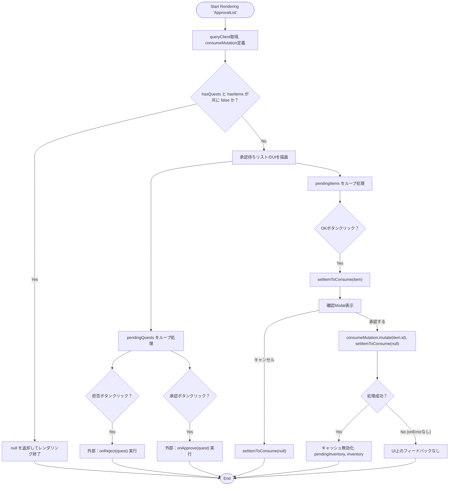

## 1. 解析メタ情報

| 項目 | 内容 |
| --- | --- |
| 対象ファイル | `ApprovalList.tsx` |
| 言語 | React (TypeScript) |
| 解析対象 | 提供されたコードのみ |
| 推測・補完 | 一切なし |

## 2. ファイルの概要

* 承認待ちのクエストおよびアイテム使用申請のリストを表示し、ユーザーがそれぞれの承認・拒否（クエスト）／承認（アイテム）のアクションを実行するためのUIコンポーネントを提供するファイル。クエストとアイテムのデータはいずれも親コンポーネントからPropsとして渡され、本ファイル内でのAPIポーリングは行わない。アイテム使用の承認確認は、ブラウザ標準の`confirm()`ではなくアプリ標準の`Modal`コンポーネントで行う。
* 根拠: [ApprovalList] (行番号: 18〜129 / 抜粋: "const ApprovalList: React.FC<Props> = ({ pendingQuests, pendingItems, users, currentUser, onApprove, onReject }) => {")

## 3. 外部依存関係

### インポート一覧

| 名称 | 種類 | 用途 | 根拠 |
| --- | --- | --- | --- |
| `React`, `useState` | ライブラリ (`react`) | コンポーネント定義とローカル状態管理（`itemToConsume`） | 根拠: [import文] (行番号: 1 / 抜粋: "import React, { useState } from 'react';") |
| `useMutation`, `useQueryClient` | ライブラリ (`@tanstack/react-query`) | アイテム消費APIの実行とキャッシュ無効化 | 根拠: [import文] (行番号: 2 / 抜粋: "import { useMutation, useQueryClient } from '@tanstack/react-query';") |
| `CheckCircle`, `XCircle`, `Package` | ライブラリ (`lucide-react`) | UI上のアイコン表示 | 根拠: [import文] (行番号: 3 / 抜粋: "import { CheckCircle, XCircle, Package } from 'lucide-react'; // Packageアイコン追加") |
| `QuestHistory`, `User`, `PendingInventory` | 型定義 (`@/types`) | Propsおよび内部変数の型定義 | 根拠: [import文] (行番号: 4 / 抜粋: "import { QuestHistory, User, PendingInventory } from '@/types';") |
| `Button` | コンポーネント (`../../../components/ui/Button`) | 承認・拒否・OKボタンのUI構築 | 根拠: [import文] (行番号: 5 / 抜粋: "import { Button } from '../../../components/ui/Button';") |
| `Modal` | コンポーネント (`../../../components/ui/Modal`) | アイテム使用承認の確認ダイアログ表示 | 根拠: [import文] (行番号: 6 / 抜粋: "import { Modal } from '../../../components/ui/Modal';") |
| `apiClient` | モジュール (`../../../lib/apiClient`) | アイテム消費API（`consumeItem`）の呼び出し | 根拠: [import文] (行番号: 7 / 抜粋: "import { apiClient } from '../../../lib/apiClient';") |

### ブラックボックスとなる外部要素

| 名称 | 理由 | 根拠 |
| --- | --- | --- |
| `QuestHistory`, `User`, `PendingInventory` の全スキーマ | 本ファイルには型定義の実体がなく、`@/types`からインポートしているため一部のプロパティ（`id`, `quest_title`, `user_id`, `gold_earned`, `name`, `title`, `used_at`, `user_name`など）以外の全体像が不明。 | 根拠: [import文] (行番号: 4 / 抜粋: "import { QuestHistory, User, PendingInventory } from '@/types';") |
| `Button`, `Modal` | デザインや振る舞い（`variant`, `size`, `isOpen`などのPropsの処理）の実装詳細が不明なため。 | 根拠: [import文] (行番号: 5〜6 / 抜粋: "import { Button } from '../../../components/ui/Button';") |
| `apiClient.consumeItem` | 具体的なエンドポイント、リクエスト/レスポンス構造、エラーハンドリングが不明なため。 | 根拠: [apiClient呼び出し] (行番号: 25 / 抜粋: "mutationFn: (inventoryId: number) => apiClient.consumeItem(currentUser.user_id, inventoryId),") |

## 4. 主要要素の定義（関数 / エンドポイント / コンポーネント）

### `ApprovalList`

* **役割**: 承認待ちクエストとアイテムのリストを表示し、親から渡されたハンドラ（`onApprove`/`onReject`）またはAPI（`consumeItem`）を通して承認・拒否処理を実行するReactコンポーネント。両方とも空の場合は何も描画しない。
* 根拠: [ApprovalList] (行番号: 18〜129 / 抜粋: "const ApprovalList: React.FC<Props> = ({ pendingQuests, pendingItems, users, currentUser, onApprove, onReject }) => {")

* **引数/リクエスト**: `Props` (`pendingQuests: QuestHistory[]`, `pendingItems: PendingInventory[]`, `users: User[]`, `currentUser: User`, `onApprove: (history: QuestHistory) => void`, `onReject: (history: QuestHistory) => void`)
* 根拠: [Props型定義] (行番号: 9〜16 / 抜粋: "type Props = {")

* **戻り値/レスポンス**: JSX.Element（クエストまたはアイテムの承認待ちが1件以上ある場合）または `null`（両方空の場合）
* 根拠: [早期return] (行番号: 40 / 抜粋: "if (!hasQuests && !hasItems) return null;")

* **副作用**:
* `useMutation`（`consumeMutation`）実行成功時のクエリキャッシュ無効化（`pendingInventory`, `inventory`の再フェッチ）。
* 根拠: [consumeMutation定義] (行番号: 24〜31 / 抜粋: "const consumeMutation = useMutation({")
* クエスト承認・拒否ボタン押下時に、親から渡された`onApprove`/`onReject`をそのまま呼び出す（本コンポーネント自体はAPI通信を行わない）。
* 根拠: [クエストリストのボタン] (行番号: 64, 67 / 抜粋: "<Button variant=\"danger\" size=\"sm\" onClick={() => onReject(quest)}>")
* アイテムの「OK」ボタン押下で`itemToConsume`ステートに対象アイテムを設定し確認モーダルを表示。モーダル内「承認する」ボタン押下で`consumeMutation.mutate(itemToConsume.id)`を実行し`itemToConsume`をnullに戻す。
* 根拠: [Modal内ボタン] (行番号: 113〜120 / 抜粋: "onClick={() => { consumeMutation.mutate(itemToConsume.id); setItemToConsume(null); }}")

* **エラーハンドリング**: `consumeMutation`に`onError`ハンドラは定義されておらず、失敗時のフィードバックはUI上に存在しない。クエストの承認・拒否についても本コンポーネント内でのエラーハンドリングはなく、処理は`onApprove`/`onReject`という親から渡された関数に委譲されている。
* 根拠: [consumeMutation定義] (行番号: 24〜31 / 抜粋: "const consumeMutation = useMutation({")

### `getUserName`

* **役割**: `userId`を元に`users`配列からユーザー名を検索して返す関数。ユーザーが見つからない場合は`userId`をそのまま返す。
* 根拠: [getUserName] (行番号: 33〜35 / 抜粋: "const getUserName = (userId: string) => {")

* **引数/リクエスト**: `userId: string`
* 根拠: [引数] (行番号: 33 / 抜粋: "const getUserName = (userId: string) => {")

* **戻り値/レスポンス**: `string` (ユーザー名、または userId)
* 根拠: [戻り値] (行番号: 34 / 抜粋: "return users.find(u => u.user_id === userId)?.name || userId;")

* **副作用**: なし
* 根拠: [getUserName] (行番号: 33〜35 / 抜粋: "const getUserName = (userId: string) => {")

* **エラーハンドリング**: ユーザーが見つからない場合にオプショナルチェーンと論理和を用いてフォールバック（`userId`を返す）処理を行う。
* 根拠: [フォールバック] (行番号: 34 / 抜粋: "return users.find(u => u.user_id === userId)?.name || userId;")

## 5. 処理フロー図

```mermaid
flowchart TD
    Start(["Start Rendering 'ApprovalList'"]) --> Init["queryClient取得, consumeMutation定義"]
    Init --> CheckEmpty{"hasQuests と hasItems が共に false か？"}

    CheckEmpty -->|"Yes"| ReturnNull["null を返却してレンダリング終了"] --> End(["End"])
    CheckEmpty -->|"No"| RenderUI["承認待ちリストのUIを描画"]

    RenderUI --> QuestList["pendingQuests をループ処理"]
    QuestList --> QuestReject{"拒否ボタンクリック？"}
    QuestReject -->|"Yes"| CallOnReject["外部：onReject(quest) 実行"] --> End
    QuestList --> QuestApprove{"承認ボタンクリック？"}
    QuestApprove -->|"Yes"| CallOnApprove["外部：onApprove(quest) 実行"] --> End

    RenderUI --> ItemList["pendingItems をループ処理"]
    ItemList --> ItemOK{"OKボタンクリック？"}
    ItemOK -->|"Yes"| SetItemToConsume["setItemToConsume(item)"]
    SetItemToConsume --> ConfirmModal["確認Modal表示"]
    ConfirmModal -->|"承認する"| MutateItem["consumeMutation.mutate(item.id), setItemToConsume(null)"]
    ConfirmModal -->|"キャンセル"| CloseModal["setItemToConsume(null)"] --> End

    MutateItem --> MutateSuccess{"処理成功？"}
    MutateSuccess -->|"Yes"| InvalidateQueries["キャッシュ無効化: pendingInventory, inventory"] --> End
    MutateSuccess -->|"No (onErrorなし)"| NoFeedback["UI上のフィードバックなし"] --> End

```

## 6. 依存関係図

```mermaid
graph TD
    subgraph "ApprovalList.tsx"
        Component_ApprovalList["ApprovalList"]
        State_ItemToConsume["State: itemToConsume"]
        Mutation_Consume["consumeMutation"]
        Func_getUserName["getUserName()"]
    end

    subgraph "External Libraries (@tanstack/react-query)"
        Hook_useMutation["useMutation"]
        Hook_useQueryClient["useQueryClient"]
    end

    subgraph "External Libraries (lucide-react)"
        Icon_CheckCircle["CheckCircle"]
        Icon_XCircle["XCircle"]
        Icon_Package["Package"]
    end

    subgraph "External Files"
        Type_QuestHistory["@/types : QuestHistory"]
        Type_User["@/types : User"]
        Type_PendingInventory["@/types : PendingInventory"]
        UI_Button["ui/Button : Button"]
        UI_Modal["ui/Modal : Modal"]
        API_Client["lib/apiClient : apiClient"]
    end

    Component_ApprovalList --> Hook_useMutation
    Component_ApprovalList --> Hook_useQueryClient
    Component_ApprovalList --> State_ItemToConsume
    Component_ApprovalList --> Mutation_Consume

    Component_ApprovalList --> Icon_CheckCircle
    Component_ApprovalList --> Icon_XCircle
    Component_ApprovalList --> Icon_Package

    Component_ApprovalList --> UI_Button
    Component_ApprovalList --> UI_Modal

    Mutation_Consume --> API_Client
    Component_ApprovalList --> Type_QuestHistory
    Component_ApprovalList --> Type_User
    Component_ApprovalList --> Type_PendingInventory
    Component_ApprovalList --> Func_getUserName

    Func_getUserName -. Uses .-> Type_User

```

## 7. 次のステップ（リバースエンジニアリングの提案）

| 優先度 | ファイル名(推測可) | 理由 | 根拠 |
| --- | --- | --- | --- |
| 高 | `../../../lib/apiClient.ts` | `consumeItem`の具体的なエンドポイントや、通信失敗時のエラーハンドリング実装を確認するため。 | 根拠: [インポート] (行番号: 7 / 抜粋: "import { apiClient } from '../../../lib/apiClient';") |
| 高 | 本コンポーネントを呼び出す親コンポーネント | `pendingQuests`, `pendingItems`, `currentUser` がどこで取得・ポーリングされてPropsとして渡されるか、システム全体のデータフローを把握するため。 | 根拠: [Props型定義] (行番号: 9〜16 / 抜粋: "type Props = {") |
| 中 | `@/types.ts` | `QuestHistory`, `User`, `PendingInventory` の全体スキーマを把握し、他に必要な情報がコンポーネント内で活用できるか確認するため。 | 根拠: [インポート] (行番号: 4 / 抜粋: "import { QuestHistory, User, PendingInventory } from '@/types';") |

## 8. 保守上の注意点

* アイテム使用の拒否（キャンセル）処理について、UI上にボタンはあるが「アイテム使用の拒否(キャンセル)は現状APIがないため、一旦承認のみ実装」とコメントされており、拒否機能は実装されていない。
* 根拠: [コメント] (行番号: 89 / 抜粋: "{/* アイテム使用の拒否(キャンセル)は現状APIがないため、一旦承認のみ実装 */}")
* `consumeMutation`に`onError`ハンドラが定義されておらず、通信失敗時にユーザーへフィードバックが行われない。
* `pendingQuests`と`pendingItems`のデータ取得・ポーリングは本コンポーネントの外側（親コンポーネント）の責務であり、本ファイル単体からは取得間隔や更新タイミングは判断できない。
* アイテム使用の承認確認は、以前はブラウザ標準の`window.confirm()`を使っていたと推測されるが、現在は`itemToConsume`ステートと`Modal`コンポーネントを用いたアプリ内モーダルに置き換えられている。
* 根拠: [コメント] (行番号: 20 / 抜粋: "// ★変更: 素の confirm() を廃止し、アプリ標準の Modal で「アイテム使用承認」の確認を行う")
* `consumeMutation`の`mutationFn`は`currentUser.user_id`をそのままAPIに渡しており、承認操作を行っている実際のユーザー（親など）のIDが正しく`currentUser`に設定されていることに依存する。

## 9. 不明事項一覧

| 項目 | 理由 | 必要なファイル |
| --- | --- | --- |
| APIの詳細仕様（エンドポイント・ペイロード） | `apiClient`の実装が別ファイルに依存しているため。 | `../../../lib/apiClient.ts` |
| `pendingInventory`, `inventory` キャッシュの初期設定・取得元 | QueryClientのキャッシュ管理ポリシーや`pendingQuests`/`pendingItems`の取得元が本ファイルからは判断不可のため。 | 本コンポーネントを呼び出している親コンポーネント |
| Propsとして渡される `onApprove`, `onReject` の具体的な処理 | 親コンポーネントで定義された関数を受け取って実行しているだけのため。 | `ApprovalList`を呼び出している親コンポーネントファイル |

## 10. 自己検証結果

* [x] 推測・外部ファイルの仕様を一切含んでいない
* [x] 全関数・全クラス・全コンポーネントを列挙した
* [x] 全てのインポート要素を列挙した
* [x] すべての仕様説明に「根拠（行番号・抜粋）」を明記した
* [x] 根拠漏れが0件である
* [x] Mermaid構文にエラーの原因となる記号（エスケープ漏れ）がない
* [x] 不明事項を漏れなく列挙した

完了
