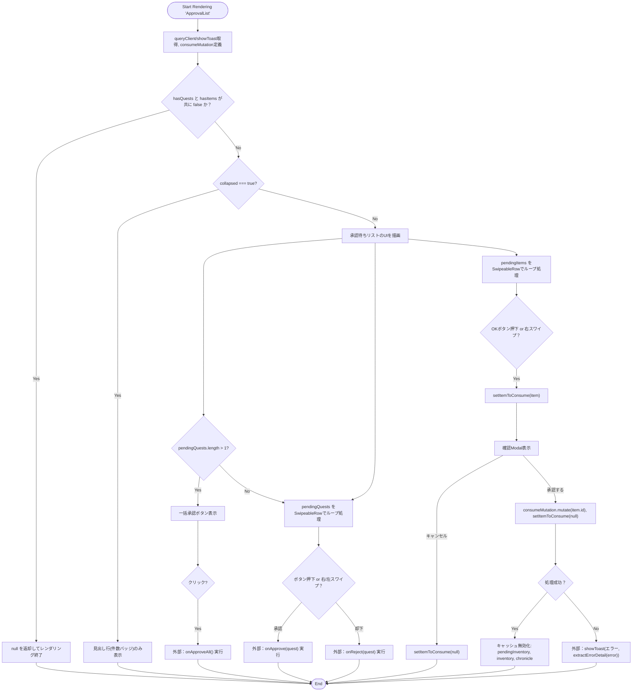

## 1. 解析メタ情報

| 項目 | 内容 |
| --- | --- |
| 対象ファイル | `ApprovalList.tsx` |
| 言語 | React (TypeScript) |
| 解析対象 | 提供されたコードのみ |
| 推測・補完 | 一切なし |

## 関連ドキュメント

- [../../../lib/apiClient.md](../../../lib/apiClient.md) — `consumeItem`など、本ファイルが呼び出すAPIクライアントの実装仕様。
- [../../../../MY_HOME_SYSTEM/quest_router.md](../../../../../MY_HOME_SYSTEM/quest_router.md) — `consumeItem`が呼び出すと推測される対応バックエンドAPI(`POST /inventory/consume`)。
- [../../../types/index.md](../../../types/index.md) — `QuestHistory`, `User`, `PendingInventory`の型定義を提供する元ファイル。
- [../../../components/ui/Button.md](../../../components/ui/Button.md) — 承認・拒否・OKボタンとして利用するUIコンポーネント。
- [../../../components/ui/Modal.md](../../../components/ui/Modal.md) — アイテム使用承認の確認ダイアログとして利用するUIコンポーネント。
- [../../../context/useToast.md](../../../context/useToast.md) — 承認失敗時のエラートースト表示関数`showToast`の実装元（M-6-3バグ修正で新規に参照するようになった）。
- [../../family/components/FamilyDashboard.md](../../family/components/FamilyDashboard.md) — 横画面レイアウトにおける利用元コンポーネント(メイン画面上部に常時統合表示)。
- [../../../../App.md](../../../../App.md) — 縦画面レイアウトにおける利用元コンポーネント(保護者のみ表示、`onApprove`/`onReject`/`onApproveAll`を供給する)。

## 2. ファイルの概要

* 承認待ちのクエストおよびアイテム使用申請の一覧を表示し、ユーザーがそれぞれの承認・却下（クエスト）／承認（アイテム）のアクションを実行するためのUIコンポーネントを提供するファイル。クエストとアイテムのデータはいずれも親コンポーネントからPropsとして渡され、本ファイル内でのAPIポーリングは行わない（アイテム消費を確定させる`consumeMutation`のみ、本ファイル内で完結するAPI呼び出しである）。
* 承認待ちが多いときのために全体を折りたたみ可能にする`collapsed`ステート（既定は展開状態）を持ち、クエストの承認待ちが複数件あるときは`onApproveAll`を呼ぶ一括承認ボタンを表示する。各行は`SwipeableRow`でラップされ、右スワイプ=承認、左スワイプ=却下（アイテムは承認のみ）のジェスチャーに対応する一方、スワイプに気づかない人のために既存の個別ボタンも廃止せず併存させている。
* アイテム使用の承認確認は、ブラウザ標準の`confirm()`ではなくアプリ標準の`Modal`コンポーネント（`itemToConsume`ステートで対象を保持）で行う。「アイテム使用の拒否(キャンセル)は現状APIがないため、一旦承認のみ実装」とコメントされており、拒否機能は実装されていない。
* アイテム消費確定の`consumeMutation`は成功時に`pendingInventory`/`inventory`に加え`chronicle`クエリも無効化する（H-5バグ修正: アイテム消費の確定＝`quest_history`への記録がバックエンドの`consume_item`側で行われるようになったため、冒険の記録もこのタイミングで更新する必要がある）。失敗時は`useToast`の`showToast`でエラートーストを表示する（M-6-3バグ修正: 以前は`onError`ハンドラが無く、通信エラー等がユーザーに一切通知されないサイレント失敗だった）。
* 根拠: `ApprovalList`の定義 (行番号: 64 / 抜粋: "const ApprovalList: React.FC<Props> = ({ pendingQuests, pendingItems, users, currentUser, onApprove, onReject, onApproveAll }) => {")
* 根拠: `collapsed`ステートと一括承認ボタン (行番号: 69〜70, 116〜122 / 抜粋: "// 承認待ちが多いときに折りたためるように(デフォルトは開いた状態)\n    const [collapsed, setCollapsed] = useState(false);", "{pendingQuests.length > 1 && (\n                        
\n                            <Button variant=\"success\" size=\"sm\" onClick={onApproveAll}>")
* 根拠: `SwipeableRow`とスワイプ操作のコメント (行番号: 29〜30, 124行目 / 抜粋: "// スワイプで承認/却下できる行ラッパー。右スワイプ=承認、左スワイプ=却下。\n// ボタンは廃止せず併存させ、スワイプに気づかない人でも従来通り操作できるようにする。", "
→ スワイプで承認 / ← スワイプで却下
")
* 根拠: アイテム拒否未実装のコメント (行番号: 177行目 / 抜粋: "{/* アイテム使用の拒否(キャンセル)は現状APIがないため、一旦承認のみ実装 */}")
* 根拠: `consumeMutation`の`chronicle`無効化(H-5) (行番号: 79〜81行目 / 抜粋: "// H-5: アイテム使用の確定(quest_historyへの記録)はconsume_item時に\n            // 行われるため、冒険の記録(chronicle)もここで無効化する。\n            queryClient.invalidateQueries({ queryKey: ['chronicle'] });")
* 根拠: `consumeMutation`の`onError`追加(M-6-3) (行番号: 83〜87行目 / 抜粋: "// M-6-3: 以前はonErrorが無く、承認失敗(通信エラー等)がユーザーに\n        // 一切通知されないサイレント失敗になっていた。\n        onError: (error) => {\n            showToast({ title: \"エラー\", text: extractErrorDetail(error), icon: \"⚠️\" });\n        }")

## 3. 外部依存関係

### インポート一覧

| 名称 | 種類 | 用途 | 根拠 |
| --- | --- | --- | --- |
| `React`, `useState` | ライブラリ (`react`) | コンポーネント定義とローカル状態管理（`itemToConsume`, `collapsed`） | 根拠: [import文] (行番号: 1 / 抜粋: "import React, { useState } from 'react';") |
| `useMutation`, `useQueryClient` | ライブラリ (`@tanstack/react-query`) | アイテム消費APIの実行とキャッシュ無効化 | 根拠: [import文] (行番号: 2 / 抜粋: "import { useMutation, useQueryClient } from '@tanstack/react-query';") |
| `CheckCircle`, `XCircle`, `Package`, `ChevronDown`, `ChevronUp`, `CheckCheck` | ライブラリ (`lucide-react`) | UI上のアイコン表示（承認、却下、アイテム、折りたたみ開閉、一括承認） | 根拠: [import文] (行番号: 3 / 抜粋: "import { CheckCircle, XCircle, Package, ChevronDown, ChevronUp, CheckCheck } from 'lucide-react';") |
| `motion`, `useMotionValue`, `useTransform`, `PanInfo` | ライブラリ (`framer-motion`) | `SwipeableRow`のドラッグ（スワイプ）操作、ドラッグ量に応じた背景色のアニメーション | 根拠: [import文] (行番号: 4 / 抜粋: "import { motion, useMotionValue, useTransform, PanInfo } from 'framer-motion';") |
| `QuestHistory`, `User`, `PendingInventory` | 型定義 (`@/types`) | Propsおよび内部変数の型定義 | 根拠: [import文] (行番号: 5 / 抜粋: "import { QuestHistory, User, PendingInventory } from '@/types';") |
| `Button` | コンポーネント (`../../../components/ui/Button`) | 承認・拒否・OKボタンのUI構築 | 根拠: [import文] (行番号: 6 / 抜粋: "import { Button } from '../../../components/ui/Button';") |
| `Modal` | コンポーネント (`../../../components/ui/Modal`) | アイテム使用承認の確認ダイアログ表示 | 根拠: [import文] (行番号: 7 / 抜粋: "import { Modal } from '../../../components/ui/Modal';") |
| `apiClient` | モジュール (`../../../lib/apiClient`) | アイテム消費API（`consumeItem`）の呼び出し | 根拠: [import文] (行番号: 8 / 抜粋: "import { apiClient } from '../../../lib/apiClient';") |
| `useToast` | カスタムフック (`../../../context/useToast`) | `consumeMutation`失敗時のエラートースト表示関数`showToast`の取得（M-6-3で新規追加） | 根拠: [import文] (行番号: 9 / 抜粋: "import { useToast } from '../../../context/useToast';") |

### ブラックボックスとなる外部要素

| 名称 | 理由 | 根拠 |
| --- | --- | --- |
| `QuestHistory`, `User`, `PendingInventory` の全スキーマ | 本ファイルには型定義の実体がなく、`@/types`からインポートしているため一部のプロパティ（`id`, `quest_title`, `user_id`, `gold_earned`, `name`, `title`, `used_at`, `user_name`など）以外の全体像が不明。 | 根拠: [import文] (行番号: 5 / 抜粋: "import { QuestHistory, User, PendingInventory } from '@/types';") |
| `Button`, `Modal` | デザインや振る舞い（`variant`, `size`, `isOpen`などのPropsの処理）の実装詳細が不明なため。 | 根拠: [import文] (行番号: 6〜7 / 抜粋: "import { Button } from '../../../components/ui/Button';") |
| `apiClient.consumeItem` | 具体的なエンドポイント、リクエスト/レスポンス構造が不明なため（エラー時に`Error.message`へ`detail`が入ることは`extractErrorDetail`のコメントから読み取れる）。 | 根拠: [apiClient呼び出し] (行番号: 74 / 抜粋: "mutationFn: (inventoryId: number) => apiClient.consumeItem(currentUser.user_id, inventoryId),") |
| `framer-motion`の`useMotionValue`/`useTransform`/`drag`の内部実装 | ドラッグ量から背景色を補間する仕組みや、タッチ/マウスイベントの扱いの詳細が本ファイルからは不明なため。 | 根拠: [SwipeableRow] (行番号: 36〜56 / 抜粋: "const x = useMotionValue(0);") |

## 4. 主要要素の定義（関数 / エンドポイント / コンポーネント）

### `extractErrorDetail` (モジュールレベル関数)

* **役割**: `apiClient`側でスローされた`Error`から、バックエンドが返す`{"detail": "..."}`相当のメッセージ（`Error.message`）を取り出す。`Error`インスタンスでない場合、またはメッセージが空の場合は既定の「操作に失敗しました」を返す。`consumeMutation`の`onError`から呼ばれ、トースト表示のテキストとして使われる（M-6-3バグ修正で新規追加）。
* 根拠: (行番号: 11〜15 / 抜粋: "// M-6-3: apiClient側でスローされるErrorのmessageには、バックエンドが返す\n// {\"detail\": \"...\"} の内容が入っている(apiClient.ts参照)。\nconst extractErrorDetail = (error: unknown): string => {\n    return error instanceof Error && error.message ? error.message : '操作に失敗しました';\n};")

* **引数/リクエスト**: `error: unknown`
* **戻り値/レスポンス**: `string`（`error`が`Error`インスタンスかつメッセージがあればそれ、無ければ「操作に失敗しました」）
* **副作用**: なし
* **エラーハンドリング**: なし（フォールバック文言を返すのみ）

### `Props` (型定義)

* **役割**: `ApprovalList`が受け取るプロパティの型定義。クエスト一覧・アイテム一覧・ユーザー一覧・現在のユーザーに加え、クエストの承認・却下・一括承認をそれぞれ親に委譲するコールバック（`onApprove`/`onReject`/`onApproveAll`）を持つ。
* 根拠: (行番号: 17〜25 / 抜粋: "type Props = {\n    pendingQuests: QuestHistory[];\n    pendingItems: PendingInventory[];\n    users: User[];\n    currentUser: User;\n    onApprove: (history: QuestHistory) => void;\n    onReject: (history: QuestHistory) => void;\n    onApproveAll: () => void;\n};")

### `SWIPE_THRESHOLD` (モジュールレベル定数)

* **役割**: `SwipeableRow`のドラッグ量（px）がこの値を超えたときにスワイプ承認/却下とみなす閾値。
* 根拠: (行番号: 27 / 抜粋: "const SWIPE_THRESHOLD = 90;")

### `SwipeableRow`

* **役割**: スワイプで承認/却下できる行ラッパーコンポーネント。右スワイプ（`info.offset.x > SWIPE_THRESHOLD`）で`onSwipeApprove`、左スワイプ（`info.offset.x < -SWIPE_THRESHOLD`）で`onSwipeReject`を呼ぶ。ドラッグ量に応じて`useTransform`で背景色を赤（却下方向）〜透明〜緑（承認方向）に補間する。既存のボタンは廃止せず併存させ、スワイプに気づかない人でも従来通り操作できるようにする設計であることがコメントに明記されている。
* 根拠: (行番号: 29〜62 / 抜粋: "// スワイプで承認/却下できる行ラッパー。右スワイプ=承認、左スワイプ=却下。\n// ボタンは廃止せず併存させ、スワイプに気づかない人でも従来通り操作できるようにする。\nconst SwipeableRow: React.FC<{")

* **引数/リクエスト**: `{ onSwipeApprove?: () => void, onSwipeReject?: () => void, children: React.ReactNode }`
* 根拠: (行番号: 31〜35)

* **戻り値/レスポンス**: JSX要素（ドラッグ可能な`motion.div`）
* 根拠: (行番号: 50〜60 / 抜粋: "return (\n        <motion.div\n            style={{ x, background }}\n            drag={draggable ? 'x' : false}")

* **副作用**: なし（`onSwipeApprove`/`onSwipeReject`は親から渡されたコールバックを呼ぶのみ）
* **エラーハンドリング**: `onSwipeApprove`/`onSwipeReject`のいずれも渡されていない場合、`draggable`が偽になり`drag`は無効化される。
* 根拠: (行番号: 48 / 抜粋: "const draggable = !!(onSwipeApprove || onSwipeReject);")

### `ApprovalList`

* **役割**: 承認待ちクエストとアイテムの一覧を表示し、クエストは親から渡されたハンドラ（`onApprove`/`onReject`/`onApproveAll`）を、アイテムは本ファイル内の`consumeMutation`（`apiClient.consumeItem`）を通して承認処理を実行するReactコンポーネント。両方とも空の場合は何も描画しない。`collapsed`が真の間は見出し行のみを表示し、詳細リストを畳む。
* 根拠: (行番号: 64〜221 / 抜粋: "const ApprovalList: React.FC<Props> = ({ pendingQuests, pendingItems, users, currentUser, onApprove, onReject, onApproveAll }) => {")

* **引数/リクエスト**: `Props` (`pendingQuests: QuestHistory[]`, `pendingItems: PendingInventory[]`, `users: User[]`, `currentUser: User`, `onApprove: (history: QuestHistory) => void`, `onReject: (history: QuestHistory) => void`, `onApproveAll: () => void`)
* 根拠: (行番号: 17〜25, 64)

* **戻り値/レスポンス**: JSX.Element（クエストまたはアイテムの承認待ちが1件以上ある場合）または `null`（両方空の場合）
* 根拠: (行番号: 97 / 抜粋: "if (!hasQuests && !hasItems) return null;")

* **副作用**:
  * `useMutation`（`consumeMutation`）実行成功時のクエリキャッシュ無効化（`pendingInventory`, `inventory`, `chronicle`の再フェッチ）。失敗時は`showToast`によるエラートースト表示。
  * 根拠: (行番号: 73〜88 / 抜粋: "const consumeMutation = useMutation({\n        mutationFn: (inventoryId: number) => apiClient.consumeItem(currentUser.user_id, inventoryId),")
  * クエスト行のボタン押下、またはスワイプ（`SwipeableRow`）で、親から渡された`onApprove`/`onReject`をそのまま呼び出す（本コンポーネント自体はクエストに対するAPI通信を行わない）。
  * 根拠: (行番号: 129〜132, 147〜152 / 抜粋: "onSwipeApprove={() => onApprove(quest)}\n                                onSwipeReject={() => onReject(quest)}", "<Button variant=\"danger\" size=\"sm\" className=\"min-h-[44px] min-w-[44px]\" onClick={() => onReject(quest)}>")
  * クエストが複数件（`pendingQuests.length > 1`）のとき表示される一括承認ボタン押下で、親から渡された`onApproveAll`をそのまま呼び出す。
  * 根拠: (行番号: 116〜122 / 抜粋: "{pendingQuests.length > 1 && (\n                        
\n                            <Button variant=\"success\" size=\"sm\" onClick={onApproveAll}>")
  * アイテムの「OK」ボタン押下、またはスワイプ承認で`itemToConsume`ステートに対象アイテムを設定し確認モーダルを表示。モーダル内「承認する」ボタン押下で`consumeMutation.mutate(itemToConsume.id)`を実行し`itemToConsume`をnullに戻す。
  * 根拠: (行番号: 160〜163, 205〜214 / 抜粋: "onSwipeApprove={() => setItemToConsume(item)}", "onClick={() => {\n                                    consumeMutation.mutate(itemToConsume.id);\n                                    setItemToConsume(null);\n                                }}")
  * `collapsed`ボタン押下で折りたたみ状態をトグルする。
  * 根拠: (行番号: 103〜112 / 抜粋: "<button\n                onClick={() => setCollapsed(c => !c)}")

* **エラーハンドリング**: `consumeMutation`の`onError`で`extractErrorDetail(error)`をテキストとして`showToast`によるエラートーストを表示する（M-6-3バグ修正、以前は`onError`が無く失敗時のフィードバックが存在しなかった）。クエストの承認・拒否・一括承認についても本コンポーネント内でのエラーハンドリングはなく、処理は`onApprove`/`onReject`/`onApproveAll`という親から渡された関数に委譲されている。
* 根拠: (行番号: 83〜87 / 抜粋: "onError: (error) => {\n            showToast({ title: \"エラー\", text: extractErrorDetail(error), icon: \"⚠️\" });\n        }")

### `getUserName`

* **役割**: `userId`を元に`users`配列からユーザー名を検索して返す関数。ユーザーが見つからない場合は`userId`をそのまま返す。
* 根拠: (行番号: 90〜92 / 抜粋: "const getUserName = (userId: string) => {\n        return users.find(u => u.user_id === userId)?.name || userId;\n    };")

* **引数/リクエスト**: `userId: string`
* **戻り値/レスポンス**: `string` (ユーザー名、または userId)
* **副作用**: なし
* **エラーハンドリング**: ユーザーが見つからない場合にオプショナルチェーンと論理和を用いてフォールバック（`userId`を返す）処理を行う。
* 根拠: (行番号: 91 / 抜粋: "return users.find(u => u.user_id === userId)?.name || userId;")

## 5. 処理フロー図

```mermaid
flowchart TD
    Start(["Start Rendering 'ApprovalList'"]) --> Init["queryClient/showToast取得, consumeMutation定義"]
    Init --> CheckEmpty{"hasQuests と hasItems が共に false か？"}

    CheckEmpty -->|"Yes"| ReturnNull["null を返却してレンダリング終了"] --> End(["End"])
    CheckEmpty -->|"No"| ToggleCheck{"collapsed === true?"}
    ToggleCheck -->|"Yes"| HeaderOnly["見出し行(件数バッジ)のみ表示"] --> End
    ToggleCheck -->|"No"| RenderUI["承認待ちリストのUIを描画"]

    RenderUI --> CheckMulti{"pendingQuests.length > 1?"}
    CheckMulti -- Yes --> ApproveAllBtn["一括承認ボタン表示"]
    ApproveAllBtn --> ApproveAllClick{"クリック?"}
    ApproveAllClick -- Yes --> CallOnApproveAll["外部：onApproveAll() 実行"] --> End
    CheckMulti -- No --> QuestList

    RenderUI --> QuestList["pendingQuests をSwipeableRowでループ処理"]
    QuestList --> QuestGesture{"ボタン押下 or 右/左スワイプ？"}
    QuestGesture -- 承認 --> CallOnApprove["外部：onApprove(quest) 実行"] --> End
    QuestGesture -- 却下 --> CallOnReject["外部：onReject(quest) 実行"] --> End

    RenderUI --> ItemList["pendingItems をSwipeableRowでループ処理"]
    ItemList --> ItemGesture{"OKボタン押下 or 右スワイプ？"}
    ItemGesture -->|"Yes"| SetItemToConsume["setItemToConsume(item)"]
    SetItemToConsume --> ConfirmModal["確認Modal表示"]
    ConfirmModal -->|"承認する"| MutateItem["consumeMutation.mutate(item.id), setItemToConsume(null)"]
    ConfirmModal -->|"キャンセル"| CloseModal["setItemToConsume(null)"] --> End

    MutateItem --> MutateSuccess{"処理成功？"}
    MutateSuccess -->|"Yes"| InvalidateQueries["キャッシュ無効化: pendingInventory, inventory, chronicle"] --> End
    MutateSuccess -->|"No"| ShowErrorToast["外部：showToast(エラー, extractErrorDetail(error))"] --> End
```

## 6. 依存関係図

```mermaid
graph TD
    subgraph "ApprovalList.tsx"
        Component_ApprovalList["ApprovalList"]
        Component_SwipeableRow["SwipeableRow"]
        State_ItemToConsume["State: itemToConsume"]
        State_Collapsed["State: collapsed"]
        Mutation_Consume["consumeMutation"]
        Func_getUserName["getUserName()"]
        Func_extractErrorDetail["extractErrorDetail()"]
    end

    subgraph "External Libraries (@tanstack/react-query)"
        Hook_useMutation["useMutation"]
        Hook_useQueryClient["useQueryClient"]
    end

    subgraph "External Libraries (framer-motion)"
        FramerMotion["motion, useMotionValue, useTransform, PanInfo"]
    end

    subgraph "External Libraries (lucide-react)"
        Icon_CheckCircle["CheckCircle"]
        Icon_XCircle["XCircle"]
        Icon_Package["Package"]
        Icon_Chevrons["ChevronDown / ChevronUp"]
        Icon_CheckCheck["CheckCheck"]
    end

    subgraph "External Files"
        Type_QuestHistory["@/types : QuestHistory"]
        Type_User["@/types : User"]
        Type_PendingInventory["@/types : PendingInventory"]
        UI_Button["ui/Button : Button"]
        UI_Modal["ui/Modal : Modal"]
        API_Client["lib/apiClient : apiClient"]
        Hook_useToast["context/useToast : useToast"]
    end

    Component_ApprovalList --> Hook_useMutation
    Component_ApprovalList --> Hook_useQueryClient
    Component_ApprovalList --> Hook_useToast
    Component_ApprovalList --> State_ItemToConsume
    Component_ApprovalList --> State_Collapsed
    Component_ApprovalList --> Mutation_Consume
    Component_ApprovalList --> Component_SwipeableRow

    Component_SwipeableRow --> FramerMotion

    Component_ApprovalList --> Icon_CheckCircle
    Component_ApprovalList --> Icon_XCircle
    Component_ApprovalList --> Icon_Package
    Component_ApprovalList --> Icon_Chevrons
    Component_ApprovalList --> Icon_CheckCheck

    Component_ApprovalList --> UI_Button
    Component_ApprovalList --> UI_Modal

    Mutation_Consume --> API_Client
    Mutation_Consume --> Func_extractErrorDetail
    Component_ApprovalList --> Type_QuestHistory
    Component_ApprovalList --> Type_User
    Component_ApprovalList --> Type_PendingInventory
    Component_ApprovalList --> Func_getUserName

    Func_getUserName -. Uses .-> Type_User
```

## 7. 次のステップ（リバースエンジニアリングの提案）

| 優先度 | ファイル名(推測可) | 理由 | 根拠 |
| --- | --- | --- | --- |
| 高 | `../../../lib/apiClient.ts` | `consumeItem`の具体的なエンドポイントや、通信失敗時のエラーハンドリング実装を確認するため。 | 根拠: [インポート] (行番号: 8 / 抜粋: "import { apiClient } from '../../../lib/apiClient';") |
| 高 | 本コンポーネントを呼び出す親コンポーネント (`App.tsx`, `FamilyDashboard.tsx`) | `pendingQuests`, `pendingItems`, `currentUser`がどこで取得・ポーリングされてPropsとして渡されるか、`onApprove`/`onReject`/`onApproveAll`の実装（承認・却下記録名義、一括承認時のメダル演出等）を把握するため。 | 根拠: [Props型定義] (行番号: 17〜25 / 抜粋: "type Props = {") |
| 中 | `@/types.ts` | `QuestHistory`, `User`, `PendingInventory` の全体スキーマを把握し、他に必要な情報がコンポーネント内で活用できるか確認するため。 | 根拠: [インポート] (行番号: 5 / 抜粋: "import { QuestHistory, User, PendingInventory } from '@/types';") |
| 低 | `../../../context/useToast.ts` | `showToast`のAPI仕様（表示時間、複数トーストの扱い）を確認するため。 | 根拠: [インポート] (行番号: 9 / 抜粋: "import { useToast } from '../../../context/useToast';") |

## 8. 保守上の注意点

* アイテム使用の拒否（キャンセル）処理について、UI上にボタンはあるが「アイテム使用の拒否(キャンセル)は現状APIがないため、一旦承認のみ実装」とコメントされており、拒否機能は実装されていない。`SwipeableRow`もアイテム行では`onSwipeReject`を渡していない（承認方向のスワイプのみ有効）。
* 根拠: [コメント] (行番号: 177 / 抜粋: "{/* アイテム使用の拒否(キャンセル)は現状APIがないため、一旦承認のみ実装 */}")
* 根拠: [アイテム行のSwipeableRow] (行番号: 160〜163 / 抜粋: "<SwipeableRow\n                                key={item.id}\n                                onSwipeApprove={() => setItemToConsume(item)}\n                            >")
* `consumeMutation`の`onError`は`extractErrorDetail`が返す文言（`Error.message`、無ければ「操作に失敗しました」）をそのままトースト表示するのみで、リトライ機構は無い（App.tsx側の`onApprove`/`onReject`が`onRetry`付きのエラーモーダルを使うのとは異なる通知方式）。M-6-3バグ修正で`onError`自体は新規追加されたが、失敗時の再試行導線は未実装のままである。
* 根拠: (行番号: 83〜87 / 抜粋: "onError: (error) => {\n            showToast({ title: \"エラー\", text: extractErrorDetail(error), icon: \"⚠️\" });\n        }")
* `pendingQuests`と`pendingItems`のデータ取得・ポーリングは本コンポーネントの外側（親コンポーネント、`useGameData`）の責務であり、本ファイル単体からは取得間隔や更新タイミングは判断できない。
* アイテム使用の承認確認は、以前はブラウザ標準の`window.confirm()`を使っていたと推測されるが、現在は`itemToConsume`ステートと`Modal`コンポーネントを用いたアプリ内モーダルに置き換えられている。
* 根拠: [コメント] (行番号: 67 / 抜粋: "// ★変更: 素の confirm() を廃止し、アプリ標準の Modal で「アイテム使用承認」の確認を行う")
* `consumeMutation`の`mutationFn`は`currentUser.user_id`をそのままAPIに渡しており、承認操作を行っている実際のユーザー（親など）のIDが正しく`currentUser`に設定されていることに依存する。
* `consumeMutation`のキャッシュ無効化対象に`chronicle`が追加された（H-5バグ修正）。アイテム消費の確定（`quest_history`への記録）がバックエンド側の`consume_item`に移ったことに対応するもので、新たにキャッシュへ影響する状態変更アクションを本ファイルに追加する際は、`chronicle`への影響有無を同様に検討する必要がある（`useGameData.ts`の`completeQuest`等における`chronicle`無効化方針と同じ考え方）。
* 根拠: (行番号: 79〜81 / 抜粋: "// H-5: アイテム使用の確定(quest_historyへの記録)はconsume_item時に\n            // 行われるため、冒険の記録(chronicle)もここで無効化する。\n            queryClient.invalidateQueries({ queryKey: ['chronicle'] });")
* `SwipeableRow`によるスワイプ操作と個別ボタンは機能的に重複しており（同じ`onApprove`/`onReject`/`setItemToConsume`を呼ぶ）、意図的な冗長設計である（コメントにより「スワイプに気づかない人でも従来通り操作できるように」と明記）。UIを変更する際はスワイプ・ボタン両方の導線を維持する必要がある。
* 根拠: (行番号: 29〜30 / 抜粋: "// スワイプで承認/却下できる行ラッパー。右スワイプ=承認、左スワイプ=却下。\n// ボタンは廃止せず併存させ、スワイプに気づかない人でも従来通り操作できるようにする。")

## 9. 不明事項一覧

| 項目 | 理由 | 必要なファイル |
| --- | --- | --- |
| APIの詳細仕様（エンドポイント・ペイロード） | `apiClient`の実装が別ファイルに依存しているため。 | `../../../lib/apiClient.ts` |
| `pendingInventory`, `inventory`, `chronicle` キャッシュの初期設定・取得元 | QueryClientのキャッシュ管理ポリシーや`pendingQuests`/`pendingItems`の取得元が本ファイルからは判断不可のため。 | 本コンポーネントを呼び出している親コンポーネント |
| Propsとして渡される `onApprove`, `onReject`, `onApproveAll` の具体的な処理 | 親コンポーネントで定義された関数を受け取って実行しているだけのため。 | `ApprovalList`を呼び出している親コンポーネントファイル |
| `useToast`の表示仕様 | `showToast`の表示時間、複数トーストのキュー処理が本ファイルからは不明なため。 | `../../../context/useToast.ts` |

## 相互参照による補足情報

| 元の不明事項 | 判明した内容 | 参照元ドキュメント |
| --- | --- | --- |
| APIの詳細仕様（エンドポイント・ペイロード） | `family-quest/src/lib/apiClient.ts`、`MY_HOME_SYSTEM/routers/quest_router.py`、`MY_HOME_SYSTEM/models/quest.py`を直接確認した。`ApiClient.consumeItem(approverId, inventoryId)`(`apiClient.ts`111〜113行目)は`this.post<ApiResponse>('/api/quest/inventory/consume', { approver_id: approverId, inventory_id: inventoryId })`を実行する。対応するバックエンド`POST /inventory/consume`(`quest_router.py`135〜137行目、関数`consume_item`)は`ConsumeItemAction`型(`models/quest.py`116〜118行目、`approver_id: str`「親のID」, `inventory_id: int`)でペイロードを受け取り、`inventory_service.consume_item(action.approver_id, action.inventory_id)`を呼び出す。両者のフィールド名(`approver_id`/`inventory_id`)は完全一致することを確認した。`ApprovalList.tsx`の呼び出し(74行目)は`apiClient.consumeItem(currentUser.user_id, inventoryId)`であり、`currentUser.user_id`が`approverId`（＝バックエンドの`approver_id`）として送信される。 | 直接ソース確認: `family-quest/src/lib/apiClient.ts:111-113`, `MY_HOME_SYSTEM/routers/quest_router.py:135-137`, `MY_HOME_SYSTEM/models/quest.py:116-118` |
| `pendingInventory`, `inventory` キャッシュの初期設定・取得元 | `family-quest/src/hooks/useGameData.ts`と`family-quest/src/features/shop/components/InventoryList.tsx`を直接確認した。`pendingInventory`は`useGameData`内の`useQuery<PendingInventory[]>({ queryKey: ['pendingInventory'], queryFn: () => apiClient.fetchPendingInventory(), refetchInterval: 1000 * 10, staleTime: 1000 * 5 })`(101〜109行目、コメント「このクエリがアプリ内で唯一の登録元。`ApprovalList`側では独自クエリを持たず、ここから`props`で受け取る」)により10秒間隔でポーリング取得され、289行目で`pendingInventory: pendingInventory \|\| []`としてフックの戻り値に含まれる。`apiClient.fetchPendingInventory()`(`apiClient.ts`115〜117行目)は`GET /api/quest/inventory/admin/pending`を叩く。一方`inventory`キャッシュは`ApprovalList`とは別の`InventoryList.tsx`コンポーネント側の`useQuery({ queryKey: ['inventory', userId], queryFn: () => apiClient.fetchInventory(userId), refetchInterval: 5000 })`(31〜35行目)であり、ユーザー単位で個別に管理される別系統のキャッシュであることを確認した（`ApprovalList`自体は`inventory`キャッシュを参照しない）。 | 直接ソース確認: `family-quest/src/hooks/useGameData.ts:101-109, 289`, `family-quest/src/lib/apiClient.ts:115-117`, `family-quest/src/features/shop/components/InventoryList.tsx:31-35` |
| Propsとして渡される `onApprove`, `onReject`, `onApproveAll` の具体的な処理 | `family-quest/src/App.tsx`と`family-quest/src/features/family/components/FamilyDashboard.tsx`を直接確認した。縦画面(`App.tsx`469〜477行目)では`onApprove={handleApprove}`, `onReject={handleReject}`, `onApproveAll={handleApproveAll}`が直接渡される。`handleApprove(history)`(329〜348行目)は`await approveQuest(getRepresentativeParent(users), history)`を即座に実行し、成功時は`play('approve')`（`res.earnedMedals`が1以上ならメダル獲得トーストも表示、バグ修正M-6-1）、失敗時はリトライ付きのエラーモーダルを表示する。`handleReject(history)`(385〜391行目)はAPIを呼ばず、`setConfirmTarget(history); setConfirmMode('reject'); setConfirmUser(null); setRejectReason(null); play('select');`により却下理由選択の確認モーダルを開くのみで、実際の却下API呼び出しはモーダルの確認後、`confirmMode === 'reject'`分岐(306〜312行目)の`await rejectQuest(getRepresentativeParent(users), confirmTarget as QuestHistory, rejectReason \|\| undefined)`で行われる。`handleApproveAll()`(350〜383行目)は`pendingQuestsRef.current`（バグ修正M-6-2でrefから取得するよう変更）を対象に`approveQuest`を順次`await`し、成功件数と合計獲得メダル数を集計してトースト通知する。横画面では`FamilyDashboard.tsx`(81〜89行目)が`onApprove={onApprove}`, `onReject={onReject}`としてPropsをそのまま`ApprovalList`へ中継しており、`FamilyDashboard`自体は`App.tsx`から渡された同名の`handleApprove`/`handleReject`/`handleApproveAll`をProps経由で受け取っているだけで、実体は縦画面と同一の`App.tsx`側の関数であることを確認した。 | 直接ソース確認: `family-quest/src/App.tsx:329-391, 469-477`, `family-quest/src/features/family/components/FamilyDashboard.tsx:81-89` |

## 10. 自己検証結果

* [x] 推測・外部ファイルの仕様を一切含んでいない
* [x] 全関数・全クラス・全コンポーネントを列挙した
* [x] 全てのインポート要素を列挙した
* [x] すべての仕様説明に「根拠（行番号・抜粋）」を明記した
* [x] 根拠漏れが0件である
* [x] Mermaid構文にエラーの原因となる記号（エスケープ漏れ）がない
* [x] 不明事項を漏れなく列挙した

完了
