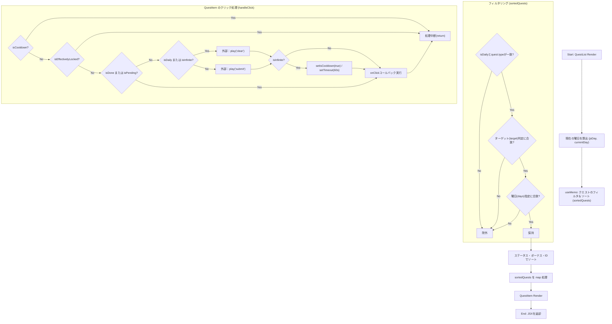
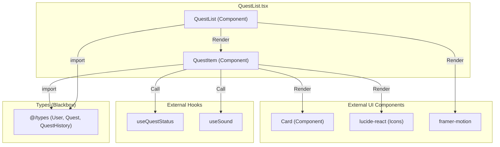

## 1. 解析メタ情報

| 項目 | 内容 |
| --- | --- |
| 対象ファイル | `QuestList.tsx` |
| 言語 | React (TypeScript) |
| 解析対象 | 提供されたコードのみ |
| 推測・補完 | 一切なし |

## 2. ファイルの概要

このファイルは、クエストのリスト（`QuestList`）および個別のクエスト（`QuestItem`）を画面に描画するUIコンポーネントを提供する。

* 根拠: `export default function QuestList` (行番号: 172 / 抜粋: "export default function QuestLi...")
* 根拠: `const QuestItem: React.FC` (行番号: 19 / 抜粋: "const QuestItem: React.FC<{")

## 3. 外部依存関係

### インポート一覧

| 名称 | 種類 | 用途 | 根拠 |
| --- | --- | --- | --- |
| `React`, `useMemo`, `useState` | モジュール | Reactの基本機能およびフック | `import React, { useMemo, useState } from 'react';` (行番号: 1) |
| `Undo2`, `Clock`, `RotateCcw`, `Hourglass`, `TrendingUp`, `Lock` | モジュール | アイコンの描画 | `import { Undo2, Clock... } from 'lucide-react';` (行番号: 2) |
| `motion`, `AnimatePresence` | モジュール | アニメーションの制御 | `import { motion, AnimatePresence } from 'framer-motion';` (行番号: 3) |
| `User`, `Quest`, `QuestHistory` | 型 | コンポーネントのPropsおよび内部変数の型定義 | `import { User, Quest, QuestHistory } from '@/types';` (行番号: 4) |
| `Card` | コンポーネント | UIのカード型コンテナとして使用 | `import { Card } from '@/components/ui/Card';` (行番号: 5) |
| `useQuestStatus` | カスタムフック | クエストの状態（完了、申請中など）の取得 | `import { useQuestStatus } from '../hooks/useQuestStatus';` (行番号: 6) |
| `useSound` | カスタムフック | 音声再生機能の取得 | `import { useSound } from '@/hooks/useSound';` (行番号: 7) |

### ブラックボックスとなる外部要素

| 名称 | 理由 | 根拠 |
| --- | --- | --- |
| `@/types` の各型 (`User`, `Quest`, `QuestHistory`) | プロパティの完全な構造が本ファイル内では定義されていないため | `import { User, Quest, QuestHistory } from '@/types';` (行番号: 4) |
| `Card` コンポーネント | 内部の描画ロジックや `variant` などのPropsの仕様が不明なため | `import { Card } from '@/components/ui/Card';` (行番号: 5) |
| `useQuestStatus` | 内部の判定ロジック（`isDone`, `isLocked` などの算出方法）が不明なため | `import { useQuestStatus } from '../hooks/useQuestStatus';` (行番号: 6) |
| `useSound` | `play` 関数の仕様や再生される音声の詳細が不明なため | `import { useSound } from '@/hooks/useSound';` (行番号: 7) |

## 4. 主要要素の定義（関数 / エンドポイント / コンポーネント）

### `QuestItem`

* **役割**: 個別のクエストカードを描画し、状態に応じたバッジ表示やクリック時の音声再生、コールバック実行を担う。
* 根拠: `const QuestItem: React.FC` (行番号: 19〜170 / 抜粋: "const QuestItem: React.FC<{")

* **引数/リクエスト**: オブジェクト `{ quest, completedQuests, pendingQuests, currentUser, onClick }`
* 根拠: Propsの型定義 (行番号: 20〜24 / 抜粋: "quest: Quest; completedQuest...")

* **戻り値/レスポンス**: ReactElement（JSX）
* 根拠: `return` 文 (行番号: 74〜169 / 抜粋: "return ( 
 { setIsCooldown(false); }, 60000);` (行番号: 63〜65 / 抜粋: "setTimeout(() => {")

* **エラーハンドリング**: なし
* 根拠: 関数内に `try-catch` ブロック等が存在しない。

### `QuestList`

* **役割**: 受け取ったクエスト一覧をフィルタリング・ソートし、`QuestItem` のリストとして描画する。
* 根拠: `export default function QuestList` (行番号: 172〜266 / 抜粋: "export default function QuestLi...")

* **引数/リクエスト**: `QuestListProps` (`{ quests, completedQuests, pendingQuests, currentUser, onQuestClick, isDaily }`)
* 根拠: インターフェース定義および引数 (行番号: 9〜16, 172 / 抜粋: "interface QuestListProps {")

* **戻り値/レスポンス**: ReactElement（JSX）
* 根拠: `return` 文 (行番号: 233〜265 / 抜粋: "return ( <div className="sp...")

* **副作用**: なし
* 根拠: 状態変更や外部API呼び出し、DOMの直接操作等が存在しない。

* **エラーハンドリング**: なし
* 根拠: 関数内に `try-catch` ブロック等が存在しない。

## 5. 処理フロー図

## 6. 依存関係図

## 7. 次のステップ（リバースエンジニアリングの提案）

| 優先度 | ファイル名(推測可) | 理由 | 根拠 |
| --- | --- | --- | --- |
| 高 | `@/types` | `Quest` 型に対して `(quest as any).is_shared_completed_by` のようなキャストが行われており、実際のデータスキーマを把握しないと不具合の原因となるため。 | `const isSharedCompleted = !!(quest as any).is_shared_completed_by...` (行番号: 43) |
| 高 | `../hooks/useQuestStatus` | クエストの表示状態（`isDone`, `isLocked`, `isPending` など）の算出ロジックが本ファイルから切り離されているため、表示不具合の調査にはこのフックの解析が必須。 | `const { isDone, isPending... } = useQuestStatus(...)` (行番号: 30〜33) |
| 中 | `@/components/ui/Card` | UIの基盤として利用されており、`variant` Props がどのようにスタイリングに影響するかを確認するため。 | `import { Card } from '@/components/ui/Card';` (行番号: 5) |
| 低 | `@/hooks/useSound` | 音声再生の挙動や、どのような文字列引数を受け付けるかを特定するため。 | `const { play } = useSound();` (行番号: 27) |

## 8. 保守上の注意点

* `QuestItem` 内で `(quest as any)` として型キャストを行っている箇所が複数存在し、TypeScriptの型安全性が失われている。
* 根拠: `(quest as any).is_shared_completed_by` (行番号: 43)

* `QuestList` 内のソート処理（`getStatusScore`）において、本来 `useQuestStatus` フックで行うべき判定（`isPending`, `isDone`, `isLocked` の判定）に類似するロジックを独自に再実装している。
* 根拠: `const isPreReqCleared = !preReqId \|\| completedQuests.some(...)` (行番号: 199〜215)

* `QuestItem` の `handleClick` において、`onClick` コールバックに渡すオブジェクトに動的に `_isInfinite` プロパティを追加している。
* 根拠: `onClick({ ...quest, _isInfinite: !!isInfinite });` (行番号: 70)

## 9. 不明事項一覧

| 項目 | 理由 | 必要なファイル |
| --- | --- | --- |
| `Quest` オブジェクトの実態 | 型定義に存在しないプロパティ（`is_shared_completed_by`、`_isInfinite`など）が実行時にどう扱われているか不明なため。 | `@/types`, データをフェッチしているAPI側の実装 |
| `useQuestStatus` の判定ロジック | 各ステータス（`isDone`, `isLocked`, `variant` など）をどのように決定しているか不明なため。 | `../hooks/useQuestStatus` |
| `Card` のスタイル仕様 | `variant` や `className` がどう合成されて描画されるか不明なため。 | `@/components/ui/Card` |
| 音声再生の詳細 | `play('clear')` 等の引数が実際にどの音声を鳴らすか不明なため。 | `@/hooks/useSound` |

## 10. 自己検証結果

* [x] 推測・外部ファイルの仕様を一切含んでいない
* [x] 全関数・全クラス・全コンポーネントを列挙した
* [x] 全てのインポート要素を列挙した
* [x] すべての仕様説明に「根拠（行番号・抜粋）」を明記した
* [x] 根拠漏れが0件である
* [x] Mermaid構文にエラーの原因となる記号（エスケープ漏れ）がない
* [x] 不明事項を漏れなく列挙した

完了