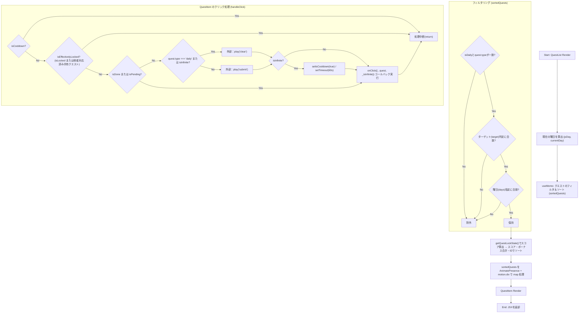

## 1. 解析メタ情報

| 項目 | 内容 |
| --- | --- |
| 対象ファイル | `QuestList.tsx` |
| 言語 | React (TypeScript) |
| 解析対象 | 提供されたコードのみ |
| 推測・補完 | 一切なし |

## 2. ファイルの概要

このファイルは、クエストのリスト（`QuestList`）および個別のクエスト（`QuestItem`）を画面に描画するUIコンポーネントを提供する。`QuestList`は`quests`をタブ（デイリー/それ以外）・ターゲット（役割/ユーザー個別）・曜日で絞り込み、共通フック由来の`getQuestLockState`でステータススコアを算出してソートしたうえで、`framer-motion`によるアニメーション付きで`QuestItem`のリストとして描画する。

* 根拠: `export default function QuestList` (行番号: 208 / 抜粋: "export default function QuestList({ quests, completedQuests...")
* 根拠: `const QuestItem: React.FC` (行番号: 19 / 抜粋: "const QuestItem: React.FC<{")

## 3. 外部依存関係

### インポート一覧

| 名称 | 種類 | 用途 | 根拠 |
| --- | --- | --- | --- |
| `React`, `useMemo`, `useState` | モジュール | Reactの基本機能およびフック | `import React, { useMemo, useState } from 'react';` (行番号: 1) |
| `Undo2`, `Clock`, `RotateCcw`, `Hourglass`, `TrendingUp`, `Lock` | モジュール | アイコンの描画 | `import { Undo2, Clock, RotateCcw, Hourglass, TrendingUp, Lock } from 'lucide-react';` (行番号: 2) |
| `motion`, `AnimatePresence` | モジュール | アニメーションの制御 | `import { motion, AnimatePresence } from 'framer-motion';` (行番号: 3) |
| `User`, `Quest`, `QuestHistory` | 型 | コンポーネントのPropsおよび内部変数の型定義 | `import { User, Quest, QuestHistory } from '@/types';` (行番号: 4) |
| `Card` | コンポーネント | UIのカード型コンテナとして使用 | `import { Card } from '@/components/ui/Card';` (行番号: 5) |
| `useQuestStatus`, `getQuestLockState` | カスタムフック / 関数 | クエストの状態（完了、申請中、ロック済みなど）の取得。`getQuestLockState`はソート用コンパレータからHooksを使わずに同じ判定ロジックを呼び出すための素関数。 | `import { useQuestStatus, getQuestLockState } from '../hooks/useQuestStatus';` (行番号: 6) |
| `useSound` | カスタムフック | 音声再生機能の取得 | `import { useSound } from '@/hooks/useSound';` (行番号: 7) |

### ブラックボックスとなる外部要素

| 名称 | 理由 | 根拠 |
| --- | --- | --- |
| `@/types` の各型 (`User`, `Quest`, `QuestHistory`) | プロパティの完全な構造が本ファイル内では定義されていないため | `import { User, Quest, QuestHistory } from '@/types';` (行番号: 4) |
| `Card` コンポーネント | 内部の描画ロジックや `variant` などのPropsの仕様が不明なため | `import { Card } from '@/components/ui/Card';` (行番号: 5) |
| `useQuestStatus`, `getQuestLockState` | 内部の判定ロジック（`isDone`, `isLocked`, `variant` などの算出方法）が不明なため | `import { useQuestStatus, getQuestLockState } from '../hooks/useQuestStatus';` (行番号: 6) |
| `useSound` | `play` 関数の仕様や再生される音声の詳細が不明なため | `import { useSound } from '@/hooks/useSound';` (行番号: 7) |

## 4. 主要要素の定義（関数 / エンドポイント / コンポーネント）

### `QuestItem`

* **役割**: 個別のクエストカードを描画し、状態に応じたバッジ表示やクリック時の音声再生、コールバック実行を担う。
* 根拠: `const QuestItem: React.FC` (行番号: 19〜206 / 抜粋: "const QuestItem: React.FC<{")

* **引数/リクエスト**: オブジェクト `{ quest, completedQuests, pendingQuests, currentUser, onClick }`
* 根拠: Propsの型定義 (行番号: 19〜25 / 抜粋: "quest: Quest; completedQuests: QuestHistory[];")

* **戻り値/レスポンス**: ReactElement（JSX）
* 根拠: `return` 文 (行番号: 76〜205 / 抜粋: "return ( 
")

* **副作用**:
* `useSound().play()` による音声再生（`type === 'daily'`または`isInfinite`の場合は`'clear'`、それ以外は`'submit'`）
* 根拠: `play('clear');`, `play('submit');` (行番号: 58, 60 / 抜粋: "play('clear');")

* `isInfinite`の場合、`setIsCooldown(true)`後に`setTimeout`でローカルステート (`isCooldown`) を60秒後に`false`へ戻す
* 根拠: `setTimeout(() => { setIsCooldown(false); }, 60000);` (行番号: 63〜68 / 抜粋: "if (isInfinite) { setIsCooldown(true);")

* `onClick`コールバックを、対象クエストに`_isInfinite`プロパティを動的付与したオブジェクトとともに呼び出す
* 根拠: (行番号: 72 / 抜粋: "onClick({ ...quest, _isInfinite: !!isInfinite });")

* **エラーハンドリング**: なし。`isCooldown`または`isEffectivelyLocked`（`isLocked`もしくは他者が対応済みの共有クエスト）の場合は`handleClick`冒頭で処理を中断する。
* 根拠: (行番号: 53〜54 / 抜粋: "if (isCooldown) return; if (isEffectivelyLocked) return;")

### `QuestList`

* **役割**: 受け取ったクエスト一覧を（デイリー/それ以外のタブ、ターゲット、曜日で）フィルタリングし、`getQuestLockState`によるステータススコアとボーナス量・IDでソートしたうえで、`QuestItem` のリストとして`AnimatePresence`付きで描画する。
* 根拠: `export default function QuestList` (行番号: 208〜305 / 抜粋: "export default function QuestList({ quests, completedQuests, pendingQuests, currentUser, onQuestClick, isDaily }: QuestListProps) {")

* **引数/リクエスト**: `QuestListProps` (`{ quests: Quest[], completedQuests: QuestHistory[], pendingQuests: QuestHistory[], currentUser: User, onQuestClick: (quest: Quest) => void, isDaily?: boolean }`)
* 根拠: インターフェース定義および引数 (行番号: 9〜16, 208 / 抜粋: "interface QuestListProps {")

* **戻り値/レスポンス**: ReactElement（JSX）
* 根拠: `return` 文 (行番号: 270〜304 / 抜粋: "return ( 
 {")

* **エラーハンドリング**: なし
* 根拠: 関数内に `try-catch` ブロック等が存在しない。

## 5. 処理フロー図

```mermaid
flowchart TD
    Start["Start: QuestList Render"] --> CalcDay["現在の曜日を算出 (jsDay, currentDay)"]
    CalcDay --> FilterSort["useMemo: クエストのフィルタ＆ソート (sortedQuests)"]
    
    subgraph "フィルタリング (sortedQuests)"
        F1{"isDailyとquest.typeが一致?"}
        F1 -- No --> Drop["除外"]
        F1 -- Yes --> F2{"ターゲット(target)判定に合致?"}
        F2 -- No --> Drop
        F2 -- Yes --> F3{"曜日(days)指定に合致?"}
        F3 -- No --> Drop
        F3 -- Yes --> Keep["保持"]
    end
    
    Keep --> Sort["getQuestLockState()でスコア算出 → スコア・ボーナス合計・IDでソート"]
    Sort --> MapList["sortedQuests を AnimatePresence + motion.div で map 処理"]
    
    MapList --> MapItem["QuestItem Render"]
    
    subgraph "QuestItem のクリック処理 (handleClick)"
        C_Start{"isCooldown?"}
        C_Start -- Yes --> C_End["処理中断(return)"]
        C_Start -- No --> C_Lock{"isEffectivelyLocked? (isLocked または他者対応済み共有クエスト)"}
        C_Lock -- Yes --> C_End
        C_Lock -- No --> C_Status{"isDone または isPending?"}
        C_Status -- No --> C_Sound{"quest.type === 'daily' または isInfinite?"}
        C_Sound -- Yes --> S1["外部：play('clear')"]
        C_Sound -- No --> S2["外部：play('submit')"]
        S1 --> C_Infinite{"isInfinite?"}
        S2 --> C_Infinite
        C_Infinite -- Yes --> Cooldown["setIsCooldown(true) / setTimeout(60s)"]
        C_Infinite -- No --> C_Callback
        Cooldown --> C_Callback
        C_Status -- Yes --> C_Callback
        C_Callback["onClick({...quest, _isInfinite}) コールバック実行"] --> C_End
    end
    
    MapItem --> End["End: JSXを返却"]

```

## 6. 依存関係図

```mermaid
graph TD
    subgraph "QuestList.tsx"
        QuestList["QuestList (Component)"]
        QuestItem["QuestItem (Component)"]
    end
    
    subgraph "External Hooks / Functions (../hooks/useQuestStatus)"
        useQuestStatus["useQuestStatus"]
        getQuestLockState["getQuestLockState"]
        useSound["useSound"]
    end
    
    subgraph "External UI Components"
        Card["Card (Component)"]
        LucideIcons["lucide-react (Icons)"]
        FramerMotion["framer-motion (motion, AnimatePresence)"]
    end
    
    subgraph "Types (Blackbox)"
        Types["@/types (User, Quest, QuestHistory)"]
    end

    QuestList -->|import| Types
    QuestList -->|Render| QuestItem
    QuestList -->|Render| FramerMotion
    QuestList -->|Call (sort comparator)| getQuestLockState
    
    QuestItem -->|Render| Card
    QuestItem -->|import| Types
    QuestItem -->|Call| useQuestStatus
    QuestItem -->|Call| useSound
    QuestItem -->|Render| LucideIcons

```

## 7. 次のステップ（リバースエンジニアリングの提案）

| 優先度 | ファイル名(推測可) | 理由 | 根拠 |
| --- | --- | --- | --- |
| 高 | `@/types` | `Quest` 型に対して `is_shared_completed_by`, `is_shared_pending_by`, `shared_completed_by_name`, `shared_pending_by_name` など共有クエスト関連のプロパティが参照されており、実際のデータスキーマを把握しないと不具合の原因となるため。 | (行番号: 46〜49 / 抜粋: "const isSharedCompleted = !!quest.is_shared_completed_by...") |
| 高 | `../hooks/useQuestStatus` | クエストの表示状態（`isDone`, `isLocked`, `isPending`, `variant` など）の算出ロジックが本ファイルから切り離されているため、表示不具合の調査にはこのフックおよび`getQuestLockState`関数の解析が必須。 | `const { isDone, isPending... } = useQuestStatus(...)` (行番号: 30〜33) |
| 中 | `@/components/ui/Card` | UIの基盤として利用されており、`variant` Props がどのようにスタイリングに影響するかを確認するため。 | `import { Card } from '@/components/ui/Card';` (行番号: 5) |
| 低 | `@/hooks/useSound` | 音声再生の挙動や、どのような文字列引数を受け付けるかを特定するため。 | `const { play } = useSound();` (行番号: 27) |

## 8. 保守上の注意点

* `QuestList`内のソート用コンパレータ（`getStatusScore`、行番号236〜253）は、Reactのコールバック内（`Array.sort`）からはHooksを呼び出せないため、`useQuestStatus`フックと同じ判定ロジックを共有する素関数`getQuestLockState`を`../hooks/useQuestStatus`からインポートして直接呼び出している。ロック・申請中・完了の判定基準を変更する場合は、`useQuestStatus`と`getQuestLockState`の両方の実装（同一ファイル内であることが望ましい）を確認する必要がある。
* 根拠: [コメント] (行番号: 234〜235 / 抜粋: "// ▼ ソート順のロジック（ロック/申請中/完了の判定は useQuestStatus と共通の")
* `QuestItem` の `handleClick` において、`onClick` コールバックに渡すオブジェクトに動的に `_isInfinite` プロパティを追加している。`Quest`型に定義されているかは本ファイルからは不明。
* 根拠: `onClick({ ...quest, _isInfinite: !!isInfinite });` (行番号: 72)
* `isInfinite`クエストのクールダウン（60秒）はコンポーネントローカルな`useState`で管理されているため、画面遷移やコンポーネントの再マウントが起きると`isCooldown`はリセットされる。サーバー側でクールダウンを強制する仕組みがあるかは本ファイルからは不明。
* 根拠: (行番号: 28, 63〜68 / 抜粋: "const [isCooldown, setIsCooldown] = useState(false);")
* 共有クエスト（`is_shared_completed_by`/`is_shared_pending_by`）が自分以外の値を持つ場合、`isEffectivelyLocked`が真となりクリック不可になる。この判定は`useQuestStatus`が返す`isLocked`とは別に本ファイル内で独自に算出されている。
* 根拠: (行番号: 46〜50 / 抜粋: "const isEffectivelyLocked = isLocked || isSharedDoneByOther;")

## 9. 不明事項一覧

| 項目 | 理由 | 必要なファイル |
| --- | --- | --- |
| `Quest` オブジェクトの実態 | 型定義に存在するかどうか不明なプロパティ（`is_shared_completed_by`、`_isInfinite`など）が実行時にどう扱われているか不明なため。 | `@/types`, データをフェッチしているAPI側の実装 |
| `useQuestStatus` / `getQuestLockState` の判定ロジック | 各ステータス（`isDone`, `isLocked`, `variant` など）をどのように決定しているか不明なため。 | `../hooks/useQuestStatus` |
| `Card` のスタイル仕様 | `variant` や `className` がどう合成されて描画されるか不明なため。 | `@/components/ui/Card` |
| 音声再生の詳細 | `play('clear')` 等の引数が実際にどの音声を鳴らすか不明なため。 | `@/hooks/useSound` |

## 10. 自己検証結果

* [x] 推測・外部ファイルの仕様を一切含んでいない
* [x] 全関数・全クラス・全コンポーネントを列挙した
* [x] 全てのインポート要素を列挙した
* [x] すべての仕様説明に「根拠（行番号・抜粋）」を明記した
* [x] 根拠漏れが0件である
* [x] Mermaid構文にエラーの原因となる記号（エスケープ漏れ）がない
* [x] 不明事項を漏れなく列挙した

完了