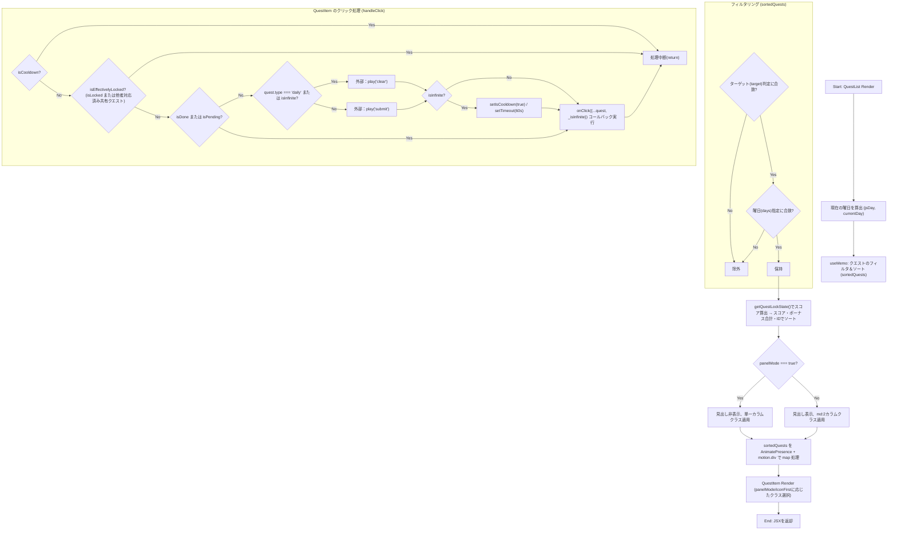

## 1. 解析メタ情報

| 項目 | 内容 |
| --- | --- |
| 対象ファイル | `QuestList.tsx` |
| 言語 | React (TypeScript) |
| 解析対象 | 提供されたコードのみ |
| 推測・補完 | 一切なし |

## 関連ドキュメント

- [useQuestStatus.md](../hooks/useQuestStatus.md) — `useQuestStatus`/`getQuestLockState`の実装元。クエストのロック・完了・保留判定ロジックを提供する。
- [types/index.md](../../../types/index.md) — `User`/`Quest`/`QuestHistory`型定義の提供元。
- [Card.md](../../../components/ui/Card.md) — `QuestItem`がラップして使用するカードUIコンポーネント。
- [useSound.md](../../../hooks/useSound.md) — クエストクリック時の効果音再生フックの実装元。
- [FamilyDashboard.md](../../family/components/FamilyDashboard.md) — `panelMode`/`iconFirst` propsを実際に渡す横画面パネル表示側の呼び出し元。

## 2. ファイルの概要

このファイルは、クエストのリスト（`QuestList`）および個別のクエスト（`QuestItem`）を画面に描画するUIコンポーネントを提供する。`QuestList`は`quests`をターゲット（役割/ユーザー個別）・曜日で絞り込み、共通フック由来の`getQuestLockState`でステータススコアを算出してソートしたうえで、`framer-motion`によるアニメーション付きで`QuestItem`のリストとして描画する。`panelMode`propが真の場合、横画面4人表示（`FamilyDashboard`）のパネル内で使うことを想定し、ビューポート幅基準の`md:`ブレークポイントに依存しない、狭いパネル幅でも崩れないタップ領域確保済みの単一カラム表示に切り替える。`iconFirst`propが真の場合、非識字年齢の子ども向けにアイコンを大きく・説明文を非表示にした表示にする。

* 根拠: `export default function QuestList` (行番号: 227 / 抜粋: "export default function QuestList({ quests, completedQuests, pendingQuests, currentUser, onQuestClick, panelMode, iconFirst }: QuestListProps) {")
* 根拠: `const QuestItem: React.FC` (行番号: 25 / 抜粋: "const QuestItem: React.FC<{")
* 根拠: `panelMode`/`iconFirst`のコメント (行番号: 15〜21 / 抜粋: "// 横画面4人表示のパネル内で使うためのモード。\n    // true の場合、ビューポート幅基準の md: ブレークポイント(2カラム化・拡大表示)には\n    // 依存せず、狭いパネル幅でも崩れないタップ領域確保済みの単一カラム表示にする。\n    panelMode?: boolean;\n    // アイコン主体・文字量を絞った表示にするか(非識字年齢の子ども向け、要件10)。\n    // 説明文を非表示にし、アイコンをより大きく見せる。\n    iconFirst?: boolean;")

## 3. 外部依存関係

### インポート一覧

| 名称 | 種類 | 用途 | 根拠 |
| --- | --- | --- | --- |
| `React`, `useMemo`, `useState` | モジュール | Reactの基本機能およびフック | `import React, { useMemo, useState } from 'react';` (行番号: 1) |
| `Undo2`, `Clock`, `RotateCcw`, `Hourglass`, `TrendingUp`, `Lock` | モジュール | アイコンの描画 | `import { Undo2, Clock, RotateCcw, Hourglass, TrendingUp, Lock } from 'lucide-react';` (行番号: 2) |
| `motion`, `AnimatePresence` | モジュール | アニメーションの制御 | `import { motion, AnimatePresence } from 'framer-motion';` (行番号: 3) |
| `User`, `Quest`, `QuestHistory` | 型 | コンポーネントのPropsおよび内部変数の型定義 | `import { User, Quest, QuestHistory } from '@/types';` (行番号: 4) |
| `Card` | コンポーネント | UIのカード型コンテナとして使用 | `import { Card } from '@/components/ui/Card';` (行番号: 5) |
| `useQuestStatus`, `getQuestLockState` | カスタムフック / 関数 | クエストの状態（完了、申請中、ロック済みなど）の取得。`getQuestLockState`はソート用コンパレータからHooksを使わずに同じ判定ロジックを呼び出すための素関数。 | `import { useQuestStatus, getQuestLockState } from '../hooks/useQuestStatus';` (行番号: 6) |
| `useSound` | カスタムフック | 音声再生機能の取得 | `import { useSound } from '@/hooks/useSound';` (行番号: 7) |

### ブラックボックスとなる外部要素

| 名称 | 理由 | 根拠 |
| --- | --- | --- |
| `@/types` の各型 (`User`, `Quest`, `QuestHistory`) | プロパティの完全な構造が本ファイル内では定義されていないため | `import { User, Quest, QuestHistory } from '@/types';` (行番号: 4) |
| `Card` コンポーネント | 内部の描画ロジックや `variant` などのPropsの仕様が不明なため | `import { Card } from '@/components/ui/Card';` (行番号: 5) |
| `useQuestStatus`, `getQuestLockState` | 内部の判定ロジック（`isDone`, `isLocked`, `variant` などの算出方法）が不明なため | `import { useQuestStatus, getQuestLockState } from '../hooks/useQuestStatus';` (行番号: 6) |
| `useSound` | `play` 関数の仕様や再生される音声の詳細が不明なため | `import { useSound } from '@/hooks/useSound';` (行番号: 7) |

## 4. 主要要素の定義（関数 / エンドポイント / コンポーネント）

### `QuestListProps` / `QuestItem`のprops型

* **役割**: `QuestList`が受け取るProps型定義。`panelMode`（パネル内固定レイアウト用）と`iconFirst`（アイコン主体・非識字年齢向け表示用）がオプショナルで追加されている。`QuestItem`側にも同名の`panelMode?: boolean`, `iconFirst?: boolean`が個別に定義され、`QuestList`から素通しで渡される。
* 根拠: `interface QuestListProps {` (行番号: 9〜22 / 抜粋: "panelMode?: boolean;", "iconFirst?: boolean;")
* 根拠: `QuestItem`のprops型 (行番号: 25〜33 / 抜粋: "panelMode?: boolean;\n    iconFirst?: boolean;\n}> = ({ quest, completedQuests, pendingQuests, currentUser, onClick, panelMode, iconFirst }) => {")

### `QuestItem`

* **役割**: 個別のクエストカードを描画し、状態に応じたバッジ表示やクリック時の音声再生、コールバック実行を担う。`panelMode`が真のときはビューポート幅基準の`md:`拡大・2カラム化に乗らず、常に「狭い列でも崩れず、かつタップしやすい」固定サイズのクラス群（`cardSizeClasses`等）を使う。`iconFirst`が真のときはアイコンサイズを拡大しつつ説明文（`quest.desc`/`quest.description`）を非表示にする。
* 根拠: `const QuestItem: React.FC` (行番号: 25〜225 / 抜粋: "const QuestItem: React.FC<{")
* 根拠: パネルモード時のクラス切り替え (行番号: 83〜92 / 抜粋: "// パネルモードでは viewport幅基準の md: 拡大/2カラム化には乗らず、\n    // 常に「狭い列でも崩れず、かつタップしやすい」固定サイズを使う。\n    const cardSizeClasses = panelMode ? 'p-3 min-h-[64px]' : 'md:p-6 md:h-full';")
* 根拠: 説明文の非表示条件 (行番号: 179〜184 / 抜粋: "{/* 説明文: iconFirst(非識字年齢向け)では非表示にし、アイコンでの識別を優先する */}\n                        {!iconFirst && (quest.desc || quest.description) && (")

* **引数/リクエスト**: オブジェクト `{ quest, completedQuests, pendingQuests, currentUser, onClick, panelMode, iconFirst }`
* 根拠: Propsの型定義 (行番号: 25〜33 / 抜粋: "quest: Quest; completedQuests: QuestHistory[]; ... panelMode?: boolean; iconFirst?: boolean;")

* **戻り値/レスポンス**: ReactElement（JSX）
* 根拠: `return` 文 (行番号: 95〜224 / 抜粋: "return ( 
")

* **副作用**:
* `useSound().play()` による音声再生（`type === 'daily'`または`isInfinite`の場合は`'clear'`、それ以外は`'submit'`）
* 根拠: `play('clear');`, `play('submit');` (行番号: 66, 68 / 抜粋: "play('clear');")

* `isInfinite`の場合、`setIsCooldown(true)`後に`setTimeout`でローカルステート (`isCooldown`) を60秒後に`false`へ戻す
* 根拠: `setTimeout(() => { setIsCooldown(false); }, 60000);` (行番号: 71〜76 / 抜粋: "if (isInfinite) { setIsCooldown(true);")

* `onClick`コールバックを、対象クエストに`_isInfinite`プロパティを動的付与したオブジェクトとともに呼び出す
* 根拠: (行番号: 80 / 抜粋: "onClick({ ...quest, _isInfinite: !!isInfinite });")

* **エラーハンドリング**: なし。`isCooldown`または`isEffectivelyLocked`（`isLocked`もしくは他者が対応済みの共有クエスト）の場合は`handleClick`冒頭で処理を中断する。
* 根拠: (行番号: 61〜62 / 抜粋: "if (isCooldown) return; if (isEffectivelyLocked) return;")

### `QuestList`

* **役割**: 受け取ったクエスト一覧を（ターゲット、曜日で）フィルタリングし、`getQuestLockState`によるステータススコアとボーナス量・IDでソートしたうえで、`QuestItem` のリストとして`AnimatePresence`付きで描画する。`panelMode`が真の場合、リストコンテナのクラス（`listContainerClass`）を2カラムグリッドではなく単一カラム縦積みにし、見出し（`-- クエスト一覧 --`）も非表示にする。
* 根拠: `export default function QuestList` (行番号: 227〜324 / 抜粋: "export default function QuestList({ quests, completedQuests, pendingQuests, currentUser, onQuestClick, panelMode, iconFirst }: QuestListProps) {")
* 根拠: `listContainerClass`/`headerClass`の分岐 (行番号: 278〜283 / 抜粋: "const listContainerClass = panelMode\n        ? 'space-y-2 animate-in fade-in duration-300'\n        : 'space-y-2 md:space-y-0 md:grid md:grid-cols-2 md:gap-6 ...';")
* 根拠: 見出しの非表示条件 (行番号: 287〜291 / 抜粋: "{!panelMode && (\n                
\n                    -- クエスト一覧 --\n                
\n            )}")

* **引数/リクエスト**: `QuestListProps` (`{ quests: Quest[], completedQuests: QuestHistory[], pendingQuests: QuestHistory[], currentUser: User, onQuestClick: (quest: Quest) => void, panelMode?: boolean, iconFirst?: boolean }`)
* 根拠: インターフェース定義および引数 (行番号: 9〜22, 227 / 抜粋: "interface QuestListProps {")

* **戻り値/レスポンス**: ReactElement（JSX）
* 根拠: `return` 文 (行番号: 285〜323 / 抜粋: "return (\n        
")

* **副作用**: なし（`useMemo`によるフィルタ・ソート結果のメモ化のみで、外部API呼び出しやDOM直接操作は存在しない）
* 根拠: `useMemo` ブロック (行番号: 231〜276 / 抜粋: "const sortedQuests = useMemo(() => {")

* **エラーハンドリング**: なし
* 根拠: 関数内に `try-catch` ブロック等が存在しない。

## 5. 処理フロー図

```mermaid
flowchart TD
    Start["Start: QuestList Render"] --> CalcDay["現在の曜日を算出 (jsDay, currentDay)"]
    CalcDay --> FilterSort["useMemo: クエストのフィルタ＆ソート (sortedQuests)"]

    subgraph "フィルタリング (sortedQuests)"
        F2{"ターゲット(target)判定に合致?"}
        F2 -- No --> Drop["除外"]
        F2 -- Yes --> F3{"曜日(days)指定に合致?"}
        F3 -- No --> Drop
        F3 -- Yes --> Keep["保持"]
    end

    Keep --> Sort["getQuestLockState()でスコア算出 → スコア・ボーナス合計・IDでソート"]
    Sort --> LayoutCheck{"panelMode === true?"}
    LayoutCheck -- Yes --> HideHeader["見出し非表示、単一カラムクラス適用"]
    LayoutCheck -- No --> ShowHeader["見出し表示、md:2カラムクラス適用"]
    HideHeader --> MapList["sortedQuests を AnimatePresence + motion.div で map 処理"]
    ShowHeader --> MapList

    MapList --> MapItem["QuestItem Render (panelMode/iconFirstに応じたクラス選択)"]

    subgraph "QuestItem のクリック処理 (handleClick)"
        C_Start{"isCooldown?"}
        C_Start -- Yes --> C_End["処理中断(return)"]
        C_Start -- No --> C_Lock{"isEffectivelyLocked? (isLocked または他者対応済み共有クエスト)"}
        C_Lock -- Yes --> C_End
        C_Lock -- No --> C_Status{"isDone または isPending?"}
        C_Status -- No --> C_Sound{"quest.type === 'daily' または isInfinite?"}
        C_Sound -- Yes --> S1["外部：play('clear')"]
        C_Sound -- No --> S2["外部：play('submit')"]
        S1 --> C_Infinite{"isInfinite?"}
        S2 --> C_Infinite
        C_Infinite -- Yes --> Cooldown["setIsCooldown(true) / setTimeout(60s)"]
        C_Infinite -- No --> C_Callback
        Cooldown --> C_Callback
        C_Status -- Yes --> C_Callback
        C_Callback["onClick({...quest, _isInfinite}) コールバック実行"] --> C_End
    end

    MapItem --> End["End: JSXを返却"]

```

## 6. 依存関係図

```mermaid
graph TD
    subgraph "QuestList.tsx"
        QuestList["QuestList (Component)"]
        QuestItem["QuestItem (Component)"]
    end

    subgraph "External Hooks / Functions (../hooks/useQuestStatus)"
        useQuestStatus["useQuestStatus"]
        getQuestLockState["getQuestLockState"]
        useSound["useSound"]
    end

    subgraph "External UI Components"
        Card["Card (Component)"]
        LucideIcons["lucide-react (Icons)"]
        FramerMotion["framer-motion (motion, AnimatePresence)"]
    end

    subgraph "Types (Blackbox)"
        Types["@/types (User, Quest, QuestHistory)"]
    end

    QuestList -->|import| Types
    QuestList -->|Render, panelMode/iconFirstを伝播| QuestItem
    QuestList -->|Render| FramerMotion
    QuestList -->|Call (sort comparator)| getQuestLockState

    QuestItem -->|Render| Card
    QuestItem -->|import| Types
    QuestItem -->|Call| useQuestStatus
    QuestItem -->|Call| useSound
    QuestItem -->|Render| LucideIcons

```

## 7. 次のステップ（リバースエンジニアリングの提案）

| 優先度 | ファイル名(推測可) | 理由 | 根拠 |
| --- | --- | --- | --- |
| 高 | `@/types` | `Quest` 型に対して `is_shared_completed_by`, `is_shared_pending_by`, `shared_completed_by_name`, `shared_pending_by_name` など共有クエスト関連のプロパティが参照されており、実際のデータスキーマを把握しないと不具合の原因となるため。 | (行番号: 54〜58 / 抜粋: "const isSharedCompleted = !!quest.is_shared_completed_by...") |
| 高 | `../hooks/useQuestStatus` | クエストの表示状態（`isDone`, `isLocked`, `isPending`, `variant` など）の算出ロジックが本ファイルから切り離されているため、表示不具合の調査にはこのフックおよび`getQuestLockState`関数の解析が必須。 | `const { isDone, isPending... } = useQuestStatus(...)` (行番号: 38〜41) |
| 中 | `../../family/components/FamilyDashboard.tsx` | `panelMode`/`iconFirst`propsを実際にどのユーザー・どの条件で渡しているか（横画面4人パネル表示側の呼び出し実態）を確認するため。 | `panelMode?: boolean; iconFirst?: boolean;` (行番号: 18, 21) |
| 中 | `@/components/ui/Card` | UIの基盤として利用されており、`variant` Props がどのようにスタイリングに影響するかを確認するため。 | `import { Card } from '@/components/ui/Card';` (行番号: 5) |
| 低 | `@/hooks/useSound` | 音声再生の挙動や、どのような文字列引数を受け付けるかを特定するため。 | `const { play } = useSound();` (行番号: 35) |

## 8. 保守上の注意点

* `QuestList`内のソート用コンパレータ（`getStatusScore`、行番号252〜261）は、Reactのコールバック内（`Array.sort`）からはHooksを呼び出せないため、`useQuestStatus`フックと同じ判定ロジックを共有する素関数`getQuestLockState`を`../hooks/useQuestStatus`からインポートして直接呼び出している。ロック・申請中・完了の判定基準を変更する場合は、`useQuestStatus`と`getQuestLockState`の両方の実装（同一ファイル内であることが望ましい）を確認する必要がある。
* 根拠: [コメント] (行番号: 249〜251 / 抜粋: "// ▼ ソート順: 進行中の期間限定 → 通常 → ロック中 → 承認待ち → 完了済み\n            // （ロック/申請中/完了の判定は useQuestStatus と共通の getQuestLockState に集約。")
* `QuestItem` の `handleClick` において、`onClick` コールバックに渡すオブジェクトに動的に `_isInfinite` プロパティを追加している。`Quest`型に定義されているかは本ファイルからは不明。
* 根拠: `onClick({ ...quest, _isInfinite: !!isInfinite });` (行番号: 80)
* `isInfinite`クエストのクールダウン（60秒）はコンポーネントローカルな`useState`で管理されているため、画面遷移やコンポーネントの再マウントが起きると`isCooldown`はリセットされる。サーバー側でクールダウンを強制する仕組みがあるかは本ファイルからは不明。
* 根拠: (行番号: 36, 71〜76 / 抜粋: "const [isCooldown, setIsCooldown] = useState(false);")
* 共有クエスト（`is_shared_completed_by`/`is_shared_pending_by`）が自分以外の値を持つ場合、`isEffectivelyLocked`が真となりクリック不可になる。この判定は`useQuestStatus`が返す`isLocked`とは別に本ファイル内で独自に算出されている。
* 根拠: (行番号: 54〜58 / 抜粋: "const isEffectivelyLocked = isLocked || isSharedDoneByOther;")
* `panelMode`/`iconFirst`はいずれもレイアウト・表示切り替え専用のオプショナルpropで、クエストの判定ロジック自体（`isDone`/`isLocked`等）には影響しない。表示クラスの選択（`cardSizeClasses`, `layoutClasses`, `iconSizeClasses`等、8種類のスタイル変数）が`panelMode`/`iconFirst`の値ごとに個別に分岐しており、いずれか一方のモードのみを追加・変更する際は該当する全変数を漏れなく確認する必要がある。
* 根拠: (行番号: 85〜92 / 抜粋: "const cardSizeClasses = panelMode ? 'p-3 min-h-[64px]' : 'md:p-6 md:h-full';")

## 9. 不明事項一覧

| 項目 | 理由 | 必要なファイル |
| --- | --- | --- |
| `Quest` オブジェクトの実態 | 型定義に存在するかどうか不明なプロパティ（`is_shared_completed_by`、`_isInfinite`など）が実行時にどう扱われているか不明なため。 | `@/types`, データをフェッチしているAPI側の実装 |
| `useQuestStatus` / `getQuestLockState` の判定ロジック | 各ステータス（`isDone`, `isLocked`, `variant` など）をどのように決定しているか不明なため。 | `../hooks/useQuestStatus` |
| `panelMode`/`iconFirst`の実際の呼び出し条件 | 本ファイルはpropsを受け取って表示を切り替えるのみであり、どのユーザー・どの画面幅で真になるかは呼び出し元次第で不明なため。 | `../../family/components/FamilyDashboard.tsx`, `App.tsx` |
| `Card` のスタイル仕様 | `variant` や `className` がどう合成されて描画されるか不明なため。 | `@/components/ui/Card` |
| 音声再生の詳細 | `play('clear')` 等の引数が実際にどの音声を鳴らすか不明なため。 | `@/hooks/useSound` |

## 相互参照による補足情報

| 元の不明事項 | 判明した内容 | 参照元ドキュメント |
| --- | --- | --- |
| `Quest` オブジェクトの実態 | `types/index.md`の解析によれば、`Quest`型には`is_shared_completed_by`等の共有クエスト判定用フィールドが含まれており、これらはバックエンドの`get_available_quests`が付与するものとされている。ただしこれは`types/index.md`側の解析結果からの補足であり、実データの検証は行っていない。 | `../../../types/index.md` |
| `useQuestStatus` / `getQuestLockState` の判定ロジック | `useQuestStatus.md`の解析によれば、`getQuestLockState`は前提クエストの完了有無から`isLocked`を、当日の承認済み履歴件数から`isDone`を算出する純粋関数であり、`useQuestStatus`はその結果と`isRandom`/`isTimeLimited`/`isLimited`等のフラグから優先順位付きで`variant`を決定するとされている。 | `../hooks/useQuestStatus.md` |
| `panelMode`/`iconFirst`の実際の呼び出し条件 | `FamilyDashboard.md`の解析によれば、`FamilyPanel`は`QuestList`に`panelMode`を常に渡し、`iconFirst`は`ICON_FIRST_USER_IDS.includes(user.user_id)`という判定で個別ユーザーごとに決定しているとされている。ただしこれは横画面（landscape）レイアウトからの呼び出しに関する補足であり、縦画面側（`App.tsx`）での呼び出し条件は本ファイルからも他ドキュメントからも確認できていない。 | `../../family/components/FamilyDashboard.md` |
| `Card` のスタイル仕様 | `Card.md`の解析によれば、`Card`は`variant`（`default`/`completed`/`pending`/`infinite`/`timeLimit`/`random`/`limited`/`locked`）に応じてスタイルクラスを切り替えるコンポーネントであるとされている。`Card.md`側でも、本ファイル(`QuestList.tsx`)が実際にどの`variant`値を渡しているかは推測に留まると記載されている。 | `../../../components/ui/Card.md` |
| 音声再生の詳細 | `useSound.md`の解析によれば、`play`は`SOUNDS`定義のキーに対応する`HTMLAudioElement`をキャッシュしつつ再生し、再生失敗時は`console.warn`で警告を出すのみで例外は投げない構造とされている。ただし`SOUNDS`に`'clear'`/`'submit'`キーが実際に含まれるかは`useSound.md`側でも全キーの列挙が行われておらず断定できない。 | `../../../hooks/useSound.md` |

## 10. 自己検証結果

* [x] 完了: 推測・外部ファイルの仕様を一切含んでいない
* [x] 完了: 全関数・全クラス・全コンポーネントを列挙した
* [x] 完了: 全てのインポート要素を列挙した
* [x] 完了: すべての仕様説明に「根拠（行番号・抜粋）」を明記した
* [x] 完了: 根拠漏れが0件である
* [x] 完了: Mermaid構文にエラーの原因となる記号（エスケープ漏れ）がない
* [x] 完了: 不明事項を漏れなく列挙した
