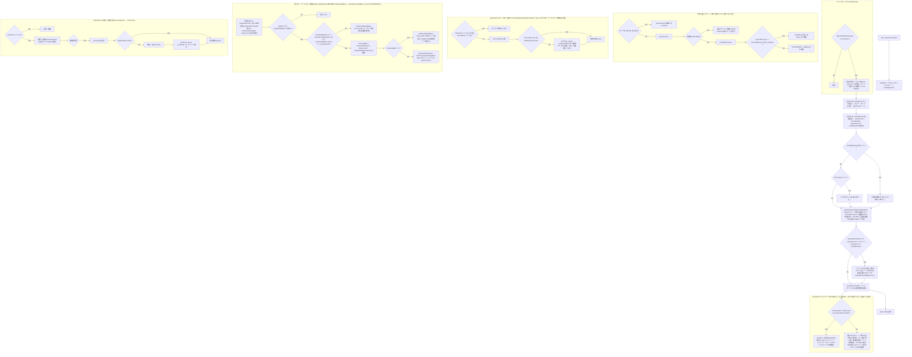

## 1. 解析メタ情報

| 項目 | 内容 |
| --- | --- |
| 対象ファイル | `QuestList.tsx` |
| 言語 | React (TypeScript) |
| 解析対象 | 提供されたコードのみ |
| 推測・補完 | 一切なし |
| 解析基準コミット | ブランチ `claude/screen-redundancy-improvement-8m37l4`（すごろく風UI化コミット時点） |

## 関連ドキュメント

- [../hooks/useQuestStatus.md](../hooks/useQuestStatus.md) — `useQuestStatus`/`getQuestLockState`の実装元。クエストのロック・完了・保留判定ロジックを提供する。
- [../../../types/index.md](../../../types/index.md) — `User`/`Quest`/`QuestHistory`型定義の提供元。
- [../../../components/ui/CooldownRing.md](../../../components/ui/CooldownRing.md) — 無限クエストのクールダウン中に円形プログレスを表示するコンポーネント（対応する解析ドキュメントは本ファイルの解析時点では未作成）。
- [../../../hooks/useSound.md](../../../hooks/useSound.md) — クエストクリック時の効果音再生フックの実装元。
- [../../../hooks/useLongPress.md](../../../hooks/useLongPress.md) — 完了済み/申請中クエストの長押し取消ジェスチャーを提供するフック（対応する解析ドキュメントは本ファイルの解析時点では未作成）。
- [../../family/components/FamilyDashboard.md](../../family/components/FamilyDashboard.md) — `panelMode`/`iconFirst` propsを実際に渡す横画面パネル表示側の呼び出し元。
- [../../routine/components/RoutineFlow.md](../../routine/components/RoutineFlow.md) — 本ファイルの「ノード(アイコン円)+接続線」という見た目のデザイン参照元（`RoutineFlow.tsx`の`RoutineStepRow`）。本ファイルからは import されておらず、コード上の依存関係ではない（対応する解析ドキュメントは本ファイルの解析時点では未作成）。

## 2. ファイルの概要

* **（すごろく風UI化で変更）** クエスト一覧の見た目を、同じアプリの`RoutineFlow.tsx`（「きょうのすごろく」）と同じ「ノード(アイコン円)+接続線」のレール表示に統一した。以前は`Card`コンポーネントでラップした横長カードを`md:grid-cols-2`の2カラムグリッドで並べる構成だったが、`Card`への依存自体を廃止し（本ファイルはもう`Card`を import しない）、`QuestItem`が自前で「ノード列(アイコン円+接続線)＋コンテンツ列」の2カラム構成を描画するようになった。コンテンツ列は、未完了かつ未ロック(申請中も含む、`isActionable = !isDone && !isLocked && !forceSlim`)なら`variant`ごとに配色した「スポットライト・ライト」カード、そうでなければ（完了済み・未開放、または後述の件数上限による強制縮小）ノードの色とテキストだけで示す縮小1行のミュート表示に分岐する。この`isActionable`分岐は、`RoutineFlow`の`RoutineStepRow`が`status === 'current'`という単一ステップだけをハイライトするのとは異なり、クエストは順番を強制しないため複数件が同時にハイライト(カード)表示されうる点が設計上の相違点である。それに伴い、以前あった「完了済み・未開放を表示/隠す」トグルボタンと`activeQuests`/`doneOrLockedQuests`への振り分けは廃止し、`sortedQuests`をソート順のまま1本の連続したレールとして常時描画する（ノード+線という「路線図」の接続線が、非表示のノードをまたぐのは不自然なため）。「今できることはありません」という案内文だけは、`activeCount`（未完了かつ未ロックの件数）を別途数えて維持している。
* **（実行可能クエスト過多への対応で追加）** 上記の`isActionable`な項目(申請中を除く)が`ACTIONABLE_CARD_LIMIT`(3件)を超える場合、上位`ACTIONABLE_CARD_LIMIT`件だけをカード表示し、残りは`forceSlimIds`（`QuestList`が`useMemo`でソート順に算出する`quest_id`の`Set`）に含めて強制的に縮小1行にする。上限に達した直後の位置には、ノード列を持つ疑似アイテム（`⋯`アイコン＋「もっと見る (N件)」ボタン）をレールに差し込み、タップすると`showAllActionable`ステートが真になり全件カード表示に切り替わる（折りたたみ直しの操作は持たない単純化）。申請中(`isPending`)のクエストはこの上限のカウント対象から除外され、常にカード表示のままになる（件数が少なく、本人がまだ気にしている状態のため）。
* **（Issue #660 で変更、現行構造に引き続き適用）** 完了済み・申請中のクエスト(`canCancel` が真)は取消を長押しに委ねるため `onClick` を外しており、キーボードから一切到達できない状態を避けるため、`role="button"`・`tabIndex`・`aria-label`(「<クエスト名> の完了を取り消す」)と、Enter/Space で `runCancel()` を実行する `onKeyDown` を、`interactiveProps`としてスポットライト・ライトカードまたは縮小1行のどちらの外側divにも明示的に付ける(ロック中・処理中は `tabIndex={-1}`)。以前はこれを`Card`コンポーネントが`onClick`の有無から暗黙的に付与していたが、`Card`を使わなくなったため明示的なJSXになった。

このファイルは、クエストのリスト（`QuestList`）および個別のクエスト（`QuestItem`）を画面に描画するUIコンポーネントを提供する。`QuestList`は`quests`をターゲット（役割/ユーザー個別/`siblings`＝子ども全員）で絞り込み（**Issue #412 F-L1で修正**: 曜日での再フィルタは削除、後述）、共通関数`getQuestLockState`によるステータススコアとボーナス量・`quest_id`でソートしたうえで、`framer-motion`によるアニメーション付きで`QuestItem`の1本のレールとして描画する（上記の通り、完了済み・未開放を隠す機能は廃止）。`panelMode`propが真の場合、横画面4人表示（`FamilyDashboard`）のパネル内で使うことを想定し、ノード・文字サイズを縮小したコンパクト表示に切り替える。`iconFirst`propが真の場合、非識字年齢の子ども向けに説明文を非表示にした表示にする。`QuestItem`側では、完了済み・申請中クエストの取消は誤操作防止のため「長押し」（`useLongPress`）でのみ発火し、通常タップは新規の完了操作にのみ作用する。**（#291で修正）** 参照フィールド名がバックエンドの実カラム名に一本化され、`quest.target`→`quest.target_user`、`quest.type`→`quest.quest_type`、`quest.icon`/`quest.icon_key`→`quest.icon_key`のみ、`quest.desc`/`quest.description`→`quest.description`のみ、`quest.gold`/`quest.gold_gain`→`quest.gold_gain`のみに変更され、ソートの`quest_id ?? id`フォールバックおよび`key`の`q.id || q.quest_id`フォールバックも、`id`が幽霊フィールドと判明したため`quest_id`のみの参照に簡略化された。
* 根拠: `export default function QuestList` (行番号: 445 / 抜粋: "export default function QuestList({ quests, completedQuests, pendingQuests, currentUser, onQuestClick, completedSignal, processingQuestKeys, panelMode, iconFirst }: QuestListProps) {")
* 根拠: `const QuestItem: React.FC` (行番号: 69 / 抜粋: "const QuestItem: React.FC<{")
* 根拠: `panelMode`/`iconFirst`のコメント (行番号: 23〜29 / 抜粋: "// 横画面4人表示のパネル内で使うためのモード。\n    // true の場合、ビューポート幅基準の md: ブレークポイント(2カラム化・拡大表示)には\n    // 依存せず、狭いパネル幅でも崩れないタップ領域確保済みの単一カラム表示にする。\n    panelMode?: boolean;\n    // アイコン主体・文字量を絞った表示にするか(非識字年齢の子ども向け)。\n    // 説明文を非表示にし、アイコンをより大きく見せる。\n    iconFirst?: boolean;")
* 根拠: `isActionable`によるカード/縮小1行の分岐とノード+線構造 (行番号: 236〜282 / 抜粋: "// 「実行可能」= 未完了かつ未ロック(申請中も含む)。RoutineFlow の status==='current'\n    // と違い、複数件が同時にこの状態になりうる。\n    const isActionable = !isDone && !isLocked && !forceSlim;")
* 根拠: トグル廃止・1本のレール常時描画への変更コメント (行番号: 462〜465 / 抜粋: "// 「今できること」が1件も無いかどうかだけを、案内メッセージ表示のために調べる\n    // (角度①の名残)。完了済み・未開放クエスト自体は、すごろく風の1本のレールで\n    // 常時インライン表示するため、以前のような表示/非表示のトグルはもう無い")
* 根拠: `isQuestVisibleToUser`によるターゲット判定への集約 (行番号: 7, 450 / 抜粋: "import { isQuestVisibleToUser } from '@/lib/questTargeting';", "if (!isQuestVisibleToUser(q, currentUser)) return false;")
* 根拠: ソートの最終タイブレーク修正 (行番号: 452〜458行目、M-6-5バグ修正、#291でさらに簡略化 / 抜粋: "// #291: idフィールド自体が幽霊フィールドとして型定義から削除されたため、\n            // quest_idのみを参照する。\n            const idA = Number(a.quest_id ?? 0);\n            const idB = Number(b.quest_id ?? 0);\n            return idB - idA;")
* 根拠: `ACTIONABLE_CARD_LIMIT`定数とその趣旨コメント (行番号: 42〜47 / 抜粋: "// 角度②: 実行可能なクエストが多いと、スポットライト・ライトカードが何枚も並んで\n// 何をやればいいか一目でわからなくなる(特に低学年の子ども)。同時にカード表示するのは\n// 優先度順(ソート順)で上位何件かに絞り、残りは「もっと見る」の先に回す。\n// 申請中(isPending)はこの上限の対象外(常にカード表示のままにする。件数も少なく、\n// 本人がまだ気にしている状態のため)。\nconst ACTIONABLE_CARD_LIMIT = 3;")
* 根拠: `forceSlimIds`/`overflowCount`/`cutoffQuestId`算出の`useMemo` (行番号: 470〜488 / 抜粋: "const { activeCount, forceSlimIds, overflowCount, cutoffQuestId } = useMemo(() => {")
* 根拠: 「もっと見る」トグルの差し込み (行番号: 529〜552 / 抜粋: "// 上限に達した直後に「もっと見る」を差し込む。レールの接続線を途切れさせない\n            // よう、ノード列を持つ疑似アイテムとして描画する(QuestItemのノード+線と同じ構造)。\n            if (!showAllActionable && overflowCount > 0 && q.quest_id === cutoffQuestId) {")

## 3. 外部依存関係

### インポート一覧

| 名称 | 種類 | 用途 | 根拠 |
| --- | --- | --- | --- |
| `React`, `useEffect`, `useMemo`, `useState` | モジュール | Reactの基本機能およびフック。`useEffect`はIssue #102で、`QuestItem`が`completedSignal`propの変化を監視し無限クエストのクールダウンを開始するために追加された。 | `import React, { useEffect, useMemo, useState } from 'react';` (行番号: 1) |
| `Undo2`, `Clock`, `TrendingUp`, `Lock`, `Check`, `Loader2`, `ChevronDown` | モジュール | アイコンの描画（取消、申請中、ボーナス上昇、ロック/未開放ノード、完了済みノードのチェックマーク、送信中スピナー、「もっと見る」ボタン）。**（すごろく風UI化で変更）** 完了済み・未開放を隠すトグルボタンの開閉アイコンだった`ChevronDown`/`ChevronUp`は、トグル廃止に伴い一旦削除され、完了済みノードのチェックマーク用に`Check`が新規追加された。**（実行可能クエスト過多への対応で再追加）** その後`ChevronDown`は、実行可能クエストの件数上限を超えた分を展開する「もっと見る」ボタンのアイコンとして再び使われるようになった(開閉の両方向を持たないため`ChevronUp`は追加していない)。 | `import { Undo2, Clock, TrendingUp, Lock, Check, Loader2, ChevronDown } from 'lucide-react';` (行番号: 2) |
| `motion`, `AnimatePresence` | モジュール | アニメーションの制御 | `import { motion, AnimatePresence } from 'framer-motion';` (行番号: 3) |
| `CompletedSignal`, `User`, `Quest`, `QuestHistory` | 型 | コンポーネントのPropsおよび内部変数の型定義。`CompletedSignal`（`{ id, userId, nonce }`）はIssue #102/#363で追加された`completedSignal`プロパティの型。 | `import { CompletedSignal, User, Quest, QuestHistory } from '@/types';` (行番号: 4) |
| `CooldownRing` | コンポーネント | 無限クエストのクールダウン中に残り時間を円形プログレスで表示 | `import { CooldownRing } from '@/components/ui/CooldownRing';` (行番号: 5) |
| `useQuestStatus`, `getQuestLockState`, `getQuestProcessingKey`, `canCancelQuest` | カスタムフック / 関数 | クエストの状態（完了、申請中、ロック済み、`variant`など）の取得。`getQuestLockState`はソート用コンパレータからHooksを使わずに同じ判定ロジックを呼び出すための素関数、`getQuestProcessingKey`は送信中キーの組み立て、`canCancelQuest`は長押し取消可否の判定。 | `import { useQuestStatus, getQuestLockState, getQuestProcessingKey, canCancelQuest } from '../hooks/useQuestStatus';` (行番号: 6) |
| `isQuestVisibleToUser` | 関数 | クエストのターゲット（`all`/`role_`プレフィックス/ユーザーID/`siblings`）判定。`FamilyDashboard.tsx`と共通のロジックとして`lib/questTargeting.ts`に集約されている。 | `import { isQuestVisibleToUser } from '@/lib/questTargeting';` (行番号: 7) |
| `useSound` | カスタムフック | 音声再生機能の取得 | `import { useSound } from '@/hooks/useSound';` (行番号: 8) |
| `useLongPress` | カスタムフック | 完了済み/申請中クエストの長押し取消ジェスチャー（押下進捗・実行判定）の取得 | `import { useLongPress } from '@/hooks/useLongPress';` (行番号: 9) |

**（すごろく風UI化で変更）** `@/components/ui/Card`の import は削除された。`QuestItem`は`Card`でラップする代わりに、ノード列とコンテンツ列（スポットライト・ライトカードまたは縮小1行）を素の`
`で自前描画するようになったため（`RoutineFlow.tsx`の`RoutineStepRow`/`RoutineChecklistItem`と同じ方針）。
* 根拠: importに`Card`が含まれないこと (行番号: 1〜9 / 抜粋: "import React, { useEffect, useMemo, useState } from 'react';\nimport { Undo2, Clock, TrendingUp, Lock, Check, Loader2 } from 'lucide-react';\nimport { motion, AnimatePresence } from 'framer-motion';\nimport { CompletedSignal, User, Quest, QuestHistory } from '@/types';\nimport { CooldownRing } from '@/components/ui/CooldownRing';")

### ブラックボックスとなる外部要素

| 名称 | 理由 | 根拠 |
| --- | --- | --- |
| `@/types` の各型 (`CompletedSignal`, `User`, `Quest`, `QuestHistory`) | プロパティの完全な構造が本ファイル内では定義されていないため | `import { CompletedSignal, User, Quest, QuestHistory } from '@/types';` (行番号: 4) |
| `CooldownRing` コンポーネント | `durationMs`/`size` 以外に受け取るPropsや内部の描画方式が不明なため | `import { CooldownRing } from '@/components/ui/CooldownRing';` (行番号: 5) |
| `useQuestStatus`, `getQuestLockState`, `getQuestProcessingKey`, `canCancelQuest` | 内部の判定ロジック（`isDone`, `isLocked`, `variant` などの算出方法）が不明なため | `import { useQuestStatus, getQuestLockState, getQuestProcessingKey, canCancelQuest } from '../hooks/useQuestStatus';` (行番号: 6) |
| `isQuestVisibleToUser` | 内部の判定ロジック（`role_`プレフィックス・`siblings`の扱い）が本ファイルからは不明なため | `import { isQuestVisibleToUser } from '@/lib/questTargeting';` (行番号: 7) |
| `useSound` | `play` 関数の仕様や再生される音声の詳細が不明なため | `import { useSound } from '@/hooks/useSound';` (行番号: 8) |
| `useLongPress` | 長押し判定の実装（イベントリスナーの種類、`pressProgress`の算出方法）が不明なため | `import { useLongPress } from '@/hooks/useLongPress';` (行番号: 9) |

## 4. 主要要素の定義（関数 / エンドポイント / コンポーネント）

### `QuestListProps` / `BadgeCandidate` / `QuestItem`のprops型 / `QUEST_THEME`

* **役割**: `QuestList`が受け取るProps型定義(`QuestListProps`)。`panelMode`（パネル内固定レイアウト用）と`iconFirst`（アイコン主体・非識字年齢向け表示用）に加え、Issue #102で`completedSignal: CompletedSignal | null`が追加された（完了APIが実際に成功した時点でのみ対象クエストの完了音・無限クエストのクールダウンを発火させるため、`App`側から通知される）。`BadgeCandidate`はバッジ表示の優先度付け（`key`, `priority`, `node`）に使う内部型。`QuestItem`側にも同じ`completedSignal`を含むprops型が個別に定義され、`QuestList`から素通しで渡される。**（Issue #391で追加）** `QuestListProps`に任意の`processingQuestKeys?: string[]`（完了/取消APIが送信中の`(user_id, quest_id)`キー集合、`App`側で管理）が追加され、`QuestList`は各カードについて`getQuestProcessingKey(currentUser.user_id, q.quest_id)`が含まれるかを`QuestItem`の`isProcessing?: boolean`として渡す。**（すごろく風UI化で追加）** `QuestItem`のprops型に`isLast: boolean`が新設され、`QuestList`が`renderQuestCards`内でマップ中の`index === list.length - 1`から算出して渡す。これは自分がレールの最後の項目かどうか（＝自分の下に接続線を描かないか）を`QuestItem`自身が知るためのフラグで、`RoutineFlow.tsx`の`RoutineStepRow`の`isLast`と同じ役割を持つ。**（実行可能クエスト過多への対応で追加）** `QuestItem`のprops型に任意の`forceSlim?: boolean`（既定`false`）が新設された。`QuestList`が件数上限(`ACTIONABLE_CARD_LIMIT`)超過分の`quest_id`を`forceSlimIds`に集約し、`showAllActionable`が偽の間は該当する`QuestItem`へ`forceSlim={true}`を渡す。`QuestItem`はこれを`isActionable`の算出に`&& !forceSlim`として組み込むだけで、他の判定ロジック（`isDone`/`isLocked`等）には影響しない。
* 根拠: `processingQuestKeys` / `isProcessing` (行番号: 20〜22, 76, 566 / 抜粋: "// #391: 完了/取消APIが送信中の (user_id, quest_id) キー集合(App側で管理)。\n    // 該当カードはローディング表示になりタップ・長押しを受け付けない。\n    processingQuestKeys?: string[];", "isProcessing?: boolean;", "isProcessing={!!processingQuestKeys?.includes(getQuestProcessingKey(currentUser.user_id, q.quest_id))}")
* 根拠: `interface QuestListProps {` (行番号: 11〜30 / 抜粋: "onQuestClick: (quest: Quest) => void;\n    // #102: 完了APIが実際に成功した時点でのみ、対象クエストの完了音・無限クエストの\n    // クールダウンを発火させるための通知(App側で管理)。\n    completedSignal: CompletedSignal | null;")
* 根拠: `BadgeCandidate` (行番号: 34〜38 / 抜粋: "interface BadgeCandidate {\n    key: string;\n    priority: number;\n    node: React.ReactNode;\n}")
* 根拠: `QuestItem`のprops型と`isLast`/`forceSlim` (行番号: 69〜84 / 抜粋: "const QuestItem: React.FC<{\n    quest: Quest;\n    completedQuests: QuestHistory[];\n    pendingQuests: QuestHistory[];\n    currentUser: User;\n    onClick: (q: Quest) => void;\n    completedSignal: CompletedSignal | null;\n    isProcessing?: boolean;\n    isLast: boolean;")
* 根拠: `renderQuestCards`での`isLast`/`forceSlim`算出 (行番号: 526〜527 / 抜粋: "isLast={index === list.length - 1}\n                        forceSlim={!showAllActionable && forceSlimIds.has(q.quest_id ?? -1)}")

* **（すごろく風UI化で新設）役割**: `QUEST_THEME`は、`useQuestStatus`が返す`variant`（`'default'|'completed'|'pending'|'infinite'|'timeLimit'|'random'|'limited'|'locked'`、モジュールレベルの`QuestVariant`型として本ファイルに再掲）をキーに、ノード（アイコン円）・完了済みノード・接続線・スポットライト・ライトカードの4種のTailwindクラス文字列を定義する定数オブジェクト。以前`Card.tsx`が担っていた「`variant`→配色」の対応表を、`Card`を使わなくなった本ファイル側に持たせたもので、`RoutineFlow.tsx`の`THEME`（`am`/`pm`キー）と同じ設計。判定ロジック自体（`variant`の算出）は`useQuestStatus`のまま変更していない。
* 根拠: `type QuestVariant` と `QUEST_THEME` (行番号: 42〜56 / 抜粋: "type QuestVariant = 'default' | 'completed' | 'pending' | 'infinite' | 'timeLimit' | 'random' | 'limited' | 'locked';")

### `MAX_VISIBLE_BADGES` (モジュールレベル定数)

* **役割**: バッジ（申請中・期間限定・時間限定）を優先度順に並べたときに、同時表示する上限件数（2件）を定義する。上位2件を超える分は「+N」表示にまとめられる。**（すごろく風UI化で変更）** 以前は最優先（`priority: 0`）だった「未開放」バッジは廃止された（後述）。
* 根拠: (行番号: 32〜40 / 抜粋: "// バッジは種類が多く同時に出すと読みづらいため、優先度順に並べて\n// 上位2件だけを表示する。優先度が低いものは「+N」でまとめて示す。\ninterface BadgeCandidate {...}\nconst MAX_VISIBLE_BADGES = 2;")

### `QuestItem`

* **（Issue #530 で修正、現行コードにも引き続き適用）** `isSharedCompleted` / `isSharedPending` / `isSharedDoneByOther` / `sharedName` の算出と「〜が対応済み」バッジを削除し、`isEffectivelyLocked = isLocked || !!quest._isFallback` とした(判定元の `is_shared_*` はバックエンドが送出しない常に `false` の分岐だった)。本仕様書の他所にある共有クエスト判定の記述は歴史的経緯として残すが、現行コードには存在しない。
* 根拠: (行番号: 152 / 抜粋: "const isEffectivelyLocked = isLocked || !!quest._isFallback;")

* **（2026-09-06 品質監査で修正、現行コードにも引き続き適用）** `canCancel` の判定を `useQuestStatus.canCancelQuest({ isDone, isPending }, isEffectivelyLocked)` に集約した。以前は `!isInfinite && (isDone || isPending) && !isEffectivelyLocked` で無限クエストを一律除外していたため、申請中(`isPending`)の無限クエストは「長押しで取消」表示なのに取り消せなかった。
* 根拠: (行番号: 158, 6 / 抜粋: "const canCancel = canCancelQuest({ isDone, isPending }, isEffectivelyLocked);", "import { useQuestStatus, getQuestLockState, getQuestProcessingKey, canCancelQuest } from '../hooks/useQuestStatus';")

* **（すごろく風UI化で変更）役割**: 個別のクエストを「ノード(アイコン円)＋接続線」列と「コンテンツ」列の2カラムで描画する。コンテンツ列は`isActionable = !isDone && !isLocked`（未完了かつ未ロック。申請中も含む）で分岐し、真なら`QUEST_THEME[variant]`で配色した`rounded-2xl`のスポットライト・ライトカード（バッジ・タイトル・ゴールド・説明文・申請中メッセージを内包し、`interactiveProps`＝`canCancel`時の`role`/`tabIndex`/`aria-label`/`onKeyDown`/`longPressHandlers`をカード内側のdivに付与）、偽なら（完了済み・未開放）ノードの色（チェックマーク／鍵アイコン）とテキスト（取消し可能なら`Undo2`アイコン付きの「長押しで取消」、ロック中なら「未開放」）だけで示す縮小1行のミュート表示になる。`RoutineFlow.tsx`の`RoutineStepRow`が`status === 'current'`という単一ステップだけをこのカード相当の表示にするのに対し、クエストは順番を強制しないため`isActionable`な項目が複数同時にカード表示されうる。ノードのサイズ・色は`panelMode`（`w-8 h-8`に縮小、パルスアニメーションなし）・`isDone`（`theme.nodeDone`）・`isActionable`（`theme.node`＋パルス）で決まる。ボーナス「UP!」リボンはカード本体（`overflow-hidden`）の外側を包む`relative`なラッパーdivに配置され、カードの角の外側にはみ出させている（カード自身に`overflow-hidden`を付けているランダム演出・各種オーバーレイの角丸クリップと衝突しないようにするため）。**（Issue #102の修正、現行コードにも引き続き適用）**: 無限クエストのクールダウン（60秒、`isCooldown`ステート）は、以前はタップ直後（確認モーダルを開く前）に`runComplete`内で完了音の再生とともに開始しており、確認モーダルで「キャンセル」しても音が鳴りクールダウンに入ってしまう不具合があった。修正後は、`App`側から渡される`completedSignal`（完了APIが実際に成功した時点でのみ`CompletedSignal`型の`{ id, userId, nonce }`がセットされる）を監視する`useEffect`が、`isInfinite`かつ`completedSignal.id === questId`（`questId = quest.quest_id`）**かつ`completedSignal.userId === currentUser.user_id`**のときに限りクールダウンの候補と判定するようになった。**（Issue #363で修正）** 以前は`id`の一致しか見ていなかったため、横画面の4人パネル表示（`FamilyDashboard`が同じ`completedSignal`を全パネルへ渡す）で兄が「食器の片付け（infinite, target all）」を完了すると、妹・パパ・ママのパネルの同クエストも60秒間"Wait..."でタップ不能になっていた（サーバー側のクールダウンは(user, quest)単位であり、純粋なクライアント側の誤ロック）。**（Issue #567で修正）** 上記のuserId一致チェックだけでは、なお2つの誤動作が残っていた。(a) 兄が無限クエストを完了しクールダウン中（`isCooldown === true`）に妹へユーザー切替すると、`completedSignal.userId`不一致により`useEffect`は再実行されるが、以前は早期`return`するのみで`isCooldown`を明示的に戻していなかったため、切替先のパネルが操作不能のまま恒久的に固着していた。(b) `QuestList`/`QuestItem`がタブ切替等で再マウントされると`isCooldown`（`useState`）は`false`に初期化される一方、`completedSignal`（`App.tsx`が保持するprop）は実際の完了から60秒以上経過していても古い値のままのため、以前は`id`/`userId`一致のみで経過時間を無視し、丸ごと新しい60秒のクールダウンを再発火させていた。修正後は`completedSignal.nonce`（発火時刻の`Date.now()`）を用いて、不一致時は明示的に`setIsCooldown(false)`し（(a)の解消）、一致時も`remainingMs = COOLDOWN_MS - (Date.now() - completedSignal.nonce)`を算出して既に経過済み（`remainingMs <= 0`）なら`setIsCooldown(false)`、残っていればその`remainingMs`のみを`setTimeout`に渡してクールダウン表示する（(b)の解消）ようになった。`runComplete`自体は現在、`isCooldown`/`isEffectivelyLocked`/`isProcessing`のガード判定と`onClick`（確認モーダルを開く）呼び出しのみを行い、音声再生は行わない。完了音の再生（`clear`/`submit`）も同じ理由で`App.tsx`の`runQuestAction`側に移動しており、本コンポーネントの`useSound().play()`は取消時（`runCancel`）の`'cancel'`音のみに使われる。
* 根拠: `const QuestItem: React.FC` 全体 (行番号: 62〜399 / 抜粋: "const QuestItem: React.FC<{")
* 根拠: `isActionable`分岐とノード配色 (行番号: 225〜236 / 抜粋: "const isActionable = !isDone && !isLocked;\n    const theme = QUEST_THEME[variant];")
* 根拠: ノード＋接続線カラムの描画 (行番号: 256〜271 / 抜粋: "
\n            {/* ノード + 接続線カラム */}\n            
")
* 根拠: スポットライト・ライトカードと「UP!」リボンの外側ラッパー分離 (行番号: 275〜281, 356〜364 / 抜粋: "// 外側(relative, overflow可視)とカード本体(overflow-hidden)を分けているのは、\n                    // 「UP!」ボーナスリボンをカードの角外側にはみ出させて表示するため", "{hasBonus && !isPending && (")
* 根拠: 縮小1行のミュート表示（完了済み・未開放） (行番号: 366〜394 / 抜粋: "// 完了済み・未開放は縮小した1行のみのミュート表示にする\n                    // (RoutineStepRow の非カレント行と同じ扱い)。")
* **（2026-09-23 UI微修正）** 縮小1行のミュート表示のテキスト行に、隣接するノード（アイコン円、`w-10 h-10` / `panelMode`時`w-8 h-8`）と同じ高さの`min-h-10`（`panelMode`時`min-h-8`）を追加した。以前はテキスト行の高さがアイコン円より低く、両方とも列の上端揃えだったため、完了済みノードのチェックマーク等の垂直中心とタイトルテキストの中心が数px分ずれて見えていた（ユーザー指摘による修正）。
* 根拠: (行番号: 389 / 抜粋: "
")
* 根拠: 説明文の非表示条件 (行番号: 345〜350 / 抜粋: "{/* 説明文: iconFirst(非識字年齢向け)では非表示にし、アイコンでの識別を優先する */}\n                            {!iconFirst && quest.description && (")
* 根拠: `interactiveProps`（旧`Card`が暗黙に付与していたキーボード対応の明示化） (行番号: 238〜253 / 抜粋: "const interactiveProps = canCancel\n        ? {\n              // #660: 取消は長押し専用のため、キーボードからも到達できるよう\n              // role/tabIndex/Enter・Spaceでの取消操作を明示的に用意する。\n              role: 'button' as const,")
* 根拠: Issue #102/#363/#567コメントと`completedSignal`監視の`useEffect` (行番号: 92〜125行目 / 抜粋: "// #567: 上記のuserId一致チェックだけでは2つの誤動作が残っていた。\n    // (a) 兄が完了しクールダウン中に妹へユーザー切替すると、userId不一致でeffectは\n    //     早期returnするが、既にtrueになっているisCooldownを戻す処理が無く、\n    //     切り替え先のパネルが操作不能のまま固着していた。\n    // (b) タブ切替等でQuestListが再マウントされると、isCooldown(state)は初期化される\n    //     一方でcompletedSignal(props)は古いままのため、id/userId一致だけを見ると\n    //     とっくに終わっているはずのクールダウンが丸ごと(60秒)再発火していた。\n    // completedSignal.nonceは発火時刻(Date.now())であるため、不一致時は明示的に\n    // isCooldownを解除し(a)、一致時も経過時間を差し引いた残り時間のみをロックする(b)。\n    const questId = quest.quest_id;\n    const currentUserId = currentUser.user_id;\n    useEffect(() => {\n        if (!isInfinite || !completedSignal) return;\n        if (completedSignal.id !== questId || completedSignal.userId !== currentUserId) {")
* 根拠: 修正後の`runComplete` (行番号: 149〜155行目 / 抜粋: "const runComplete = () => {\n        // #102: 完了音・クールダウン開始はここでは行わない(上のuseEffect/App側を参照)。\n        // ここではあくまで確認モーダルを開く(onClick)のみを行う。\n        // #391: 完了/取消APIの送信中(isProcessing)は再タップを受け付けない。\n        if (isCooldown || isEffectivelyLocked || isProcessing) return;\n        onClick({ ...quest, _isInfinite: !!isInfinite });\n    };")

* **引数/リクエスト**: オブジェクト `{ quest, completedQuests, pendingQuests, currentUser, onClick, completedSignal, isProcessing, isLast, forceSlim, panelMode, iconFirst }`
* 根拠: Propsの型定義 (行番号: 70〜84 / 抜粋: "completedQuests: QuestHistory[];\n    pendingQuests: QuestHistory[];\n    currentUser: User;\n    onClick: (q: Quest) => void;\n    completedSignal: CompletedSignal | null;\n    isProcessing?: boolean;\n    isLast: boolean;")

* **戻り値/レスポンス**: ReactElement（JSX）
* 根拠: `return` 文 (行番号: 255〜398 / 抜粋: "return (\n        
")

* **副作用**:
  * `useEffect`により、`isInfinite`かつ`completedSignal`が非nullのときに評価される。`completedSignal.id !== questId`（`questId = quest.quest_id`）または`completedSignal.userId !== currentUser.user_id`の場合は明示的に`setIsCooldown(false)`（Issue #567: ユーザー切替時の固着防止）。一致する場合は`remainingMs = COOLDOWN_MS - (Date.now() - completedSignal.nonce)`を算出し、`remainingMs <= 0`（クールダウンが既に終わっているはずの古いsignal、Issue #567: 再マウント時の誤再ロック防止）なら`setIsCooldown(false)`、そうでなければ`setIsCooldown(true)`後`remainingMs`ミリ秒後の`setTimeout`で`isCooldown`を`false`に戻す（クリーンアップ関数で`clearTimeout`）。Issue #102で新規追加、Issue #363で`userId`条件を追加、Issue #567で不一致時の明示的解除と`nonce`ベースの残り時間計算を追加。
  * 根拠: (行番号: 101〜125行目 / 抜粋: "const questId = quest.quest_id;\n    const currentUserId = currentUser.user_id;\n    useEffect(() => {\n        if (!isInfinite || !completedSignal) return;")
  * `useSound().play('cancel')`による取消時の音声再生（`runCancel`内）。完了時の音声再生（`clear`/`submit`）はIssue #102の修正で`App.tsx`側（`runQuestAction`）に移動しており、本コンポーネントは行わなくなった。
  * 根拠: `play('cancel');` (行番号: 170行目 / 抜粋: "play('cancel');")
  * `onClick`コールバックを、対象クエストに`_isInfinite`プロパティを動的付与したオブジェクトとともに呼び出す（`runComplete`は確認モーダルを開くため、`runCancel`は取消実行のため）
  * 根拠: (行番号: 154, 160 / 抜粋: "onClick({ ...quest, _isInfinite: !!isInfinite });")

* **エラーハンドリング**: なし。`runComplete`は`isCooldown`または`isEffectivelyLocked`または`isProcessing`（Issue #391: 完了/取消APIの送信中）の場合、`runCancel`は`isEffectivelyLocked`または`isProcessing`の場合にそれぞれ冒頭で処理を中断する。`useLongPress`も`isProcessing`の間は`disabled`になる。`handleTapComplete`は`canCancel`（長押し対象）または`isCooldown`の場合、および**直前の長押し（取消）発火から猶予時間（`useLongPress`の`clickSuppressMs`、既定400ms）以内の場合（Issue #389）**はタップでは何もしない。
* 根拠: (行番号: 164, 169, 183, 188 / 抜粋: "if (isCooldown || isEffectivelyLocked || isProcessing) return;", "if (isEffectivelyLocked || isProcessing) return;", "if (canCancel || isCooldown) return; // 長押し対象/クールダウン中はタップでは何もしない", "if (wasFiredRecently()) {")

### `computeOverflow`（モジュールレベル関数、2026-09-23 要件追加）

* **役割**: あるクエスト列（`list: Quest[]`）について、`activeCount`（未完了かつ未ロックの件数）・`forceSlimIds`（強制的に縮小1行にする`quest_id`の`Set`）・`overflowCount`（その件数）・`cutoffQuestId`（`ACTIONABLE_CARD_LIMIT`ちょうどに達したクエストの`quest_id`、「もっと見る」の差し込み位置）を算出する。以前は`QuestList`本体の`useMemo`に直接書かれていたロジックを、**必須クエスト列とボーナスクエスト列それぞれに独立して「もっと見る」上限を適用する**（要件確認済み、2026-09-23: 常時表示は必須クエストのみにし、ボーナスクエストは折りたたみ表示にする）ために、`QuestList`本体から切り出したモジュールレベルの純粋関数。ロック中・完了済みは`continue`、申請中は`activeCount`にだけ加算して上限カウント(`countedForLimit`)には加算せず、それ以外を`countedForLimit`としてインクリメントし`ACTIONABLE_CARD_LIMIT`（3）を超えた分の`quest_id`を`forceSlim`に追加する（ロジック自体は変更前と同一）。
* 根拠: `function computeOverflow(` (行番号: 420〜443 / 抜粋: "function computeOverflow(\n    list: Quest[],\n    currentUser: User,\n    completedQuests: QuestHistory[],\n    pendingQuests: QuestHistory[],\n): { activeCount: number; forceSlimIds: Set<number>; overflowCount: number; cutoffQuestId?: number } {")

* **引数/リクエスト**: `list: Quest[]`, `currentUser: User`, `completedQuests: QuestHistory[]`, `pendingQuests: QuestHistory[]`
* **戻り値/レスポンス**: `{ activeCount: number; forceSlimIds: Set<number>; overflowCount: number; cutoffQuestId?: number }`
* **副作用**: なし（Hooksを使わない純粋関数、`getQuestLockState`の呼び出しのみ）
* **エラーハンドリング**: なし

### `QuestList`

* **（すごろく風UI化で変更）役割**: 受け取ったクエスト一覧を（ターゲットで）フィルタリングし（**Issue #412 F-L1で修正**: 以前あった端末ローカル時刻基準の曜日フィルタは削除、後述）、`getQuestLockState`によるステータススコアとボーナス量・`quest_id`でソートしたうえで（`sortedQuests`）、`renderQuestCards`で1本の連続したレールとして`AnimatePresence`付きで描画する。以前あった`activeQuests`/`doneOrLockedQuests`への分割と「完了済み・未開放を表示/隠す」トグル（`showDoneAndLocked`ステート）は廃止された（ノード+線の「路線図」の接続線が非表示のノードをまたぐのは不自然なため）。代わりに、`activeCount`（未完了かつ未ロックの件数、必須+ボーナスの合計）が0件の場合にだけ「今できることはありません」という案内文を出す（`sortedQuests`自体が0件なら「現在挑戦できるクエストはありません」）。`panelMode`が真の場合、リストコンテナのクラス（`listContainerClass`）で見出し（`-- クエスト一覧 --`）も非表示にする（`md:grid-cols-2`の2カラムグリッドも、ノード+接続線という縦一列のレール構造とは相容れないため廃止され、`panelMode`の真偽に関わらず常に単一カラムの`flex flex-col`になった）。Issue #102で追加された`completedSignal`はここでは判定に一切関与せず、各`QuestItem`へそのまま素通しするのみである。
* **（2026-09-23 要件追加）必須/ボーナスクエストの分離**: `sortedQuests`を`quest.required !== false`の`requiredQuests`（常時表示、`required`未設定のフォールバック疑似クエスト等はこちら側に倒す）と`quest.required === false`の`bonusQuests`（折りたたみ表示）に分割する。`computeOverflow`をそれぞれに独立して適用し（`requiredOverflow`/`bonusOverflow`）、「もっと見る」の展開状態(`showAllRequired`/`showAllBonus`)も列ごとに独立した`useState`で管理する。ボーナス列自体の開閉は新しい`bonusExpanded`ステート（既定`false`＝折りたたみ）で制御し、`bonusQuests.length > 0`のときだけヘッダーボタン（「ボーナスクエスト (N件)」、`ChevronDown`アイコンが開閉で回転）を表示、クリックでトグルする。必須クエスト列は常にヘッダー無しで`renderQuestCards`を呼び出して常時表示し、ボーナス列は`bonusExpanded`が真のときだけ`renderQuestCards`を呼び出す（畳んでいる間はDOMにも描画しない）。
* **（実行可能クエスト過多への対応）** `renderQuestCards`は`list`に加え、`computeOverflow`の結果(`overflow`)・展開状態(`showAll`)・展開ハンドラ(`onShowAll`)を引数に取る汎用関数へ変更された（以前は`QuestList`内の単一の`useMemo`結果に直接依存していた）。`showAll`が真になると`forceSlim`propを渡さなくなり（`!showAll && overflow.forceSlimIds.has(...)`）、全件がカード表示に戻る。折りたたみ直しの操作（`showAll`を`false`に戻すUI）は用意されていない。`Array.prototype.forEach`でノード配列を組み立て、`overflow.cutoffQuestId`に一致するクエストを描画した直後（かつ`overflow.overflowCount > 0`かつ`!showAll`のとき）に、ノード列（`⋯`アイコン）とコンテンツ列（「もっと見る (N件)」ボタン、タップで`onShowAll`を呼ぶ）を持つ疑似アイテムを`key="more-toggle"`で配列に追加する。これにより、隠れたクエストがあってもレールの接続線自体は途切れない（ノードを持たない要素を挟まない）設計を保っている。
* 根拠: `export default function QuestList` (行番号: 445 / 抜粋: "export default function QuestList({ quests, completedQuests, pendingQuests, currentUser, onQuestClick, completedSignal, processingQuestKeys, panelMode, iconFirst }: QuestListProps) {")
* 根拠: `requiredQuests`/`bonusQuests`の`useMemo` (行番号: 499〜510 / 抜粋: "const requiredQuests = useMemo(\n        () => sortedQuests.filter(q => q.required !== false),\n        [sortedQuests]\n    );")
* 根拠: `requiredOverflow`/`bonusOverflow`/`activeCount` (行番号: 517〜525 / 抜粋: "const requiredOverflow = useMemo(\n        () => computeOverflow(requiredQuests, currentUser, completedQuests, pendingQuests),\n        [requiredQuests, currentUser, completedQuests, pendingQuests]\n    );")
* 根拠: `showAllRequired`/`showAllBonus`/`bonusExpanded`ステート (行番号: 529〜533 / 抜粋: "const [showAllRequired, setShowAllRequired] = useState(false);\n    const [showAllBonus, setShowAllBonus] = useState(false);")
* 根拠: `listContainerClass`/`headerClass`（単一カラム化） (行番号: 536〜541 / 抜粋: "const listContainerClass = panelMode\n        ? 'flex flex-col animate-in fade-in duration-300'\n        : 'flex flex-col animate-in fade-in slide-in-from-bottom-2 duration-300 pb-20';")
* 根拠: `renderQuestCards`（汎用化されたノード配列組み立てと「もっと見る」の差し込み） (行番号: 542〜589 / 抜粋: "const renderQuestCards = (\n        list: Quest[],\n        overflow: { forceSlimIds: Set<number>; overflowCount: number; cutoffQuestId?: number },\n        showAll: boolean,\n        onShowAll: () => void,\n    ) => {")
* 根拠: 必須列の常時描画とボーナス列の折りたたみ表示 (行番号: 623〜643 / 抜粋: "{renderQuestCards(requiredQuests, requiredOverflow, showAllRequired, () => setShowAllRequired(true))}\n\n            {bonusQuests.length > 0 && (")
* 根拠: `QuestItem`への`completedSignal`転送 (行番号: 565 / 抜粋: "completedSignal={completedSignal}")

* **引数/リクエスト**: `QuestListProps` (`{ quests: Quest[], completedQuests: QuestHistory[], pendingQuests: QuestHistory[], currentUser: User, onQuestClick: (quest: Quest) => void, completedSignal: CompletedSignal | null, processingQuestKeys?: string[], panelMode?: boolean, iconFirst?: boolean }`)
* 根拠: インターフェース定義および引数 (行番号: 11〜30, 445 / 抜粋: "interface QuestListProps {")

* **戻り値/レスポンス**: ReactElement（JSX）
* 根拠: `return` 文 (行番号: 603〜646 / 抜粋: "return (\n        
")

* **副作用**: なし（`useMemo`による`sortedQuests`/`requiredQuests`/`bonusQuests`/`requiredOverflow`/`bonusOverflow`等のメモ化と、`useState`による`showAllRequired`/`showAllBonus`（「もっと見る」展開状態）・`bonusExpanded`（ボーナス列の折りたたみ状態）の管理のみで、外部API呼び出しやDOM直接操作は存在しない）
* 根拠: `useMemo` ブロック (行番号: 446〜525 / 抜粋: "const sortedQuests = useMemo(() => {", "const requiredOverflow = useMemo(\n        () => computeOverflow(requiredQuests, currentUser, completedQuests, pendingQuests),")

* **エラーハンドリング**: なし
* 根拠: 関数内に `try-catch` ブロック等が存在しない。

## 5. 処理フロー図

```mermaid
flowchart TD
    Start["Start: QuestList Render"] --> FilterSort["useMemo: クエストのフィルタ＆ソート (sortedQuests)"]

    subgraph "フィルタリング (sortedQuests)"
        F2{"isQuestVisibleToUser(q, currentUser) ?"}
        F2 -- No --> Drop["除外"]
        F2 -- Yes --> Keep["保持 (曜日フィルタはIssue #412 F-L1で削除。サーバーが既にJST基準でフィルタ済み)"]
    end

    Keep --> Sort["getQuestLockState()でスコア算出 → スコア・ボーナス合計・quest_idでソート"]
    Sort --> LimitScan["useMemo: sortedQuestsを1回走査 → activeCount / forceSlimIds / overflowCount / cutoffQuestId を算出"]

    subgraph "件数上限スキャン (実行可能クエスト過多への対応)"
        LS_Loop{"ロック中 または 完了済み?"}
        LS_Loop -- Yes --> LS_Skip["activeCountに加算せずcontinue"]
        LS_Loop -- No --> LS_Active["activeCount++"]
        LS_Active --> LS_Pending{"申請中(isPending)?"}
        LS_Pending -- Yes --> LS_SkipLimit["上限カウント対象外のままcontinue(常にカード表示)"]
        LS_Pending -- No --> LS_Count["countedForLimit++"]
        LS_Count --> LS_Over{"countedForLimit <= ACTIONABLE_CARD_LIMIT(3) ?"}
        LS_Over -- Yes --> LS_Cutoff["cutoffQuestIdをこのquest_idで更新"]
        LS_Over -- No --> LS_Force["forceSlimIdsにこのquest_idを追加"]
    end

    LimitScan --> EmptyCheck{"sortedQuests.length === 0 ?"}
    EmptyCheck -- Yes --> EmptyMsg["「現在挑戦できるクエストはありません」"]
    EmptyCheck -- No --> NothingCheck{"activeCount === 0 ?"}
    NothingCheck -- Yes --> NothingMsg["「今できることはありません」"]
    NothingCheck -- No --> RenderRail
    NothingMsg --> RenderRail
    EmptyMsg --> RenderRail["renderQuestCards(sortedQuests): forEachでノード配列を組み立て、AnimatePresenceで描画(isLast=末尾判定、forceSlim=上限超過判定を各QuestItemへ付与)"]

    RenderRail --> ToggleCheck{"!showAllActionable かつ overflowCount > 0 かつ このquest_id === cutoffQuestId ?"}
    ToggleCheck -- Yes --> ToggleInsert["「もっと見る (N件)」疑似アイテムをノード列付きで直後に挿入(タップでshowAllActionableをtrueに)"]
    ToggleCheck -- No --> MapItem
    ToggleInsert --> MapItem["QuestItem Render: ノード(アイコン円)+接続線を描画"]

    subgraph "QuestItem のコンテンツ列分岐 (すごろく風UI化 + 実行可能クエスト過多への対応)"
        I_Check{"isActionable = !isDone && !isLocked && !forceSlim ?"}
        I_Check -- Yes --> I_Card["QUEST_THEME[variant]で配色したスポットライト・ライトカード(バッジ/タイトル/ゴールド/説明文)"]
        I_Check -- No --> I_Slim["縮小1行のミュート表示(完了済み=取消ヒント+取り消し線、未開放=鍵ノード+「未開放」、forceSlim=取り消し線なしのミュート表示+タップで完了確認)"]
    end
    MapItem --> I_Check

    subgraph "QuestItem のタップ完了処理 (runComplete/handleTapComplete, Issue #102で音・クールダウン開始を分離)"
        C_Start{"canCancel === true または isCooldown === true?"}
        C_Start -- Yes --> C_NoOp["タップでは何もしない"]
        C_Start -- No --> C_Run["runComplete() 実行"]
        C_Run --> C_Lock{"isCooldown または isEffectivelyLocked?"}
        C_Lock -- Yes --> C_End["処理中断(return)"]
        C_Lock -- No --> C_Callback["onClick({...quest, _isInfinite}) 呼び出し(確認モーダルを開くのみ。音は鳴らさない)"]
        C_Callback --> C_End
    end

    subgraph "完了音・クールダウン開始 (App.runQuestAction成功後のcompletedSignal → QuestItemのuseEffect, Issue #102/#363/#567)"
        E_External["外部(App.tsx runQuestAction): 完了API成功後にplay('clear'/'submit')実行 & completedSignal({id, userId, nonce})を更新"] --> E_Guard{"isInfinite かつ completedSignal が非null ?"}
        E_Guard -- No --> E_NoOp0["何もしない"]
        E_Guard -- Yes --> E_Match{"completedSignal.id === questId (=quest.quest_id) かつ completedSignal.userId === currentUserId ?"}
        E_Match -- No --> E_Clear["setIsCooldown(false) (Issue #567: ユーザー切替時の固着を解消)"]
        E_Match -- Yes --> E_Remain["remainingMs = COOLDOWN_MS - (Date.now() - completedSignal.nonce) を算出"]
        E_Remain --> E_Expired{"remainingMs <= 0 ?"}
        E_Expired -- Yes --> E_ClearExpired["setIsCooldown(false) (Issue #567: 再マウント時の古いsignalによる誤再ロックを防止)"]
        E_Expired -- No --> E_Cooldown["setIsCooldown(true) / setTimeout(remainingMs)でfalseへ(クリーンアップでclearTimeout)"]
    end

    subgraph "QuestItem の長押し取消処理 (useLongPress → runCancel)"
        L_Start{"canCancel === true?"}
        L_Start -- No --> L_Disabled["長押し無効"]
        L_Start -- Yes --> L_Press["長押し進捗(pressProgress)を表示しつつ550ms計測"]
        L_Press --> L_Complete{"閾値到達?"}
        L_Complete -- Yes --> L_Run["runCancel() 実行"]
        L_Run --> L_Lock{"isEffectivelyLocked?"}
        L_Lock -- Yes --> L_End["処理中断(return)"]
        L_Lock -- No --> L_Sound["外部：play('cancel')"]
        L_Sound --> L_Callback["onClick({...quest, _isInfinite}) コールバック実行"] --> L_End
    end

    MapItem --> End["End: JSXを返却"]
```

## 6. 依存関係図

```mermaid
graph TD
    subgraph "QuestList.tsx"
        QuestList["QuestList (Component)"]
        QuestItem["QuestItem (Component)"]
    end

    subgraph "External Hooks / Functions (../hooks/useQuestStatus)"
        useQuestStatus["useQuestStatus"]
        getQuestLockState["getQuestLockState"]
        getQuestProcessingKey["getQuestProcessingKey"]
        canCancelQuest["canCancelQuest"]
    end

    subgraph "External Hooks / Functions (直接import)"
        useSound["useSound"]
        useLongPress["useLongPress"]
        isQuestVisibleToUser["isQuestVisibleToUser (lib/questTargeting)"]
    end

    subgraph "External UI Components"
        CooldownRing["CooldownRing (Component)"]
        LucideIcons["lucide-react (Icons: Undo2/Clock/TrendingUp/Lock/Check/Loader2/ChevronDown)"]
        FramerMotion["framer-motion (motion, AnimatePresence)"]
    end

    subgraph "Types (Blackbox)"
        Types["@/types (CompletedSignal, User, Quest, QuestHistory)"]
    end

    QuestList -->|import| Types
    QuestList -->|Render, isLast/panelMode/iconFirstを伝播| QuestItem
    QuestList -->|Render| FramerMotion
    QuestList -->|Call (sort comparator, activeCount算出)| getQuestLockState
    QuestList -->|Call (フィルタリング)| isQuestVisibleToUser
    QuestList -->|Call (isProcessing算出)| getQuestProcessingKey

    QuestItem -->|Lookup (variantごとの配色, QUEST_THEMEはQuestList.tsx内で定義)| QuestList
    QuestItem -->|Render (クールダウン中)| CooldownRing
    QuestItem -->|import| Types
    QuestItem -->|Call| useQuestStatus
    QuestItem -->|Call| canCancelQuest
    QuestItem -->|Call| useSound
    QuestItem -->|Call| useLongPress
    QuestItem -->|Render| LucideIcons
```

**（すごろく風UI化で変更）** `@/components/ui/Card`への依存は削除された。`QuestItem`はもう`Card`を`Render`しない（本ファイル内の素の`
`でノード・カード・縮小1行を直接描画する）。

## 7. 次のステップ（リバースエンジニアリングの提案）

| 優先度 | ファイル名(推測可) | 理由 | 根拠 |
| --- | --- | --- | --- |
| 高 | `@/types` | `Quest` 型に対して `is_shared_completed_by`, `is_shared_pending_by`, `shared_completed_by_name`, `shared_pending_by_name` など共有クエスト関連のプロパティが参照されており、実際のデータスキーマを把握しないと不具合の原因となるため。 | (行番号: 65〜68 / 抜粋: "const isSharedCompleted = !!quest.is_shared_completed_by...") |
| 高 | `../hooks/useQuestStatus` | クエストの表示状態（`isDone`, `isLocked`, `isPending`, `variant` など）の算出ロジックが本ファイルから切り離されているため、表示不具合の調査にはこのフックおよび`getQuestLockState`関数の解析が必須。 | `const { isDone, isPending... } = useQuestStatus(...)` (行番号: 51〜54) |
| 中 | `@/hooks/useLongPress` | 長押し取消ジェスチャーの発火条件（`thresholdMs`の扱い、`pressProgress`の算出方法、タッチ/マウス両対応の有無）を確認するため。 | `const { isPressing, pressProgress, handlers: longPressHandlers } = useLongPress({...});` (行番号: 95〜99) |
| 中 | `../../family/components/FamilyDashboard.tsx` | `panelMode`/`iconFirst`propsを実際にどのユーザー・どの条件で渡しているか（横画面4人パネル表示側の呼び出し実態）を確認するため。 | `panelMode?: boolean; iconFirst?: boolean;` (行番号: 20, 23) |
| 中 | `../../routine/components/RoutineFlow.tsx` | 本ファイルの「ノード+接続線」の見た目の設計元。`RoutineStepRow`が単一の「今ここ」だけをハイライトするのに対し本ファイルは複数件を同時にハイライトするなど、相違点も含めて実装の意図を正確に把握するため。 | (すごろく風UI化のコメント。行番号: 58〜61 / 抜粋: "// 個別のクエストアイテムコンポーネント。RoutineFlow の RoutineStepRow と同じ") |
| 低 | `@/components/ui/CooldownRing` | クールダウン表示の内部実装（SVGアニメーション等）を確認するため。 | `import { CooldownRing } from '@/components/ui/CooldownRing';` (行番号: 5) |
| 低 | `@/hooks/useSound` | 音声再生の挙動や、どのような文字列引数を受け付けるかを特定するため。 | `const { play } = useSound();` (行番号: 47) |

## 8. 保守上の注意点

* **（eslint-plugin-react-hooks 7 への更新で追加）クールダウン同期の effect では `set-state-in-effect` ルールを1行だけ外している**: 完了通知（`completedSignal`）と壁時計の経過時間にクールダウン表示を合わせる処理で、effect（外部との同期）が本来の置き場所である。推奨される「描画中に算出する」形へ移すと描画中に `Date.now()` を呼ぶことになり `purity` ルールに触れる。加えて #363 や(a)(b)で挙動を何度も直してきた子ども向けの処理のため、書き換えによる退行を避け、**挙動は変えずに** `eslint-disable-next-line react-hooks/set-state-in-effect` で該当行だけを対象外にした（理由をコード中に明記）。再描画が1回増えるだけで表示の正しさには影響しない
* `QuestList`内のソート用コンパレータ（`getStatusScore`、行番号314〜323）および`activeQuests`/`doneOrLockedQuests`への振り分け（行番号346〜358）は、Reactのコールバック内（`Array.sort`や単純なfor-of的処理）からはHooksを呼び出せないため、`useQuestStatus`フックと同じ判定ロジックを共有する素関数`getQuestLockState`を`../hooks/useQuestStatus`からインポートして直接呼び出している。ロック・申請中・完了の判定基準を変更する場合は、`useQuestStatus`と`getQuestLockState`の両方の実装（同一ファイル内であることが望ましい）を確認する必要がある。
* 根拠: [コメント] (行番号: 460〜462 / 抜粋: "// ▼ ソート順: 進行中の期間限定 → 通常 → ロック中 → 承認待ち → 完了済み\n            // （ロック/申請中/完了の判定は useQuestStatus と共通の getQuestLockState に集約。\n            //  Hooksが使えないコンパレータからも直接呼べる）")
* ソートの最終タイブレーク（同一ステータススコア・同一ボーナス合計の場合）は以前`(b.id as number) - (a.id as number)`という実カラムに存在しない`id`を参照しており、実際には`quest_id`カラムを使うべきところ`id`が常に`undefined`のため`NaN`になり並び順が不定だったバグ（M-6-5）があった。修正後は`quest_id`（無ければ`id`にフォールバック）を`Number()`で数値化して比較するようになった。**（#291でさらに修正）** その後`id`フィールド自体が`Quest`型定義から削除された（幽霊フィールドと判明したため）ことに伴い、`a.id`/`b.id`へのフォールバックも廃止され、`Number(a.quest_id ?? 0)`/`Number(b.quest_id ?? 0)`という`quest_id`のみの参照になった。
* 根拠: (行番号: 485〜491行目 / 抜粋: "// M-6-5バグ修正: 実カラムはquest_idであり、idは常にundefinedのため\n            // (b.id as number) - (a.id as number) は常にNaNになり並び順が不定だった。\n            // #291: idフィールド自体が幽霊フィールドとして型定義から削除されたため、\n            // quest_idのみを参照する。\n            const idA = Number(a.quest_id ?? 0);\n            const idB = Number(b.quest_id ?? 0);\n            return idB - idA;")
* ターゲットフィルタ（`q.target_user`）は`'all'`/`role_`プレフィックス/ユーザーID完全一致に加え、`'siblings'`（対象は`role_child`全員）を明示的に分岐している。以前は`'siblings'`がどの条件にも一致せず全ユーザーから除外され、バックエンドに完了報告〜承認・却下・取消のカスケードまで実装済みの兄妹連携クエスト機能が画面に表示されず起動不能だったバグ（H-8）の修正。同一ロジックが`FamilyDashboard.tsx`側にも存在するため、ターゲット判定を変更する際は両ファイルを確認する必要がある。**（#291で修正）** 参照フィールド名は`q.target`から`quest_master`の実カラム名である`q.target_user`に変更された。
* 根拠: (行番号: 293〜302行目 / 抜粋: "if (q.target_user === 'siblings') {\n                    // 兄妹連携クエスト: 対象は子ども(role_child)全員\n                    if (currentUser.role !== 'role_child') return false;\n                } else if (q.target_user.startsWith('role_')) {")
* `QuestItem` の `runComplete`/`runCancel` において、`onClick` コールバックに渡すオブジェクトに動的に `_isInfinite` プロパティを追加している。`Quest`型に定義されているかは本ファイルからは不明。
* 根拠: `onClick({ ...quest, _isInfinite: !!isInfinite });` (行番号: 95, 101)
* **完了音・クールダウン発火タイミングの変更（Issue #102バグ修正）**: 以前は`runComplete`がタップ即時（確認モーダルを開く前）に完了音の再生と`isCooldown`のセット（無限クエストの場合）を行っていたため、確認モーダルで「キャンセル」しても音が鳴り、無限クエストは60秒間タップ不能になる不具合があった。修正後は、完了音の再生（`clear`/`submit`）と発火対象クエストの`id`/`userId`/`nonce`の通知は`App.tsx`の`runQuestAction`（完了APIが実際に成功した後）に移動し、`completedSignal` propとして`FamilyDashboard`（または`App`直下）→`FamilyPanel`→`QuestList`→`QuestItem`まで素通しされる。`QuestItem`は`completedSignal.id === questId`（`questId = quest.quest_id`）かつ`completedSignal.userId === currentUser.user_id`（Issue #363: 横画面4人パネルで他メンバーの完了に反応しないための条件）かつ`isInfinite`のときに限りクールダウンの候補と判定する。`runComplete`自体は現在ガード判定と`onClick`呼び出しのみを行い、音声再生は一切行わない。**（Issue #567でさらに修正）** `isCooldown`はコンポーネントローカルな`useState`であるため、画面遷移やコンポーネントの再マウントが起きるとstate自体はリセットされる点は変わらないが、以前はその後の`useEffect`再評価が古い`completedSignal`をid/userId一致だけで判定していたため、(a) ユーザー切替でid/userIdが不一致になっても`isCooldown`を明示的に戻さず固着させる、(b) 再マウント後に実際のクールダウンがとっくに終わっていても丸ごと新しい60秒を再発火させる、という2つの誤動作があった（詳細は本節末尾の[修正済み]項目を参照）。修正後は`completedSignal.nonce`（発火時刻）から`remainingMs`を算出し、不一致時・経過済み時はいずれも`setIsCooldown(false)`、残っていればその`remainingMs`のみを`setTimeout`に渡すことで、この2つの誤動作が解消された。サーバー側でクールダウンを強制する仕組みがあるかは本ファイルからは不明。
* 根拠: (行番号: 86〜87, 65〜98 / 抜粋: "const [isCooldown, setIsCooldown] = useState(false);\n    const COOLDOWN_MS = 60000;", "const questId = quest.quest_id;\n    const currentUserId = currentUser.user_id;\n    useEffect(() => {\n        if (!isInfinite || !completedSignal) return;\n        if (completedSignal.id !== questId || completedSignal.userId !== currentUserId) {\n            setIsCooldown(false);\n            return;\n        }\n        const remainingMs = COOLDOWN_MS - (Date.now() - completedSignal.nonce);\n        if (remainingMs <= 0) {\n            setIsCooldown(false);\n            return;\n        }\n        setIsCooldown(true);\n        const timer = setTimeout(() => setIsCooldown(false), remainingMs);\n        return () => clearTimeout(timer);\n    }, [completedSignal, isInfinite, questId, currentUserId]);")

* **[修正済み] クールダウンのユーザー切替時の固着・再マウント時の誤再ロック（Issue #567）**: Issue #363のuserId一致チェック追加後も、2つの誤動作が残っていた。(a) 横画面4人パネル（`panelMode`）は同一の`QuestItem`インスタンスが`currentUser`propの切替のみで再利用される（`key`は`quest.quest_id`のみでユーザー単位ではない）ため、兄が無限クエストを完了しクールダウン中（`isCooldown === true`）に妹へユーザー切替すると、`useEffect`は`currentUserId`変化により再実行されるが、`completedSignal.userId`は兄のままで不一致となり、以前は早期`return`するだけで`isCooldown`を明示的に戻していなかった。このため切替先（妹）のパネルが操作不能のまま恒久的に固着していた。(b) `QuestList`/`QuestItem`がタブ切替等で再マウントされると、`isCooldown`（コンポーネントローカルな`useState`）は`false`に初期化されるが、`completedSignal`（`App.tsx`が保持するprop）は実際の完了から60秒以上経過していても古い値のまま残る。以前のロジックは`id`/`userId`が一致してさえいれば経過時間を無視して`setIsCooldown(true)`し、丸ごと新しい60秒のクールダウンを再発火させていた。修正後は`completedSignal.nonce`（`Date.now()`による発火時刻）を使って`remainingMs`を算出し、不一致時は明示的に`setIsCooldown(false)`（(a)の修正）、一致時も`remainingMs <= 0`なら`setIsCooldown(false)`（(b)の修正）、残っていれば`remainingMs`のみを`setTimeout`に渡す（(b)の場合の部分再開）ようにした。再現テストは`QuestList.test.tsx`の`describe('QuestList completedSignal cooldown edge cases (#567)', ...)`。
* 根拠: (行番号: 73〜98行目 / 抜粋: "// #567: 上記のuserId一致チェックだけでは2つの誤動作が残っていた。\n    // (a) 兄が完了しクールダウン中に妹へユーザー切替すると、userId不一致でeffectは\n    //     早期returnするが、既にtrueになっているisCooldownを戻す処理が無く、\n    //     切り替え先のパネルが操作不能のまま固着していた。\n    // (b) タブ切替等でQuestListが再マウントされると、isCooldown(state)は初期化される\n    //     一方でcompletedSignal(props)は古いままのため、id/userId一致だけを見ると\n    //     とっくに終わっているはずのクールダウンが丸ごと(60秒)再発火していた。\n    // completedSignal.nonceは発火時刻(Date.now())であるため、不一致時は明示的に\n    // isCooldownを解除し(a)、一致時も経過時間を差し引いた残り時間のみをロックする(b)。\n    const questId = quest.quest_id;\n    const currentUserId = currentUser.user_id;\n    useEffect(() => {\n        if (!isInfinite || !completedSignal) return;\n        if (completedSignal.id !== questId || completedSignal.userId !== currentUserId) {\n            setIsCooldown(false);\n            return;\n        }\n        const remainingMs = COOLDOWN_MS - (Date.now() - completedSignal.nonce);\n        if (remainingMs <= 0) {\n            setIsCooldown(false);\n            return;\n        }\n        setIsCooldown(true);\n        const timer = setTimeout(() => setIsCooldown(false), remainingMs);\n        return () => clearTimeout(timer);\n    }, [completedSignal, isInfinite, questId, currentUserId]);")
* **`questId`算出順序の非対称性は解消済み（Issue #291）**: `QuestItem`内の`questId = quest.id ?? quest.quest_id`（Issue #102で追加）は`id`を`quest_id`より優先する順序だったが、同ファイル内`QuestList`のソート比較（M-6-5バグ修正、`Number(a.quest_id ?? a.id ?? 0)`）は`quest_id`を優先する逆順であり、非対称な優先順位が存在していた。`Quest.id`がバックエンドAPIから一度も送られてこない幽霊フィールドと判明したため`Quest`型定義自体から削除され、両箇所とも`quest_id`のみを参照する形に統一されたことで、この非対称性という懸念自体が解消された。
* 根拠: (行番号: 112 / 抜粋: "const questId = quest.quest_id;") と (行番号: 489〜490 / 抜粋: "const idA = Number(a.quest_id ?? 0);\n            const idB = Number(b.quest_id ?? 0);")
* 共有クエスト（`is_shared_completed_by`/`is_shared_pending_by`）が自分以外の値を持つ場合、`isEffectivelyLocked`が真となりクリック不可・長押し無効になる。この判定は`useQuestStatus`が返す`isLocked`とは別に本ファイル内で独自に算出されている。
* 根拠: (行番号: 65〜69 / 抜粋: "const isEffectivelyLocked = isLocked || isSharedDoneByOther;")
* 完了済み・申請中クエストの取消操作は、以前存在した確認クリックではなく`useLongPress`による550msの長押し（`canCancel`が真のときのみ有効）に統一されている。通常タップは`canCancel`または`isCooldown`のときには何も起きない（`handleTapComplete`が早期リターン）。
* **[修正済み] 送信中のカードが再タップできて確認モーダルが二重に開く（Issue #391）**: `App.tsx`の`executeConfirm`は確認モーダルを閉じてから`await runQuestAction`するため、応答が返るまでカードは未完了のまま再タップでき、2回目の確認モーダルが1回目の完了後も開いたまま残っていた。修正後は`App`が管理する送信中キー集合（`processingQuestKeys`）に`getQuestProcessingKey(currentUser.user_id, quest.quest_id)`が含まれるカードを`isProcessing`とし、「送信中...」オーバーレイ（`Loader2`スピナー、`aria-busy`）を表示してタップ（`runComplete`/`handleTapComplete`）・長押し（`useLongPress`の`disabled`）を無効化する。`App.handleQuestClick`側でも同じ集合で再タップを静かに無視する。
* 根拠: (行番号: 104〜105, 176, 306, 213〜222 / 抜粋: "if (isCooldown || isEffectivelyLocked || isProcessing) return;", "disabled: !canCancel || isProcessing,", "{isProcessing && (\n                    
", "送信中...")
* **[修正済み] 長押し取消→指を離した瞬間のclickで完了確認が開く競合（Issue #389）**: `canCancel`の真偽で`onClick={handleTapComplete}`と長押しハンドラを同じ`Card`に差し替えているため、長押しが550msで発火→取消API→`invalidateQueries`→再取得（LAN内で100〜300ms）が指を離すより先に終わると、`canCancel`が偽になった同じDOMノードに`handleTapComplete`が付いた状態で`pointerup`由来の`click`が届き、直前に取り消したクエストの完了確認モーダルが開いていた（子どもが「はい」を押せば即再申請）。修正後は`useLongPress`が返す`wasFiredRecently()`（直近の長押し発火から400ms以内なら真）を`handleTapComplete`の冒頭で確認し、該当する`click`を無視する。再現テストは`QuestList.test.tsx`。
* 根拠: (行番号: 110〜126 / 抜粋: "const { isPressing, pressProgress, wasFiredRecently, handlers: longPressHandlers } = useLongPress({", "// #389: 長押し(取消)が550msで発火 → 取消API → invalidateQueries → 再取得(LAN内で\n        // 100〜300ms)が指を離すより先に終わると、同じDOMノードに本ハンドラが付いた状態で\n        // pointerup 由来の click が届き、直前に取り消したクエストの完了確認モーダルが\n        // 開いてしまう(子どもが「はい」を押せば即再申請)。長押し発火直後の click は無視する。\n        if (wasFiredRecently()) return;")
* 根拠: (行番号: 71〜73, 95〜106 / 抜粋: "// 完了済み/申請中の取り消しは「長押し」でのみ発火させ、うっかりタップでの\n    // 誤取り消しを防ぐ。無限クエストは取り消し概念がないため対象外。\n    const canCancel = !isInfinite && (isDone || isPending) && !isEffectivelyLocked;", "const handleTapComplete = () => {\n        if (canCancel || isCooldown) return;")
* `panelMode`/`iconFirst`はいずれもレイアウト・表示切り替え専用のオプショナルpropで、クエストの判定ロジック自体（`isDone`/`isLocked`等）には影響しない。**（すごろく風UI化で変更）** 以前あった`cardSizeClasses`/`layoutClasses`/`iconSizeClasses`等8種類のスタイル変数は、`Card`ベースの横長カードレイアウトとともに廃止された。現在は`panelMode`によって`nodeSize`（ノード直径、`w-8 h-8`↔`w-12 h-12`/`w-10 h-10`）・`nodeIconSize`・ノード列の幅（`style={{ width: panelMode ? 32 : 40 }}`）・カード内フォントサイズ（`panelMode ? 'text-sm' : 'text-lg'`等、各所に直接三項演算子でインライン）が個別に分岐しており、いずれか一方のモードのみを追加・変更する際は該当箇所を漏れなく確認する必要がある。
* 根拠: ノードサイズの分岐 (行番号: 230〜232 / 抜粋: "const nodeSize = panelMode ? 'w-8 h-8' : (isActionable ? 'w-12 h-12' : 'w-10 h-10');")
* 根拠: ノード列の幅 (行番号: 258 / 抜粋: "
")
* **[修正済み] 曜日フィルタの二重判定を削除（Issue #412 F-L1）**: `QuestList`（本ファイル、`sortedQuests`の`useMemo`）は以前`new Date().getDay()`で端末ローカル時刻の曜日を求め、`q.days`を使って再度曜日フィルタしていた。しかしサーバー側（`quest_service.py`の`filter_active_quests` → `_is_quest_currently_active`）が既にJST基準で`day_of_week`フィルタ済みの`quests`のみを返しているため、端末のタイムゾーンがJSTと異なる場合（特にJSTの0〜9時に相当する時間帯）に、サーバー側では「今日」扱いのクエストが端末側の判定では「昨日/明日」となり消えてしまっていた。修正後はこのクライアント側フィルタを削除し、`quest.days`フィールド自体もどこからも参照されなくなった（型定義からは削除していない）。
* 根拠: `sortedQuests`内のコメント (抜粋: "// #412(F-L1): quest.days による曜日フィルタは削除した。サーバー側\n            // (quest_service.py の filter_active_quests → _is_quest_currently_active)\n            // が既にJST基準で day_of_week フィルタ済みの quests のみを返しているため、")
* **[修正済み] 外部URL依存の背景パターンをCSSのみの表現へ置換（Issue #412 F-L9）**: `isRandom`（ランダムクエスト）のカード装飾は以前`bg-[url('https://www.transparenttextures.com/patterns/stardust.png')]`という外部ホストの画像を毎回読み込んでいた。オフライン時に画像が欠落するだけでなく、常時表示している端末では描画のたびに不要な外部通信が発生し続けていた。修正後は`radial-gradient`によるドット柄（ネットワーク不要）に置き換えた。
* 根拠: (行番号: 216〜225 / 抜粋: "{isRandom && !isDone && !isPending && (\n                    <div\n                        className=\"absolute inset-0 opacity-20 pointer-events-none\"\n                        style={{\n                            backgroundImage: 'radial-gradient(circle, rgba(255,255,255,0.9) 1px, transparent 1.5px)',")
* **[修正済み] フォールバック(案内専用)クエストのタップを無効化（Issue #412 F-L10）**: `masterData.js`の`MASTER_QUESTS`（サーバー接続エラー時のみ表示されるquest_id 999/998）はAPI経由で完了できない案内表示に過ぎないが、以前はタップ可能で、タップすると存在しないクエストへの完了APIが404等のエラーになっていた。`Quest`型に新設した`_isFallback?: boolean`（`_isInfinite`と同様のフロントエンド拡張フラグ）を`isEffectivelyLocked`の算出に含め、ロック中と同じ扱い（タップ・長押しとも無効）にした。
* 根拠: (行番号: 95〜98 / 抜粋: "// #412(F-L10): masterData.js のフォールバック(案内専用の疑似クエスト、\n    // quest._isFallback)は完了APIを叩けないため、ロック中と同様にタップ・長押しを\n    // 無効化する(以前はタップ可能で、完了しようとすると404等のエラーモーダルになっていた)。\n    const isEffectivelyLocked = isLocked || isSharedDoneByOther || !!quest._isFallback;")
* **[修正済み] `target_user`判定を`lib/questTargeting.ts`へ集約（Issue #412 品質）**: `sortedQuests`のフィルタ内でターゲット（`all`/`siblings`/`role_`プレフィックス/`user_id`一致）を判定していたロジックは、`FamilyDashboard.tsx`の`hasNothingToDo`とほぼ同一のコードが重複していたため、`isQuestVisibleToUser`（`lib/questTargeting.ts`）に集約し、両ファイルから呼び出す形に変更した。判定内容自体に変更はない。
* 根拠: `../../../lib/questTargeting.md`（判定ロジック本体）、本ファイル内の呼び出し（`if (!isQuestVisibleToUser(q, currentUser)) return false;`）
* バッジ表示は`badgeCandidates`に優先度（`priority`が小さいほど優先: 申請中2 < 期間限定3 < 時間限定4）を付けてソートし、上位`MAX_VISIBLE_BADGES`（2件）のみ表示、残りは「+N」でまとめられる。**（すごろく風UI化で変更）** 以前あった最優先(`priority: 0`)の「未開放」バッジは廃止された。ロック中のクエストはもうスポットライト・ライトカード（バッジを含む）としては描画されず、ロックノード(鍵アイコン)＋「未開放」テキストだけの縮小1行になったため、バッジでの二重表示が不要になったことによる。バッジ種別を追加する際はこの優先度体系に組み込む必要がある。
* 根拠: (行番号: 191〜223 / 抜粋: "// ▼ バッジ候補を優先度付きで作り、上位2件だけを表示する(角度①: バッジ過多の整理)。\n    // 「未開放」バッジは、ロック中のクエストがカード(スポットライト・ライト)ではなく\n    // 縮小1行(ロックノード+「未開放」テキスト)で表示されるようになったため廃止した\n    // (二重表示を避ける)。\n    const badgeCandidates: BadgeCandidate[] = [];")
* **（実行可能クエスト過多への対応で追加）`ACTIONABLE_CARD_LIMIT`（3）は`sortedQuests`の並び順（`getStatusScore`によるステータス・ボーナス順）にそのまま依存する**: 上限判定は「ソート済みの先頭から数えて何件目か」だけを見ており、クエストの内容（`category`/`difficulty`等）を一切見ない。したがって、どのクエストがカード表示されるかは`getStatusScore`のロジック（進行中の期間限定を最優先、次にボーナス合計の大きい順）に完全に従う。上限件数自体を変える場合はこの定数1箇所を変更すればよいが、「どれを優先してカード表示するか」を変えたい場合はソート比較関数(`sortedQuests`内の`.sort`コールバック)側を変更する必要がある。
* 根拠: `ACTIONABLE_CARD_LIMIT`の定義と直前のコメント (行番号: 42〜47 / 抜粋: "// 角度②: 実行可能なクエストが多いと、スポットライト・ライトカードが何枚も並んで\n// 何をやればいいか一目でわからなくなる(特に低学年の子ども)。同時にカード表示するのは\n// 優先度順(ソート順)で上位何件かに絞り、残りは「もっと見る」の先に回す。")
* **（実行可能クエスト過多への対応で追加）申請中(`isPending`)は件数上限のカウント対象から明示的に除外される**: `forceSlimIds`算出の`useMemo`内で、`isPending`な項目は`activeCount`にこそ加算するが`countedForLimit`はインクリメントせず`continue`するため、`ACTIONABLE_CARD_LIMIT`を超えるほど申請中のクエストが同時に存在しても、それらは強制的に縮小1行にはならず常にカード表示のままになる。件数の少なさと「本人がまだ気にしている状態」であることを理由としたコード内コメントがある。
* 根拠: (行番号: 434 / 抜粋: "if (isPending) continue; // 申請中は常にカード表示のままにする(件数上限の対象外)")
* **（実行可能クエスト過多への対応で追加）「もっと見る」ボタンはノード列を持つ疑似アイテムとして描画される**: 単純な全幅ボタンをレールの途中に差し込むと、その位置でノード+接続線の縦のラインが視覚的に途切れてしまう（ボタンには自前のノード円が無いため）。これは完了済み・未開放を隠すトグルを廃止した理由（非表示ノードをまたぐ接続線は不自然）と同じ問題であるため、「もっと見る」自体もグレーの`⋯`アイコンを持つノード＋接続線を自前で描画し、レールの見た目上の連続性を保っている。この疑似アイテムは`overflowCount > 0`かつ`!showAllActionable`のときだけ`cutoffQuestId`に一致するクエストの直後に挿入され、`key="more-toggle"`という固定キーを持つ（`sortedQuests`の`quest_id`とは重複しない前提）。
* 根拠: (行番号: 529〜551 / 抜粋: "// 上限に達した直後に「もっと見る」を差し込む。レールの接続線を途切れさせない\n            // よう、ノード列を持つ疑似アイテムとして描画する(QuestItemのノード+線と同じ構造)。")
* **[修正済み] `forceSlim`が完了済み(`isDone`)と同じ見た目・非操作扱いになっていた**: 縮小1行表示は元々「完了済み」「未開放」の2状態だけを前提にしており、`forceSlim`（件数上限超過による強制縮小、`isDone`でも`isLocked`でもない）もこの分岐に含めた際、(1) スタイルの条件分岐が`isLocked`かどうかだけで取り消し線の有無を決めていたため、まだ実行可能な`forceSlim`のクエストにも「完了済み」と同じ取り消し線が付いてしまい、(2) タップハンドラは`canCancel`（`isDone || isPending`）のときにしか付与していなかったため、`forceSlim`の行は「もっと見る」で展開するまでタップしても何も起きなかった。修正後は`isDone`のときだけ取り消し線を付け、`forceSlim`の行には`handleTapComplete`をタップハンドラとして直接付与し、スポットライト・ライトカードと同じ経路でタップ即完了確認が開くようにした。
* 根拠: (行番号: 389 / 抜粋: "isLocked ? 'text-gray-500' : isDone ? 'text-gray-400 line-through decoration-2' : 'text-gray-300'"), (行番号: 385 / 抜粋: "onClick={forceSlim ? handleTapComplete : undefined}")

* **（2026-09-06 品質監査で修正）** 本仕様書で「バックエンドの `get_available_quests` が付与する」と記述している `is_shared_completed_by` / `is_shared_pending_by`(`isSharedCompleted`/`isSharedPending`/`isSharedDoneByOther` の判定元)について、バックエンド(`MY_HOME_SYSTEM/services/quest_service.py`)に `get_available_quests` という関数は存在せず、これらのフィールドも現行の `GET /api/quest/data` 応答には含まれない(Issue #371 で撤去。行番号: 1512 付近のコメント)。TypeScript 側の型定義(`src/types/index.ts`)には残っているため、上記の共有クエスト系の分岐は常に `false` になる到達不能コードである。
* **（2026-09-23 要件追加）必須/ボーナス分類は`quest.required === false`という等価比較で判定する（未定義時は必須側に倒す）**: `Quest.required`は`src/types/index.ts`では`required?: boolean`（オプショナル）だが、バックエンド(`GET /api/quest/data`)は常に`true`/`false`のいずれかを返す。フロントの型がオプショナルなのは、`masterData.js`のフォールバック疑似クエスト（`_isFallback: true`のquest_id 999/998）が`required`キー自体を持たないため（サーバー接続エラー時に使われる案内専用データで、`required`を意識して作られていない）。`requiredQuests`は`q.required !== false`、`bonusQuests`は`q.required === false`というそれぞれ逆の比較式でフィルタしており、`undefined`はどちらの式でも「必須クエスト側」に入る（フォールバック時も案内が消えないようにするため）。この非対称な比較式は意図的であり、`q.required`を素の真偽値として扱う（例: `q.required ? ... : ...`）と`undefined`がボーナス側に落ちてしまうため避けること。
* 根拠: `Quest.required`の型定義とコメント (`src/types/index.ts`、行番号: 74〜77 / 抜粋: "// 毎日の必須クエスト(常時表示)かボーナスクエスト(折りたたみ表示)かの区分。\n    // 欠けている場合(フォールバック用の疑似クエスト等)は必須側として扱う\n    // (QuestList.tsx の `q.required !== false` 判定を参照)。\n    required?: boolean;")
* 根拠: `requiredQuests`/`bonusQuests`のフィルタ (行番号: 499〜510 / 抜粋: "const requiredQuests = useMemo(\n        () => sortedQuests.filter(q => q.required !== false),\n        [sortedQuests]\n    );\n    const bonusQuests = useMemo(\n        () => sortedQuests.filter(q => q.required === false),\n        [sortedQuests]\n    );")

## 9. 不明事項一覧

| 項目 | 理由 | 必要なファイル |
| --- | --- | --- |
| `Quest` オブジェクトの実態 | 型定義に存在するかどうか不明なプロパティ（`is_shared_completed_by`、`_isInfinite`など）が実行時にどう扱われているか不明なため。 | `@/types`, データをフェッチしているAPI側の実装 |
| `useQuestStatus` / `getQuestLockState` の判定ロジック | 各ステータス（`isDone`, `isLocked`, `variant` など）をどのように決定しているか不明なため。 | `../hooks/useQuestStatus` |
| `useLongPress` の実装詳細 | `thresholdMs`到達時の発火タイミング、`pressProgress`の算出方法、モバイル/デスクトップ両対応の有無が不明なため。 | `@/hooks/useLongPress` |
| `panelMode`/`iconFirst`の実際の呼び出し条件 | 本ファイルはpropsを受け取って表示を切り替えるのみであり、どのユーザー・どの画面幅で真になるかは呼び出し元次第で不明なため。 | `../../family/components/FamilyDashboard.tsx`, `App.tsx` |
| `CooldownRing` のスタイル仕様 | `durationMs`/`size`がどう合成されて描画されるか不明なため。**（すごろく風UI化で変更）** `Card`は本ファイルからの依存自体が削除されたため、この不明事項からは除外した。 | `@/components/ui/CooldownRing` |
| 音声再生の詳細 | `play('clear')`等の引数が実際にどの音声を鳴らすか不明なため。 | `@/hooks/useSound` |

## 相互参照による補足情報

| 元の不明事項 | 判明した内容 | 参照元ドキュメント |
| --- | --- | --- |
| `Quest` オブジェクトの実態 | `family-quest/src/types/index.ts`を直接確認した。`Quest`インターフェース(35〜57行目)には共有クエスト判定用の`is_shared_completed_by`(53行目)、`shared_completed_by_name`(54行目)、`is_shared_pending_by`(55行目)、`shared_pending_by_name`(56行目)が定義されており、コメントで「バックエンドの`get_available_quests`が付与するフィールド」と明記されている。また`_isInfinite?: boolean`(45行目)も`Quest`型に定義済みであることを確認した。`QuestItem`の`runComplete`/`runCancel`が`onClick`コールバックへ動的付与している`_isInfinite`プロパティ(本ファイル86, 92行目)は、実際には型定義済みのオプショナルフィールドへの代入である。**（#291で修正）** `Quest`インターフェースからは`id`/`desc`/`reward_exp`/`reward_gold`/`exp`/`gold`/`type`/`icon`/`target`が削除され、`quest_id`/`description`/`exp_gain`/`gold_gain`/`quest_type`/`icon_key`/`target_user`という実カラム名のみに一本化されたことを確認した（削除されたフィールドはバックエンドAPIから一度も送られてこない幽霊フィールドだった）。 | 直接ソース確認: `family-quest/src/types/index.ts:35-57` |
| `useQuestStatus` / `getQuestLockState` の判定ロジック | `family-quest/src/features/quest/hooks/useQuestStatus.ts`を直接確認した。`getQuestLockState`(31〜83行目)は`quest.pre_requisite_quest_id`が未設定、または当日の`completedQuests`(ステータス`'approved'`)に前提クエストIDが含まれる場合に`isPreReqCleared`を真とし、`isLocked = !isPreReqCleared`で算出する。`isDone`は自分の承認済み完了履歴件数(`myCompletions.length > 0`)から求めるが、無限クエスト(`isInfinite`)の場合は常に`false`に上書きされる。`useQuestStatus`はこの結果に`isRandom`、`isLimited`、`isTimeLimited`(`!!quest.start_time`)を加え、`isLocked`→`isDone`→`isPending`→`isInfinite`→`isTimeLimited`→`isRandom`→`isLimited`→デフォルトの優先順位で`variant`を決定する。**（#291で修正）** `isRandom`/`isLimited`の判定は`quest.type === 'random'`/`quest.type === 'limited'`という幽霊フィールド参照から`quest.quest_type === 'random'`/`quest.quest_type === 'limited'`のみの参照に変更された。 | 直接ソース確認: `family-quest/src/features/quest/hooks/useQuestStatus.ts:31-124` |
| `useLongPress` の実装詳細 | `family-quest/src/hooks/useLongPress.ts`を直接確認した。`onPointerDown`(51〜70行目)で`PROGRESS_TICK_MS`(30ms、23行目)間隔の`setInterval`により`pressProgress`を更新しつつ、`thresholdMs`到達時に`setTimeout`(63〜69行目)で`firedRef.current = true`とし`onLongPress`を呼ぶ。`onPointerUp`は`endPress(true)`(83行目)を呼び、`firedRef.current`が偽（長押しが発火していない）かつ`onShortTap`が渡されていれば短タップとして`onShortTap`を呼ぶ(76〜78行目)。呼び出し元の`QuestList.tsx`(95〜99行目)は`onLongPress: runCancel`、`disabled: !canCancel`、`thresholdMs: 550`のみを渡し、`onShortTap`は渡していないため、`canCancel`が真のカード(完了済み/申請中)で長押しに満たない短タップは何も起きない。`longPressHandlers`は`canCancel`が真の場合のみカードのルート要素に展開される(179行目)。 | 直接ソース確認: `family-quest/src/hooks/useLongPress.ts:23,51-98`（呼び出し側: `family-quest/src/features/quest/components/QuestList.tsx:95-99,179`） |
| `panelMode`/`iconFirst`の実際の呼び出し条件 | `family-quest/src/features/family/components/FamilyDashboard.tsx`と`family-quest/src/App.tsx`を直接確認した。横画面(landscape)側は`FamilyDashboard.tsx`の`FamilyPanel`が`<QuestList ... panelMode iconFirst={iconFirst} />`(191〜199行目)という形で`panelMode`を常に真で渡し、`iconFirst`は`FamilyDashboard`の`iconFirstUserIds.includes(user.user_id)`(101行目、`useSettings()`由来)をユーザーごとに評価した値をpropsとして渡している。縦画面(portrait)側は`App.tsx`の`<QuestList ... iconFirst={iconFirstUserIds.includes(currentUser.user_id)} />`(490〜498行目)が`panelMode`を渡さない（＝`undefined`で偽扱い）まま、`iconFirst`のみを同じ`useSettings().iconFirstUserIds`から算出して渡している。 | 直接ソース確認: `family-quest/src/features/family/components/FamilyDashboard.tsx:101,191-199`, `family-quest/src/App.tsx:490-498` |
| `CooldownRing` のスタイル仕様 | `family-quest/src/components/ui/CooldownRing.tsx`を直接確認した。`durationMs`/`size`(既定40)をpropsとして受け取り、`useEffect`内の`setInterval`(13〜22行目、100ms間隔)で残り時間の割合(`remainingFraction`)を計算し、SVGの`circle`要素の`strokeDashoffset`をアニメーションさせる円形プログレスリングである。**（すごろく風UI化で変更）** `Card.tsx`（`variant`propに応じたborder色・背景色の`switch`文、11〜49行目）は、本ファイルがもう`Card`を import・使用しなくなったため、本ファイルの依存先ではなくなった（`variant`ごとの配色は本ファイル自身の`QUEST_THEME`定数に移設された）。 | 直接ソース確認: `family-quest/src/components/ui/CooldownRing.tsx:10-53` |
| 音声再生の詳細 | `family-quest/src/hooks/useSound.ts`を直接確認した。`SOUNDS`定義(4〜13行目)には本ファイルが使用する`'clear'`(7行目、`quest_clear.mp3`)、`'submit'`(5行目、`submit.mp3`)、`'cancel'`(12行目、`tap.mp3`と同一音源)の3キーがすべて実在する。`play`(21〜46行目)は`audioCache`にキャッシュされた`HTMLAudioElement`を`currentTime = 0`にリセットしてから再生し、`audio.play()`が失敗した場合は`console.warn`のみで例外を投げない(38〜41行目)。 | 直接ソース確認: `family-quest/src/hooks/useSound.ts:4-13,21-46` |

## 10. 自己検証結果

* [x] 完了: 推測・外部ファイルの仕様を一切含んでいない
* [x] 完了: 全関数・全クラス・全コンポーネントを列挙した
* [x] 完了: 全てのインポート要素を列挙した
* [x] 完了: すべての仕様説明に「根拠（行番号・抜粋）」を明記した
* [x] 完了: 根拠漏れが0件である
* [x] 完了: Mermaid構文にエラーの原因となる記号（エスケープ漏れ）がない
* [x] 完了: 不明事項を漏れなく列挙した
