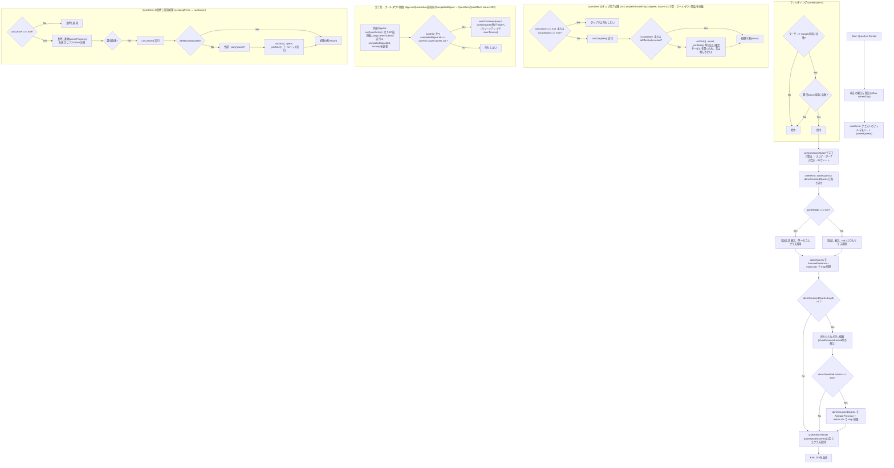

## 1. 解析メタ情報

| 項目 | 内容 |
| --- | --- |
| 対象ファイル | `QuestList.tsx` |
| 言語 | React (TypeScript) |
| 解析対象 | 提供されたコードのみ |
| 推測・補完 | 一切なし |
| 解析基準コミット | `4062600` |

## 関連ドキュメント

- [../hooks/useQuestStatus.md](../hooks/useQuestStatus.md) — `useQuestStatus`/`getQuestLockState`の実装元。クエストのロック・完了・保留判定ロジックを提供する。
- [../../../types/index.md](../../../types/index.md) — `User`/`Quest`/`QuestHistory`型定義の提供元。
- [../../../components/ui/Card.md](../../../components/ui/Card.md) — `QuestItem`がラップして使用するカードUIコンポーネント。
- [../../../components/ui/CooldownRing.md](../../../components/ui/CooldownRing.md) — 無限クエストのクールダウン中に円形プログレスを表示するコンポーネント（対応する解析ドキュメントは本ファイルの解析時点では未作成）。
- [../../../hooks/useSound.md](../../../hooks/useSound.md) — クエストクリック時の効果音再生フックの実装元。
- [../../../hooks/useLongPress.md](../../../hooks/useLongPress.md) — 完了済み/申請中クエストの長押し取消ジェスチャーを提供するフック（対応する解析ドキュメントは本ファイルの解析時点では未作成）。
- [../../family/components/FamilyDashboard.md](../../family/components/FamilyDashboard.md) — `panelMode`/`iconFirst` propsを実際に渡す横画面パネル表示側の呼び出し元。

## 2. ファイルの概要

このファイルは、クエストのリスト（`QuestList`）および個別のクエスト（`QuestItem`）を画面に描画するUIコンポーネントを提供する。`QuestList`は`quests`をターゲット（役割/ユーザー個別/`siblings`＝子ども全員）・曜日で絞り込み、共通関数`getQuestLockState`によるステータススコアとボーナス量・`quest_id`でソートしたうえで、`activeQuests`（今できること）と`doneOrLockedQuests`（完了済み・未開放）に振り分け、`framer-motion`によるアニメーション付きで`QuestItem`のリストとして描画する。完了済み・未開放クエストは既定で折りたたまれ、`showDoneAndLocked`ステートのトグルボタンで開閉できる。`panelMode`propが真の場合、横画面4人表示（`FamilyDashboard`）のパネル内で使うことを想定し、ビューポート幅基準の`md:`ブレークポイントに依存しない、狭いパネル幅でも崩れないタップ領域確保済みの単一カラム表示に切り替える。`iconFirst`propが真の場合、非識字年齢の子ども向けにアイコンを大きく・説明文を非表示にした表示にする。`QuestItem`側では、完了済み・申請中クエストの取消は誤操作防止のため「長押し」（`useLongPress`）でのみ発火し、通常タップは新規の完了操作にのみ作用する。**（#291で修正）** 参照フィールド名がバックエンドの実カラム名に一本化され、`quest.target`→`quest.target_user`、`quest.type`→`quest.quest_type`、`quest.icon`/`quest.icon_key`→`quest.icon_key`のみ、`quest.desc`/`quest.description`→`quest.description`のみ、`quest.gold`/`quest.gold_gain`→`quest.gold_gain`のみに変更され、ソートの`quest_id ?? id`フォールバックおよび`key`の`q.id || q.quest_id`フォールバックも、`id`が幽霊フィールドと判明したため`quest_id`のみの参照に簡略化された。
* 根拠: `export default function QuestList` (行番号: 285 / 抜粋: "export default function QuestList({ quests, completedQuests, pendingQuests, currentUser, onQuestClick, panelMode, iconFirst }: QuestListProps) {")
* 根拠: `const QuestItem: React.FC` (行番号: 37 / 抜粋: "const QuestItem: React.FC<{")
* 根拠: `panelMode`/`iconFirst`のコメント (行番号: 17〜23 / 抜粋: "// 横画面4人表示のパネル内で使うためのモード。\n    // true の場合、ビューポート幅基準の md: ブレークポイント(2カラム化・拡大表示)には\n    // 依存せず、狭いパネル幅でも崩れないタップ領域確保済みの単一カラム表示にする。\n    panelMode?: boolean;\n    // アイコン主体・文字量を絞った表示にするか(非識字年齢の子ども向け)。\n    // 説明文を非表示にし、アイコンをより大きく見せる。\n    iconFirst?: boolean;")
* 根拠: 完了済み/申請中の折りたたみと長押し取消 (行番号: 71〜73, 344〜345行目 / 抜粋: "// 完了済み/申請中の取り消しは「長押し」でのみ発火させ、うっかりタップでの\n    // 誤取り消しを防ぐ。無限クエストは取り消し概念がないため対象外。\n    const canCancel = !isInfinite && (isDone || isPending) && !isEffectivelyLocked;", "// ▼ 角度①: 「今できること」だけを最初に見せるため、完了済み/ロック中は折りたたむ。")
* 根拠: `siblings`ターゲット対応 (行番号: 293〜302行目、H-8バグ修正 / 抜粋: "if (q.target_user === 'siblings') {\n                    // 兄妹連携クエスト: 対象は子ども(role_child)全員\n                    if (currentUser.role !== 'role_child') return false;\n                } else if (q.target_user.startsWith('role_')) {")
* 根拠: ソートの最終タイブレーク修正 (行番号: 336〜340行目、M-6-5バグ修正、#291でさらに簡略化 / 抜粋: "// #291: idフィールド自体が幽霊フィールドとして型定義から削除されたため、\n            // quest_idのみを参照する。\n            const idA = Number(a.quest_id ?? 0);\n            const idB = Number(b.quest_id ?? 0);\n            return idB - idA;")

## 3. 外部依存関係

### インポート一覧

| 名称 | 種類 | 用途 | 根拠 |
| --- | --- | --- | --- |
| `React`, `useEffect`, `useMemo`, `useState` | モジュール | Reactの基本機能およびフック。`useEffect`はIssue #102で、`QuestItem`が`completedSignal`propの変化を監視し無限クエストのクールダウンを開始するために追加された。 | `import React, { useEffect, useMemo, useState } from 'react';` (行番号: 1) |
| `Undo2`, `Clock`, `TrendingUp`, `Lock`, `ChevronDown`, `ChevronUp` | モジュール | アイコンの描画（取消、申請中、ボーナス上昇、ロック、折りたたみ開閉） | `import { Undo2, Clock, TrendingUp, Lock, ChevronDown, ChevronUp } from 'lucide-react';` (行番号: 2) |
| `motion`, `AnimatePresence` | モジュール | アニメーションの制御 | `import { motion, AnimatePresence } from 'framer-motion';` (行番号: 3) |
| `ID`, `User`, `Quest`, `QuestHistory` | 型 | コンポーネントのPropsおよび内部変数の型定義。`ID`はIssue #102で追加された`completedSignal`プロパティ（`{ id: ID; nonce: number } \| null`）の型に使う。 | `import { ID, User, Quest, QuestHistory } from '@/types';` (行番号: 4) |
| `Card` | コンポーネント | UIのカード型コンテナとして使用 | `import { Card } from '@/components/ui/Card';` (行番号: 5) |
| `CooldownRing` | コンポーネント | 無限クエストのクールダウン中に残り時間を円形プログレスで表示 | `import { CooldownRing } from '@/components/ui/CooldownRing';` (行番号: 6) |
| `useQuestStatus`, `getQuestLockState` | カスタムフック / 関数 | クエストの状態（完了、申請中、ロック済みなど）の取得。`getQuestLockState`はソート用コンパレータや`activeQuests`/`doneOrLockedQuests`振り分けからHooksを使わずに同じ判定ロジックを呼び出すための素関数。 | `import { useQuestStatus, getQuestLockState } from '../hooks/useQuestStatus';` (行番号: 7) |
| `useSound` | カスタムフック | 音声再生機能の取得 | `import { useSound } from '@/hooks/useSound';` (行番号: 8) |
| `useLongPress` | カスタムフック | 完了済み/申請中クエストの長押し取消ジェスチャー（押下進捗・実行判定）の取得 | `import { useLongPress } from '@/hooks/useLongPress';` (行番号: 9) |

### ブラックボックスとなる外部要素

| 名称 | 理由 | 根拠 |
| --- | --- | --- |
| `@/types` の各型 (`ID`, `User`, `Quest`, `QuestHistory`) | プロパティの完全な構造が本ファイル内では定義されていないため | `import { ID, User, Quest, QuestHistory } from '@/types';` (行番号: 4) |
| `Card` コンポーネント | 内部の描画ロジックや `variant` などのPropsの仕様が不明なため | `import { Card } from '@/components/ui/Card';` (行番号: 5) |
| `CooldownRing` コンポーネント | `durationMs`/`size` 以外に受け取るPropsや内部の描画方式が不明なため | `import { CooldownRing } from '@/components/ui/CooldownRing';` (行番号: 6) |
| `useQuestStatus`, `getQuestLockState` | 内部の判定ロジック（`isDone`, `isLocked`, `variant` などの算出方法）が不明なため | `import { useQuestStatus, getQuestLockState } from '../hooks/useQuestStatus';` (行番号: 7) |
| `useSound` | `play` 関数の仕様や再生される音声の詳細が不明なため | `import { useSound } from '@/hooks/useSound';` (行番号: 8) |
| `useLongPress` | 長押し判定の実装（イベントリスナーの種類、`pressProgress`の算出方法）が不明なため | `import { useLongPress } from '@/hooks/useLongPress';` (行番号: 9) |

## 4. 主要要素の定義（関数 / エンドポイント / コンポーネント）

### `QuestListProps` / `BadgeCandidate` / `QuestItem`のprops型

* **役割**: `QuestList`が受け取るProps型定義(`QuestListProps`)。`panelMode`（パネル内固定レイアウト用）と`iconFirst`（アイコン主体・非識字年齢向け表示用）に加え、Issue #102で`completedSignal: { id: ID; nonce: number } | null`が追加された（完了APIが実際に成功した時点でのみ対象クエストの完了音・無限クエストのクールダウンを発火させるため、`App`側から通知される）。`BadgeCandidate`はバッジ表示の優先度付け（`key`, `priority`, `node`）に使う内部型。`QuestItem`側にも同じ`completedSignal`を含む、`panelMode?: boolean`, `iconFirst?: boolean`を含むprops型が個別に定義され、`QuestList`から素通しで渡される。
* 根拠: `interface QuestListProps {` (行番号: 11〜27 / 抜粋: "onQuestClick: (quest: Quest) => void;\n    // #102: 完了APIが実際に成功した時点でのみ、対象クエストの完了音・無限クエストの\n    // クールダウンを発火させるための通知(App側で管理)。\n    completedSignal: { id: ID; nonce: number } | null;")
* 根拠: `BadgeCandidate` (行番号: 31〜35 / 抜粋: "interface BadgeCandidate {\n    key: string;\n    priority: number;\n    node: React.ReactNode;\n}")
* 根拠: `QuestItem`のprops型 (行番号: 40〜49 / 抜粋: "completedSignal: { id: ID; nonce: number } | null;\n    panelMode?: boolean;\n    iconFirst?: boolean;\n}> = ({ quest, completedQuests, pendingQuests, currentUser, onClick, completedSignal, panelMode, iconFirst }) => {")

### `MAX_VISIBLE_BADGES` (モジュールレベル定数)

* **役割**: バッジ（ロック・共有対応済み・申請中・期間限定・時間限定）を優先度順に並べたときに、同時表示する上限件数（2件）を定義する。上位2件を超える分は「+N」表示にまとめられる。
* 根拠: (行番号: 29〜37 / 抜粋: "// バッジは種類が多く同時に出すと読みづらいため、優先度順に並べて\n// 上位2件だけを表示する。優先度が低いものは「+N」でまとめて示す。\ninterface BadgeCandidate {...}\nconst MAX_VISIBLE_BADGES = 2;")

### `QuestItem`

* **役割**: 個別のクエストカードを描画し、状態に応じたバッジ表示（優先度順に上位`MAX_VISIBLE_BADGES`件＋「+N」）やタップ/長押し操作に応じたコールバック実行を担う。`panelMode`が真のときはビューポート幅基準の`md:`拡大・2カラム化に乗らず、常に「狭い列でも崩れず、かつタップしやすい」固定サイズのクラス群（`cardSizeClasses`等、8種類）を使う。`iconFirst`が真のときはアイコンサイズを拡大しつつ説明文（`quest.description`）を非表示にする。共有クエスト（`is_shared_completed_by`/`is_shared_pending_by`が自分以外）は`isEffectivelyLocked`として扱われクリック不可になる。完了済み/申請中の取消は`useLongPress`による長押しでのみ発火し、通常タップは新規完了（`handleTapComplete`）にのみ作用する。**Issue #102の修正**: 無限クエストのクールダウン（60秒、`isCooldown`ステート）は、以前はタップ直後（確認モーダルを開く前）に`runComplete`内で完了音の再生とともに開始しており、確認モーダルで「キャンセル」しても音が鳴りクールダウンに入ってしまう不具合があった。修正後は、`App`側から渡される`completedSignal`（完了APIが実際に成功した時点でのみ`CompletedSignal`型の`{ id, userId, nonce }`がセットされる）を監視する`useEffect`でのみ、`isInfinite`かつ`completedSignal.id === questId`（`questId = quest.quest_id`）**かつ`completedSignal.userId === currentUser.user_id`**のときに限りクールダウンを開始するようになった。**（Issue #363で修正）** 以前は`id`の一致しか見ていなかったため、横画面の4人パネル表示（`FamilyDashboard`が同じ`completedSignal`を全パネルへ渡す）で兄が「食器の片付け（infinite, target all）」を完了すると、妹・パパ・ママのパネルの同クエストも60秒間"Wait..."でタップ不能になっていた（サーバー側のクールダウンは(user, quest)単位であり、純粋なクライアント側の誤ロック）。`runComplete`自体は現在、`isCooldown`/`isEffectivelyLocked`のガード判定と`onClick`（確認モーダルを開く）呼び出しのみを行い、音声再生は行わない。完了音の再生（`clear`/`submit`）も同じ理由で`App.tsx`の`runQuestAction`側に移動しており、本コンポーネントの`useSound().play()`は取消時（`runCancel`）の`'cancel'`音のみに使われる。**（#291で修正）** アイコン表示は`quest.icon || quest.icon_key`から`quest.icon_key`のみの参照に、獲得ゴールド表示は`quest.gold_gain || quest.gold`から`quest.gold_gain || 0`に、`questId`の算出は`quest.id ?? quest.quest_id`から`quest.quest_id`のみの参照に、それぞれ簡略化された（いずれも`icon`/`gold`/`id`がバックエンドAPIから一度も送られてこない幽霊フィールドだったため）。
* 根拠: `const QuestItem: React.FC` (行番号: 40〜294 / 抜粋: "const QuestItem: React.FC<{")
* 根拠: パネルモード時のクラス切り替え (行番号: 123〜124 / 抜粋: "const cardSizeClasses = panelMode ? 'p-1 min-h-[56px]' : 'min-h-[56px] md:p-3 md:h-full';")
* 根拠: 説明文の非表示条件 (行番号: 246〜251 / 抜粋: "{/* 説明文: iconFirst(非識字年齢向け)では非表示にし、アイコンでの識別を優先する */}\n                        {!iconFirst && quest.description && (")
* 根拠: `isEffectivelyLocked`と長押し取消 (行番号: 85〜89行目 / 抜粋: "const isEffectivelyLocked = isLocked || isSharedDoneByOther;\n\n    // 完了済み/申請中の取り消しは「長押し」でのみ発火させ、うっかりタップでの\n    // 誤取り消しを防ぐ。無限クエストは取り消し概念がないため対象外。\n    const canCancel = !isInfinite && (isDone || isPending) && !isEffectivelyLocked;")
* 根拠: Issue #102/#363コメントと`completedSignal`監視の`useEffect` (行番号: 60〜76行目 / 抜粋: "// #363: 横画面の4人パネルでは同じ completedSignal が全パネルの同一クエストに届くため、\n    // クエストidだけでなく「誰の完了か」(userId)も一致する場合のみクールダウンに入れる。", "const questId = quest.quest_id;\n    const currentUserId = currentUser.user_id;\n    useEffect(() => {\n        if (!isInfinite || !completedSignal) return;\n        if (completedSignal.id !== questId || completedSignal.userId !== currentUserId) return;\n        setIsCooldown(true);\n        const timer = setTimeout(() => setIsCooldown(false), COOLDOWN_MS);\n        return () => clearTimeout(timer);\n    }, [completedSignal, isInfinite, questId, currentUserId]);")
* 根拠: アイコン・獲得ゴールドの参照簡略化 (行番号: 78, 227 / 抜粋: "const baseGold = quest.gold_gain || 0;", "{quest.icon_key}")
* 根拠: 修正後の`runComplete` (行番号: 91〜96行目 / 抜粋: "const runComplete = () => {\n        // #102: 完了音・クールダウン開始はここでは行わない(上のuseEffect/App側を参照)。\n        // ここではあくまで確認モーダルを開く(onClick)のみを行う。\n        if (isCooldown || isEffectivelyLocked) return;\n        onClick({ ...quest, _isInfinite: !!isInfinite });\n    };")

* **引数/リクエスト**: オブジェクト `{ quest, completedQuests, pendingQuests, currentUser, onClick, completedSignal, panelMode, iconFirst }`
* 根拠: Propsの型定義 (行番号: 40〜49 / 抜粋: "quest: Quest;\n    completedQuests: QuestHistory[];\n    pendingQuests: QuestHistory[];\n    currentUser: User;\n    onClick: (q: Quest) => void;\n    completedSignal: CompletedSignal | null;\n    panelMode?: boolean;\n    iconFirst?: boolean;")

* **戻り値/レスポンス**: ReactElement（JSX）
* 根拠: `return` 文 (行番号: 181〜293 / 抜粋: "return (\n        
")

* **副作用**:
  * `useEffect`により、`isInfinite`かつ`completedSignal.id === questId`（`questId = quest.quest_id`）かつ`completedSignal.userId === currentUser.user_id`のときのみ`setIsCooldown(true)`後、`COOLDOWN_MS`（60000ms）後の`setTimeout`で`isCooldown`を`false`に戻す（クリーンアップ関数で`clearTimeout`）。Issue #102で新規追加、Issue #363で`userId`条件を追加。
  * 根拠: (行番号: 68〜76行目 / 抜粋: "const questId = quest.quest_id;\n    const currentUserId = currentUser.user_id;\n    useEffect(() => {\n        if (!isInfinite || !completedSignal) return;\n        if (completedSignal.id !== questId || completedSignal.userId !== currentUserId) return;\n        setIsCooldown(true);\n        const timer = setTimeout(() => setIsCooldown(false), COOLDOWN_MS);\n        return () => clearTimeout(timer);\n    }, [completedSignal, isInfinite, questId, currentUserId]);")
  * `useSound().play('cancel')`による取消時の音声再生（`runCancel`内）。完了時の音声再生（`clear`/`submit`）はIssue #102の修正で`App.tsx`側（`runQuestAction`）に移動しており、本コンポーネントは行わなくなった。
  * 根拠: `play('cancel');` (行番号: 100行目 / 抜粋: "play('cancel');")
  * `onClick`コールバックを、対象クエストに`_isInfinite`プロパティを動的付与したオブジェクトとともに呼び出す（`runComplete`は確認モーダルを開くため、`runCancel`は取消実行のため）
  * 根拠: (行番号: 95, 101 / 抜粋: "onClick({ ...quest, _isInfinite: !!isInfinite });")

* **エラーハンドリング**: なし。`runComplete`は`isCooldown`または`isEffectivelyLocked`の場合、`runCancel`は`isEffectivelyLocked`の場合にそれぞれ冒頭で処理を中断する。`handleTapComplete`は`canCancel`（長押し対象）または`isCooldown`の場合、および**直前の長押し（取消）発火から猶予時間（`useLongPress`の`clickSuppressMs`、既定400ms）以内の場合（Issue #389）**はタップでは何もしない。
* 根拠: (行番号: 100, 105, 119〜126行目 / 抜粋: "if (isCooldown || isEffectivelyLocked) return;", "if (isEffectivelyLocked) return;", "if (canCancel || isCooldown) return; // 長押し対象/クールダウン中はタップでは何もしない", "if (wasFiredRecently()) return;")

### `QuestList`

* **役割**: 受け取ったクエスト一覧を（ターゲット、曜日で）フィルタリングし、`getQuestLockState`によるステータススコアとボーナス量・`quest_id`（無ければ`id`にフォールバック）でソートしたうえで、`activeQuests`（今できること）と`doneOrLockedQuests`（完了済み・未開放）に分割する。前者は常に、後者は`showDoneAndLocked`が真のときのみ`QuestItem`のリストとして`AnimatePresence`付きで描画する。`panelMode`が真の場合、リストコンテナのクラス（`listContainerClass`）を2カラムグリッドではなく単一カラム縦積みにし、見出し（`-- クエスト一覧 --`）も非表示にする。Issue #102で追加された`completedSignal`はここでは判定に一切関与せず、各`QuestItem`へそのまま素通しするのみである。
* 根拠: `export default function QuestList` (行番号: 296〜446 / 抜粋: "export default function QuestList({ quests, completedQuests, pendingQuests, currentUser, onQuestClick, completedSignal, panelMode, iconFirst }: QuestListProps) {")
* 根拠: `activeQuests`/`doneOrLockedQuests`への振り分け (行番号: 355〜369 / 抜粋: "// ▼ 角度①: 「今できること」だけを最初に見せるため、完了済み/ロック中は折りたたむ。\n    // 申請中(承認待ち)は本人がまだ気にする状態なので折りたたまず常時表示する。\n    const { activeQuests, doneOrLockedQuests } = useMemo(() => {")
* 根拠: `listContainerClass`/`headerClass`の分岐 (行番号: 371〜376 / 抜粋: "const listContainerClass = panelMode\n        ? 'space-y-2 animate-in fade-in duration-300'\n        : 'space-y-2 md:space-y-0 md:grid md:grid-cols-2 md:gap-6 ...';")
* 根拠: 折りたたみボタン (行番号: 429〜435 / 抜粋: "<button\n                        onClick={() => setShowDoneAndLocked(v => !v)}\n                        className=\"w-full min-h-[44px] flex items-center justify-center gap-1.5 text-xs text-gray-400 hover:text-gray-200 bg-black/20 hover:bg-black/30 rounded-lg py-2 transition-colors\"\n                    >")
* 根拠: `QuestItem`への`completedSignal`転送 (行番号: 396 / 抜粋: "completedSignal={completedSignal}")

* **引数/リクエスト**: `QuestListProps` (`{ quests: Quest[], completedQuests: QuestHistory[], pendingQuests: QuestHistory[], currentUser: User, onQuestClick: (quest: Quest) => void, completedSignal: { id: ID; nonce: number } | null, panelMode?: boolean, iconFirst?: boolean }`)
* 根拠: インターフェース定義および引数 (行番号: 11〜27, 296 / 抜粋: "interface QuestListProps {")

* **戻り値/レスポンス**: ReactElement（JSX）
* 根拠: `return` 文 (行番号: 405〜445 / 抜粋: "return (\n        
")

* **副作用**: なし（`useMemo`によるフィルタ・ソート・振り分け結果のメモ化と、`useState`による`showDoneAndLocked`（折りたたみ開閉）の管理のみで、外部API呼び出しやDOM直接操作は存在しない）
* 根拠: `useMemo` ブロック (行番号: 301〜353, 357〜369 / 抜粋: "const sortedQuests = useMemo(() => {", "const { activeQuests, doneOrLockedQuests } = useMemo(() => {")

* **エラーハンドリング**: なし
* 根拠: 関数内に `try-catch` ブロック等が存在しない。

## 5. 処理フロー図

```mermaid
flowchart TD
    Start["Start: QuestList Render"] --> CalcDay["現在の曜日を算出 (jsDay, currentDay)"]
    CalcDay --> FilterSort["useMemo: クエストのフィルタ＆ソート (sortedQuests)"]

    subgraph "フィルタリング (sortedQuests)"
        F2{"ターゲット(target)判定に合致?"}
        F2 -- No --> Drop["除外"]
        F2 -- Yes --> F3{"曜日(days)指定に合致?"}
        F3 -- No --> Drop
        F3 -- Yes --> Keep["保持"]
    end

    Keep --> Sort["getQuestLockState()でスコア算出 → スコア・ボーナス合計・IDでソート"]
    Sort --> SplitGroups["useMemo: activeQuests / doneOrLockedQuests に振り分け"]
    SplitGroups --> LayoutCheck{"panelMode === true?"}
    LayoutCheck -- Yes --> HideHeader["見出し非表示、単一カラムクラス適用"]
    LayoutCheck -- No --> ShowHeader["見出し表示、md:2カラムクラス適用"]
    HideHeader --> RenderActive["activeQuests を AnimatePresence + motion.div で map 処理"]
    ShowHeader --> RenderActive

    RenderActive --> HasDoneOrLocked{"doneOrLockedQuests.length > 0 ?"}
    HasDoneOrLocked -- No --> MapItem
    HasDoneOrLocked -- Yes --> ToggleBtn["折りたたみボタン描画 (showDoneAndLocked切り替え)"]
    ToggleBtn --> ToggleState{"showDoneAndLocked === true?"}
    ToggleState -- Yes --> RenderDoneLocked["doneOrLockedQuests を AnimatePresence + motion.div で map 処理"]
    ToggleState -- No --> MapItem
    RenderDoneLocked --> MapItem["QuestItem Render (panelMode/iconFirstに応じたクラス選択)"]

    subgraph "QuestItem のタップ完了処理 (runComplete/handleTapComplete, Issue #102で音・クールダウン開始を分離)"
        C_Start{"canCancel === true または isCooldown === true?"}
        C_Start -- Yes --> C_NoOp["タップでは何もしない"]
        C_Start -- No --> C_Run["runComplete() 実行"]
        C_Run --> C_Lock{"isCooldown または isEffectivelyLocked?"}
        C_Lock -- Yes --> C_End["処理中断(return)"]
        C_Lock -- No --> C_Callback["onClick({...quest, _isInfinite}) 呼び出し(確認モーダルを開くのみ。音は鳴らさない)"]
        C_Callback --> C_End
    end

    subgraph "完了音・クールダウン開始 (App.runQuestAction成功後のcompletedSignal → QuestItemのuseEffect, Issue #102)"
        E_External["外部(App.tsx runQuestAction): 完了API成功後にplay('clear'/'submit')実行 & completedSignal({id, nonce})を更新"] --> E_Effect{"isInfinite かつ completedSignal.id === questId (=quest.quest_id) ?"}
        E_Effect -- Yes --> E_Cooldown["setIsCooldown(true) / setTimeout(60秒)でfalseへ(クリーンアップでclearTimeout)"]
        E_Effect -- No --> E_NoOp["何もしない"]
    end

    subgraph "QuestItem の長押し取消処理 (useLongPress → runCancel)"
        L_Start{"canCancel === true?"}
        L_Start -- No --> L_Disabled["長押し無効"]
        L_Start -- Yes --> L_Press["長押し進捗(pressProgress)を表示しつつ550ms計測"]
        L_Press --> L_Complete{"閾値到達?"}
        L_Complete -- Yes --> L_Run["runCancel() 実行"]
        L_Run --> L_Lock{"isEffectivelyLocked?"}
        L_Lock -- Yes --> L_End["処理中断(return)"]
        L_Lock -- No --> L_Sound["外部：play('cancel')"]
        L_Sound --> L_Callback["onClick({...quest, _isInfinite}) コールバック実行"] --> L_End
    end

    MapItem --> End["End: JSXを返却"]
```

## 6. 依存関係図

```mermaid
graph TD
    subgraph "QuestList.tsx"
        QuestList["QuestList (Component)"]
        QuestItem["QuestItem (Component)"]
    end

    subgraph "External Hooks / Functions (../hooks/useQuestStatus)"
        useQuestStatus["useQuestStatus"]
        getQuestLockState["getQuestLockState"]
    end

    subgraph "External Hooks (直接import)"
        useSound["useSound"]
        useLongPress["useLongPress"]
    end

    subgraph "External UI Components"
        Card["Card (Component)"]
        CooldownRing["CooldownRing (Component)"]
        LucideIcons["lucide-react (Icons)"]
        FramerMotion["framer-motion (motion, AnimatePresence)"]
    end

    subgraph "Types (Blackbox)"
        Types["@/types (User, Quest, QuestHistory)"]
    end

    QuestList -->|import| Types
    QuestList -->|Render, panelMode/iconFirstを伝播| QuestItem
    QuestList -->|Render| FramerMotion
    QuestList -->|Call (sort comparator, 振り分け)| getQuestLockState

    QuestItem -->|Render| Card
    QuestItem -->|Render (クールダウン中)| CooldownRing
    QuestItem -->|import| Types
    QuestItem -->|Call| useQuestStatus
    QuestItem -->|Call| useSound
    QuestItem -->|Call| useLongPress
    QuestItem -->|Render| LucideIcons
```

## 7. 次のステップ（リバースエンジニアリングの提案）

| 優先度 | ファイル名(推測可) | 理由 | 根拠 |
| --- | --- | --- | --- |
| 高 | `@/types` | `Quest` 型に対して `is_shared_completed_by`, `is_shared_pending_by`, `shared_completed_by_name`, `shared_pending_by_name` など共有クエスト関連のプロパティが参照されており、実際のデータスキーマを把握しないと不具合の原因となるため。 | (行番号: 65〜68 / 抜粋: "const isSharedCompleted = !!quest.is_shared_completed_by...") |
| 高 | `../hooks/useQuestStatus` | クエストの表示状態（`isDone`, `isLocked`, `isPending`, `variant` など）の算出ロジックが本ファイルから切り離されているため、表示不具合の調査にはこのフックおよび`getQuestLockState`関数の解析が必須。 | `const { isDone, isPending... } = useQuestStatus(...)` (行番号: 51〜54) |
| 中 | `@/hooks/useLongPress` | 長押し取消ジェスチャーの発火条件（`thresholdMs`の扱い、`pressProgress`の算出方法、タッチ/マウス両対応の有無）を確認するため。 | `const { isPressing, pressProgress, handlers: longPressHandlers } = useLongPress({...});` (行番号: 95〜99) |
| 中 | `../../family/components/FamilyDashboard.tsx` | `panelMode`/`iconFirst`propsを実際にどのユーザー・どの条件で渡しているか（横画面4人パネル表示側の呼び出し実態）を確認するため。 | `panelMode?: boolean; iconFirst?: boolean;` (行番号: 20, 23) |
| 中 | `@/components/ui/Card` | UIの基盤として利用されており、`variant` Props がどのようにスタイリングに影響するかを確認するため。 | `import { Card } from '@/components/ui/Card';` (行番号: 5) |
| 低 | `@/components/ui/CooldownRing` | クールダウン表示の内部実装（SVGアニメーション等）を確認するため。 | `import { CooldownRing } from '@/components/ui/CooldownRing';` (行番号: 6) |
| 低 | `@/hooks/useSound` | 音声再生の挙動や、どのような文字列引数を受け付けるかを特定するため。 | `const { play } = useSound();` (行番号: 47) |

## 8. 保守上の注意点

* `QuestList`内のソート用コンパレータ（`getStatusScore`、行番号314〜323）および`activeQuests`/`doneOrLockedQuests`への振り分け（行番号346〜358）は、Reactのコールバック内（`Array.sort`や単純なfor-of的処理）からはHooksを呼び出せないため、`useQuestStatus`フックと同じ判定ロジックを共有する素関数`getQuestLockState`を`../hooks/useQuestStatus`からインポートして直接呼び出している。ロック・申請中・完了の判定基準を変更する場合は、`useQuestStatus`と`getQuestLockState`の両方の実装（同一ファイル内であることが望ましい）を確認する必要がある。
* 根拠: [コメント] (行番号: 311〜313 / 抜粋: "// ▼ ソート順: 進行中の期間限定 → 通常 → ロック中 → 承認待ち → 完了済み\n            // （ロック/申請中/完了の判定は useQuestStatus と共通の getQuestLockState に集約。\n            //  Hooksが使えないコンパレータからも直接呼べる）")
* ソートの最終タイブレーク（同一ステータススコア・同一ボーナス合計の場合）は以前`(b.id as number) - (a.id as number)`という実カラムに存在しない`id`を参照しており、実際には`quest_id`カラムを使うべきところ`id`が常に`undefined`のため`NaN`になり並び順が不定だったバグ（M-6-5）があった。修正後は`quest_id`（無ければ`id`にフォールバック）を`Number()`で数値化して比較するようになった。**（#291でさらに修正）** その後`id`フィールド自体が`Quest`型定義から削除された（幽霊フィールドと判明したため）ことに伴い、`a.id`/`b.id`へのフォールバックも廃止され、`Number(a.quest_id ?? 0)`/`Number(b.quest_id ?? 0)`という`quest_id`のみの参照になった。
* 根拠: (行番号: 336〜340行目 / 抜粋: "// M-6-5バグ修正: 実カラムはquest_idであり、idは常にundefinedのため\n            // (b.id as number) - (a.id as number) は常にNaNになり並び順が不定だった。\n            // #291: idフィールド自体が幽霊フィールドとして型定義から削除されたため、\n            // quest_idのみを参照する。\n            const idA = Number(a.quest_id ?? 0);\n            const idB = Number(b.quest_id ?? 0);\n            return idB - idA;")
* ターゲットフィルタ（`q.target_user`）は`'all'`/`role_`プレフィックス/ユーザーID完全一致に加え、`'siblings'`（対象は`role_child`全員）を明示的に分岐している。以前は`'siblings'`がどの条件にも一致せず全ユーザーから除外され、バックエンドに完了報告〜承認・却下・取消のカスケードまで実装済みの兄妹連携クエスト機能が画面に表示されず起動不能だったバグ（H-8）の修正。同一ロジックが`FamilyDashboard.tsx`側にも存在するため、ターゲット判定を変更する際は両ファイルを確認する必要がある。**（#291で修正）** 参照フィールド名は`q.target`から`quest_master`の実カラム名である`q.target_user`に変更された。
* 根拠: (行番号: 293〜302行目 / 抜粋: "if (q.target_user === 'siblings') {\n                    // 兄妹連携クエスト: 対象は子ども(role_child)全員\n                    if (currentUser.role !== 'role_child') return false;\n                } else if (q.target_user.startsWith('role_')) {")
* `QuestItem` の `runComplete`/`runCancel` において、`onClick` コールバックに渡すオブジェクトに動的に `_isInfinite` プロパティを追加している。`Quest`型に定義されているかは本ファイルからは不明。
* 根拠: `onClick({ ...quest, _isInfinite: !!isInfinite });` (行番号: 95, 101)
* **完了音・クールダウン発火タイミングの変更（Issue #102バグ修正）**: 以前は`runComplete`がタップ即時（確認モーダルを開く前）に完了音の再生と`isCooldown`のセット（無限クエストの場合）を行っていたため、確認モーダルで「キャンセル」しても音が鳴り、無限クエストは60秒間タップ不能になる不具合があった。修正後は、完了音の再生（`clear`/`submit`）と発火対象クエストの`id`/`nonce`の通知は`App.tsx`の`runQuestAction`（完了APIが実際に成功した後）に移動し、`completedSignal` propとして`FamilyDashboard`（または`App`直下）→`FamilyPanel`→`QuestList`→`QuestItem`まで素通しされる。`QuestItem`は`completedSignal.id === questId`（`questId = quest.quest_id`）かつ`completedSignal.userId === currentUser.user_id`（Issue #363: 横画面4人パネルで他メンバーの完了に反応しないための条件）かつ`isInfinite`のときのみ`useEffect`でクールダウンを開始する。`runComplete`自体は現在ガード判定と`onClick`呼び出しのみを行い、音声再生は一切行わない。`isCooldown`はコンポーネントローカルな`useState`のままであるため、画面遷移やコンポーネントの再マウントが起きるとリセットされる点は変わらない。サーバー側でクールダウンを強制する仕組みがあるかは本ファイルからは不明。
* 根拠: (行番号: 51〜52, 60〜70, 91〜96 / 抜粋: "const [isCooldown, setIsCooldown] = useState(false);\n    const COOLDOWN_MS = 60000;", "const questId = quest.quest_id;\n    useEffect(() => {\n        if (!isInfinite || !completedSignal || completedSignal.id !== questId) return;\n        setIsCooldown(true);")
* **`questId`算出順序の非対称性は解消済み（Issue #291）**: `QuestItem`内の`questId = quest.id ?? quest.quest_id`（Issue #102で追加）は`id`を`quest_id`より優先する順序だったが、同ファイル内`QuestList`のソート比較（M-6-5バグ修正、`Number(a.quest_id ?? a.id ?? 0)`）は`quest_id`を優先する逆順であり、非対称な優先順位が存在していた。`Quest.id`がバックエンドAPIから一度も送られてこない幽霊フィールドと判明したため`Quest`型定義自体から削除され、両箇所とも`quest_id`のみを参照する形に統一されたことで、この非対称性という懸念自体が解消された。
* 根拠: (行番号: 64 / 抜粋: "const questId = quest.quest_id;") と (行番号: 351〜352 / 抜粋: "const idA = Number(a.quest_id ?? 0);\n            const idB = Number(b.quest_id ?? 0);")
* 共有クエスト（`is_shared_completed_by`/`is_shared_pending_by`）が自分以外の値を持つ場合、`isEffectivelyLocked`が真となりクリック不可・長押し無効になる。この判定は`useQuestStatus`が返す`isLocked`とは別に本ファイル内で独自に算出されている。
* 根拠: (行番号: 65〜69 / 抜粋: "const isEffectivelyLocked = isLocked || isSharedDoneByOther;")
* 完了済み・申請中クエストの取消操作は、以前存在した確認クリックではなく`useLongPress`による550msの長押し（`canCancel`が真のときのみ有効）に統一されている。通常タップは`canCancel`または`isCooldown`のときには何も起きない（`handleTapComplete`が早期リターン）。
* **[修正済み] 長押し取消→指を離した瞬間のclickで完了確認が開く競合（Issue #389）**: `canCancel`の真偽で`onClick={handleTapComplete}`と長押しハンドラを同じ`Card`に差し替えているため、長押しが550msで発火→取消API→`invalidateQueries`→再取得（LAN内で100〜300ms）が指を離すより先に終わると、`canCancel`が偽になった同じDOMノードに`handleTapComplete`が付いた状態で`pointerup`由来の`click`が届き、直前に取り消したクエストの完了確認モーダルが開いていた（子どもが「はい」を押せば即再申請）。修正後は`useLongPress`が返す`wasFiredRecently()`（直近の長押し発火から400ms以内なら真）を`handleTapComplete`の冒頭で確認し、該当する`click`を無視する。再現テストは`QuestList.test.tsx`。
* 根拠: (行番号: 110〜126 / 抜粋: "const { isPressing, pressProgress, wasFiredRecently, handlers: longPressHandlers } = useLongPress({", "// #389: 長押し(取消)が550msで発火 → 取消API → invalidateQueries → 再取得(LAN内で\n        // 100〜300ms)が指を離すより先に終わると、同じDOMノードに本ハンドラが付いた状態で\n        // pointerup 由来の click が届き、直前に取り消したクエストの完了確認モーダルが\n        // 開いてしまう(子どもが「はい」を押せば即再申請)。長押し発火直後の click は無視する。\n        if (wasFiredRecently()) return;")
* 根拠: (行番号: 71〜73, 95〜106 / 抜粋: "// 完了済み/申請中の取り消しは「長押し」でのみ発火させ、うっかりタップでの\n    // 誤取り消しを防ぐ。無限クエストは取り消し概念がないため対象外。\n    const canCancel = !isInfinite && (isDone || isPending) && !isEffectivelyLocked;", "const handleTapComplete = () => {\n        if (canCancel || isCooldown) return;")
* `panelMode`/`iconFirst`はいずれもレイアウト・表示切り替え専用のオプショナルpropで、クエストの判定ロジック自体（`isDone`/`isLocked`等）には影響しない。表示クラスの選択（`cardSizeClasses`, `layoutClasses`, `iconSizeClasses`等、8種類のスタイル変数）が`panelMode`/`iconFirst`の値ごとに個別に分岐しており、いずれか一方のモードのみを追加・変更する際は該当する全変数を漏れなく確認する必要がある。
* 根拠: (行番号: 108〜115 / 抜粋: "const cardSizeClasses = panelMode ? 'p-1 min-h-[56px]' : 'min-h-[56px] md:p-3 md:h-full';")
* アイコンエリア（`min-w-[1.5rem]`で幅を確保する`
`）とカード全体のpadding（`cardSizeClasses`）・列間のgap（`layoutClasses`）は、クエスト名・ゴールド表示エリアをより広く取るため、アイコン周りの余白を半分程度に縮小する形で調整されている（`p-2`→`p-1`、`md:p-6`→`md:p-3`、`gap-2`→`gap-1`、`gap-3 md:gap-6`→`gap-1.5 md:gap-3`、`min-w-[3rem]`→`min-w-[1.5rem]`）。
* 根拠: (行番号: 114〜115, 210 / 抜粋: "const cardSizeClasses = panelMode ? 'p-1 min-h-[56px]' : 'min-h-[56px] md:p-3 md:h-full';\n    const layoutClasses = panelMode ? 'flex items-center gap-1' : 'flex md:grid md:grid-cols-[auto_1fr_auto] items-center gap-1.5 md:gap-3';", "
")
* バッジ表示は`badgeCandidates`に優先度（`priority`が小さいほど優先: 未開放0 < 対応済み1 < 申請中2 < 期間限定3 < 時間限定4）を付けてソートし、上位`MAX_VISIBLE_BADGES`（2件）のみ表示、残りは「+N」でまとめられる。バッジ種別を追加する際はこの優先度体系に組み込む必要がある。
* 根拠: (行番号: 121〜168 / 抜粋: "// ▼ バッジ候補を優先度付きで作り、上位2件だけを表示する(角度①: バッジ過多の整理)\n    const badgeCandidates: BadgeCandidate[] = [];")

## 9. 不明事項一覧

| 項目 | 理由 | 必要なファイル |
| --- | --- | --- |
| `Quest` オブジェクトの実態 | 型定義に存在するかどうか不明なプロパティ（`is_shared_completed_by`、`_isInfinite`など）が実行時にどう扱われているか不明なため。 | `@/types`, データをフェッチしているAPI側の実装 |
| `useQuestStatus` / `getQuestLockState` の判定ロジック | 各ステータス（`isDone`, `isLocked`, `variant` など）をどのように決定しているか不明なため。 | `../hooks/useQuestStatus` |
| `useLongPress` の実装詳細 | `thresholdMs`到達時の発火タイミング、`pressProgress`の算出方法、モバイル/デスクトップ両対応の有無が不明なため。 | `@/hooks/useLongPress` |
| `panelMode`/`iconFirst`の実際の呼び出し条件 | 本ファイルはpropsを受け取って表示を切り替えるのみであり、どのユーザー・どの画面幅で真になるかは呼び出し元次第で不明なため。 | `../../family/components/FamilyDashboard.tsx`, `App.tsx` |
| `Card`/`CooldownRing` のスタイル仕様 | `variant`や`className`、`durationMs`/`size`がどう合成されて描画されるか不明なため。 | `@/components/ui/Card`, `@/components/ui/CooldownRing` |
| 音声再生の詳細 | `play('clear')`等の引数が実際にどの音声を鳴らすか不明なため。 | `@/hooks/useSound` |

## 相互参照による補足情報

| 元の不明事項 | 判明した内容 | 参照元ドキュメント |
| --- | --- | --- |
| `Quest` オブジェクトの実態 | `family-quest/src/types/index.ts`を直接確認した。`Quest`インターフェース(35〜57行目)には共有クエスト判定用の`is_shared_completed_by`(53行目)、`shared_completed_by_name`(54行目)、`is_shared_pending_by`(55行目)、`shared_pending_by_name`(56行目)が定義されており、コメントで「バックエンドの`get_available_quests`が付与するフィールド」と明記されている。また`_isInfinite?: boolean`(45行目)も`Quest`型に定義済みであることを確認した。`QuestItem`の`runComplete`/`runCancel`が`onClick`コールバックへ動的付与している`_isInfinite`プロパティ(本ファイル86, 92行目)は、実際には型定義済みのオプショナルフィールドへの代入である。**（#291で修正）** `Quest`インターフェースからは`id`/`desc`/`reward_exp`/`reward_gold`/`exp`/`gold`/`type`/`icon`/`target`が削除され、`quest_id`/`description`/`exp_gain`/`gold_gain`/`quest_type`/`icon_key`/`target_user`という実カラム名のみに一本化されたことを確認した（削除されたフィールドはバックエンドAPIから一度も送られてこない幽霊フィールドだった）。 | 直接ソース確認: `family-quest/src/types/index.ts:35-57` |
| `useQuestStatus` / `getQuestLockState` の判定ロジック | `family-quest/src/features/quest/hooks/useQuestStatus.ts`を直接確認した。`getQuestLockState`(31〜83行目)は`quest.pre_requisite_quest_id`が未設定、または当日の`completedQuests`(ステータス`'approved'`)に前提クエストIDが含まれる場合に`isPreReqCleared`を真とし、`isLocked = !isPreReqCleared`で算出する。`isDone`は自分の承認済み完了履歴件数(`myCompletions.length > 0`)から求めるが、無限クエスト(`isInfinite`)の場合は常に`false`に上書きされる。`useQuestStatus`はこの結果に`isRandom`、`isLimited`、`isTimeLimited`(`!!quest.start_time`)を加え、`isLocked`→`isDone`→`isPending`→`isInfinite`→`isTimeLimited`→`isRandom`→`isLimited`→デフォルトの優先順位で`variant`を決定する。**（#291で修正）** `isRandom`/`isLimited`の判定は`quest.type === 'random'`/`quest.type === 'limited'`という幽霊フィールド参照から`quest.quest_type === 'random'`/`quest.quest_type === 'limited'`のみの参照に変更された。 | 直接ソース確認: `family-quest/src/features/quest/hooks/useQuestStatus.ts:31-124` |
| `useLongPress` の実装詳細 | `family-quest/src/hooks/useLongPress.ts`を直接確認した。`onPointerDown`(51〜70行目)で`PROGRESS_TICK_MS`(30ms、23行目)間隔の`setInterval`により`pressProgress`を更新しつつ、`thresholdMs`到達時に`setTimeout`(63〜69行目)で`firedRef.current = true`とし`onLongPress`を呼ぶ。`onPointerUp`は`endPress(true)`(83行目)を呼び、`firedRef.current`が偽（長押しが発火していない）かつ`onShortTap`が渡されていれば短タップとして`onShortTap`を呼ぶ(76〜78行目)。呼び出し元の`QuestList.tsx`(95〜99行目)は`onLongPress: runCancel`、`disabled: !canCancel`、`thresholdMs: 550`のみを渡し、`onShortTap`は渡していないため、`canCancel`が真のカード(完了済み/申請中)で長押しに満たない短タップは何も起きない。`longPressHandlers`は`canCancel`が真の場合のみカードのルート要素に展開される(179行目)。 | 直接ソース確認: `family-quest/src/hooks/useLongPress.ts:23,51-98`（呼び出し側: `family-quest/src/features/quest/components/QuestList.tsx:95-99,179`） |
| `panelMode`/`iconFirst`の実際の呼び出し条件 | `family-quest/src/features/family/components/FamilyDashboard.tsx`と`family-quest/src/App.tsx`を直接確認した。横画面(landscape)側は`FamilyDashboard.tsx`の`FamilyPanel`が`<QuestList ... panelMode iconFirst={iconFirst} />`(191〜199行目)という形で`panelMode`を常に真で渡し、`iconFirst`は`FamilyDashboard`の`iconFirstUserIds.includes(user.user_id)`(101行目、`useSettings()`由来)をユーザーごとに評価した値をpropsとして渡している。縦画面(portrait)側は`App.tsx`の`<QuestList ... iconFirst={iconFirstUserIds.includes(currentUser.user_id)} />`(490〜498行目)が`panelMode`を渡さない（＝`undefined`で偽扱い）まま、`iconFirst`のみを同じ`useSettings().iconFirstUserIds`から算出して渡している。 | 直接ソース確認: `family-quest/src/features/family/components/FamilyDashboard.tsx:101,191-199`, `family-quest/src/App.tsx:490-498` |
| `Card`/`CooldownRing` のスタイル仕様 | `family-quest/src/components/ui/Card.tsx`と`family-quest/src/components/ui/CooldownRing.tsx`を直接確認した。`Card`(11〜49行目)は`variant`prop(`default`/`completed`/`pending`/`infinite`/`timeLimit`/`random`/`limited`/`locked`のいずれか)に応じて`variantStyle`(border色・背景色等のTailwindクラス)を`switch`文(17〜40行目)で切り替え、`baseStyle`・`interactiveStyle`（`onClick`が渡されていれば`cursor-pointer`等）・`className`と結合して描画する。`CooldownRing`(10〜53行目)は`durationMs`/`size`(既定40)をpropsとして受け取り、`useEffect`内の`setInterval`(13〜22行目、100ms間隔)で残り時間の割合(`remainingFraction`)を計算し、SVGの`circle`要素の`strokeDashoffset`をアニメーションさせる円形プログレスリングである。 | 直接ソース確認: `family-quest/src/components/ui/Card.tsx:11-49`, `family-quest/src/components/ui/CooldownRing.tsx:10-53` |
| 音声再生の詳細 | `family-quest/src/hooks/useSound.ts`を直接確認した。`SOUNDS`定義(4〜13行目)には本ファイルが使用する`'clear'`(7行目、`quest_clear.mp3`)、`'submit'`(5行目、`submit.mp3`)、`'cancel'`(12行目、`tap.mp3`と同一音源)の3キーがすべて実在する。`play`(21〜46行目)は`audioCache`にキャッシュされた`HTMLAudioElement`を`currentTime = 0`にリセットしてから再生し、`audio.play()`が失敗した場合は`console.warn`のみで例外を投げない(38〜41行目)。 | 直接ソース確認: `family-quest/src/hooks/useSound.ts:4-13,21-46` |

## 10. 自己検証結果

* [x] 完了: 推測・外部ファイルの仕様を一切含んでいない
* [x] 完了: 全関数・全クラス・全コンポーネントを列挙した
* [x] 完了: 全てのインポート要素を列挙した
* [x] 完了: すべての仕様説明に「根拠（行番号・抜粋）」を明記した
* [x] 完了: 根拠漏れが0件である
* [x] 完了: Mermaid構文にエラーの原因となる記号（エスケープ漏れ）がない
* [x] 完了: 不明事項を漏れなく列挙した
