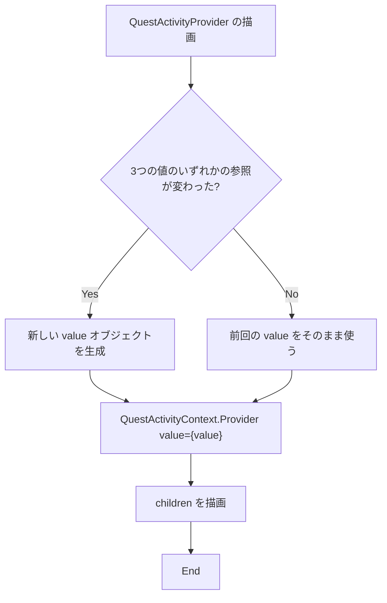
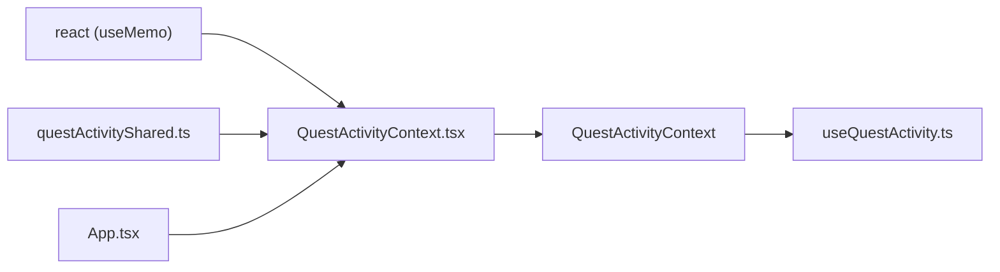

## 1. 解析メタ情報

| 項目 | 内容 |
| --- | --- |
| 対象ファイル | `QuestActivityContext.tsx` |
| 言語 | React (TypeScript) |
| 解析対象 | 提供されたコードのみ |
| 推測・補完 | 一切なし |

## 関連ドキュメント

- [questActivityShared.md](./questActivityShared.md) — `QuestActivityContext` と `QuestActivityValue` の実装元。
- [useQuestActivity.md](./useQuestActivity.md) — 本Providerが流した値を読むフックの実装元。
- [../../../../App.md](../../../../App.md) — docstringが「唯一の使用者」と述べている側。3つの値の持ち主でもある。

## 2. ファイルの概要

* 進行中のクエスト操作(`completedSignal` / `processingQuestKeys` / `busyHistoryIds`)を `QuestActivityContext` へ流す Provider コンポーネント `QuestActivityProvider` を提供する。
* docstringによれば「App.tsx が唯一の使用者」であり、「値は App の state/ref から来るので、ここでは組み立てて memo 化するだけ」である(#659)。
* 根拠: [docstring] (行番号: 8〜14 / 抜粋: "進行中のクエスト操作を配る Provider(#659)。App.tsx が唯一の使用者。")

## 3. 外部依存関係

### インポート一覧

| 名称 | 種類 | 用途 | 根拠 |
| --- | --- | --- | --- |
| `React` | ライブラリ | `React.ReactNode` / `React.FC` の型注釈に使用 | 根拠: `import React, { useMemo } from 'react';` (行番号: 1 / 抜粋: "import React, { useMemo } from 'react';") |
| `useMemo` | React Hook | Provider に渡す値オブジェクトの再生成を、3つの値のいずれかが変わったときだけに限るため | 根拠: `import React, { useMemo } from 'react';` (行番号: 1 / 抜粋: "import React, { useMemo } from 'react';") |
| `QuestActivityContext` | オブジェクト | `.Provider` として描画する Context オブジェクト | 根拠: `import { QuestActivityContext, QuestActivityValue } from './questActivityShared';` (行番号: 2 / 抜粋: "import { QuestActivityContext, QuestActivityValue } from './questActivityShared';") |
| `QuestActivityValue` | 型 | Props の基底型および `useMemo` の型引数として使用 | 根拠: (行番号: 2 / 抜粋: "import { QuestActivityContext, QuestActivityValue } from './questActivityShared';") |

### ブラックボックスとなる外部要素

| 名称 | 理由 | 根拠 |
| --- | --- | --- |
| 3つの値が変化するタイミング | 本ファイルは受け取った値をそのまま memo 化して流すだけで、いつ・どの値が変わるかは呼び出し元でのみ決まる。 | 根拠: (行番号: 18〜21 / 抜粋: "    const value = useMemo<QuestActivityValue>(") |

## 4. 主要要素の定義（関数 / エンドポイント / コンポーネント）

### `Props` (interface)

* **役割**: `QuestActivityValue` の3フィールドをそのまま props として受け取り、加えて `children` を持つ。
* 根拠: [定義] (行番号: 4〜6 / 抜粋: "interface Props extends QuestActivityValue {")
* `QuestActivityValue` を `extends` しているため、値の型が増減すると Props も自動的に追従する。
* 根拠: (行番号: 4 / 抜粋: "interface Props extends QuestActivityValue {")

### `QuestActivityProvider` (export React.FC)

* **役割**: 受け取った3つの値を1つのオブジェクトに組み立て、`QuestActivityContext.Provider` の値として子へ配る。
* 根拠: [定義] (行番号: 15〜28 / 抜粋: "export const QuestActivityProvider: React.FC<Props> = ({")
* **引数/リクエスト**: `completedSignal`、`processingQuestKeys`、`busyHistoryIds`、`children`。
* 根拠: (行番号: 15〜17 / 抜粋: "export const QuestActivityProvider: React.FC<Props> = ({", "    completedSignal, processingQuestKeys, busyHistoryIds, children,")
* **戻り値/レスポンス**: `QuestActivityContext.Provider` で `children` を包んだ要素。
* 根拠: (行番号: 23〜27 / 抜粋: "        <QuestActivityContext.Provider value={value}>")
* **副作用**: `useMemo` の依存配列が3つの値の**参照**であるため、参照が変わったときだけ新しいオブジェクトが作られ、下流の購読者が再レンダーされる。docstringは `completedSignal` について「nonce 付きの新しいオブジェクトとして毎回作られるため、参照が変わったときだけ下流が再レンダーされる」と述べている。
* 根拠: (行番号: 11〜13, 18〜21 / 抜粋: "     * 値は App の state/ref から来るので、ここでは組み立てて memo 化するだけ。", "    const value = useMemo<QuestActivityValue>(")
* **エラーハンドリング**: なし（例外を投げうる処理を含まない）。

## 5. 処理フロー図

## 6. 依存関係図

## 7. 次のステップ（リバースエンジニアリングの提案）

| 優先度 | 対象 | 理由 |
| --- | --- | --- |
| 高 | `family-quest/src/App.tsx`（[App.md](../../../../App.md)） | docstringが「唯一の使用者」と述べる側。3つの値の生成・更新もここにある。 |
| 中 | `family-quest/src/features/quest/context/questActivityShared.ts`（[questActivityShared.md](./questActivityShared.md)） | `Props` が `extends` している型の定義元。 |

## 8. 保守上の注意点

* **`useMemo` の依存は値の「参照」である。** `processingQuestKeys` / `busyHistoryIds` は配列なので、呼び出し元が中身を変えずに毎回新しい配列を作ると、その都度下流が再レンダーされる。逆に既存の配列を直接 `push` して参照を変えずに更新すると、下流に変更が届かない。
* 根拠: (行番号: 18〜21 / 抜粋: "    const value = useMemo<QuestActivityValue>(")
* **`Props` が `QuestActivityValue` を `extends` しているため、値の型にフィールドを足すと Provider の呼び出し元すべてが型エラーになる。** これは意図した安全側の挙動で、追加を見落とさないための仕組みである。
* 根拠: (行番号: 4 / 抜粋: "interface Props extends QuestActivityValue {")

## 9. 不明事項一覧

| 不明点 | 理由 | 確認先 |
| --- | --- | --- |
| Provider をどの位置に挟んでいるか | 本ファイルには含まれない。 | `family-quest/src/App.tsx` |
| `completedSignal` の `nonce` が何を表すか | docstringが「nonce 付きの新しいオブジェクトとして毎回作られる」と述べるのみで、値の意味は本ファイルにない。 | `family-quest/src/App.tsx`、`family-quest/src/types` |

## 10. 自己検証結果

- [x] 4章のすべての記述に「根拠」を付けたか → 付けた
- [x] ソースコードのみを根拠にしたか（推測・補完を書いていないか） → 書いていない
- [x] 分からないことを9章の不明事項に正直に書いたか → 書いた
- [x] 10セクション構成に従っているか → 従っている
- [x] 日本語で書いたか → 書いた
