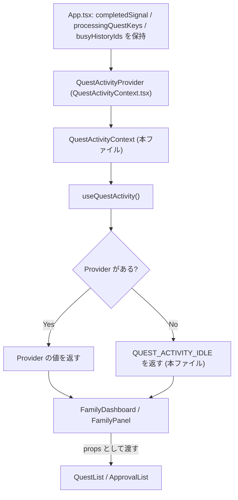
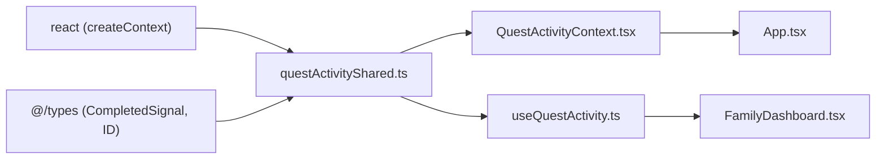

## 1. 解析メタ情報

| 項目 | 内容 |
| --- | --- |
| 対象ファイル | `questActivityShared.ts` |
| 言語 | React (TypeScript) |
| 解析対象 | 提供されたコードのみ |
| 推測・補完 | 一切なし |

## 関連ドキュメント

- [QuestActivityContext.md](./QuestActivityContext.md) — 本ファイルの `QuestActivityContext` に値を流し込む Provider の実装元。
- [useQuestActivity.md](./useQuestActivity.md) — 本ファイルの `QuestActivityContext` と `QUEST_ACTIVITY_IDLE` を読むフックの実装元。
- [../../../../App.md](../../../../App.md) — `QuestActivityValue` の3つの値を保持し Provider へ渡す唯一の持ち主。
- [../../family/components/FamilyDashboard.md](../../family/components/FamilyDashboard.md) — `useQuestActivity` を通じて本ファイルの型の値を読む側。
- [../components/QuestList.md](../components/QuestList.md) — `completedSignal` / `processingQuestKeys` を props として受け取り表示に使う側。
- [../components/ApprovalList.md](../components/ApprovalList.md) — `busyHistoryIds` を props として受け取り表示に使う側。

## 2. ファイルの概要

* 「いま画面上で進行中のクエスト操作」を表す横断的なUI状態の型 `QuestActivityValue`、その Context オブジェクト `QuestActivityContext`、Provider が無い場合の既定値 `QUEST_ACTIVITY_IDLE` を提供する。
* コメントによれば、Provider 本体(`QuestActivityContext.tsx`)とフック(`useQuestActivity.ts`)の両方から参照する型・Context object をここに集約している。これは「react-refresh の『1ファイルはコンポーネントのみexportする』制約により、コンポーネントを export する `QuestActivityContext.tsx` と分離している」ためであり、`context/settingsShared.ts` と同じ構成であると説明されている。
* 根拠: [ファイル冒頭のコメント] (行番号: 4〜8 / 抜粋: "// QuestActivityContext.tsx(Provider本体)と useQuestActivity.ts(フック)の両方から")
* docstringによれば、これらの値は「いずれも `App.tsx` が唯一の持ち主で、表示側(`QuestList` / `ApprovalList`)は読むだけ」であり、以前は `App → FamilyDashboard → FamilyPanel → QuestList` と素通しの props で運んでいたものを、「中継する2つのコンポーネントは値を一切使わないのに型と引数だけを持たされていた」ため Context へ移した(#659)、と説明されている。
* 根拠: [`QuestActivityValue` のdocstring] (行番号: 10〜17 / 抜粋: "「いま画面上で進行中のクエスト操作」を表す横断的なUI状態(#659)。")

## 3. 外部依存関係

### インポート一覧

| 名称 | 種類 | 用途 | 根拠 |
| --- | --- | --- | --- |
| `createContext` | React API | `QuestActivityContext` の生成 | 根拠: `import { createContext } from 'react';` (行番号: 1 / 抜粋: "import { createContext } from 'react';") |
| `CompletedSignal` | 型 | `completedSignal` フィールドの型として使用 | 根拠: `import type { CompletedSignal, ID } from '@/types';` (行番号: 2 / 抜粋: "import type { CompletedSignal, ID } from '@/types';") |
| `ID` | 型 | `busyHistoryIds` フィールドの要素型として使用 | 根拠: `import type { CompletedSignal, ID } from '@/types';` (行番号: 2 / 抜粋: "import type { CompletedSignal, ID } from '@/types';") |

### ブラックボックスとなる外部要素

| 名称 | 理由 | 根拠 |
| --- | --- | --- |
| `CompletedSignal` の構造 | 本ファイルは `@/types` から型をimportするだけで、`id` / `userId` / `nonce` といったフィールドの定義は含まない。docstringが `userId` を含むことに言及するのみ。 | 根拠: (行番号: 2, 22 / 抜粋: "import type { CompletedSignal, ID } from '@/types';", "#363: `userId` を含み、各パネルの QuestItem は**自分のユーザーの完了にのみ**") |
| `processingQuestKeys` のキー文字列の組み立て規則 | 本ファイルは `string[]` とだけ定義しており、`(user_id, quest_id)` からキーを作る処理は含まない。 | 根拠: (行番号: 26〜27 / 抜粋: "/** #391: 完了/取消APIが送信中の `(user_id, quest_id)` キー集合。 */") |

## 4. 主要要素の定義（関数 / エンドポイント / コンポーネント）

### `QuestActivityValue` (export interface)

* **役割**: 進行中のクエスト操作を表す3つの値の形を定義する。
* 根拠: [定義] (行番号: 18〜30 / 抜粋: "export interface QuestActivityValue {")
* **メンバー**:
  * `completedSignal: CompletedSignal | null` — コメントによれば「#102: 完了APIが実際に成功した時点でのみ、対象クエストの完了音・無限クエストのクールダウンを発火させるための通知」であり、「#363: `userId` を含み、各パネルの QuestItem は自分のユーザーの完了にのみ反応する(横画面では4枚のパネルが同じ signal を受け取るため)」。
  * 根拠: (行番号: 19〜25 / 抜粋: "     * #102: 完了APIが実際に成功した時点でのみ、対象クエストの完了音・無限クエストの", "    completedSignal: CompletedSignal | null;")
  * `processingQuestKeys: string[]` — コメントによれば「#391: 完了/取消APIが送信中の `(user_id, quest_id)` キー集合」。
  * 根拠: (行番号: 26〜27 / 抜粋: "/** #391: 完了/取消APIが送信中の `(user_id, quest_id)` キー集合。 */", "    processingQuestKeys: string[];")
  * `busyHistoryIds: ID[]` — コメントによれば「#391(F-L8): 承認APIが送信中の履歴id集合」。
  * 根拠: (行番号: 28〜29 / 抜粋: "/** #391(F-L8): 承認APIが送信中の履歴id集合。 */", "    busyHistoryIds: ID[];")
* **副作用**: なし（型宣言のみ）。
* **エラーハンドリング**: なし。

### `QuestActivityContext` (export const)

* **役割**: `QuestActivityValue | null` を保持する React Context オブジェクト。既定値は `null`。
* 根拠: [定義] (行番号: 32 / 抜粋: "export const QuestActivityContext = createContext<QuestActivityValue | null>(null);")
* **引数/リクエスト**: なし。
* **戻り値/レスポンス**: Context オブジェクト。
* **副作用**: なし。
* **エラーハンドリング**: なし。Provider 未設置の場合に `null` になることの扱いは `useQuestActivity` 側にある。

### `QUEST_ACTIVITY_IDLE` (export const)

* **役割**: Provider が無い場合に使う既定値。3つのフィールドをすべて「空」(`null` / `[]` / `[]`)にしたもの。
* 根拠: [定義] (行番号: 41〜45 / 抜粋: "export const QUEST_ACTIVITY_IDLE: QuestActivityValue = {")
* docstringによれば、「『何も進行中でない』は表示上まったく無害(ローディングもクールダウンも出ない)なので、throw ではなくこれを返す」「表示専用コンポーネント(`QuestList` / `ApprovalList`)を Provider 無しで単体テストできる状態を保つため」である。`useSettings` が Provider 無しで throw するのとは方針が異なる。
* 根拠: [docstring] (行番号: 34〜40 / 抜粋: "Provider が無い場合に使う既定値。")
* **引数/リクエスト**: なし。
* **戻り値/レスポンス**: `QuestActivityValue`。
* **副作用**: なし。ただしモジュールレベルの**単一のオブジェクト**であるため、これを直接書き換えると全ての参照元に影響する。
* **エラーハンドリング**: なし。

## 5. 処理フロー図

本ファイルは型・Context オブジェクト・定数の宣言のみで実行時の分岐を持たないため、3ファイルにまたがる値の流れを示す。

## 6. 依存関係図

## 7. 次のステップ（リバースエンジニアリングの提案）

| 優先度 | 対象 | 理由 |
| --- | --- | --- |
| 高 | `family-quest/src/App.tsx`（[App.md](../../../../App.md)） | 3つの値の唯一の持ち主であり、いつ・どの値が変わるかは App 側にしか書かれていない。 |
| 高 | `family-quest/src/features/quest/context/useQuestActivity.ts`（[useQuestActivity.md](./useQuestActivity.md)） | `QUEST_ACTIVITY_IDLE` へフォールバックする実際の条件を確認するため。 |
| 中 | `family-quest/src/features/family/components/FamilyDashboard.tsx`（[FamilyDashboard.md](../../family/components/FamilyDashboard.md)） | 読み手側が値をどう使い、どこまで props へ戻して渡しているかを確認するため。 |

## 8. 保守上の注意点

* **`QUEST_ACTIVITY_IDLE` はモジュールレベルの単一オブジェクトである。** Provider 無しのすべての利用者が同じ参照を共有するため、受け取った側がこのオブジェクトや中の配列を書き換えてはいけない。
* 根拠: (行番号: 41〜45 / 抜粋: "export const QUEST_ACTIVITY_IDLE: QuestActivityValue = {")
* **`useSettings` と違い Provider 未設置でも throw しない方針である。** docstringが説明するとおり、これは表示専用コンポーネントを Provider 無しで単体テストできる状態を保つための意図的な選択であり、「Provider の付け忘れ」は例外ではなく「何も進行中でない表示」として現れる。配線ミスに気づきにくいので、組み上がりを見るテスト(`FamilyDashboard.test.tsx`)側で担保する必要がある。
* 根拠: [`QUEST_ACTIVITY_IDLE` のdocstring] (行番号: 34〜40 / 抜粋: "「何も進行中でない」は表示上まったく無害(ローディングもクールダウンも出ない)")
* **型に新しいフィールドを足す場合は `QUEST_ACTIVITY_IDLE` にも「空」の値を足す必要がある。** 型が `QuestActivityValue` で注釈されているため足し忘れは型エラーになるが、「空」として何が正しいかは各フィールドの意味に依存する。
* 根拠: (行番号: 41 / 抜粋: "export const QUEST_ACTIVITY_IDLE: QuestActivityValue = {")

## 9. 不明事項一覧

| 不明点 | 理由 | 確認先 |
| --- | --- | --- |
| Issue #102 / #363 / #391 / #659 の詳細な経緯 | 本ファイル内にはコメントとして要約が書かれているのみで、元の不具合の再現条件や議論の全体像はリポジトリ外（GitHub Issues）にある。 | GitHub Issues |
| `CompletedSignal` の各フィールドの意味（特に `nonce`） | 本ファイルは型をimportするだけで定義を含まない。 | `family-quest/src/types` |
| 3つの値が実際にいつ変化するか | 本ファイルは型と既定値の宣言のみで、更新処理を含まない。 | `family-quest/src/App.tsx` |

## 10. 自己検証結果

- [x] 4章のすべての記述に「根拠」を付けたか → 付けた
- [x] ソースコードのみを根拠にしたか（推測・補完を書いていないか） → 書いていない
- [x] 分からないことを9章の不明事項に正直に書いたか → 書いた
- [x] 10セクション構成に従っているか → 従っている
- [x] 日本語で書いたか → 書いた
