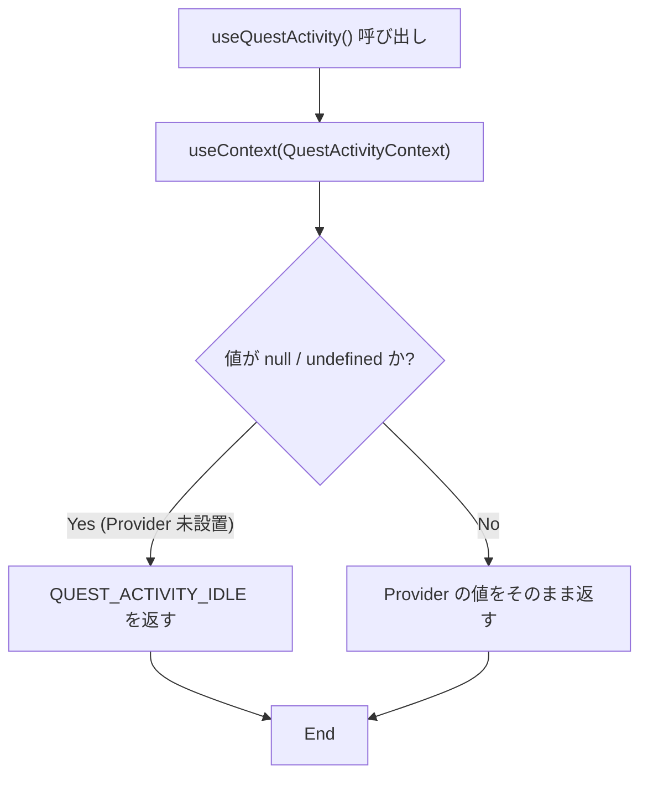
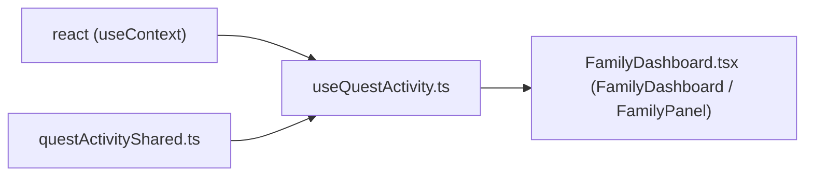

## 1. 解析メタ情報

| 項目 | 内容 |
| --- | --- |
| 対象ファイル | `useQuestActivity.ts` |
| 言語 | React (TypeScript) |
| 解析対象 | 提供されたコードのみ |
| 推測・補完 | 一切なし |

## 関連ドキュメント

- [questActivityShared.md](./questActivityShared.md) — `QuestActivityContext` / `QuestActivityValue` / `QUEST_ACTIVITY_IDLE` の実装元。
- [QuestActivityContext.md](./QuestActivityContext.md) — 本フックが値を取得する `QuestActivityContext.Provider` の実装元。
- [../../family/components/FamilyDashboard.md](../../family/components/FamilyDashboard.md) — 本フックの利用元（`FamilyDashboard` と `FamilyPanel` の2箇所）。
- [../../../context/useSettings.md](../../../context/useSettings.md) — Provider 未設置時に throw する対照的な方針のフック。

## 2. ファイルの概要

* `QuestActivityContext` から進行中のクエスト操作を読むカスタムフック `useQuestActivity` を提供する。
* docstringによれば、Provider が無い場合は「何も進行中でない」既定値(`QUEST_ACTIVITY_IDLE`)を返し、`useSettings` と違って throw しない。理由は「表示専用コンポーネントの単体テストを Provider 無しで書ける状態を保つため」と説明されている。
* 根拠: [docstring] (行番号: 4〜10 / 抜粋: "進行中のクエスト操作(完了通知・送信中キー・承認中id)を読む。")

## 3. 外部依存関係

### インポート一覧

| 名称 | 種類 | 用途 | 根拠 |
| --- | --- | --- | --- |
| `useContext` | React Hook | `QuestActivityContext` が保持する値を取得するため | 根拠: `import { useContext } from 'react';` (行番号: 1 / 抜粋: "import { useContext } from 'react';") |
| `QUEST_ACTIVITY_IDLE` | 定数 | Context が `null`（Provider 未設置）の場合のフォールバック値 | 根拠: `import { QUEST_ACTIVITY_IDLE, QuestActivityContext, QuestActivityValue } from './questActivityShared';` (行番号: 2 / 抜粋: "import { QUEST_ACTIVITY_IDLE, QuestActivityContext, QuestActivityValue } from './questActivityShared';") |
| `QuestActivityContext` | オブジェクト | `useContext` に渡す Context オブジェクト | 根拠: (行番号: 2 / 抜粋: "import { QUEST_ACTIVITY_IDLE, QuestActivityContext, QuestActivityValue } from './questActivityShared';") |
| `QuestActivityValue` | 型 | `useQuestActivity` の戻り値型として使用 | 根拠: (行番号: 2 / 抜粋: "import { QUEST_ACTIVITY_IDLE, QuestActivityContext, QuestActivityValue } from './questActivityShared';") |

### ブラックボックスとなる外部要素

| 名称 | 理由 | 根拠 |
| --- | --- | --- |
| Provider が実際に設置されている範囲 | 本ファイルは `useContext` の結果が `null` かどうかしか見ておらず、どのコンポーネント配下で Provider が有効かは呼び出し元の構造でのみ決まる。 | 根拠: (行番号: 12 / 抜粋: "    return useContext(QuestActivityContext) ?? QUEST_ACTIVITY_IDLE;") |

## 4. 主要要素の定義（関数 / エンドポイント / コンポーネント）

### `useQuestActivity` (export Custom Hook)

* **役割**: `QuestActivityContext` の現在値を返す。Context が `null` の場合は `QUEST_ACTIVITY_IDLE` を返す。
* 根拠: [定義] (行番号: 11〜13 / 抜粋: "export function useQuestActivity(): QuestActivityValue {")
* **引数/リクエスト**: なし。
* 根拠: (行番号: 11 / 抜粋: "export function useQuestActivity(): QuestActivityValue {")
* **戻り値/レスポンス**: `QuestActivityValue`。Provider がある場合はその値、無い場合は `QUEST_ACTIVITY_IDLE`。判定は Nullish 合体演算子 `??` で行うため、Context の値が `null` のときだけフォールバックする。
* 根拠: (行番号: 12 / 抜粋: "    return useContext(QuestActivityContext) ?? QUEST_ACTIVITY_IDLE;")
* **副作用**: `useContext` による購読が張られ、Provider の値が変わると呼び出し元が再レンダーされる。
* 根拠: (行番号: 12 / 抜粋: "    return useContext(QuestActivityContext) ?? QUEST_ACTIVITY_IDLE;")
* **エラーハンドリング**: なし（例外を投げない。これが `useSettings` との明確な違いである）。
* 根拠: [docstring] (行番号: 7〜9 / 抜粋: "Provider が無い場合は「何も進行中でない」既定値を返す(`useSettings` と違って")

## 5. 処理フロー図

## 6. 依存関係図

## 7. 次のステップ（リバースエンジニアリングの提案）

| 優先度 | 対象 | 理由 |
| --- | --- | --- |
| 高 | `family-quest/src/features/quest/context/questActivityShared.ts`（[questActivityShared.md](./questActivityShared.md)） | 戻り値の型と `QUEST_ACTIVITY_IDLE` の中身の定義元。 |
| 中 | `family-quest/src/features/family/components/FamilyDashboard.tsx`（[FamilyDashboard.md](../../family/components/FamilyDashboard.md)） | 本フックの唯一の利用元。どのフィールドをどこへ渡しているかは利用側にしかない。 |

## 8. 保守上の注意点

* **Provider の付け忘れが例外にならない。** docstringが説明するとおり throw しない設計なので、配線が切れても「何も進行中でない表示」として黙って成立してしまう。Provider を挟む位置を変える場合は、組み上がりを見るテスト(`FamilyDashboard.test.tsx`)で「完了した本人のパネルだけがクールダウンに入る」等が落ちることを確認すること。
* 根拠: [docstring] (行番号: 7〜9 / 抜粋: "Provider が無い場合は「何も進行中でない」既定値を返す(`useSettings` と違って")
* **フォールバックの判定は `??` なので、Provider が `null` 以外の falsy な値を流す場合は動作が変わる。** 現状の `QuestActivityContext` は `QuestActivityValue | null` 型なので問題は起きない。
* 根拠: (行番号: 12 / 抜粋: "    return useContext(QuestActivityContext) ?? QUEST_ACTIVITY_IDLE;")

## 9. 不明事項一覧

| 不明点 | 理由 | 確認先 |
| --- | --- | --- |
| Provider が設置されている実際の範囲 | 本ファイルには含まれない。 | `family-quest/src/App.tsx` |
| `useSettings` が throw する方針を採っている理由 | 本ファイルは「違って throw しない」と対比するのみで、あちら側の理由は書かれていない。 | `family-quest/src/context/useSettings.ts` |

## 10. 自己検証結果

- [x] 4章のすべての記述に「根拠」を付けたか → 付けた
- [x] ソースコードのみを根拠にしたか（推測・補完を書いていないか） → 書いていない
- [x] 分からないことを9章の不明事項に正直に書いたか → 書いた
- [x] 10セクション構成に従っているか → 従っている
- [x] 日本語で書いたか → 書いた
