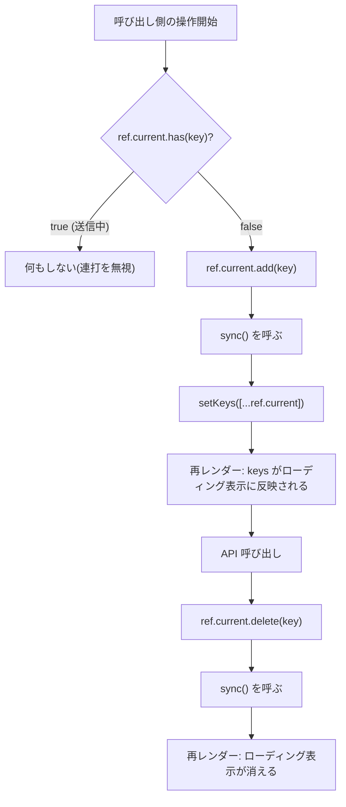
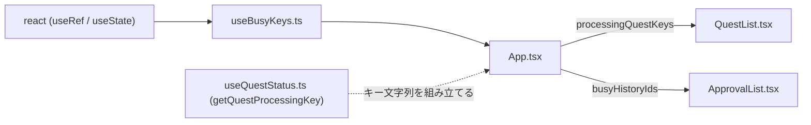

## 1. 解析メタ情報

| 項目 | 内容 |
| --- | --- |
| 対象ファイル | `useBusyKeys.ts` |
| 言語 | React (TypeScript) |
| 解析対象 | 提供されたコードのみ |
| 推測・補完 | 一切なし |

## 関連ドキュメント

- [App.md](../../../../App.md) — 本フックの唯一の利用元。`approvingHistoryIds`（承認中の履歴id）と `processingQuestKeys`（完了/取消が送信中のキー）の2箇所で使う。
- [useQuestStatus.md](./useQuestStatus.md) — `processingQuestKeys` に入れるキー文字列 `"<user_id>:<quest_id>"` を組み立てる `getQuestProcessingKey` の定義元。
- [QuestList.md](../components/QuestList.md) — `processingQuestKeys` を受け取ってカードのローディング表示を出す側。
- [ApprovalList.md](../components/ApprovalList.md) — `busyHistoryIds`（= `approvingHistoryIds`）を受け取って承認ボタンのローディング表示を出す側。

## 2. ファイルの概要

* 「送信中のキーの集合」を、判定用の `ref` と表示用の `state` の**二重**で持つためのCustom Hook `useBusyKeys` と、その戻り値の型 `BusyKeys<T>` を提供する。
* docstringによれば、`App.tsx` には同じ形の二重化が2つ書かれており（承認中の history id / 完了・取消が送信中の `(user_id, quest_id)` キー）、いずれも「判定は同期的な `ref`、見た目だけ `state` に追従させる」という #101 以来のパターンである。連打はレンダーの反映を待たずに起きるため `useState` の値で「もう送信中か」を判定すると1回目の更新が反映される前に2回目が通ってしまい、かといって `ref` だけでは再レンダーが起きずボタンのローディング表示が出ない、と説明されている。
* 根拠: [モジュールdocstring] (行番号: 3〜18 / 抜粋: "「送信中のキー集合」を ref と state の二重で持つためのフック(#659)。")
* `sync()` を呼ぶ責務はフック側に取り込まず呼び出し側に残してある。docstringによれば、これは「複数キーをまとめて登録してから1回だけ同期したい」という既存の使い方（`handleApproveAll`）を壊さないためである。
* 根拠: [sync の責務に関するdocstring] (行番号: 15〜17 / 抜粋: "判定用の `ref` と表示用の `keys` がずれないよう、`sync()` を呼ぶ責務は")

## 3. 外部依存関係

### インポート一覧

| 名称 | 種類 | 用途 | 根拠 |
| --- | --- | --- | --- |
| `useRef` | React Hook | 再レンダーを待たずに読み書きできる判定用の `Set` を保持するため。 | `import { useRef, useState } from 'react';` (行番号: 1 / 抜粋: "import { useRef, useState } from 'react';") |
| `useState` | React Hook | 表示用の配列を保持し、`sync()` で再レンダーを起こすため。 | `import { useRef, useState } from 'react';` (行番号: 1 / 抜粋: "import { useRef, useState } from 'react';") |

### ブラックボックスとなる外部要素

| 名称 | 理由 | 根拠 |
| --- | --- | --- |
| 型パラメータ `T` の実体 | 本ファイルは `T` に制約を課しておらず、`Set` のキーとして使えること以外の前提を持たない。実際にどの型で使われるかは呼び出し元（`App.tsx`）でのみ決まる。 | 根拠: [型パラメータ宣言] (行番号: 28 / 抜粋: "export function useBusyKeys<T>(): BusyKeys<T> {") |

## 4. 主要要素の定義（関数 / エンドポイント / コンポーネント）

### `BusyKeys<T>` (export interface)

* **役割**: `useBusyKeys` の戻り値の形を定義する。判定用の `ref`、表示用の `keys`、両者を同期させる `sync` の3要素からなる。
* 根拠: [定義] (行番号: 19〜26 / 抜粋: "export interface BusyKeys<T> {")
* **メンバー**:
  * `ref: { current: Set<T> }` — 判定用。コメントによれば「常に Set が入っており null にならない」。`React.RefObject` ではなくオブジェクト型で書かれている。
  * 根拠: (行番号: 20〜21 / 抜粋: "/** 判定用。再レンダーを待たずに読み書きできる(常に Set が入っており null にならない)。 */", "    ref: { current: Set<T> };")
  * `keys: T[]` — 表示用。コメントによれば「`sync()` を呼んだ時点の `ref` の内容」。
  * 根拠: (行番号: 22〜23 / 抜粋: "/** 表示用。`sync()` を呼んだ時点の `ref` の内容。 */", "    keys: T[];")
  * `sync: () => void` — コメントによれば「`ref` の現在値を `keys` へ写して再レンダーさせる」。
  * 根拠: (行番号: 24〜25 / 抜粋: "/** `ref` の現在値を `keys` へ写して再レンダーさせる。 */", "    sync: () => void;")

### `useBusyKeys<T>` (export Custom Hook)

* **役割**: 空の `Set<T>` を持つ `ref` と、空配列で初期化した `keys` state を作り、`ref` の現在値を配列に展開して `keys` へ書き込む `sync` とともに返す。
* 根拠: [定義] (行番号: 28〜33 / 抜粋: "export function useBusyKeys<T>(): BusyKeys<T> {")
* **引数/リクエスト**: なし（型パラメータ `T` のみ）。
* 根拠: (行番号: 28 / 抜粋: "export function useBusyKeys<T>(): BusyKeys<T> {")
* **戻り値/レスポンス**: `BusyKeys<T>`。`{ ref, keys, sync }` をそのまま返す。
* 根拠: (行番号: 32 / 抜粋: "    return { ref, keys, sync };")
* **副作用**: `sync()` を呼んだときに `setKeys` が走り、コンポーネントが再レンダーされる。`ref.current` への追加・削除は呼び出し側が直接行うため、本フック自身は `ref` の中身を変更しない。
* 根拠: (行番号: 29〜31 / 抜粋: "    const ref = useRef<Set<T>>(new Set());", "    const [keys, setKeys] = useState<T[]>([]);", "    const sync = () => setKeys([...ref.current]);")
* **エラーハンドリング**: なし（例外を投げうる処理を含まない）。

## 5. 処理フロー図

## 6. 依存関係図

## 7. 次のステップ（リバースエンジニアリングの提案）

| 優先度 | 対象 | 理由 |
| --- | --- | --- |
| 高 | `family-quest/src/App.tsx`（[App.md](../../../../App.md)） | 本フックの唯一の利用元。`ref` への追加・削除と `sync()` の呼び分け（特に `handleApproveAll` が複数キーをまとめて登録してから1回だけ同期する箇所）は App 側にあり、本ファイルだけでは実際の使われ方が分からない。 |
| 中 | `family-quest/src/features/quest/hooks/useQuestStatus.ts`（[useQuestStatus.md](./useQuestStatus.md)） | `processingQuestKeys` に入るキー文字列の組み立て規則（`getQuestProcessingKey`）を確認するため。 |

## 8. 保守上の注意点

* **`sync()` を呼ぶ責務は呼び出し側にある。** `ref.current` を変更したあと `sync()` を呼び忘れると、判定は正しく効くのに画面のローディング表示だけが更新されない、という気づきにくい不整合になる。
* 根拠: [sync の責務に関するdocstring] (行番号: 15〜17 / 抜粋: "判定用の `ref` と表示用の `keys` がずれないよう、`sync()` を呼ぶ責務は")
* **`keys` は `ref.current` のスナップショット（別配列）である。** `[...ref.current]` で新しい配列を作っているため、描画側が掴んだ配列はあとから `ref` を触っても変わらない。ここを `Set` の参照そのままにすると、描画側から見て内容が黙って書き換わる。
* 根拠: (行番号: 31 / 抜粋: "    const sync = () => setKeys([...ref.current]);")
* **判定に `keys`（state）を使ってはいけない。** docstringが説明するとおり、state の値で判定すると1回目の更新が反映される前の2回目の操作を通してしまう。判定は必ず `ref.current` に対して行う。
* 根拠: [モジュールdocstring] (行番号: 10〜13 / 抜粋: "どちらも**判定は同期的な ref で、見た目だけ state に追従させる**という #101 以来の")

## 9. 不明事項一覧

| 不明点 | 理由 | 確認先 |
| --- | --- | --- |
| docstringが参照する Issue #101 / #391 / #659 の詳細な経緯 | 本ファイル内にはコメントとして要約が書かれているのみで、元の不具合の再現条件や議論の全体像はリポジトリ外（GitHub Issues）にある。 | GitHub Issues |
| `T` に実際に使われる型 | 本ファイルは型パラメータに制約を課していないため、`ID`（履歴id）と `string`（キー文字列）のどちらで使われるかは呼び出し元でのみ決まる。 | `family-quest/src/App.tsx` |

## 10. 自己検証結果

- [x] 4章のすべての記述に「根拠」を付けたか → 付けた
- [x] ソースコードのみを根拠にしたか（推測・補完を書いていないか） → 書いていない
- [x] 分からないことを9章の不明事項に正直に書いたか → 書いた
- [x] 10セクション構成に従っているか → 従っている
- [x] 日本語で書いたか → 書いた
