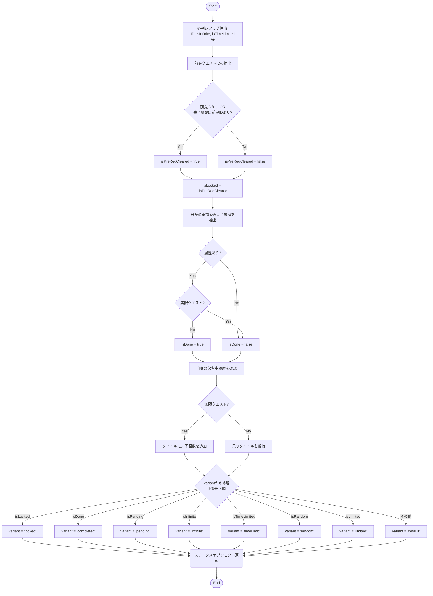
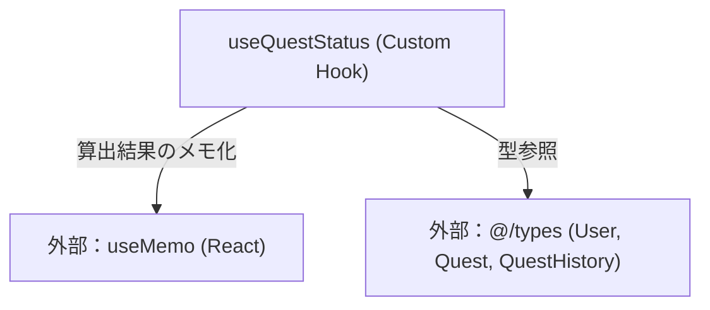

## 1. 解析メタ情報

| 項目 | 内容 |
| --- | --- |
| 対象ファイル | `useQuestStatus.ts` |
| 言語 | React (TypeScript) |
| 解析対象 | 提供されたコードのみ |
| 推測・補完 | 一切なし |

## 2. ファイルの概要

* 現在のユーザー情報、対象クエストの詳細情報、および完了・保留クエストの履歴データを基に、該当クエストの現在の進行状態（完了、保留、ロックなど）、表示用タイトル、UI表示用バリエーション（`variant`）を判定・算出する Custom Hook である。
* 算出処理は `useMemo` でラップされており、不要な再計算を防ぐ最適化が施されている。

## 3. 外部依存関係

### インポート一覧

| 名称 | 種類 | 用途 | 根拠 |
| --- | --- | --- | --- |
| `useMemo` | React Hook | 状態判定の算出結果をメモ化し、パフォーマンスを最適化するため。 | `import { useMemo } from 'react';` (行番号: 1 / 抜粋: "import { useMemo } from 'react'") |
| `User`, `Quest`, `QuestHistory` | 型定義 | Custom Hook の引数である `UseQuestStatusProps` の型を定義するため。 | `import { User, Quest, QuestHistory } from '@/types';` (行番号: 2 / 抜粋: "import { User, Quest, Que...") |

### ブラックボックスとなる外部要素

| 名称 | 理由 | 根拠 |
| --- | --- | --- |
| `@/types` (外部モジュール) | `User`、`Quest`、`QuestHistory` の完全なスキーマ定義が本ファイル内に存在しないため、コード内でアクセスされているプロパティ（`quest_id`, `type`, `status` など）以外の全体像は判断不可。 | `import { User, Quest, QuestHistory } from '@/types';` (行番号: 2 / 抜粋: "import { User, Quest, Que...") |

## 4. 主要要素の定義（関数 / エンドポイント / コンポーネント）

### `useQuestStatus`

* **役割**: クエストの属性、ユーザー情報、履歴情報から現在のクエストの進行状態、ロック状態、UI表示用のバリエーションを計算・判定し、メモ化されたオブジェクトとして返す。
* 根拠: `useQuestStatus` (行番号: 11〜82 / 抜粋: "export const useQuestStatus =")

* **引数/リクエスト**: `UseQuestStatusProps` (オブジェクト: `quest`, `currentUser`, `completedQuests`, `pendingQuests` を含む)
* 根拠: `UseQuestStatusProps` (行番号: 4〜9 / 抜粋: "interface UseQuestStatusProps")

* **戻り値/レスポンス**: クエストステータスを含むオブジェクト (`isDone`, `isPending`, `isInfinite`, `isRandom`, `isTimeLimited`, `isLimited`, `isLocked`, `displayTitle`, `variant`)
* 根拠: `return` (行番号: 68〜78 / 抜粋: "return { isDone, isPending, ...")

* **副作用**: なし
* 根拠: `useQuestStatus` (行番号: 11〜82 / 抜粋: "export const useQuestStatus =") ※外部API呼び出しやステート更新等が存在しないため。

* **エラーハンドリング**: なし
* 根拠: `useQuestStatus` (行番号: 11〜82 / 抜粋: "export const useQuestStatus =") ※例外処理（try-catchやthrow）が存在しないため。

---

## 5. 処理フロー図

## 6. 依存関係図

## 7. 次のステップ（リバースエンジニアリングの提案）

| 優先度 | ファイル名(推測可) | 理由 | 根拠 |
| --- | --- | --- | --- |
| 高 | `@/types` の定義ファイル | 本ファイル内で `quest_id |  |
| 中 | 本Hookを呼び出している親コンポーネントまたは状態管理ファイル | `completedQuests` に「今日」のデータのみが渡される前提となっているため、その絞り込みが正しく実行されているか確認する必要がある。 | `// completedQuests には「今日」の承認済みデータのみが入っている前提` (行番号: 25) |

## 8. 保守上の注意点

* **型・APIレスポンスの非統一性**: `quest_id || quest.id`、および `quest.type || quest.quest_type || quest._isInfinite` といったフォールバック処理が存在し、バックエンドAPIとフロントエンドで型の不一致や移行期間中の仕様が混在している。該当プロパティの変更時に影響が出る可能性が高い。
* **外部からの入力前提**: 前提クエストの判定ロジックは「`completedQuests` に『今日』の承認済みデータのみが入っている」というコメント上の仕様に強く依存している。親コンポーネント側で履歴データの絞り込み条件が変わると、意図せずロック状態が解除・維持されるバグに繋がる。

## 9. 不明事項一覧

| 項目 | 理由 | 必要なファイル |
| --- | --- | --- |
| `Quest` オブジェクトの完全なスキーマ | ファイル内で使われている `quest_id`, `id`, `type`, `quest_type`, `_isInfinite` などのプロパティがなぜ混在しているのか、本来どの値が正なのかを特定するため。 | `@/types` 関連ファイル |
| 履歴データ（`completedQuests`）の取得・抽出ロジック | 本当に「今日」の承認済みデータだけがHookに渡されているかを客観的に確認するため。 | 本Hookの呼び出し元コンポーネント（GameSystem関連） |

## 10. 自己検証結果

* [x] 推測・外部ファイルの仕様を一切含んでいない
* [x] 全関数・全クラス・全コンポーネントを列挙した
* [x] 全てのインポート要素を列挙した
* [x] すべての仕様説明に「根拠（行番号・抜粋）」を明記した
* [x] 根拠漏れが0件である
* [x] Mermaid構文にエラーの原因となる記号（エスケープ漏れ）がない
* [x] 不明事項を漏れなく列挙した

完了